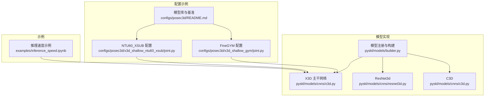
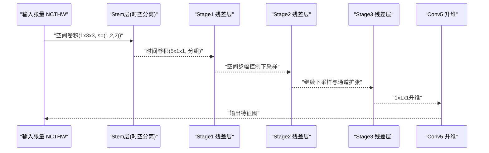
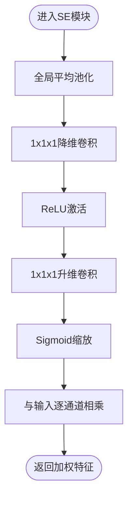
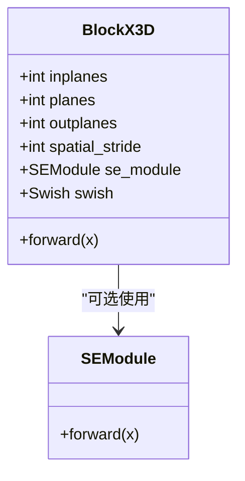
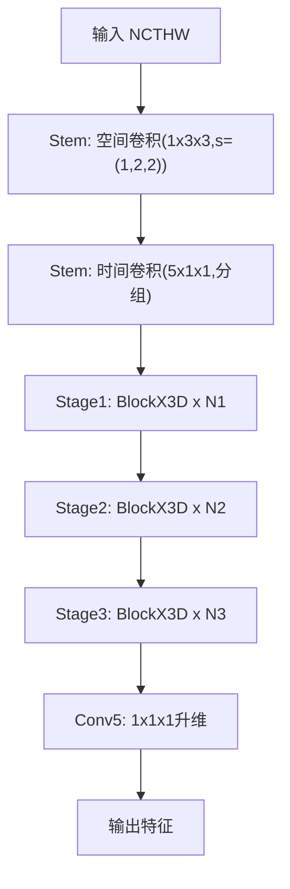
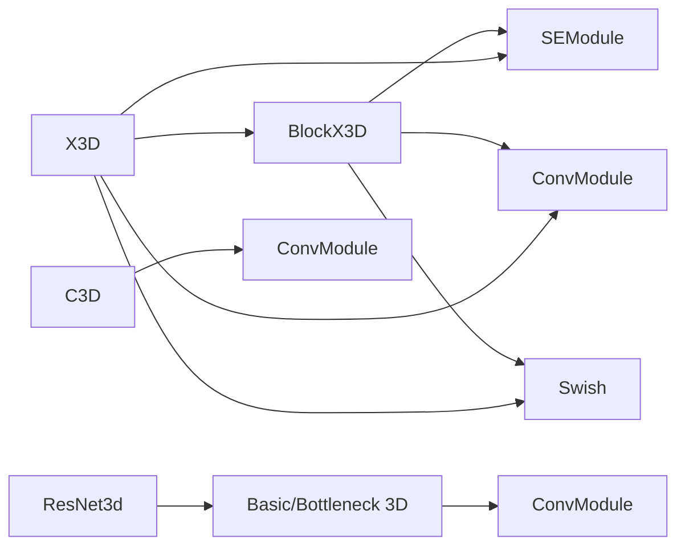
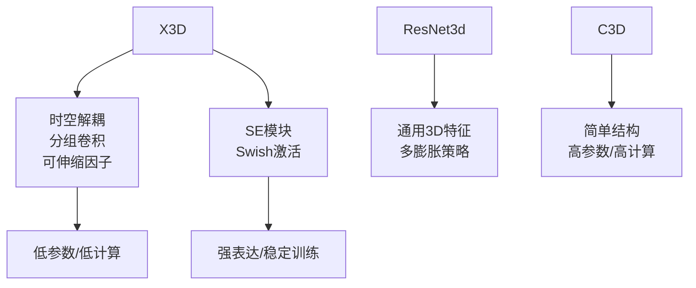

# X3D网络

<cite>
**本文引用的文件**
- [x3d.py](file://pyskl/models/cnns/x3d.py)
- [resnet3d.py](file://pyskl/models/cnns/resnet3d.py)
- [c3d.py](file://pyskl/models/cnns/c3d.py)
- [builder.py](file://pyskl/models/builder.py)
- [x3d_shallow_ntu60_xsub/joint.py](file://configs/posec3d/x3d_shallow_ntu60_xsub/joint.py)
- [x3d_shallow_gym/joint.py](file://configs/posec3d/x3d_shallow_gym/joint.py)
- [README.md](file://configs/posec3d/README.md)
- [inference_speed.ipynb](file://examples/inference_speed.ipynb)
</cite>

## 目录
1. [简介](#简介)
2. [项目结构](#项目结构)
3. [核心组件](#核心组件)
4. [架构总览](#架构总览)
5. [详细组件分析](#详细组件分析)
6. [依赖关系分析](#依赖关系分析)
7. [性能与效率考量](#性能与效率考量)
8. [故障排查指南](#故障排查指南)
9. [结论](#结论)
10. [附录](#附录)

## 简介
本文件系统性阐述PySKL中X3D主干网络的设计理念、实现细节与工程实践。X3D通过时空解耦的卷积设计（时间维度与空间维度分别建模）、通道与深度的可伸缩因子、以及轻量化的残差块结构，在保持高精度的同时显著降低参数量与计算开销，特别适用于骨架动作识别等对实时性有要求的任务场景。本文将从架构原理、层次设计、参数配置、部署建议、性能基准与对比分析等方面进行深入解析，并给出可视化流程图与序列图帮助理解。

## 项目结构
围绕X3D的相关代码与配置主要分布在以下位置：
- 主干网络实现：pyskl/models/cnns/x3d.py
- 其他3D网络对比：pyskl/models/cnns/resnet3d.py、pyskl/models/cnns/c3d.py
- 模型构建注册：pyskl/models/builder.py
- 配置示例：configs/posec3d/x3d_shallow_ntu60_xsub/joint.py、configs/posec3d/x3d_shallow_gym/joint.py
- 模型库与基准：configs/posec3d/README.md
- 推理速度示例：examples/inference_speed.ipynb

图表来源
- [x3d.py](file://pyskl/models/cnns/x3d.py#L160-L196)
- [resnet3d.py](file://pyskl/models/cnns/resnet3d.py#L1-L200)
- [c3d.py](file://pyskl/models/cnns/c3d.py#L1-L100)
- [builder.py](file://pyskl/models/builder.py#L1-L39)
- [x3d_shallow_ntu60_xsub/joint.py](file://configs/posec3d/x3d_shallow_ntu60_xsub/joint.py#L1-L78)
- [x3d_shallow_gym/joint.py](file://configs/posec3d/x3d_shallow_gym/joint.py#L1-L78)
- [README.md](file://configs/posec3d/README.md#L27-L39)
- [inference_speed.ipynb](file://examples/inference_speed.ipynb#L121-L176)

章节来源
- [x3d.py](file://pyskl/models/cnns/x3d.py#L160-L196)
- [builder.py](file://pyskl/models/builder.py#L1-L39)

## 核心组件
- SE模块（Squeeze-and-Excitation）：用于通道注意力，按比例压缩后重建通道重要性权重，提升特征表达能力。
- BlockX3D：X3D的基本残差块，包含1×1×1压缩、3×3×3深度卷积（通道分组）、1×1×1升维，支持可选SE与Swish激活。
- X3D主干：由“时空分离的stem层 + 多阶段残差层”构成，支持通道宽度、瓶颈比、深度的可伸缩因子，以及可选的SE插入策略。

章节来源
- [x3d.py](file://pyskl/models/cnns/x3d.py#L12-L42)
- [x3d.py](file://pyskl/models/cnns/x3d.py#L45-L156)
- [x3d.py](file://pyskl/models/cnns/x3d.py#L160-L296)

## 架构总览
X3D的核心思想是“时间-空间解耦”的3D卷积设计：
- Stem层：先进行空间卷积（1×3×3，步幅(1,2,2)），再进行时间卷积（5×1×1，分组卷积，BN+激活），形成时空特征金字塔的起点。
- 残差块：以1×1×1降维、3×3×3深度卷积（通道分组）、1×1×1升维为主干，残差连接，可选SE与Swish。
- 阶段化下采样：通过每个阶段的空间步幅控制感受野增长，同时按2的幂次扩大通道宽度，实现高效的空间-时间特征提取。

图表来源
- [x3d.py](file://pyskl/models/cnns/x3d.py#L415-L438)
- [x3d.py](file://pyskl/models/cnns/x3d.py#L260-L283)
- [x3d.py](file://pyskl/models/cnns/x3d.py#L285-L296)

## 详细组件分析

### SE模块（通道注意力）
- 设计要点：全局平均池化→降维→ReLU→升维→Sigmoid→通道加权。
- 参数：按通道宽度乘子进行降维，避免冗余参数。
- 作用：自适应地强调重要通道，抑制冗余信息，提升判别力。

图表来源
- [x3d.py](file://pyskl/models/cnns/x3d.py#L12-L42)

章节来源
- [x3d.py](file://pyskl/models/cnns/x3d.py#L12-L42)

### BlockX3D（X3D残差块）
- 结构组成：conv1(1×1×1)→conv2(3×3×3, 分组)→SE(可选)→Swish(可选)→conv3(1×1×1)→残差连接→最终激活。
- 关键特性：
  - 3×3×3卷积采用通道分组，降低参数与计算。
  - 支持空间步幅仅在conv2中引入，避免时间维度的过度下采样。
  - 可选SE模块与Swish激活，兼顾精度与效率。
- 下采样策略：当输入通道与输出不一致或空间步幅>1时，使用1×1×1卷积进行维度匹配与下采样。

图表来源
- [x3d.py](file://pyskl/models/cnns/x3d.py#L45-L156)

章节来源
- [x3d.py](file://pyskl/models/cnns/x3d.py#L45-L156)

### X3D主干网络
- 可伸缩因子：
  - gamma_w：基础通道宽度乘子，影响所有阶段通道数。
  - gamma_b：瓶颈通道乘子，决定中间通道的扩张程度。
  - gamma_d：深度乘子，按ceil规则增加阶段层数。
- 阶段化设计：支持1~4阶段，每阶段按2的幂扩大通道，空间步幅控制下采样。
- 冻结策略：可冻结前两层（stem）以稳定预训练初始化。
- 初始化：卷积采用Kaiming初始化，BN常数初始化；可选零初始化残差分支。

图表来源
- [x3d.py](file://pyskl/models/cnns/x3d.py#L415-L438)
- [x3d.py](file://pyskl/models/cnns/x3d.py#L260-L296)

章节来源
- [x3d.py](file://pyskl/models/cnns/x3d.py#L160-L296)

### 配置与使用示例
- NTU60 XSub（关节模态）：输入17个关节点的热力图，3阶段网络，空间步幅均为2，分类头为I3DHead，最终通道数为216。
- FineGYM（关节模态）：输入17个关节点的热力图，3阶段网络，空间步幅均为2，分类头为I3DHead，最终通道数为216。
- 训练设置：多GPU分布式训练，余弦退火学习率调度，多裁剪测试策略（可简化以加速推理）。

章节来源
- [x3d_shallow_ntu60_xsub/joint.py](file://configs/posec3d/x3d_shallow_ntu60_xsub/joint.py#L1-L78)
- [x3d_shallow_gym/joint.py](file://configs/posec3d/x3d_shallow_gym/joint.py#L1-L78)
- [README.md](file://configs/posec3d/README.md#L27-L39)

## 依赖关系分析
- 模型注册：X3D通过BACKBONES注册表对外暴露，供上层识别器构建。
- 组件依赖：
  - BlockX3D依赖ConvModule、Swish、SEModule。
  - X3D依赖ConvModule、Swish、SEModule、批量归一化。
- 对比对象：
  - ResNet3d：3D残差块，支持膨胀策略与多种膨胀风格，适合通用3D视觉任务。
  - C3D：经典3D卷积网络，结构简单，参数量较大，适合视频理解但计算成本较高。

图表来源
- [x3d.py](file://pyskl/models/cnns/x3d.py#L45-L156)
- [resnet3d.py](file://pyskl/models/cnns/resnet3d.py#L13-L196)
- [c3d.py](file://pyskl/models/cnns/c3d.py#L10-L99)

章节来源
- [builder.py](file://pyskl/models/builder.py#L1-L39)
- [x3d.py](file://pyskl/models/cnns/x3d.py#L160-L196)

## 性能与效率考量

### 轻量化设计原理
- 时空解耦：先空间卷积再时间卷积，避免全3D卷积的高复杂度。
- 分组卷积：3×3×3深度卷积采用通道分组，显著降低参数与计算。
- 可伸缩因子：通过gamma_w、gamma_b、gamma_d灵活控制模型规模，适配不同算力与精度需求。
- 激活与注意力：Swish激活与SE模块在提升表达力的同时保持较低额外开销。

### 计算与内存估算思路
- 参数量：主要来源于conv1、conv2（分组）、conv3与可选SE模块；随gamma_w、gamma_b、gamma_d线性或近似线性增长。
- 计算量：与输入体积、通道数、卷积核数量成正比；分组卷积与较小的时间核有效降低FLOPs。
- 内存占用：主要受特征图尺寸与通道数影响；可通过减小gamma_w或降低输入分辨率缓解。

### 实时推理与部署建议
- 推理速度示例：在骨架热力图输入（batch=8, 17关节点, 48帧, 56×56）下，可参考示例脚本进行FPS评测。
- 多裁剪测试：默认使用多裁剪（num_clips=10）以提升稳定性，若需更快推理可改为单裁剪。
- 冻结层：训练后可冻结stem层以稳定特征，减少微调时的波动。
- 预训练加载：支持从外部权重加载，便于迁移学习与快速收敛。

章节来源
- [inference_speed.ipynb](file://examples/inference_speed.ipynb#L121-L176)
- [x3d.py](file://pyskl/models/cnns/x3d.py#L440-L456)
- [x3d_shallow_ntu60_xsub/joint.py](file://configs/posec3d/x3d_shallow_ntu60_xsub/joint.py#L47-L56)

## 故障排查指南
- 权重加载失败：确认预训练权重路径正确，或关闭strict模式以忽略不匹配键。
- 归一化模式问题：若使用BN评估模式，注意在train(False)时将BN设为eval。
- 冻结层无效：确保frozen_stages≥0且在train模式切换时调用冻结逻辑。
- 输入形状不匹配：确保输入格式为NCTHW_Heatmap，且通道数与配置一致。

章节来源
- [x3d.py](file://pyskl/models/cnns/x3d.py#L457-L476)
- [x3d.py](file://pyskl/models/cnns/x3d.py#L495-L503)

## 结论
X3D通过“时空解耦+分组卷积+可伸缩因子+注意力”的组合，在骨架动作识别等任务中实现了更高的效率与更好的泛化能力。其轻量化设计与灵活的规模控制使其在资源受限场景下仍具备竞争力。结合PySKL的配置与示例，用户可在不同数据集与硬件条件下快速搭建与部署X3D主干网络，并通过多裁剪测试与冻结策略进一步平衡精度与速度。

## 附录

### X3D与常见3D网络对比（概念性）
- 与ResNet3d对比：ResNet3d强调通用3D特征抽取，支持多种膨胀策略；X3D强调高效与轻量化，更适合大规模骨架热力图输入。
- 与C3D对比：C3D结构简单、参数量大；X3D通过分组卷积与可伸缩因子显著降低参数与计算成本。

[此图为概念性对比，不直接映射具体源码文件]

### X3D配置参数速查
- gamma_w：基础通道宽度乘子（影响所有阶段通道数）
- gamma_b：瓶颈通道乘子（中间通道扩张）
- gamma_d：深度乘子（按ceil增加层数）
- num_stages：阶段数（1~4）
- stage_blocks：各阶段残差块数
- spatial_strides：各阶段空间步幅
- se_style：SE插入策略（'all'或'half'）
- se_ratio：SE降维比例
- use_swish：是否使用Swish激活
- base_channels：基础通道数
- in_channels：输入通道（骨架热力图通道数）

章节来源
- [x3d.py](file://pyskl/models/cnns/x3d.py#L164-L196)
- [x3d.py](file://pyskl/models/cnns/x3d.py#L298-L317)