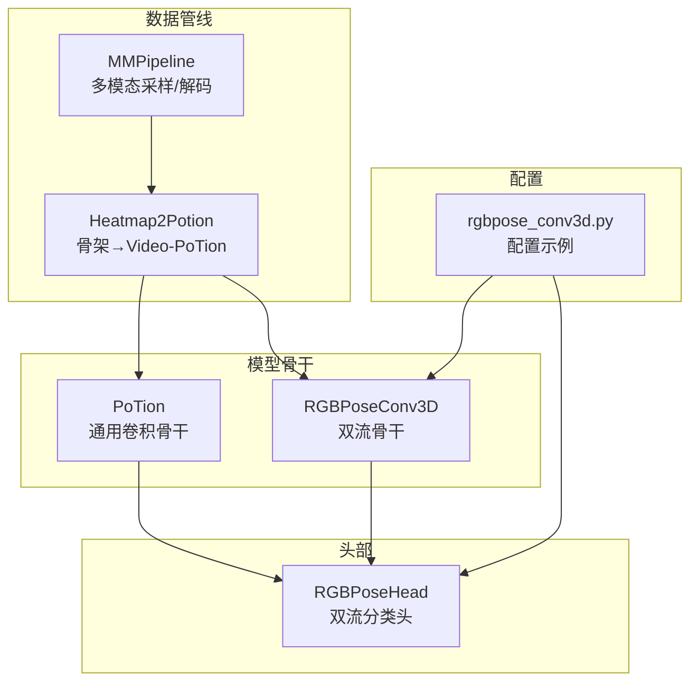
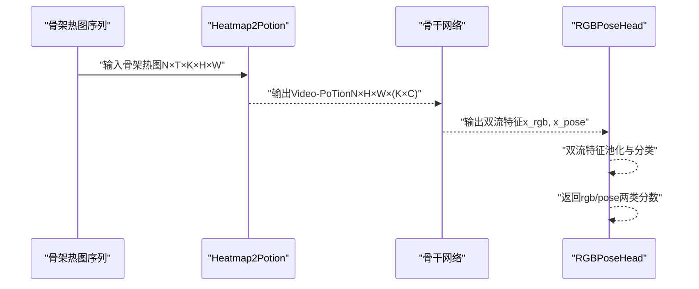
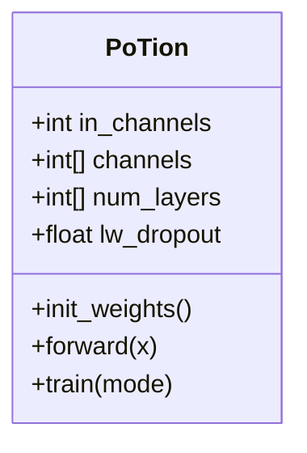
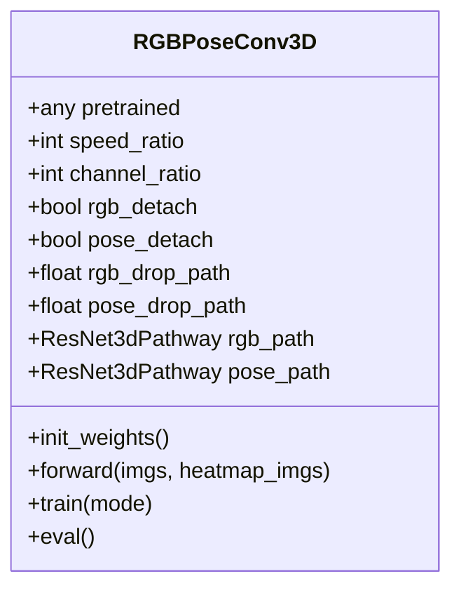
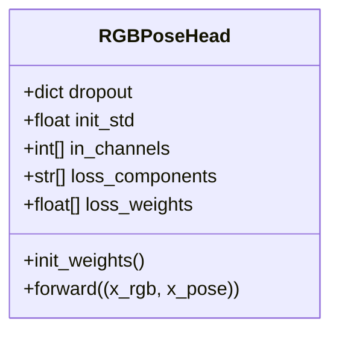
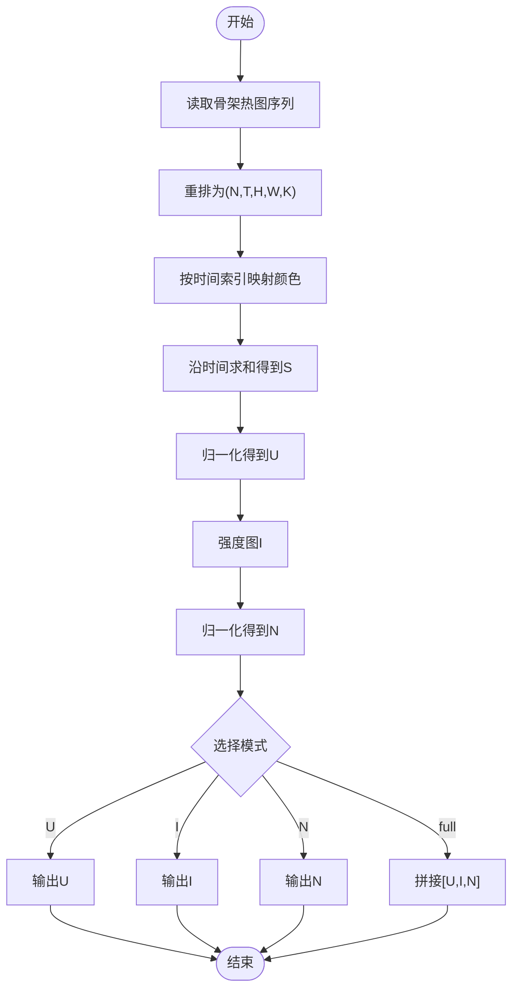
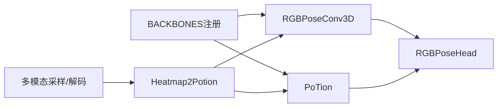

# POTION网络

<cite>
**本文引用的文件**
- [potion.py](file://pyskl/models/cnns/potion.py)
- [rgbposeconv3d.py](file://pyskl/models/cnns/rgbposeconv3d.py)
- [rgbpose_head.py](file://pyskl/models/heads/rgbpose_head.py)
- [multi_modality.py](file://pyskl/datasets/pipelines/multi_modality.py)
- [heatmap_related.py](file://pyskl/datasets/pipelines/heatmap_related.py)
- [__init__.py](file://pyskl/models/cnns/__init__.py)
- [rgbpose_conv3d.py](file://configs/rgbpose_conv3d/rgbpose_conv3d.py)
- [README.md](file://configs/rgbpose_conv3d/README.md)
- [README.md](file://README.md)
</cite>

## 目录
1. [简介](#简介)
2. [项目结构](#项目结构)
3. [核心组件](#核心组件)
4. [架构总览](#架构总览)
5. [组件详细分析](#组件详细分析)
6. [依赖关系分析](#依赖关系分析)
7. [性能与优化](#性能与优化)
8. [故障排查指南](#故障排查指南)
9. [结论](#结论)
10. [附录](#附录)

## 简介
本技术文档围绕POTION混合模态网络展开，系统阐述其在多模态特征融合中的创新设计与实现细节。POTION并非单一独立模块，而是通过“骨架热图到彩色时间体积映射”的数据变换（Heatmap2Potion）将骨架伪彩色视频（Video-PoTion）作为输入，再由通用卷积骨干（例如PoTion或RGBPoseConv3D等）进行特征提取与融合。本文将重点说明：
- POTION骨干的结构与参数配置
- 骨架热图到Video-PoTion的生成流程与跨模态对齐思路
- 与RGBPoseConv3D等双流混合策略的对比与适用场景
- 训练策略、优化技巧与性能评估方法

## 项目结构
与POTION相关的代码主要分布在以下模块：
- 模型骨干：PoTion（通用卷积骨干）、RGBPoseConv3D（双流骨干）
- 头部：RGBPoseHead（双流分类头）
- 数据管线：多模态采样与解码、骨架热图生成与Video-PoTion转换
- 配置：RGBPoseConv3D配置示例

图表来源
- [potion.py](file://pyskl/models/cnns/potion.py#L1-L81)
- [rgbposeconv3d.py](file://pyskl/models/cnns/rgbposeconv3d.py#L1-L183)
- [rgbpose_head.py](file://pyskl/models/heads/rgbpose_head.py#L1-L80)
- [multi_modality.py](file://pyskl/datasets/pipelines/multi_modality.py#L1-L230)
- [heatmap_related.py](file://pyskl/datasets/pipelines/heatmap_related.py#L279-L349)
- [rgbpose_conv3d.py](file://configs/rgbpose_conv3d/rgbpose_conv3d.py#L1-L107)

章节来源
- [potion.py](file://pyskl/models/cnns/potion.py#L1-L81)
- [rgbposeconv3d.py](file://pyskl/models/cnns/rgbposeconv3d.py#L1-L183)
- [rgbpose_head.py](file://pyskl/models/heads/rgbpose_head.py#L1-L80)
- [multi_modality.py](file://pyskl/datasets/pipelines/multi_modality.py#L1-L230)
- [heatmap_related.py](file://pyskl/datasets/pipelines/heatmap_related.py#L279-L349)
- [rgbpose_conv3d.py](file://configs/rgbpose_conv3d/rgbpose_conv3d.py#L1-L107)

## 核心组件
- PoTion（通用卷积骨干）
  - 输入通道数可配置；按阶段构建卷积层堆叠，首层步幅为2以降采样，后续步幅为1；支持在每层后插入Dropout（低权重丢弃率）。
  - 权重初始化采用Kaiming与常数初始化策略。
- RGBPoseConv3D（双流骨干）
  - 双分支：RGB慢流与骨架快流，借鉴SlowFast思想；支持横向连接（lateral）与跨模态融合；可配置通道缩放与时间比例；支持丢弃路径（drop-path）正则化。
- RGBPoseHead（双流分类头）
  - 对RGB与骨架特征分别经全局平均池化、Dropout与线性层得到两类分类分数，并支持按组件加权。

章节来源
- [potion.py](file://pyskl/models/cnns/potion.py#L7-L81)
- [rgbposeconv3d.py](file://pyskl/models/cnns/rgbposeconv3d.py#L12-L183)
- [rgbpose_head.py](file://pyskl/models/heads/rgbpose_head.py#L8-L80)

## 架构总览
POTION的“混合模态”本质是将骨架热图序列转换为带时间色度信息的伪彩色视频（Video-PoTion），随后由卷积骨干进行统一特征提取与融合。下图展示了从骨架热图到最终分类分数的关键流程。

图表来源
- [heatmap_related.py](file://pyskl/datasets/pipelines/heatmap_related.py#L280-L349)
- [rgbposeconv3d.py](file://pyskl/models/cnns/rgbposeconv3d.py#L104-L173)
- [rgbpose_head.py](file://pyskl/models/heads/rgbpose_head.py#L59-L79)

## 组件详细分析

### 组件A：PoTion骨干网络
- 结构要点
  - 通过阶段化堆叠的ConvModule构建，首层stride=2实现空间降采样，后续层stride=1维持分辨率。
  - 支持在每层后插入Dropout（低权重丢弃率），有助于正则化。
  - 权重初始化遵循Kaiming与BatchNorm常数初始化。
- 参数与配置
  - in_channels：输入通道数（通常为Video-PoTion的通道数，即K×C）。
  - channels/num_layers：控制阶段数量与每阶段通道数。
  - lw_dropout：低权重丢弃率。
  - conv_cfg/norm_cfg/act_cfg：卷积、归一化与激活配置。
- 适用场景
  - 作为通用骨干，适合直接接收Video-PoTion输入；也可与双流骨干结合用于对比实验。

图表来源
- [potion.py](file://pyskl/models/cnns/potion.py#L8-L81)

章节来源
- [potion.py](file://pyskl/models/cnns/potion.py#L7-L81)

### 组件B：RGBPoseConv3D双流骨干
- 结构要点
  - RGB慢流与骨架快流分别构建，借鉴SlowFast设计；在多个阶段引入横向连接（lateral），实现跨模态早期融合。
  - 可配置通道缩放（channel_ratio）与时间比例（speed_ratio）；支持丢弃路径（drop-path）正则化。
  - 前向过程在关键阶段进行跨模态特征拼接，形成融合特征。
- 参数与配置
  - speed_ratio：快慢流时间维度比例。
  - channel_ratio：快流通道缩放比例。
  - rgb_pathway/pose_pathway：分别定义两分支的阶段数、块数、膨胀、步幅等。
  - rgb_detach/pose_detach：是否对侧向输入进行detach以控制梯度流动。
  - rgb_drop_path/pose_drop_path：丢弃路径概率。
- 适用场景
  - 需要显式双流建模与早期跨模态交互的任务；适合大规模数据集与强监督设置。

图表来源
- [rgbposeconv3d.py](file://pyskl/models/cnns/rgbposeconv3d.py#L12-L183)

章节来源
- [rgbposeconv3d.py](file://pyskl/models/cnns/rgbposeconv3d.py#L12-L183)

### 组件C：RGBPoseHead双流分类头
- 结构要点
  - 对RGB与骨架特征分别执行自适应平均池化至(1,1,1)，展平后经Dropout与线性层得到两类分类分数。
  - 支持按组件指定损失权重与dropout概率。
- 参数与配置
  - in_channels：两分支特征通道数列表。
  - loss_components：损失组件名称列表（如['rgb','pose']）。
  - loss_weights：各组件损失权重。
  - dropout：可为浮点数或字典，分别控制两分支dropout。

图表来源
- [rgbpose_head.py](file://pyskl/models/heads/rgbpose_head.py#L9-L80)

章节来源
- [rgbpose_head.py](file://pyskl/models/heads/rgbpose_head.py#L8-L80)

### 组件D：数据管线与Video-PoTion生成
- 多模态采样与解码
  - 支持对RGB与Pose分别进行均匀采样与解码，确保两模态时间长度与索引一致。
- 骨架热图到Video-PoTion
  - 将骨架热图序列按时间维映射为颜色编码，生成带时间色度的伪彩色体积，再计算归一化与强度信息，最终输出4D张量供骨干网络使用。

图表来源
- [heatmap_related.py](file://pyskl/datasets/pipelines/heatmap_related.py#L280-L349)

章节来源
- [multi_modality.py](file://pyskl/datasets/pipelines/multi_modality.py#L58-L129)
- [heatmap_related.py](file://pyskl/datasets/pipelines/heatmap_related.py#L279-L349)

## 依赖关系分析
- 模型注册与导出
  - PoTion与RGBPoseConv3D均通过BACKBONES注册，便于配置系统调用。
- 骨干与头部耦合
  - RGBPoseConv3D输出双流特征，RGBPoseHead负责双流分类；PoTion可直接接收Video-PoTion输入并配合头部进行分类。
- 数据管线依赖
  - 多模态采样与解码确保RGB与骨架的时间对齐；Heatmap2Potion将骨架热图转换为Video-PoTion，作为统一输入格式。

图表来源
- [__init__.py](file://pyskl/models/cnns/__init__.py#L1-L13)
- [rgbposeconv3d.py](file://pyskl/models/cnns/rgbposeconv3d.py#L12-L183)
- [rgbpose_head.py](file://pyskl/models/heads/rgbpose_head.py#L8-L80)
- [heatmap_related.py](file://pyskl/datasets/pipelines/heatmap_related.py#L280-L349)
- [multi_modality.py](file://pyskl/datasets/pipelines/multi_modality.py#L58-L129)

章节来源
- [__init__.py](file://pyskl/models/cnns/__init__.py#L1-L13)

## 性能与优化
- 初始化策略
  - 卷积层采用Kaiming初始化，批归一化采用常数初始化，确保训练稳定。
- 正则化手段
  - PoTion支持低权重丢弃率；RGBPoseConv3D支持丢弃路径（drop-path）与detach策略，减少过拟合并提升泛化。
- 训练配置参考
  - RGBPoseConv3D配置中包含学习率调度、梯度裁剪、优化器设置与评估指标，可作为训练策略参考。
- 推理加速
  - 仓库README提及对PyTorch 2.0的支持与torch.compile的实验特性，可用于推理加速（需注意性能保证）。

章节来源
- [potion.py](file://pyskl/models/cnns/potion.py#L53-L61)
- [rgbposeconv3d.py](file://pyskl/models/cnns/rgbposeconv3d.py#L83-L102)
- [rgbpose_conv3d.py](file://configs/rgbpose_conv3d/rgbpose_conv3d.py#L95-L107)
- [README.md](file://README.md#L22-L28)

## 故障排查指南
- 输入形状不匹配
  - 确保Video-PoTion的通道数与骨干in_channels一致；若使用RGBPoseConv3D，注意其双流输出与头部输入通道要求。
- 时间对齐问题
  - 多模态采样需确保RGB与Pose的采样长度一致；解码后应检查图像尺寸与关键点坐标的同步缩放。
- 归一化与数值稳定性
  - Video-PoTion生成过程中涉及除零与归一化，注意eps设置与数值范围；必要时检查热图值域与拼接选项。
- 训练不稳定
  - 调整lw_dropout或drop-path概率；检查学习率与梯度裁剪设置；确认数据增强与batch大小适配。

章节来源
- [multi_modality.py](file://pyskl/datasets/pipelines/multi_modality.py#L90-L129)
- [heatmap_related.py](file://pyskl/datasets/pipelines/heatmap_related.py#L280-L349)
- [rgbpose_conv3d.py](file://configs/rgbpose_conv3d/rgbpose_conv3d.py#L95-L107)

## 结论
POTION通过将骨架热图转换为Video-PoTion，实现了对时间维度的显式建模与跨模态对齐，从而在统一的卷积骨干框架下完成多模态特征融合。相较RGBPoseConv3D的显式双流与早期横向连接，POTION更强调通用骨干与Video-PoTion输入的简洁性与可扩展性。两者在不同数据规模与任务需求下各有优势：RGBPoseConv3D适合需要精细双流建模与跨模态交互的场景，而POTION适合追求统一输入与快速部署的场景。

## 附录

### 配置参数说明（RGBPoseConv3D）
- backbone_cfg
  - type：骨干类型（RGBPoseConv3D）
  - speed_ratio：快慢流时间比例
  - channel_ratio：快流通道缩放比例
  - rgb_pathway：RGB慢流配置（阶段数、膨胀、步幅、基础通道等）
  - pose_pathway：骨架快流配置（阶段数、块数、膨胀、步幅、基础通道等）
- head_cfg
  - type：头部类型（RGBPoseHead）
  - num_classes：类别数
  - in_channels：双流特征通道列表
  - loss_components：损失组件（如['rgb','pose']）
  - loss_weights：组件权重
- test_cfg
  - average_clips：测试时的聚合策略
- data与优化
  - train/val/test_pipeline：多模态采样、解码、归一化、格式化等
  - optimizer/lr_config/total_epochs/checkpoint_config/evaluation/log_config/work_dir/load_from：训练超参与日志

章节来源
- [rgbpose_conv3d.py](file://configs/rgbpose_conv3d/rgbpose_conv3d.py#L1-L107)

### 使用指南（基于现有配置）
- 数据准备
  - 准备骨架标注与对应视频（或骨架热图）；确保多模态采样与解码流程正确。
- 生成Video-PoTion
  - 使用Heatmap2Potion将骨架热图序列转换为Video-PoTion，选择合适拼接选项（U/I/N/full）。
- 选择骨干
  - 若追求双流早期融合与精细建模，选用RGBPoseConv3D；若追求统一输入与通用骨干，选用PoTion。
- 训练与评估
  - 参考RGBPoseConv3D配置中的优化器、学习率调度与评估指标进行训练与测试。

章节来源
- [README.md](file://configs/rgbpose_conv3d/README.md#L1-L37)
- [rgbpose_conv3d.py](file://configs/rgbpose_conv3d/rgbpose_conv3d.py#L1-L107)

### 与RGBPoseConv3D的对比分析
- 模型结构
  - RGBPoseConv3D：显式双流（慢/快），多阶段横向连接，跨模态早期融合。
  - PoTion：通用卷积骨干，接收Video-PoTion输入，结构更简洁。
- 适用场景
  - RGBPoseConv3D：强监督、大规模数据、需要精细跨模态交互。
  - PoTion：统一输入、快速部署、对跨模态交互要求相对较低的任务。
- 实验建议
  - 在相同Video-PoTion输入条件下对比两者性能，观察双流融合与通用骨干的差异。

章节来源
- [rgbposeconv3d.py](file://pyskl/models/cnns/rgbposeconv3d.py#L12-L183)
- [rgbpose_head.py](file://pyskl/models/heads/rgbpose_head.py#L8-L80)
- [README.md](file://configs/rgbpose_conv3d/README.md#L1-L37)