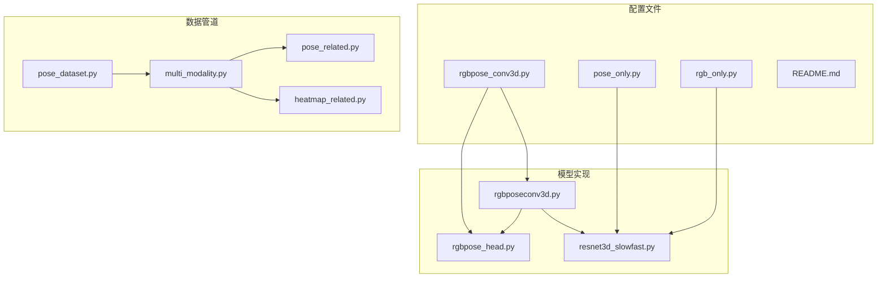
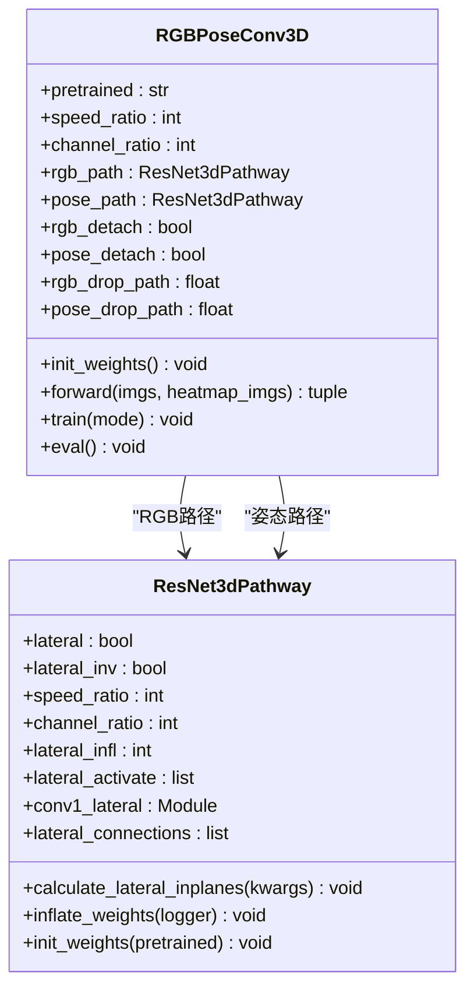
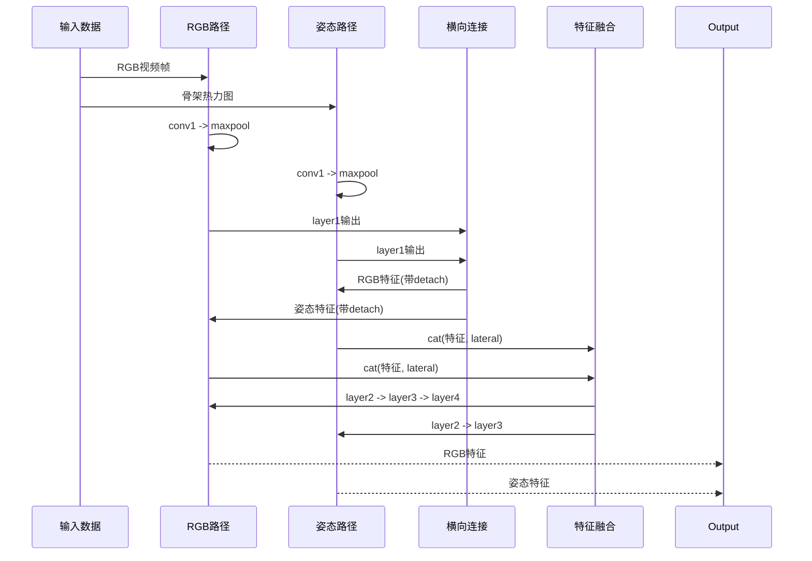
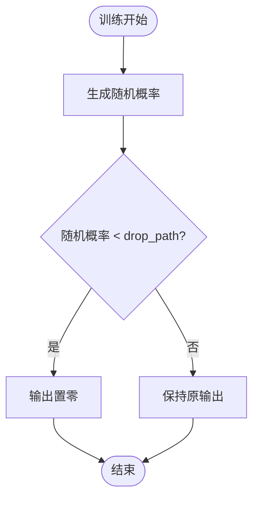
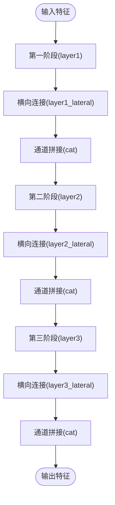
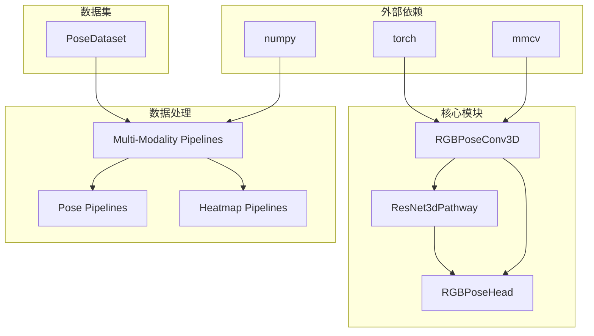

# RGBPoseConv3D网络

<cite>
**本文档引用的文件**
- [rgbpose_conv3d.py](file://configs/rgbpose_conv3d/rgbpose_conv3d.py)
- [README.md](file://configs/rgbpose_conv3d/README.md)
- [pose_only.py](file://configs/rgbpose_conv3d/pose_only.py)
- [rgb_only.py](file://configs/rgbpose_conv3d/rgb_only.py)
- [rgbposeconv3d.py](file://pyskl/models/cnns/rgbposeconv3d.py)
- [resnet3d_slowfast.py](file://pyskl/models/cnns/resnet3d_slowfast.py)
- [rgbpose_head.py](file://pyskl/models/heads/rgbpose_head.py)
- [multi_modality.py](file://pyskl/datasets/pipelines/multi_modality.py)
- [pose_related.py](file://pyskl/datasets/pipelines/pose_related.py)
- [heatmap_related.py](file://pyskl/datasets/pipelines/heatmap_related.py)
- [pose_dataset.py](file://pyskl/datasets/pose_dataset.py)
</cite>

## 目录
1. [简介](#简介)
2. [项目结构](#项目结构)
3. [核心组件](#核心组件)
4. [架构概览](#架构概览)
5. [详细组件分析](#详细组件分析)
6. [依赖关系分析](#依赖关系分析)
7. [性能考虑](#性能考虑)
8. [故障排除指南](#故障排除指南)
9. [结论](#结论)
10. [附录](#附录)

## 简介

RGBPoseConv3D是一个混合模态的人体动作识别网络，它结合了RGB视频和骨架热力图两种模态的信息。该网络采用双流架构设计，借鉴了SlowFast网络的设计理念，实现了RGB路径（对应SlowFast的慢流）和姿态路径（对应SlowFast的快流）的协同工作。

该网络的核心创新在于早期特征融合机制，通过横向连接在不同阶段实现两个模态之间的信息交换，从而充分利用RGB视频的外观信息和骨架热力图的时间变化特征。网络设计考虑了不同的速度比和通道数缩减策略，以平衡计算复杂度和识别性能。

## 项目结构

RGBPoseConv3D网络的项目结构主要包含以下关键部分：

**图表来源**
- [rgbpose_conv3d.py](file://configs/rgbpose_conv3d/rgbpose_conv3d.py#L1-L107)
- [rgbposeconv3d.py](file://pyskl/models/cnns/rgbposeconv3d.py#L1-L183)
- [resnet3d_slowfast.py](file://pyskl/models/cnns/resnet3d_slowfast.py#L1-L401)

**章节来源**
- [rgbpose_conv3d.py](file://configs/rgbpose_conv3d/rgbpose_conv3d.py#L1-L107)
- [rgbposeconv3d.py](file://pyskl/models/cnns/rgbposeconv3d.py#L1-L183)

## 核心组件

### RGBPoseConv3D主干网络

RGBPoseConv3D是整个网络的核心，它实现了双流架构和早期特征融合机制：

**图表来源**
- [rgbposeconv3d.py](file://pyskl/models/cnns/rgbposeconv3d.py#L12-L183)
- [resnet3d_slowfast.py](file://pyskl/models/cnns/resnet3d_slowfast.py#L59-L291)

### 双路径设计原理

网络采用了SlowFast架构的双路径设计，但针对人体动作识别进行了专门优化：

- **RGB路径（慢流）**：使用标准的ResNet结构，具有4个阶段，基础通道数为64
- **姿态路径（快流）**：使用轻量化的ResNet结构，具有3个阶段，基础通道数为32
- **速度比**：RGB路径与姿态路径的时间维度比例为4:1
- **通道数缩减**：姿态路径的通道数缩减比例为4:1

**章节来源**
- [rgbposeconv3d.py](file://pyskl/models/cnns/rgbposeconv3d.py#L25-L57)
- [rgbpose_conv3d.py](file://configs/rgbpose_conv3d/rgbpose_conv3d.py#L2-L29)

## 架构概览

RGBPoseConv3D网络的整体架构实现了早期特征融合，通过横向连接在不同阶段交换信息：

**图表来源**
- [rgbposeconv3d.py](file://pyskl/models/cnns/rgbposeconv3d.py#L104-L173)

## 详细组件分析

### 横向连接机制

横向连接是RGBPoseConv3D的核心创新，它实现了两个模态之间的信息交换：

```mermaid
flowchart TD
Start([特征提取开始]) --> Layer1["第一阶段(layer1)"]
Layer1 --> CheckLateral1{"是否启用横向连接?"}
CheckLateral1 --> |否| Continue1["继续下一阶段"]
CheckLateral1 --> |是| ExtractFeat1["提取特征"]
ExtractFeat1 --> Detach1{"是否启用detach?"}
Detach1 --> |是| DetachFeat1["特征分离(detach)"]
Detach1 --> |否| KeepFeat1["保持原特征"]
DetachFeat1 --> LateralConv1["横向卷积层"]
KeepFeat1 --> LateralConv1
LateralConv1 --> DropPath1{"drop-path启用?"}
DropPath1 --> |是| ZeroFeat1["置零(drop-path)"]
DropPath1 --> |否| KeepDrop1["保持不变"]
ZeroFeat1 --> Cat1["通道拼接(cat)"]
KeepDrop1 --> Cat1
Cat1 --> Continue1
Continue1 --> Layer2["第二阶段(layer2)"]
Layer2 --> CheckLateral2{"是否启用横向连接?"}
CheckLateral2 --> |否| Continue2["继续下一阶段"]
CheckLateral2 --> |是| ExtractFeat2["提取特征"]
ExtractFeat2 --> Detach2{"是否启用detach?"}
Detach2 --> |是| DetachFeat2["特征分离(detach)"]
Detach2 --> |否| KeepFeat2["保持原特征"]
DetachFeat2 --> LateralConv2["横向卷积层"]
KeepFeat2 --> LateralConv2
LateralConv2 --> DropPath2{"drop-path启用?"}
DropPath2 --> |是| ZeroFeat2["置零(drop-path)"]
DropPath2 --> |否| KeepDrop2["保持不变"]
ZeroFeat2 --> Cat2["通道拼接(cat)"]
KeepDrop2 --> Cat2
Cat2 --> Continue2
Continue2 --> Layer3["第三阶段(layer3)"]
Layer3 --> CheckLateral3{"是否启用横向连接?"}
CheckLateral3 --> |否| End([结束])
CheckLateral3 --> |是| ExtractFeat3["提取特征"]
ExtractFeat3 --> Detach3{"是否启用detach?"}
Detach3 --> |是| DetachFeat3["特征分离(detach)"]
Detach3 --> |否| KeepFeat3["保持原特征"]
DetachFeat3 --> LateralConv3["横向卷积层"]
KeepFeat3 --> LateralConv3
LateralConv3 --> DropPath3{"drop-path启用?"}
DropPath3 --> |是| ZeroFeat3["置零(drop-path)"]
DropPath3 --> |否| KeepDrop3["保持不变"]
ZeroFeat3 --> Cat3["通道拼接(cat)"]
KeepDrop3 --> Cat3
Cat3 --> End
```

**图表来源**
- [rgbposeconv3d.py](file://pyskl/models/cnns/rgbposeconv3d.py#L115-L173)

### 特征对齐策略

网络采用了多种特征对齐策略来确保两个模态之间的有效融合：

1. **时间对齐**：通过速度比参数实现时间尺度的对齐
2. **空间对齐**：通过横向卷积层实现空间特征的对齐
3. **通道对齐**：通过通道缩放和膨胀策略实现通道数的匹配

**章节来源**
- [rgbposeconv3d.py](file://pyskl/models/cnns/rgbposeconv3d.py#L64-L71)
- [resnet3d_slowfast.py](file://pyskl/models/cnns/resnet3d_slowfast.py#L93-L146)

### drop-path随机深度策略

网络实现了drop-path随机深度策略来提高模型的泛化能力：

**图表来源**
- [rgbposeconv3d.py](file://pyskl/models/cnns/rgbposeconv3d.py#L115-L141)

**章节来源**
- [rgbposeconv3d.py](file://pyskl/models/cnns/rgbposeconv3d.py#L77-L81)

### 通道拼接时机

网络在多个阶段进行特征拼接，以实现渐进式的特征融合：

**图表来源**
- [rgbposeconv3d.py](file://pyskl/models/cnns/rgbposeconv3d.py#L131-L168)

**章节来源**
- [rgbposeconv3d.py](file://pyskl/models/cnns/rgbposeconv3d.py#L143-L173)

## 依赖关系分析

RGBPoseConv3D网络的依赖关系体现了模块化设计的优势：

**图表来源**
- [rgbposeconv3d.py](file://pyskl/models/cnns/rgbposeconv3d.py#L1-L8)
- [resnet3d_slowfast.py](file://pyskl/models/cnns/resnet3d_slowfast.py#L1-L11)
- [rgbpose_head.py](file://pyskl/models/heads/rgbpose_head.py#L1-L5)

**章节来源**
- [rgbposeconv3d.py](file://pyskl/models/cnns/rgbposeconv3d.py#L1-L8)
- [resnet3d_slowfast.py](file://pyskl/models/cnns/resnet3d_slowfast.py#L1-L11)

## 性能考虑

### 计算复杂度分析

RGBPoseConv3D网络在保持高精度的同时，通过以下策略控制计算复杂度：

1. **通道数缩减**：姿态路径的通道数缩减4倍，显著减少计算量
2. **阶段数量优化**：姿态路径仅使用3个阶段，而RGB路径使用4个阶段
3. **横向连接选择性激活**：通过lateral_activate参数选择性启用横向连接

### 内存优化策略

- **特征分离(detach)**：使用detach机制避免梯度传播，减少内存占用
- **drop-path策略**：在训练时随机丢弃部分连接，提高模型鲁棒性
- **渐进式融合**：分阶段进行特征融合，避免一次性处理大量特征

## 故障排除指南

### 常见问题及解决方案

1. **预训练模型加载失败**
   - 检查预训练模型URL的有效性
   - 确认网络配置与预训练模型结构匹配

2. **特征维度不匹配**
   - 检查速度比和通道比参数设置
   - 验证横向连接的通道对齐策略

3. **内存不足**
   - 调整batch size或图像尺寸
   - 关闭不必要的横向连接
   - 使用特征分离机制

**章节来源**
- [rgbpose_conv3d.py](file://configs/rgbpose_conv3d/rgbpose_conv3d.py#L106-L107)
- [rgbposeconv3d.py](file://pyskl/models/cnns/rgbposeconv3d.py#L92-L102)

## 结论

RGBPoseConv3D网络通过双流架构和早期特征融合机制，成功地结合了RGB视频的外观信息和骨架热力图的时间变化特征。该网络的设计充分考虑了计算效率和识别精度的平衡，为混合模态人体动作识别提供了有效的解决方案。

网络的关键优势包括：
- 采用SlowFast架构的双流设计
- 实现选择性横向连接和渐进式特征融合
- 提供灵活的参数配置选项
- 支持预训练模型加载和微调

## 附录

### 网络配置参数详解

| 参数名 | 类型 | 默认值 | 作用描述 |
|--------|------|--------|----------|
| speed_ratio | int | 4 | RGB与姿态路径的速度比 |
| channel_ratio | int | 4 | 姿态路径的通道数缩减比例 |
| rgb_detach | bool | False | 是否对RGB特征进行分离 |
| pose_detach | bool | False | 是否对姿态特征进行分离 |
| rgb_drop_path | float | 0 | RGB路径的drop-path概率 |
| pose_drop_path | float | 0 | 姿态路径的drop-path概率 |

### 训练技巧

1. **预训练策略**：先训练RGB-only和Pose-only模型，再进行联合微调
2. **学习率调整**：使用线性缩放策略，按batch size调整初始学习率
3. **多裁剪测试**：在测试时使用10裁剪以提高性能稳定性
4. **渐进式融合**：从较浅的阶段开始启用横向连接

**章节来源**
- [rgbpose_conv3d.py](file://configs/rgbpose_conv3d/rgbpose_conv3d.py#L37-L107)
- [README.md](file://configs/rgbpose_conv3d/README.md#L26-L109)