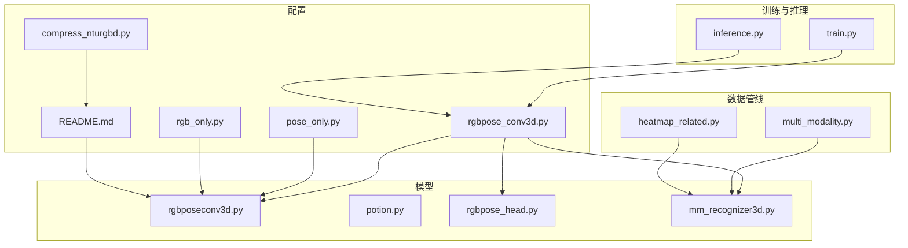
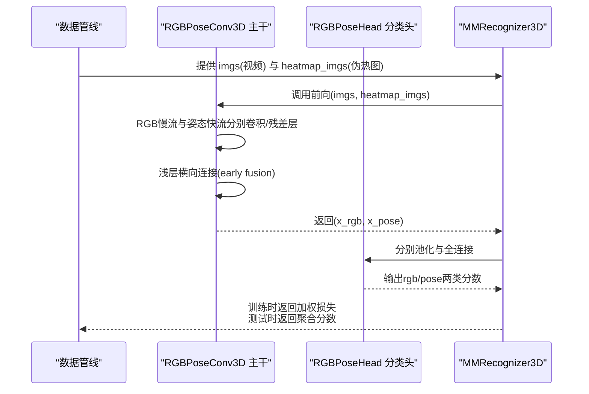
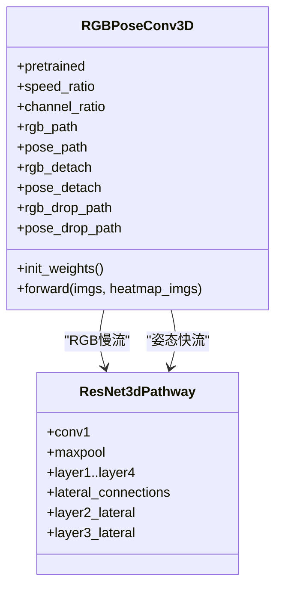
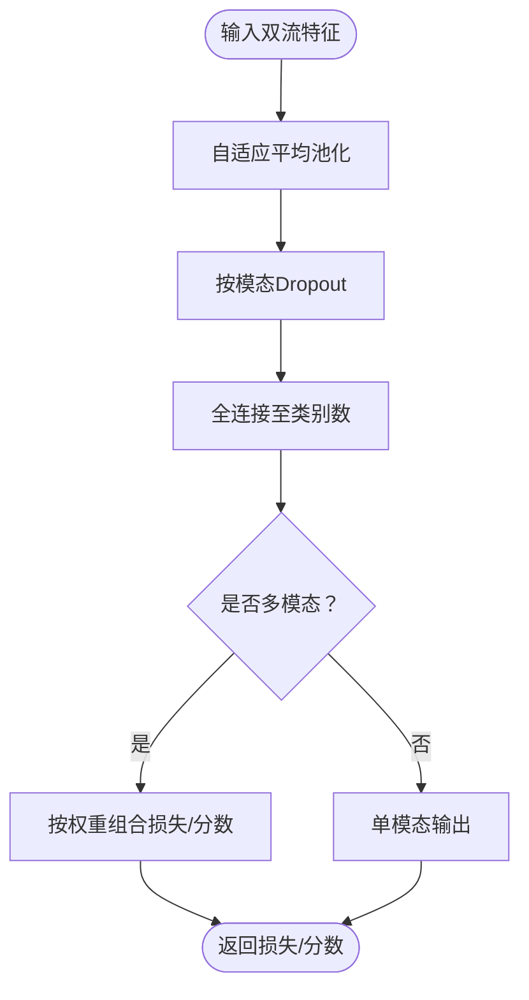
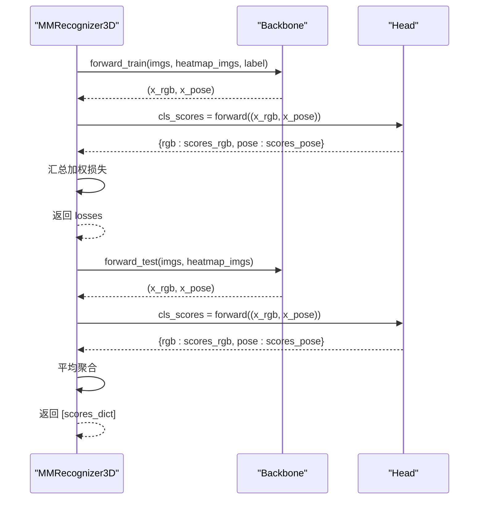
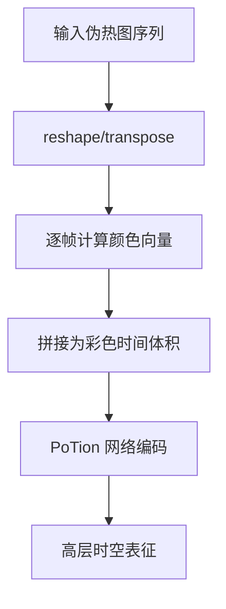
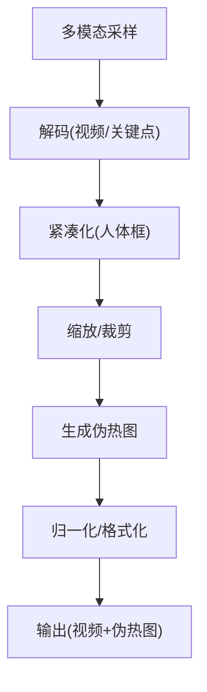
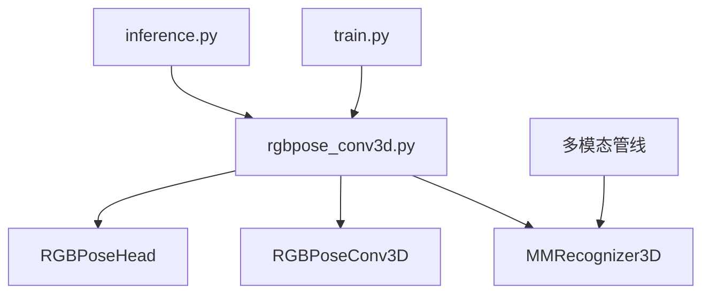

# 混合模态网络

<cite>
**本文引用的文件**
- [configs/rgbpose_conv3d/rgbpose_conv3d.py](file://configs/rgbpose_conv3d/rgbpose_conv3d.py)
- [configs/rgbpose_conv3d/pose_only.py](file://configs/rgbpose_conv3d/pose_only.py)
- [configs/rgbpose_conv3d/rgb_only.py](file://configs/rgbpose_conv3d/rgb_only.py)
- [configs/rgbpose_conv3d/README.md](file://configs/rgbpose_conv3d/README.md)
- [configs/rgbpose_conv3d/compress_nturgbd.py](file://configs/rgbpose_conv3d/compress_nturgbd.py)
- [pyskl/models/cnns/rgbposeconv3d.py](file://pyskl/models/cnns/rgbposeconv3d.py)
- [pyskl/models/cnns/potion.py](file://pyskl/models/cnns/potion.py)
- [pyskl/models/heads/rgbpose_head.py](file://pyskl/models/heads/rgbpose_head.py)
- [pyskl/models/recognizers/mm_recognizer3d.py](file://pyskl/models/recognizers/mm_recognizer3d.py)
- [pyskl/datasets/pipelines/multi_modality.py](file://pyskl/datasets/pipelines/multi_modality.py)
- [pyskl/datasets/pipelines/heatmap_related.py](file://pyskl/datasets/pipelines/heatmap_related.py)
- [pyskl/apis/train.py](file://pyskl/apis/train.py)
- [pyskl/apis/inference.py](file://pyskl/apis/inference.py)
</cite>

## 目录
1. [引言](#引言)
2. [项目结构](#项目结构)
3. [核心组件](#核心组件)
4. [架构总览](#架构总览)
5. [详细组件分析](#详细组件分析)
6. [依赖关系分析](#依赖关系分析)
7. [性能考量](#性能考量)
8. [故障排查指南](#故障排查指南)
9. [结论](#结论)
10. [附录](#附录)

## 引言
本技术文档聚焦于 PySKL 中的混合模态网络，系统阐述 RGBPoseConv3D 双流主干与 POTION 网络的混合建模方式，解释模态间特征对齐与跨模态注意力策略，对比单一模态与混合模态的识别优势，并给出配置参数、融合策略选择、训练技巧及不同混合策略的效果与适用场景分析。同时提供在动作识别任务中的应用案例与性能基准测试结果。

## 项目结构
围绕混合模态网络的关键目录与文件如下：
- 配置层：提供 RGBPoseConv3D、仅 RGB、仅姿态三种训练配置，以及数据压缩与训练/推理脚本。
- 模型层：定义 RGBPoseConv3D 双流主干、POTION 网络、RGBPoseHead 分类头与多模态识别器框架。
- 数据管线：多模态采样、解码、紧凑化、伪热图生成与 PoTion 时间着色等。
- 训练与推理：分布式训练流程与推理接口。

**图表来源**
- [configs/rgbpose_conv3d/rgbpose_conv3d.py](file://configs/rgbpose_conv3d/rgbpose_conv3d.py#L1-L107)
- [configs/rgbpose_conv3d/pose_only.py](file://configs/rgbpose_conv3d/pose_only.py#L1-L80)
- [configs/rgbpose_conv3d/rgb_only.py](file://configs/rgbpose_conv3d/rgb_only.py#L1-L75)
- [configs/rgbpose_conv3d/README.md](file://configs/rgbpose_conv3d/README.md#L1-L109)
- [configs/rgbpose_conv3d/compress_nturgbd.py](file://configs/rgbpose_conv3d/compress_nturgbd.py#L1-L36)
- [pyskl/models/cnns/rgbposeconv3d.py](file://pyskl/models/cnns/rgbposeconv3d.py#L1-L183)
- [pyskl/models/cnns/potion.py](file://pyskl/models/cnns/potion.py#L1-L81)
- [pyskl/models/heads/rgbpose_head.py](file://pyskl/models/heads/rgbpose_head.py#L1-L80)
- [pyskl/models/recognizers/mm_recognizer3d.py](file://pyskl/models/recognizers/mm_recognizer3d.py#L1-L62)
- [pyskl/datasets/pipelines/multi_modality.py](file://pyskl/datasets/pipelines/multi_modality.py#L1-L230)
- [pyskl/datasets/pipelines/heatmap_related.py](file://pyskl/datasets/pipelines/heatmap_related.py#L1-L322)
- [pyskl/apis/train.py](file://pyskl/apis/train.py#L1-L213)
- [pyskl/apis/inference.py](file://pyskl/apis/inference.py#L1-L184)

**章节来源**
- [configs/rgbpose_conv3d/rgbpose_conv3d.py](file://configs/rgbpose_conv3d/rgbpose_conv3d.py#L1-L107)
- [configs/rgbpose_conv3d/README.md](file://configs/rgbpose_conv3d/README.md#L1-L109)

## 核心组件
- RGBPoseConv3D 双流主干：基于 SlowFast 思想，分别构建 RGB 慢流与姿态快流，早期横向连接实现模态间特征对齐与融合。
- RGBPoseHead 分类头：对双流特征分别经全局平均池化与全连接得到两类分数，并可按权重组合输出。
- MMRecognizer3D 多模态识别器：统一前向流程，支持训练与测试，按配置对多模态损失加权。
- PoTion 网络：用于将伪热图序列映射到更高维表征，便于后续建模时间动态。
- 数据管线：多模态采样与解码、紧凑化、伪热图生成、时间着色（Heatmap2Potion）等。

**章节来源**
- [pyskl/models/cnns/rgbposeconv3d.py](file://pyskl/models/cnns/rgbposeconv3d.py#L12-L183)
- [pyskl/models/heads/rgbpose_head.py](file://pyskl/models/heads/rgbpose_head.py#L8-L80)
- [pyskl/models/recognizers/mm_recognizer3d.py](file://pyskl/models/recognizers/mm_recognizer3d.py#L5-L62)
- [pyskl/models/cnns/potion.py](file://pyskl/models/cnns/potion.py#L7-L81)
- [pyskl/datasets/pipelines/multi_modality.py](file://pyskl/datasets/pipelines/multi_modality.py#L12-L230)
- [pyskl/datasets/pipelines/heatmap_related.py](file://pyskl/datasets/pipelines/heatmap_related.py#L9-L322)

## 架构总览
RGBPoseConv3D 的整体流程：输入 RGB 视频与伪热图，分别进入 RGB 慢流与姿态快流；在浅层阶段通过横向连接进行早期特征融合；深层阶段分别提取语义特征；最后由分类头输出两类分数并可按权重融合。

**图表来源**
- [pyskl/models/recognizers/mm_recognizer3d.py](file://pyskl/models/recognizers/mm_recognizer3d.py#L9-L52)
- [pyskl/models/cnns/rgbposeconv3d.py](file://pyskl/models/cnns/rgbposeconv3d.py#L104-L173)
- [pyskl/models/heads/rgbpose_head.py](file://pyskl/models/heads/rgbpose_head.py#L59-L79)

## 详细组件分析

### RGBPoseConv3D 双流主干
- 结构要点
  - RGB 慢流：更深的阶段与更大的基础通道，强调空间与时间的稳定表征。
  - 姿态快流：较浅但快速，关注时间变化与局部细节。
  - 横向连接：在 layer2/layer3 等阶段引入 lateral 连接，实现模态间特征对齐与早期融合。
  - 可选 detach 与随机丢弃：通过 rgb_detach/pose_detach 与 drop_path 控制跨模态影响强度。
- 特征对齐机制
  - 通过 lateral 层将一模态的特征映射到另一模态的通道空间，实现跨模态对齐。
  - 支持在训练中随机屏蔽 lateral 信号，提升鲁棒性。
- 跨模态注意力策略
  - 当前实现以横向连接与早期融合为主，未显式引入注意力模块；可通过扩展在 lateral 层后加入注意力子层实现更细粒度的跨模态交互。

**图表来源**
- [pyskl/models/cnns/rgbposeconv3d.py](file://pyskl/models/cnns/rgbposeconv3d.py#L12-L183)
- [pyskl/models/cnns/resnet3d_slowfast.py](file://pyskl/models/cnns/resnet3d_slowfast.py#L133-L161)

**章节来源**
- [pyskl/models/cnns/rgbposeconv3d.py](file://pyskl/models/cnns/rgbposeconv3d.py#L25-L102)
- [pyskl/models/cnns/rgbposeconv3d.py](file://pyskl/models/cnns/rgbposeconv3d.py#L104-L173)

### RGBPoseHead 分类头
- 功能概述
  - 对两路特征分别做自适应平均池化与线性分类，输出两类分数。
  - 支持按权重组合两类损失，实现多模态联合训练。
- 融合策略
  - 训练阶段：按配置对 rgb/pose 组件损失加权求和。
  - 推理阶段：可按需对两类分数进行加权融合或单独输出。

**图表来源**
- [pyskl/models/heads/rgbpose_head.py](file://pyskl/models/heads/rgbpose_head.py#L59-L79)

**章节来源**
- [pyskl/models/heads/rgbpose_head.py](file://pyskl/models/heads/rgbpose_head.py#L21-L79)

### MMRecognizer3D 多模态识别器
- 训练流程
  - 将多模态输入展平后送入主干，得到双流特征，再经分类头输出两类分数。
  - 按配置对两类损失加权并汇总。
- 测试流程
  - 对两类分数进行平均聚合，返回最终预测。

**图表来源**
- [pyskl/models/recognizers/mm_recognizer3d.py](file://pyskl/models/recognizers/mm_recognizer3d.py#L9-L52)

**章节来源**
- [pyskl/models/recognizers/mm_recognizer3d.py](file://pyskl/models/recognizers/mm_recognizer3d.py#L9-L61)

### POTION 网络与时间着色
- PoTion 网络
  - 采用多阶段卷积堆叠，逐步扩大通道并下采样，适合将伪热图序列映射到高层表征。
- Heatmap2Potion 时间着色
  - 将伪热图序列按时间步映射到颜色空间，形成“时间-颜色”伪图像序列，便于后续建模时间动态。

**图表来源**
- [pyskl/datasets/pipelines/heatmap_related.py](file://pyskl/datasets/pipelines/heatmap_related.py#L280-L322)
- [pyskl/models/cnns/potion.py](file://pyskl/models/cnns/potion.py#L7-L81)

**章节来源**
- [pyskl/datasets/pipelines/heatmap_related.py](file://pyskl/datasets/pipelines/heatmap_related.py#L280-L322)
- [pyskl/models/cnns/potion.py](file://pyskl/models/cnns/potion.py#L10-L76)

### 数据管线与多模态处理
- 多模态采样与解码
  - 支持对 RGB 与 Pose 分别均匀采样，保证时间长度匹配。
  - 解码阶段根据模态读取视频帧或关键点序列。
- 紧凑化与归一化
  - 基于关键点框选人体区域，适配不同分辨率。
  - 图像归一化与伪热图格式化。
- 伪热图生成
  - 基于关键点坐标与置信度生成高斯伪热图，支持关键点与肢体两种模式。

**图表来源**
- [pyskl/datasets/pipelines/multi_modality.py](file://pyskl/datasets/pipelines/multi_modality.py#L58-L129)
- [pyskl/datasets/pipelines/heatmap_related.py](file://pyskl/datasets/pipelines/heatmap_related.py#L9-L247)

**章节来源**
- [pyskl/datasets/pipelines/multi_modality.py](file://pyskl/datasets/pipelines/multi_modality.py#L58-L129)
- [pyskl/datasets/pipelines/heatmap_related.py](file://pyskl/datasets/pipelines/heatmap_related.py#L9-L247)

## 依赖关系分析
- 配置到模型
  - rgbpose_conv3d.py 指定 MMRecognizer3D + RGBPoseConv3D + RGBPoseHead，决定训练与推理的整体结构。
- 数据管线到模型
  - 多模态采样与伪热图生成确保输入格式与主干期望一致。
- 训练与推理
  - train.py 负责分布式训练、学习率调度与评估钩子。
  - inference.py 负责加载配置与检查点、构建测试管线并执行推理。

**图表来源**
- [configs/rgbpose_conv3d/rgbpose_conv3d.py](file://configs/rgbpose_conv3d/rgbpose_conv3d.py#L37-L41)
- [pyskl/models/recognizers/mm_recognizer3d.py](file://pyskl/models/recognizers/mm_recognizer3d.py#L5-L62)
- [pyskl/models/cnns/rgbposeconv3d.py](file://pyskl/models/cnns/rgbposeconv3d.py#L12-L183)
- [pyskl/models/heads/rgbpose_head.py](file://pyskl/models/heads/rgbpose_head.py#L8-L80)
- [pyskl/datasets/pipelines/multi_modality.py](file://pyskl/datasets/pipelines/multi_modality.py#L58-L129)
- [pyskl/apis/train.py](file://pyskl/apis/train.py#L50-L144)
- [pyskl/apis/inference.py](file://pyskl/apis/inference.py#L19-L54)

**章节来源**
- [configs/rgbpose_conv3d/rgbpose_conv3d.py](file://configs/rgbpose_conv3d/rgbpose_conv3d.py#L37-L41)
- [pyskl/apis/train.py](file://pyskl/apis/train.py#L50-L144)
- [pyskl/apis/inference.py](file://pyskl/apis/inference.py#L19-L54)

## 性能考量
- 混合模态优势
  - 在 NTURGB+D XSub 数据集上，早期融合 + 晚期融合的双流模型在单剪辑与多剪辑测试中均优于仅 RGB 或仅姿态的基线，验证了跨模态互补性。
- 训练技巧
  - 预训练权重：先在目标数据集上训练 RGB-only 与 Pose-only 模型，再合并为初始化权重，有助于收敛与泛化。
  - 学习率缩放：按批次大小线性缩放初始学习率，保证不同规模下的稳定性。
  - 多剪辑测试：可显著提升识别性能，但会增加推理时间；可根据需求调整测试管线禁用多剪辑。
- 融合策略
  - 早期融合：通过横向连接在浅层阶段对齐特征，增强跨模态一致性。
  - 晚期融合：分别分类后按权重组合，简单高效且可调。
  - 混合策略：早期 + 晚期结合，通常取得最佳性能。

**章节来源**
- [configs/rgbpose_conv3d/README.md](file://configs/rgbpose_conv3d/README.md#L77-L109)
- [configs/rgbpose_conv3d/rgbpose_conv3d.py](file://configs/rgbpose_conv3d/rgbpose_conv3d.py#L96-L107)

## 故障排查指南
- 数据准备
  - NTURGB+D 视频需压缩至指定尺寸并转为 MP4，否则解码与预处理可能失败。
  - 若出现分辨率不一致问题，检查多模态管线中的缩放与紧凑化步骤。
- 训练异常
  - 分布式训练报错：确认分布式环境变量与 GPU 数量，检查优化器与学习率配置。
  - 内存不足：降低批次大小或关闭多剪辑测试，减少内存占用。
- 推理问题
  - 输入格式不符：确保测试管线与输入类型匹配（视频/帧/数组），必要时替换解码器。
  - 检查点加载：确认缓存路径与权重文件存在，避免加载失败。

**章节来源**
- [configs/rgbpose_conv3d/compress_nturgbd.py](file://configs/rgbpose_conv3d/compress_nturgbd.py#L14-L35)
- [pyskl/datasets/pipelines/multi_modality.py](file://pyskl/datasets/pipelines/multi_modality.py#L132-L229)
- [pyskl/apis/train.py](file://pyskl/apis/train.py#L138-L144)
- [pyskl/apis/inference.py](file://pyskl/apis/inference.py#L19-L54)

## 结论
RGBPoseConv3D 通过双流结构与早期横向连接实现了 RGB 与姿态模态的有效融合，在 NTURGB+D 上取得了优于单一模态的识别性能。配合 RGBPoseHead 的多模态损失与 MMRecognizer3D 的统一框架，训练与推理流程清晰可控。PoTion 与时间着色进一步增强了对时间动态的建模能力。实践中建议采用预训练初始化、线性学习率缩放与多剪辑测试策略以获得最佳性能。

## 附录

### 配置参数与训练技巧速查
- 主干参数
  - speed_ratio：快慢流时间维度比例，默认 4。
  - channel_ratio：快流通道缩减比例，默认 4。
  - lateral/lateral_infl/lateral_activate：横向连接开关与膨胀系数、激活阶段。
  - rgb_detach/pose_detach：跨模态特征 detach 控制。
  - rgb_drop_path/pose_drop_path：训练中随机屏蔽 lateral 信号的概率。
- 分类头参数
  - loss_components：参与训练的模态组件列表。
  - loss_weights：各组件损失权重。
  - dropout：按模态设置的 Dropout 概率。
- 训练配置
  - 优化器与梯度裁剪、学习率策略、总轮次、日志与检查点间隔。
  - 多剪辑测试与评估指标（Top-k 准确率、平均类准确率）。

**章节来源**
- [pyskl/models/cnns/rgbposeconv3d.py](file://pyskl/models/cnns/rgbposeconv3d.py#L25-L82)
- [pyskl/models/heads/rgbpose_head.py](file://pyskl/models/heads/rgbpose_head.py#L21-L45)
- [configs/rgbpose_conv3d/rgbpose_conv3d.py](file://configs/rgbpose_conv3d/rgbpose_conv3d.py#L95-L107)

### 不同混合策略效果与适用场景
- 仅 RGB：依赖外观信息，适合光照充足、遮挡较少的场景。
- 仅姿态：依赖运动结构，适合复杂背景或光照变化场景。
- 早期融合 + 晚期融合：在浅层对齐特征、深层独立建模后再融合，兼顾互补性与鲁棒性。
- 适用场景
  - 高精度要求：优先采用早期 + 晚期融合与多剪辑测试。
  - 实时性要求：可考虑仅 RGB 或关闭多剪辑测试以降低延迟。

**章节来源**
- [configs/rgbpose_conv3d/README.md](file://configs/rgbpose_conv3d/README.md#L97-L109)