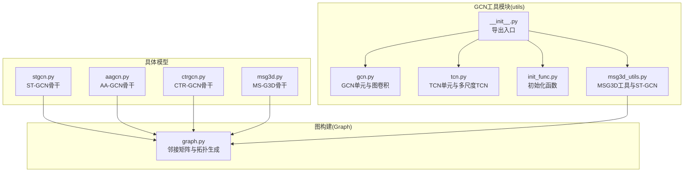
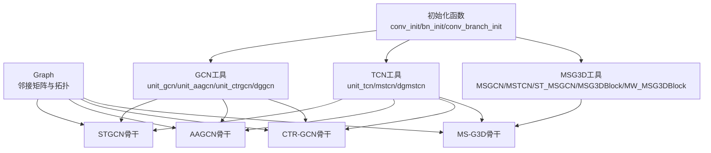
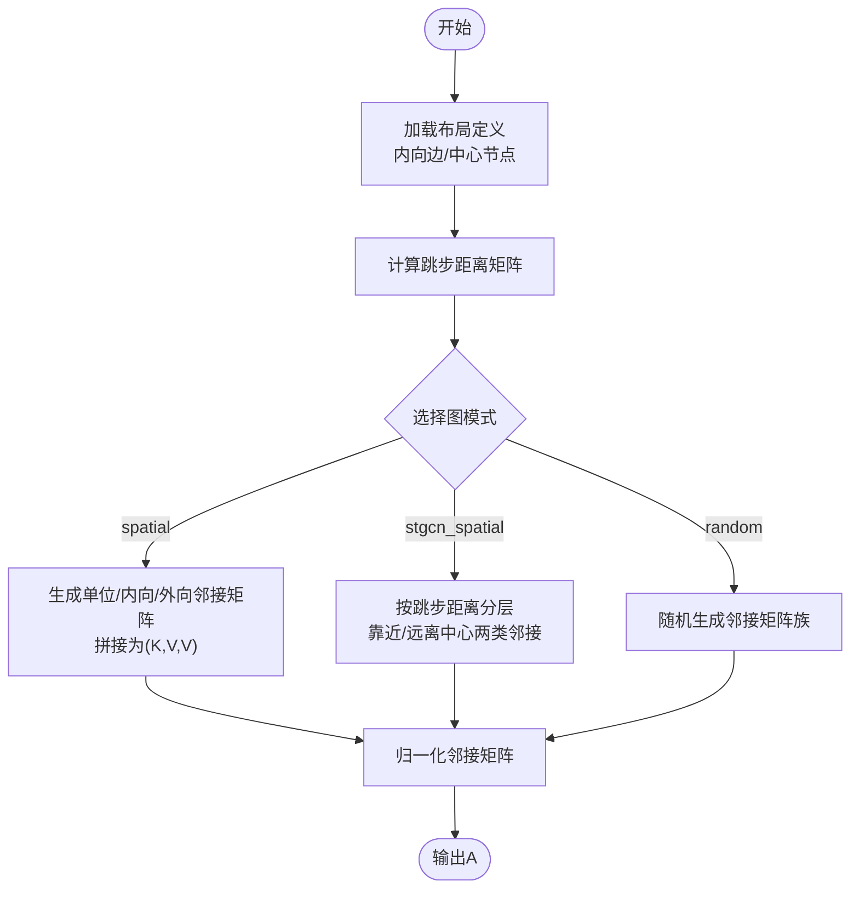
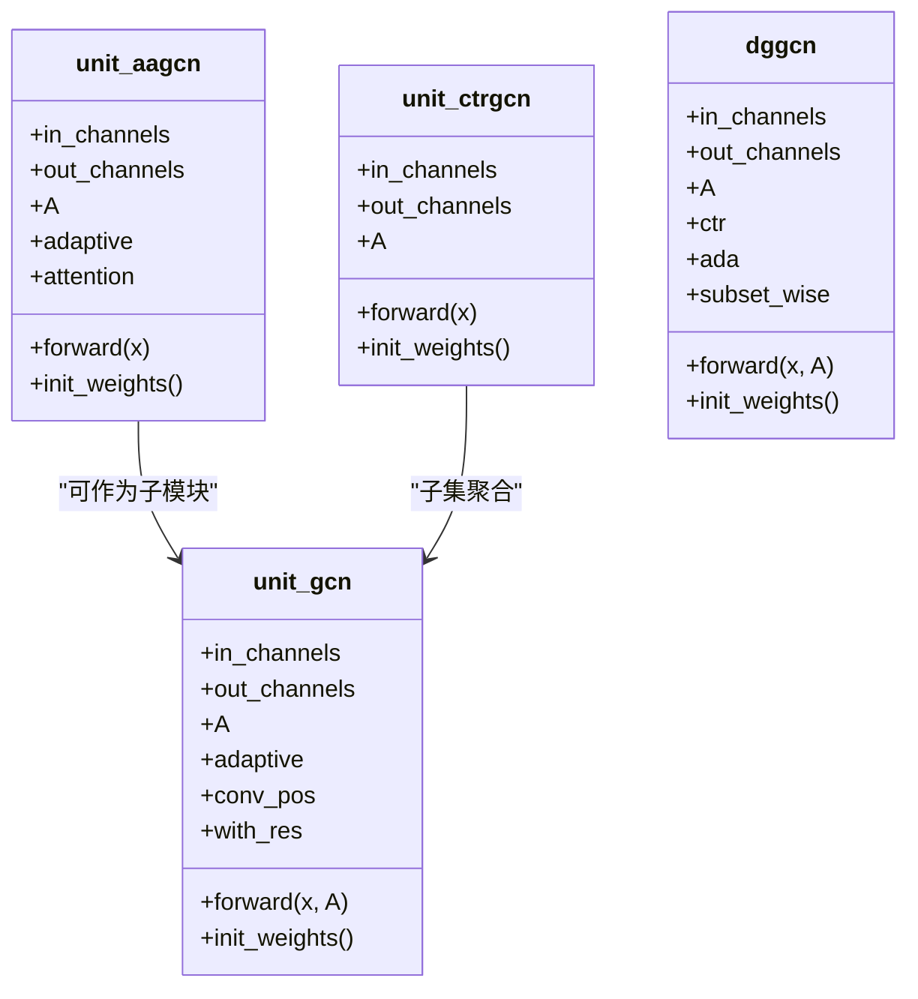
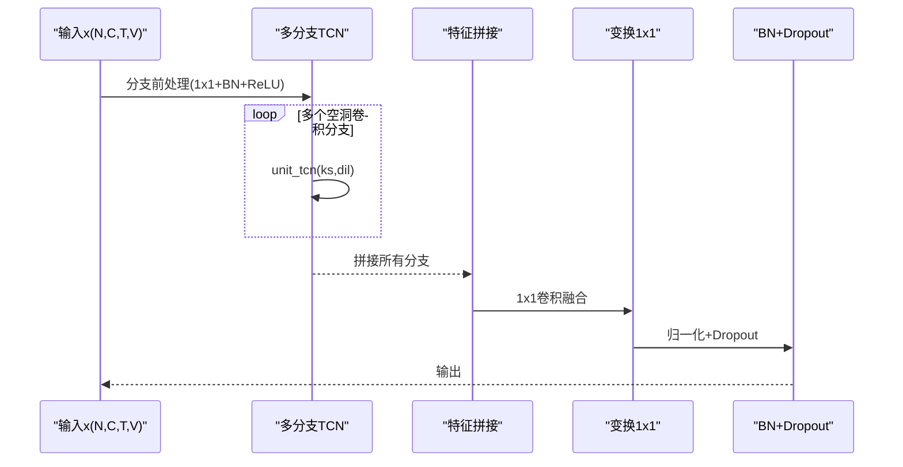
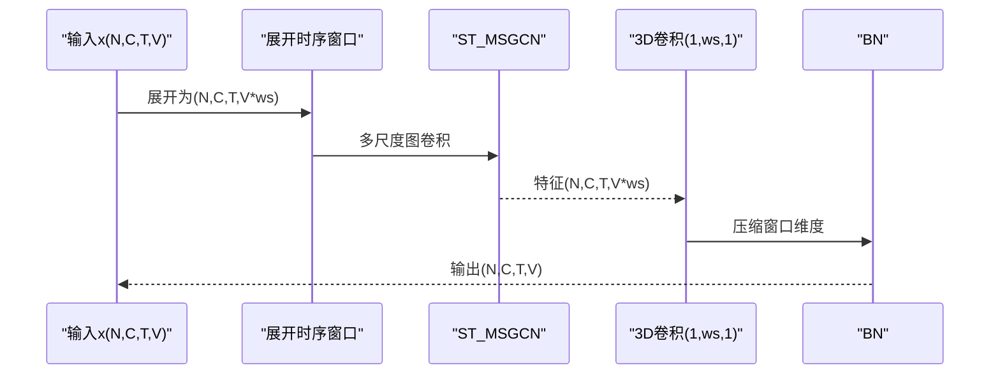
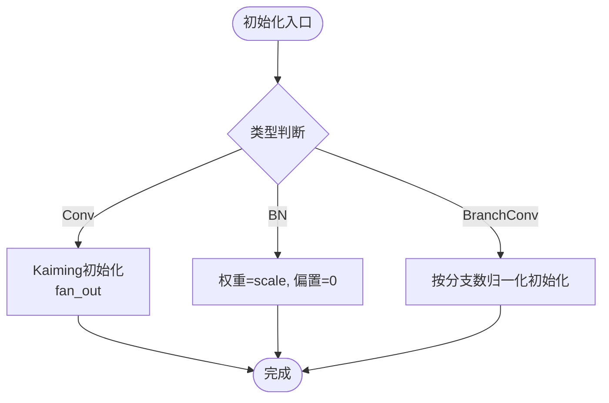
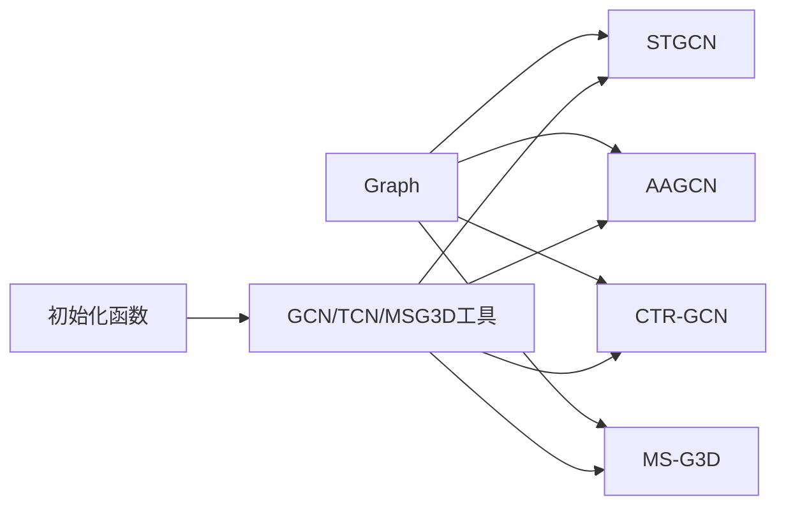

# GCN工具模块

<cite>
**本文档引用的文件**
- [pyskl/models/gcns/utils/__init__.py](file://pyskl/models/gcns/utils/__init__.py)
- [pyskl/models/gcns/utils/gcn.py](file://pyskl/models/gcns/utils/gcn.py)
- [pyskl/models/gcns/utils/tcn.py](file://pyskl/models/gcns/utils/tcn.py)
- [pyskl/models/gcns/utils/init_func.py](file://pyskl/models/gcns/utils/init_func.py)
- [pyskl/models/gcns/utils/msg3d_utils.py](file://pyskl/models/gcns/utils/msg3d_utils.py)
- [pyskl/utils/graph.py](file://pyskl/utils/graph.py)
- [pyskl/models/gcns/msg3d.py](file://pyskl/models/gcns/msg3d.py)
- [pyskl/models/gcns/stgcn.py](file://pyskl/models/gcns/stgcn.py)
- [pyskl/models/gcns/aagcn.py](file://pyskl/models/gcns/aagcn.py)
- [pyskl/models/gcns/ctrgcn.py](file://pyskl/models/gcns/ctrgcn.py)
</cite>

## 目录
1. [简介](#简介)
2. [项目结构](#项目结构)
3. [核心组件](#核心组件)
4. [架构总览](#架构总览)
5. [详细组件分析](#详细组件分析)
6. [依赖关系分析](#依赖关系分析)
7. [性能考虑](#性能考虑)
8. [故障排查指南](#故障排查指南)
9. [结论](#结论)
10. [附录：使用示例与最佳实践](#附录使用示例与最佳实践)

## 简介
本技术文档聚焦于GCN工具模块，系统性解析以下关键能力：
- 图构建工具（Graph）：邻接矩阵生成、节点连接规则与图拓扑结构设计
- 时间卷积网络（TCN）模块：1D卷积层设计、空洞卷积应用与残差连接实现
- 初始化函数（init_func）：Xavier初始化、Kaiming初始化与正交初始化策略
- MSG3D专用工具：3D卷积核构造与多尺度特征融合机制
- 工具函数使用示例、参数配置与最佳实践
- 代码实现细节与扩展指南

## 项目结构
GCN工具模块位于pyskl/models/gcns/utils目录，提供通用的GCN/TCN/MSG3D工具与初始化函数，并在各具体模型中复用这些工具。图构建工具Graph位于pyskl/utils/graph.py，被多个GCN模型共享。

图表来源
- [pyskl/models/gcns/utils/__init__.py](file://pyskl/models/gcns/utils/__init__.py#L1-L16)
- [pyskl/utils/graph.py](file://pyskl/utils/graph.py#L58-L175)
- [pyskl/models/gcns/stgcn.py](file://pyskl/models/gcns/stgcn.py#L57-L138)
- [pyskl/models/gcns/aagcn.py](file://pyskl/models/gcns/aagcn.py#L49-L131)
- [pyskl/models/gcns/ctrgcn.py](file://pyskl/models/gcns/ctrgcn.py#L47-L94)
- [pyskl/models/gcns/msg3d.py](file://pyskl/models/gcns/msg3d.py#L11-L79)

章节来源
- [pyskl/models/gcns/utils/__init__.py](file://pyskl/models/gcns/utils/__init__.py#L1-L16)

## 核心组件
- 图构建工具（Graph）
  - 提供多种布局（openpose、nturgb+d、coco、handmp）与模式（spatial、stgcn_spatial、random），并计算邻接矩阵、归一化与跳步距离
- GCN单元
  - unit_gcn：支持自适应图、预/后置卷积位置、残差连接
  - unit_aagcn：自适应注意力图卷积，包含空间/时间/通道注意力
  - unit_ctrgcn：基于相对位置的图卷积（CTRGC）
  - dggcn：动态图卷积，支持中心-相对（CTR）与自适应（ADA）两种图更新方式
- TCN模块
  - unit_tcn：1D卷积+空洞卷积+归一化+Dropout
  - mstcn：多分支空洞卷积（含最大池化与1x1卷积）
  - dgmstcn：带全局统计信息的多分支TCN
- MSG3D工具
  - MSGCN：多尺度图卷积（基于A的幂次）
  - MSTCN：多尺度时间卷积（空洞+最大池化+1x1）
  - ST_MSGCN：时空图卷积（窗口展开+多尺度图卷积）
  - MSG3DBlock/MW_MSG3DBlock：3D时序窗口+多尺度图卷积堆叠
- 初始化函数
  - conv_init：Kaiming初始化
  - bn_init：批量归一化权重缩放
  - conv_branch_init：分支卷积初始化（按分支数归一化）

章节来源
- [pyskl/utils/graph.py](file://pyskl/utils/graph.py#L58-L175)
- [pyskl/models/gcns/utils/gcn.py](file://pyskl/models/gcns/utils/gcn.py#L10-L441)
- [pyskl/models/gcns/utils/tcn.py](file://pyskl/models/gcns/utils/tcn.py#L8-L202)
- [pyskl/models/gcns/utils/msg3d_utils.py](file://pyskl/models/gcns/utils/msg3d_utils.py#L31-L318)
- [pyskl/models/gcns/utils/init_func.py](file://pyskl/models/gcns/utils/init_func.py#L5-L22)

## 架构总览
GCN工具模块通过统一的图构建与卷积/时间卷积单元，支撑不同GCN骨干网络。Graph负责生成图邻接矩阵，工具模块提供可复用的GCN/TCN/MSG3D组件，具体模型通过组合这些组件形成端到端骨干网络。

图表来源
- [pyskl/utils/graph.py](file://pyskl/utils/graph.py#L58-L175)
- [pyskl/models/gcns/utils/gcn.py](file://pyskl/models/gcns/utils/gcn.py#L10-L441)
- [pyskl/models/gcns/utils/tcn.py](file://pyskl/models/gcns/utils/tcn.py#L8-L202)
- [pyskl/models/gcns/utils/msg3d_utils.py](file://pyskl/models/gcns/utils/msg3d_utils.py#L31-L318)
- [pyskl/models/gcns/utils/init_func.py](file://pyskl/models/gcns/utils/init_func.py#L5-L22)
- [pyskl/models/gcns/stgcn.py](file://pyskl/models/gcns/stgcn.py#L57-L138)
- [pyskl/models/gcns/aagcn.py](file://pyskl/models/gcns/aagcn.py#L49-L131)
- [pyskl/models/gcns/ctrgcn.py](file://pyskl/models/gcns/ctrgcn.py#L47-L94)
- [pyskl/models/gcns/msg3d.py](file://pyskl/models/gcns/msg3d.py#L11-L79)

## 详细组件分析

### 图构建工具（Graph）
- 功能概述
  - 支持多种骨架布局（openpose、nturgb+d、coco、handmp），定义自连边、内向边、外向边与邻居边
  - 提供三种图模式：
    - spatial：单位矩阵、内向邻接矩阵、外向邻接矩阵三通道拼接
    - stgcn_spatial：按跳步距离分层构建邻接矩阵集合（含“靠近中心/远离中心”两类）
    - random：随机生成滤波器族邻接矩阵
  - 计算跳步距离与归一化邻接矩阵，便于后续图卷积
- 邻接矩阵生成流程
  - 从布局定义获取内向边集合，推导外向边与邻居边
  - 计算跳步距离矩阵，用于stgcn_spatial模式
  - 按模式生成邻接矩阵张量（可能为3维或更高维度）
- 节点连接规则与图拓扑
  - spatial模式：直接使用单位矩阵与内/外向邻接矩阵
  - stgcn_spatial模式：按跳步距离将邻接矩阵分为“靠近中心/远离中心”两类，形成多尺度邻接集合
  - random模式：在给定方差与偏移下生成随机邻接矩阵族
- 使用建议
  - 根据数据集选择合适布局；若需多尺度邻接，优先stgcn_spatial
  - 注意max_hop对邻接矩阵稀疏度的影响

图表来源
- [pyskl/utils/graph.py](file://pyskl/utils/graph.py#L58-L175)

章节来源
- [pyskl/utils/graph.py](file://pyskl/utils/graph.py#L58-L175)

### GCN单元与图卷积（unit_gcn, unit_aagcn, unit_ctrgcn, dggcn）
- unit_gcn
  - 支持自适应图（init/offset/importance）、预/后置卷积位置、残差连接
  - 前向采用爱因斯坦求和进行图卷积，支持不同A形状的张量乘法
- unit_aagcn
  - 自适应注意力图卷积，包含多子集卷积分支与注意力模块（空间/时间/通道）
  - 初始化采用conv_init/bn_init与conv_branch_init等策略
- unit_ctrgcn
  - 基于CTRGC的子集聚合，引入相对位置编码与alpha权重
- dggcn
  - 动态图卷积，支持CTR（中心-相对）与ADA（自适应）两种图更新路径
  - 可选择subset_wise的逐子集加权，支持非线性激活（tanh/relu/sigmoid/softmax）

图表来源
- [pyskl/models/gcns/utils/gcn.py](file://pyskl/models/gcns/utils/gcn.py#L10-L441)

章节来源
- [pyskl/models/gcns/utils/gcn.py](file://pyskl/models/gcns/utils/gcn.py#L10-L441)

### TCN模块（unit_tcn, mstcn, dgmstcn）
- unit_tcn
  - 1D卷积核沿时间维展开，支持kernel_size、stride、dilation与归一化
  - 通过padding公式确保输出时间步不变
- mstcn
  - 多分支空洞卷积，包含1x1降维、BN、ReLU与多个空洞卷积分支
  - 最后通过1x1卷积与BN融合多分支特征
- dgmstcn
  - 在mstcn基础上增加全局统计（沿节点维取均值）并与局部特征融合
  - 通过可学习系数add_coeff对全局特征进行加权

图表来源
- [pyskl/models/gcns/utils/tcn.py](file://pyskl/models/gcns/utils/tcn.py#L38-L115)

章节来源
- [pyskl/models/gcns/utils/tcn.py](file://pyskl/models/gcns/utils/tcn.py#L8-L202)

### MSG3D专用工具（MSGCN, MSTCN, ST_MSGCN, MSG3DBlock, MW_MSG3DBlock）
- MSGCN
  - 基于A的幂次构造多尺度邻接矩阵集合，结合MLP进行跨尺度特征融合
- MSTCN
  - 多分支空洞时间卷积，包含最大池化与1x1分支，支持残差连接
- ST_MSGCN
  - 将图邻接扩展到时空域（窗口大小×节点数），再进行多尺度图卷积
- MSG3DBlock
  - 通过UnfoldTemporalWindows将输入展开为时序窗口，随后进行ST_MSGCN
  - 使用3D卷积（1,ws,1）压缩窗口维度，BN归一化
- MW_MSG3DBlock
  - 多窗口尺寸堆叠，对不同窗口大小与膨胀率的MSG3DBlock求和

图表来源
- [pyskl/models/gcns/utils/msg3d_utils.py](file://pyskl/models/gcns/utils/msg3d_utils.py#L236-L287)

章节来源
- [pyskl/models/gcns/utils/msg3d_utils.py](file://pyskl/models/gcns/utils/msg3d_utils.py#L31-L318)

### 初始化函数（init_func）
- conv_init
  - 对卷积层使用Kaiming初始化（fan_out模式），偏置置零
- bn_init
  - 批归一化层权重设为指定scale，偏置置零
- conv_branch_init
  - 针对多分支卷积，按分支数进行归一化初始化，偏置置零

图表来源
- [pyskl/models/gcns/utils/init_func.py](file://pyskl/models/gcns/utils/init_func.py#L5-L22)

章节来源
- [pyskl/models/gcns/utils/init_func.py](file://pyskl/models/gcns/utils/init_func.py#L5-L22)

## 依赖关系分析
- 组件耦合
  - GCN工具模块内部高度内聚，通过统一接口（如unit_gcn、unit_tcn）被各骨干网络复用
  - Graph作为外部依赖，被STGCN/AAGCN/CTR-GCN/MS-G3D共享
  - MSG3D工具依赖TCN工具与Graph工具
- 外部依赖
  - mmcv.cnn用于构建归一化与激活层
  - torch.nn与torch.einsum用于张量运算
- 潜在循环依赖
  - 当前模块未见循环导入；Graph与工具模块解耦良好

图表来源
- [pyskl/utils/graph.py](file://pyskl/utils/graph.py#L58-L175)
- [pyskl/models/gcns/stgcn.py](file://pyskl/models/gcns/stgcn.py#L57-L138)
- [pyskl/models/gcns/aagcn.py](file://pyskl/models/gcns/aagcn.py#L49-L131)
- [pyskl/models/gcns/ctrgcn.py](file://pyskl/models/gcns/ctrgcn.py#L47-L94)
- [pyskl/models/gcns/msg3d.py](file://pyskl/models/gcns/msg3d.py#L11-L79)
- [pyskl/models/gcns/utils/__init__.py](file://pyskl/models/gcns/utils/__init__.py#L1-L16)

章节来源
- [pyskl/models/gcns/utils/__init__.py](file://pyskl/models/gcns/utils/__init__.py#L1-L16)

## 性能考虑
- 空洞卷积与多分支
  - MSTCN通过多分支空洞卷积扩大感受野，提升时间建模能力；注意控制分支数量与扩张率，避免显存爆炸
- 图卷积复杂度
  - GCN前向涉及张量乘法与爱因斯坦求和，节点数V较大时应关注内存与计算开销
- 归一化与Dropout
  - 合理设置tcn_dropout与训练阶段BN的momentum，有助于泛化与收敛稳定性
- 3D卷积窗口
  - MSG3D中窗口大小与膨胀率影响时空建模精度与速度，需根据任务需求权衡

## 故障排查指南
- 输入维度不匹配
  - GCN/TCN期望输入为(N,C,T,V)，若维度不符会导致张量运算报错
- 图邻接矩阵形状异常
  - A必须为方阵且与节点数一致；多尺度模式下A应为(K,V,V)或更高维度
- 初始化问题
  - 若出现梯度爆炸或消失，检查conv_init/bn_init是否正确调用
- 空洞卷积边界
  - 确保padding计算正确，避免时间维度丢失

章节来源
- [pyskl/models/gcns/utils/gcn.py](file://pyskl/models/gcns/utils/gcn.py#L62-L81)
- [pyskl/models/gcns/utils/tcn.py](file://pyskl/models/gcns/utils/tcn.py#L17-L28)
- [pyskl/models/gcns/utils/msg3d_utils.py](file://pyskl/models/gcns/utils/msg3d_utils.py#L152-L173)

## 结论
GCN工具模块提供了可复用的图构建、图卷积、时间卷积与MSG3D工具，配合统一的初始化策略，能够高效支撑多种GCN骨干网络。通过合理配置图模式、空洞卷积参数与多尺度融合策略，可在保持性能的同时提升模型表达能力。

## 附录：使用示例与最佳实践
- 图构建（Graph）
  - 选择布局与模式：根据数据集选择布局（如nturgb+d），推荐stgcn_spatial模式以利用多尺度邻接
  - 参数建议：max_hop控制邻接稀疏度；random模式适合探索性实验
- GCN单元
  - unit_gcn：在需要自适应图时启用adaptive；预置卷积有利于先聚合再传播
  - unit_aagcn：开启attention可增强空间/时间注意力；注意初始化权重
  - unit_ctrgcn：CTRGC相对位置编码有助于建模长程依赖
  - dggcn：CTR与ADA可同时启用，subset_wise按子集加权提升表达力
- TCN模块
  - unit_tcn：dilation控制感受野；stride>1可降采样
  - mstcn：合理分配分支通道，避免过多分支导致过拟合
  - dgmstcn：利用全局统计信息增强局部特征表达
- MSG3D工具
  - MSGCN：num_scales越大，多尺度建模越强，但计算成本上升
  - MSTCN：dilations列表长度决定多尺度分支数量
  - ST_MSGCN：window_size影响时空建模范围
  - MSG3DBlock/MW_MSG3DBlock：多窗口堆叠提升多尺度覆盖
- 初始化策略
  - conv_init：默认Kaiming初始化，适用于大多数卷积层
  - bn_init：将BN权重缩放到较小值以稳定训练初期
  - conv_branch_init：多分支卷积初始化，确保各分支权重均衡

章节来源
- [pyskl/utils/graph.py](file://pyskl/utils/graph.py#L58-L175)
- [pyskl/models/gcns/utils/gcn.py](file://pyskl/models/gcns/utils/gcn.py#L10-L441)
- [pyskl/models/gcns/utils/tcn.py](file://pyskl/models/gcns/utils/tcn.py#L8-L202)
- [pyskl/models/gcns/utils/msg3d_utils.py](file://pyskl/models/gcns/utils/msg3d_utils.py#L31-L318)
- [pyskl/models/gcns/utils/init_func.py](file://pyskl/models/gcns/utils/init_func.py#L5-L22)