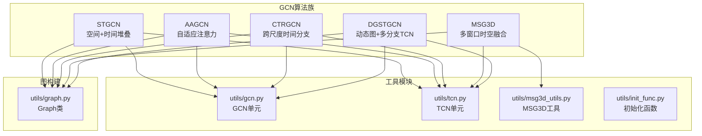
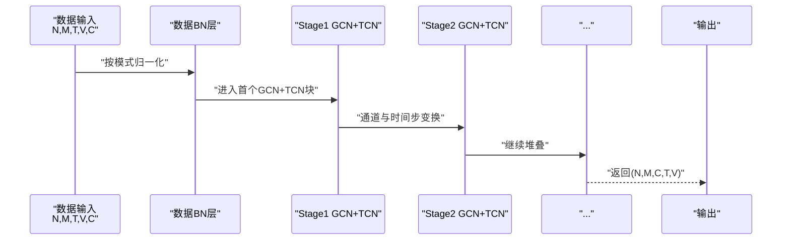
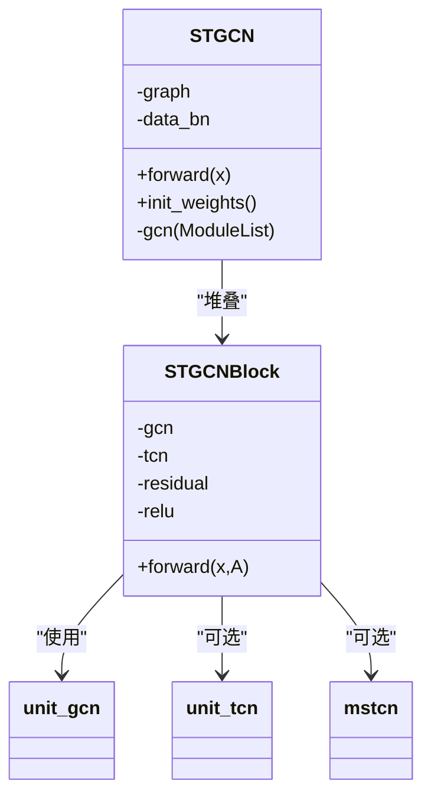
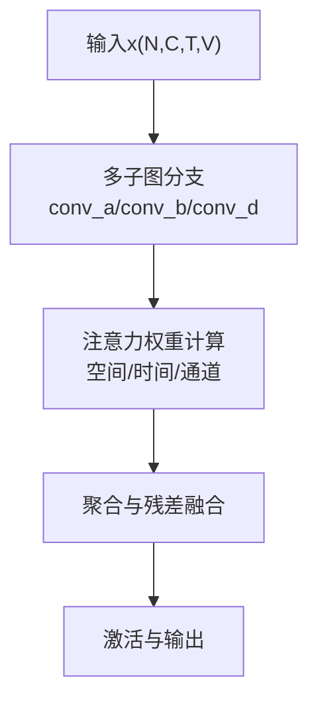
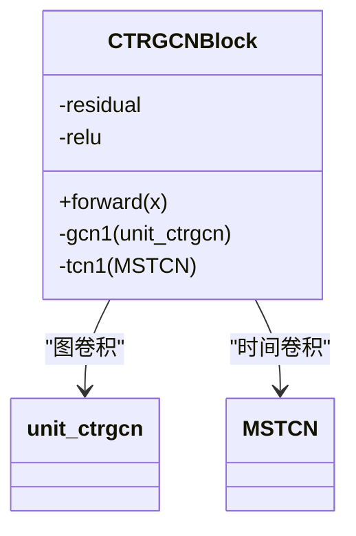
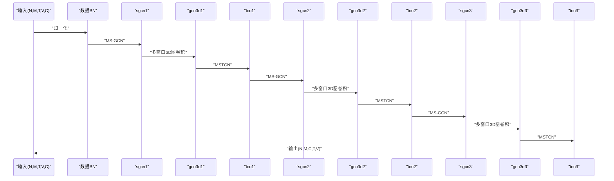
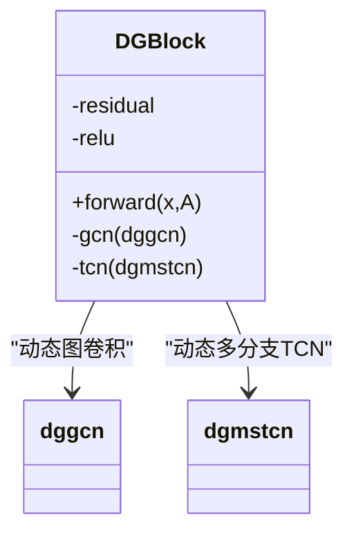
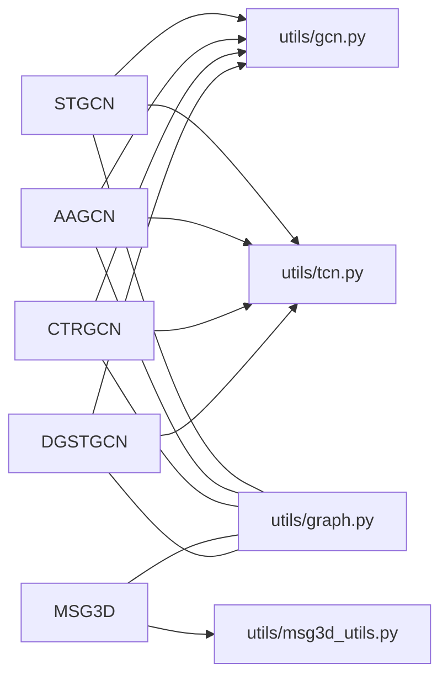

# GCN网络模块

<cite>
**本文引用的文件**
- [pyskl/models/gcns/__init__.py](file://pyskl/models/gcns/__init__.py)
- [pyskl/models/gcns/stgcn.py](file://pyskl/models/gcns/stgcn.py)
- [pyskl/models/gcns/aagcn.py](file://pyskl/models/gcns/aagcn.py)
- [pyskl/models/gcns/ctrgcn.py](file://pyskl/models/gcns/ctrgcn.py)
- [pyskl/models/gcns/msg3d.py](file://pyskl/models/gcns/msg3d.py)
- [pyskl/models/gcns/dgstgcn.py](file://pyskl/models/gcns/dgstgcn.py)
- [pyskl/models/gcns/utils/__init__.py](file://pyskl/models/gcns/utils/__init__.py)
- [pyskl/models/gcns/utils/gcn.py](file://pyskl/models/gcns/utils/gcn.py)
- [pyskl/models/gcns/utils/tcn.py](file://pyskl/models/gcns/utils/tcn.py)
- [pyskl/models/gcns/utils/init_func.py](file://pyskl/models/gcns/utils/init_func.py)
- [pyskl/models/gcns/utils/msg3d_utils.py](file://pyskl/models/gcns/utils/msg3d_utils.py)
- [pyskl/utils/graph.py](file://pyskl/utils/graph.py)
- [configs/stgcn/stgcn_pyskl_ntu60_xsub_3dkp/b.py](file://configs/stgcn/stgcn_pyskl_ntu60_xsub_3dkp/b.py)
- [configs/aagcn/aagcn_pyskl_ntu60_xsub_3dkp/b.py](file://configs/aagcn/aagcn_pyskl_ntu60_xsub_3dkp/b.py)
- [configs/msg3d/msg3d_pyskl_ntu60_xsub_3dkp/b.py](file://configs/msg3d/msg3d_pyskl_ntu60_xsub_3dkp/b.py)
</cite>

## 目录
1. [简介](#简介)
2. [项目结构](#项目结构)
3. [核心组件](#核心组件)
4. [架构总览](#架构总览)
5. [详细组件分析](#详细组件分析)
6. [依赖关系分析](#依赖关系分析)
7. [性能与实现特性](#性能与实现特性)
8. [故障排查指南](#故障排查指南)
9. [结论](#结论)
10. [附录：参数配置与算法对比](#附录参数配置与算法对比)

## 简介
本文件系统性梳理 PySKL 的 GCN 网络模块，覆盖图卷积网络（GCN）在骨架动作识别中的基本原理与实践，重点阐述 ST-GCN 系列（ST-GCN、AAGCN、CT-GCN）的空间图卷积设计与消息传递机制，以及 MSG3D、DG-STGCN 的时间图卷积组合策略。文档同时说明图构建方法、邻接矩阵设计与节点连接规则，解释注意力机制与残差连接的设计思想，并对 GCN 工具模块（图构建工具、初始化函数、TCN 模块）进行功能说明，最后给出算法对比与参数配置建议。

## 项目结构
GCN 模块位于 pyskl/models/gcns 下，按“算法族”组织，每个算法一个文件；配套工具位于 utils 子包，包括 GCN 单元、TCN 单元、MSG3D 辅助模块与初始化函数；图构建逻辑集中在 pyskl/utils/graph.py；配置示例位于 configs/*。

图表来源
- [pyskl/models/gcns/stgcn.py](file://pyskl/models/gcns/stgcn.py#L56-L138)
- [pyskl/models/gcns/aagcn.py](file://pyskl/models/gcns/aagcn.py#L48-L131)
- [pyskl/models/gcns/ctrgcn.py](file://pyskl/models/gcns/ctrgcn.py#L46-L94)
- [pyskl/models/gcns/msg3d.py](file://pyskl/models/gcns/msg3d.py#L10-L79)
- [pyskl/models/gcns/dgstgcn.py](file://pyskl/models/gcns/dgstgcn.py#L49-L134)
- [pyskl/models/gcns/utils/gcn.py](file://pyskl/models/gcns/utils/gcn.py#L10-L441)
- [pyskl/models/gcns/utils/tcn.py](file://pyskl/models/gcns/utils/tcn.py#L8-L202)
- [pyskl/models/gcns/utils/msg3d_utils.py](file://pyskl/models/gcns/utils/msg3d_utils.py#L31-L318)
- [pyskl/utils/graph.py](file://pyskl/utils/graph.py#L58-L175)

章节来源
- [pyskl/models/gcns/__init__.py](file://pyskl/models/gcns/__init__.py#L1-L8)

## 核心组件
- ST-GCN：以空间图卷积（unit_gcn）+ 时间卷积（unit_tcn/mstcn）的块（STGCNBlock）堆叠，支持可变通道与下采样，BN 归一化在时间维进行。
- AAGCN：引入自适应注意力（空间+时间+通道），通过多子图聚合与可学习权重增强特征表达。
- CTRGCN：采用多分支时间卷积（MSTCN）与跨尺度图卷积（CTRGC）结合，提升时序建模能力。
- MSG3D：提出 MS-GCN（多尺度空间图卷积）与多窗口时间展开（UnfoldTemporalWindows）的组合，形成 ST_MSGCN，再用 MW_MSG3DBlock 融合多窗口。
- DG-STGCN：动态图卷积（dggcn）与动态多分支 TCN（dgmstcn）组合，支持自适应图构造与全局上下文注入。

章节来源
- [pyskl/models/gcns/stgcn.py](file://pyskl/models/gcns/stgcn.py#L13-L138)
- [pyskl/models/gcns/aagcn.py](file://pyskl/models/gcns/aagcn.py#L11-L131)
- [pyskl/models/gcns/ctrgcn.py](file://pyskl/models/gcns/ctrgcn.py#L9-L94)
- [pyskl/models/gcns/msg3d.py](file://pyskl/models/gcns/msg3d.py#L10-L79)
- [pyskl/models/gcns/dgstgcn.py](file://pyskl/models/gcns/dgstgcn.py#L13-L134)

## 架构总览
GCN 算法均遵循统一的数据流：先对输入骨架序列做 BN 归一化（按帧或按人-点-通道维度），随后通过若干阶段（stage）堆叠的 GCN+TCN 块提取时空特征，最终恢复为（N, M, C, T, V）格式输出。

图表来源
- [pyskl/models/gcns/stgcn.py](file://pyskl/models/gcns/stgcn.py#L124-L137)
- [pyskl/models/gcns/aagcn.py](file://pyskl/models/gcns/aagcn.py#L116-L130)
- [pyskl/models/gcns/ctrgcn.py](file://pyskl/models/gcns/ctrgcn.py#L83-L93)
- [pyskl/models/gcns/msg3d.py](file://pyskl/models/gcns/msg3d.py#L58-L75)
- [pyskl/models/gcns/dgstgcn.py](file://pyskl/models/gcns/dgstgcn.py#L120-L133)

## 详细组件分析

### ST-GCN 组件分析
- 结构组成：STGCNBlock 包含 unit_gcn（空间）+ unit_tcn 或 mstcn（时间），支持残差与通道/步幅变化。
- 图构建：Graph 类根据布局生成邻接矩阵 A，支持多种模式（spatial、stgcn_spatial、binary_adj 等）。
- 数据流：输入经 BN 后 reshape 为 (N·M, C, T, V)，逐 stage 前向传播，最后还原形状。

图表来源
- [pyskl/models/gcns/stgcn.py](file://pyskl/models/gcns/stgcn.py#L13-L138)
- [pyskl/models/gcns/utils/gcn.py](file://pyskl/models/gcns/utils/gcn.py#L10-L84)
- [pyskl/models/gcns/utils/tcn.py](file://pyskl/models/gcns/utils/tcn.py#L8-L36)

章节来源
- [pyskl/models/gcns/stgcn.py](file://pyskl/models/gcns/stgcn.py#L56-L138)
- [pyskl/utils/graph.py](file://pyskl/utils/graph.py#L58-L175)

### AAGCN 组件分析
- 特点：unit_aagcn 引入自适应邻接矩阵与三类注意力（空间、时间、通道），多子图分支聚合，残差可学习下采样。
- 初始化：提供 init_weights 对各子模块权重进行规范初始化。

图表来源
- [pyskl/models/gcns/utils/gcn.py](file://pyskl/models/gcns/utils/gcn.py#L87-L199)

章节来源
- [pyskl/models/gcns/aagcn.py](file://pyskl/models/gcns/aagcn.py#L11-L131)
- [pyskl/models/gcns/utils/gcn.py](file://pyskl/models/gcns/utils/gcn.py#L87-L199)

### CTRGCN 组件分析
- 特点：CTRGC 单元基于相对位置构造图，MSTCN 多分支时间卷积，二者在 CTRGCNBlock 中串联，支持残差与下采样。
- 参数：kernel_size、dilations、tcn_dropout 可调。

图表来源
- [pyskl/models/gcns/ctrgcn.py](file://pyskl/models/gcns/ctrgcn.py#L9-L44)
- [pyskl/models/gcns/utils/gcn.py](file://pyskl/models/gcns/utils/gcn.py#L236-L284)
- [pyskl/models/gcns/utils/tcn.py](file://pyskl/models/gcns/utils/tcn.py#L38-L114)

章节来源
- [pyskl/models/gcns/ctrgcn.py](file://pyskl/models/gcns/ctrgcn.py#L46-L94)

### MSG3D 组件分析
- 设计：MS-GCN（多尺度空间图卷积）+ 多窗口时间展开（UnfoldTemporalWindows）+ 多窗口融合（MW_MSG3DBlock）。
- 路径融合：空间路径 sgcn 与 3D 路径 gcn3d 逐级相加后经 MSTCN。

图表来源
- [pyskl/models/gcns/msg3d.py](file://pyskl/models/gcns/msg3d.py#L10-L79)
- [pyskl/models/gcns/utils/msg3d_utils.py](file://pyskl/models/gcns/utils/msg3d_utils.py#L31-L318)

章节来源
- [pyskl/models/gcns/msg3d.py](file://pyskl/models/gcns/msg3d.py#L10-L79)
- [pyskl/models/gcns/utils/msg3d_utils.py](file://pyskl/models/gcns/utils/msg3d_utils.py#L31-L318)

### DG-STGCN 组件分析
- 设计：DGBlock 将 dggcn（动态图卷积）与 dgmstcn（动态多分支 TCN）组合，支持自适应图构造与全局上下文注入。
- 关键参数：ratio、ctr、ada、subset_wise、ada_act、ctr_act 等控制动态图生成策略。

图表来源
- [pyskl/models/gcns/dgstgcn.py](file://pyskl/models/gcns/dgstgcn.py#L13-L47)
- [pyskl/models/gcns/utils/gcn.py](file://pyskl/models/gcns/utils/gcn.py#L301-L441)
- [pyskl/models/gcns/utils/tcn.py](file://pyskl/models/gcns/utils/tcn.py#L117-L202)

章节来源
- [pyskl/models/gcns/dgstgcn.py](file://pyskl/models/gcns/dgstgcn.py#L49-L134)
- [pyskl/models/gcns/utils/gcn.py](file://pyskl/models/gcns/utils/gcn.py#L301-L441)
- [pyskl/models/gcns/utils/tcn.py](file://pyskl/models/gcns/utils/tcn.py#L117-L202)

## 依赖关系分析
- 算法到工具：各算法通过 utils/gcn.py、utils/tcn.py、utils/msg3d_utils.py 调用具体算子；图构建依赖 utils/graph.py。
- 注册机制：BACKBONES.register_module 用于注册算法类，便于统一构建器加载。
- 初始化：utils/init_func.py 提供卷积、批归一化与分支卷积的初始化策略。

图表来源
- [pyskl/models/gcns/stgcn.py](file://pyskl/models/gcns/stgcn.py#L6-L8)
- [pyskl/models/gcns/aagcn.py](file://pyskl/models/gcns/aagcn.py#L6-L8)
- [pyskl/models/gcns/ctrgcn.py](file://pyskl/models/gcns/ctrgcn.py#L4-L6)
- [pyskl/models/gcns/msg3d.py](file://pyskl/models/gcns/msg3d.py#L5-L7)
- [pyskl/models/gcns/dgstgcn.py](file://pyskl/models/gcns/dgstgcn.py#L6-L8)
- [pyskl/models/gcns/utils/__init__.py](file://pyskl/models/gcns/utils/__init__.py#L1-L16)
- [pyskl/utils/graph.py](file://pyskl/utils/graph.py#L58-L175)

章节来源
- [pyskl/models/gcns/utils/__init__.py](file://pyskl/models/gcns/utils/__init__.py#L1-L16)

## 性能与实现特性
- 计算复杂度
  - 空间图卷积：unit_gcn 的复杂度与邻接矩阵规模（K·V^2）相关，K 为子图数量；AAGCN 的多子图分支带来额外开销但提升表达力。
  - 时间卷积：mstcn/dgmstcn 的多分支结构在保持感受野的同时增加计算量，可通过减少分支数或 mid_channels 调整。
  - MSG3D：UnfoldTemporalWindows 将时间维展开为窗口维，增大张量尺寸，需注意显存占用。
- 内存与显存
  - MSG3D 在多窗口融合时会临时放大特征维度，建议合理设置窗口大小与下采样策略。
  - DG-STGCN 的动态图参数（alpha/beta）与 subset_wise 控制图复杂度，适度降低可节省内存。
- 训练稳定性
  - 批归一化在时间维（T）进行，有助于稳定训练；AAGCN/CTRGCN/MSG3D/DGSTGCN 均提供 init_weights 以改善初始化。

[本节为通用性能讨论，不直接分析具体文件]

## 故障排查指南
- 形状错误
  - 输入维度应为 (N, M, T, V, C)，若报错通常源于数据预处理未按算法要求格式化；检查 FormatGCNInput 与数据集划分。
- 图配置不匹配
  - graph_cfg 的 layout 与 mode 必须与 Graph 支持的候选一致；邻接矩阵维度需与节点数一致。
- 初始化问题
  - 若模型收敛缓慢，确认 init_weights 是否被调用；AAGCN/CTRGCN/MSG3D 均有对应初始化流程。
- 预训练权重
  - ST-GCN/DG-STGCN 支持从远程缓存加载预训练权重，确保网络可访问且路径正确。

章节来源
- [pyskl/models/gcns/stgcn.py](file://pyskl/models/gcns/stgcn.py#L119-L123)
- [pyskl/models/gcns/aagcn.py](file://pyskl/models/gcns/aagcn.py#L108-L114)
- [pyskl/models/gcns/ctrgcn.py](file://pyskl/models/gcns/ctrgcn.py#L79-L82)
- [pyskl/models/gcns/msg3d.py](file://pyskl/models/gcns/msg3d.py#L77-L79)
- [pyskl/models/gcns/dgstgcn.py](file://pyskl/models/gcns/dgstgcn.py#L115-L118)

## 结论
PySKL 的 GCN 模块围绕“空间图卷积 + 时间卷积”的统一范式，提供了从基础 ST-GCN 到高级 MSG3D、DG-STGCN 的完整方案。通过 Graph 类灵活构建邻接矩阵，配合多样的 GCN/TCN 单元与注意力机制，能够有效建模骨架序列的时空相关性。在工程实践中，建议依据数据规模与资源约束选择合适算法与参数配置，并重视初始化与归一化策略以获得稳定训练效果。

[本节为总结性内容，不直接分析具体文件]

## 附录：参数配置与算法对比

### 图构建与邻接矩阵设计
- Graph 支持布局：openpose、nturgb+d、coco、handmp；模式：spatial、stgcn_spatial、binary_adj、random。
- 邻接矩阵生成：k_adjacency、edge2mat、normalize_digraph、get_hop_distance 等辅助函数用于构建与归一化。
- 节点连接规则：inward/outward/self_link 定义边方向与自环；stgcn_spatial 按跳数分层构造子图。

章节来源
- [pyskl/utils/graph.py](file://pyskl/utils/graph.py#L58-L175)

### 算法对比概览
- ST-GCN：经典空间+时间堆叠，适合中等规模数据；参数简洁，易部署。
- AAGCN：引入自适应邻接与注意力，表达能力强，适合复杂场景。
- CTRGCN：多分支时间卷积与跨尺度图卷积结合，强调时序与空间的协同建模。
- MSG3D：多窗口时间展开与多尺度空间图卷积融合，适合长序列与高精度需求。
- DG-STGCN：动态图与动态多分支 TCN，具备更强的自适应性与全局上下文建模能力。

章节来源
- [pyskl/models/gcns/stgcn.py](file://pyskl/models/gcns/stgcn.py#L56-L138)
- [pyskl/models/gcns/aagcn.py](file://pyskl/models/gcns/aagcn.py#L48-L131)
- [pyskl/models/gcns/ctrgcn.py](file://pyskl/models/gcns/ctrgcn.py#L46-L94)
- [pyskl/models/gcns/msg3d.py](file://pyskl/models/gcns/msg3d.py#L10-L79)
- [pyskl/models/gcns/dgstgcn.py](file://pyskl/models/gcns/dgstgcn.py#L49-L134)

### GCN 工具模块功能说明
- 图卷积单元
  - unit_gcn：支持自适应（init/offset/importance）、卷积位置（pre/post）、残差下采样。
  - unit_aagcn：自适应邻接与三类注意力（空间/时间/通道）。
  - unit_ctrgcn：基于相对位置的 CTRGC 模块。
  - dggcn：动态图卷积，支持多种自适应策略与子图级别控制。
- 时间卷积单元
  - unit_tcn：单分支时间卷积，支持核大小、步幅、膨胀与 Dropout。
  - mstcn：多分支时间卷积，包含 1x1、不同核大小与膨胀率、最大池化分支。
  - dgmstcn：在 mstcn 基础上加入全局上下文注入（add_coeff）。
- MSG3D 工具
  - MSGCN：多尺度空间图卷积。
  - MSTCN：多分支时间卷积（与 MS-G3D 实现略有差异）。
  - UnfoldTemporalWindows：时间窗口展开。
  - ST_MSGCN：时空联合图卷积。
  - MSG3DBlock/MW_MSG3DBlock：多窗口 3D 图卷积与融合。
- 初始化函数
  - conv_init、bn_init、conv_branch_init：分别用于卷积、批归一化与分支卷积初始化。

章节来源
- [pyskl/models/gcns/utils/gcn.py](file://pyskl/models/gcns/utils/gcn.py#L10-L441)
- [pyskl/models/gcns/utils/tcn.py](file://pyskl/models/gcns/utils/tcn.py#L8-L202)
- [pyskl/models/gcns/utils/msg3d_utils.py](file://pyskl/models/gcns/utils/msg3d_utils.py#L12-L318)
- [pyskl/models/gcns/utils/init_func.py](file://pyskl/models/gcns/utils/init_func.py#L1-L22)

### 参数配置示例与建议
- ST-GCN（NTU60 xsub 3DKP）
  - backbone.type='STGCN'，graph_cfg.layout='nturgb+d'，mode='stgcn_spatial'
  - 训练超参：SGD、动量、权重衰减、余弦退火学习率、训练轮次等
- AAGCN（NTU60 xsub 3DKP）
  - backbone.type='AAGCN'，graph_cfg.mode='spatial'
  - 注意力与自适应参数可根据数据集规模调整
- MSG3D（NTU60 xsub 3DKP）
  - backbone.type='MSG3D'，graph_cfg.mode='binary_adj'
  - 关注窗口大小、下采样与 TCN Dropout

章节来源
- [configs/stgcn/stgcn_pyskl_ntu60_xsub_3dkp/b.py](file://configs/stgcn/stgcn_pyskl_ntu60_xsub_3dkp/b.py#L1-L61)
- [configs/aagcn/aagcn_pyskl_ntu60_xsub_3dkp/b.py](file://configs/aagcn/aagcn_pyskl_ntu60_xsub_3dkp/b.py#L1-L61)
- [configs/msg3d/msg3d_pyskl_ntu60_xsub_3dkp/b.py](file://configs/msg3d/msg3d_pyskl_ntu60_xsub_3dkp/b.py#L1-L61)