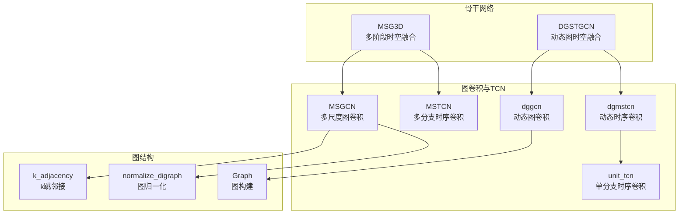
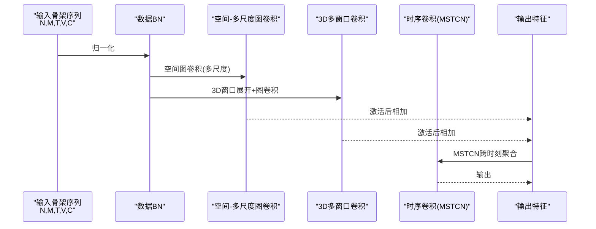
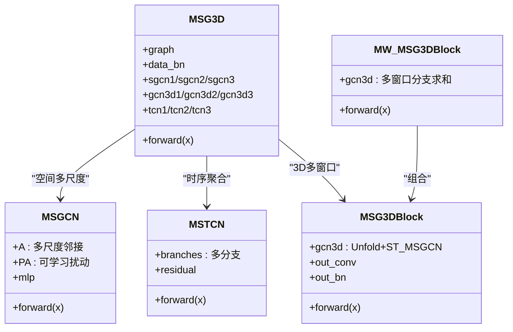
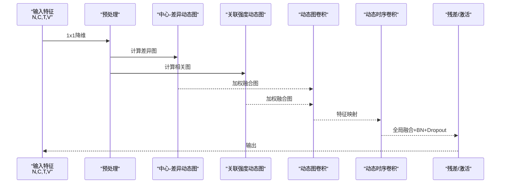
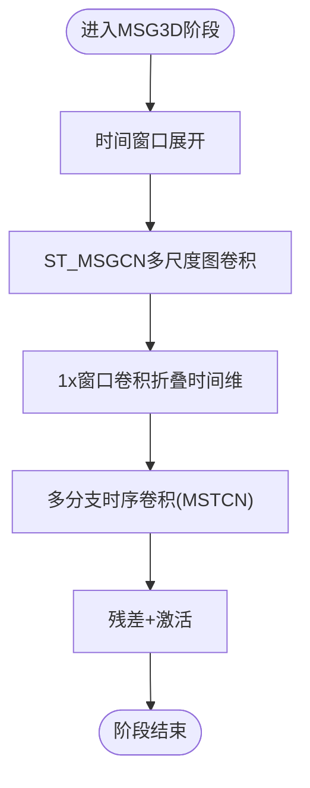
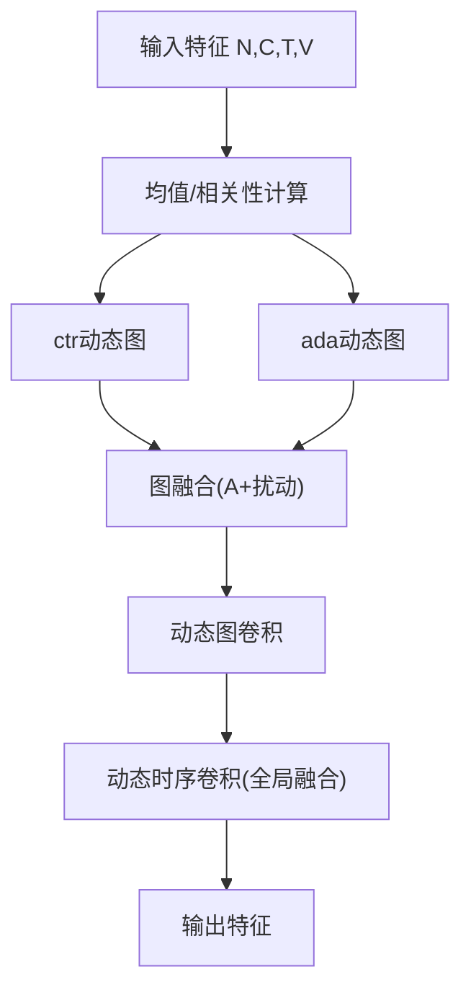
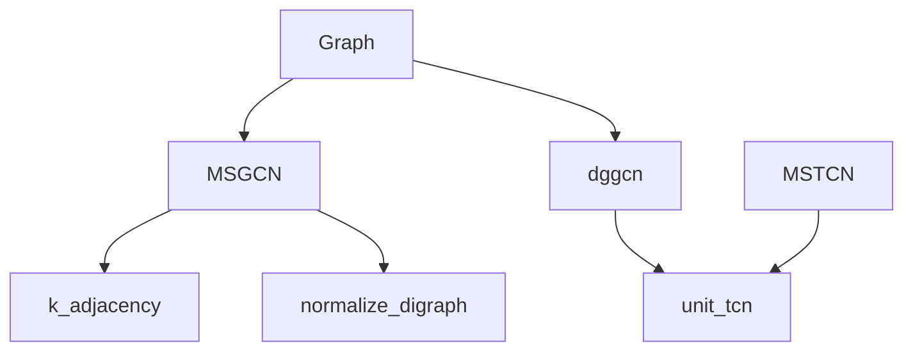

# MSG3D与DG-STGCN算法

<cite>
**本文引用的文件**
- [pyskl/models/gcns/msg3d.py](file://pyskl/models/gcns/msg3d.py)
- [pyskl/models/gcns/utils/msg3d_utils.py](file://pyskl/models/gcns/utils/msg3d_utils.py)
- [pyskl/models/gcns/dgstgcn.py](file://pyskl/models/gcns/dgstgcn.py)
- [pyskl/models/gcns/utils/gcn.py](file://pyskl/models/gcns/utils/gcn.py)
- [pyskl/models/gcns/utils/tcn.py](file://pyskl/models/gcns/utils/tcn.py)
- [pyskl/utils/graph.py](file://pyskl/utils/graph.py)
- [configs/msg3d/README.md](file://configs/msg3d/README.md)
- [configs/msg3d/msg3d_pyskl_ntu60_xsub_3dkp/j.py](file://configs/msg3d/msg3d_pyskl_ntu60_xsub_3dkp/j.py)
- [configs/dgstgcn/README.md](file://configs/dgstgcn/README.md)
- [configs/dgstgcn/ntu60_xsub_3dkp/j.py](file://configs/dgstgcn/ntu60_xsub_3dkp/j.py)
</cite>

## 目录
1. [引言](#引言)
2. [项目结构](#项目结构)
3. [核心组件](#核心组件)
4. [架构总览](#架构总览)
5. [详细组件分析](#详细组件分析)
6. [依赖关系分析](#依赖关系分析)
7. [性能考量](#性能考量)
8. [故障排查指南](#故障排查指南)
9. [结论](#结论)
10. [附录：使用示例与配置参数](#附录使用示例与配置参数)

## 引言
本技术文档聚焦于MSG3D与DG-STGCN两类基于图卷积的骨架动作识别骨干网络。前者通过多阶段时空融合与多尺度图卷积实现强大的长程关节关系建模；后者则以动态图构建为核心，引入可学习的邻接矩阵与动态时序卷积，提升对复杂空间-时间依赖的拟合能力。本文将从算法原理、模块组成、数据流、参数配置到性能优化给出系统化说明，并提供可直接落地的使用示例。

## 项目结构
围绕MSG3D与DG-STGCN，关键代码分布在以下模块：
- 骨干网络定义：MSG3D与DGSTGCN
- 图卷积与TCN子模块：MSG3D/STGCN/CTRGCN/AAGCN等
- 动态图与TCN：DG-GCN与DG-TCN
- 图结构生成：Graph类与k跳邻接、归一化等工具
- 配置样例：MSG3D与DG-STGCN在NTU RGB+D上的典型配置

**图表来源**
- [pyskl/models/gcns/msg3d.py](file://pyskl/models/gcns/msg3d.py#L10-L79)
- [pyskl/models/gcns/utils/msg3d_utils.py](file://pyskl/models/gcns/utils/msg3d_utils.py#L31-L143)
- [pyskl/models/gcns/dgstgcn.py](file://pyskl/models/gcns/dgstgcn.py#L49-L134)
- [pyskl/models/gcns/utils/gcn.py](file://pyskl/models/gcns/utils/gcn.py#L301-L441)
- [pyskl/models/gcns/utils/tcn.py](file://pyskl/models/gcns/utils/tcn.py#L8-L202)
- [pyskl/utils/graph.py](file://pyskl/utils/graph.py#L5-L37)

**章节来源**
- [pyskl/models/gcns/msg3d.py](file://pyskl/models/gcns/msg3d.py#L10-L79)
- [pyskl/models/gcns/dgstgcn.py](file://pyskl/models/gcns/dgstgcn.py#L49-L134)
- [pyskl/models/gcns/utils/msg3d_utils.py](file://pyskl/models/gcns/utils/msg3d_utils.py#L31-L143)
- [pyskl/models/gcns/utils/gcn.py](file://pyskl/models/gcns/utils/gcn.py#L301-L441)
- [pyskl/models/gcns/utils/tcn.py](file://pyskl/models/gcns/utils/tcn.py#L8-L202)
- [pyskl/utils/graph.py](file://pyskl/utils/graph.py#L5-L37)

## 核心组件
- MSG3D骨干：由三阶段堆叠构成，每阶段包含“空间-多尺度图卷积路径”与“3D多窗口卷积路径”，二者经激活后相加，随后通过时序卷积（MSTCN）进行跨时刻聚合。
- DG-STGCN骨干：由若干DGBlock堆叠而成，每个Block内含动态图卷积（dggcn）与动态时序卷积（dgmstcn），支持通道膨胀、下采样与残差连接。
- 图结构工具：Graph类根据布局生成邻接矩阵，k_adjacency与normalize_digraph用于构造多尺度图谱。

**章节来源**
- [pyskl/models/gcns/msg3d.py](file://pyskl/models/gcns/msg3d.py#L10-L79)
- [pyskl/models/gcns/dgstgcn.py](file://pyskl/models/gcns/dgstgcn.py#L49-L134)
- [pyskl/utils/graph.py](file://pyskl/utils/graph.py#L58-L175)

## 架构总览
MSG3D与DG-STGCN均以“图卷积+时序卷积”的双流融合为主干，但动态图策略与多尺度聚合方式不同。

**图表来源**
- [pyskl/models/gcns/msg3d.py](file://pyskl/models/gcns/msg3d.py#L58-L75)
- [pyskl/models/gcns/utils/msg3d_utils.py](file://pyskl/models/gcns/utils/msg3d_utils.py#L236-L287)

**章节来源**
- [pyskl/models/gcns/msg3d.py](file://pyskl/models/gcns/msg3d.py#L58-L75)
- [pyskl/models/gcns/utils/msg3d_utils.py](file://pyskl/models/gcns/utils/msg3d_utils.py#L236-L287)

## 详细组件分析

### MSG3D：多阶段图3D卷积网络
- 多阶段设计：三个阶段分别进行通道扩张与步幅下采样，形成金字塔式特征图。
- 多尺度图卷积（MSGCN）：对邻接矩阵进行k阶幂次扩展，得到多尺度邻接集合，再通过可学习扰动参数融合，最后经MLP聚合。
- 3D多窗口卷积（MW_MSG3DBlock/MSG3DBlock）：通过UnfoldTemporalWindows将时间维切分为多个窗口，结合ST_MSGCN在时空联合图上做卷积，再折叠回原时间分辨率。
- MSTCN时序卷积：多分支并行（不同空洞率、最大池化与1x1分支），按通道均分，拼接后经残差映射与激活。
- 数据BN：在通道维或人维进行批量归一化，稳定训练。

**图表来源**
- [pyskl/models/gcns/msg3d.py](file://pyskl/models/gcns/msg3d.py#L10-L79)
- [pyskl/models/gcns/utils/msg3d_utils.py](file://pyskl/models/gcns/utils/msg3d_utils.py#L31-L143)
- [pyskl/models/gcns/utils/msg3d_utils.py](file://pyskl/models/gcns/utils/msg3d_utils.py#L236-L318)

**章节来源**
- [pyskl/models/gcns/msg3d.py](file://pyskl/models/gcns/msg3d.py#L10-L79)
- [pyskl/models/gcns/utils/msg3d_utils.py](file://pyskl/models/gcns/utils/msg3d_utils.py#L31-L143)
- [pyskl/models/gcns/utils/msg3d_utils.py](file://pyskl/models/gcns/utils/msg3d_utils.py#L236-L318)

### DG-STGCN：动态图时空图卷积网络
- 动态图卷积（dggcn）：在预设图基础上引入两种动态分支：
  - 中心-目标差异（ctr）：利用时序均值差异构造邻接矩阵，体现局部运动趋势。
  - 关联强度（ada）：通过通道内自相关计算动态权重，强调强相关关节。
  - 支持subset-wise与激活函数选择（tanh/relu/sigmoid/softmax）。
- 动态时序卷积（dgmstcn）：在标准多分支时序卷积基础上，额外拼接全局时序统计向量，并通过可学习系数进行动态融合，增强跨时刻上下文建模。
- DGBlock：将动态图卷积与动态时序卷积串联，支持残差映射与步幅控制。
- DGSTGCN：按阶段堆叠DGBlock，支持通道膨胀、下采样与逐层参数解耦。

**图表来源**
- [pyskl/models/gcns/dgstgcn.py](file://pyskl/models/gcns/dgstgcn.py#L13-L47)
- [pyskl/models/gcns/utils/gcn.py](file://pyskl/models/gcns/utils/gcn.py#L301-L441)
- [pyskl/models/gcns/utils/tcn.py](file://pyskl/models/gcns/utils/tcn.py#L117-L202)

**章节来源**
- [pyskl/models/gcns/dgstgcn.py](file://pyskl/models/gcns/dgstgcn.py#L13-L47)
- [pyskl/models/gcns/utils/gcn.py](file://pyskl/models/gcns/utils/gcn.py#L301-L441)
- [pyskl/models/gcns/utils/tcn.py](file://pyskl/models/gcns/utils/tcn.py#L117-L202)

### 算法流程与关键机制

#### MSG3D多尺度与3D卷积
- 多尺度图卷积：通过k_adjacency与normalize_digraph构建K组邻接，叠加可学习扰动PA，实现对不同拓扑尺度的显式建模。
- 3D卷积核构建：UnfoldTemporalWindows将时间维切片，ST_MSGCN在时空联合图上执行图卷积，再用1x窗口卷积折叠时间维。
- 多分支时序卷积：MSTCN采用多空洞率分支、最大池化与1x1分支，实现多感受野与时序上下文聚合。

**图表来源**
- [pyskl/models/gcns/utils/msg3d_utils.py](file://pyskl/models/gcns/utils/msg3d_utils.py#L152-L173)
- [pyskl/models/gcns/utils/msg3d_utils.py](file://pyskl/models/gcns/utils/msg3d_utils.py#L175-L234)
- [pyskl/models/gcns/utils/msg3d_utils.py](file://pyskl/models/gcns/utils/msg3d_utils.py#L64-L143)

**章节来源**
- [pyskl/models/gcns/utils/msg3d_utils.py](file://pyskl/models/gcns/utils/msg3d_utils.py#L152-L173)
- [pyskl/models/gcns/utils/msg3d_utils.py](file://pyskl/models/gcns/utils/msg3d_utils.py#L175-L234)
- [pyskl/models/gcns/utils/msg3d_utils.py](file://pyskl/models/gcns/utils/msg3d_utils.py#L64-L143)

#### DG-STGCN动态图与时序建模
- 动态邻接矩阵计算：ctr分支基于时序均值差异构造邻接，ada分支基于通道内相关性构造邻接，两者均可按subset-wise加权并经非线性激活。
- 图更新策略：动态图与预设图按形状广播相加，支持N,K,C,T,V,W的高维张量运算。
- 动态时序融合：dgmstcn在各分支输出后拼接全局时序统计向量，经可学习系数加权融合，提升跨时刻建模能力。

**图表来源**
- [pyskl/models/gcns/utils/gcn.py](file://pyskl/models/gcns/utils/gcn.py#L371-L441)
- [pyskl/models/gcns/utils/tcn.py](file://pyskl/models/gcns/utils/tcn.py#L180-L196)

**章节来源**
- [pyskl/models/gcns/utils/gcn.py](file://pyskl/models/gcns/utils/gcn.py#L371-L441)
- [pyskl/models/gcns/utils/tcn.py](file://pyskl/models/gcns/utils/tcn.py#L180-L196)

## 依赖关系分析
- MSG3D依赖：Graph生成静态邻接，MSGCN/MSTCN/MSG3DBlock/dggcn/dgmstcn等模块协同工作。
- DG-STGCN依赖：Graph生成初始图，dggcn/dgmstcn作为动态建模核心，DGBlock组织阶段堆叠。
- 工具函数：k_adjacency/normalize_digraph支撑多尺度图谱构建。

**图表来源**
- [pyskl/utils/graph.py](file://pyskl/utils/graph.py#L5-L37)
- [pyskl/models/gcns/utils/msg3d_utils.py](file://pyskl/models/gcns/utils/msg3d_utils.py#L42-L48)
- [pyskl/models/gcns/utils/gcn.py](file://pyskl/models/gcns/utils/gcn.py#L343-L369)
- [pyskl/models/gcns/utils/tcn.py](file://pyskl/models/gcns/utils/tcn.py#L8-L36)

**章节来源**
- [pyskl/utils/graph.py](file://pyskl/utils/graph.py#L5-L37)
- [pyskl/models/gcns/utils/msg3d_utils.py](file://pyskl/models/gcns/utils/msg3d_utils.py#L42-L48)
- [pyskl/models/gcns/utils/gcn.py](file://pyskl/models/gcns/utils/gcn.py#L343-L369)
- [pyskl/models/gcns/utils/tcn.py](file://pyskl/models/gcns/utils/tcn.py#L8-L36)

## 性能考量
- 计算复杂度
  - MSG3D：每阶段包含多尺度图卷积与多窗口3D卷积，时间复杂度随窗口数与尺度数线性增长；MSTCN多分支并行可提升吞吐。
  - DG-STGCN：动态图计算引入额外张量运算，ctr与ada分支在大分辨率图上需注意内存占用。
- 内存优化
  - 合理设置窗口大小与空洞率，避免过大的窗口导致时间维展平后张量过大。
  - 使用合适的batch size与梯度裁剪，减少显存峰值。
- 训练稳定性
  - 动态图的非线性激活与可学习扰动需谨慎初始化，建议沿用默认策略。
  - 数据BN在MVC模式下可提升跨人一致性，但会增加通道维度。

[本节为通用指导，无需具体文件分析]

## 故障排查指南
- 输入维度不匹配
  - 确认输入为N,M,T,V,C格式，且V与图节点数一致。
- 图结构异常
  - 检查graph_cfg中layout与mode是否正确，确保邻接矩阵维度匹配。
- 动态图数值不稳定
  - 调整ada/ctr的激活函数与系数初始化范围，避免梯度爆炸。
- 训练发散
  - 降低学习率或增大warmup，检查数据预处理与采样策略。

[本节为通用指导，无需具体文件分析]

## 结论
MSG3D通过“空间多尺度图卷积+3D多窗口卷积+多分支时序卷积”的组合，实现了稳健的长程关系建模与跨时刻信息融合；DG-STGCN则以动态图与动态时序卷积为核心，显著提升了对复杂运动模式的自适应拟合能力。两者在NTU RGB+D等基准上取得优异性能，适合在大规模骨架动作识别任务中优先考虑。

[本节为总结性内容，无需具体文件分析]

## 附录：使用示例与配置参数

### MSG3D使用示例与参数
- 骨干类型：MSG3D
- 关键参数
  - graph_cfg：layout与mode（如二进制邻接）
  - in_channels：输入通道（通常为3或4）
  - base_channels：基础通道数
  - num_gcn_scales：空间多尺度数量
  - num_g3d_scales：3D多尺度窗口数量
  - num_person：最大人数
  - tcn_dropout：时序卷积dropout
- 示例配置路径
  - [configs/msg3d/msg3d_pyskl_ntu60_xsub_3dkp/j.py](file://configs/msg3d/msg3d_pyskl_ntu60_xsub_3dkp/j.py#L1-L61)
- 训练与测试命令
  - 参考：[configs/msg3d/README.md](file://configs/msg3d/README.md#L40-L56)

**章节来源**
- [configs/msg3d/msg3d_pyskl_ntu60_xsub_3dkp/j.py](file://configs/msg3d/msg3d_pyskl_ntu60_xsub_3dkp/j.py#L1-L61)
- [configs/msg3d/README.md](file://configs/msg3d/README.md#L40-L56)

### DG-STGCN使用示例与参数
- 骨干类型：DGSTGCN
- 关键参数
  - gcn_ratio：动态图中间通道比例
  - gcn_ctr：中心-差异分支开关与激活
  - gcn_ada：关联强度分支开关与激活
  - tcn_ms_cfg：动态时序卷积多分支配置
  - graph_cfg：layout与mode（随机图），并指定num_filter、init_std、init_off
  - in_channels/base_channels/ch_ratio/num_stages/inflate_stages/down_stages/data_bn_type/num_person/pretrained
- 示例配置路径
  - [configs/dgstgcn/ntu60_xsub_3dkp/j.py](file://configs/dgstgcn/ntu60_xsub_3dkp/j.py#L1-L60)
- 训练与测试命令
  - 参考：[configs/dgstgcn/README.md](file://configs/dgstgcn/README.md#L35-L51)

**章节来源**
- [configs/dgstgcn/ntu60_xsub_3dkp/j.py](file://configs/dgstgcn/ntu60_xsub_3dkp/j.py#L1-L60)
- [configs/dgstgcn/README.md](file://configs/dgstgcn/README.md#L35-L51)