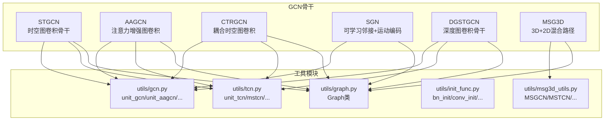
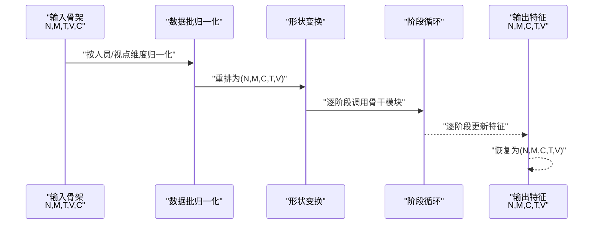
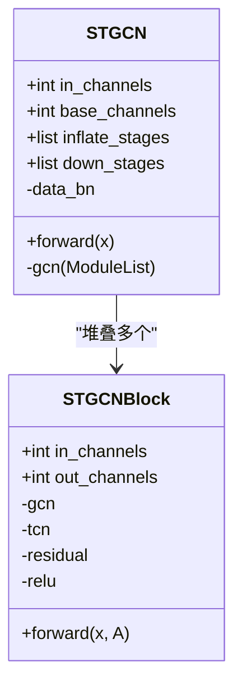
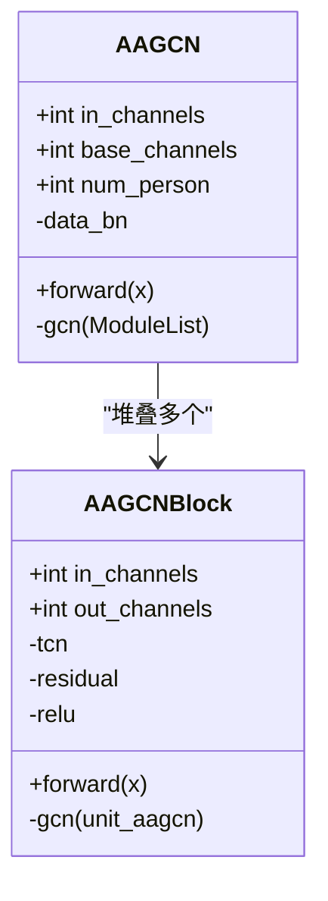
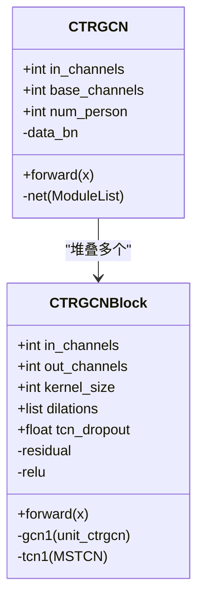
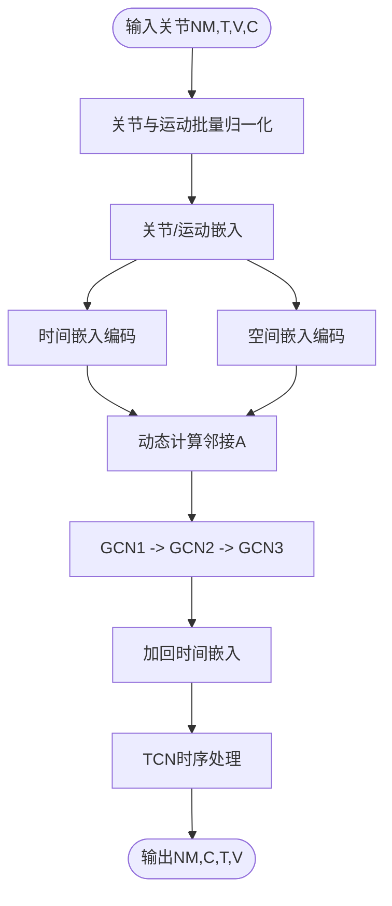
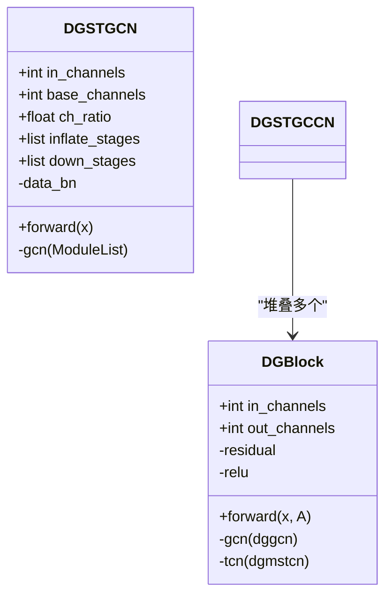
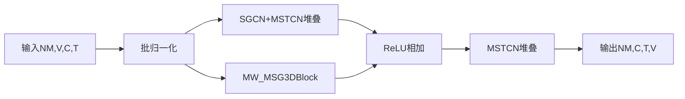
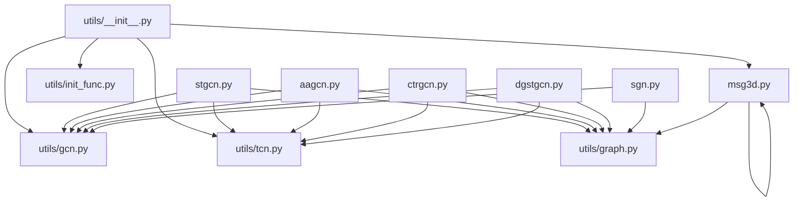

# ST-GCN系列算法

<cite>
**本文引用的文件**
- [pyskl/models/gcns/stgcn.py](file://pyskl/models/gcns/stgcn.py)
- [pyskl/models/gcns/aagcn.py](file://pyskl/models/gcns/aagcn.py)
- [pyskl/models/gcns/ctrgcn.py](file://pyskl/models/gcns/ctrgcn.py)
- [pyskl/models/gcns/sgn.py](file://pyskl/models/gcns/sgn.py)
- [pyskl/models/gcns/dgstgcn.py](file://pyskl/models/gcns/dgstgcn.py)
- [pyskl/models/gcns/msg3d.py](file://pyskl/models/gcns/msg3d.py)
- [pyskl/models/gcns/utils/__init__.py](file://pyskl/models/gcns/utils/__init__.py)
- [pyskl/models/gcns/utils/gcn.py](file://pyskl/models/gcns/utils/gcn.py)
- [pyskl/models/gcns/utils/tcn.py](file://pyskl/models/gcns/utils/tcn.py)
- [pyskl/models/gcns/utils/msg3d_utils.py](file://pyskl/models/gcns/utils/msg3d_utils.py)
- [pyskl/models/gcns/utils/init_func.py](file://pyskl/models/gcns/utils/init_func.py)
- [pyskl/utils/graph.py](file://pyskl/utils/graph.py)
- [configs/stgcn/stgcn_pyskl_ntu60_xsub_3dkp/b.py](file://configs/stgcn/stgcn_pyskl_ntu60_xsub_3dkp/b.py)
- [configs/aagcn/aagcn_pyskl_ntu60_xsub_3dkp/b.py](file://configs/aagcn/aagcn_pyskl_ntu60_xsub_3dkp/b.py)
- [configs/ctrgcn/ctrgcn_pyskl_ntu60_xsub_3dkp/b.py](file://configs/ctrgcn/ctrgcn_pyskl_ntu60_xsub_3dkp/b.py)
</cite>

## 目录
1. [引言](#引言)
2. [项目结构](#项目结构)
3. [核心组件](#核心组件)
4. [架构总览](#架构总览)
5. [详细组件分析](#详细组件分析)
6. [依赖关系分析](#依赖关系分析)
7. [性能考量](#性能考量)
8. [故障排查指南](#故障排查指南)
9. [结论](#结论)
10. [附录](#附录)

## 引言
本技术文档围绕ST-GCN系列算法展开，系统梳理并对比STGCN、AAGCN、CTR-GCN、SGN与DGSTGCN等模型在骨架序列上的时空图卷积设计。重点解释STGCNBlock模块的“先空间后时间”的经典堆叠范式；AAGCN通过注意力增强的空间图卷积；CTR-GCN引入多尺度时间卷积与耦合图卷积；SGN以可学习邻接矩阵与运动编码为核心；DGSTGCN采用深度图卷积与深度多分支TCN；MSG3D融合3D时序与2D空间路径。文档同时给出网络结构差异、参数配置要点、适用场景、复杂度与内存估算，并提供配置示例路径。

## 项目结构
本仓库中与ST-GCN系列直接相关的核心代码位于pyskl/models/gcns目录，配套的工具模块位于pyskl/models/gcns/utils，训练配置位于configs目录。下图展示与ST-GCN系列相关的模块组织与依赖关系。

图表来源
- [pyskl/models/gcns/stgcn.py](file://pyskl/models/gcns/stgcn.py#L56-L138)
- [pyskl/models/gcns/aagcn.py](file://pyskl/models/gcns/aagcn.py#L48-L131)
- [pyskl/models/gcns/ctrgcn.py](file://pyskl/models/gcns/ctrgcn.py#L46-L94)
- [pyskl/models/gcns/sgn.py](file://pyskl/models/gcns/sgn.py#L9-L102)
- [pyskl/models/gcns/dgstgcn.py](file://pyskl/models/gcns/dgstgcn.py#L49-L134)
- [pyskl/models/gcns/msg3d.py](file://pyskl/models/gcns/msg3d.py#L10-L79)
- [pyskl/models/gcns/utils/__init__.py](file://pyskl/models/gcns/utils/__init__.py#L1-L16)
- [pyskl/utils/graph.py](file://pyskl/utils/graph.py)

章节来源
- [pyskl/models/gcns/stgcn.py](file://pyskl/models/gcns/stgcn.py#L1-L138)
- [pyskl/models/gcns/aagcn.py](file://pyskl/models/gcns/aagcn.py#L1-L131)
- [pyskl/models/gcns/ctrgcn.py](file://pyskl/models/gcns/ctrgcn.py#L1-L94)
- [pyskl/models/gcns/sgn.py](file://pyskl/models/gcns/sgn.py#L1-L102)
- [pyskl/models/gcns/dgstgcn.py](file://pyskl/models/gcns/dgstgcn.py#L1-L134)
- [pyskl/models/gcns/msg3d.py](file://pyskl/models/gcns/msg3d.py#L1-L79)
- [pyskl/models/gcns/utils/__init__.py](file://pyskl/models/gcns/utils/__init__.py#L1-L16)

## 核心组件
- STGCNBlock：标准时空堆叠单元，先空间图卷积再时间卷积，支持残差连接与步幅控制。
- STGCN：多阶段STGCNBlock堆叠，支持通道膨胀、下采样、批归一化模式选择。
- AAGCNBlock：空间图卷积替换为注意力增强版本，其余保持STGCNBlock一致。
- AAGCN：多阶段AAGCNBlock堆叠，支持数据批归一化类型与预训练加载。
- CTRGCNBlock：耦合时空单元，使用多尺度时间卷积与耦合图卷积，强调时间-空间耦合。
- CTRGCN：多阶段CTRGCNBlock堆叠，支持人员数批归一化。
- SGN：不依赖预定义邻接矩阵，通过输入特征动态构建邻接矩阵，结合关节与运动嵌入。
- DGBlock：深度图卷积与深度多分支TCN组合，强调深度分支与通用参数透传。
- DGSTGCN：多阶段DGBlock堆叠，支持通道膨胀、下采样与批归一化。
- MSG3D：融合3D时序路径与2D空间路径，形成混合时空表示。

章节来源
- [pyskl/models/gcns/stgcn.py](file://pyskl/models/gcns/stgcn.py#L13-L54)
- [pyskl/models/gcns/stgcn.py](file://pyskl/models/gcns/stgcn.py#L56-L138)
- [pyskl/models/gcns/aagcn.py](file://pyskl/models/gcns/aagcn.py#L11-L46)
- [pyskl/models/gcns/aagcn.py](file://pyskl/models/gcns/aagcn.py#L48-L131)
- [pyskl/models/gcns/ctrgcn.py](file://pyskl/models/gcns/ctrgcn.py#L9-L44)
- [pyskl/models/gcns/ctrgcn.py](file://pyskl/models/gcns/ctrgcn.py#L46-L94)
- [pyskl/models/gcns/sgn.py](file://pyskl/models/gcns/sgn.py#L9-L102)
- [pyskl/models/gcns/dgstgcn.py](file://pyskl/models/gcns/dgstgcn.py#L13-L47)
- [pyskl/models/gcns/dgstgcn.py](file://pyskl/models/gcns/dgstgcn.py#L49-L134)
- [pyskl/models/gcns/msg3d.py](file://pyskl/models/gcns/msg3d.py#L10-L79)

## 架构总览
下图展示ST-GCN系列骨干网络的通用前处理与主干流程：统一进行批归一化与形状变换，随后按阶段堆叠对应模块，最终恢复输出形状。

图表来源
- [pyskl/models/gcns/stgcn.py](file://pyskl/models/gcns/stgcn.py#L124-L137)
- [pyskl/models/gcns/aagcn.py](file://pyskl/models/gcns/aagcn.py#L116-L130)
- [pyskl/models/gcns/ctrgcn.py](file://pyskl/models/gcns/ctrgcn.py#L83-L93)
- [pyskl/models/gcns/dgstgcn.py](file://pyskl/models/gcns/dgstgcn.py#L120-L133)
- [pyskl/models/gcns/sgn.py](file://pyskl/models/gcns/sgn.py#L69-L101)

## 详细组件分析

### STGCNBlock与STGCN
- 设计理念
  - 先空间后时间的两路卷积：空间图卷积提取拓扑关系，时间卷积捕获时序动态。
  - 残差连接：当输入通道/步幅与输出匹配时直连，否则通过1×1卷积对齐。
  - 参数分发：通过gcn_/tcn_前缀将关键字参数分别传递给空间与时间子模块。
- 网络结构差异
  - STGCNBlock固定时间核大小与步幅，支持MSTCN或unit_tcn。
  - STGCN通过inflate_stages与down_stages控制通道膨胀与下采样，形成金字塔式特征图。
- 适用场景
  - 动作识别、行为理解等需要稳定时空建模的任务。
- 配置要点
  - graph_cfg：布局与空间模式；data_bn_type：MVC/VC/None；num_stages：阶段数；inflate_stages/down_stages：通道膨胀与下采样位置；tcn_dropout：首层时间dropout可移除。
- 复杂度与内存
  - 空间复杂度与邻接矩阵稀疏度、通道数、节点数相关；时间复杂度与卷积核大小、步幅、帧长相关；内存主要由中间特征张量与可学习参数占用。

图表来源
- [pyskl/models/gcns/stgcn.py](file://pyskl/models/gcns/stgcn.py#L13-L54)
- [pyskl/models/gcns/stgcn.py](file://pyskl/models/gcns/stgcn.py#L56-L138)

章节来源
- [pyskl/models/gcns/stgcn.py](file://pyskl/models/gcns/stgcn.py#L13-L54)
- [pyskl/models/gcns/stgcn.py](file://pyskl/models/gcns/stgcn.py#L56-L138)

### AAGCNBlock与AAGCN
- 注意力增强策略
  - 将空间图卷积替换为unit_aagcn，利用注意力权重自适应调整邻接矩阵，提升对关键关节/边的关注。
- 结构与STGCNBlock一致，支持残差与时间分支选择。
- 适用场景
  - 关节重要性差异较大、需要自适应邻接的学习任务。
- 配置要点
  - graph_cfg.mode通常设为spatial；data_bn_type可选MVC/VC；num_stages/inflate_stages/down_stages与STGCN类似。

图表来源
- [pyskl/models/gcns/aagcn.py](file://pyskl/models/gcns/aagcn.py#L11-L46)
- [pyskl/models/gcns/aagcn.py](file://pyskl/models/gcns/aagcn.py#L48-L131)

章节来源
- [pyskl/models/gcns/aagcn.py](file://pyskl/models/gcns/aagcn.py#L11-L46)
- [pyskl/models/gcns/aagcn.py](file://pyskl/models/gcns/aagcn.py#L48-L131)

### CTRGCNBlock与CTRGCN
- 时间-空间耦合设计
  - 使用MSTCN（多尺度时间卷积）与unit_ctrgcn（耦合图卷积）组合，强调时间与空间的联合建模。
  - 支持核大小、扩张率与时间dropout等参数。
- 适用场景
  - 对时间动态与拓扑关系耦合敏感的动作分类任务。
- 配置要点
  - num_person参与批归一化；inflate_stages/down_stages控制通道与下采样；部分参数在首层会做特殊处理。

图表来源
- [pyskl/models/gcns/ctrgcn.py](file://pyskl/models/gcns/ctrgcn.py#L9-L44)
- [pyskl/models/gcns/ctrgcn.py](file://pyskl/models/gcns/ctrgcn.py#L46-L94)

章节来源
- [pyskl/models/gcns/ctrgcn.py](file://pyskl/models/gcns/ctrgcn.py#L9-L44)
- [pyskl/models/gcns/ctrgcn.py](file://pyskl/models/gcns/ctrgcn.py#L46-L94)

### SGN（Skeleton Graph Network）
- 核心思想
  - 不依赖预定义邻接矩阵，通过输入特征计算可学习邻接A，结合关节嵌入与运动嵌入，强化时空表征。
  - 包含时间与空间嵌入编码，TCN用于进一步整合时序信息。
- 结构差异
  - 无固定图结构，而是从特征中动态生成邻接；包含多级GCN与TCN模块。
- 适用场景
  - 邻接不确定性、需要自适应拓扑的任务。
- 配置要点
  - in_channels/base_channels/num_joints/T等决定嵌入维度与TCN结构。

图表来源
- [pyskl/models/gcns/sgn.py](file://pyskl/models/gcns/sgn.py#L62-L101)

章节来源
- [pyskl/models/gcns/sgn.py](file://pyskl/models/gcns/sgn.py#L9-L102)

### DGBlock与DGSTGCN
- 深度分支与参数透传
  - 采用深度图卷积(dggcn)与深度多分支TCN(dgmstcn)，并通过gcn_/tcn_前缀将通用参数同时传递给空间与时间子模块。
  - 支持通道膨胀、下采样与批归一化。
- 适用场景
  - 需要更深空间/时间分支表达能力的任务。
- 配置要点
  - ch_ratio控制通道膨胀比例；inflate_stages/down_stages控制阶段变化；首层dropout与g1x1参数需注意清理。

图表来源
- [pyskl/models/gcns/dgstgcn.py](file://pyskl/models/gcns/dgstgcn.py#L13-L47)
- [pyskl/models/gcns/dgstgcn.py](file://pyskl/models/gcns/dgstgcn.py#L49-L134)

章节来源
- [pyskl/models/gcns/dgstgcn.py](file://pyskl/models/gcns/dgstgcn.py#L13-L47)
- [pyskl/models/gcns/dgstgcn.py](file://pyskl/models/gcns/dgstgcn.py#L49-L134)

### MSG3D
- 3D+2D混合路径
  - 3D路径使用MW_MSG3DBlock，2D路径使用MSG3D的SGCN+MSTCN堆叠，最后将两条路径激活和相加。
  - 通过不同窗口步长实现多尺度聚合。
- 适用场景
  - 需要同时建模全局时序与局部空间结构的任务。
- 配置要点
  - num_gcn_scales与num_g3d_scales控制空间与3D分支尺度；tcn_dropout控制正则化。

图表来源
- [pyskl/models/gcns/msg3d.py](file://pyskl/models/gcns/msg3d.py#L58-L75)

章节来源
- [pyskl/models/gcns/msg3d.py](file://pyskl/models/gcns/msg3d.py#L10-L79)

## 依赖关系分析
- 工具模块导出
  - utils/__init__.py集中导出GCN、TCN与MSG3D相关模块，便于骨干网络按需导入。
- 单元模块
  - gcn.py提供unit_gcn、unit_aagcn、unit_ctrgcn、unit_sgn、dggcn等单元；
  - tcn.py提供unit_tcn、mstcn、dgmstcn等时间卷积；
  - msg3d_utils.py提供MSGCN、MSTCN、MW_MSG3DBlock；
  - init_func.py提供初始化辅助函数。
- 图结构
  - 各骨干均通过utils/graph.py构造Graph对象并获取邻接矩阵A，作为空间图卷积的输入。

图表来源
- [pyskl/models/gcns/utils/__init__.py](file://pyskl/models/gcns/utils/__init__.py#L1-L16)
- [pyskl/models/gcns/utils/gcn.py](file://pyskl/models/gcns/utils/gcn.py)
- [pyskl/models/gcns/utils/tcn.py](file://pyskl/models/gcns/utils/tcn.py)
- [pyskl/models/gcns/utils/msg3d_utils.py](file://pyskl/models/gcns/utils/msg3d_utils.py)
- [pyskl/models/gcns/utils/init_func.py](file://pyskl/models/gcns/utils/init_func.py)
- [pyskl/utils/graph.py](file://pyskl/utils/graph.py)

章节来源
- [pyskl/models/gcns/utils/__init__.py](file://pyskl/models/gcns/utils/__init__.py#L1-L16)

## 性能考量
- 计算复杂度
  - STGCN/AAGCN/CTR-GCN/DGSTCN：空间复杂度与邻接矩阵非零元素数、通道数、节点数成正比；时间复杂度与卷积核大小、扩张率、步幅、帧长相关。
  - SGN：动态邻接计算带来额外开销，但可提升建模灵活性。
  - MSG3D：双路径并行，整体计算量更大，但多尺度聚合有助于提升精度。
- 内存消耗
  - 主要来自中间特征张量与可学习参数；SGN的动态邻接与多级GCN/TCN会增加显存占用。
- 优化建议
  - 合理设置num_stages、inflate_stages与ch_ratio，避免过度膨胀；
  - 控制tcn_dropout与batch size平衡训练稳定性与显存；
  - 在推理阶段可考虑冻结部分参数或降低分辨率。

## 故障排查指南
- 形状错误
  - 输入必须为(N,M,T,V,C)格式，若报错请检查数据预处理与FormatGCNInput是否正确执行。
- 邻接矩阵问题
  - graph_cfg.layout与mode需与数据标注一致；确保Graph类能正确加载邻接矩阵。
- 批归一化类型
  - MVC/VC/None三类BN需与数据维度匹配；MVC需num_person参数正确。
- 预训练加载
  - 若指定pretrained，请确认路径有效且权重键名与模型结构匹配。

章节来源
- [pyskl/models/gcns/stgcn.py](file://pyskl/models/gcns/stgcn.py#L119-L123)
- [pyskl/models/gcns/aagcn.py](file://pyskl/models/gcns/aagcn.py#L108-L114)
- [pyskl/models/gcns/ctrgcn.py](file://pyskl/models/gcns/ctrgcn.py#L79-L82)
- [pyskl/models/gcns/dgstgcn.py](file://pyskl/models/gcns/dgstgcn.py#L115-L118)
- [pyskl/models/gcns/sgn.py](file://pyskl/models/gcns/sgn.py#L46-L54)

## 结论
ST-GCN系列在骨架动作理解任务上提供了多样化的时空建模策略：STGCN/AAGCN/CTR-GCN/DGSTCN延续了经典的“先空间后时间”范式并各有扩展；SGN通过动态邻接与运动编码实现更灵活的拓扑建模；MSG3D融合3D与2D路径以增强多尺度表达。选择何种模型应综合考虑数据特性、计算资源与精度需求。

## 附录
- 配置示例路径
  - STGCN（NTU60 xsub 3dkp）：[配置文件](file://configs/stgcn/stgcn_pyskl_ntu60_xsub_3dkp/b.py#L1-L61)
  - AAGCN（NTU60 xsub 3dkp）：[配置文件](file://configs/aagcn/aagcn_pyskl_ntu60_xsub_3dkp/b.py#L1-L61)
  - CTR-GCN（NTU60 xsub 3dkp）：[配置文件](file://configs/ctrgcn/ctrgcn_pyskl_ntu60_xsub_3dkp/b.py#L1-L61)
- 训练与评估
  - 建议参考上述配置中的optimizer、lr_config、total_epochs与evaluation设置，结合具体数据集划分进行训练与验证。