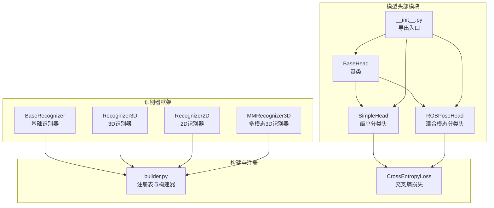
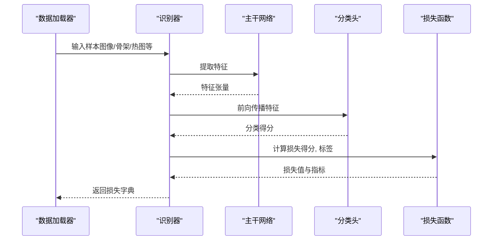
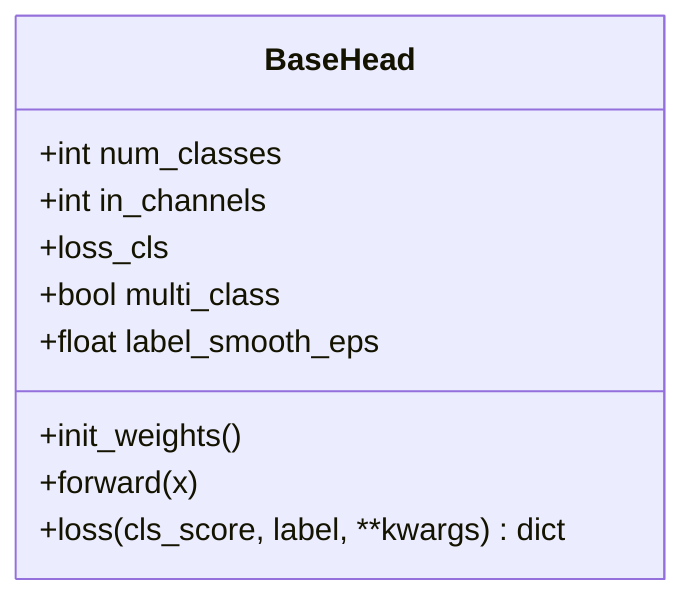
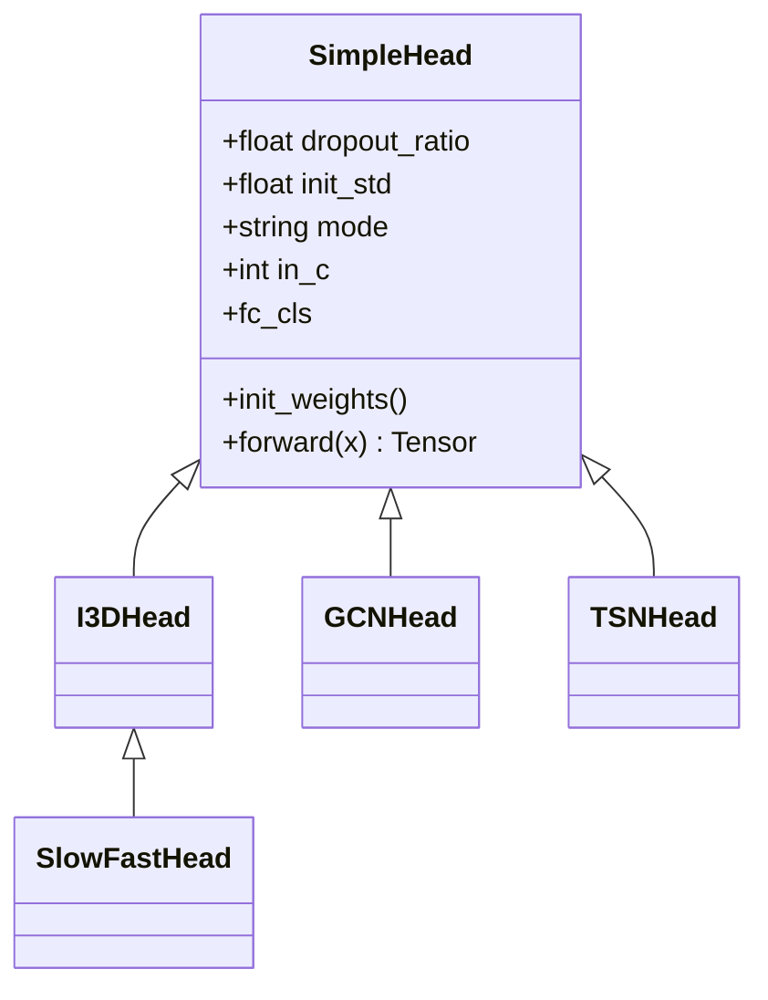
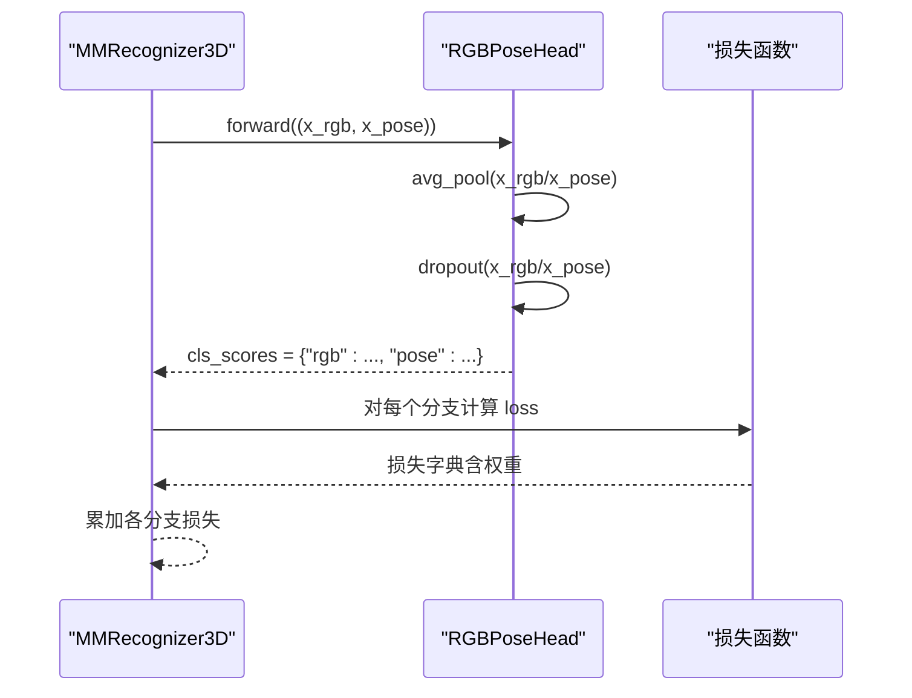
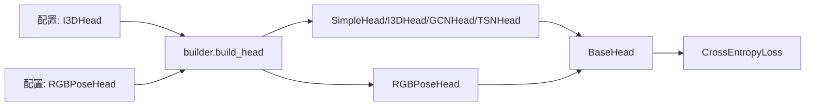

# 分类头模块

<cite>
**本文引用的文件**
- [pyskl/models/heads/base.py](file://pyskl/models/heads/base.py)
- [pyskl/models/heads/simple_head.py](file://pyskl/models/heads/simple_head.py)
- [pyskl/models/heads/rgbpose_head.py](file://pyskl/models/heads/rgbpose_head.py)
- [pyskl/models/heads/__init__.py](file://pyskl/models/heads/__init__.py)
- [pyskl/models/builder.py](file://pyskl/models/builder.py)
- [pyskl/models/recognizers/base.py](file://pyskl/models/recognizers/base.py)
- [pyskl/models/recognizers/mm_recognizer3d.py](file://pyskl/models/recognizers/mm_recognizer3d.py)
- [pyskl/models/recognizers/recognizer3d.py](file://pyskl/models/recognizers/recognizer3d.py)
- [pyskl/models/recognizers/recognizer2d.py](file://pyskl/models/recognizers/recognizer2d.py)
- [pyskl/models/losses/cross_entropy_loss.py](file://pyskl/models/losses/cross_entropy_loss.py)
- [configs/rgbpose_conv3d/rgbpose_conv3d.py](file://configs/rgbpose_conv3d/rgbpose_conv3d.py)
- [configs/posec3d/slowonly_r50_ntu60_xsub/joint.py](file://configs/posec3d/slowonly_r50_ntu60_xsub/joint.py)
</cite>

## 目录
1. [引言](#引言)
2. [项目结构](#项目结构)
3. [核心组件](#核心组件)
4. [架构总览](#架构总览)
5. [详细组件分析](#详细组件分析)
6. [依赖关系分析](#依赖关系分析)
7. [性能考虑](#性能考虑)
8. [故障排查指南](#故障排查指南)
9. [结论](#结论)
10. [附录](#附录)

## 引言
本文件系统性梳理 PySKL 的分类头模块，重点解释以下内容：
- 分类头在识别流程中的职责与作用
- BaseHead 基类的接口设计与通用能力（前向传播、损失计算、初始化机制）
- SimpleHead 简单分类头的实现细节（全连接层、池化策略、正则化）
- RGBPoseHead 混合模态分类头的架构与融合策略
- 分类头的配置项、参数设置与性能优化建议
- 自定义分类头的实现指南与最佳实践

## 项目结构
分类头模块位于模型子模块中，采用“基类 + 具体实现”的分层设计，并通过注册表统一构建与装配。识别器框架负责调用分类头完成最终的分类输出与损失计算。

图表来源
- [pyskl/models/heads/base.py](file://pyskl/models/heads/base.py#L10-L87)
- [pyskl/models/heads/simple_head.py](file://pyskl/models/heads/simple_head.py#L9-L157)
- [pyskl/models/heads/rgbpose_head.py](file://pyskl/models/heads/rgbpose_head.py#L8-L79)
- [pyskl/models/heads/__init__.py](file://pyskl/models/heads/__init__.py#L1-L5)
- [pyskl/models/recognizers/base.py](file://pyskl/models/recognizers/base.py#L20-L71)
- [pyskl/models/recognizers/recognizer3d.py](file://pyskl/models/recognizers/recognizer3d.py#L9-L27)
- [pyskl/models/recognizers/recognizer2d.py](file://pyskl/models/recognizers/recognizer2d.py#L8-L30)
- [pyskl/models/recognizers/mm_recognizer3d.py](file://pyskl/models/recognizers/mm_recognizer3d.py#L5-L61)
- [pyskl/models/builder.py](file://pyskl/models/builder.py#L17-L29)
- [pyskl/models/losses/cross_entropy_loss.py](file://pyskl/models/losses/cross_entropy_loss.py#L33-L82)

章节来源
- [pyskl/models/heads/__init__.py](file://pyskl/models/heads/__init__.py#L1-L5)
- [pyskl/models/builder.py](file://pyskl/models/builder.py#L1-L39)

## 核心组件
- BaseHead：定义分类头的抽象接口与通用损失计算逻辑，支持多标签平滑、Top-K 准确率统计等。
- SimpleHead：面向视频/骨架的通用分类头，支持 2D、3D、GCN 三种模式的特征适配与全连接分类。
- RGBPoseHead：面向 RGB+骨架的混合模态分类头，分别对两路特征进行池化、Dropout 与线性分类，输出多分支得分并可加权融合。

章节来源
- [pyskl/models/heads/base.py](file://pyskl/models/heads/base.py#L10-L87)
- [pyskl/models/heads/simple_head.py](file://pyskl/models/heads/simple_head.py#L9-L157)
- [pyskl/models/heads/rgbpose_head.py](file://pyskl/models/heads/rgbpose_head.py#L8-L79)

## 架构总览
识别器在训练/测试阶段调用分类头：
- 训练阶段：提取特征后送入分类头，得到分类得分并计算损失；支持多分支损失加权。
- 测试阶段：对多片段/多裁剪的分类得分进行平均，输出最终预测结果。

图表来源
- [pyskl/models/recognizers/base.py](file://pyskl/models/recognizers/base.py#L72-L82)
- [pyskl/models/recognizers/recognizer3d.py](file://pyskl/models/recognizers/recognizer3d.py#L13-L27)
- [pyskl/models/recognizers/recognizer2d.py](file://pyskl/models/recognizers/recognizer2d.py#L12-L30)
- [pyskl/models/recognizers/mm_recognizer3d.py](file://pyskl/models/recognizers/mm_recognizer3d.py#L9-L34)
- [pyskl/models/heads/base.py](file://pyskl/models/heads/base.py#L51-L87)

## 详细组件分析

### BaseHead 基类
- 设计目的：为所有分类头提供统一接口与通用能力，确保不同头在训练/测试流程中行为一致。
- 关键接口
  - init_weights：权重初始化钩子，供子类覆盖。
  - forward：抽象方法，定义前向计算。
  - loss：通用损失计算与评估指标统计（Top-1/Top-5），支持标签平滑与软标签场景。
- 参数与行为
  - num_classes/in_channels：类别数与输入通道数。
  - loss_cls：通过注册表构建具体损失函数。
  - multi_class/label_smooth_eps：多标签任务与标签平滑配置。
  - loss 方法内部处理标量/向量标签、多标签平滑以及返回字典格式的损失与指标。

图表来源
- [pyskl/models/heads/base.py](file://pyskl/models/heads/base.py#L10-L87)

章节来源
- [pyskl/models/heads/base.py](file://pyskl/models/heads/base.py#L10-L87)

### SimpleHead 简单分类头
- 设计目的：为视频/骨架等多模态提供统一的分类头实现，自动适配不同模式的输入形状。
- 模式与适配
  - 2D：对 5D 特征（N,S,C,H,W）做时空自适应池化，再在时间维平均。
  - 3D：对 4D/5D 特征（N,C,T,H,W 或拼接后的多分支）做 3D 自适应池化，展平为 2D。
  - GCN：对 5D 特征（N,M,C,T,V）做时空池化，聚合人体轨迹。
- 结构组成
  - Dropout（可选）
  - 全连接层（Linear）映射到类别空间
  - 权重初始化（normal_init）
- 子类
  - I3DHead：3D 模式专用
  - GCNHead：GCN 模式专用
  - TSNHead：2D 模式专用
  - SlowFastHead：继承 I3DHead，复用 3D 逻辑

图表来源
- [pyskl/models/heads/simple_head.py](file://pyskl/models/heads/simple_head.py#L9-L157)

章节来源
- [pyskl/models/heads/simple_head.py](file://pyskl/models/heads/simple_head.py#L9-L157)

### RGBPoseHead 混合模态分类头
- 设计目的：同时利用 RGB 视频与骨架热图的互补信息，分别建模空间与时间动态特征。
- 架构要点
  - 双分支结构：RGB 路径与 Pose 路径分别经过池化、Dropout 与线性分类。
  - 统一池化：对两路特征使用 3D 自适应池化，展平为 2D 特征。
  - 多分支输出：返回字典形式的分类得分，键分别为 rgb/pose。
  - 损失配置：支持按分支设置损失权重，便于平衡两路贡献。
- 与识别器的协作
  - 在多模态识别器中，分类头返回多个分支得分，识别器遍历 loss_components 并按权重累加损失。

图表来源
- [pyskl/models/recognizers/mm_recognizer3d.py](file://pyskl/models/recognizers/mm_recognizer3d.py#L22-L34)
- [pyskl/models/heads/rgbpose_head.py](file://pyskl/models/heads/rgbpose_head.py#L59-L79)

章节来源
- [pyskl/models/heads/rgbpose_head.py](file://pyskl/models/heads/rgbpose_head.py#L8-L79)
- [pyskl/models/recognizers/mm_recognizer3d.py](file://pyskl/models/recognizers/mm_recognizer3d.py#L5-L61)

## 依赖关系分析
- 注册与构建
  - HEADS 注册表用于统一构建分类头实例，通过配置中的 type 字段解析。
  - BaseHead 内部通过 build_loss 构建损失函数，支持软标签与类别权重。
- 识别器耦合
  - BaseRecognizer 将 cls_head 作为可选组件，init_weights 会依次初始化主干与分类头。
  - 多模态识别器（MMRecognizer3D）直接将主干输出的双分支特征传入 RGBPoseHead。
- 典型配置
  - I3DHead：常用于 3D 主干（如 SlowOnly）的视频动作识别。
  - RGBPoseHead：常用于 RGBPoseConv3D 双流主干的混合模态识别。

图表来源
- [pyskl/models/builder.py](file://pyskl/models/builder.py#L17-L29)
- [pyskl/models/heads/base.py](file://pyskl/models/heads/base.py#L38-L39)
- [pyskl/models/losses/cross_entropy_loss.py](file://pyskl/models/losses/cross_entropy_loss.py#L33-L82)
- [configs/rgbpose_conv3d/rgbpose_conv3d.py](file://configs/rgbpose_conv3d/rgbpose_conv3d.py#L30-L41)
- [configs/posec3d/slowonly_r50_ntu60_xsub/joint.py](file://configs/posec3d/slowonly_r50_ntu60_xsub/joint.py#L15-L19)

章节来源
- [pyskl/models/builder.py](file://pyskl/models/builder.py#L1-L39)
- [pyskl/models/heads/base.py](file://pyskl/models/heads/base.py#L1-L87)
- [pyskl/models/losses/cross_entropy_loss.py](file://pyskl/models/losses/cross_entropy_loss.py#L33-L82)
- [configs/rgbpose_conv3d/rgbpose_conv3d.py](file://configs/rgbpose_conv3d/rgbpose_conv3d.py#L30-L41)
- [configs/posec3d/slowonly_r50_ntu60_xsub/joint.py](file://configs/posec3d/slowonly_r50_ntu60_xsub/joint.py#L15-L19)

## 性能考虑
- 池化与降维
  - 3D/2D 自适应池化可有效压缩时空维度，降低全连接层参数规模。
  - GCN 模式下对时间维与空间维的池化有助于去除冗余信息。
- 正则化
  - Dropout 在 SimpleHead 中可缓解过拟合，建议在小样本或复杂主干上适度启用。
  - 初始化标准差（init_std）影响分类层权重分布，过大的标准差可能导致梯度不稳定。
- 多模态融合
  - RGBPoseHead 的两路损失权重可按任务需求调整，避免某一路主导训练。
  - 若主干输出通道差异较大，需确保 in_channels 与 Linear 层匹配，避免形状不一致错误。
- 训练稳定性
  - 标签平滑（label_smooth_eps）可提升泛化能力，但需与损失类型兼容。
  - 软标签场景下，注意损失函数对输入形状的要求与归一化处理。

## 故障排查指南
- 形状不匹配
  - 症状：forward 报错提示维度不一致。
  - 排查：确认输入是否符合 SimpleHead 的模式假设（2D/3D/GCN），必要时检查主干输出形状。
- 损失计算异常
  - 症状：loss 返回空或指标缺失。
  - 排查：检查标签是否为标量/向量，确认 multi_class 与 label_smooth_eps 设置；核对损失函数是否支持软标签。
- 多模态损失未生效
  - 症状：仅看到单一分支损失。
  - 排查：确认识别器是否遍历了 loss_components 并按权重累加；核对配置中的 loss_weights 与 loss_components 长度一致。
- 初始化失败
  - 症状：分类头权重初始化报错。
  - 排查：确认 init_std 合理；确保 fc_cls 已正确创建且 in_channels 匹配。

章节来源
- [pyskl/models/heads/simple_head.py](file://pyskl/models/heads/simple_head.py#L49-L94)
- [pyskl/models/heads/rgbpose_head.py](file://pyskl/models/heads/rgbpose_head.py#L59-L79)
- [pyskl/models/heads/base.py](file://pyskl/models/heads/base.py#L51-L87)
- [pyskl/models/recognizers/mm_recognizer3d.py](file://pyskl/models/recognizers/mm_recognizer3d.py#L22-L34)

## 结论
- 分类头模块以 BaseHead 为核心抽象，提供统一的接口与通用损失计算能力。
- SimpleHead 通过模式化适配，覆盖 2D/3D/GCN 场景，适合快速集成。
- RGBPoseHead 实现了 RGB 与骨架的解耦建模与融合，适用于多模态动作识别。
- 通过合理的配置与正则化策略，可在不同任务中取得稳定且高效的性能。

## 附录

### 配置与参数参考
- BaseHead 通用参数
  - num_classes：类别数量
  - in_channels：输入通道数
  - loss_cls：损失配置（默认交叉熵）
  - multi_class：是否多标签任务
  - label_smooth_eps：标签平滑系数
- SimpleHead 特有参数
  - dropout：Dropout 比例
  - init_std：权重初始化标准差
  - mode：'3D'/'2D'/'GCN'
- RGBPoseHead 特有参数
  - in_channels：二元元组（RGB通道数, 姿态通道数）
  - dropout：可为浮点或字典（rgb/pose）
  - loss_components：损失分支列表（如 ['rgb','pose']）
  - loss_weights：对应分支权重（可为浮点或列表）

章节来源
- [pyskl/models/heads/base.py](file://pyskl/models/heads/base.py#L18-L40)
- [pyskl/models/heads/simple_head.py](file://pyskl/models/heads/simple_head.py#L13-L30)
- [pyskl/models/heads/rgbpose_head.py](file://pyskl/models/heads/rgbpose_head.py#L12-L29)
- [configs/rgbpose_conv3d/rgbpose_conv3d.py](file://configs/rgbpose_conv3d/rgbpose_conv3d.py#L30-L35)
- [configs/posec3d/slowonly_r50_ntu60_xsub/joint.py](file://configs/posec3d/slowonly_r50_ntu60_xsub/joint.py#L15-L19)

### 自定义分类头实现指南
- 继承 BaseHead 并实现
  - init_weights：初始化分类层与可学习参数
  - forward：接收主干输出，返回分类得分（张量或字典）
- 与识别器集成
  - 在配置中通过 type 指定新头类型，确保 HEADS 注册表已注册
  - 若涉及多分支输出，识别器需相应遍历并累加损失
- 最佳实践
  - 明确定义输入模式（2D/3D/GCN），并在 forward 中严格校验形状
  - 合理设置 dropout 与初始化参数，避免过拟合与梯度不稳定
  - 多模态场景下，确保两路特征通道与池化策略一致

章节来源
- [pyskl/models/heads/base.py](file://pyskl/models/heads/base.py#L42-L49)
- [pyskl/models/heads/simple_head.py](file://pyskl/models/heads/simple_head.py#L45-L48)
- [pyskl/models/heads/rgbpose_head.py](file://pyskl/models/heads/rgbpose_head.py#L54-L57)
- [pyskl/models/builder.py](file://pyskl/models/builder.py#L17-L19)