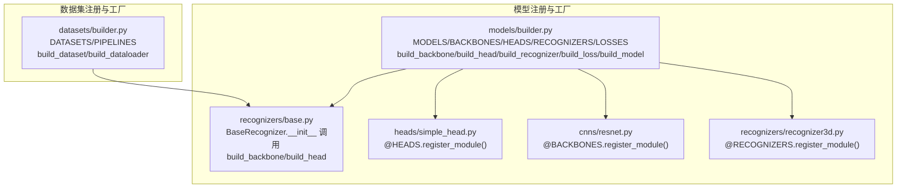
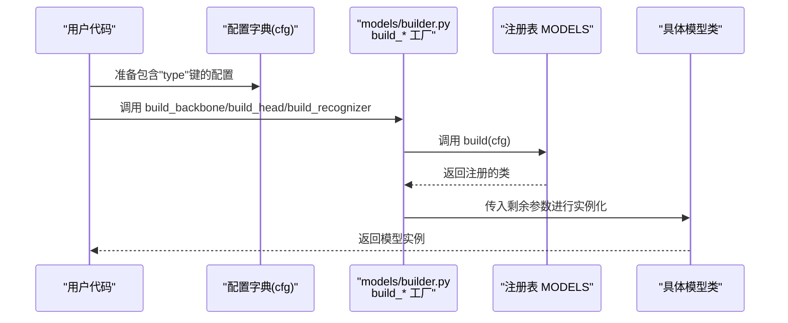
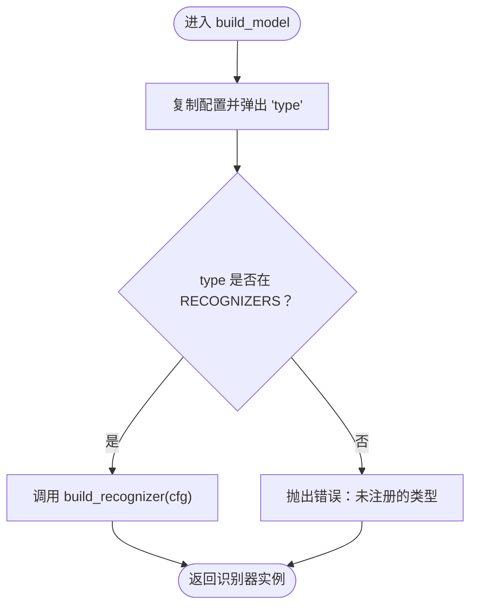
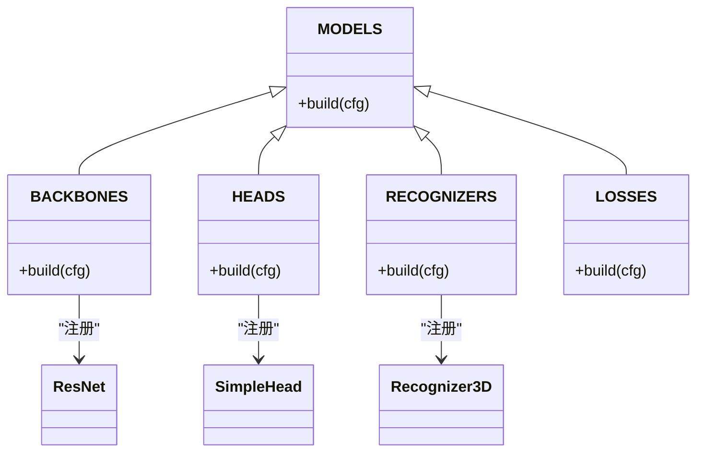
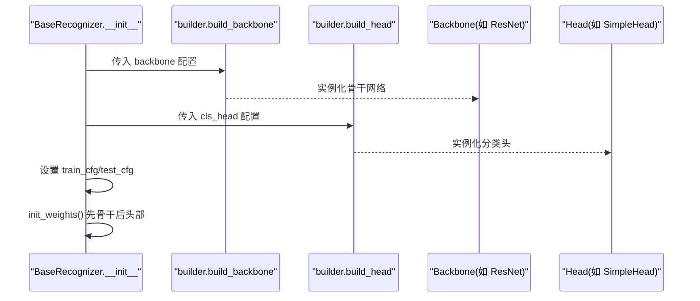
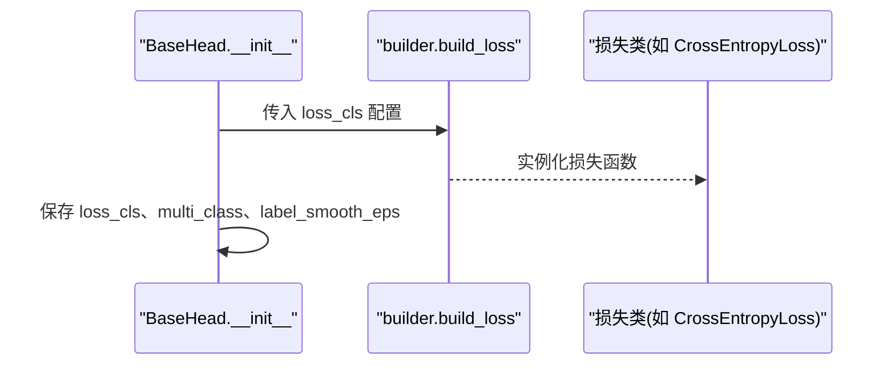
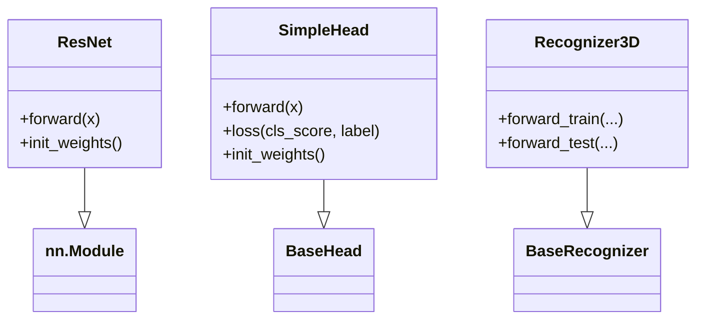
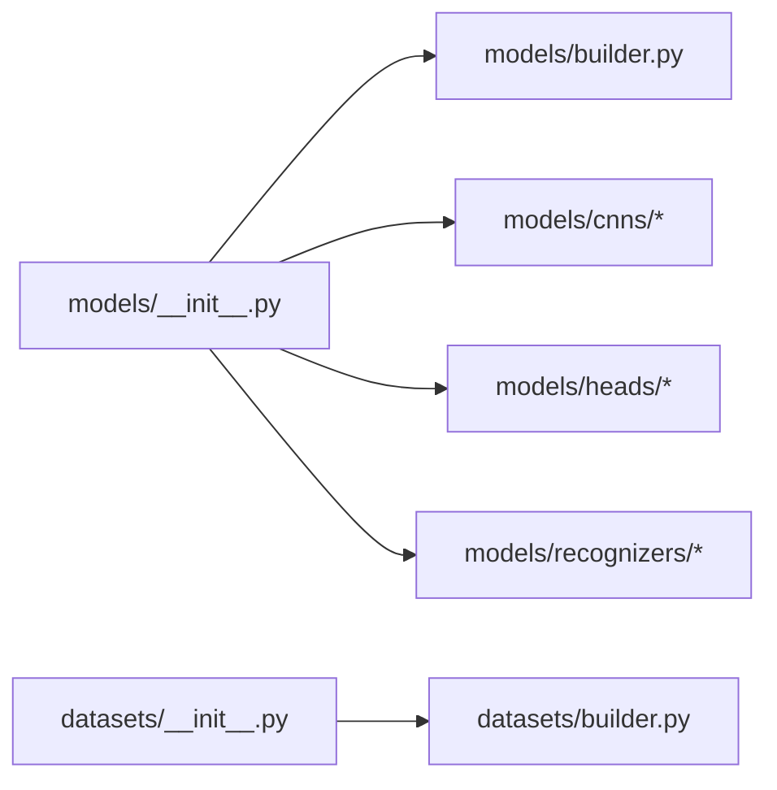

# 模型构建系统

<cite>
**本文引用的文件**
- [pyskl/models/builder.py](file://pyskl/models/builder.py)
- [pyskl/datasets/builder.py](file://pyskl/datasets/builder.py)
- [pyskl/models/__init__.py](file://pyskl/models/__init__.py)
- [pyskl/datasets/__init__.py](file://pyskl/datasets/__init__.py)
- [pyskl/models/recognizers/base.py](file://pyskl/models/recognizers/base.py)
- [pyskl/models/heads/base.py](file://pyskl/models/heads/base.py)
- [pyskl/models/recognizers/recognizer3d.py](file://pyskl/models/recognizers/recognizer3d.py)
- [pyskl/models/heads/simple_head.py](file://pyskl/models/heads/simple_head.py)
- [pyskl/models/cnns/resnet.py](file://pyskl/models/cnns/resnet.py)
- [pyskl/utils/__init__.py](file://pyskl/utils/__init__.py)
</cite>

## 目录
1. [引言](#引言)
2. [项目结构](#项目结构)
3. [核心组件](#核心组件)
4. [架构总览](#架构总览)
5. [详细组件分析](#详细组件分析)
6. [依赖关系分析](#依赖关系分析)
7. [性能考虑](#性能考虑)
8. [故障排查指南](#故障排查指南)
9. [结论](#结论)
10. [附录：使用示例与最佳实践](#附录使用示例与最佳实践)

## 引言
本文件面向PySKL模型构建系统，系统性阐述其“工厂模式 + 注册表机制”的设计与实现，重点解释以下内容：
- 模型工厂函数：build_backbone、build_head、build_recognizer、build_loss、build_model 的职责与参数解析逻辑
- 注册表机制：如何通过统一的 MODELS 注册表实现模型的动态创建与配置管理
- 完整构建流程：从配置字典解析到模型实例化的关键步骤
- 最佳实践：模型注册、导入与初始化的规范建议
- 实战示例与常见问题：帮助快速上手与定位问题

## 项目结构
PySKL在“模型”和“数据集”两个维度均采用“工厂 + 注册表”的架构：
- 模型侧：pyskl/models/builder.py 提供统一的注册表与工厂方法；具体模型（如 ResNet、SimpleHead、Recognizer3D）通过装饰器注册到注册表
- 数据集侧：pyskl/datasets/builder.py 提供 DATASETS 与 PIPELINES 注册表，以及构建 DataLoader 的工厂方法

图表来源
- [pyskl/models/builder.py](file://pyskl/models/builder.py#L1-L39)
- [pyskl/models/recognizers/base.py](file://pyskl/models/recognizers/base.py#L36-L60)
- [pyskl/models/recognizers/recognizer3d.py](file://pyskl/models/recognizers/recognizer3d.py#L9-L11)
- [pyskl/models/heads/simple_head.py](file://pyskl/models/heads/simple_head.py#L9-L11)
- [pyskl/models/cnns/resnet.py](file://pyskl/models/cnns/resnet.py#L238-L239)
- [pyskl/datasets/builder.py](file://pyskl/datasets/builder.py#L23-L45)

章节来源
- [pyskl/models/builder.py](file://pyskl/models/builder.py#L1-L39)
- [pyskl/datasets/builder.py](file://pyskl/datasets/builder.py#L1-L134)
- [pyskl/models/__init__.py](file://pyskl/models/__init__.py#L1-L8)
- [pyskl/datasets/__init__.py](file://pyskl/datasets/__init__.py#L1-L13)

## 核心组件
- 统一注册表与工厂
  - MODELS 作为根注册表，继承自 MMCV 的 MODELS，BACKBONES、HEADS、RECOGNIZERS、LOSSES 均指向同一注册表，便于集中管理
  - 工厂方法：build_backbone、build_head、build_recognizer、build_loss 均委托给对应注册表的 build(cfg)
  - build_model 则先解析 cfg 中的 type 字段，再判断是否为已注册的识别器类型，从而选择构建路径
- 训练器基类
  - BaseRecognizer 在构造时调用 build_backbone 与 build_head，完成骨干网络与分类头的装配，并统一初始化权重
- 头部基类
  - BaseHead 在构造时通过 build_loss 构建损失函数，支持多分类与标签平滑等通用能力
- 具体实现
  - ResNet 以 @BACKBONES.register_module() 注册为骨干网络
  - SimpleHead、I3DHead、GCNHead、TSNHead 以 @HEADS.register_module() 注册为分类头
  - Recognizer3D 以 @RECOGNIZERS.register_module() 注册为识别器

章节来源
- [pyskl/models/builder.py](file://pyskl/models/builder.py#L5-L39)
- [pyskl/models/recognizers/base.py](file://pyskl/models/recognizers/base.py#L36-L71)
- [pyskl/models/heads/base.py](file://pyskl/models/heads/base.py#L29-L40)
- [pyskl/models/cnns/resnet.py](file://pyskl/models/cnns/resnet.py#L238-L239)
- [pyskl/models/heads/simple_head.py](file://pyskl/models/heads/simple_head.py#L9-L11)
- [pyskl/models/recognizers/recognizer3d.py](file://pyskl/models/recognizers/recognizer3d.py#L9-L11)

## 架构总览
下图展示“配置字典 -> 注册表 -> 实例化”的整体流程，涵盖模型工厂与注册表的关系。

图表来源
- [pyskl/models/builder.py](file://pyskl/models/builder.py#L12-L29)
- [pyskl/models/builder.py](file://pyskl/models/builder.py#L32-L39)

## 详细组件分析

### 工厂函数与参数解析
- build_backbone(cfg)
  - 输入：配置字典，至少包含 "type" 键
  - 行为：通过 BACKBONES 注册表解析并实例化骨干网络
- build_head(cfg)
  - 输入：配置字典，至少包含 "type" 键
  - 行为：通过 HEADS 注册表解析并实例化分类头
- build_recognizer(cfg)
  - 输入：配置字典，至少包含 "type" 键
  - 行为：通过 RECOGNIZERS 注册表解析并实例化识别器
- build_loss(cfg)
  - 输入：配置字典，至少包含 "type" 键
  - 行为：通过 LOSSES 注册表解析并实例化损失函数
- build_model(cfg)
  - 输入：配置字典，包含 "type" 键
  - 行为：取出 "type" 后检查是否在 RECOGNIZERS 中，若是则走识别器构建路径，否则抛出异常

图表来源
- [pyskl/models/builder.py](file://pyskl/models/builder.py#L32-L39)

章节来源
- [pyskl/models/builder.py](file://pyskl/models/builder.py#L12-L39)

### 注册表机制与动态创建
- 注册表定义
  - MODELS = Registry('models', parent=MMCV_MODELS)，作为根注册表
  - BACKBONES、HEADS、RECOGNIZERS、LOSSES 均指向 MODELS，实现“同源异名”
- 动态注册
  - 具体模型通过装饰器 @BACKBONES.register_module()、@HEADS.register_module()、@RECOGNIZERS.register_module()、@LOSSES.register_module() 注册
- 动态创建
  - 各 build_* 方法内部调用对应注册表的 build(cfg)，由注册表根据 "type" 查找类并传参实例化

图表来源
- [pyskl/models/builder.py](file://pyskl/models/builder.py#L5-L9)
- [pyskl/models/cnns/resnet.py](file://pyskl/models/cnns/resnet.py#L238-L239)
- [pyskl/models/heads/simple_head.py](file://pyskl/models/heads/simple_head.py#L9-L11)
- [pyskl/models/recognizers/recognizer3d.py](file://pyskl/models/recognizers/recognizer3d.py#L9-L11)

章节来源
- [pyskl/models/builder.py](file://pyskl/models/builder.py#L5-L9)
- [pyskl/models/cnns/resnet.py](file://pyskl/models/cnns/resnet.py#L238-L239)
- [pyskl/models/heads/simple_head.py](file://pyskl/models/heads/simple_head.py#L9-L11)
- [pyskl/models/recognizers/recognizer3d.py](file://pyskl/models/recognizers/recognizer3d.py#L9-L11)

### 训练器装配流程（BaseRecognizer）
- 关键点
  - 在 __init__ 中分别调用 build_backbone(backbone) 与 build_head(cls_head)
  - 初始化权重：先初始化 backbone，再初始化 head（若存在）
  - 提供 extract_feat(imgs) 直接复用骨干网络提取特征
- 流程图

图表来源
- [pyskl/models/recognizers/base.py](file://pyskl/models/recognizers/base.py#L36-L71)
- [pyskl/models/builder.py](file://pyskl/models/builder.py#L12-L19)

章节来源
- [pyskl/models/recognizers/base.py](file://pyskl/models/recognizers/base.py#L36-L71)
- [pyskl/models/builder.py](file://pyskl/models/builder.py#L12-L19)

### 分类头装配与损失构建（BaseHead）
- 关键点
  - 在 __init__ 中通过 build_loss(loss_cls) 构建损失函数
  - 提供 loss(cls_score, label) 统一计算损失与指标（如 top-k 准确率）
- 流程图

图表来源
- [pyskl/models/heads/base.py](file://pyskl/models/heads/base.py#L29-L40)
- [pyskl/models/builder.py](file://pyskl/models/builder.py#L27-L29)

章节来源
- [pyskl/models/heads/base.py](file://pyskl/models/heads/base.py#L29-L88)
- [pyskl/models/builder.py](file://pyskl/models/builder.py#L27-L29)

### 具体模型示例：ResNet（骨干）、SimpleHead（头）、Recognizer3D（识别器）
- ResNet（骨干）
  - 通过 @BACKBONES.register_module() 注册，支持深度、步幅、输出索引等配置
- SimpleHead（头）
  - 通过 @HEADS.register_module() 注册，支持不同模式（2D/3D/GCN），内置全连接分类层与可选 Dropout
- Recognizer3D（识别器）
  - 通过 @RECOGNIZERS.register_module() 注册，基于 BaseRecognizer，封装了训练与测试前向流程

图表来源
- [pyskl/models/cnns/resnet.py](file://pyskl/models/cnns/resnet.py#L238-L479)
- [pyskl/models/heads/simple_head.py](file://pyskl/models/heads/simple_head.py#L9-L157)
- [pyskl/models/recognizers/recognizer3d.py](file://pyskl/models/recognizers/recognizer3d.py#L9-L86)
- [pyskl/models/recognizers/base.py](file://pyskl/models/recognizers/base.py#L20-L196)
- [pyskl/models/heads/base.py](file://pyskl/models/heads/base.py#L10-L88)

章节来源
- [pyskl/models/cnns/resnet.py](file://pyskl/models/cnns/resnet.py#L238-L479)
- [pyskl/models/heads/simple_head.py](file://pyskl/models/heads/simple_head.py#L9-L157)
- [pyskl/models/recognizers/recognizer3d.py](file://pyskl/models/recognizers/recognizer3d.py#L9-L86)
- [pyskl/models/recognizers/base.py](file://pyskl/models/recognizers/base.py#L20-L196)
- [pyskl/models/heads/base.py](file://pyskl/models/heads/base.py#L10-L88)

## 依赖关系分析
- 模块导入与导出
  - pyskl/models/__init__.py 将 builder、cnns、gcns、heads、losses、recognizers 下的符号统一导出，便于外部按需导入
  - pyskl/datasets/__init__.py 将数据集与构建器统一导出，便于训练/推理脚本直接使用
- 工厂与注册表耦合
  - 所有模型类通过装饰器注册到 MODELS，工厂方法仅依赖注册表的 build 接口，降低耦合度
- 可视化

图表来源
- [pyskl/models/__init__.py](file://pyskl/models/__init__.py#L1-L8)
- [pyskl/datasets/__init__.py](file://pyskl/datasets/__init__.py#L1-L13)

章节来源
- [pyskl/models/__init__.py](file://pyskl/models/__init__.py#L1-L8)
- [pyskl/datasets/__init__.py](file://pyskl/datasets/__init__.py#L1-L13)

## 性能考虑
- 注册表查找为常数级开销，构建成本主要取决于具体模型类的复杂度
- 对于大型骨干网络（如 ResNet、3D CNN），建议合理设置输出索引与冻结阶段，减少前向计算量
- 分类头的池化与全连接层在高维特征上可能成为瓶颈，应结合任务需求选择合适的模式（2D/3D/GCN）

## 故障排查指南
- 类型未注册
  - 现象：调用 build_model 或指定 type 时抛出“未注册”错误
  - 原因：cfg 中的 type 未在对应注册表中注册
  - 处理：确认模型类是否正确使用 @register_module() 装饰器注册
- 参数缺失或类型不匹配
  - 现象：实例化时报错或行为异常
  - 原因：配置字典缺少必要键或类型不符
  - 处理：对照具体模型类的 __init__ 参数清单核对配置
- 初始化权重失败
  - 现象：预训练权重加载不生效或报错
  - 原因：预训练路径错误或权重形状不匹配
  - 处理：检查预训练路径与缓存策略，确保权重键名映射正确

章节来源
- [pyskl/models/builder.py](file://pyskl/models/builder.py#L32-L39)
- [pyskl/models/cnns/resnet.py](file://pyskl/models/cnns/resnet.py#L417-L433)

## 结论
PySKL的模型构建系统以“统一注册表 + 工厂方法”为核心，实现了模型的动态装配与配置驱动。通过在训练器基类中统一调用 build_backbone/build_head，配合头部基类的损失构建，形成清晰的“配置 -> 实例化”闭环。该设计具备良好的扩展性与可维护性，适合在多模型、多任务场景下快速迭代。

## 附录：使用示例与最佳实践
- 使用示例（步骤说明）
  - 准备配置字典：包含 "type" 与各子模块的参数键
  - 导入工厂与注册表：from pyskl.models import builder
  - 构建骨干/头/识别器：分别调用 build_backbone/backbone_cfg、build_head/head_cfg、build_recognizer(rec_cfg)
  - 训练器装配：在 BaseRecognizer 子类中传入 backbone 与 head 配置
- 最佳实践
  - 明确分层：backbone/head/recognizer 各司其职，避免在单一模块内混杂过多逻辑
  - 规范注册：所有新模型类必须使用对应注册表的装饰器进行注册
  - 参数校验：在 __init__ 内对输入参数进行断言与默认值处理，提升健壮性
  - 权重初始化：优先使用预训练权重，必要时补充自定义初始化策略
  - 可观测性：利用训练器的 _parse_losses 输出日志变量，便于监控与调试