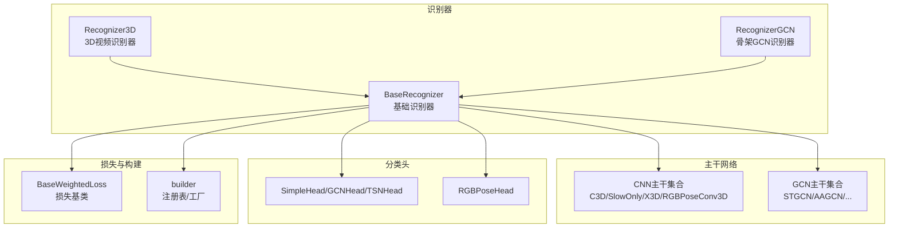
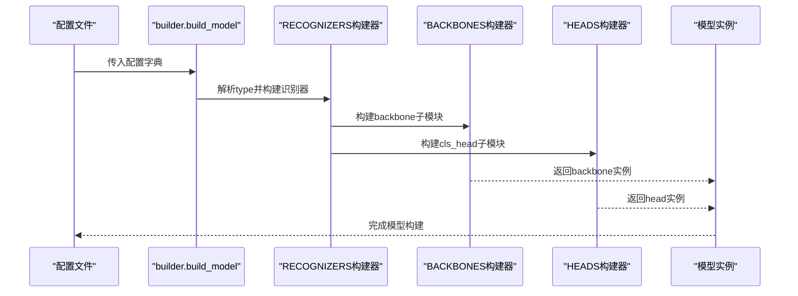
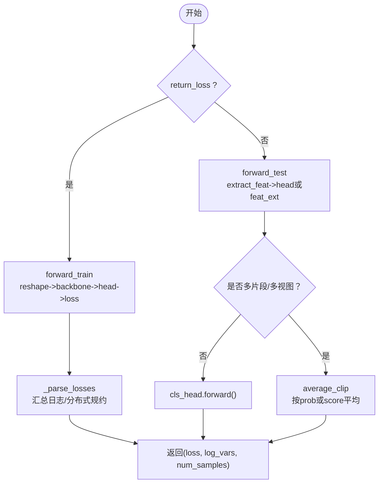
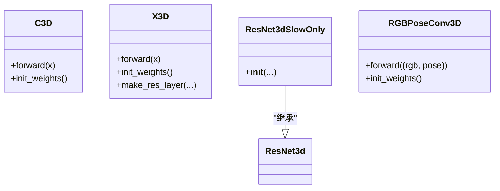
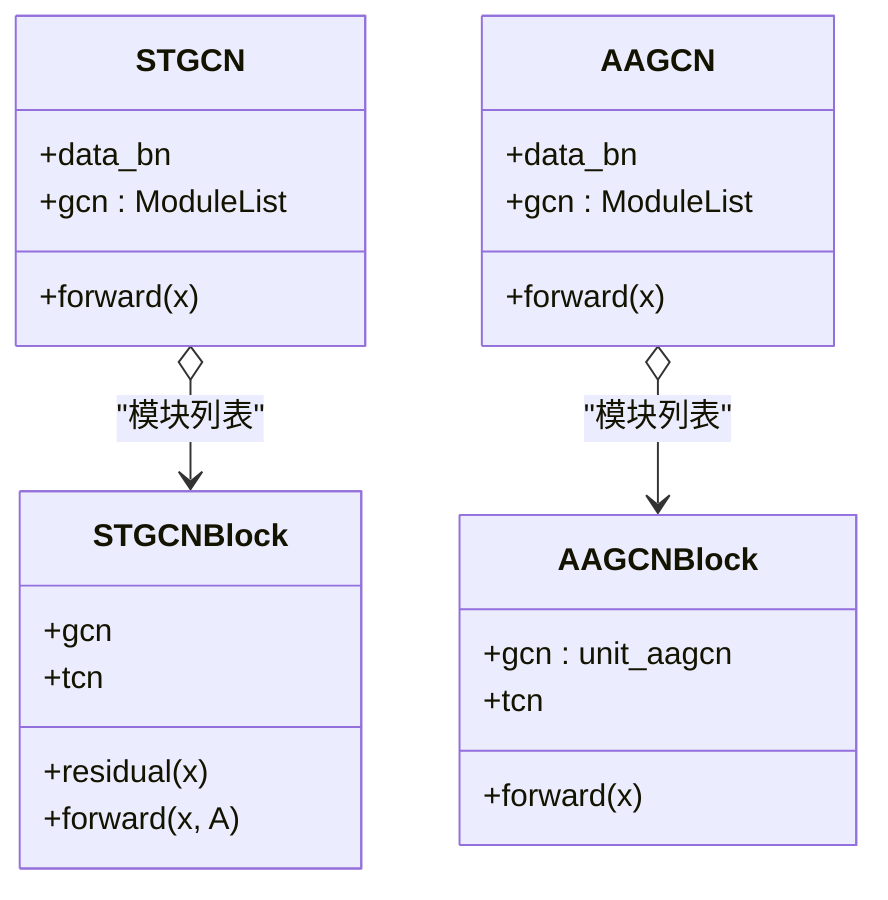
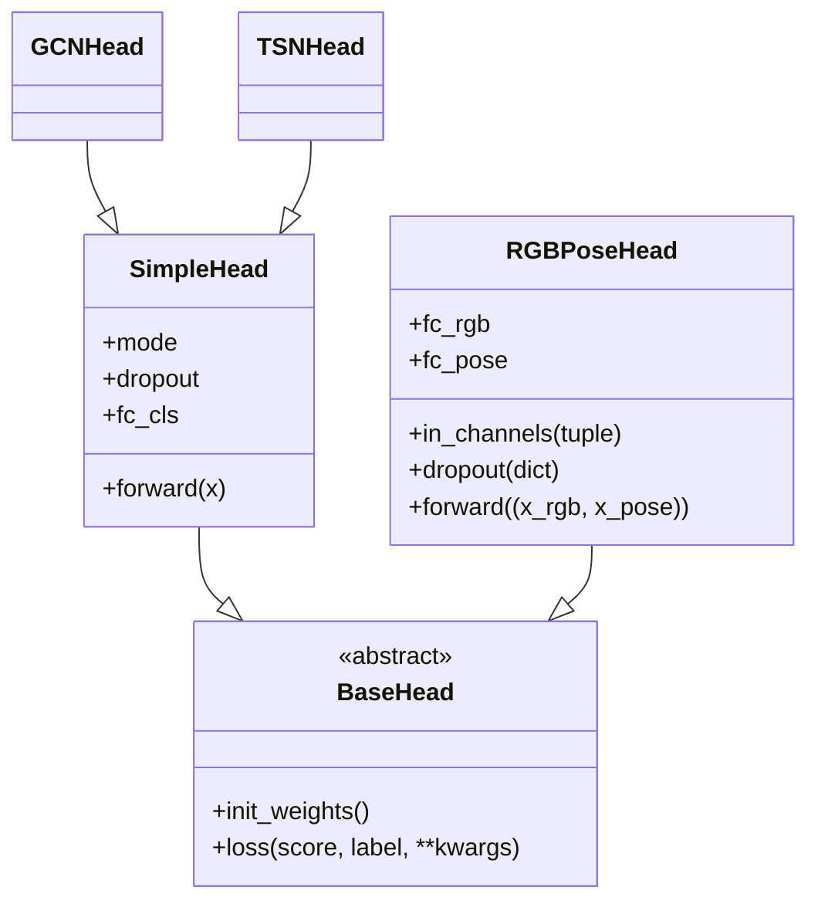
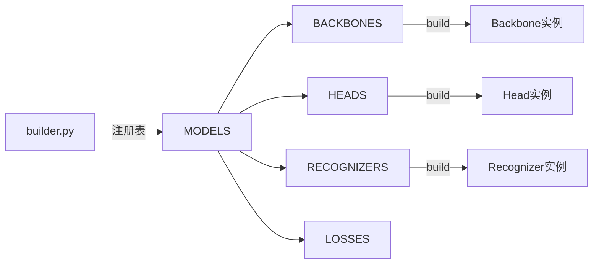
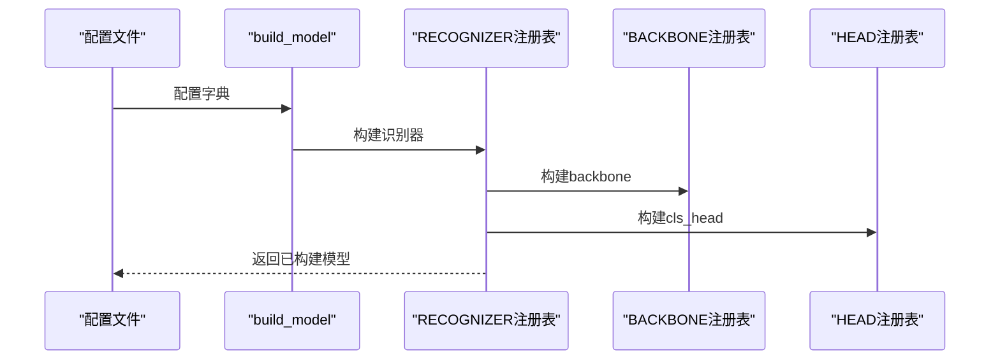

# 模型架构

<cite>
**本文引用的文件**
- [pyskl/models/recognizers/base.py](file://pyskl/models/recognizers/base.py)
- [pyskl/models/recognizers/recognizer3d.py](file://pyskl/models/recognizers/recognizer3d.py)
- [pyskl/models/recognizers/recognizergcn.py](file://pyskl/models/recognizers/recognizergcn.py)
- [pyskl/models/cnns/__init__.py](file://pyskl/models/cnns/__init__.py)
- [pyskl/models/cnns/c3d.py](file://pyskl/models/cnns/c3d.py)
- [pyskl/models/cnns/resnet3d_slowonly.py](file://pyskl/models/cnns/resnet3d_slowonly.py)
- [pyskl/models/cnns/x3d.py](file://pyskl/models/cnns/x3d.py)
- [pyskl/models/gcns/__init__.py](file://pyskl/models/gcns/__init__.py)
- [pyskl/models/gcns/stgcn.py](file://pyskl/models/gcns/stgcn.py)
- [pyskl/models/gcns/aagcn.py](file://pyskl/models/gcns/aagcn.py)
- [pyskl/models/heads/__init__.py](file://pyskl/models/heads/__init__.py)
- [pyskl/models/heads/simple_head.py](file://pyskl/models/heads/simple_head.py)
- [pyskl/models/heads/rgbpose_head.py](file://pyskl/models/heads/rgbpose_head.py)
- [pyskl/models/losses/base.py](file://pyskl/models/losses/base.py)
- [pyskl/models/builder.py](file://pyskl/models/builder.py)
- [configs/stgcn/stgcn_pyskl_ntu60_xsub_3dkp/b.py](file://configs/stgcn/stgcn_pyskl_ntu60_xsub_3dkp/b.py)
- [configs/posec3d/slowonly_r50_ntu60_xsub/joint.py](file://configs/posec3d/slowonly_r50_ntu60_xsub/joint.py)
- [configs/rgbpose_conv3d/rgbpose_conv3d.py](file://configs/rgbpose_conv3d/rgbpose_conv3d.py)
</cite>

## 目录
1. [引言](#引言)
2. [项目结构](#项目结构)
3. [核心组件](#核心组件)
4. [架构总览](#架构总览)
5. [详细组件分析](#详细组件分析)
6. [依赖分析](#依赖分析)
7. [性能考虑](#性能考虑)
8. [故障排查指南](#故障排查指南)
9. [结论](#结论)
10. [附录](#附录)

## 引言
本文件系统性梳理 PySKL 的模型架构与实现，覆盖识别器基类设计、训练与测试流程、损失函数与优化策略；详解 CNN 网络模块（C3D、SlowOnly、X3D 及慢-快变体、混合模态 RGBPoseConv3D）；深入解析 GCN 系列（ST-GCN、AAGCN、CT-GCN、MSG3D、DG-STGCN）的结构、消息传递与图构建；说明分类头（SimpleHead、GCNHead、RGBPoseHead）设计；并给出从配置解析到模型实例化的完整流程，以及性能对比、参数统计与复杂度分析的指导思路。

## 项目结构
- 识别器层：统一的 BaseRecognizer 抽象，具体实现包括 3D 识别器与 GCN 识别器，负责前向传播、训练/测试流程、损失解析与日志输出。
- 主干网络层：CNN 主干（C3D、ResNet3d 系列、X3D、RGBPoseConv3D）与 GCN 主干（STGCN、AAGCN 等），通过注册表按配置构建。
- 分类头层：SimpleHead、GCNHead、RGBPoseHead，支持不同输入模式（3D、GCN、2D）与多模态融合。
- 损失层：基于权重损失基类，提供可扩展的损失接口。
- 构建器：统一的注册表与工厂方法，负责按配置构建模型各部件。

**图表来源**
- [pyskl/models/recognizers/base.py](file://pyskl/models/recognizers/base.py#L20-L196)
- [pyskl/models/recognizers/recognizer3d.py](file://pyskl/models/recognizers/recognizer3d.py#L9-L86)
- [pyskl/models/recognizers/recognizergcn.py](file://pyskl/models/recognizers/recognizergcn.py#L8-L97)
- [pyskl/models/cnns/__init__.py](file://pyskl/models/cnns/__init__.py#L1-L14)
- [pyskl/models/gcns/__init__.py](file://pyskl/models/gcns/__init__.py#L1-L8)
- [pyskl/models/heads/__init__.py](file://pyskl/models/heads/__init__.py#L1-L5)
- [pyskl/models/losses/base.py](file://pyskl/models/losses/base.py#L6-L45)
- [pyskl/models/builder.py](file://pyskl/models/builder.py#L1-L39)

**章节来源**
- [pyskl/models/recognizers/base.py](file://pyskl/models/recognizers/base.py#L20-L196)
- [pyskl/models/builder.py](file://pyskl/models/builder.py#L1-L39)

## 核心组件
- 识别器基类 BaseRecognizer
  - 统一的前向入口、训练/测试抽象、损失解析与分布式日志聚合。
  - 支持 backbone 与 cls_head 的初始化与权重初始化。
  - 提供平均裁剪（average_clip）用于测试时的多视图/多片段聚合。
- 3D 识别器 Recognizer3D
  - 训练：展开批次与片段维度，经 backbone 提取特征后送入分类头计算损失。
  - 测试：支持 max_testing_views 与特征抽取模式，自动适配 3D-CNN 特征的时空池化与平均。
- GCN 识别器 RecognizerGCN
  - 训练：单路骨架输入，直接提取特征并计算分类损失。
  - 测试：支持多视图聚合、池化选项与分数扩展（score_ext）以导出中间表示。

**章节来源**
- [pyskl/models/recognizers/base.py](file://pyskl/models/recognizers/base.py#L20-L196)
- [pyskl/models/recognizers/recognizer3d.py](file://pyskl/models/recognizers/recognizer3d.py#L9-L86)
- [pyskl/models/recognizers/recognizergcn.py](file://pyskl/models/recognizers/recognizergcn.py#L8-L97)

## 架构总览
下图展示从配置到模型实例化与运行的关键交互：

**图表来源**
- [pyskl/models/builder.py](file://pyskl/models/builder.py#L22-L39)
- [pyskl/models/recognizers/base.py](file://pyskl/models/recognizers/base.py#L36-L60)

## 详细组件分析

### 识别器基类设计与训练/测试流程
- 前向传播
  - forward：根据 return_loss 决定调用 forward_train 或 forward_test。
  - extract_feat：统一由 backbone 提取特征。
- 训练流程
  - forward_train：对输入数据 reshape 后提取特征，送入分类头计算损失，返回损失字典。
  - _parse_losses：规范化损失张量、汇总日志变量，并在分布式环境下做 all_reduce。
- 测试流程
  - average_clip：支持按“分数”或“概率”对多片段/多视图结果做平均。
  - Recognizer3D：支持 feat_ext 模式，自动执行时空池化与降维。
  - RecognizerGCN：支持 pool_opt 与 score_ext，便于导出中间表示。

**图表来源**
- [pyskl/models/recognizers/base.py](file://pyskl/models/recognizers/base.py#L151-L196)
- [pyskl/models/recognizers/recognizer3d.py](file://pyskl/models/recognizers/recognizer3d.py#L29-L86)
- [pyskl/models/recognizers/recognizergcn.py](file://pyskl/models/recognizers/recognizergcn.py#L27-L76)

**章节来源**
- [pyskl/models/recognizers/base.py](file://pyskl/models/recognizers/base.py#L72-L159)
- [pyskl/models/recognizers/recognizer3d.py](file://pyskl/models/recognizers/recognizer3d.py#L13-L85)
- [pyskl/models/recognizers/recognizergcn.py](file://pyskl/models/recognizers/recognizergcn.py#L12-L76)

### CNN 网络模块
- C3D
  - 结构：多阶段 3D 卷积，带可选的 4 阶段版本；支持可选的时间下采样策略。
  - 初始化：卷积权重 Kaiming 初始化，可加载预训练权重。
- X3D
  - 结构：BlockX3D 残差块，包含 1×1、深度可分离 3×3×3、1×1 卷积堆叠，支持 SE 模块与 Swish 激活。
  - 参数缩放：gamma_w/gamma_b/gamma_d 控制宽度、瓶颈与深度，支持冻结部分层。
  - 初始化：卷积 Kaiming，BN 常数初始化，可选零初始化残差。
- ResNet3dSlowOnly
  - 基于 ResNet3d，通过特定 inflate 与卷积核设置实现仅慢分支的骨干。
- 慢-快变体与混合模态
  - RGBPoseConv3D：双流主干，分别处理 RGB 视频与姿态热图，支持横向连接与通道/时间步幅配置，最终在分类头处融合。

**图表来源**
- [pyskl/models/cnns/c3d.py](file://pyskl/models/cnns/c3d.py#L10-L100)
- [pyskl/models/cnns/x3d.py](file://pyskl/models/cnns/x3d.py#L160-L503)
- [pyskl/models/cnns/resnet3d_slowonly.py](file://pyskl/models/cnns/resnet3d_slowonly.py#L6-L18)

**章节来源**
- [pyskl/models/cnns/c3d.py](file://pyskl/models/cnns/c3d.py#L18-L100)
- [pyskl/models/cnns/x3d.py](file://pyskl/models/cnns/x3d.py#L198-L503)
- [pyskl/models/cnns/resnet3d_slowonly.py](file://pyskl/models/cnns/resnet3d_slowonly.py#L6-L18)

### GCN 网络模块
- ST-GCN
  - STGCNBlock：GCN + TCN（unit_tcn 或 mstcn），支持残差与步幅控制。
  - 整体：多阶段堆叠，支持通道膨胀与下采样，支持 MVC/VC 数据 BN。
- AAGCN
  - AAGCNBlock：GCN 采用自适应邻接图（unit_aagcn），其余同 ST-GCNBlock。
- CT-GCN、MSG3D、DG-STGCN
  - 通过注册表与工具模块（如 utils）扩展，遵循相同模块化结构，支持不同图构建与消息传递策略。

**图表来源**
- [pyskl/models/gcns/stgcn.py](file://pyskl/models/gcns/stgcn.py#L13-L138)
- [pyskl/models/gcns/aagcn.py](file://pyskl/models/gcns/aagcn.py#L11-L131)

**章节来源**
- [pyskl/models/gcns/stgcn.py](file://pyskl/models/gcns/stgcn.py#L56-L138)
- [pyskl/models/gcns/aagcn.py](file://pyskl/models/gcns/aagcn.py#L48-L131)

### 分类头设计
- SimpleHead
  - 支持三种模式：3D（自适应 3D 池化）、GCN（自适应 2D 池化并平均人维度）、2D（自适应 2D 池化）。
  - 可选 dropout，线性分类层 fc_cls。
- GCNHead
  - 专为 GCN 输出设计，模式固定为 GCN。
- RGBPoseHead
  - 双分支融合：分别对 RGB 与姿态特征做池化、dropout、线性分类，输出两个分支的分类分数。
  - 支持 loss_components 与 loss_weights，便于多任务加权。

**图表来源**
- [pyskl/models/heads/simple_head.py](file://pyskl/models/heads/simple_head.py#L9-L157)
- [pyskl/models/heads/rgbpose_head.py](file://pyskl/models/heads/rgbpose_head.py#L8-L80)

**章节来源**
- [pyskl/models/heads/simple_head.py](file://pyskl/models/heads/simple_head.py#L9-L157)
- [pyskl/models/heads/rgbpose_head.py](file://pyskl/models/heads/rgbpose_head.py#L8-L80)

### 损失函数与优化策略
- 损失基类 BaseWeightedLoss
  - 统一的损失加权接口，支持对字典或多张量损失进行权重缩放。
- CrossEntropyLoss
  - 典型分类损失，配合 SimpleHead/GCNHead 使用。
- 优化策略
  - 配置示例中常见 SGD + 动量、余弦退火或阶梯衰减学习率策略，以及梯度裁剪。

**章节来源**
- [pyskl/models/losses/base.py](file://pyskl/models/losses/base.py#L6-L45)
- [configs/stgcn/stgcn_pyskl_ntu60_xsub_3dkp/b.py](file://configs/stgcn/stgcn_pyskl_ntu60_xsub_3dkp/b.py#L48-L56)
- [configs/posec3d/slowonly_r50_ntu60_xsub/joint.py](file://configs/posec3d/slowonly_r50_ntu60_xsub/joint.py#L69-L77)
- [configs/rgbpose_conv3d/rgbpose_conv3d.py](file://configs/rgbpose_conv3d/rgbpose_conv3d.py#L95-L104)

## 依赖分析
- 注册表与工厂
  - MODELS 作为父注册表，BACKBONES/HEADS/RECOGNIZERS/LOSSES 均指向其子注册表。
  - build_backbone/build_head/build_recognizer/build_loss 负责按配置构建对应模块。
- 模块耦合
  - 识别器仅依赖 builder 接口，不直接耦合具体实现细节，提升可扩展性。
  - 主干与头通过注册表解耦，便于替换与组合。

**图表来源**
- [pyskl/models/builder.py](file://pyskl/models/builder.py#L1-L39)

**章节来源**
- [pyskl/models/builder.py](file://pyskl/models/builder.py#L1-L39)

## 性能考虑
- 计算复杂度
  - CNN 主干（C3D/X3D/ResNet3d）：主要瓶颈在深层 3D 卷积与残差块，复杂度随通道数与层数增长。
  - GCN 主干（STGCN/AAGCN）：与图大小 V 成正比，消息传递复杂度 O(V·C^2) 或 O(V^2·C)，可通过稀疏图与 SE/MSTCN 降低负担。
- 内存占用
  - 大序列长度与高分辨率输入会显著增加显存；建议合理设置 clip_len 与空间分辨率。
- 加速技巧
  - 使用混合精度、梯度累积、分布式训练；GCN 可采用图稀疏化与分块计算。
- 训练稳定性
  - 合理的学习率调度与梯度裁剪；GCN 的 BN 初始化与残差零初始化有助于稳定收敛。

## 故障排查指南
- 训练报错：标签为空
  - BaseRecognizer.forward 在 return_loss=True 且 label 为 None 时抛出异常，需检查数据管线是否正确提供 label。
- 归约错误：分布式训练日志
  - _parse_losses 对 loss 进行 all_reduce，若分布式环境未初始化或世界规模异常，可能导致数值问题，需确认分布式启动脚本与环境变量。
- 测试聚合：多视图/多片段
  - average_clips 仅支持 'score'/'prob'/None，非法值会触发异常；确保 test_cfg 中 average_clips 设置正确。
- GCN 输入形状
  - RecognizerGCN.forward_test 断言输入应为 (N, M, C, T, V)，若形状不符需检查数据格式化与 FormatGCNInput 步骤。

**章节来源**
- [pyskl/models/recognizers/base.py](file://pyskl/models/recognizers/base.py#L151-L159)
- [pyskl/models/recognizers/base.py](file://pyskl/models/recognizers/base.py#L144-L147)
- [pyskl/models/recognizers/base.py](file://pyskl/models/recognizers/base.py#L96-L107)
- [pyskl/models/recognizers/recognizergcn.py](file://pyskl/models/recognizers/recognizergcn.py#L30-L41)

## 结论
PySKL 通过清晰的识别器抽象、模块化的主干与头设计、统一的注册表与工厂，实现了对 3D 视频、骨架 GCN 与混合模态任务的统一建模。CNN 与 GCN 主干分别针对时空特征与拓扑结构建模，SimpleHead/RGBPoseHead 提供灵活的分类与融合策略。结合合理的配置与优化策略，可在多种基准上取得良好性能。

## 附录

### 模型构建流程（从配置到实例化）
- 读取配置文件（如 stgcn/b.py、posec3d/joint.py、rgbpose_conv3d.py）。
- 调用 builder.build_model，解析 type 并交由 RECOGNIZERS 注册表构建识别器。
- 识别器内部通过 builder.build_backbone 与 builder.build_head 构建主干与分类头。
- 初始化权重（init_weights），随后进入训练/测试循环。

**图表来源**
- [pyskl/models/builder.py](file://pyskl/models/builder.py#L22-L39)
- [configs/stgcn/stgcn_pyskl_ntu60_xsub_3dkp/b.py](file://configs/stgcn/stgcn_pyskl_ntu60_xsub_3dkp/b.py#L1-L6)
- [configs/posec3d/slowonly_r50_ntu60_xsub/joint.py](file://configs/posec3d/slowonly_r50_ntu60_xsub/joint.py#L1-L21)
- [configs/rgbpose_conv3d/rgbpose_conv3d.py](file://configs/rgbpose_conv3d/rgbpose_conv3d.py#L37-L42)

### 关键配置要点（示例）
- ST-GCN（骨架 GCN）
  - model.type='RecognizerGCN'，backbone.type='STGCN'，graph_cfg 指定布局与空间模式，cls_head.type='GCNHead'。
- PoseC3D（慢分支骨干）
  - model.type='Recognizer3D'，backbone.type='ResNet3dSlowOnly'，in_channels=17（关节点数），test_cfg.average_clips='prob'。
- RGBPoseConv3D（双流融合）
  - model.type='MMRecognizer3D'，backbone.type='RGBPoseConv3D'，cls_head.type='RGBPoseHead'，多任务损失组件与权重配置。

**章节来源**
- [configs/stgcn/stgcn_pyskl_ntu60_xsub_3dkp/b.py](file://configs/stgcn/stgcn_pyskl_ntu60_xsub_3dkp/b.py#L1-L6)
- [configs/posec3d/slowonly_r50_ntu60_xsub/joint.py](file://configs/posec3d/slowonly_r50_ntu60_xsub/joint.py#L1-L21)
- [configs/rgbpose_conv3d/rgbpose_conv3d.py](file://configs/rgbpose_conv3d/rgbpose_conv3d.py#L37-L42)