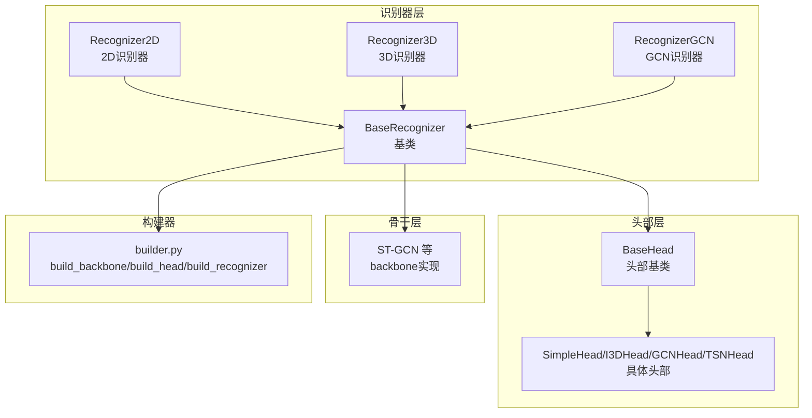
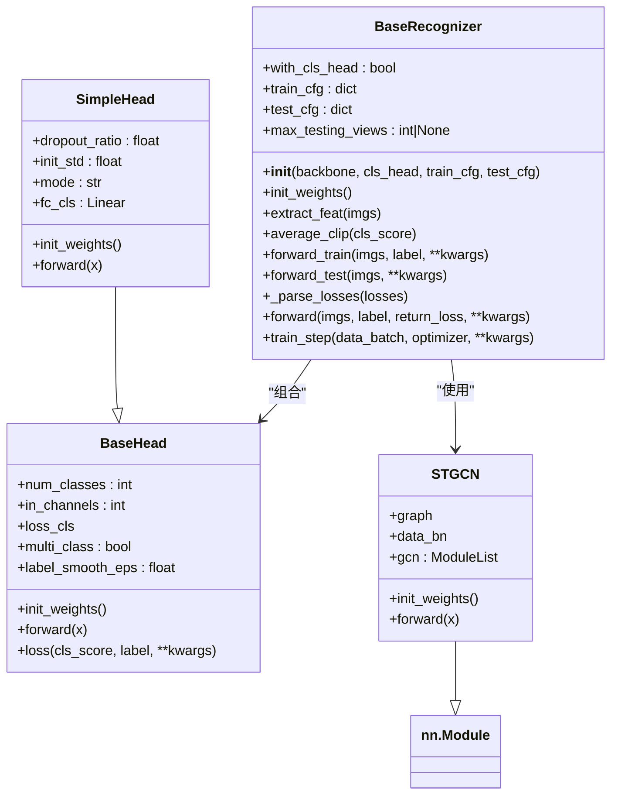
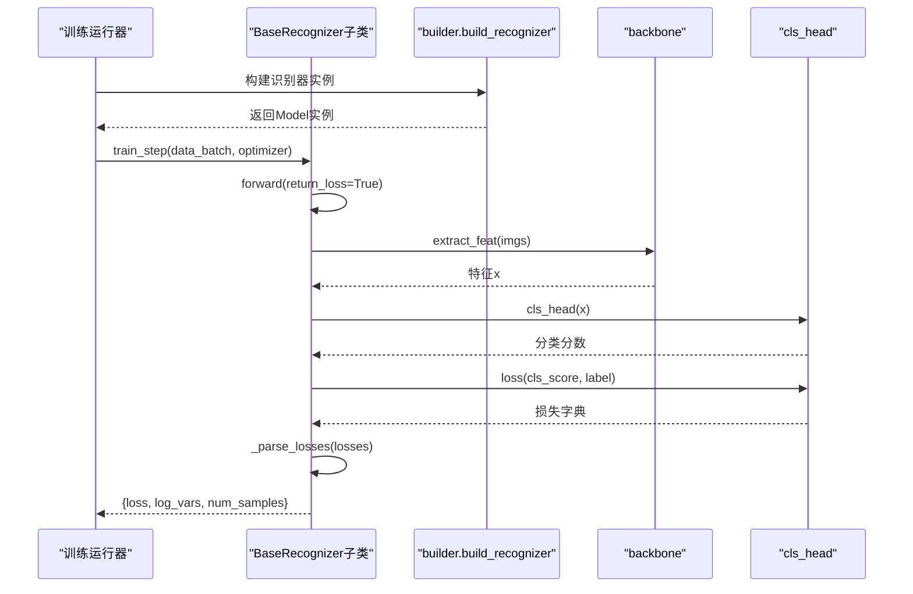
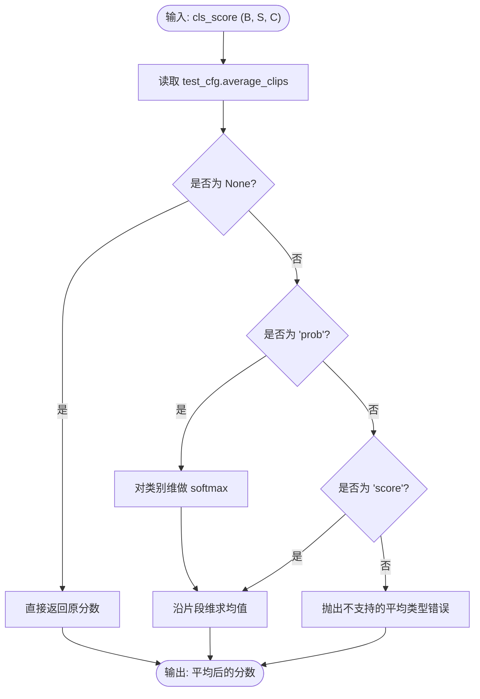
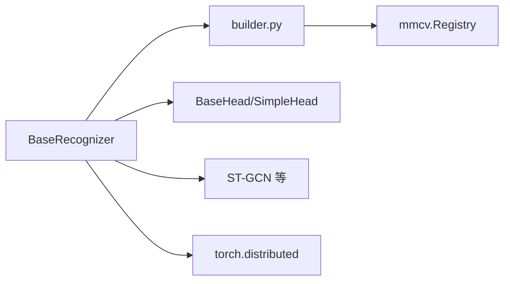

# BaseRecognizer基类设计

<cite>
**本文档引用的文件**
- [pyskl/models/recognizers/base.py](file://pyskl/models/recognizers/base.py)
- [pyskl/models/recognizers/recognizer2d.py](file://pyskl/models/recognizers/recognizer2d.py)
- [pyskl/models/recognizers/recognizer3d.py](file://pyskl/models/recognizers/recognizer3d.py)
- [pyskl/models/recognizers/recognizergcn.py](file://pyskl/models/recognizers/recognizergcn.py)
- [pyskl/models/heads/base.py](file://pyskl/models/heads/base.py)
- [pyskl/models/heads/simple_head.py](file://pyskl/models/heads/simple_head.py)
- [pyskl/models/builder.py](file://pyskl/models/builder.py)
- [pyskl/models/gcns/stgcn.py](file://pyskl/models/gcns/stgcn.py)
- [configs/stgcn/stgcn_pyskl_ntu60_xsub_3dkp/b.py](file://configs/stgcn/stgcn_pyskl_ntu60_xsub_3dkp/b.py)
</cite>

## 目录
1. [引言](#引言)
2. [项目结构](#项目结构)
3. [核心组件](#核心组件)
4. [架构总览](#架构总览)
5. [详细组件分析](#详细组件分析)
6. [依赖关系分析](#依赖关系分析)
7. [性能考虑](#性能考虑)
8. [故障排查指南](#故障排查指南)
9. [结论](#结论)
10. [附录](#附录)

## 引言
本设计文档围绕 PySKL 中的 BaseRecognizer 抽象基类展开，系统阐述其作为所有识别器基类的设计理念与实现细节。BaseRecognizer 继承自 nn.Module 并通过 ABCMeta 元类确保子类必须实现训练与测试阶段的前向接口；其构造函数通过 builder 工厂方法装配 backbone 与 cls_head，并在 init_weights 中完成两者的权重初始化；同时提供统一的训练步、损失解析与特征抽取能力。本文将结合具体实现与配置示例，给出正确的继承方式与最佳实践。

## 项目结构
与 BaseRecognizer 相关的关键文件组织如下：
- 识别器基类：pyskl/models/recognizers/base.py
- 具体识别器实现：recognizer2d.py、recognizer3d.py、recognizergcn.py
- 头部基类与实现：heads/base.py、heads/simple_head.py
- 模型构建器：models/builder.py
- 示例backbone（ST-GCN）：models/gcns/stgcn.py
- 配置示例：configs/stgcn/stgcn_pyskl_ntu60_xsub_3dkp/b.py

图表来源
- [pyskl/models/recognizers/base.py](file://pyskl/models/recognizers/base.py#L20-L60)
- [pyskl/models/recognizers/recognizer2d.py](file://pyskl/models/recognizers/recognizer2d.py#L8-L59)
- [pyskl/models/recognizers/recognizer3d.py](file://pyskl/models/recognizers/recognizer3d.py#L9-L86)
- [pyskl/models/recognizers/recognizergcn.py](file://pyskl/models/recognizers/recognizergcn.py#L8-L97)
- [pyskl/models/heads/base.py](file://pyskl/models/heads/base.py#L10-L49)
- [pyskl/models/heads/simple_head.py](file://pyskl/models/heads/simple_head.py#L9-L157)
- [pyskl/models/builder.py](file://pyskl/models/builder.py#L12-L24)
- [pyskl/models/gcns/stgcn.py](file://pyskl/models/gcns/stgcn.py#L56-L138)

章节来源
- [pyskl/models/recognizers/base.py](file://pyskl/models/recognizers/base.py#L20-L60)
- [pyskl/models/builder.py](file://pyskl/models/builder.py#L1-L39)

## 核心组件
- 基类职责
  - 定义识别器通用接口：forward_train、forward_test
  - 统一特征提取：extract_feat
  - 统一损失解析：_parse_losses
  - 训练步封装：train_step
  - 权重初始化：init_weights
  - 测试时多裁剪平均：average_clip
- 构造函数参数
  - backbone：backbone 的配置字典，用于工厂方法构建
  - cls_head：可选分类头配置字典
  - train_cfg/test_cfg：训练/测试配置字典，默认为空字典
- 关键属性
  - with_cls_head：判断是否存在分类头
  - max_testing_views：来自 test_cfg 的最大测试视图数

章节来源
- [pyskl/models/recognizers/base.py](file://pyskl/models/recognizers/base.py#L20-L196)

## 架构总览
BaseRecognizer 采用“模块化+工厂模式”的架构：
- nn.Module 提供张量计算与参数管理能力
- ABCMeta 确保子类必须实现抽象方法
- builder.build_backbone/build_head 将配置字典映射到具体模块
- 子类仅需关注数据流与任务逻辑，无需重复实现通用流程

图表来源
- [pyskl/models/recognizers/base.py](file://pyskl/models/recognizers/base.py#L20-L196)
- [pyskl/models/heads/base.py](file://pyskl/models/heads/base.py#L10-L88)
- [pyskl/models/heads/simple_head.py](file://pyskl/models/heads/simple_head.py#L9-L157)
- [pyskl/models/gcns/stgcn.py](file://pyskl/models/gcns/stgcn.py#L56-L138)

## 详细组件分析

### BaseRecognizer 类设计
- 设计意图
  - 通过 ABCMeta 强制子类实现训练与测试前向，保证识别器行为一致性
  - 通过 nn.Module 提供参数管理与设备/自动微分支持
  - 通过 builder 工厂解耦配置与实例化，便于扩展新模块
- 构造函数与工厂装配
  - 使用 builder.build_backbone/backbone 构建骨干网络
  - 可选使用 builder.build_head 构建分类头
  - 校验 train_cfg/test_cfg 类型并赋值
  - 从 test_cfg 获取 max_testing_views
  - 调用 init_weights 完成权重初始化
- 权重初始化策略
  - 先初始化 backbone，再按需初始化 cls_head
  - 子类可覆盖 init_weights 以实现特定初始化策略
- 特征提取与测试平均
  - extract_feat 统一封装 backbone 前向
  - average_clip 支持按概率或分数对多片段进行平均，兼容分布式环境
- 训练与推理
  - forward 在 return_loss=True 时调用 forward_train，否则调用 forward_test
  - train_step 统一处理损失解析与日志变量收集

章节来源
- [pyskl/models/recognizers/base.py](file://pyskl/models/recognizers/base.py#L20-L196)

### 构造函数与工厂方法
- 参数与默认值
  - backbone：必填，配置字典
  - cls_head：可选，默认 None
  - train_cfg/test_cfg：默认空字典，内部强制校验为 dict
- 工厂方法
  - builder.build_backbone：将 backbone 配置映射到具体模块
  - builder.build_head：将 cls_head 配置映射到具体头部
- 初始化流程
  - 构造 -> 实例化 backbone/cls_head -> 校验配置 -> 设置 max_testing_views -> init_weights

章节来源
- [pyskl/models/recognizers/base.py](file://pyskl/models/recognizers/base.py#L36-L60)
- [pyskl/models/builder.py](file://pyskl/models/builder.py#L12-L24)

### 权重初始化策略
- 默认策略
  - backbone.init_weights()
  - 若存在 cls_head，则 cls_head.init_weights()
- 典型实现
  - ST-GCN：支持加载预训练权重
  - SimpleHead：使用正态初始化线性层
- 最佳实践
  - 在自定义 backbone/cls_head 中实现 init_weights，遵循对应模块的初始化规范
  - 对于预训练模型，注意加载权重与冻结策略

章节来源
- [pyskl/models/recognizers/base.py](file://pyskl/models/recognizers/base.py#L66-L71)
- [pyskl/models/gcns/stgcn.py](file://pyskl/models/gcns/stgcn.py#L119-L123)
- [pyskl/models/heads/simple_head.py](file://pyskl/models/heads/simple_head.py#L45-L47)

### 训练与测试配置
- train_cfg/test_cfg
  - 默认为空字典，内部强制校验
  - test_cfg 中常用字段：max_testing_views、average_clips、feat_ext、num_segs 等
- 默认行为
  - average_clips 默认按概率平均
  - 分布式训练下，损失会进行 all_reduce 归约

章节来源
- [pyskl/models/recognizers/base.py](file://pyskl/models/recognizers/base.py#L39-L59)
- [pyskl/models/recognizers/base.py](file://pyskl/models/recognizers/base.py#L84-L108)
- [pyskl/models/recognizers/base.py](file://pyskl/models/recognizers/base.py#L144-L147)

### 典型子类实现与继承范式
- Recognizer2D
  - 适用于 2D 视频识别，训练时将帧序列展平后经 backbone 提取特征，再由 cls_head 计算损失
  - 测试时支持多裁剪/多片段平均，返回类别分数
- Recognizer3D
  - 适用于 3D 体积数据（如慢-快分支），支持按视图分批提取特征并拼接
  - 支持特征提取模式与多片段平均
- RecognizerGCN
  - 面向骨架动作识别，直接使用 backbone 输出作为特征，支持多裁剪平均与中间特征导出

章节来源
- [pyskl/models/recognizers/recognizer2d.py](file://pyskl/models/recognizers/recognizer2d.py#L8-L59)
- [pyskl/models/recognizers/recognizer3d.py](file://pyskl/models/recognizers/recognizer3d.py#L9-L86)
- [pyskl/models/recognizers/recognizergcn.py](file://pyskl/models/recognizers/recognizergcn.py#L8-L97)

### 头部基类与实现
- BaseHead
  - 定义 num_classes、in_channels、loss_cls、multi_class、label_smooth_eps 等
  - 提供 loss 方法，自动计算 top-k 准确率与损失
- SimpleHead/I3DHead/GCNHead/TSNHead
  - 基于不同任务模式（3D、GCN、2D）实现不同的池化与分类头
  - 通过 init_weights 对线性层进行初始化

章节来源
- [pyskl/models/heads/base.py](file://pyskl/models/heads/base.py#L10-L88)
- [pyskl/models/heads/simple_head.py](file://pyskl/models/heads/simple_head.py#L9-L157)

### 训练流程时序

图表来源
- [pyskl/models/recognizers/base.py](file://pyskl/models/recognizers/base.py#L151-L196)
- [pyskl/models/builder.py](file://pyskl/models/builder.py#L22-L24)

### 多片段平均流程

图表来源
- [pyskl/models/recognizers/base.py](file://pyskl/models/recognizers/base.py#L84-L108)

## 依赖关系分析
- 组件耦合
  - BaseRecognizer 与 builder 强耦合（通过工厂方法装配模块）
  - 与头部模块弱耦合（通过可选的 cls_head 接口）
  - 与骨干模块弱耦合（通过统一的 forward 接口）
- 外部依赖
  - mmcv.Registry 提供注册与构建能力
  - torch.distributed 用于分布式训练归约
- 循环依赖
  - 无循环依赖，各模块职责清晰

图表来源
- [pyskl/models/recognizers/base.py](file://pyskl/models/recognizers/base.py#L10-L10)
- [pyskl/models/builder.py](file://pyskl/models/builder.py#L5-L9)

章节来源
- [pyskl/models/recognizers/base.py](file://pyskl/models/recognizers/base.py#L10-L10)
- [pyskl/models/builder.py](file://pyskl/models/builder.py#L1-L39)

## 性能考虑
- 分布式训练
  - _parse_losses 中对损失进行 all_reduce 归约，避免单卡偏差
- 特征提取
  - 3D 识别器支持按视图分批提取特征并拼接，适合大视图场景
- 多片段平均
  - 在测试时对多片段/多裁剪结果进行平均，提升鲁棒性
- 初始化开销
  - 预训练权重加载可能带来额外 IO 开销，建议缓存路径

章节来源
- [pyskl/models/recognizers/base.py](file://pyskl/models/recognizers/base.py#L144-L147)
- [pyskl/models/recognizers/recognizer3d.py](file://pyskl/models/recognizers/recognizer3d.py#L35-L57)
- [pyskl/models/gcns/stgcn.py](file://pyskl/models/gcns/stgcn.py#L120-L122)

## 故障排查指南
- 必须实现的抽象方法缺失
  - 症状：实例化时报错
  - 处理：确保子类实现 forward_train 与 forward_test
- 标签缺失
  - 症状：forward(return_loss=True) 时抛出标签为空异常
  - 处理：确保传入 label 或在数据管线中补齐
- 不支持的平均类型
  - 症状：average_clip 抛出不支持的 average_clips 值
  - 处理：将 test_cfg.average_clips 设置为 'score'、'prob' 或 None
- 分布式环境异常
  - 症状：日志变量数值异常
  - 处理：确认已初始化分布式环境并正确执行 all_reduce

章节来源
- [pyskl/models/recognizers/base.py](file://pyskl/models/recognizers/base.py#L153-L156)
- [pyskl/models/recognizers/base.py](file://pyskl/models/recognizers/base.py#L98-L99)
- [pyskl/models/recognizers/base.py](file://pyskl/models/recognizers/base.py#L144-L147)

## 结论
BaseRecognizer 通过抽象与工厂模式实现了识别器的统一接口与灵活扩展。其设计强调：
- 明确的训练/测试前向契约（ABCMeta）
- 可插拔的骨干与头部（builder 工厂）
- 标准化的训练步与损失解析
- 友好的测试增强（多片段平均、特征导出）

遵循本文档的继承范式与最佳实践，可在 PySKL 中快速构建新的识别器。

## 附录

### 如何正确继承 BaseRecognizer
- 步骤
  - 继承 BaseRecognizer 并实现 forward_train 与 forward_test
  - 在 __init__ 中通过 builder.build_backbone/build_head 注册所需模块
  - 在 init_weights 中调用父类并按需补充自定义初始化
  - 在 forward 中根据任务选择 return_loss=True/False
- 示例参考
  - 2D 识别器：[Recognizer2D](file://pyskl/models/recognizers/recognizer2d.py#L8-L59)
  - 3D 识别器：[Recognizer3D](file://pyskl/models/recognizers/recognizer3d.py#L9-L86)
  - GCN 识别器：[RecognizerGCN](file://pyskl/models/recognizers/recognizergcn.py#L8-L97)

章节来源
- [pyskl/models/recognizers/recognizer2d.py](file://pyskl/models/recognizers/recognizer2d.py#L8-L59)
- [pyskl/models/recognizers/recognizer3d.py](file://pyskl/models/recognizers/recognizer3d.py#L9-L86)
- [pyskl/models/recognizers/recognizergcn.py](file://pyskl/models/recognizers/recognizergcn.py#L8-L97)

### 配置示例与关键字段
- 关键字段
  - model.type：识别器类型（如 RecognizerGCN）
  - backbone：backbone 配置（如 ST-GCN 的 graph_cfg）
  - cls_head：分类头配置（如 GCNHead 的 num_classes、in_channels）
  - test_cfg：测试相关配置（如 average_clips、feat_ext、num_segs）
- 示例参考
  - [stgcn_pyskl_ntu60_xsub_3dkp/b.py](file://configs/stgcn/stgcn_pyskl_ntu60_xsub_3dkp/b.py#L1-L61)

章节来源
- [configs/stgcn/stgcn_pyskl_ntu60_xsub_3dkp/b.py](file://configs/stgcn/stgcn_pyskl_ntu60_xsub_3dkp/b.py#L1-L61)