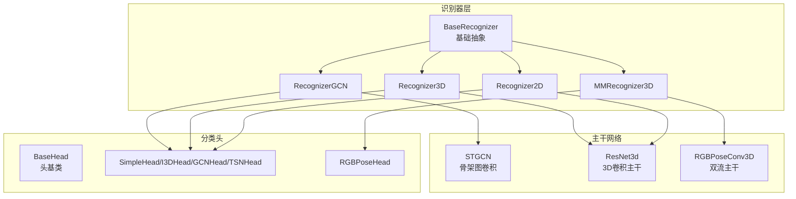
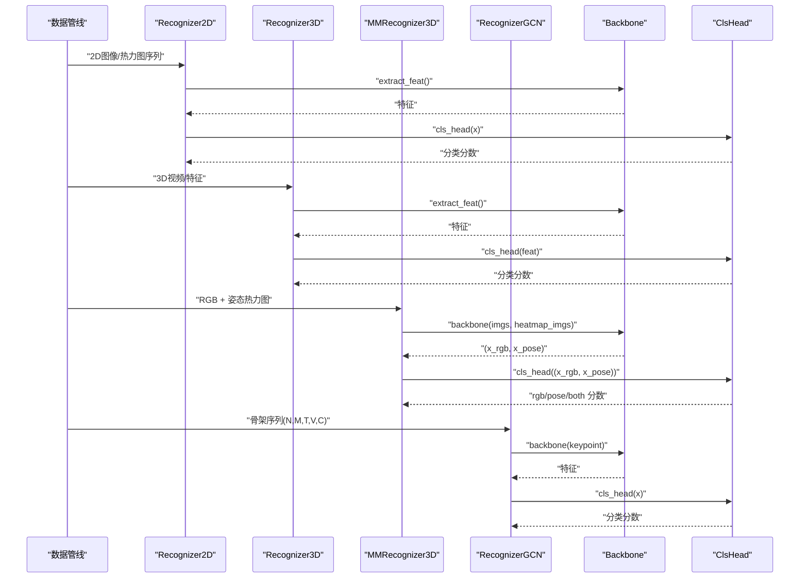
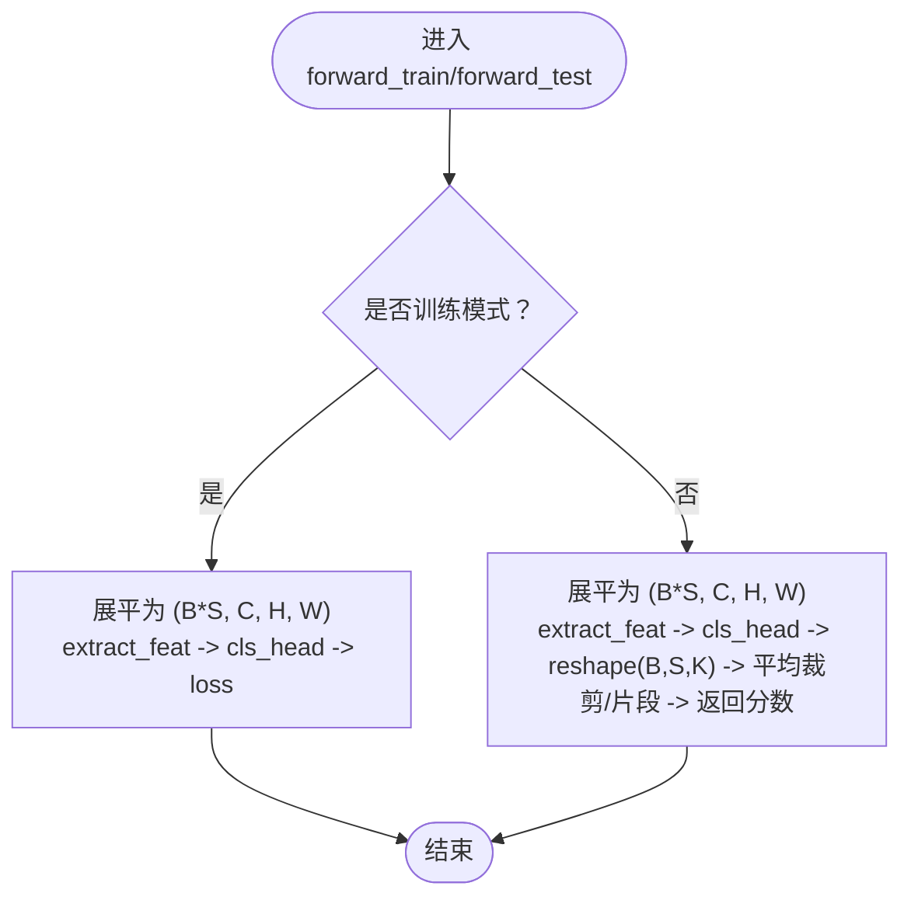
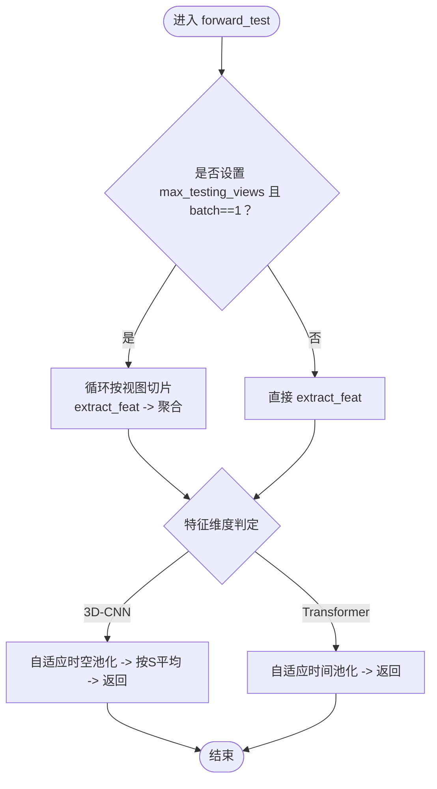
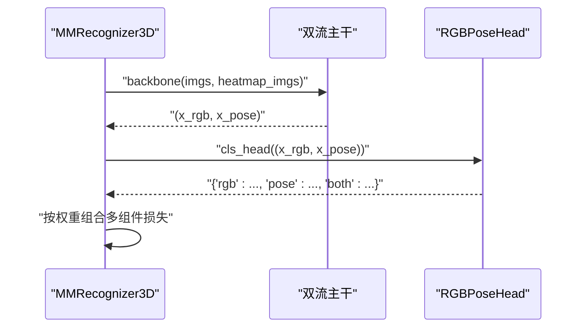
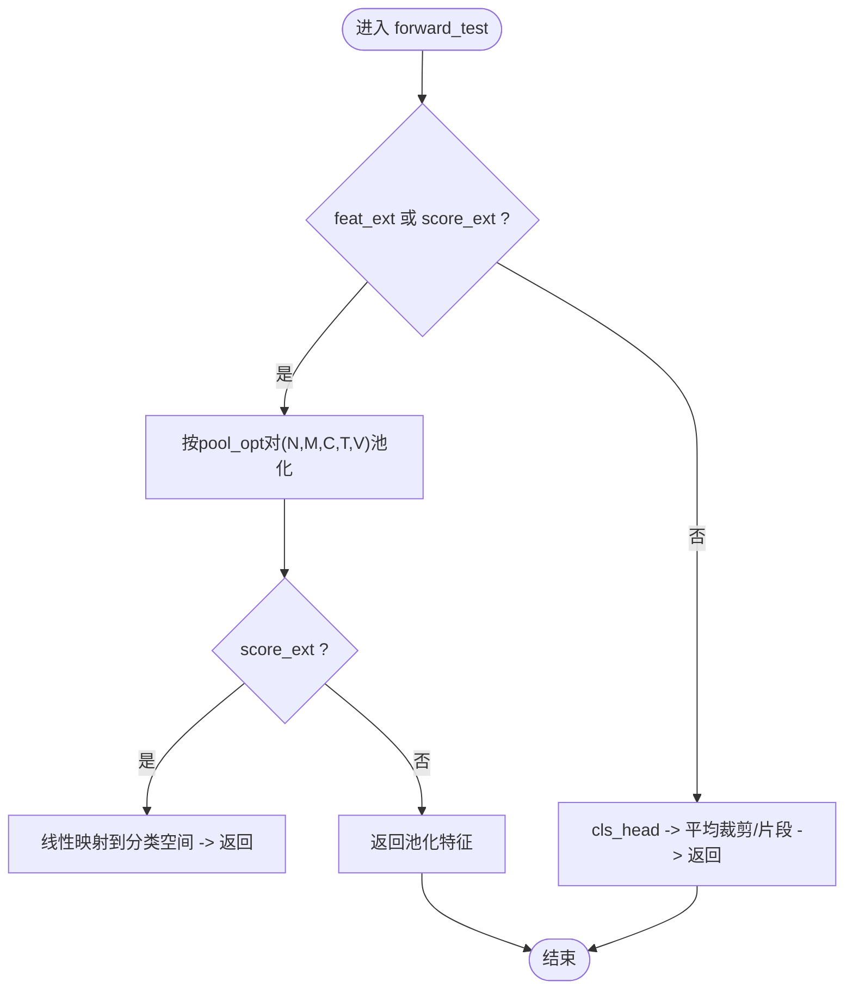
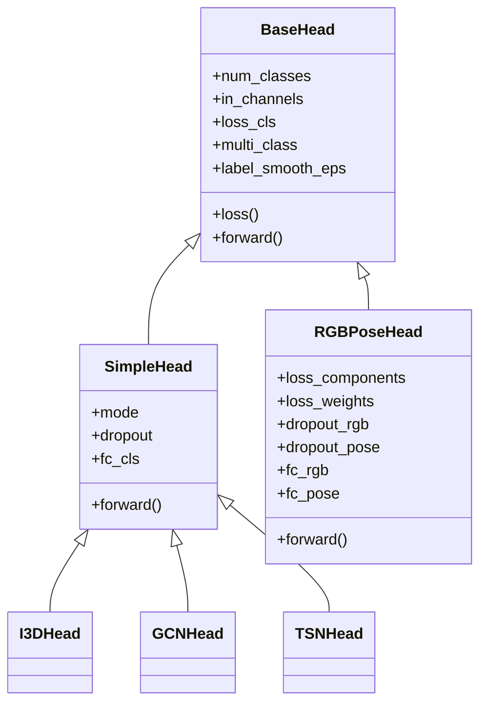
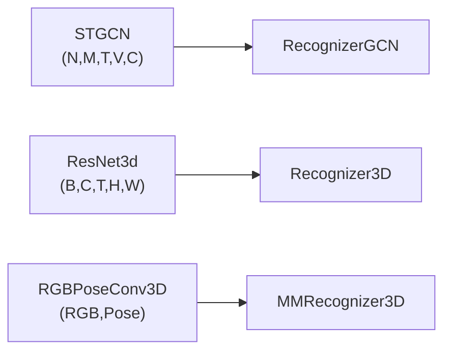
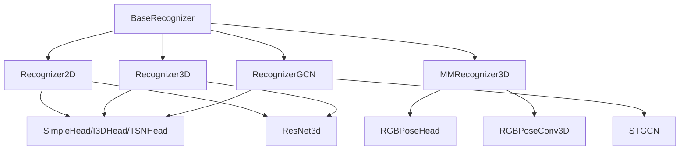

# 具体识别器实现

<cite>
**本文引用的文件**   
- [pyskl/models/recognizers/base.py](file://pyskl/models/recognizers/base.py)
- [pyskl/models/recognizers/recognizer2d.py](file://pyskl/models/recognizers/recognizer2d.py)
- [pyskl/models/recognizers/recognizer3d.py](file://pyskl/models/recognizers/recognizer3d.py)
- [pyskl/models/recognizers/mm_recognizer3d.py](file://pyskl/models/recognizers/mm_recognizer3d.py)
- [pyskl/models/recognizers/recognizergcn.py](file://pyskl/models/recognizers/recognizergcn.py)
- [pyskl/models/heads/base.py](file://pyskl/models/heads/base.py)
- [pyskl/models/heads/simple_head.py](file://pyskl/models/heads/simple_head.py)
- [pyskl/models/heads/rgbpose_head.py](file://pyskl/models/heads/rgbpose_head.py)
- [pyskl/models/gcns/stgcn.py](file://pyskl/models/gcns/stgcn.py)
- [pyskl/models/cnns/resnet3d.py](file://pyskl/models/cnns/resnet3d.py)
- [pyskl/models/cnns/rgbposeconv3d.py](file://pyskl/models/cnns/rgbposeconv3d.py)
- [configs/stgcn/stgcn_pyskl_ntu60_xsub_3dkp/b.py](file://configs/stgcn/stgcn_pyskl_ntu60_xsub_3dkp/b.py)
- [configs/posec3d/slowonly_r50_ntu60_xsub/joint.py](file://configs/posec3d/slowonly_r50_ntu60_xsub/joint.py)
- [configs/rgbpose_conv3d/rgbpose_conv3d.py](file://configs/rgbpose_conv3d/rgbpose_conv3d.py)
- [demo/demo_skeleton.py](file://demo/demo_skeleton.py)
</cite>

## 目录
1. [引言](#引言)
2. [项目结构](#项目结构)
3. [核心组件](#核心组件)
4. [架构总览](#架构总览)
5. [详细组件分析](#详细组件分析)
6. [依赖关系分析](#依赖关系分析)
7. [性能与推理优化](#性能与推理优化)
8. [故障排查指南](#故障排查指南)
9. [结论](#结论)
10. [附录](#附录)

## 引言
本文件面向PySKL中的“具体识别器实现”，系统梳理并对比以下识别器的设计差异与适用场景：
- Recognizer2D：基于2D图像或热力图序列的识别器，适用于视频级动作识别或热力图驱动的2D分支识别。
- Recognizer3D：基于3D卷积或3D时空特征的识别器，适用于视频级动作识别。
- MMRecognizer3D：多模态3D识别器，同时融合RGB与姿态热力图，采用双流主干与多任务分类头。
- RecognizerGCN：基于图卷积网络（GCN）的骨架动作识别器，输入为骨架序列。

我们将从架构、前向传播、输入数据格式、特征处理流程、分类头设计、配置参数、训练策略与推理优化等方面进行深入解析，并给出可直接参考的配置文件路径与使用场景对比。

## 项目结构
围绕识别器实现的关键目录与文件如下：
- 识别器基类与具体实现：pyskl/models/recognizers/
- 分类头基类与具体实现：pyskl/models/heads/
- 主干网络（GCN/3D CNN/双流融合）：pyskl/models/gcns/, pyskl/models/cnns/
- 配置样例：configs/*/（包含ST-GCN、PoseC3D、RGBPoseConv3D等）
- 推理演示脚本：demo/demo_skeleton.py

**图表来源**
- [pyskl/models/recognizers/base.py](file://pyskl/models/recognizers/base.py#L20-L196)
- [pyskl/models/recognizers/recognizer2d.py](file://pyskl/models/recognizers/recognizer2d.py#L9-L59)
- [pyskl/models/recognizers/recognizer3d.py](file://pyskl/models/recognizers/recognizer3d.py#L10-L86)
- [pyskl/models/recognizers/mm_recognizer3d.py](file://pyskl/models/recognizers/mm_recognizer3d.py#L6-L62)
- [pyskl/models/recognizers/recognizergcn.py](file://pyskl/models/recognizers/recognizergcn.py#L9-L97)
- [pyskl/models/heads/base.py](file://pyskl/models/heads/base.py#L10-L88)
- [pyskl/models/heads/simple_head.py](file://pyskl/models/heads/simple_head.py#L9-L157)
- [pyskl/models/heads/rgbpose_head.py](file://pyskl/models/heads/rgbpose_head.py#L9-L80)
- [pyskl/models/gcns/stgcn.py](file://pyskl/models/gcns/stgcn.py#L56-L138)
- [pyskl/models/cnns/resnet3d.py](file://pyskl/models/cnns/resnet3d.py#L199-L200)
- [pyskl/models/cnns/rgbposeconv3d.py](file://pyskl/models/cnns/rgbposeconv3d.py#L12-L183)

**章节来源**
- [pyskl/models/recognizers/base.py](file://pyskl/models/recognizers/base.py#L20-L196)
- [pyskl/models/recognizers/recognizer2d.py](file://pyskl/models/recognizers/recognizer2d.py#L9-L59)
- [pyskl/models/recognizers/recognizer3d.py](file://pyskl/models/recognizers/recognizer3d.py#L10-L86)
- [pyskl/models/recognizers/mm_recognizer3d.py](file://pyskl/models/recognizers/mm_recognizer3d.py#L6-L62)
- [pyskl/models/recognizers/recognizergcn.py](file://pyskl/models/recognizers/recognizergcn.py#L9-L97)

## 核心组件
- BaseRecognizer：定义统一的前向接口、权重初始化、特征抽取、多裁剪平均策略与训练步逻辑。
- Recognizer2D：面向2D图像/热力图序列，按“批×裁剪×片段”组织输入，支持特征抽取与多裁剪平均。
- Recognizer3D：面向3D视频或3D特征，支持最大视图限制与分视图聚合；支持特征抽取与多片段平均。
- MMRecognizer3D：双流主干（RGB+姿态热力图），多任务分类头（RGB、Pose、二者融合），支持多组件损失加权。
- RecognizerGCN：面向骨架序列（N,M,T,V,C），支持池化与分数扩展，适配GCN主干与GCNHead。

**章节来源**
- [pyskl/models/recognizers/base.py](file://pyskl/models/recognizers/base.py#L20-L196)
- [pyskl/models/recognizers/recognizer2d.py](file://pyskl/models/recognizers/recognizer2d.py#L9-L59)
- [pyskl/models/recognizers/recognizer3d.py](file://pyskl/models/recognizers/recognizer3d.py#L10-L86)
- [pyskl/models/recognizers/mm_recognizer3d.py](file://pyskl/models/recognizers/mm_recognizer3d.py#L6-L62)
- [pyskl/models/recognizers/recognizergcn.py](file://pyskl/models/recognizers/recognizergcn.py#L9-L97)

## 架构总览
下图展示了四类识别器的总体架构与关键数据流：

**图表来源**
- [pyskl/models/recognizers/recognizer2d.py](file://pyskl/models/recognizers/recognizer2d.py#L12-L59)
- [pyskl/models/recognizers/recognizer3d.py](file://pyskl/models/recognizers/recognizer3d.py#L13-L86)
- [pyskl/models/recognizers/mm_recognizer3d.py](file://pyskl/models/recognizers/mm_recognizer3d.py#L9-L62)
- [pyskl/models/recognizers/recognizergcn.py](file://pyskl/models/recognizers/recognizergcn.py#L12-L97)

## 详细组件分析

### Recognizer2D 前向传播与数据流
- 输入格式：(B, S, C, H, W)，其中B为批大小，S为片段数（通常由采样决定）。
- 特征处理：展平为(B*S, C, H, W)后经backbone，再reshape回(B, S, ...)，送入cls_head。
- 输出：若为训练返回损失字典；测试时按裁剪/片段平均策略得到最终分数。

**图表来源**
- [pyskl/models/recognizers/recognizer2d.py](file://pyskl/models/recognizers/recognizer2d.py#L12-L59)

**章节来源**
- [pyskl/models/recognizers/recognizer2d.py](file://pyskl/models/recognizers/recognizer2d.py#L9-L59)

### Recognizer3D 前向传播与数据流
- 输入格式：(B, S, C, T, H, W)，B为批大小，S为片段数。
- 视图聚合：当设置max_testing_views且batch_size==1时，按视图切片逐视图抽取特征并拼接。
- 特征抽取：支持3D-CNN（5维）与Transformer（2维）两类特征，自动判断并做时空池化。
- 输出：若非特征抽取模式，经cls_head得到(B, S, K)并按average_clips策略平均。

**图表来源**
- [pyskl/models/recognizers/recognizer3d.py](file://pyskl/models/recognizers/recognizer3d.py#L29-L86)

**章节来源**
- [pyskl/models/recognizers/recognizer3d.py](file://pyskl/models/recognizers/recognizer3d.py#L10-L86)

### MMRecognizer3D 多模态融合与分类头
- 输入格式：RGB视频与姿态热力图，均为(B, S, C, T, H, W)或对应NCTHW格式。
- 双流主干：backbone(imgs, heatmap_imgs)返回(x_rgb, x_pose)。
- 分类头：RGBPoseHead对两路分别全连接，支持返回rgb/pose/both三路分数，并可按loss_weights加权多组件损失。

**图表来源**
- [pyskl/models/recognizers/mm_recognizer3d.py](file://pyskl/models/recognizers/mm_recognizer3d.py#L9-L62)
- [pyskl/models/heads/rgbpose_head.py](file://pyskl/models/heads/rgbpose_head.py#L59-L80)
- [pyskl/models/cnns/rgbposeconv3d.py](file://pyskl/models/cnns/rgbposeconv3d.py#L104-L183)

**章节来源**
- [pyskl/models/recognizers/mm_recognizer3d.py](file://pyskl/models/recognizers/mm_recognizer3d.py#L6-L62)
- [pyskl/models/heads/rgbpose_head.py](file://pyskl/models/heads/rgbpose_head.py#L9-L80)
- [pyskl/models/cnns/rgbposeconv3d.py](file://pyskl/models/cnns/rgbposeconv3d.py#L12-L183)

### RecognizerGCN 骨架特征与池化策略
- 输入格式：(B, M, T, V, C)，B为批大小，M为同一样本的人数（如需多轨迹），T为时间步，V为关节数，C为通道。
- 特征处理：支持按维度字符串池化（如'nmtv'），或直接输出分数；支持将池化后的特征映射到分类空间以获得分数。
- 输出：若feat_ext/score_ext开启则返回特征或映射后的分数；否则经cls_head得到(B, M, K)并按average_clips策略平均。

**图表来源**
- [pyskl/models/recognizers/recognizergcn.py](file://pyskl/models/recognizers/recognizergcn.py#L27-L97)

**章节来源**
- [pyskl/models/recognizers/recognizergcn.py](file://pyskl/models/recognizers/recognizergcn.py#L9-L97)

### 分类头设计与适配模式
- BaseHead：定义loss计算、Top-K指标与损失构建。
- SimpleHead/I3DHead/GCNHead/TSNHead：针对2D/3D/GCN/2D帧的池化与分类头设计，自动适配不同模式的输入维度。
- RGBPoseHead：双路RGB/Pose分类头，支持多组件损失与权重。

**图表来源**
- [pyskl/models/heads/base.py](file://pyskl/models/heads/base.py#L10-L88)
- [pyskl/models/heads/simple_head.py](file://pyskl/models/heads/simple_head.py#L9-L157)
- [pyskl/models/heads/rgbpose_head.py](file://pyskl/models/heads/rgbpose_head.py#L9-L80)

**章节来源**
- [pyskl/models/heads/base.py](file://pyskl/models/heads/base.py#L10-L88)
- [pyskl/models/heads/simple_head.py](file://pyskl/models/heads/simple_head.py#L9-L157)
- [pyskl/models/heads/rgbpose_head.py](file://pyskl/models/heads/rgbpose_head.py#L9-L80)

### 主干网络适配与输入差异
- STGCN：骨架图卷积主干，输入为(N, M, T, V, C)，输出为相同维度的特征，适合GCN识别器。
- ResNet3d：3D卷积主干，输入为(B, C, T, H, W)，适合3D识别器。
- RGBPoseConv3D：双流主干，输入为RGB视频与姿态热力图，输出为(x_rgb, x_pose)，适合MMRecognizer3D。

**图表来源**
- [pyskl/models/gcns/stgcn.py](file://pyskl/models/gcns/stgcn.py#L56-L138)
- [pyskl/models/cnns/resnet3d.py](file://pyskl/models/cnns/resnet3d.py#L199-L200)
- [pyskl/models/cnns/rgbposeconv3d.py](file://pyskl/models/cnns/rgbposeconv3d.py#L12-L183)

**章节来源**
- [pyskl/models/gcns/stgcn.py](file://pyskl/models/gcns/stgcn.py#L56-L138)
- [pyskl/models/cnns/resnet3d.py](file://pyskl/models/cnns/resnet3d.py#L199-L200)
- [pyskl/models/cnns/rgbposeconv3d.py](file://pyskl/models/cnns/rgbposeconv3d.py#L12-L183)

## 依赖关系分析
- 识别器与主干/头的耦合：通过builder构建backbone与head，遵循统一的init_weights与forward契约。
- 多模态融合：MMRecognizer3D通过双流主干与RGBPoseHead解耦，便于独立训练与组合。
- 测试配置：average_clips、max_testing_views、feat_ext/score_ext等配置项影响推理行为与输出形态。

**图表来源**
- [pyskl/models/recognizers/base.py](file://pyskl/models/recognizers/base.py#L20-L196)
- [pyskl/models/recognizers/recognizer2d.py](file://pyskl/models/recognizers/recognizer2d.py#L9-L59)
- [pyskl/models/recognizers/recognizer3d.py](file://pyskl/models/recognizers/recognizer3d.py#L10-L86)
- [pyskl/models/recognizers/mm_recognizer3d.py](file://pyskl/models/recognizers/mm_recognizer3d.py#L6-L62)
- [pyskl/models/recognizers/recognizergcn.py](file://pyskl/models/recognizers/recognizergcn.py#L9-L97)

**章节来源**
- [pyskl/models/recognizers/base.py](file://pyskl/models/recognizers/base.py#L20-L196)

## 性能与推理优化
- 多裁剪/多片段平均：通过test_cfg.average_clips控制（'score'/'prob'/None），提升鲁棒性。
- 视图聚合：Recognizer3D在batch_size==1时按max_testing_views分视图抽取，避免显存溢出。
- 特征抽取：MMRecognizer3D与Recognizer3D支持feat_ext，直接输出池化后的特征用于下游任务。
- 池化策略：SimpleHead根据模式自动选择时空池化或时间池化，减少冗余计算。
- 训练稳定性：RGBPoseHead支持对RGB/Pose分别dropout与多组件损失加权，缓解模态不平衡。

**章节来源**
- [pyskl/models/recognizers/base.py](file://pyskl/models/recognizers/base.py#L84-L108)
- [pyskl/models/recognizers/recognizer3d.py](file://pyskl/models/recognizers/recognizer3d.py#L35-L86)
- [pyskl/models/heads/simple_head.py](file://pyskl/models/heads/simple_head.py#L49-L94)
- [pyskl/models/heads/rgbpose_head.py](file://pyskl/models/heads/rgbpose_head.py#L59-L80)

## 故障排查指南
- 训练时缺少标签：forward调用return_loss=True但未提供label会触发异常。
- 测试时未设置num_segs或feat_ext参数不匹配：可能导致reshape失败或池化维度错误。
- GCN输入维度不符：确保输入为(N, M, C, T, V)或按FormatGCNInput转换。
- 多模态输入形状不一致：确认RGB与姿态热力图的clip_len与格式一致。
- 推理日志与分布式训练：确认分布式环境初始化与loss归约逻辑。

**章节来源**
- [pyskl/models/recognizers/base.py](file://pyskl/models/recognizers/base.py#L151-L196)
- [pyskl/models/recognizers/recognizer2d.py](file://pyskl/models/recognizers/recognizer2d.py#L32-L59)
- [pyskl/models/recognizers/recognizer3d.py](file://pyskl/models/recognizers/recognizer3d.py#L29-L86)
- [pyskl/models/recognizers/recognizergcn.py](file://pyskl/models/recognizers/recognizergcn.py#L27-L97)

## 结论
- Recognizer2D适合2D图像/热力图序列的动作识别，结构简洁、易于部署。
- Recognizer3D适合视频级动作识别，具备视图聚合与多片段平均能力，适配多种3D主干。
- MMRecognizer3D通过双流主干与多任务头实现RGB与姿态的深度融合，适合多模态场景。
- RecognizerGCN专注于骨架序列，具备灵活的池化与分数扩展能力，适合高精度骨架任务。
- 通过统一的BaseRecognizer与Head体系，四类识别器在配置与训练上保持一致性，便于切换与迁移。

## 附录

### 配置参数与使用场景对比
- ST-GCN（骨架）：适用于NTU RGB+D等骨架数据集，配置示例见
  - [configs/stgcn/stgcn_pyskl_ntu60_xsub_3dkp/b.py](file://configs/stgcn/stgcn_pyskl_ntu60_xsub_3dkp/b.py#L1-L61)
- PoseC3D（3D视频）：适用于HRNet热力图驱动的3D识别，配置示例见
  - [configs/posec3d/slowonly_r50_ntu60_xsub/joint.py](file://configs/posec3d/slowonly_r50_ntu60_xsub/joint.py#L1-L80)
- RGBPoseConv3D（多模态）：双流融合，配置示例见
  - [configs/rgbpose_conv3d/rgbpose_conv3d.py](file://configs/rgbpose_conv3d/rgbpose_conv3d.py#L1-L107)

### 推理与演示
- 示例脚本演示了从视频到检测、姿态估计、骨架生成到动作识别的完整流程，可参考
  - [demo/demo_skeleton.py](file://demo/demo_skeleton.py#L227-L314)

**章节来源**
- [configs/stgcn/stgcn_pyskl_ntu60_xsub_3dkp/b.py](file://configs/stgcn/stgcn_pyskl_ntu60_xsub_3dkp/b.py#L1-L61)
- [configs/posec3d/slowonly_r50_ntu60_xsub/joint.py](file://configs/posec3d/slowonly_r50_ntu60_xsub/joint.py#L1-L80)
- [configs/rgbpose_conv3d/rgbpose_conv3d.py](file://configs/rgbpose_conv3d/rgbpose_conv3d.py#L1-L107)
- [demo/demo_skeleton.py](file://demo/demo_skeleton.py#L227-L314)