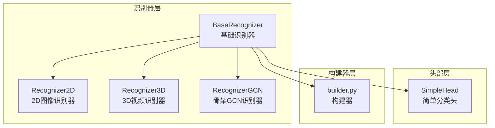
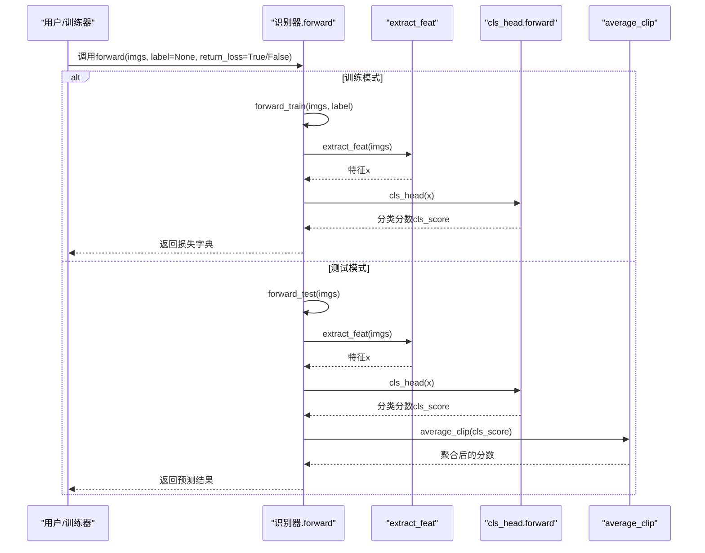
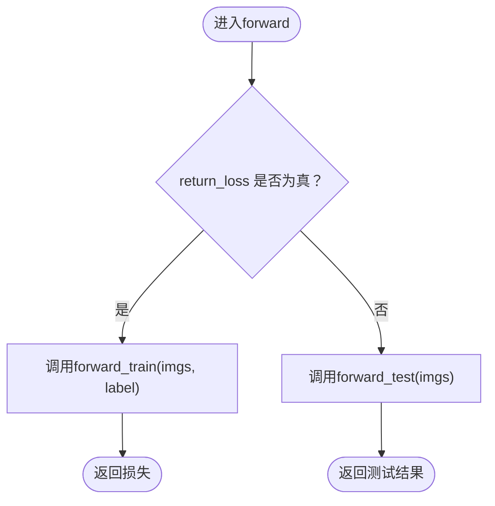
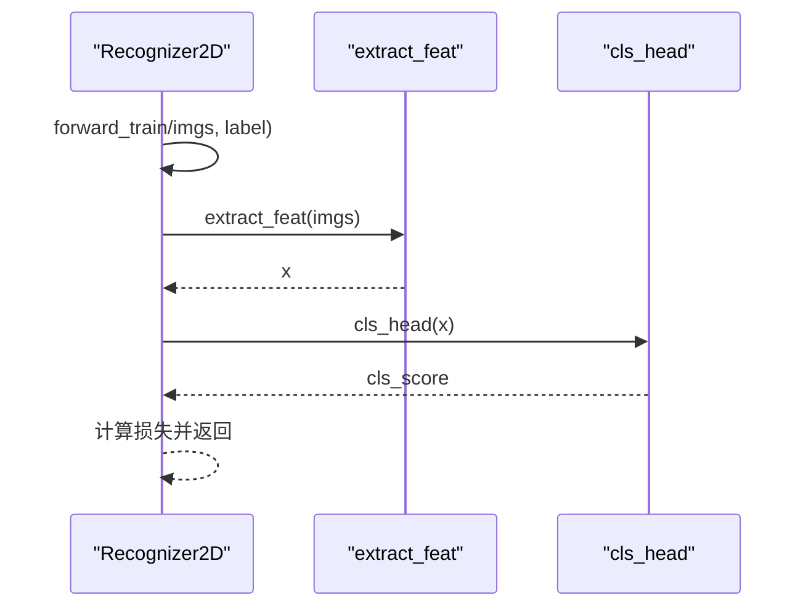
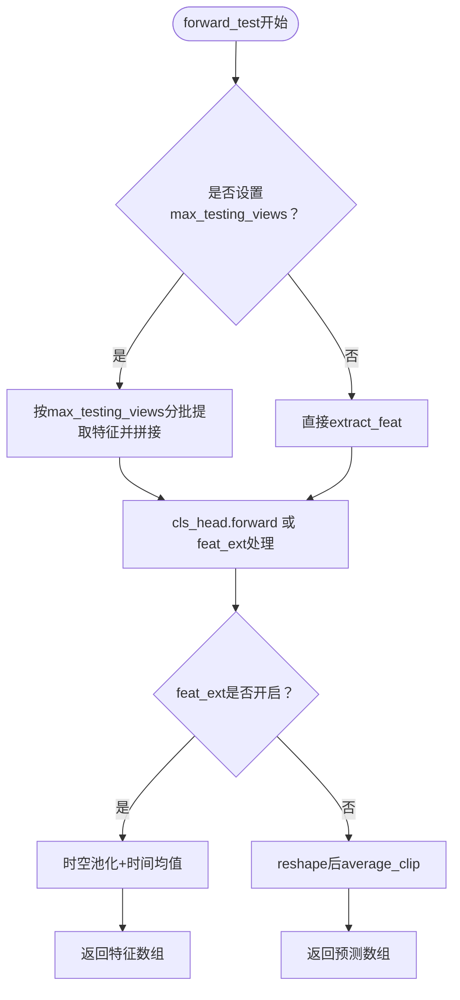
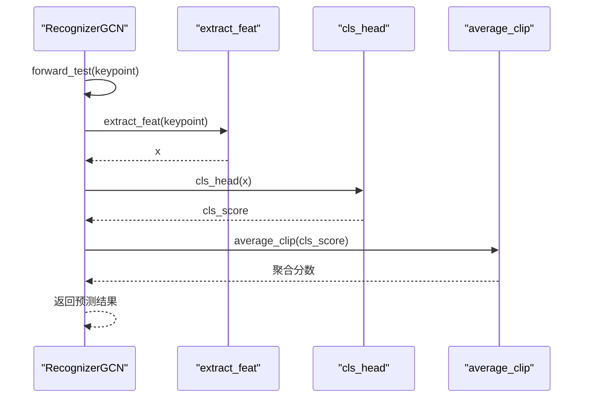
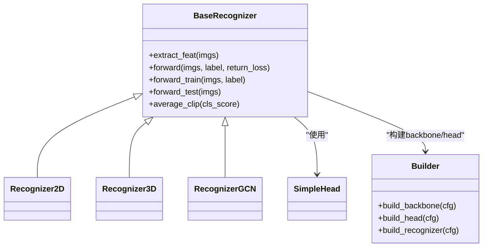
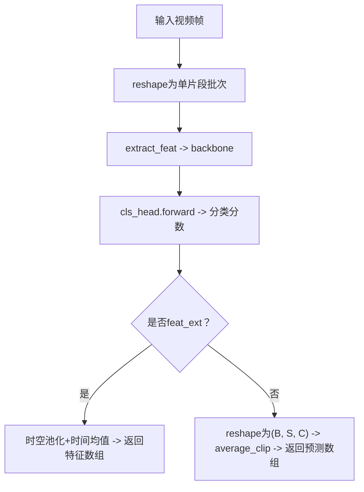

# 前向传播机制

<cite>
**本文引用的文件**
- [base.py](file://pyskl/models/recognizers/base.py)
- [recognizer2d.py](file://pyskl/models/recognizers/recognizer2d.py)
- [recognizer3d.py](file://pyskl/models/recognizers/recognizer3d.py)
- [recognizergcn.py](file://pyskl/models/recognizers/recognizergcn.py)
- [simple_head.py](file://pyskl/models/heads/simple_head.py)
- [builder.py](file://pyskl/models/builder.py)
- [joint.py](file://configs/posec3d/slowonly_r50_ntu60_xsub/joint.py)
- [b.py](file://configs/stgcn/stgcn_pyskl_ntu60_xsub_3dkp/b.py)
- [test.py](file://tools/test.py)
</cite>

## 目录
1. [简介](#简介)
2. [项目结构](#项目结构)
3. [核心组件](#核心组件)
4. [架构总览](#架构总览)
5. [详细组件分析](#详细组件分析)
6. [依赖关系分析](#依赖关系分析)
7. [性能考量](#性能考量)
8. [故障排查指南](#故障排查指南)
9. [结论](#结论)
10. [附录：典型使用示例与流程图](#附录典型使用示例与流程图)

## 简介
本文件聚焦于PySKL识别器的前向传播机制，系统性阐述以下主题：
- extract_feat方法的特征提取流程，包括backbone的调用与特征返回机制
- forward方法的统一入口设计，以及return_loss参数如何在训练与测试模式间切换
- forward_train与forward_test抽象方法的设计理念与实现要求
- average_clip方法在测试阶段的平均裁剪机制，涵盖'prob'、'score'与None三种模式及其应用场景
- 提供可直接定位到源码位置的路径，帮助读者快速定位实现细节

## 项目结构
识别器相关的核心代码位于pyskl/models/recognizers目录，包含通用基类与多种具体识别器实现；分类头位于pyskl/models/heads；模型构建器位于pyskl/models/builder。配置示例位于configs目录，展示了不同任务（视频动作识别、骨架动作识别）下test_cfg中average_clips等关键参数的设置方式。

图表来源
- [base.py](file://pyskl/models/recognizers/base.py#L20-L116)
- [recognizer2d.py](file://pyskl/models/recognizers/recognizer2d.py#L9-L58)
- [recognizer3d.py](file://pyskl/models/recognizers/recognizer3d.py#L10-L85)
- [recognizergcn.py](file://pyskl/models/recognizers/recognizergcn.py#L9-L96)
- [simple_head.py](file://pyskl/models/heads/simple_head.py#L10-L94)
- [builder.py](file://pyskl/models/builder.py#L12-L24)

章节来源
- [base.py](file://pyskl/models/recognizers/base.py#L20-L116)
- [recognizer2d.py](file://pyskl/models/recognizers/recognizer2d.py#L9-L58)
- [recognizer3d.py](file://pyskl/models/recognizers/recognizer3d.py#L10-L85)
- [recognizergcn.py](file://pyskl/models/recognizers/recognizergcn.py#L9-L96)
- [simple_head.py](file://pyskl/models/heads/simple_head.py#L10-L94)
- [builder.py](file://pyskl/models/builder.py#L12-L24)

## 核心组件
- BaseRecognizer：定义了统一的前向接口、特征提取、平均裁剪与训练/测试抽象方法，以及权重初始化、损失解析等通用能力。
- Recognizer2D/Recognizer3D/RecognizerGCN：分别针对2D图像、3D视频与骨架数据实现具体的forward_train/forward_test逻辑。
- SimpleHead：提供通用的分类头实现，支持不同模态（2D/3D/GCN）的池化与线性分类。
- builder：负责从配置构建backbone、head、recognizer等模块。

章节来源
- [base.py](file://pyskl/models/recognizers/base.py#L20-L116)
- [recognizer2d.py](file://pyskl/models/recognizers/recognizer2d.py#L9-L58)
- [recognizer3d.py](file://pyskl/models/recognizers/recognizer3d.py#L10-L85)
- [recognizergcn.py](file://pyskl/models/recognizers/recognizergcn.py#L9-L96)
- [simple_head.py](file://pyskl/models/heads/simple_head.py#L10-L94)
- [builder.py](file://pyskl/models/builder.py#L12-L24)

## 架构总览
识别器的前向传播遵循“统一入口 + 模块化子流程”的设计：
- 统一入口：forward方法根据return_loss参数分派至forward_train或forward_test
- 特征提取：extract_feat统一委托给backbone
- 分类头处理：在测试阶段对多裁剪/多视角/多片段的分数进行average_clip聚合
- 训练阶段：forward_train负责特征提取、分类头前向与损失计算
- 测试阶段：forward_test负责特征提取、分类头前向、可选的特征导出与average_clip聚合

图表来源
- [base.py](file://pyskl/models/recognizers/base.py#L151-L158)
- [recognizer2d.py](file://pyskl/models/recognizers/recognizer2d.py#L12-L30)
- [recognizer3d.py](file://pyskl/models/recognizers/recognizer3d.py#L29-L85)
- [recognizergcn.py](file://pyskl/models/recognizers/recognizergcn.py#L27-L76)

## 详细组件分析

### BaseRecognizer：统一入口与通用机制
- 统一入口：forward方法通过return_loss参数在训练与测试之间切换，若训练且label缺失会抛出异常
- 特征提取：extract_feat仅调用backbone，返回特征张量
- 平均裁剪：average_clip在测试阶段对多片段/多裁剪的分数进行聚合，支持'prob'（先softmax再均值）、'score'（直接均值）与None（不聚合）
- 抽象方法：forward_train与forward_test必须由子类实现

图表来源
- [base.py](file://pyskl/models/recognizers/base.py#L151-L158)

章节来源
- [base.py](file://pyskl/models/recognizers/base.py#L72-L116)
- [base.py](file://pyskl/models/recognizers/base.py#L151-L158)

### Recognizer2D：2D图像识别器
- 训练流程：将输入重塑为单片段批次，调用extract_feat后经cls_head得到分类分数，再由cls_head.loss计算损失
- 测试流程：根据test_cfg中的num_segs与num_crops对特征进行reshape，经cls_head得到分数，再调用average_clip聚合

图表来源
- [recognizer2d.py](file://pyskl/models/recognizers/recognizer2d.py#L12-L30)

章节来源
- [recognizer2d.py](file://pyskl/models/recognizers/recognizer2d.py#L12-L58)

### Recognizer3D：3D视频识别器
- 训练流程：与2D类似，但输入维度不同，直接调用extract_feat与cls_head.loss
- 测试流程：支持max_testing_views限制单batch的视图数；当启用feat_ext时，对backbone输出进行时空池化与时间维平均；否则对cls_head输出按批次与片段维度reshape后调用average_clip

图表来源
- [recognizer3d.py](file://pyskl/models/recognizers/recognizer3d.py#L29-L85)

章节来源
- [recognizer3d.py](file://pyskl/models/recognizers/recognizer3d.py#L13-L85)

### RecognizerGCN：骨架GCN识别器
- 训练流程：对输入keypoint进行切片与特征提取，cls_head得到分数并计算损失
- 测试流程：支持feat_ext与score_ext两种导出模式；若未开启导出，则对cls_head输出按批次与裁剪数reshape后调用average_clip；若average_clips未在test_cfg中设置，默认为'prob'

图表来源
- [recognizergcn.py](file://pyskl/models/recognizers/recognizergcn.py#L27-L76)

章节来源
- [recognizergcn.py](file://pyskl/models/recognizers/recognizergcn.py#L12-L96)

### average_clip：测试阶段的平均裁剪机制
- 输入形状：(Batch, NumSegs, Dim)
- 支持模式：
  - 'prob'：对每个片段的分类分数先做softmax，再沿片段轴求均值
  - 'score'：直接沿片段轴求均值
  - None：不进行聚合，原样返回
- 默认策略：若test_cfg未显式设置，RecognizerGCN会在测试时默认采用'prob'

章节来源
- [base.py](file://pyskl/models/recognizers/base.py#L84-L107)
- [recognizergcn.py](file://pyskl/models/recognizers/recognizergcn.py#L68-L69)

### extract_feat：特征提取流程
- 统一委托：所有识别器的extract_feat均只调用self.backbone，返回backbone输出
- 2D/3D/骨架识别器各自在forward中对输入进行reshape与分组，然后传入extract_feat

章节来源
- [base.py](file://pyskl/models/recognizers/base.py#L72-L82)
- [recognizer2d.py](file://pyskl/models/recognizers/recognizer2d.py#L22-L23)
- [recognizer3d.py](file://pyskl/models/recognizers/recognizer3d.py#L20-L20)
- [recognizergcn.py](file://pyskl/models/recognizers/recognizergcn.py#L19-L19)

### forward与forward_train/forward_test：统一入口与抽象方法
- 统一入口：forward根据return_loss在训练与测试之间切换
- 抽象方法：forward_train与forward_test由子类实现，确保训练与测试流程的可扩展性
- 训练阶段：通常包含特征提取、分类头前向与损失计算
- 测试阶段：通常包含特征提取、分类头前向、可选的特征导出与average_clip

章节来源
- [base.py](file://pyskl/models/recognizers/base.py#L151-L158)
- [base.py](file://pyskl/models/recognizers/base.py#L113-L116)
- [recognizer2d.py](file://pyskl/models/recognizers/recognizer2d.py#L12-L30)
- [recognizer3d.py](file://pyskl/models/recognizers/recognizer3d.py#L13-L27)
- [recognizergcn.py](file://pyskl/models/recognizers/recognizergcn.py#L12-L25)

## 依赖关系分析
- BaseRecognizer依赖builder模块用于构建backbone与head
- 各识别器继承BaseRecognizer并实现forward_train/forward_test
- SimpleHead提供通用分类头，支持不同模态的池化与线性分类

图表来源
- [base.py](file://pyskl/models/recognizers/base.py#L20-L116)
- [recognizer2d.py](file://pyskl/models/recognizers/recognizer2d.py#L9-L10)
- [recognizer3d.py](file://pyskl/models/recognizers/recognizer3d.py#L10-L11)
- [recognizergcn.py](file://pyskl/models/recognizers/recognizergcn.py#L9-L10)
- [simple_head.py](file://pyskl/models/heads/simple_head.py#L10-L43)
- [builder.py](file://pyskl/models/builder.py#L12-L24)

章节来源
- [base.py](file://pyskl/models/recognizers/base.py#L20-L116)
- [recognizer2d.py](file://pyskl/models/recognizers/recognizer2d.py#L9-L10)
- [recognizer3d.py](file://pyskl/models/recognizers/recognizer3d.py#L10-L11)
- [recognizergcn.py](file://pyskl/models/recognizers/recognizergcn.py#L9-L10)
- [simple_head.py](file://pyskl/models/heads/simple_head.py#L10-L43)
- [builder.py](file://pyskl/models/builder.py#L12-L24)

## 性能考量
- 多裁剪/多片段聚合：average_clip在测试阶段对多片段分数进行聚合，有助于提升鲁棒性，但会增加一次softmax或均值计算
- 视图聚合：Recognizer3D在测试时支持max_testing_views，按视图分批提取特征并拼接，避免一次性加载过多视图导致内存压力
- 特征导出：feat_ext与score_ext模式可直接输出中间特征或带偏置的线性层得分，便于下游分析与可视化

## 故障排查指南
- 训练时缺少标签：forward在训练模式下若label为None会抛出异常，需检查数据加载与配置
- 形状不匹配：average_clip要求输入为(Batch, NumSegs, Dim)，若形状不符会触发断言失败
- 测试配置缺失：若未设置test_cfg或average_clips，可能导致行为不符合预期；可通过命令行覆盖或在配置中显式指定
- 多GPU分布式：训练时会自动进行分布式损失归约，若自定义训练循环需确保日志变量正确汇总

章节来源
- [base.py](file://pyskl/models/recognizers/base.py#L153-L155)
- [base.py](file://pyskl/models/recognizers/base.py#L96-L99)
- [test.py](file://tools/test.py#L73-L83)

## 结论
PySKL的识别器体系通过BaseRecognizer提供了统一的前向传播框架：统一入口、可插拔的backbone与head、清晰的训练/测试抽象与测试阶段的平均裁剪机制。该设计既保证了灵活性与可扩展性，又确保了在不同模态（2D图像、3D视频、骨架）下的稳定表现。

## 附录：典型使用示例与流程图

### 示例：配置中设置average_clips
- 在视频识别配置中设置test_cfg.average_clips='prob'
- 在骨架识别配置中同样可设置相应参数

章节来源
- [joint.py](file://configs/posec3d/slowonly_r50_ntu60_xsub/joint.py#L20-L20)
- [b.py](file://configs/stgcn/stgcn_pyskl_ntu60_xsub_3dkp/b.py#L1-L6)

### 示例：命令行覆盖测试配置
- 使用工具脚本在测试时动态设置average_clips

章节来源
- [test.py](file://tools/test.py#L73-L83)

### 完整前向流程（以Recognizer3D为例）

图表来源
- [recognizer3d.py](file://pyskl/models/recognizers/recognizer3d.py#L29-L85)