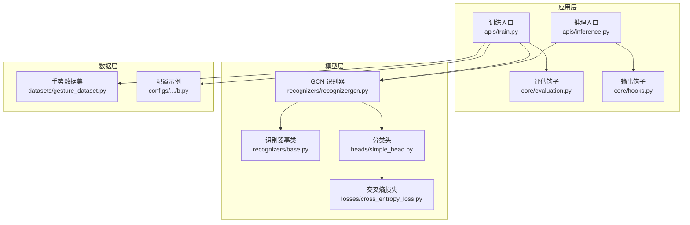
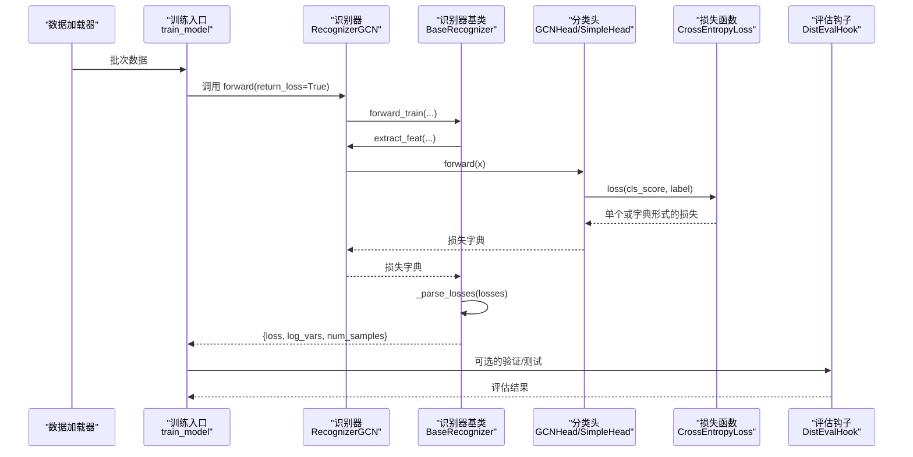
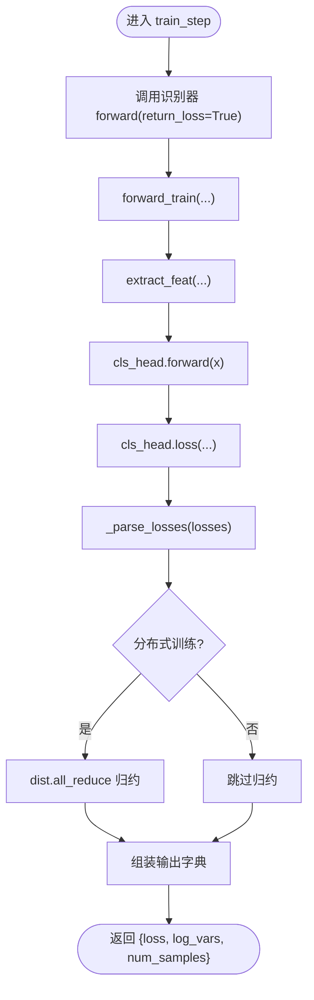
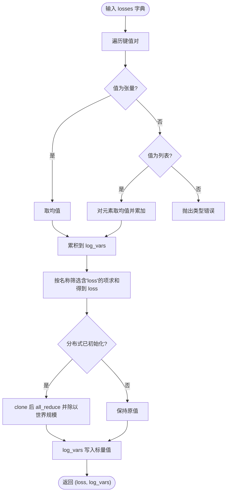
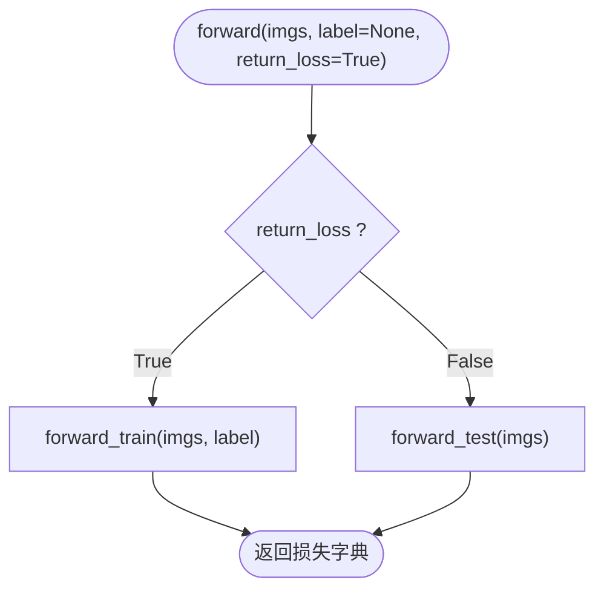
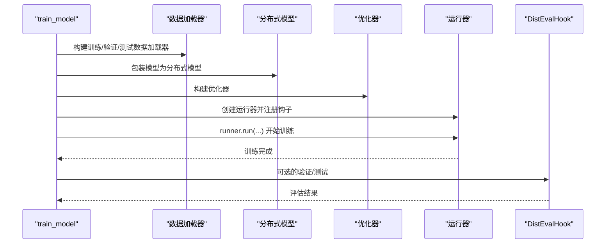
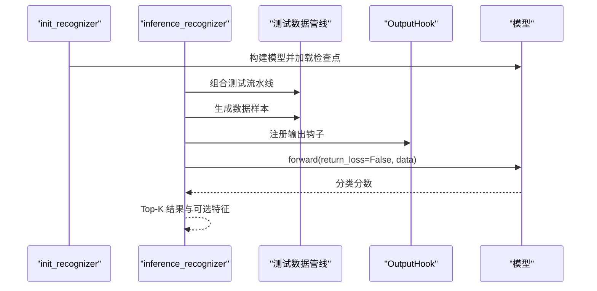
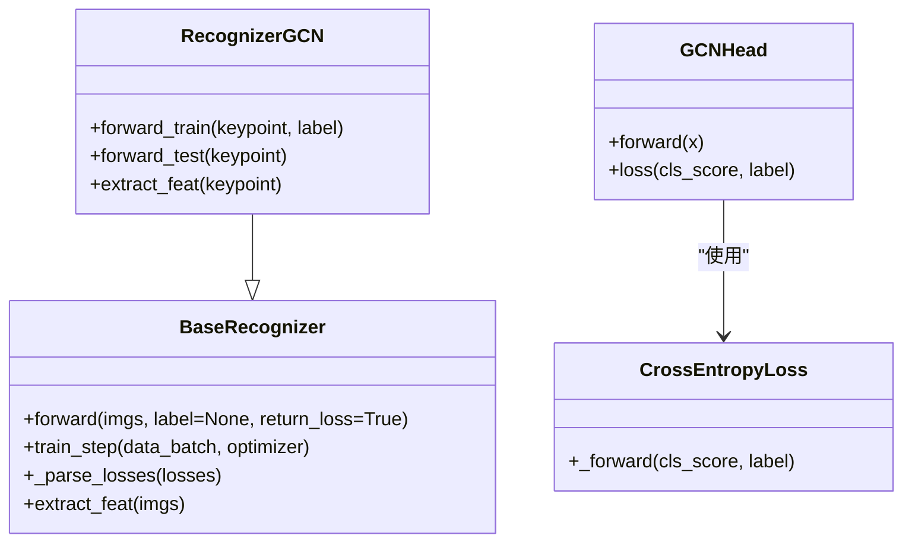
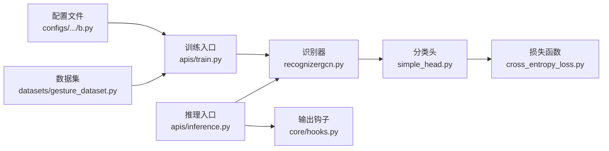

# 训练与推理流程

<cite>
**本文引用的文件**
- [pyskl/models/recognizers/base.py](file://pyskl/models/recognizers/base.py)
- [pyskl/models/recognizers/recognizergcn.py](file://pyskl/models/recognizers/recognizergcn.py)
- [pyskl/models/heads/simple_head.py](file://pyskl/models/heads/simple_head.py)
- [pyskl/models/losses/cross_entropy_loss.py](file://pyskl/models/losses/cross_entropy_loss.py)
- [pyskl/apis/train.py](file://pyskl/apis/train.py)
- [pyskl/apis/inference.py](file://pyskl/apis/inference.py)
- [pyskl/core/evaluation.py](file://pyskl/core/evaluation.py)
- [pyskl/core/hooks.py](file://pyskl/core/hooks.py)
- [configs/stgcn/stgcn_pyskl_ntu60_xsub_3dkp/b.py](file://configs/stgcn/stgcn_pyskl_ntu60_xsub_3dkp/b.py)
- [pyskl/datasets/gesture_dataset.py](file://pyskl/datasets/gesture_dataset.py)
</cite>

## 目录
1. [引言](#引言)
2. [项目结构](#项目结构)
3. [核心组件](#核心组件)
4. [架构总览](#架构总览)
5. [详细组件分析](#详细组件分析)
6. [依赖关系分析](#依赖关系分析)
7. [性能考量](#性能考量)
8. [故障排查指南](#故障排查指南)
9. [结论](#结论)
10. [附录：完整训练与推理示例路径](#附录完整训练与推理示例路径)

## 引言
本技术文档聚焦于 PySKL 识别器的训练与推理流程，围绕以下关键点展开：
- train_step 方法的训练迭代步骤实现：数据批处理、损失计算与反向传播的集成。
- _parse_losses 方法的损失解析机制：字典格式损失的处理、分布式训练中的损失归约、日志变量收集。
- forward 方法中 return_loss 参数控制的训练与测试分支逻辑。
- max_testing_views 参数在测试阶段对视图（views）数量的限制作用。
- 提供可直接定位到源码的路径，帮助读者快速理解完整训练循环与推理过程中的损失计算、梯度更新与结果评估的实现模式。

## 项目结构
本项目采用模块化组织，核心训练与推理由以下层次构成：
- 模型层：识别器基类与具体识别器（如 GCN 识别器）、分类头、损失函数。
- 数据层：数据集与数据管线（预处理、采样、格式化等）。
- 应用层：训练入口、推理入口、评估钩子与工具。
- 配置层：模型、数据、优化器、学习率策略、日志与工作目录等配置。

图表来源
- [pyskl/apis/train.py](file://pyskl/apis/train.py#L50-L144)
- [pyskl/apis/inference.py](file://pyskl/apis/inference.py#L19-L54)
- [pyskl/models/recognizers/base.py](file://pyskl/models/recognizers/base.py#L20-L60)
- [pyskl/models/recognizers/recognizergcn.py](file://pyskl/models/recognizers/recognizergcn.py#L8-L26)
- [pyskl/models/heads/simple_head.py](file://pyskl/models/heads/simple_head.py#L9-L44)
- [pyskl/models/losses/cross_entropy_loss.py](file://pyskl/models/losses/cross_entropy_loss.py#L9-L82)
- [pyskl/datasets/gesture_dataset.py](file://pyskl/datasets/gesture_dataset.py#L13-L56)
- [configs/stgcn/stgcn_pyskl_ntu60_xsub_3dkp/b.py](file://configs/stgcn/stgcn_pyskl_ntu60_xsub_3dkp/b.py#L1-L61)

章节来源
- [pyskl/apis/train.py](file://pyskl/apis/train.py#L50-L144)
- [pyskl/apis/inference.py](file://pyskl/apis/inference.py#L19-L54)
- [pyskl/models/recognizers/base.py](file://pyskl/models/recognizers/base.py#L20-L60)
- [pyskl/models/recognizers/recognizergcn.py](file://pyskl/models/recognizers/recognizergcn.py#L8-L26)
- [pyskl/models/heads/simple_head.py](file://pyskl/models/heads/simple_head.py#L9-L44)
- [pyskl/models/losses/cross_entropy_loss.py](file://pyskl/models/losses/cross_entropy_loss.py#L9-L82)
- [pyskl/datasets/gesture_dataset.py](file://pyskl/datasets/gesture_dataset.py#L13-L56)
- [configs/stgcn/stgcn_pyskl_ntu60_xsub_3dkp/b.py](file://configs/stgcn/stgcn_pyskl_ntu60_xsub_3dkp/b.py#L1-L61)

## 核心组件
- BaseRecognizer：定义了训练与测试的统一接口、损失解析、训练步输出结构、特征提取等通用能力。
- RecognizerGCN：基于 GCN 的骨架动作识别器，实现前向训练与测试的具体逻辑。
- SimpleHead/GCNHead：分类头，负责将骨干网络特征映射到类别分数，并提供损失计算接口。
- CrossEntropyLoss：交叉熵损失，支持硬标签与软标签，用于分类任务。
- 训练入口 train_model：构建数据加载器、分布式模型、优化器与运行器，注册训练钩子并执行训练与可选的验证/测试。
- 推理入口 init_recognizer/inference_recognizer：初始化模型、构建测试数据管线、执行前向推理并返回结果。

章节来源
- [pyskl/models/recognizers/base.py](file://pyskl/models/recognizers/base.py#L20-L60)
- [pyskl/models/recognizers/recognizergcn.py](file://pyskl/models/recognizers/recognizergcn.py#L8-L26)
- [pyskl/models/heads/simple_head.py](file://pyskl/models/heads/simple_head.py#L9-L44)
- [pyskl/models/losses/cross_entropy_loss.py](file://pyskl/models/losses/cross_entropy_loss.py#L9-L82)
- [pyskl/apis/train.py](file://pyskl/apis/train.py#L50-L144)
- [pyskl/apis/inference.py](file://pyskl/apis/inference.py#L19-L54)

## 架构总览
下图展示了从数据到模型再到日志与评估的整体流程，重点标注了训练与推理的关键节点。

图表来源
- [pyskl/apis/train.py](file://pyskl/apis/train.py#L50-L144)
- [pyskl/models/recognizers/base.py](file://pyskl/models/recognizers/base.py#L118-L195)
- [pyskl/models/recognizers/recognizergcn.py](file://pyskl/models/recognizers/recognizergcn.py#L12-L25)
- [pyskl/models/heads/simple_head.py](file://pyskl/models/heads/simple_head.py#L49-L94)
- [pyskl/models/losses/cross_entropy_loss.py](file://pyskl/models/losses/cross_entropy_loss.py#L39-L82)
- [pyskl/core/evaluation.py](file://pyskl/core/evaluation.py#L6-L38)

## 详细组件分析

### 训练迭代步骤：train_step
- 输入：数据批次（字典），优化器对象（在当前实现中未直接使用）。
- 步骤：
  1) 通过识别器的 forward(return_loss=True) 进入训练分支，调用 forward_train。
  2) forward_train 中完成特征提取、分类头前向与损失计算，返回字典形式的损失。
  3) BaseRecognizer._parse_losses 将字典损失解析为标量 loss 与日志变量 log_vars，并在分布式场景下进行 all_reduce 归约。
  4) 返回包含 loss、log_vars、num_samples 的字典，供运行器记录与后续优化器钩子使用。

图表来源
- [pyskl/models/recognizers/base.py](file://pyskl/models/recognizers/base.py#L160-L195)
- [pyskl/models/recognizers/recognizergcn.py](file://pyskl/models/recognizers/recognizergcn.py#L12-L25)

章节来源
- [pyskl/models/recognizers/base.py](file://pyskl/models/recognizers/base.py#L160-L195)
- [pyskl/models/recognizers/recognizergcn.py](file://pyskl/models/recognizers/recognizergcn.py#L12-L25)

### 损失解析：_parse_losses
- 功能：将网络原始输出（通常为字典）解析为可用于反向传播的标量 loss 与日志变量集合 log_vars。
- 处理逻辑：
  - 遍历字典项，若值为张量则取均值；若为列表则对元素求均值后累加。
  - 仅将名称包含“loss”的项纳入最终 loss 的加权求和。
  - 在分布式训练中，对每个 log_var 进行 clone 后 all_reduce 并除以世界规模，再转为 Python 标量写入 log_vars。
- 输出：标量 loss 与包含所有日志变量的字典。

图表来源
- [pyskl/models/recognizers/base.py](file://pyskl/models/recognizers/base.py#L118-L149)

章节来源
- [pyskl/models/recognizers/base.py](file://pyskl/models/recognizers/base.py#L118-L149)

### 前向逻辑：forward 与 return_loss 分支
- 当 return_loss=True 时，forward 调用 forward_train，传入图像/骨架与标签，返回损失字典。
- 当 return_loss=False 时，forward 调用 forward_test，执行测试/推理逻辑（例如聚合裁剪、池化、特征导出等）。
- 该设计使同一识别器既可用于训练，也可用于推理，避免重复实现。

图表来源
- [pyskl/models/recognizers/base.py](file://pyskl/models/recognizers/base.py#L151-L158)
- [pyskl/models/recognizers/recognizergcn.py](file://pyskl/models/recognizers/recognizergcn.py#L78-L85)

章节来源
- [pyskl/models/recognizers/base.py](file://pyskl/models/recognizers/base.py#L151-L158)
- [pyskl/models/recognizers/recognizergcn.py](file://pyskl/models/recognizers/recognizergcn.py#L78-L85)

### 测试阶段视图限制：max_testing_views
- max_testing_views 是识别器基类在 test_cfg 中的配置项，用于限制每次测试时处理的最大视图数。
- 在某些识别器（如 3D 识别器）中，测试时会按该上限分批处理视图并拼接特征，以控制显存占用与计算负载。
- 该参数在 GCN 识别器的测试分支中不直接使用，但通过基类的 test_cfg 传递，体现了统一的测试配置管理。

章节来源
- [pyskl/models/recognizers/base.py](file://pyskl/models/recognizers/base.py#L57-L58)
- [pyskl/models/recognizers/recognizer3d.py](file://pyskl/models/recognizers/recognizer3d.py#L39-L69)

### 训练入口：train_model
- 构建数据加载器、分布式模型包装、优化器与运行器。
- 注册训练钩子（学习率、优化器、检查点、日志等），并在需要时注册分布式评估钩子。
- 支持从断点恢复或加载预训练权重。
- 训练结束后可选择性地对最后保存的检查点与最佳检查点进行测试，并输出评估结果。

图表来源
- [pyskl/apis/train.py](file://pyskl/apis/train.py#L50-L144)
- [pyskl/core/evaluation.py](file://pyskl/core/evaluation.py#L6-L38)

章节来源
- [pyskl/apis/train.py](file://pyskl/apis/train.py#L50-L144)
- [pyskl/core/evaluation.py](file://pyskl/core/evaluation.py#L6-L38)

### 推理入口：init_recognizer 与 inference_recognizer
- 初始化识别器：根据配置构建模型，加载检查点，设置设备并置为 eval 模式。
- 构建测试数据管线：根据输入类型（视频/数组/原始帧）调整解码器与参数。
- 执行前向推理：使用 OutputHook 捕获指定层的输出（可选），在 no_grad 上下文中调用模型 return_loss=False 的分支。
- 后处理：对输出按类别得分排序，返回 Top-K 结果与可选的中间特征。

图表来源
- [pyskl/apis/inference.py](file://pyskl/apis/inference.py#L19-L54)
- [pyskl/apis/inference.py](file://pyskl/apis/inference.py#L57-L183)
- [pyskl/core/hooks.py](file://pyskl/core/hooks.py#L7-L58)

章节来源
- [pyskl/apis/inference.py](file://pyskl/apis/inference.py#L19-L54)
- [pyskl/apis/inference.py](file://pyskl/apis/inference.py#L57-L183)
- [pyskl/core/hooks.py](file://pyskl/core/hooks.py#L7-L58)

### 模型与损失：GCN 识别器与分类头
- RecognizerGCN.forward_train：对单视图骨架数据进行特征提取与分类头前向，计算损失并返回字典。
- SimpleHead/GCNHead.forward：将骨干输出池化并映射到类别分数；GCNHead 专门适配 GCN 架构。
- CrossEntropyLoss：支持硬标签与软标签，自动检测标签类型并计算相应损失。

图表来源
- [pyskl/models/recognizers/base.py](file://pyskl/models/recognizers/base.py#L20-L60)
- [pyskl/models/recognizers/recognizergcn.py](file://pyskl/models/recognizers/recognizergcn.py#L8-L26)
- [pyskl/models/heads/simple_head.py](file://pyskl/models/heads/simple_head.py#L9-L44)
- [pyskl/models/losses/cross_entropy_loss.py](file://pyskl/models/losses/cross_entropy_loss.py#L9-L82)

章节来源
- [pyskl/models/recognizers/recognizergcn.py](file://pyskl/models/recognizers/recognizergcn.py#L12-L25)
- [pyskl/models/heads/simple_head.py](file://pyskl/models/heads/simple_head.py#L49-L94)
- [pyskl/models/losses/cross_entropy_loss.py](file://pyskl/models/losses/cross_entropy_loss.py#L39-L82)

## 依赖关系分析
- 训练入口依赖数据集与配置，构建分布式模型与运行器，并注册各类钩子。
- 识别器依赖分类头与损失函数，通过统一的 forward 接口实现训练与推理。
- 推理入口依赖数据管线与输出钩子，确保在推理过程中可捕获中间特征。

图表来源
- [configs/stgcn/stgcn_pyskl_ntu60_xsub_3dkp/b.py](file://configs/stgcn/stgcn_pyskl_ntu60_xsub_3dkp/b.py#L1-L61)
- [pyskl/apis/train.py](file://pyskl/apis/train.py#L50-L144)
- [pyskl/datasets/gesture_dataset.py](file://pyskl/datasets/gesture_dataset.py#L13-L56)
- [pyskl/models/recognizers/recognizergcn.py](file://pyskl/models/recognizers/recognizergcn.py#L8-L26)
- [pyskl/models/heads/simple_head.py](file://pyskl/models/heads/simple_head.py#L9-L44)
- [pyskl/models/losses/cross_entropy_loss.py](file://pyskl/models/losses/cross_entropy_loss.py#L9-L82)
- [pyskl/apis/inference.py](file://pyskl/apis/inference.py#L19-L54)
- [pyskl/core/hooks.py](file://pyskl/core/hooks.py#L7-L58)

章节来源
- [configs/stgcn/stgcn_pyskl_ntu60_xsub_3dkp/b.py](file://configs/stgcn/stgcn_pyskl_ntu60_xsub_3dkp/b.py#L1-L61)
- [pyskl/apis/train.py](file://pyskl/apis/train.py#L50-L144)
- [pyskl/datasets/gesture_dataset.py](file://pyskl/datasets/gesture_dataset.py#L13-L56)
- [pyskl/apis/inference.py](file://pyskl/apis/inference.py#L19-L54)

## 性能考量
- 分布式训练中的损失归约：_parse_losses 在分布式场景下对日志变量进行 all_reduce，避免不同 GPU 上的统计偏差。
- 视图批处理：在测试阶段通过 max_testing_views 控制每次处理的视图数量，有助于显存与吞吐平衡。
- 池化与平均：分类头在不同模式下采用自适应池化，减少冗余维度，提升效率。
- 日志与评估：训练与测试阶段的日志与评估钩子可配置化，便于监控与调试。

## 故障排查指南
- 训练报错“Label should not be None”：当 return_loss=True 且未提供标签时会触发异常。请确认数据批包含 label 键。
- 分布式训练损失不一致：检查是否正确初始化分布式环境，确保 _parse_losses 中的 all_reduce 正常执行。
- 推理结果为空或形状异常：检查测试数据管线与输入类型匹配（视频/数组/原始帧），并确认模型与配置一致。
- 评估指标异常：核对 DistEvalHook 的配置与数据集 evaluate 的实现，确保指标名称与数据格式符合预期。

章节来源
- [pyskl/models/recognizers/base.py](file://pyskl/models/recognizers/base.py#L153-L156)
- [pyskl/models/recognizers/base.py](file://pyskl/models/recognizers/base.py#L143-L147)
- [pyskl/apis/inference.py](file://pyskl/apis/inference.py#L83-L98)
- [pyskl/core/evaluation.py](file://pyskl/core/evaluation.py#L6-L38)

## 结论
本文系统梳理了 PySKL 识别器的训练与推理流程，重点阐释了 train_step 的迭代步骤、_parse_losses 的损失解析机制、forward 的训练/测试分支控制，以及 max_testing_views 在测试阶段的作用。通过结合配置文件与数据集实现，读者可以基于提供的源码路径快速定位到关键实现细节，理解完整的训练循环与推理过程。

## 附录：完整训练与推理示例路径
- 训练入口与运行器配置
  - [训练入口函数 train_model](file://pyskl/apis/train.py#L50-L144)
  - [分布式评估钩子 DistEvalHook](file://pyskl/core/evaluation.py#L6-L38)
- 识别器与损失
  - [识别器基类 BaseRecognizer](file://pyskl/models/recognizers/base.py#L20-L60)
  - [GCN 识别器 RecognizerGCN](file://pyskl/models/recognizers/recognizergcn.py#L8-L26)
  - [分类头 SimpleHead/GCNHead](file://pyskl/models/heads/simple_head.py#L9-L44)
  - [交叉熵损失 CrossEntropyLoss](file://pyskl/models/losses/cross_entropy_loss.py#L9-L82)
- 推理入口
  - [初始化模型 init_recognizer](file://pyskl/apis/inference.py#L19-L54)
  - [推理函数 inference_recognizer](file://pyskl/apis/inference.py#L57-L183)
  - [输出钩子 OutputHook](file://pyskl/core/hooks.py#L7-L58)
- 数据与配置
  - [手势数据集 GestureDataset](file://pyskl/datasets/gesture_dataset.py#L13-L56)
  - [配置示例（ST-GCN NTU60 XSub 3DKP）](file://configs/stgcn/stgcn_pyskl_ntu60_xsub_3dkp/b.py#L1-L61)