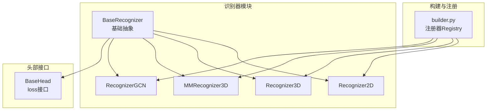
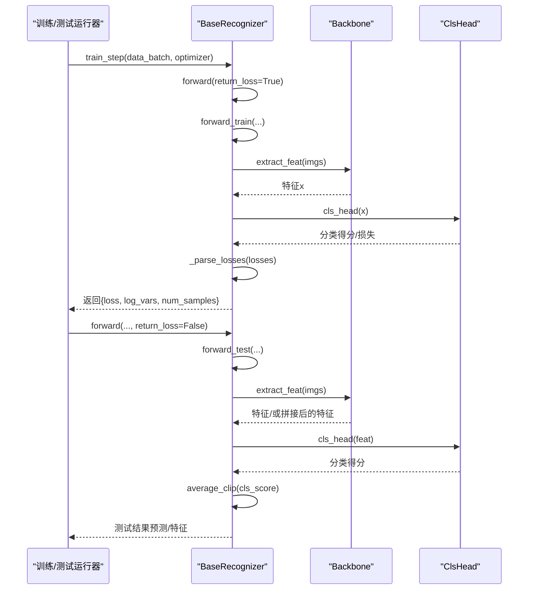
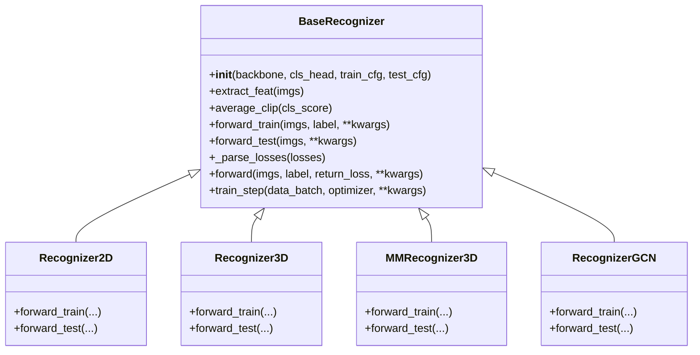

# 识别器基类

<cite>
**本文引用的文件列表**
- [pyskl/models/recognizers/base.py](file://pyskl/models/recognizers/base.py)
- [pyskl/models/recognizers/__init__.py](file://pyskl/models/recognizers/__init__.py)
- [pyskl/models/recognizers/recognizer2d.py](file://pyskl/models/recognizers/recognizer2d.py)
- [pyskl/models/recognizers/recognizer3d.py](file://pyskl/models/recognizers/recognizer3d.py)
- [pyskl/models/recognizers/mm_recognizer3d.py](file://pyskl/models/recognizers/mm_recognizer3d.py)
- [pyskl/models/recognizers/recognizergcn.py](file://pyskl/models/recognizers/recognizergcn.py)
- [pyskl/models/builder.py](file://pyskl/models/builder.py)
- [pyskl/models/heads/base.py](file://pyskl/models/heads/base.py)
- [configs/posec3d/slowonly_r50_ntu60_xsub/joint.py](file://configs/posec3d/slowonly_r50_ntu60_xsub/joint.py)
- [tools/test.py](file://tools/test.py)
</cite>

## 目录
1. [简介](#简介)
2. [项目结构](#项目结构)
3. [核心组件](#核心组件)
4. [架构总览](#架构总览)
5. [详细组件分析](#详细组件分析)
6. [依赖关系分析](#依赖关系分析)
7. [性能考量](#性能考量)
8. [故障排查指南](#故障排查指南)
9. [结论](#结论)
10. [附录：自定义识别器实现范式与最佳实践](#附录自定义识别器实现范式与最佳实践)

## 简介
本文件聚焦于 PySKL 的识别器基类 BaseRecognizer，系统阐述其作为所有识别器统一接口的设计理念与实现要点，覆盖前向传播（forward_train 与 forward_test）、特征提取（extract_feat）、平均裁剪（average_clip）在测试阶段的作用、训练步进（train_step）的实现细节（含损失解析、分布式训练支持与日志记录），并提供可直接参考的代码路径与扩展范式，帮助读者快速理解并正确继承与扩展识别器基类。

## 项目结构
识别器相关代码位于模型子模块中，采用“基类 + 多种具体实现”的分层组织方式：
- 基类：pyskl/models/recognizers/base.py
- 具体识别器：2D、3D、多模态3D、GCN 四类实现
- 构建注册：通过 builder 模块统一注册与实例化
- 头部接口：分类头基类提供统一的 loss 接口

图表来源
- [pyskl/models/recognizers/base.py](file://pyskl/models/recognizers/base.py#L20-L196)
- [pyskl/models/recognizers/recognizer2d.py](file://pyskl/models/recognizers/recognizer2d.py#L8-L59)
- [pyskl/models/recognizers/recognizer3d.py](file://pyskl/models/recognizers/recognizer3d.py#L9-L86)
- [pyskl/models/recognizers/mm_recognizer3d.py](file://pyskl/models/recognizers/mm_recognizer3d.py#L5-L62)
- [pyskl/models/recognizers/recognizergcn.py](file://pyskl/models/recognizers/recognizergcn.py#L8-L97)
- [pyskl/models/builder.py](file://pyskl/models/builder.py#L5-L39)
- [pyskl/models/heads/base.py](file://pyskl/models/heads/base.py#L10-L88)

章节来源
- [pyskl/models/recognizers/__init__.py](file://pyskl/models/recognizers/__init__.py#L1-L8)
- [pyskl/models/builder.py](file://pyskl/models/builder.py#L1-L39)

## 核心组件
- BaseRecognizer 抽象基类：定义统一接口（forward_train、forward_test）、初始化与权重初始化、特征提取、平均裁剪、损失解析与训练步进等通用能力。
- 具体识别器：2D、3D、多模态3D、GCN 分别针对不同输入形态（图像帧序列、视频、热图+图像、骨架）定制前向逻辑。
- 构建注册：通过 Registry 统一注册与实例化，便于配置驱动。
- 分类头：BaseHead 提供 loss 接口，支持多类别与标签平滑等特性。

章节来源
- [pyskl/models/recognizers/base.py](file://pyskl/models/recognizers/base.py#L20-L196)
- [pyskl/models/recognizers/recognizer2d.py](file://pyskl/models/recognizers/recognizer2d.py#L8-L59)
- [pyskl/models/recognizers/recognizer3d.py](file://pyskl/models/recognizers/recognizer3d.py#L9-L86)
- [pyskl/models/recognizers/mm_recognizer3d.py](file://pyskl/models/recognizers/mm_recognizer3d.py#L5-L62)
- [pyskl/models/recognizers/recognizergcn.py](file://pyskl/models/recognizers/recognizergcn.py#L8-L97)
- [pyskl/models/builder.py](file://pyskl/models/builder.py#L12-L24)
- [pyskl/models/heads/base.py](file://pyskl/models/heads/base.py#L10-L88)

## 架构总览
BaseRecognizer 将“骨干网络”与“分类头”解耦，通过 builder 注册与装配，形成统一的训练/推理入口。训练时由 train_step 调用 forward(return_loss=True)，测试时由 forward(return_loss=False) 进入测试分支；测试阶段可按配置进行平均裁剪，以融合多片段/多裁剪视图的预测结果。

图表来源
- [pyskl/models/recognizers/base.py](file://pyskl/models/recognizers/base.py#L151-L196)
- [pyskl/models/recognizers/recognizer2d.py](file://pyskl/models/recognizers/recognizer2d.py#L12-L58)
- [pyskl/models/recognizers/recognizer3d.py](file://pyskl/models/recognizers/recognizer3d.py#L29-L85)
- [pyskl/models/recognizers/mm_recognizer3d.py](file://pyskl/models/recognizers/mm_recognizer3d.py#L36-L52)
- [pyskl/models/recognizers/recognizergcn.py](file://pyskl/models/recognizers/recognizergcn.py#L27-L76)

## 详细组件分析

### BaseRecognizer 抽象基类
- 设计理念
  - 统一接口：强制子类实现 forward_train 与 forward_test，确保训练与测试路径一致且可替换。
  - 可插拔结构：通过 builder 构建 backbone 与 cls_head，并提供 init_weights 初始化。
  - 测试增强：提供 average_clip 用于融合多片段/多裁剪视图的预测，支持“score”“prob”“None”三种策略。
  - 训练支撑：提供 _parse_losses 解析原始损失字典，自动处理分布式环境下的归约与日志变量收集。
  - 便捷入口：forward 方法根据 return_loss 决定走训练或测试分支。

- 关键方法与职责
  - __init__：装配 backbone、cls_head，读取 train_cfg/test_cfg 并设置 max_testing_views。
  - extract_feat：对输入执行骨干网络前向，返回中间特征。
  - average_clip：按 test_cfg 中的 average_clips 对三维（Batch, NumSegs, Dim）的分类得分进行平均聚合。
  - forward_train / forward_test：抽象方法，由子类实现具体逻辑。
  - _parse_losses：规范化损失字典，计算总损失并生成日志变量，支持 DDP 归约。
  - forward：统一入口，根据 return_loss 调用训练或测试分支。
  - train_step：封装一次训练迭代，返回必要的输出字典。

- 配置与行为
  - test_cfg 支持 average_clips、max_testing_views 等关键参数。
  - DDP 环境下，_parse_losses 会将损失张量克隆并在进程间归约，保证日志一致性。

章节来源
- [pyskl/models/recognizers/base.py](file://pyskl/models/recognizers/base.py#L20-L196)

### 前向传播机制：forward_train 与 forward_test
- forward_train
  - 2D/3D/GCN/MultiModality 实现均先断言存在分类头，随后将输入重塑为“批×片段”维度，调用 extract_feat 获取特征，再经 cls_head 得到分类得分并计算损失。
  - MultiModality 在训练时直接使用 backbone 的双流输出，分别得到 RGB 与 Pose 的特征，再由 cls_head 组合多路输出并加权求和各路损失。
- forward_test
  - 2D：支持特征抽取（空间池化+时间平均）与预测两种模式；若未选择特征抽取，则按 num_segs 与 num_crops 重组后经 cls_head 得到分类得分，再调用 average_clip。
  - 3D：支持 max_testing_views 控制视图聚合，当启用时逐视图提取特征并拼接；否则直接提取特征；同样支持特征抽取与预测两种模式。
  - GCN：支持特征抽取（可按维度聚合）与预测两种模式；预测时按 Batch×NumCrops×NumSegs 重组后经 cls_head 得到分类得分，再调用 average_clip。
  - MultiModality：在测试时对每一路（RGB/Pose/Both）分别做 average_clip 后返回。

章节来源
- [pyskl/models/recognizers/recognizer2d.py](file://pyskl/models/recognizers/recognizer2d.py#L12-L58)
- [pyskl/models/recognizers/recognizer3d.py](file://pyskl/models/recognizers/recognizer3d.py#L29-L85)
- [pyskl/models/recognizers/recognizergcn.py](file://pyskl/models/recognizers/recognizergcn.py#L27-L76)
- [pyskl/models/recognizers/mm_recognizer3d.py](file://pyskl/models/recognizers/mm_recognizer3d.py#L36-L52)

### 特征提取流程：extract_feat
- 2D/3D/GCN/MultiModality 的 extract_feat 均委托给 backbone 完成，但输入形态不同：
  - 2D：将输入 reshape 为“批×片段×通道×高×宽”，然后 backbone 输出特征。
  - 3D：直接传入“批×片段×通道×深度×高×宽”。
  - GCN：传入骨架数据（通常为 N,M,C,T,V 或类似结构）。
  - MultiModality：传入 RGB 图像与 Heatmap 图像两路输入。
- 该方法是统一的特征提取入口，便于在子类中复用。

章节来源
- [pyskl/models/recognizers/base.py](file://pyskl/models/recognizers/base.py#L72-L82)
- [pyskl/models/recognizers/recognizer2d.py](file://pyskl/models/recognizers/recognizer2d.py#L22-L23)
- [pyskl/models/recognizers/recognizer3d.py](file://pyskl/models/recognizers/recognizer3d.py#L20-L21)
- [pyskl/models/recognizers/recognizergcn.py](file://pyskl/models/recognizers/recognizergcn.py#L19-L19)
- [pyskl/models/recognizers/mm_recognizer3d.py](file://pyskl/models/recognizers/mm_recognizer3d.py#L19-L20)

### 平均裁剪机制：average_clip
- 作用：在测试阶段对同一样本的多个片段（或多个裁剪视图）的分类得分进行聚合，提升鲁棒性。
- 输入：三维度张量（Batch, NumSegs, Dim）。
- 策略：
  - score：直接对分类得分沿片段轴取均值。
  - prob：先对 softmax 概率进行归一化，再取均值。
  - None：不聚合，直接返回原形状。
- 默认策略：test_cfg 中默认为“prob”。

章节来源
- [pyskl/models/recognizers/base.py](file://pyskl/models/recognizers/base.py#L84-L108)

### 训练步进：train_step
- 输入：data_batch（来自 DataLoader 的批次数据）、optimizer（当前保留未使用，仅占位）。
- 流程：
  - 通过 forward(return_loss=True) 调用子类 forward_train，得到原始损失字典。
  - 调用 _parse_losses 解析损失，生成总损失与日志变量，并在 DDP 环境下进行归约。
  - 返回包含 loss、log_vars、num_samples 的字典，供优化器钩子使用。
- 日志与分布式：
  - _parse_losses 自动处理张量与列表类型的损失项，计算均值并生成日志变量。
  - 若处于 DDP 环境，会对每个损失变量进行克隆并归约，最后转换为标量数值写入日志。

章节来源
- [pyskl/models/recognizers/base.py](file://pyskl/models/recognizers/base.py#L160-L196)

### 具体识别器实现对比
- 2D 识别器
  - forward_train：将输入 reshape 为“批×片段×...”，提取特征后经 cls_head 计算损失。
  - forward_test：支持特征抽取与预测；预测时按 num_segs 与 num_crops 重组，调用 average_clip。
- 3D 识别器
  - forward_train：直接提取特征并计算损失。
  - forward_test：支持 max_testing_views 视图聚合；支持特征抽取（时空池化+时间平均）与预测。
- MultiModality 3D 识别器
  - forward_train：双流 backbone 输出，cls_head 返回多路（RGB/Pose/Both）分类得分，按权重组合损失。
  - forward_test：对每一路分别做 average_clip 并返回。
- GCN 识别器
  - forward_train：骨架输入，提取特征后经 cls_head 计算损失。
  - forward_test：支持特征抽取与预测；预测时按 Batch×NumCrops×NumSegs 重组并调用 average_clip。

章节来源
- [pyskl/models/recognizers/recognizer2d.py](file://pyskl/models/recognizers/recognizer2d.py#L12-L58)
- [pyskl/models/recognizers/recognizer3d.py](file://pyskl/models/recognizers/recognizer3d.py#L29-L85)
- [pyskl/models/recognizers/mm_recognizer3d.py](file://pyskl/models/recognizers/mm_recognizer3d.py#L36-L52)
- [pyskl/models/recognizers/recognizergcn.py](file://pyskl/models/recognizers/recognizergcn.py#L27-L76)

## 依赖关系分析
- 继承关系
  - 所有具体识别器均继承自 BaseRecognizer，重写 forward_train/forward_test，并复用 extract_feat、average_clip、train_step 等通用能力。
- 构建注册
  - builder.RECOGNIZERS 作为 Registry，负责识别器的注册与实例化，确保配置文件中的 type 字段能正确映射到具体类。
- 头部接口
  - BaseHead 提供统一的 loss 接口，支持多类别与标签平滑，供各识别器在 forward_train 中调用。

图表来源
- [pyskl/models/recognizers/base.py](file://pyskl/models/recognizers/base.py#L20-L196)
- [pyskl/models/recognizers/recognizer2d.py](file://pyskl/models/recognizers/recognizer2d.py#L8-L59)
- [pyskl/models/recognizers/recognizer3d.py](file://pyskl/models/recognizers/recognizer3d.py#L9-L86)
- [pyskl/models/recognizers/mm_recognizer3d.py](file://pyskl/models/recognizers/mm_recognizer3d.py#L5-L62)
- [pyskl/models/recognizers/recognizergcn.py](file://pyskl/models/recognizers/recognizergcn.py#L8-L97)

章节来源
- [pyskl/models/builder.py](file://pyskl/models/builder.py#L12-L24)
- [pyskl/models/heads/base.py](file://pyskl/models/heads/base.py#L51-L88)

## 性能考量
- 特征提取与内存
  - 2D/3D 在训练时通常将输入重塑为“批×片段”，避免显式循环，提高吞吐。
  - 3D 的 max_testing_views 机制允许分批处理大视图集合，降低单次内存峰值。
- 平均裁剪
  - “prob”策略在 softmax 后平均，更稳定；“score”策略直接平均，速度更快；“None”策略不做聚合，适合调试或特殊需求。
- 分布式训练
  - _parse_losses 在 DDP 环境下对损失变量进行归约，避免不同 GPU 上的统计偏差。
- 多模态融合
  - MultiModality 识别器在训练时对多路损失加权求和，需注意权重设置与损失平衡。

[本节为通用性能建议，不直接分析特定文件]

## 故障排查指南
- 训练时报错“Label should not be None”
  - 触发条件：forward(return_loss=True) 时未提供 label。
  - 解决：确保 data_batch 包含 label 键，或在调用前检查数据加载器输出。
- 测试时报错“max_testing_views is only compatible with batch_size == 1”
  - 触发条件：3D 识别器启用了 max_testing_views 但批大小大于 1。
  - 解决：将测试批大小设为 1，或关闭 max_testing_views。
- average_clips 参数非法
  - 触发条件：test_cfg 中 average_clips 不在 ["score", "prob", None]。
  - 解决：修正配置文件中的 test_cfg.average_clips。
- 分布式训练日志异常
  - 现象：日志中损失值不一致或出现 NaN。
  - 排查：确认 _parse_losses 是否在 DDP 环境下进行了归约；检查损失是否为张量或列表类型。

章节来源
- [pyskl/models/recognizers/base.py](file://pyskl/models/recognizers/base.py#L151-L158)
- [pyskl/models/recognizers/recognizer3d.py](file://pyskl/models/recognizers/recognizer3d.py#L35-L46)
- [pyskl/models/recognizers/base.py](file://pyskl/models/recognizers/base.py#L96-L99)

## 结论
BaseRecognizer 通过抽象统一接口、可插拔的骨干与头部、以及完善的训练/测试流程，为 PySKL 的多种识别任务提供了清晰、可扩展的基础设施。理解 forward_train/forward_test 的差异、extract_feat 的通用性、average_clip 的聚合策略与 train_step 的解析机制，是正确使用与扩展识别器的关键。结合配置文件中的 test_cfg 设置与工具脚本的命令行覆盖，可在不同场景下灵活调整测试行为。

[本节为总结性内容，不直接分析特定文件]

## 附录：自定义识别器实现范式与最佳实践
- 继承与注册
  - 新识别器类继承 BaseRecognizer，并通过 RECOGNIZERS.register_module() 注册。
  - 在配置文件中通过 type 指向新类名，即可被 builder.build_model 自动实例化。
- 前向实现要点
  - forward_train：断言存在分类头；按输入形态（图像/视频/骨架/多模态）进行 reshape；调用 extract_feat；经 cls_head 得到分类得分并计算损失；返回损失字典。
  - forward_test：支持特征抽取与预测两种模式；预测时按 Batch×NumCrops×NumSegs 重组，调用 average_clip；返回 CPU 数组或字典。
- 配置与测试
  - 在配置文件中设置 test_cfg.average_clips；可通过工具脚本命令行覆盖（如 --average-clips）。
  - 对于多视图测试，合理设置 max_testing_views 与批大小，避免兼容性错误。
- 最佳实践
  - 明确输入形态与维度约定，保持与数据流水线一致。
  - 在 forward_test 中区分特征抽取与预测，避免不必要的计算。
  - 使用 _parse_losses 统一损失解析，确保日志与分布式训练的一致性。
  - 对于多模态识别器，明确各路损失的权重分配，避免某一路主导训练。

章节来源
- [pyskl/models/recognizers/base.py](file://pyskl/models/recognizers/base.py#L151-L196)
- [pyskl/models/recognizers/recognizer2d.py](file://pyskl/models/recognizers/recognizer2d.py#L12-L58)
- [pyskl/models/recognizers/recognizer3d.py](file://pyskl/models/recognizers/recognizer3d.py#L29-L85)
- [pyskl/models/recognizers/mm_recognizer3d.py](file://pyskl/models/recognizers/mm_recognizer3d.py#L36-L52)
- [pyskl/models/recognizers/recognizergcn.py](file://pyskl/models/recognizers/recognizergcn.py#L27-L76)
- [configs/posec3d/slowonly_r50_ntu60_xsub/joint.py](file://configs/posec3d/slowonly_r50_ntu60_xsub/joint.py#L20-L20)
- [tools/test.py](file://tools/test.py#L73-L83)