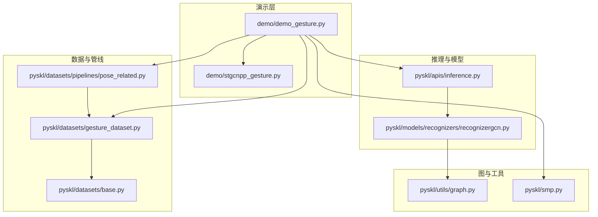
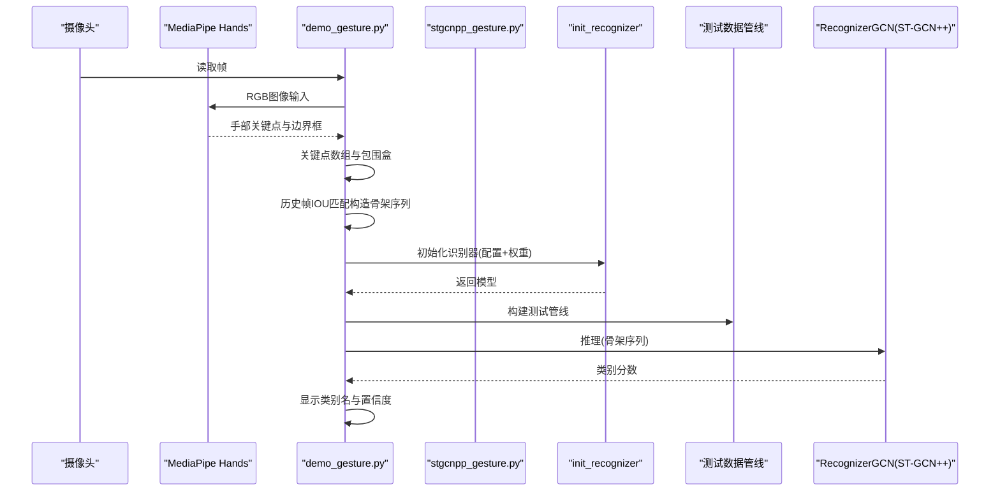
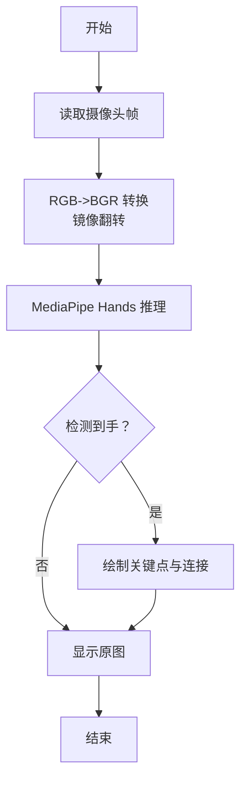
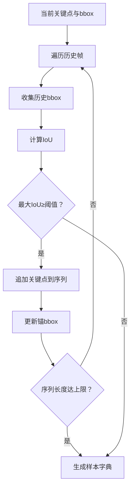
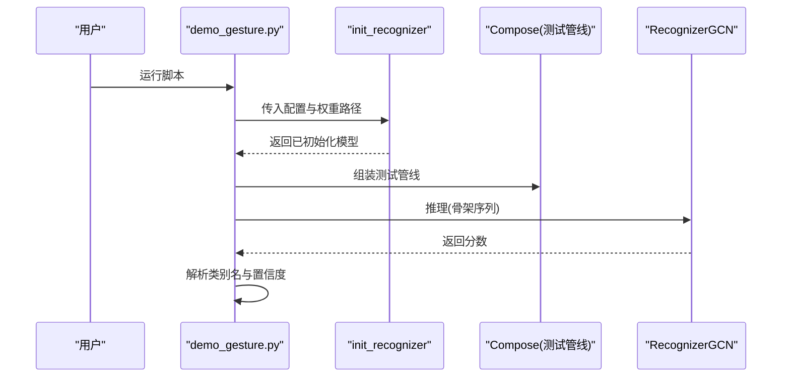
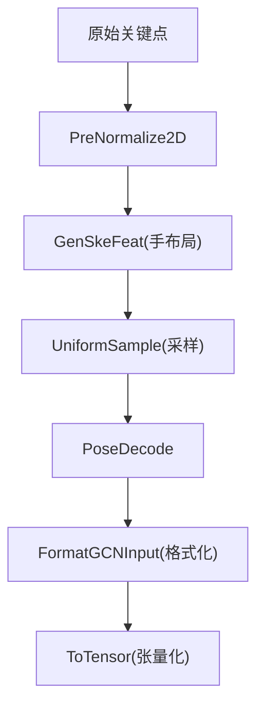
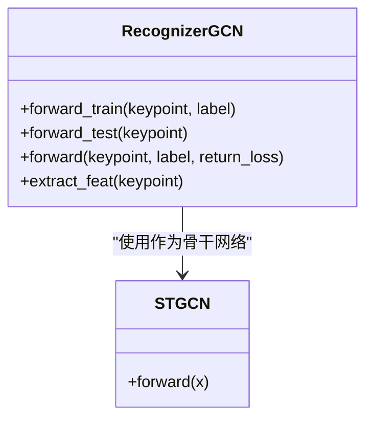
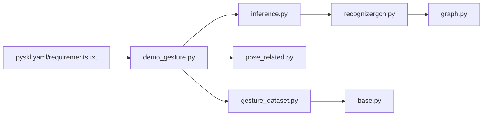

# 实时手势识别演示

<cite>
**本文引用的文件**   
- [demo_gesture.py](file://demo/demo_gesture.py)
- [demo.md](file://demo/demo.md)
- [stgcnpp_gesture.py](file://demo/stgcnpp_gesture.py)
- [inference.py](file://pyskl/apis/inference.py)
- [recognizergcn.py](file://pyskl/models/recognizers/recognizergcn.py)
- [gesture_dataset.py](file://pyskl/datasets/gesture_dataset.py)
- [base.py](file://pyskl/datasets/base.py)
- [pose_related.py](file://pyskl/datasets/pipelines/pose_related.py)
- [graph.py](file://pyskl/utils/graph.py)
- [smp.py](file://pyskl/smp.py)
- [pyskl.yaml](file://pyskl.yaml)
- [requirements.txt](file://requirements.txt)
</cite>

## 目录
1. [简介](#简介)
2. [项目结构](#项目结构)
3. [核心组件](#核心组件)
4. [架构总览](#架构总览)
5. [详细组件分析](#详细组件分析)
6. [依赖关系分析](#依赖关系分析)
7. [性能考虑](#性能考虑)
8. [故障排查指南](#故障排查指南)
9. [结论](#结论)
10. [附录](#附录)

## 简介
本指南面向希望在本地实时运行手势识别演示的用户，系统讲解 demo_gesture.py 的实现原理与使用方法，涵盖以下内容：
- 实时视频流处理：摄像头采集、图像预处理与显示
- 手势检测：基于 MediaPipe 的手部关键点提取与框选
- 手势分类：骨架序列构建、数据管线预处理与模型推理
- 结果展示：类别名称与置信度叠加到画面
- HaGRID 数据集与预训练模型加载流程
- 环境配置、运行步骤与性能优化建议
- 如何扩展更多手势类别（数据准备、训练与部署）

## 项目结构
演示相关的关键文件与职责如下：
- demo/demo_gesture.py：实时手势识别主程序，负责摄像头采集、MediaPipe 推理、骨架序列构造、模型加载与推理、结果可视化
- demo/stgcnpp_gesture.py：手势识别模型配置（ST-GCN++），定义模型结构与测试阶段数据管线
- pyskl/apis/inference.py：初始化识别器、构建数据管线、执行推理
- pyskl/models/recognizers/recognizergcn.py：GCN 识别器前向逻辑（训练/测试）
- pyskl/datasets/gesture_dataset.py：手势数据集标签映射与评估接口
- pyskl/datasets/pipelines/pose_related.py：骨架相关数据变换（归一化、骨架特征生成、采样等）
- pyskl/utils/graph.py：图结构（邻接矩阵、空间图等），支撑 ST-GCN 的图卷积
- pyskl/smp.py：工具函数（颜色转换、评估辅助等）
- demo/demo.md：演示说明与运行命令
- pyskl.yaml / requirements.txt：环境与依赖

**图表来源**
- [demo_gesture.py](file://demo/demo_gesture.py#L83-L174)
- [stgcnpp_gesture.py](file://demo/stgcnpp_gesture.py#L1-L27)
- [inference.py](file://pyskl/apis/inference.py#L19-L54)
- [recognizergcn.py](file://pyskl/models/recognizers/recognizergcn.py#L78-L86)
- [gesture_dataset.py](file://pyskl/datasets/gesture_dataset.py#L13-L56)
- [base.py](file://pyskl/datasets/base.py#L46-L73)
- [pose_related.py](file://pyskl/datasets/pipelines/pose_related.py#L12-L49)
- [graph.py](file://pyskl/utils/graph.py#L58-L96)
- [smp.py](file://pyskl/smp.py#L150-L156)

**章节来源**
- [demo_gesture.py](file://demo/demo_gesture.py#L1-L174)
- [demo.md](file://demo/demo.md#L32-L41)

## 核心组件
- 实时视频流与手部检测
  - 使用 OpenCV 捕获摄像头，MediaPipe Hands 进行静态图像模式的手部关键点检测与边界框估计
  - 将 RGB 转 BGR 并翻转图像用于镜像显示
- 骨架序列构造与匹配
  - 将关键点坐标转换为数组，计算包围盒；通过历史帧 IOU 匹配，拼接成固定长度的骨架序列
- 模型加载与推理
  - 通过 init_recognizer 加载配置与权重，构建测试数据管线，进行前向推理
- 结果展示
  - 将类别名称与置信度叠加到画面，滚动显示最近若干帧的预测结果

**章节来源**
- [demo_gesture.py](file://demo/demo_gesture.py#L83-L174)
- [stgcnpp_gesture.py](file://demo/stgcnpp_gesture.py#L18-L26)
- [inference.py](file://pyskl/apis/inference.py#L19-L54)

## 架构总览
下面的时序图展示了从摄像头到最终可视化的主要流程。

**图表来源**
- [demo_gesture.py](file://demo/demo_gesture.py#L83-L174)
- [stgcnpp_gesture.py](file://demo/stgcnpp_gesture.py#L18-L26)
- [inference.py](file://pyskl/apis/inference.py#L19-L54)
- [recognizergcn.py](file://pyskl/models/recognizers/recognizergcn.py#L78-L86)

## 详细组件分析

### 实时视频流与手部检测
- 摄像头采集：使用 OpenCV VideoCapture 获取帧
- 图像预处理：标记图像为只读以提升处理速度，RGB/BGR 转换与镜像翻转
- MediaPipe 推理：静态图像模式，单手检测，最小置信度阈值控制
- 可视化：绘制关键点连接与手部矩形框

**图表来源**
- [demo_gesture.py](file://demo/demo_gesture.py#L103-L144)

**章节来源**
- [demo_gesture.py](file://demo/demo_gesture.py#L83-L144)

### 骨架序列构造与匹配
- 关键点数组化与边界框计算
- 历史帧 IOU 匹配：以当前帧 bbox 为锚，回溯历史帧，若 IOU ≥ 阈值则拼接，直至达到固定长度或不满足条件
- 生成测试样本：构造包含骨架序列、总帧数、模态等字段的样本字典

**图表来源**
- [demo_gesture.py](file://demo/demo_gesture.py#L39-L70)

**章节来源**
- [demo_gesture.py](file://demo/demo_gesture.py#L16-L80)

### 模型加载与推理
- 初始化识别器：读取配置文件，构建模型，加载权重，设置设备与评估模式
- 构建测试数据管线：根据配置组装数据变换序列
- 推理：将样本送入模型，得到类别分数，取最高分作为预测类别

**图表来源**
- [demo_gesture.py](file://demo/demo_gesture.py#L85-L95)
- [inference.py](file://pyskl/apis/inference.py#L19-L54)
- [recognizergcn.py](file://pyskl/models/recognizers/recognizergcn.py#L78-L86)

**章节来源**
- [demo_gesture.py](file://demo/demo_gesture.py#L85-L95)
- [inference.py](file://pyskl/apis/inference.py#L57-L184)

### 数据管线与骨架特征
- 预处理：二维关键点归一化、生成骨架特征、均匀采样、格式化输入
- 输入形状：N, M, T, V, C（批大小、人数、时间步、节点数、通道）
- 图结构：使用 handmp 布局，构建邻接矩阵与空间图

**图表来源**
- [stgcnpp_gesture.py](file://demo/stgcnpp_gesture.py#L18-L26)
- [pose_related.py](file://pyskl/datasets/pipelines/pose_related.py#L52-L96)
- [graph.py](file://pyskl/utils/graph.py#L124-L131)

**章节来源**
- [stgcnpp_gesture.py](file://demo/stgcnpp_gesture.py#L18-L26)
- [pose_related.py](file://pyskl/datasets/pipelines/pose_related.py#L12-L96)
- [graph.py](file://pyskl/utils/graph.py#L58-L96)

### 模型结构与前向逻辑
- 模型：ST-GCN++（GCN + TCN），使用 handmp 布局
- 前向：提取特征后进入分类头，返回类别分数
- 设备：演示默认使用 CPU，亦可切换到 GPU

**图表来源**
- [recognizergcn.py](file://pyskl/models/recognizers/recognizergcn.py#L78-L86)
- [stgcnpp_gesture.py](file://demo/stgcnpp_gesture.py#L4-L16)

**章节来源**
- [recognizergcn.py](file://pyskl/models/recognizers/recognizergcn.py#L1-L97)
- [stgcnpp_gesture.py](file://demo/stgcnpp_gesture.py#L4-L16)

### 数据集与标签映射
- 标签名称：包含 HaGRID 的 15 个手势类别
- 评估：提供 Top-1/Top-5 准确率与分组统计

**章节来源**
- [gesture_dataset.py](file://pyskl/datasets/gesture_dataset.py#L25-L37)
- [gesture_dataset.py](file://pyskl/datasets/gesture_dataset.py#L105-L155)

## 依赖关系分析
- 环境与依赖
  - 推荐使用提供的 conda 环境文件一键安装
  - 必要 Python 包：OpenCV、MediaPipe、PyTorch、MMCV、MMDet、MMPose 等
- 模块耦合
  - demo_gesture.py 依赖 init_recognizer 与数据管线
  - 推理器依赖 GCN 骨干网络与图结构工具
  - 数据管线依赖骨架特征生成与归一化

**图表来源**
- [pyskl.yaml](file://pyskl.yaml#L1-L132)
- [requirements.txt](file://requirements.txt#L1-L14)
- [demo_gesture.py](file://demo/demo_gesture.py#L1-L10)
- [inference.py](file://pyskl/apis/inference.py#L1-L17)
- [recognizergcn.py](file://pyskl/models/recognizers/recognizergcn.py#L1-L9)
- [pose_related.py](file://pyskl/datasets/pipelines/pose_related.py#L1-L8)
- [graph.py](file://pyskl/utils/graph.py#L1-L3)
- [gesture_dataset.py](file://pyskl/datasets/gesture_dataset.py#L1-L11)
- [base.py](file://pyskl/datasets/base.py#L1-L17)

**章节来源**
- [pyskl.yaml](file://pyskl.yaml#L1-L132)
- [requirements.txt](file://requirements.txt#L1-L14)

## 性能考虑
- 帧采样策略：每 N 帧推理一次，降低推理频率，提高实时性
- 预处理优化：将图像标记为只读、减少不必要的复制
- 设备选择：演示默认 CPU，如需更高吞吐量可切换到 GPU
- IOU 匹配：合理设置阈值与历史长度，平衡稳定性与延迟
- 显示开销：仅在必要时绘制关键点与文本，避免频繁重绘

**章节来源**
- [demo_gesture.py](file://demo/demo_gesture.py#L96-L101)
- [demo_gesture.py](file://demo/demo_gesture.py#L111-L114)
- [demo_gesture.py](file://demo/demo_gesture.py#L147-L158)

## 故障排查指南
- 无法打开摄像头
  - 检查设备权限与占用情况
  - 确认 OpenCV 安装正确
- MediaPipe 未检测到手
  - 调整最小检测置信度阈值
  - 确保手部清晰可见且占画面比例适中
- 推理报错或速度过慢
  - 切换到 GPU 设备（如可用）
  - 降低帧采样间隔或减少历史长度
- 标签显示异常
  - 确认模型类别数与标签映射一致
  - 检查数据管线中的骨架特征生成与格式化步骤

**章节来源**
- [demo_gesture.py](file://demo/demo_gesture.py#L107-L109)
- [demo_gesture.py](file://demo/demo_gesture.py#L85-L87)
- [demo_gesture.py](file://demo/demo_gesture.py#L147-L158)

## 结论
本演示以 MediaPipe 提供手部关键点，结合轻量级 ST-GCN++ 模型与精心设计的数据管线，在 CPU 上实现了低延迟的实时手势识别。通过合理的帧采样与 IOU 匹配策略，系统在保证稳定性的同时兼顾了实时性。用户可根据自身需求调整阈值、设备与显示策略，以获得更佳体验。

## 附录

### 使用示例与运行步骤
- 环境准备
  - 创建并激活 conda 环境
  - 安装项目与依赖
- 运行实时演示
  - 在终端执行演示脚本
- 依赖安装
  - 安装 MediaPipe 以支持手部关键点检测

**章节来源**
- [demo.md](file://demo/demo.md#L5-L15)
- [demo.md](file://demo/demo.md#L32-L41)

### HaGRID 数据集与预训练模型
- 默认类别：15 个手势类别
- 预训练模型：ST-GCN++（手布局），HaGRID 训练
- 数据管线：归一化、骨架特征生成、采样、格式化输入

**章节来源**
- [demo.md](file://demo/demo.md#L32-L36)
- [gesture_dataset.py](file://pyskl/datasets/gesture_dataset.py#L25-L37)
- [stgcnpp_gesture.py](file://demo/stgcnpp_gesture.py#L1-L27)

### 扩展更多手势类别
- 数据准备
  - 生成标注与骨架序列（参考骨架数据集加载流程）
  - 划分训练/验证集
- 模型训练
  - 修改配置文件中的类别数与图布局
  - 使用训练脚本进行训练
- 部署
  - 导出/保存权重
  - 在推理脚本中替换配置与权重路径

**章节来源**
- [gesture_dataset.py](file://pyskl/datasets/gesture_dataset.py#L58-L103)
- [stgcnpp_gesture.py](file://demo/stgcnpp_gesture.py#L4-L16)
- [demo_gesture.py](file://demo/demo_gesture.py#L85-L87)