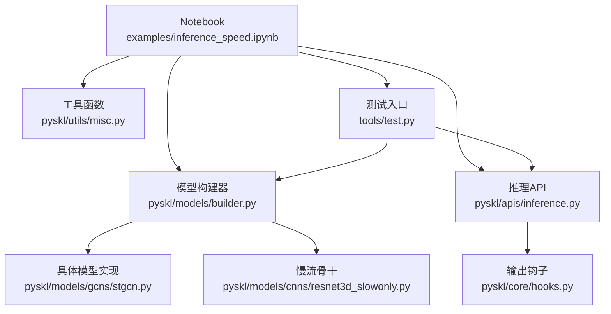
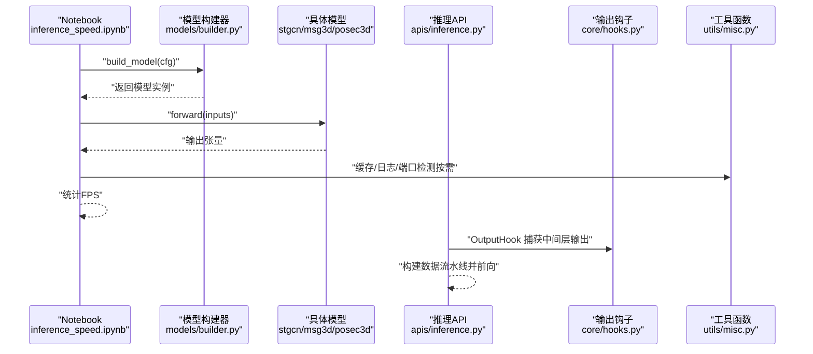
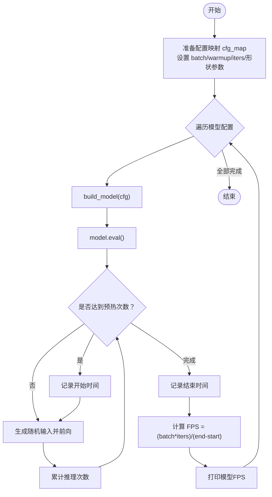
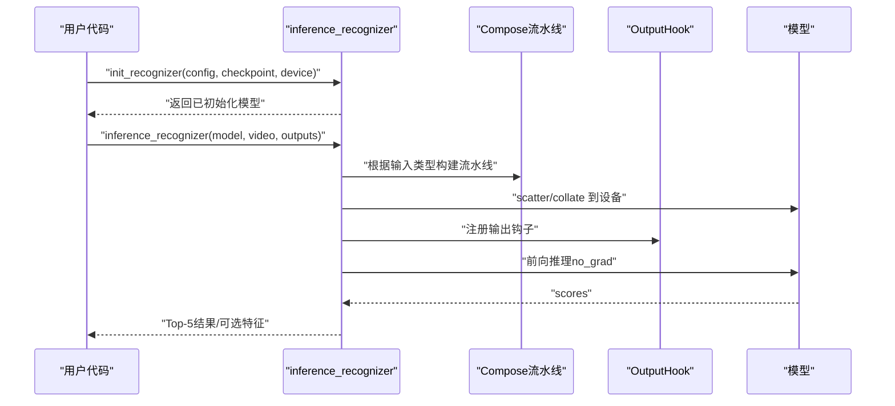
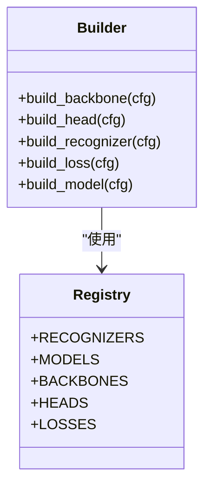
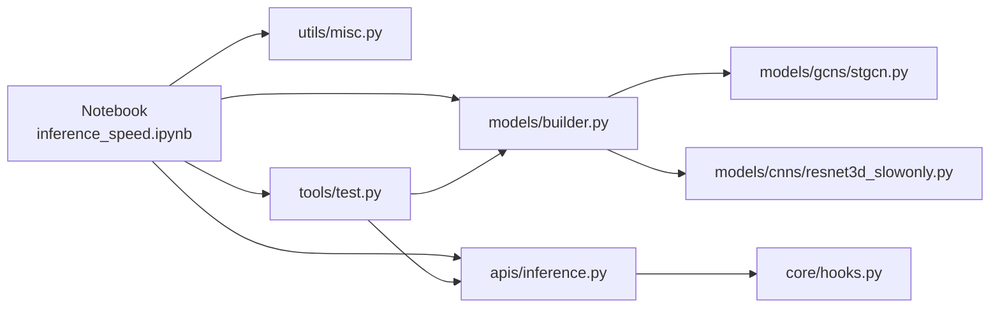

# 性能测试与基准

<cite>
**本文引用的文件**
- [examples/inference_speed.ipynb](file://examples/inference_speed.ipynb)
- [pyskl/apis/inference.py](file://pyskl/apis/inference.py)
- [pyskl/models/builder.py](file://pyskl/models/builder.py)
- [pyskl/utils/misc.py](file://pyskl/utils/misc.py)
- [pyskl/core/hooks.py](file://pyskl/core/hooks.py)
- [pyskl/models/gcns/stgcn.py](file://pyskl/models/gcns/stgcn.py)
- [pyskl/models/cnns/resnet3d_slowonly.py](file://pyskl/models/cnns/resnet3d_slowonly.py)
- [tools/test.py](file://tools/test.py)
- [configs/posec3d/slowonly_r50_346_k400/joint.py](file://configs/posec3d/slowonly_r50_346_k400/joint.py)
</cite>

## 目录
1. [简介](#简介)
2. [项目结构](#项目结构)
3. [核心组件](#核心组件)
4. [架构总览](#架构总览)
5. [详细组件分析](#详细组件分析)
6. [依赖关系分析](#依赖关系分析)
7. [性能考量](#性能考量)
8. [故障排查指南](#故障排查指南)
9. [结论](#结论)
10. [附录](#附录)

## 简介
本指南围绕 PySKL 的性能测试与基准展开，重点解析推理速度测试 Notebook（examples/inference_speed.ipynb）的实现原理与使用方法，涵盖以下内容：
- 推理速度测试流程：批量输入、预热迭代、正式计时、FPS 计算
- 性能基准评估：在不同硬件（CPU/GPU）与不同模型上的对比
- 指标定义：FPS、延迟、吞吐量、内存使用（概念性说明）
- 测试执行与结果分析：数据准备、运行流程、结果解读
- 模型优化方向：量化、剪枝、蒸馏（概念性说明）与 PySKL 已有工具结合点
- 性能调优最佳实践与常见瓶颈定位

本指南力求以循序渐进的方式帮助读者理解从数据到指标的全链路流程，并给出可操作的测试步骤与优化建议。

## 项目结构
与性能测试直接相关的关键模块与文件如下：
- 示例脚本：examples/inference_speed.ipynb（推理速度测试与结果汇总）
- 推理 API：pyskl/apis/inference.py（初始化模型、构建数据流水线、前向推理）
- 模型构建器：pyskl/models/builder.py（按配置构建模型）
- 工具函数：pyskl/utils/misc.py（缓存检查点、日志、端口检测等）
- 输出钩子：pyskl/core/hooks.py（特征输出捕获）
- 典型模型实现：pyskl/models/gcns/stgcn.py、pyskl/models/cnns/resnet3d_slowonly.py
- 测试入口：tools/test.py（分布式推理、融合 BN、编译加速等）
- 配置示例：configs/posec3d/slowonly_r50_346_k400/joint.py（慢流骨干网络配置）

图表来源
- [examples/inference_speed.ipynb](file://examples/inference_speed.ipynb#L1-L206)
- [pyskl/models/builder.py](file://pyskl/models/builder.py#L1-L39)
- [pyskl/models/gcns/stgcn.py](file://pyskl/models/gcns/stgcn.py#L1-L138)
- [pyskl/models/cnns/resnet3d_slowonly.py](file://pyskl/models/cnns/resnet3d_slowonly.py#L1-L18)
- [pyskl/apis/inference.py](file://pyskl/apis/inference.py#L1-L184)
- [pyskl/core/hooks.py](file://pyskl/core/hooks.py#L1-L68)
- [pyskl/utils/misc.py](file://pyskl/utils/misc.py#L1-L131)
- [tools/test.py](file://tools/test.py#L1-L185)

章节来源
- [examples/inference_speed.ipynb](file://examples/inference_speed.ipynb#L1-L206)
- [pyskl/models/builder.py](file://pyskl/models/builder.py#L1-L39)
- [pyskl/apis/inference.py](file://pyskl/apis/inference.py#L1-L184)
- [pyskl/utils/misc.py](file://pyskl/utils/misc.py#L1-L131)
- [pyskl/core/hooks.py](file://pyskl/core/hooks.py#L1-L68)
- [pyskl/models/gcns/stgcn.py](file://pyskl/models/gcns/stgcn.py#L1-L138)
- [pyskl/models/cnns/resnet3d_slowonly.py](file://pyskl/models/cnns/resnet3d_slowonly.py#L1-L18)
- [tools/test.py](file://tools/test.py#L1-L185)
- [configs/posec3d/slowonly_r50_346_k400/joint.py](file://configs/posec3d/slowonly_r50_346_k400/joint.py#L1-L110)

## 核心组件
- 推理速度测试 Notebook（examples/inference_speed.ipynb）
  - 定义多类 GCN/3D CNN 骨干的配置映射
  - 设置批量大小、预热迭代与正式迭代次数
  - 构建模型、生成随机输入张量、禁用梯度、循环推理并统计 FPS
  - 对比 PoseC3D 等视频骨架 3D 骨干的推理速度
- 推理 API（pyskl/apis/inference.py）
  - 初始化模型：加载配置、构建模型、迁移至设备、设为 eval
  - 构建数据流水线：根据输入类型（数组/视频/原始帧）选择解码方式
  - 前向推理：使用 OutputHook 捕获指定层输出，返回 Top-K 结果
- 模型构建器（pyskl/models/builder.py）
  - 通过 Registry 将配置中的 type 映射到具体模型注册项
  - 支持构建 backbone/head/recognizer/loss
- 工具函数（pyskl/utils/misc.py）
  - 缓存检查点、日志、端口检测、memcached 启停
- 输出钩子（pyskl/core/hooks.py）
  - 注册 forward hook 捕获中间层输出，支持张量或 numpy 数组
- 测试入口（tools/test.py）
  - 支持分布式推理、融合卷积与 BN、模型编译（PyTorch 2.0）、平均裁剪策略
  - 与配置文件联动，统一管理 cudnn_benchmark、评估指标等

章节来源
- [examples/inference_speed.ipynb](file://examples/inference_speed.ipynb#L1-L206)
- [pyskl/apis/inference.py](file://pyskl/apis/inference.py#L1-L184)
- [pyskl/models/builder.py](file://pyskl/models/builder.py#L1-L39)
- [pyskl/utils/misc.py](file://pyskl/utils/misc.py#L1-L131)
- [pyskl/core/hooks.py](file://pyskl/core/hooks.py#L1-L68)
- [tools/test.py](file://tools/test.py#L1-L185)

## 架构总览
下图展示了从 Notebook 到模型推理的整体流程，以及与推理 API、构建器、工具函数的关系。

图表来源
- [examples/inference_speed.ipynb](file://examples/inference_speed.ipynb#L96-L111)
- [pyskl/models/builder.py](file://pyskl/models/builder.py#L32-L39)
- [pyskl/models/gcns/stgcn.py](file://pyskl/models/gcns/stgcn.py#L124-L137)
- [pyskl/apis/inference.py](file://pyskl/apis/inference.py#L170-L183)
- [pyskl/core/hooks.py](file://pyskl/core/hooks.py#L24-L57)
- [pyskl/utils/misc.py](file://pyskl/utils/misc.py#L115-L125)

## 详细组件分析

### 推理速度测试 Notebook（examples/inference_speed.ipynb）
- 数据准备
  - 定义多类模型配置字典（如 AAGCN、CTRGCN、DGSTGCN、MSG3D、STGCN、STGCN++），并映射到 cfg_map
  - 设置 batch、warmup、iters、关键形状参数（num_joints、num_person、seq_len）
- 执行流程
  - 遍历 cfg_map，逐个构建模型并切换 eval 模式
  - 使用 torch.randn 生成符合模型输入维度的张量
  - 在禁用梯度的前提下进行前向推理
  - 在达到 warmup 次数后开始计时，累计 iters 次推理时间，计算 FPS = (batch × iters) / 耗时
- 结果呈现
  - 控制台打印各模型的 FPS
  - 表格形式记录不同硬件（GPU/Linux、GPU/Windows、CPU）下的 FPS 对比

图表来源
- [examples/inference_speed.ipynb](file://examples/inference_speed.ipynb#L44-L111)

章节来源
- [examples/inference_speed.ipynb](file://examples/inference_speed.ipynb#L44-L111)

### 推理 API（pyskl/apis/inference.py）
- 初始化模型
  - 支持字符串或 Config 对象；将 backbone.pretrained 设为 None，避免重复下载预训练权重
  - 加载检查点（若提供），迁移至目标设备，设为 eval
- 数据流水线
  - 根据输入类型（字典/数组/视频路径/原始帧目录）选择不同的 Init/Decode 组件
  - 使用 Compose 组合流水线，collate 到 GPU（若在 GPU 上）
- 前向推理
  - 使用 OutputHook 捕获指定层输出，返回 Top-5 分类结果与可选特征图
  - 通过 torch.no_grad 禁用梯度，提升推理效率

图表来源
- [pyskl/apis/inference.py](file://pyskl/apis/inference.py#L19-L54)
- [pyskl/apis/inference.py](file://pyskl/apis/inference.py#L104-L183)

章节来源
- [pyskl/apis/inference.py](file://pyskl/apis/inference.py#L19-L54)
- [pyskl/apis/inference.py](file://pyskl/apis/inference.py#L104-L183)

### 模型构建器（pyskl/models/builder.py）
- 通过 Registry 将配置中的 type 映射到具体模型注册项
- 支持构建 backbone/head/recognizer/loss，build_model 会根据 type 决定走哪条分支

图表来源
- [pyskl/models/builder.py](file://pyskl/models/builder.py#L1-L39)

章节来源
- [pyskl/models/builder.py](file://pyskl/models/builder.py#L1-L39)

### 工具函数（pyskl/utils/misc.py）
- 缓存检查点：对远程 URL 自动生成本地缓存路径，避免重复下载
- 日志与端口检测：提供根日志器、memcached 启停、端口可用性检测
- 多进程缓存：支持将数据集注释等缓存到 memcached，加速数据加载

章节来源
- [pyskl/utils/misc.py](file://pyskl/utils/misc.py#L115-L125)
- [pyskl/utils/misc.py](file://pyskl/utils/misc.py#L18-L94)

### 输出钩子（pyskl/core/hooks.py）
- 通过 register_forward_hook 捕获指定层输出
- 支持返回张量或 numpy 数组，便于后续分析与可视化

章节来源
- [pyskl/core/hooks.py](file://pyskl/core/hooks.py#L17-L57)

### 典型模型实现
- STGCN（空间-时间图卷积）
  - 包含多个 STGCNBlock，每个 Block 内部组合 GCN 与 TCN，并支持残差连接
  - forward 中对输入进行重排与批归一化，随后逐层前向
- ResNet3dSlowOnly（慢流骨干）
  - 基于 ResNet3d，通过特定膨胀策略与卷积核尺寸适配视频 3D 特征提取

章节来源
- [pyskl/models/gcns/stgcn.py](file://pyskl/models/gcns/stgcn.py#L13-L137)
- [pyskl/models/cnns/resnet3d_slowonly.py](file://pyskl/models/cnns/resnet3d_slowonly.py#L6-L17)

### 测试入口（tools/test.py）
- 支持分布式推理、融合卷积与 BN、模型编译（PyTorch 2.0）
- 与配置文件联动，统一管理 cudnn_benchmark、评估指标、平均裁剪策略等

章节来源
- [tools/test.py](file://tools/test.py#L71-L107)
- [tools/test.py](file://tools/test.py#L129-L148)

### 配置示例（configs/posec3d/slowonly_r50_346_k400/joint.py）
- 定义了 Recognizer3D + ResNet3dSlowOnly 骨干 + I3DHead 的典型配置
- 提供训练/验证/测试流水线，以及数据加载参数、优化器与学习率策略

章节来源
- [configs/posec3d/slowonly_r50_346_k400/joint.py](file://configs/posec3d/slowonly_r50_346_k400/joint.py#L1-L110)

## 依赖关系分析
- Notebook 依赖模型构建器与具体模型实现，用于按配置构建模型
- 推理 API 依赖流水线组合、输出钩子与设备散列/聚合
- 工具函数为缓存与日志提供支撑
- 测试入口与配置文件共同决定分布式与评估行为

图表来源
- [examples/inference_speed.ipynb](file://examples/inference_speed.ipynb#L96-L111)
- [pyskl/models/builder.py](file://pyskl/models/builder.py#L32-L39)
- [pyskl/models/gcns/stgcn.py](file://pyskl/models/gcns/stgcn.py#L124-L137)
- [pyskl/models/cnns/resnet3d_slowonly.py](file://pyskl/models/cnns/resnet3d_slowonly.py#L6-L17)
- [pyskl/apis/inference.py](file://pyskl/apis/inference.py#L170-L183)
- [pyskl/core/hooks.py](file://pyskl/core/hooks.py#L24-L57)
- [pyskl/utils/misc.py](file://pyskl/utils/misc.py#L115-L125)
- [tools/test.py](file://tools/test.py#L85-L107)

章节来源
- [examples/inference_speed.ipynb](file://examples/inference_speed.ipynb#L96-L111)
- [pyskl/models/builder.py](file://pyskl/models/builder.py#L32-L39)
- [pyskl/apis/inference.py](file://pyskl/apis/inference.py#L170-L183)
- [pyskl/core/hooks.py](file://pyskl/core/hooks.py#L24-L57)
- [pyskl/utils/misc.py](file://pyskl/utils/misc.py#L115-L125)
- [tools/test.py](file://tools/test.py#L85-L107)

## 性能考量
- 指标定义（概念性说明）
  - FPS（每秒样本数）：衡量吞吐能力，越高速度越快
  - 延迟（Latency）：单次推理耗时，越短越好
  - 吞吐量（Throughput）：单位时间内处理的样本数，与 FPS 等价
  - 内存使用（Memory）：显存/系统内存占用，影响并发与稳定性
- 影响因素
  - 硬件：CPU/GPU、CUDA/cuDNN 版本、驱动版本
  - 模型：层数、通道数、输入分辨率、是否融合 BN、是否启用 cudnn_benchmark
  - 数据：批大小、数据流水线复杂度、是否启用 memcached
  - 运行时：是否禁用梯度、是否使用 torch.no_grad、是否启用编译（PyTorch 2.0）
- 不同硬件配置下的表现
  - GPU（Linux/Windows）通常显著优于 CPU
  - 不同 GPU 型号在相同配置下会有明显差异
  - Windows 下 CUDA 环境与驱动可能影响性能

[本节为通用性能讨论，不直接分析具体文件，故无“章节来源”]

## 故障排查指南
- 检查点缓存失败
  - 现象：远程检查点无法加载或重复下载
  - 处理：确认网络连通性；查看缓存路径是否存在；必要时手动清理缓存后重试
  - 参考：缓存检查点逻辑
- memcached 启动失败
  - 现象：端口占用或启动失败
  - 处理：检测端口可用性，更换端口或关闭冲突进程；确保权限允许启动
  - 参考：端口检测与启停函数
- 推理报错或输出异常
  - 现象：输入类型不匹配、流水线组件缺失、设备不一致
  - 处理：确认输入类型与流水线配置一致；确保模型与数据在同一设备上；检查 Compose 组合顺序
- 分布式推理问题
  - 现象：进程同步失败、评估指标异常
  - 处理：检查 dist 初始化参数、world_size、rank；确保所有进程共享同一工作目录

章节来源
- [pyskl/utils/misc.py](file://pyskl/utils/misc.py#L18-L94)
- [pyskl/apis/inference.py](file://pyskl/apis/inference.py#L83-L98)
- [tools/test.py](file://tools/test.py#L134-L167)

## 结论
- examples/inference_speed.ipynb 提供了快速、可复现的推理速度测试框架，适合在不同硬件与模型间进行横向对比
- 推理 API 与模型构建器配合，使得按配置快速切换模型成为可能
- 实践中应关注数据流水线、设备分配、缓存与编译等细节，以获得稳定且可重现的性能结果
- 若需更全面的评估，可结合 tools/test.py 的分布式推理与评估能力，进一步扩展指标与场景

[本节为总结性内容，不直接分析具体文件，故无“章节来源”]

## 附录

### A. 性能测试流程（完整版）
- 准备阶段
  - 确认 Python 依赖与环境变量（CUDA/cuDNN 版本）
  - 准备模型配置映射（参考 Notebook 中 cfg_map 的组织方式）
- 执行阶段
  - 设置 batch、warmup、iters 与输入形状参数
  - 遍历 cfg_map，逐个构建模型并切换 eval
  - 生成随机输入张量，禁用梯度，循环推理并在达到 warmup 后开始计时
  - 计算 FPS 并记录
- 结果分析
  - 对比不同模型在相同硬件上的 FPS
  - 对比不同硬件（CPU/GPU）在同一模型上的 FPS
  - 关注延迟分布与稳定性（多次运行取均值/方差）

章节来源
- [examples/inference_speed.ipynb](file://examples/inference_speed.ipynb#L44-L111)

### B. 指标定义与解读
- FPS：样本数/秒，越大越好
- 延迟：单次推理耗时，越短越好
- 吞吐量：与 FPS 等价，常用于服务端场景
- 内存使用：显存峰值与系统内存占用，需结合批大小与输入分辨率综合考虑

[本节为概念性说明，不直接分析具体文件，故无“章节来源”]

### C. 模型优化方向（概念性说明）
- 量化：将浮点权重/激活量化为低比特表示，降低显存与带宽占用，可能带来精度损失
- 剪枝：移除冗余权重或通道，减小模型规模，需注意结构化/非结构化剪枝对推理的影响
- 蒸馏：以教师模型指导学生模型训练，提升小模型性能
- 在 PySKL 中可结合现有工具：
  - fuse_conv_bn：融合卷积与 BN，减少一次归一化开销
  - torch.compile（PyTorch 2.0）：自动图优化，提升推理吞吐
  - memcached：缓存数据注释，减少 I/O 开销

章节来源
- [tools/test.py](file://tools/test.py#L98-L99)
- [tools/test.py](file://tools/test.py#L87-L88)
- [pyskl/utils/misc.py](file://pyskl/utils/misc.py#L18-L94)