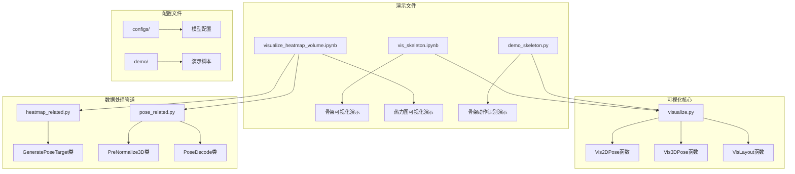
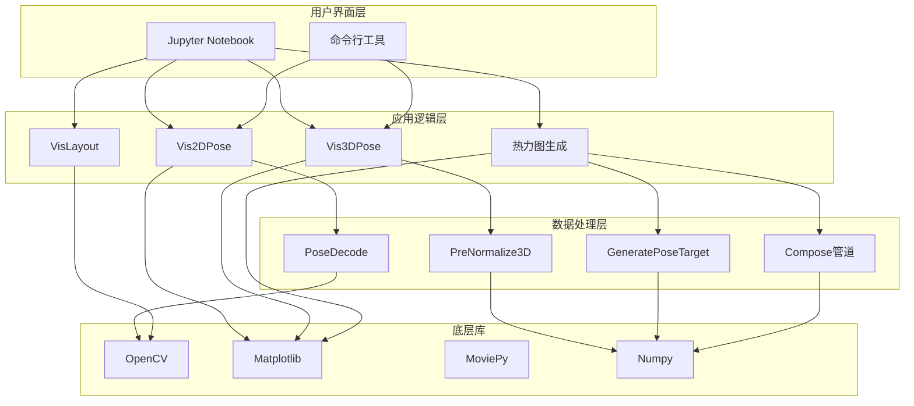
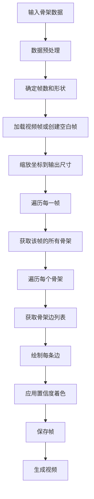
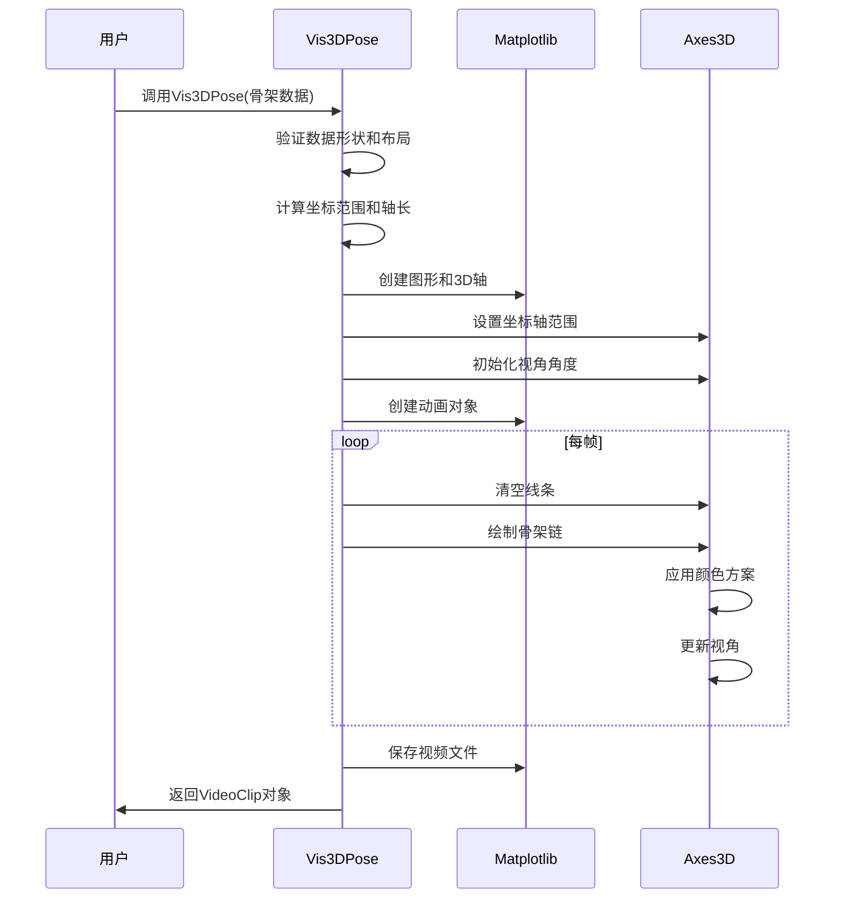
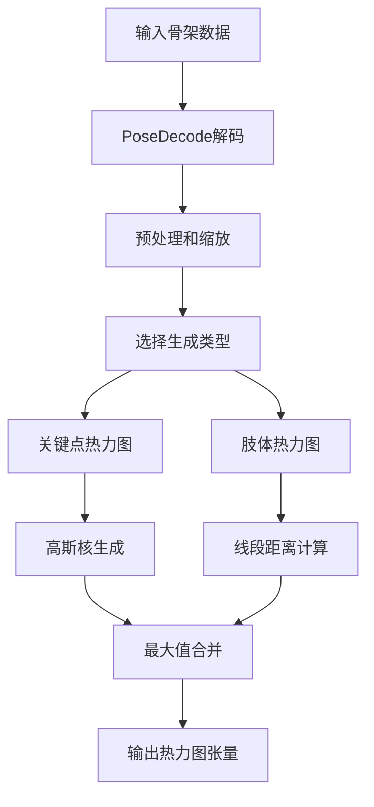
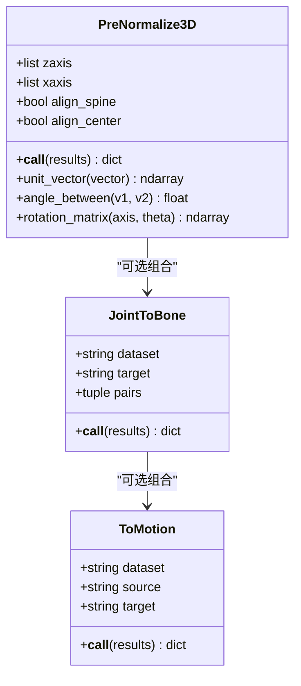
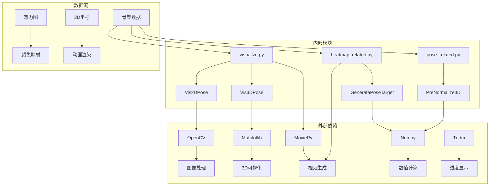
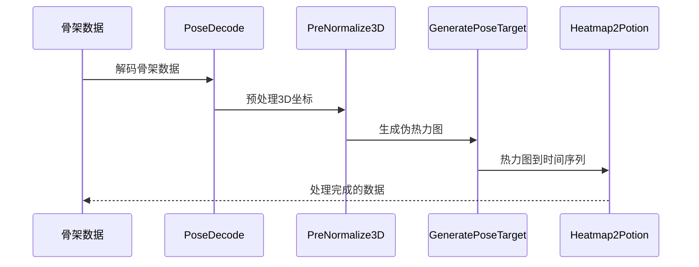
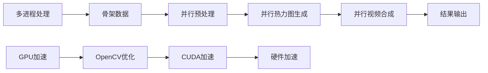

# 数据可视化演示

<cite>
**本文档引用的文件**
- [vis_skeleton.ipynb](file://demo/vis_skeleton.ipynb)
- [visualize_heatmap_volume.ipynb](file://demo/visualize_heatmap_volume.ipynb)
- [visualize.py](file://pyskl/utils/visualize.py)
- [heatmap_related.py](file://pyskl/datasets/pipelines/heatmap_related.py)
- [pose_related.py](file://pyskl/datasets/pipelines/pose_related.py)
- [demo_skeleton.py](file://demo/demo_skeleton.py)
- [demo.md](file://demo/demo.md)
</cite>

## 目录
1. [简介](#简介)
2. [项目结构](#项目结构)
3. [核心组件](#核心组件)
4. [架构概览](#架构概览)
5. [详细组件分析](#详细组件分析)
6. [依赖关系分析](#依赖关系分析)
7. [性能考虑](#性能考虑)
8. [故障排除指南](#故障排除指南)
9. [结论](#结论)
10. [附录](#附录)

## 简介

PySKL是一个基于OpenMMLab框架的人体骨架动作识别工具包，提供了丰富的数据可视化功能。本文档专注于两个主要的可视化演示：骨架数据可视化和热力图体积可视化。

骨架数据可视化功能支持：
- 2D骨架可视化（带或不带视频背景）
- 3D骨架可视化（NTURGB+D格式）
- 实时动画效果展示
- 自定义颜色方案和线条粗细

热力图体积可视化功能支持：
- 伪热力图生成（关键点和肢体）
- 3D热力图渲染
- 颜色映射和交互式缩放
- 批量处理和结果导出

## 项目结构

PySKL项目的可视化相关文件组织如下：



**图表来源**
- [vis_skeleton.ipynb](file://demo/vis_skeleton.ipynb#L1-L113)
- [visualize_heatmap_volume.ipynb](file://demo/visualize_heatmap_volume.ipynb#L1-L378)
- [visualize.py](file://pyskl/utils/visualize.py#L1-L238)

**章节来源**
- [demo.md](file://demo/demo.md#L1-L42)

## 核心组件

### 可视化工具模块

`pyskl/utils/visualize.py` 提供了三个核心可视化函数：

1. **Vis2DPose**: 2D骨架可视化
2. **Vis3DPose**: 3D骨架可视化  
3. **VisLayout**: 布局可视化

### 热力图生成管道

`pyskl/datasets/pipelines/heatmap_related.py` 包含：
- **GeneratePoseTarget**: 伪热力图生成器
- **Heatmap2Potion**: 热力图到时间序列转换

### 骨骼预处理管道

`pyskl/datasets/pipelines/pose_related.py` 包含：
- **PreNormalize3D**: 3D骨骼归一化
- **PoseDecode**: 骨骼解码
- **JointToBone**: 关节到骨骼转换

**章节来源**
- [visualize.py](file://pyskl/utils/visualize.py#L1-L238)
- [heatmap_related.py](file://pyskl/datasets/pipelines/heatmap_related.py#L1-L349)
- [pose_related.py](file://pyskl/datasets/pipelines/pose_related.py#L1-L553)

## 架构概览

PySKL的可视化系统采用分层架构设计：



**图表来源**
- [visualize.py](file://pyskl/utils/visualize.py#L1-L238)
- [heatmap_related.py](file://pyskl/datasets/pipelines/heatmap_related.py#L1-L349)
- [pose_related.py](file://pyskl/datasets/pipelines/pose_related.py#L1-L553)

## 详细组件分析

### 2D骨架可视化组件

#### Vis2DPose函数分析



**图表来源**
- [visualize.py](file://pyskl/utils/visualize.py#L101-L172)

关键特性：
- 支持带视频背景和纯骨架两种模式
- 自动颜色映射（基于置信度）
- 可配置的阈值过滤
- 支持多种骨架布局（COCO、单手、双手）

**章节来源**
- [visualize.py](file://pyskl/utils/visualize.py#L101-L172)

### 3D骨架可视化组件

#### Vis3DPose函数分析



**图表来源**
- [visualize.py](file://pyskl/utils/visualize.py#L41-L98)

NTURGB+D骨架结构特点：
- 25个关键点
- 分层骨架结构（头部、躯干、四肢）
- 左右对称的颜色方案

**章节来源**
- [visualize.py](file://pyskl/utils/visualize.py#L41-L98)

### 热力图体积可视化组件

#### 伪热力图生成流程



**图表来源**
- [heatmap_related.py](file://pyskl/datasets/pipelines/heatmap_related.py#L192-L247)

热力图生成算法：
- 使用高斯核生成关键点热力图
- 基于线段距离计算肢体热力图
- 支持左右对称翻转增强
- 可调节的sigma参数控制模糊程度

**章节来源**
- [heatmap_related.py](file://pyskl/datasets/pipelines/heatmap_related.py#L9-L274)

### 骨骼预处理组件

#### PreNormalize3D分析



**图表来源**
- [pose_related.py](file://pyskl/datasets/pipelines/pose_related.py#L206-L292)
- [pose_related.py](file://pyskl/datasets/pipelines/pose_related.py#L295-L332)
- [pose_related.py](file://pyskl/datasets/pipelines/pose_related.py#L336-L356)

**章节来源**
- [pose_related.py](file://pyskl/datasets/pipelines/pose_related.py#L206-L292)

## 依赖关系分析

### 核心依赖关系



**图表来源**
- [visualize.py](file://pyskl/utils/visualize.py#L1-L10)
- [heatmap_related.py](file://pyskl/datasets/pipelines/heatmap_related.py#L1-L7)
- [pose_related.py](file://pyskl/datasets/pipelines/pose_related.py#L1-L8)

### 数据处理管道



**图表来源**
- [pose_related.py](file://pyskl/datasets/pipelines/pose_related.py#L12-L49)
- [pose_related.py](file://pyskl/datasets/pipelines/pose_related.py#L206-L292)
- [heatmap_related.py](file://pyskl/datasets/pipelines/heatmap_related.py#L249-L262)

**章节来源**
- [visualize.py](file://pyskl/utils/visualize.py#L1-L238)
- [heatmap_related.py](file://pyskl/datasets/pipelines/heatmap_related.py#L1-L349)
- [pose_related.py](file://pyskl/datasets/pipelines/pose_related.py#L1-L553)

## 性能考虑

### 内存优化策略

1. **分帧处理**: 骨架数据按帧处理，避免一次性加载所有帧
2. **数据类型优化**: 使用float16存储骨架坐标，减少内存占用
3. **渐进式处理**: 热力图生成采用逐帧计算方式

### 计算效率优化

1. **向量化操作**: 大量使用NumPy向量化操作
2. **最小化循环**: 在可能的情况下减少嵌套循环
3. **缓存机制**: 对重复计算的结果进行缓存

### 并行处理



## 故障排除指南

### 常见问题及解决方案

#### 1. 视频播放问题
**症状**: 视频无法在Jupyter中显示
**解决方案**:
- 确保安装了`ipywidgets`和`tornado`库
- 检查浏览器兼容性
- 尝试下载视频文件后本地播放

#### 2. 3D可视化异常
**症状**: 3D骨架显示不完整或变形
**解决方案**:
- 检查骨架数据格式是否正确
- 确认坐标系一致性
- 调整视角参数

#### 3. 热力图生成错误
**症状**: 热力图为空或显示异常
**解决方案**:
- 验证输入骨架坐标的有效性
- 检查sigma参数设置
- 确认图像尺寸匹配

#### 4. 内存不足问题
**症状**: 处理大型视频时内存溢出
**解决方案**:
- 减少视频分辨率
- 分批处理视频帧
- 增加系统内存

**章节来源**
- [demo_skeleton.py](file://demo/demo_skeleton.py#L15-L49)

## 结论

PySKL的可视化系统提供了强大而灵活的数据可视化能力，特别适用于人体骨架数据的分析和展示。通过Jupyter Notebook演示，用户可以直观地理解各种可视化技术的实现原理和使用方法。

主要优势：
- **易用性**: 提供简洁的API接口
- **灵活性**: 支持多种可视化模式和自定义选项
- **扩展性**: 基于模块化设计，易于扩展新功能
- **性能**: 优化的算法和数据处理流程

建议的后续改进方向：
- 增加更多的颜色主题和样式选项
- 实现交互式可视化控件
- 支持更多数据格式和协议
- 优化大规模数据的处理性能

## 附录

### 使用示例

#### 2D骨架可视化示例

```python
# 加载骨架数据
annotations = load('ntu60_2d.pkl')
index = 0
anno = annotations[index]

# 创建2D骨架可视化
vid = Vis2DPose(anno, thre=0.2, out_shape=(540, 960), layout='coco', fps=12, video=None)
vid.ipython_display()
```

#### 3D骨架可视化示例

```python
# 预处理3D骨架数据
from pyskl.datasets.pipelines import PreNormalize3D
anno = PreNormalize3D()(anno)

# 创建3D骨架可视化
vid = Vis3DPose(anno, layout='nturgb+d', fps=12, angle=(30, 45), fig_size=(8, 8), with_grid=False)
vid.ipython_display()
```

#### 热力图可视化示例

```python
# 生成伪热力图
pipeline = Compose(keypoint_pipeline)
heatmaps = pipeline(anno)['imgs']

# 可视化热力图
vis_heatmaps = vis_heatmaps(heatmaps, channel=-1, ratio=8)
```

### 高级自定义选项

#### 颜色方案定制
- 修改`skeleton_map`字典中的颜色定义
- 调整颜色映射函数的参数
- 自定义置信度阈值

#### 动画效果定制
- 调整帧率参数
- 修改视角旋转角度
- 自定义动画持续时间

#### 输出格式定制
- 支持多种视频格式输出
- 可配置分辨率和质量
- 批量处理和导出功能