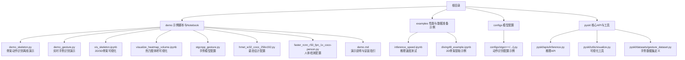
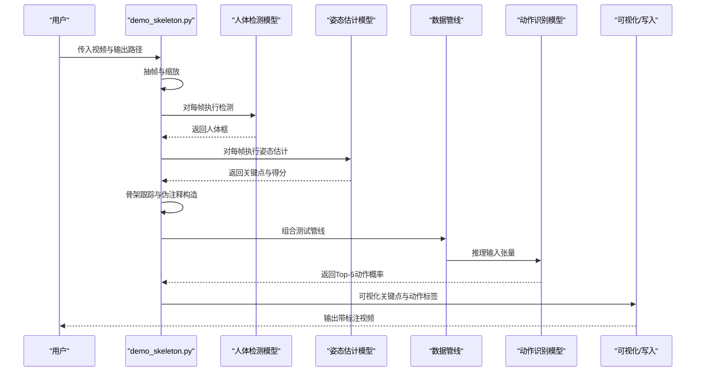
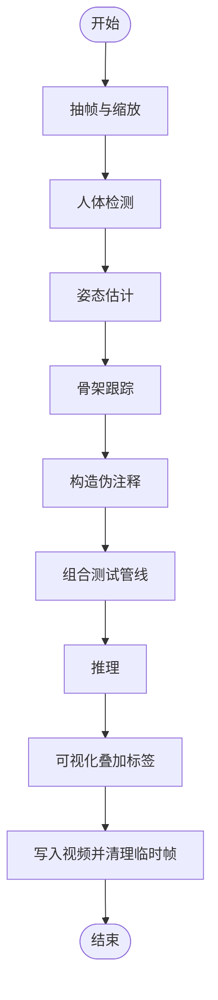
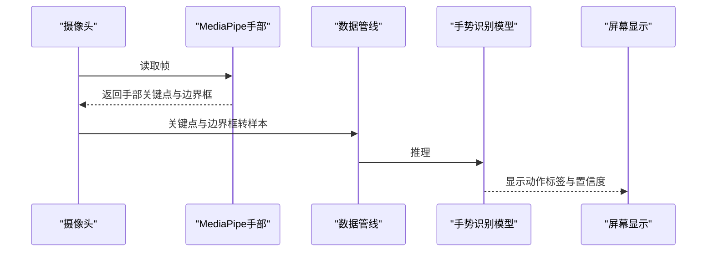
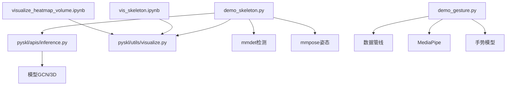

# 示例与演示

<cite>
**本文引用的文件**
- [demo_skeleton.py](file://demo/demo_skeleton.py)
- [demo_gesture.py](file://demo/demo_gesture.py)
- [demo.md](file://demo/demo.md)
- [inference_speed.ipynb](file://examples/inference_speed.ipynb)
- [vis_skeleton.ipynb](file://demo/vis_skeleton.ipynb)
- [visualize_heatmap_volume.ipynb](file://demo/visualize_heatmap_volume.ipynb)
- [stgcnpp_gesture.py](file://demo/stgcnpp_gesture.py)
- [hrnet_w32_coco_256x192.py](file://demo/hrnet_w32_coco_256x192.py)
- [faster_rcnn_r50_fpn_1x_coco-person.py](file://demo/faster_rcnn_r50_fpn_1x_coco-person.py)
- [stgcn++_ntu120_xsub_hrnet_j.py](file://configs/stgcn++/stgcn++_ntu120_xsub_hrnet/j.py)
- [inference.py](file://pyskl/apis/inference.py)
- [visualize.py](file://pyskl/utils/visualize.py)
- [gesture_dataset.py](file://pyskl/datasets/gesture_dataset.py)
- [diving48_example.ipynb](file://examples/extract_diving48_skeleton/diving48_example.ipynb)
</cite>

## 目录
1. [简介](#简介)
2. [项目结构](#项目结构)
3. [核心组件](#核心组件)
4. [架构总览](#架构总览)
5. [详细组件分析](#详细组件分析)
6. [依赖关系分析](#依赖关系分析)
7. [性能考量](#性能考量)
8. [故障排查指南](#故障排查指南)
9. [结论](#结论)
10. [附录](#附录)

## 简介
本指南面向PySKL示例与演示，围绕以下目标展开：  
- 骨架动作识别演示（离线GPU）：详解demo_skeleton.py的使用方法、参数配置与结果解读。  
- 实时手势识别演示（在线CPU）：解析demo_gesture.py的代码结构、实时处理流程与性能优化要点。  
- Jupyter Notebook示例：骨架可视化、热力图体积可视化等交互式演示的运行步骤。  
- 推理速度测试：inference_speed.ipynb的使用方法与性能基准参考。  
- 端到端使用案例：从数据准备到结果分析的完整流程。  
- 最佳实践与扩展建议：参数调优、模型切换、自定义修改与常见问题排查。

## 项目结构
本节聚焦与演示相关的目录与文件，便于快速定位与运行。

图表来源
- [demo_skeleton.py](file://demo/demo_skeleton.py#L1-L314)
- [demo_gesture.py](file://demo/demo_gesture.py#L1-L174)
- [vis_skeleton.ipynb](file://demo/vis_skeleton.ipynb#L1-L113)
- [visualize_heatmap_volume.ipynb](file://demo/visualize_heatmap_volume.ipynb#L1-L378)
- [inference_speed.ipynb](file://examples/inference_speed.ipynb#L1-L206)
- [stgcnpp_gesture.py](file://demo/stgcnpp_gesture.py#L1-L27)
- [hrnet_w32_coco_256x192.py](file://demo/hrnet_w32_coco_256x192.py#L1-L134)
- [faster_rcnn_r50_fpn_1x_coco-person.py](file://demo/faster_rcnn_r50_fpn_1x_coco-person.py#L1-L164)
- [stgcn++_ntu120_xsub_hrnet_j.py](file://configs/stgcn++/stgcn++_ntu120_xsub_hrnet/j.py#L1-L64)
- [inference.py](file://pyskl/apis/inference.py#L1-L184)
- [visualize.py](file://pyskl/utils/visualize.py#L1-L238)
- [gesture_dataset.py](file://pyskl/datasets/gesture_dataset.py#L1-L156)
- [diving48_example.ipynb](file://examples/extract_diving48_skeleton/diving48_example.ipynb#L1-L151)

章节来源
- [demo.md](file://demo/demo.md#L1-L42)

## 核心组件
- 骨架动作识别演示（demo_skeleton.py）
  - 功能：对视频进行人体检测、姿态估计、骨架跟踪与动作识别，输出带标注的视频。
  - 关键流程：视频抽帧 → 人体检测 → 姿态估计 → 骨架跟踪 → 构造伪注释 → 推理 → 可视化合成。
  - 参数要点：检测器与姿态估计器配置、阈值、设备、短边缩放、标签映射文件。
- 实时手势识别演示（demo_gesture.py）
  - 功能：通过摄像头实时捕获手部关键点，基于MediaPipe进行关键点提取与边界框生成，按帧或间隔帧进行手势分类。
  - 关键流程：摄像头读取 → MediaPipe手部检测 → 关键点与边界框提取 → 历史帧匹配与裁剪 → 数据管线转换 → 推理 → 结果叠加显示。
  - 参数要点：模型配置路径、权重路径、检测置信度、预测频率、颜色板。
- Jupyter Notebook可视化
  - vis_skeleton.ipynb：加载骨架注释，支持2D骨架与3D骨架的可视化播放。
  - visualize_heatmap_volume.ipynb：将骨架注释转换为伪热力图，展示关键点与肢体热力图序列。
- 推理速度测试（inference_speed.ipynb）
  - 功能：构建不同GCN与3D模型，固定输入形状进行预热与多次迭代，统计FPS。
  - 使用建议：根据硬件选择合适的批大小与序列长度，注意预热轮次设置。
- 推理API（pyskl/apis/inference.py）
  - 提供初始化模型与统一推理接口，支持字典输入、数组输入、视频路径、原始帧目录等多种输入形式。
- 可视化工具（pyskl/utils/visualize.py）
  - 提供2D骨架、3D骨架与布局可视化的工具类与动画生成。
- 手势数据集（pyskl/datasets/gesture_dataset.py）
  - 定义手势类别名称与评估指标，支持多类别准确率统计。

章节来源
- [demo_skeleton.py](file://demo/demo_skeleton.py#L58-L104)
- [demo_gesture.py](file://demo/demo_gesture.py#L83-L174)
- [inference.py](file://pyskl/apis/inference.py#L19-L54)
- [visualize.py](file://pyskl/utils/visualize.py#L41-L98)
- [gesture_dataset.py](file://pyskl/datasets/gesture_dataset.py#L25-L37)

## 架构总览
下图展示了骨架动作识别演示的整体流程与模块交互：

图表来源
- [demo_skeleton.py](file://demo/demo_skeleton.py#L227-L314)
- [inference.py](file://pyskl/apis/inference.py#L57-L184)

## 详细组件分析

### 骨架动作识别演示（demo_skeleton.py）
- 使用方法
  - 运行命令示例：参见演示说明文档中的命令片段。
  - 输入：视频文件或URL；输出：带动作标签的视频文件。
- 参数配置
  - 视频与输出：位置参数video与out_filename。
  - 模型配置：config（动作识别）、checkpoint（权重URL或本地路径）。
  - 人体检测：det-config与det-checkpoint（默认使用Faster-RCNN R50 FPN）。
  - 姿态估计：pose-config与pose-checkpoint（默认使用HRNet W32）。
  - 其他：det-score-thr（检测分数阈值）、label-map（标签映射文件）、device（CPU/GPU）、short-side（短边缩放）。
- 处理流程
  - 抽帧与缩放：按short-side调整分辨率，保存中间帧。
  - 人体检测：逐帧检测，过滤低分目标。
  - 姿态估计：Top-down方式估计关键点。
  - 骨架跟踪：基于帧间相似度的简单跟踪，维持最多N人。
  - 推理：构造fake_anno，去除Decompress操作，按GCN或非GCN分支组织输入。
  - 可视化：调用姿态可视化接口叠加关键点与动作标签，写入视频。
- 结果解读
  - 输出视频中每帧顶部显示识别动作标签；标签来自label_map映射。
  - 若未检测到有效骨架，将不显示动作标签。
- 性能优化建议
  - 调整short-side以平衡质量与速度。
  - 合理设置det-score-thr，减少无效检测带来的计算开销。
  - 在GPU上运行，确保显存充足；必要时降低序列长度或批大小。
  - 使用更轻量的检测/估计模型（需同步调整配置）。

图表来源
- [demo_skeleton.py](file://demo/demo_skeleton.py#L107-L139)
- [demo_skeleton.py](file://demo/demo_skeleton.py#L142-L180)
- [demo_skeleton.py](file://demo/demo_skeleton.py#L189-L224)
- [demo_skeleton.py](file://demo/demo_skeleton.py#L227-L314)

章节来源
- [demo_skeleton.py](file://demo/demo_skeleton.py#L58-L104)
- [demo_skeleton.py](file://demo/demo_skeleton.py#L107-L139)
- [demo_skeleton.py](file://demo/demo_skeleton.py#L142-L180)
- [demo_skeleton.py](file://demo/demo_skeleton.py#L189-L224)
- [demo_skeleton.py](file://demo/demo_skeleton.py#L227-L314)
- [demo.md](file://demo/demo.md#L17-L31)

### 实时手势识别演示（demo_gesture.py）
- 使用方法
  - 直接运行脚本，打开本机摄像头，实时显示手部关键点与预测结果。
  - 默认使用ST-GCN++（手势）模型与HaGRID数据集类别。
- 参数与配置
  - 模型配置：stgcnpp_gesture.py（定义图结构、特征与输入格式）。
  - 权重：hagrid.pth（默认路径）。
  - MediaPipe：单手检测，最小检测置信度、最大手数等。
  - 预测频率：predict_per_nframe控制每隔多少帧做一次推理。
- 处理流程
  - 摄像头读取图像 → MediaPipe处理 → 关键点与边界框提取 → 历史帧匹配与裁剪 → 数据管线转换 → 推理 → 结果叠加显示。
- 结果解读
  - 屏幕右上角显示最近若干帧的预测标签与置信度。
  - 无手或匹配失败时显示“未检测到手”提示。
- 性能优化建议
  - 适当提高predict_per_nframe以降低推理频率。
  - 降低输入分辨率或简化模型（需同步修改配置）。
  - 使用CPU时尽量减少同时运行的其他任务。

图表来源
- [demo_gesture.py](file://demo/demo_gesture.py#L83-L174)
- [stgcnpp_gesture.py](file://demo/stgcnpp_gesture.py#L1-L27)

章节来源
- [demo_gesture.py](file://demo/demo_gesture.py#L83-L174)
- [stgcnpp_gesture.py](file://demo/stgcnpp_gesture.py#L1-L27)
- [demo.md](file://demo/demo.md#L32-L42)

### Jupyter Notebook示例
- 骨架可视化（vis_skeleton.ipynb）
  - 下载注释文件（2D/3D），加载后通过Vis2DPose与Vis3DPose进行可视化。
  - 支持直接播放或嵌入Jupyter显示。
- 热力图体积可视化（visualize_heatmap_volume.ipynb）
  - 将骨架注释转换为伪关键点/肢体热力图，叠加动作标签后播放。
  - 提供骨架绘制与热力图渲染辅助函数。
- 使用步骤
  - 安装依赖后在Jupyter中依次执行单元格，下载所需资源并运行可视化。
  - 注意清理下载的视频与临时文件。

章节来源
- [vis_skeleton.ipynb](file://demo/vis_skeleton.ipynb#L1-L113)
- [visualize_heatmap_volume.ipynb](file://demo/visualize_heatmap_volume.ipynb#L1-L378)

### 推理速度测试（inference_speed.ipynb）
- 使用方法
  - 加载不同模型配置，构建模型并进入评测循环。
  - 设置批大小、预热轮次与迭代次数，统计FPS。
- 结果解读
  - 控制台打印各模型FPS，可用于不同硬件与模型的性能对比。
- 注意事项
  - 预热轮次应足够以消除冷启动影响。
  - 根据硬件选择合适的输入尺寸与批大小，避免显存溢出。

章节来源
- [inference_speed.ipynb](file://examples/inference_speed.ipynb#L1-L206)

### 推理API与可视化工具
- 推理API（pyskl/apis/inference.py）
  - 支持多种输入类型（字典、数组、视频路径、原始帧目录），自动适配解码与数据管线。
  - 返回Top-K结果与可选的中间特征。
- 可视化工具（pyskl/utils/visualize.py）
  - 提供2D骨架、3D骨架与布局可视化，支持动画生成与Jupyter内显示。

章节来源
- [inference.py](file://pyskl/apis/inference.py#L57-L184)
- [visualize.py](file://pyskl/utils/visualize.py#L101-L172)
- [visualize.py](file://pyskl/utils/visualize.py#L41-L98)

### 手势数据集与类别
- GestureDataset定义了手势类别名称列表，用于将模型输出索引映射到具体动作名称。
- 评估指标：Top-1与Top-5准确率，并支持按视频有效帧数分段统计。

章节来源
- [gesture_dataset.py](file://pyskl/datasets/gesture_dataset.py#L25-L37)
- [gesture_dataset.py](file://pyskl/datasets/gesture_dataset.py#L105-L156)

## 依赖关系分析
- 模块耦合
  - demo_skeleton.py依赖推理API与可视化工具，同时调用外部库（mmdet、mmpose）进行检测与姿态估计。
  - demo_gesture.py依赖MediaPipe与内部数据管线，将关键点转换为模型输入。
  - Notebook示例依赖可视化工具与注释文件。
- 外部依赖
  - mmdet、mmpose、mediapipe、moviepy、matplotlib等。
- 潜在风险
  - 版本不兼容可能导致导入失败；建议使用提供的环境配置文件创建虚拟环境。

图表来源
- [demo_skeleton.py](file://demo/demo_skeleton.py#L13-L43)
- [demo_gesture.py](file://demo/demo_gesture.py#L6-L9)
- [inference.py](file://pyskl/apis/inference.py#L19-L54)
- [visualize.py](file://pyskl/utils/visualize.py#L1-L238)

章节来源
- [demo_skeleton.py](file://demo/demo_skeleton.py#L13-L43)
- [demo_gesture.py](file://demo/demo_gesture.py#L6-L9)
- [inference.py](file://pyskl/apis/inference.py#L19-L54)
- [visualize.py](file://pyskl/utils/visualize.py#L1-L238)

## 性能考量
- 硬件选择
  - GPU优先：demo_skeleton.py默认在GPU上运行，显著提升整体吞吐。
  - CPU：demo_gesture.py为CPU实时演示，适合边缘设备或无GPU场景。
- 模型与输入
  - 适当降低输入分辨率或序列长度可提升速度。
  - 选择更轻量的检测/估计模型（如MobileNet系列）以换取精度损失换取速度。
- 预热与批大小
  - 合理设置预热轮次，避免首帧冷启动影响。
  - 批大小过大可能造成显存不足，需根据硬件动态调整。
- I/O与缓存
  - 将中间帧保存在SSD或内存盘，减少磁盘I/O瓶颈。
  - 使用预训练权重与缓存机制，避免重复下载。

## 故障排查指南
- 无法导入外部库
  - 症状：运行时报错提示无法导入mmdet/mmpose/mediapipe等。
  - 处理：按照演示说明安装对应依赖，或使用提供的环境配置文件创建并激活环境。
- 检测/估计模型初始化失败
  - 症状：提示无法构建检测或姿态模型。
  - 处理：确认已正确安装mmcv-full、mmdet、mmpose，并检查配置文件路径与权重URL可用性。
- 无动作标签显示
  - 症状：输出视频无动作标签。
  - 处理：检查骨架跟踪是否成功，det-score-thr是否过高导致无人体框被保留。
- 手势识别不稳定
  - 症状：频繁显示“未检测到手”或误判。
  - 处理：提高MediaPipe的最小检测置信度，或增大predict_per_nframe降低误触发。
- Notebook资源下载失败
  - 症状：下载注释文件或视频失败。
  - 处理：检查网络连接，或手动下载后放置到指定路径。

章节来源
- [demo.md](file://demo/demo.md#L5-L16)
- [demo_skeleton.py](file://demo/demo_skeleton.py#L15-L43)
- [demo_gesture.py](file://demo/demo_gesture.py#L83-L174)

## 结论
本指南系统梳理了PySKL的示例与演示，覆盖骨架动作识别、实时手势识别、可视化与性能测试等关键环节。通过合理配置参数、选择合适模型与硬件、遵循最佳实践，用户可在不同场景下高效完成从数据准备到结果分析的全流程任务。

## 附录
- 端到端使用案例（骨架动作识别）
  - 准备：确保环境与依赖已安装。
  - 运行：使用demo_skeleton.py对视频进行离线动作识别，输出带标签视频。
  - 结果：查看输出视频中的动作标签，必要时调整det-score-thr与short-side。
- 端到端使用案例（实时手势识别）
  - 准备：安装mediapipe，确保摄像头可用。
  - 运行：执行demo_gesture.py，观察屏幕上的实时预测结果。
  - 结果：根据需要调整predict_per_nframe与MediaPipe置信度。
- 数据准备示例（Diving48）
  - 参考diving48_example.ipynb，完成视频列表生成、骨架提取、注释合并与最终注释文件生成。

章节来源
- [demo.md](file://demo/demo.md#L17-L42)
- [diving48_example.ipynb](file://examples/extract_diving48_skeleton/diving48_example.ipynb#L1-L151)