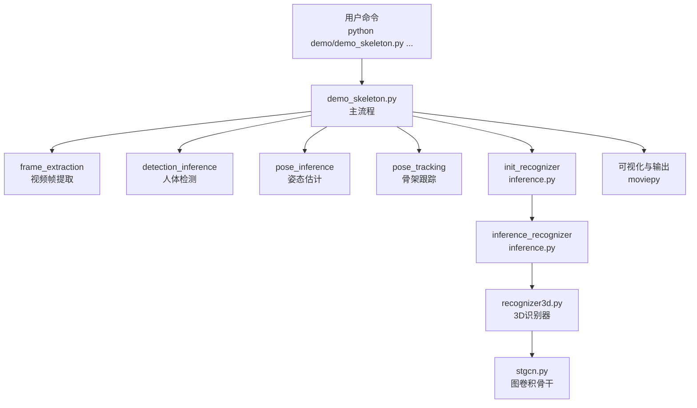
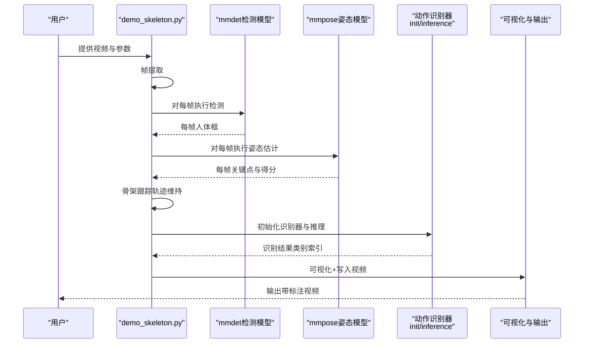
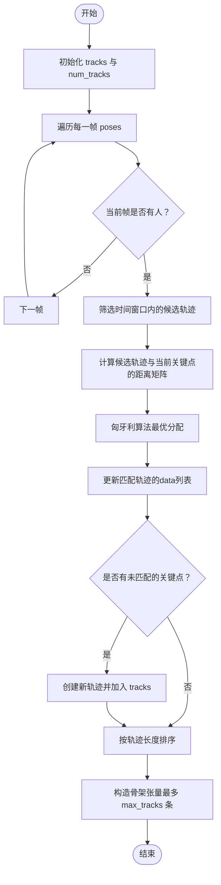
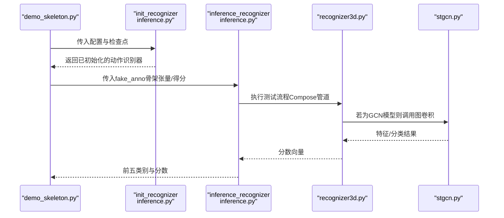
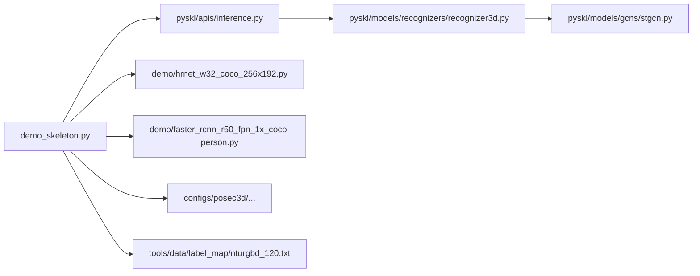

# 骨架动作识别演示

<cite>
**本文引用的文件**   
- [demo_skeleton.py](file://demo/demo_skeleton.py)
- [demo.md](file://demo/demo.md)
- [inference.py](file://pyskl/apis/inference.py)
- [pose_dataset.py](file://pyskl/datasets/pose_dataset.py)
- [recognizer3d.py](file://pyskl/models/recognizers/recognizer3d.py)
- [stgcn.py](file://pyskl/models/gcns/stgcn.py)
- [hrnet_w32_coco_256x192.py](file://demo/hrnet_w32_coco_256x192.py)
- [faster_rcnn_r50_fpn_1x_coco-person.py](file://demo/faster_rcnn_r50_fpn_1x_coco-person.py)
- [nturgbd_120.txt](file://tools/data/label_map/nturgbd_120.txt)
- [slowonly_r50_ntu60_xsub/joint.py](file://configs/posec3d/slowonly_r50_ntu60_xsub/joint.py)
- [slowonly_r50_ntu60_xsub/limb.py](file://configs/posec3d/slowonly_r50_ntu60_xsub/limb.py)
</cite>

## 目录
1. [简介](#简介)
2. [项目结构](#项目结构)
3. [核心组件](#核心组件)
4. [架构总览](#架构总览)
5. [详细组件分析](#详细组件分析)
6. [依赖关系分析](#依赖关系分析)
7. [性能考虑](#性能考虑)
8. [故障排查指南](#故障排查指南)
9. [结论](#结论)
10. [附录](#附录)

## 简介
本指南面向PySKL骨架动作识别演示，围绕demo_skeleton.py的完整实现进行深入讲解，覆盖从视频帧提取、人体检测、姿态估计、骨架跟踪到动作识别的端到端流程。文档同时提供命令行参数详解、骨架跟踪算法原理、使用示例、自定义配置与检查点方法、常见问题排查与性能优化建议，帮助用户快速上手并按需扩展。

## 项目结构
该演示位于demo目录下，配合若干配置文件与工具脚本，形成“离线GPU推理”的骨架动作识别流水线。关键文件与职责如下：
- demo_skeleton.py：演示入口，负责参数解析、帧提取、检测、姿态估计、骨架跟踪、动作识别、可视化与输出。
- demo.md：使用说明与示例命令。
- inference.py：初始化与推理接口（加载模型、执行推理）。
- pose_dataset.py：骨架数据集封装，支撑动作识别模型的数据格式要求。
- recognizer3d.py：3D识别器框架，用于骨架序列的分类或特征提取。
- stgcn.py：图卷积网络骨干（如ST-GCN），用于GCN类模型的骨架处理。
- hrnet_w32_coco_256x192.py：姿态估计配置（HRNet）。
- faster_rcnn_r50_fpn_1x_coco-person.py：人体检测配置（Faster R-CNN）。
- nturgbd_120.txt：动作类别标签映射。
- configs/posec3d/...：动作识别配置（如PoseC3D、ST-GCN++等）。

图表来源
- [demo_skeleton.py](file://demo/demo_skeleton.py#L227-L314)
- [inference.py](file://pyskl/apis/inference.py#L19-L54)
- [recognizer3d.py](file://pyskl/models/recognizers/recognizer3d.py#L9-L86)
- [stgcn.py](file://pyskl/models/gcns/stgcn.py#L56-L138)

章节来源
- [demo_skeleton.py](file://demo/demo_skeleton.py#L1-L314)
- [demo.md](file://demo/demo.md#L17-L41)

## 核心组件
- 参数解析与默认值：视频输入、输出文件名、动作识别配置、检查点、检测器配置与检查点、姿态估计配置与检查点、检测置信度阈值、标签映射、设备、短边长度等。
- 视频帧提取：读取视频，按短边缩放，保存为图像序列。
- 人体检测：基于mmdet的人体检测模型，过滤低分框。
- 姿态估计：基于mmpose的Top-down模型，输出每帧多人关键点及得分。
- 骨架跟踪：基于匈牙利算法的简单轨迹维持，以关键点二维坐标与深度差的综合距离度量。
- 动作识别：构建fake_anno，调用init_recognizer与inference_recognizer，结合标签映射输出动作类别。
- 可视化与输出：将每帧姿态可视化并叠加识别结果，生成视频文件。

章节来源
- [demo_skeleton.py](file://demo/demo_skeleton.py#L58-L104)
- [demo_skeleton.py](file://demo/demo_skeleton.py#L107-L139)
- [demo_skeleton.py](file://demo/demo_skeleton.py#L142-L180)
- [demo_skeleton.py](file://demo/demo_skeleton.py#L183-L225)
- [demo_skeleton.py](file://demo/demo_skeleton.py#L227-L314)

## 架构总览
下图展示从输入视频到输出带标注视频的端到端流程，以及各模块之间的依赖关系。

图表来源
- [demo_skeleton.py](file://demo/demo_skeleton.py#L227-L314)
- [inference.py](file://pyskl/apis/inference.py#L19-L54)
- [inference.py](file://pyskl/apis/inference.py#L57-L184)

## 详细组件分析

### 命令行参数与配置
- 视频输入与输出
  - video：输入视频文件或URL。
  - out_filename：输出视频文件路径。
- 动作识别配置与检查点
  - config：动作识别配置文件路径（如PoseC3D、ST-GCN++等）。
  - checkpoint：动作识别模型检查点文件或URL。
- 人体检测配置与检查点
  - det-config：检测器配置（来自mmdet）。
  - det-checkpoint：检测器检查点（来自mmdet）。
- 姿态估计配置与检查点
  - pose-config：姿态估计配置（来自mmpose）。
  - pose-checkpoint：姿态估计检查点（来自mmpose）。
- 检测置信度阈值
  - det-score-thr：过滤检测框的阈值，默认0.9。
- 标签映射
  - label-map：动作类别映射文件，默认指向NTU RGB+D 120类别。
- 设备与尺寸
  - device：设备选择（CPU/GPU），默认cuda:0。
  - short-side：帧缩放短边长度，默认480。
- 默认配置参考
  - 动作识别默认配置：configs/posec3d/slowonly_r50_ntu60_xsub/joint.py
  - 姿态估计默认配置：demo/hrnet_w32_coco_256x192.py
  - 人体检测默认配置：demo/faster_rcnn_r50_fpn_1x_coco-person.py
  - 标签映射默认：tools/data/label_map/nturgbd_120.txt

章节来源
- [demo_skeleton.py](file://demo/demo_skeleton.py#L58-L104)
- [demo.md](file://demo/demo.md#L23-L28)
- [slowonly_r50_ntu60_xsub/joint.py](file://configs/posec3d/slowonly_r50_ntu60_xsub/joint.py#L1-L80)
- [hrnet_w32_coco_256x192.py](file://demo/hrnet_w32_coco_256x192.py#L1-L134)
- [faster_rcnn_r50_fpn_1x_coco-person.py](file://demo/faster_rcnn_r50_fpn_1x_coco-person.py#L1-L164)
- [nturgbd_120.txt](file://tools/data/label_map/nturgbd_120.txt#L1-L121)

### 视频帧提取
- 功能：读取视频，按短边缩放，逐帧保存为图像序列，返回路径列表与原始帧数组。
- 关键点：统一短边尺寸，避免长宽比失真；逐帧写盘便于后续检测与姿态估计。

章节来源
- [demo_skeleton.py](file://demo/demo_skeleton.py#L107-L139)

### 人体检测
- 功能：初始化mmdet检测模型，遍历帧路径执行检测，过滤低于阈值的框。
- 关键点：要求检测器在COCO上训练且类别为“person”；阈值可调以平衡召回与误检。

章节来源
- [demo_skeleton.py](file://demo/demo_skeleton.py#L142-L165)
- [faster_rcnn_r50_fpn_1x_coco-person.py](file://demo/faster_rcnn_r50_fpn_1x_coco-person.py#L106-L106)

### 姿态估计
- 功能：初始化mmpose姿态模型，对每帧与对应检测框执行Top-down姿态估计，输出关键点与得分。
- 关键点：输入框格式与姿态模型配置需一致；输出关键点为二维坐标与置信度。

章节来源
- [demo_skeleton.py](file://demo/demo_skeleton.py#L168-L180)
- [hrnet_w32_coco_256x192.py](file://demo/hrnet_w32_coco_256x192.py#L105-L120)

### 骨架跟踪算法
- 目标：将多帧多目标的关键点组织为多条轨迹，形成固定人数×帧数×关节数×坐标的张量。
- 距离度量：对两帧同一人体的关键点，计算二维坐标欧氏距离（加权）与深度差的最大值之和，作为相似度的负函数。
- 轨迹维持：
  - 仅考虑与上一帧时间窗口内（thre）的候选轨迹。
  - 使用匈牙利算法求解最优分配，将当前帧中未匹配的关键点作为新轨迹起始。
  - 最终按轨迹长度排序，截取前max_tracks条作为最终骨架序列。

图表来源
- [demo_skeleton.py](file://demo/demo_skeleton.py#L189-L225)

章节来源
- [demo_skeleton.py](file://demo/demo_skeleton.py#L183-L225)

### 动作识别
- 初始化识别器：根据配置文件构建模型，加载检查点，设置设备并进入评估模式。
- 构造输入：根据是否使用GCN模型，构造不同形状的骨架张量与得分张量；非GCN场景默认COCO关键点数量为17。
- 推理：调用inference_recognizer执行测试流程，返回前五高分类别及其分数。
- 结果映射：依据标签映射文件将类别索引转换为人类可读的动作名称。

图表来源
- [demo_skeleton.py](file://demo/demo_skeleton.py#L227-L294)
- [inference.py](file://pyskl/apis/inference.py#L19-L54)
- [inference.py](file://pyskl/apis/inference.py#L57-L184)
- [recognizer3d.py](file://pyskl/models/recognizers/recognizer3d.py#L29-L86)
- [stgcn.py](file://pyskl/models/gcns/stgcn.py#L124-L137)

章节来源
- [demo_skeleton.py](file://demo/demo_skeleton.py#L227-L294)
- [inference.py](file://pyskl/apis/inference.py#L19-L54)
- [inference.py](file://pyskl/apis/inference.py#L57-L184)
- [recognizer3d.py](file://pyskl/models/recognizers/recognizer3d.py#L9-L86)
- [stgcn.py](file://pyskl/models/gcns/stgcn.py#L56-L138)

### 数据集与格式
- PoseDataset：骨架数据集封装，支持从pickle注释文件加载视频信息，按split切分数据，支持阈值过滤与缓存。
- 关键字段：frame_dir、total_frames、label、keypoint、keypoint_score等。
- 与动作识别的关系：动作识别配置中的数据管道会读取这些字段，生成模型所需的张量。

章节来源
- [pose_dataset.py](file://pyskl/datasets/pose_dataset.py#L10-L107)

### 示例命令与使用步骤
- 准备环境：安装mmcv-full、mmdet、mmpose与项目自身。
- 运行默认示例：使用NTU RGB+D 120的PoseC3D关节模态配置与检查点。
- 运行其他模型：切换到ST-GCN++等配置与检查点。
- 注意：任意视频输入需要轨迹维持（当前为基于相似度的简单跟踪）。

章节来源
- [demo.md](file://demo/demo.md#L17-L41)

## 依赖关系分析
- 外部依赖：mmdet（检测）、mmpose（姿态）、moviepy（视频写入）。
- 内部依赖：demo_skeleton.py依赖pyskl/apis/inference.py完成模型初始化与推理；若为GCN模型，还会调用stgcn.py的图卷积骨干；数据侧通过pose_dataset.py对接骨架数据格式。

图表来源
- [demo_skeleton.py](file://demo/demo_skeleton.py#L13-L13)
- [inference.py](file://pyskl/apis/inference.py#L13-L16)
- [recognizer3d.py](file://pyskl/models/recognizers/recognizer3d.py#L5-L6)
- [stgcn.py](file://pyskl/models/gcns/stgcn.py#L6-L8)

章节来源
- [demo_skeleton.py](file://demo/demo_skeleton.py#L13-L43)
- [inference.py](file://pyskl/apis/inference.py#L13-L16)
- [recognizer3d.py](file://pyskl/models/recognizers/recognizer3d.py#L5-L6)
- [stgcn.py](file://pyskl/models/gcns/stgcn.py#L6-L8)

## 性能考虑
- 帧缩放与批处理：短边缩放减少计算量；检测与姿态估计可利用GPU加速。
- 缓存与内存：推理后清空CUDA缓存有助于释放显存。
- 轨迹维持复杂度：距离矩阵大小随帧间人数变化，建议合理设置max_tracks与thre以控制复杂度。
- I/O开销：帧序列写盘与读取可能成为瓶颈，建议使用SSD或临时盘空间充足。
- 模型大小：不同配置（如PoseC3D vs ST-GCN++）在精度与速度上存在权衡，可根据需求选择。

章节来源
- [demo_skeleton.py](file://demo/demo_skeleton.py#L253-L256)
- [demo_skeleton.py](file://demo/demo_skeleton.py#L189-L225)

## 故障排查指南
- 无法导入mmdet/mmpose：确保已正确安装并可导入相应模块；否则演示会给出警告并限制部分功能。
- 检测器类别不匹配：检测器需在COCO上训练且类别为“person”，否则会断言失败。
- 检查点下载失败：确认checkpoint URL可达或本地路径有效；init_recognizer内部会缓存远程检查点。
- 姿态估计输出为空：降低det-score-thr或检查检测结果；确认姿态模型配置与输入框格式一致。
- 轨迹为空：检查pose_results是否为空，适当增大max_tracks或调整thre。
- 输出视频异常：确认moviepy可用；检查输出路径权限与磁盘空间。

章节来源
- [demo_skeleton.py](file://demo/demo_skeleton.py#L15-L43)
- [demo_skeleton.py](file://demo/demo_skeleton.py#L152-L155)
- [inference.py](file://pyskl/apis/inference.py#L48-L50)

## 结论
本演示提供了从视频到动作识别的完整链路，涵盖检测、姿态估计、骨架跟踪与识别四个阶段。通过灵活的命令行参数与配置文件，用户可以快速替换模型与数据集，满足不同任务需求。建议在实际部署时关注性能与稳定性，并根据数据特点调整阈值与轨迹策略。

## 附录

### 自定义配置与检查点
- 切换动作识别模型：修改--config与--checkpoint，例如使用ST-GCN++关节模态配置与对应检查点。
- 切换姿态估计模型：修改--pose-config与--pose-checkpoint，例如使用HRNet w32配置。
- 切换人体检测模型：修改--det-config与--det-checkpoint，例如使用Faster R-CNN R50 FPN配置。
- 标签映射：修改--label-map以适配自定义动作类别。

章节来源
- [demo_skeleton.py](file://demo/demo_skeleton.py#L62-L98)
- [demo.md](file://demo/demo.md#L23-L28)

### 数据集与模型适配要点
- 关节模态与肢体模态：配置文件中train/test pipeline差异体现在GeneratePoseTarget的with_kp与with_limb开关。
- GCN模型：需注意FormatGCNInput的num_person参数，影响每帧最大人数。
- NTU RGB+D 120：默认标签映射文件提供120个动作类别。

章节来源
- [slowonly_r50_ntu60_xsub/joint.py](file://configs/posec3d/slowonly_r50_ntu60_xsub/joint.py#L22-L58)
- [slowonly_r50_ntu60_xsub/limb.py](file://configs/posec3d/slowonly_r50_ntu60_xsub/limb.py#L22-L64)
- [nturgbd_120.txt](file://tools/data/label_map/nturgbd_120.txt#L1-L121)