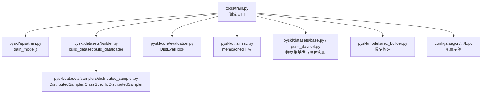
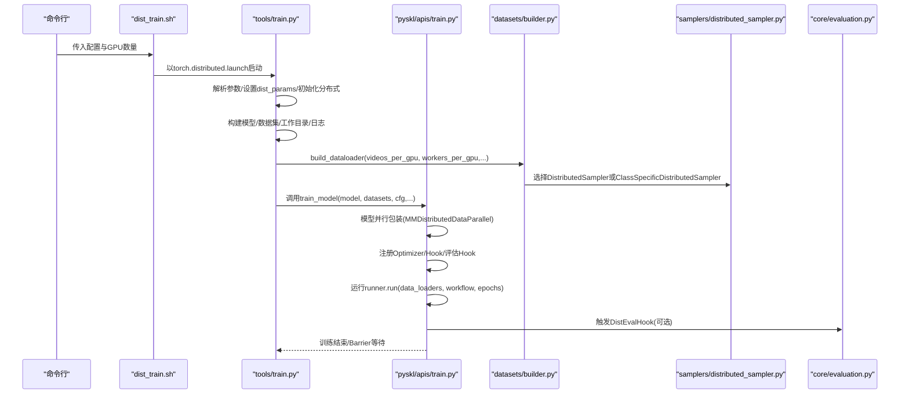
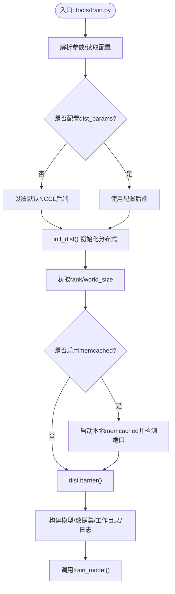
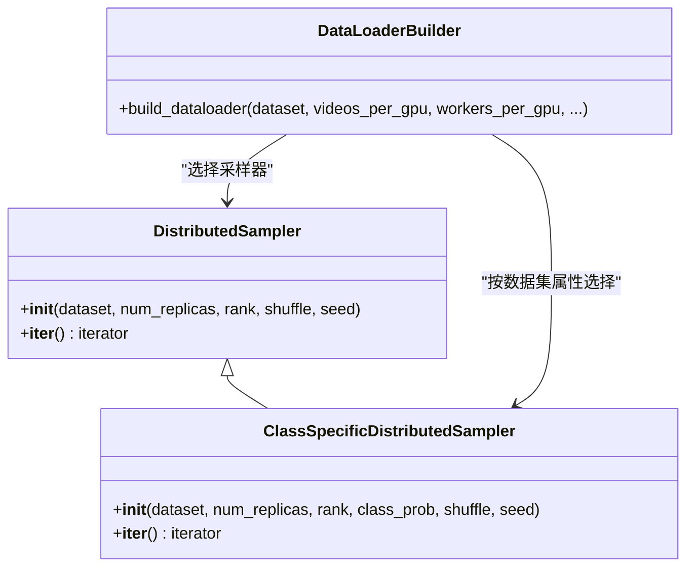
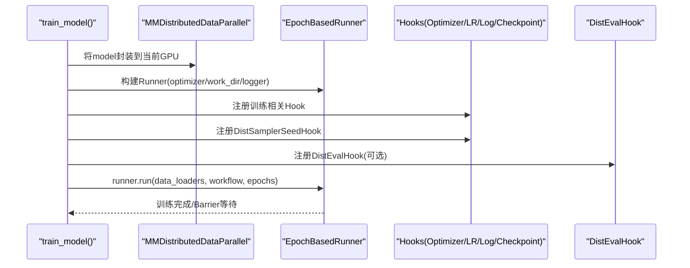
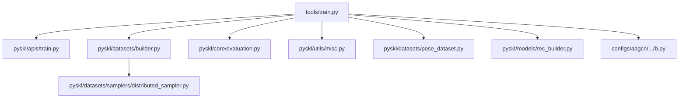

# 分布式训练支持

<cite>
**本文引用的文件**
- [pyskl/apis/train.py](file://pyskl/apis/train.py)
- [tools/train.py](file://tools/train.py)
- [tools/dist_train.sh](file://tools/dist_train.sh)
- [pyskl/datasets/samplers/distributed_sampler.py](file://pyskl/datasets/samplers/distributed_sampler.py)
- [pyskl/datasets/builder.py](file://pyskl/datasets/builder.py)
- [pyskl/utils/misc.py](file://pyskl/utils/misc.py)
- [pyskl/core/evaluation.py](file://pyskl/core/evaluation.py)
- [pyskl/datasets/base.py](file://pyskl/datasets/base.py)
- [pyskl/datasets/pose_dataset.py](file://pyskl/datasets/pose_dataset.py)
- [pyskl/models/rec_builder.py](file://pyskl/models/rec_builder.py)
- [configs/aagcn/aagcn_pyskl_ntu60_xsub_3dkp/b.py](file://configs/aagcn/aagcn_pyskl_ntu60_xsub_3dkp/b.py)
</cite>

## 目录
1. [简介](#简介)
2. [项目结构](#项目结构)
3. [核心组件](#核心组件)
4. [架构总览](#架构总览)
5. [详细组件分析](#详细组件分析)
6. [依赖关系分析](#依赖关系分析)
7. [性能考量](#性能考量)
8. [故障排查指南](#故障排查指南)
9. [结论](#结论)
10. [附录](#附录)

## 简介
本文件面向PySKL的分布式训练能力，系统性阐述其数据并行的实现方式、初始化流程、GPU资源与通信后端配置、多GPU训练参数设置、脚本使用方法、性能优化策略以及常见问题的诊断与修复。文档严格基于仓库源码进行分析，帮助读者快速掌握如何在PySKL上开展高效稳定的分布式训练。

## 项目结构
围绕分布式训练的关键目录与文件如下：
- 启动与初始化：tools/train.py、tools/dist_train.sh
- 训练主流程：pyskl/apis/train.py
- 数据采样与加载：pyskl/datasets/builder.py、pyskl/datasets/samplers/distributed_sampler.py
- 评估与日志：pyskl/core/evaluation.py
- 数据集基类与具体数据集：pyskl/datasets/base.py、pyskl/datasets/pose_dataset.py
- 模型构建：pyskl/models/rec_builder.py
- 配置示例：configs/aagcn/aagcn_pyskl_ntu60_xsub_3dkp/b.py

**图示来源**
- [tools/train.py](file://tools/train.py#L60-L164)
- [pyskl/apis/train.py](file://pyskl/apis/train.py#L50-L144)
- [pyskl/datasets/builder.py](file://pyskl/datasets/builder.py#L31-L124)
- [pyskl/datasets/samplers/distributed_sampler.py](file://pyskl/datasets/samplers/distributed_sampler.py#L8-L111)
- [pyskl/core/evaluation.py](file://pyskl/core/evaluation.py#L6-L37)
- [pyskl/utils/misc.py](file://pyskl/utils/misc.py#L18-L94)
- [pyskl/datasets/base.py](file://pyskl/datasets/base.py#L19-L354)
- [pyskl/datasets/pose_dataset.py](file://pyskl/datasets/pose_dataset.py#L10-L107)
- [pyskl/models/rec_builder.py](file://pyskl/models/rec_builder.py)
- [configs/aagcn/aagcn_pyskl_ntu60_xsub_3dkp/b.py](file://configs/aagcn/aagcn_pyskl_ntu60_xsub_3dkp/b.py#L1-L61)

**章节来源**
- [tools/train.py](file://tools/train.py#L60-L164)
- [pyskl/apis/train.py](file://pyskl/apis/train.py#L50-L144)
- [pyskl/datasets/builder.py](file://pyskl/datasets/builder.py#L31-L124)
- [pyskl/datasets/samplers/distributed_sampler.py](file://pyskl/datasets/samplers/distributed_sampler.py#L8-L111)
- [pyskl/core/evaluation.py](file://pyskl/core/evaluation.py#L6-L37)
- [pyskl/utils/misc.py](file://pyskl/utils/misc.py#L18-L94)
- [pyskl/datasets/base.py](file://pyskl/datasets/base.py#L19-L354)
- [pyskl/datasets/pose_dataset.py](file://pyskl/datasets/pose_dataset.py#L10-L107)
- [pyskl/models/rec_builder.py](file://pyskl/models/rec_builder.py)
- [configs/aagcn/aagcn_pyskl_ntu60_xsub_3dkp/b.py](file://configs/aagcn/aagcn_pyskl_ntu60_xsub_3dkp/b.py#L1-L61)

## 核心组件
- 分布式训练入口与初始化：tools/train.py负责解析参数、初始化分布式后端、设置随机种子、构建模型与数据集，并调用训练主流程。
- 训练主流程：pyskl/apis/train.py封装了数据加载、模型并行包装、Runner构建、优化器与Hook注册、评估Hook注册、断点/预训练权重加载、运行训练循环等。
- 数据采样与加载：pyskl/datasets/builder.py根据是否具备类别概率配置选择标准或类别特定的分布式采样器；并为每个GPU创建独立DataLoader。
- 分布式采样器：pyskl/datasets/samplers/distributed_sampler.py提供标准分布式采样与类别特定采样，确保各进程数据不重叠且可复现。
- 评估与日志：pyskl/core/evaluation.py提供分布式评估Hook，支持按区间调整评估频率与最佳模型保存策略。
- 数据集与缓存：pyskl/datasets/base.py与pose_dataset.py定义数据集基类与姿态数据集，支持memcached缓存以降低I/O开销。
- 工具与辅助：pyskl/utils/misc.py提供memcached启停、端口检测、根日志器等实用功能。
- 配置示例：configs/aagcn/.../b.py展示典型配置项，包括batch size、学习率调度、工作目录等。

**章节来源**
- [tools/train.py](file://tools/train.py#L60-L164)
- [pyskl/apis/train.py](file://pyskl/apis/train.py#L50-L144)
- [pyskl/datasets/builder.py](file://pyskl/datasets/builder.py#L48-L124)
- [pyskl/datasets/samplers/distributed_sampler.py](file://pyskl/datasets/samplers/distributed_sampler.py#L8-L111)
- [pyskl/core/evaluation.py](file://pyskl/core/evaluation.py#L6-L37)
- [pyskl/datasets/base.py](file://pyskl/datasets/base.py#L19-L354)
- [pyskl/datasets/pose_dataset.py](file://pyskl/datasets/pose_dataset.py#L10-L107)
- [pyskl/utils/misc.py](file://pyskl/utils/misc.py#L18-L94)
- [configs/aagcn/aagcn_pyskl_ntu60_xsub_3dkp/b.py](file://configs/aagcn/aagcn_pyskl_ntu60_xsub_3dkp/b.py#L1-L61)

## 架构总览
分布式训练采用“单机多卡”数据并行范式：每个GPU拥有独立的DataLoader与模型副本，通过分布式后端进行梯度同步与全局状态协调。训练主流程在各进程中并行推进，评估在指定周期触发，日志与检查点由根进程汇总记录。

**图示来源**
- [tools/dist_train.sh](file://tools/dist_train.sh#L1-L12)
- [tools/train.py](file://tools/train.py#L60-L164)
- [pyskl/apis/train.py](file://pyskl/apis/train.py#L50-L144)
- [pyskl/datasets/builder.py](file://pyskl/datasets/builder.py#L48-L124)
- [pyskl/datasets/samplers/distributed_sampler.py](file://pyskl/datasets/samplers/distributed_sampler.py#L8-L111)
- [pyskl/core/evaluation.py](file://pyskl/core/evaluation.py#L6-L37)

## 详细组件分析

### 分布式初始化与进程组创建
- 初始化流程
  - 解析启动参数，设置工作目录、日志文件、随机种子。
  - 若未显式配置分布式参数，则默认使用NCCL后端。
  - 调用分布式初始化函数，随后获取rank与world_size。
  - 在根进程上可选启动memcached服务并进行端口检测。
  - 所有进程在barrier处同步，确保后续步骤一致性。
- 进程组与GPU分配
  - 通过torch.distributed.launch按GPU数量创建进程组。
  - 每个进程绑定到当前设备（CUDA），模型并行包装时指定device_ids为当前进程所用GPU。
- 通信后端选择
  - 默认NCCL，适用于NVIDIA GPU；可通过配置dist_params覆盖。

**图示来源**
- [tools/train.py](file://tools/train.py#L60-L164)

**章节来源**
- [tools/train.py](file://tools/train.py#L60-L164)

### 数据并行与分布式采样
- 数据并行
  - 每个GPU拥有独立DataLoader，batch size由videos_per_gpu决定。
  - 训练时，每个进程独立前向/反向传播，梯度在优化器步进前进行同步（由Runner与优化器Hook负责）。
- 分布式采样器
  - 标准分布式采样：将数据集索引集扩展为可整除world_size的大小，再按rank切分，保证各进程样本不重复。
  - 类别特定采样：当数据集提供class_prob时，按类别权重重采样，提升稀有类样本比例，同时保持分布式切分。
- 数据加载器
  - 通过build_dataloader为每个GPU创建DataLoader，支持持久化工作进程、锁页内存、自定义collate等。

**图示来源**
- [pyskl/datasets/samplers/distributed_sampler.py](file://pyskl/datasets/samplers/distributed_sampler.py#L8-L111)
- [pyskl/datasets/builder.py](file://pyskl/datasets/builder.py#L48-L124)

**章节来源**
- [pyskl/datasets/builder.py](file://pyskl/datasets/builder.py#L48-L124)
- [pyskl/datasets/samplers/distributed_sampler.py](file://pyskl/datasets/samplers/distributed_sampler.py#L8-L111)

### 训练主流程与模型并行包装
- 模型并行包装
  - 使用MMDistributedDataParallel将模型封装到当前设备，并关闭broadcast_buffers以减少通信开销。
  - find_unused_parameters可按需开启，用于处理部分分支未参与反向的网络结构。
- Runner与Hook
  - 基于EpochBasedRunner构建训练循环，注册学习率、优化器、日志、检查点等Hook。
  - 注册DistSamplerSeedHook以确保每轮采样随机种子一致。
- 评估Hook
  - 可选注册DistEvalHook，在指定周期对验证集进行分布式评估，并按指标保存最佳模型。

**图示来源**
- [pyskl/apis/train.py](file://pyskl/apis/train.py#L90-L121)
- [pyskl/core/evaluation.py](file://pyskl/core/evaluation.py#L6-L37)

**章节来源**
- [pyskl/apis/train.py](file://pyskl/apis/train.py#L90-L121)
- [pyskl/core/evaluation.py](file://pyskl/core/evaluation.py#L6-L37)

### 多GPU训练配置要点
- GPU数量设置
  - 通过dist_train.sh的nproc_per_node参数指定每台机器的GPU数量。
- 内存管理
  - workers_per_gpu与videos_per_gpu共同决定每GPU显存占用；可结合pin_memory与persistent_workers优化吞吐。
  - 可选启用memcached缓存关键数据，降低I/O瓶颈。
- 梯度同步机制
  - 由Runner与优化器Hook负责在每次优化步前进行梯度同步与裁剪，确保全局一致性。
- 断点与预训练
  - 自动检测latest.pth进行断点续训；支持从远程URL缓存下载预训练权重。

**章节来源**
- [tools/dist_train.sh](file://tools/dist_train.sh#L1-L12)
- [tools/train.py](file://tools/train.py#L60-L164)
- [pyskl/utils/misc.py](file://pyskl/utils/misc.py#L18-L94)
- [pyskl/apis/train.py](file://pyskl/apis/train.py#L138-L143)

### 分布式训练脚本使用方法
- 启动训练
  - 使用dist_train.sh传入配置文件与GPU数量，内部通过torch.distributed.launch启动多进程。
- 启动参数与环境变量
  - 支持--validate/--test-last/--test-best/--seed/--deterministic/--launcher/--compile等参数。
  - LOCAL_RANK会自动注入环境变量，便于底层框架识别本地GPU。
- 故障恢复机制
  - 自动寻找latest.pth进行断点恢复；若无则从load_from加载预训练权重。
  - barrier同步确保各进程在关键阶段保持一致。

**章节来源**
- [tools/dist_train.sh](file://tools/dist_train.sh#L1-L12)
- [tools/train.py](file://tools/train.py#L22-L57)
- [tools/train.py](file://tools/train.py#L82-L87)
- [pyskl/apis/train.py](file://pyskl/apis/train.py#L138-L143)

### 性能优化建议
- 梯度同步与通信
  - 使用NCCL后端（默认）；确保网络拓扑良好，避免跨节点高延迟。
  - 合理设置find_unused_parameters以平衡稳定性与性能。
- 批量大小与数据加载
  - videos_per_gpu与workers_per_gpu按显存与CPU核数权衡；开启persistent_workers减少epoch切换开销。
  - 使用锁页内存（pin_memory）提升主机到GPU的数据搬运效率。
- 数据均衡与采样
  - 当存在类别不平衡时，利用PoseDataset的class_prob进行重采样，提高稀有类可见度。
- 缓存与I/O
  - 在具备大容量内存的节点上启用memcached，显著降低频繁读取pickle标注文件的开销。
- 模型编译
  - PyTorch 2.0及以上可启用torch.compile以获得静态图优化收益（仅限支持版本）。

**章节来源**
- [pyskl/datasets/builder.py](file://pyskl/datasets/builder.py#L48-L124)
- [pyskl/datasets/samplers/distributed_sampler.py](file://pyskl/datasets/samplers/distributed_sampler.py#L45-L111)
- [pyskl/utils/misc.py](file://pyskl/utils/misc.py#L18-L94)
- [tools/train.py](file://tools/train.py#L121-L124)

### 调试方法与常见问题
- 通信超时/连接失败
  - 检查MASTER_PORT是否被占用，dist_train.sh已随机分配端口，必要时可手动指定。
  - 确认防火墙放行端口；在多机场景下确保节点间网络连通。
- 内存不足
  - 降低videos_per_gpu或workers_per_gpu；关闭不必要的持久化工作进程。
  - 启用memcached缓存，减少重复I/O。
- 数据不均衡
  - 在数据集配置中提供class_prob，配合ClassSpecificDistributedSampler实现重采样。
- 随机性与可复现
  - 设置--seed与--deterministic；根进程广播随机种子，确保各进程一致。
- 评估不稳定
  - 调整DistEvalHook的评估间隔与save_best策略，避免过于频繁的评估影响吞吐。

**章节来源**
- [tools/dist_train.sh](file://tools/dist_train.sh#L1-L12)
- [tools/train.py](file://tools/train.py#L141-L160)
- [pyskl/datasets/samplers/distributed_sampler.py](file://pyskl/datasets/samplers/distributed_sampler.py#L45-L111)
- [pyskl/apis/train.py](file://pyskl/apis/train.py#L17-L47)

## 依赖关系分析
- 组件耦合
  - tools/train.py是入口，依赖分布式初始化、模型构建、数据集构建与训练主流程。
  - train_model()依赖MMDistributedDataParallel、Runner与各类Hook。
  - 数据加载依赖分布式采样器与数据集基类。
- 外部依赖
  - torch.distributed、mmcv.engine/parallel/runner、pymemcache等。
- 潜在风险
  - 若未正确设置find_unused_parameters，可能引发unused parameters警告或运行时错误。
  - memcached未就绪会导致数据加载阻塞，应先检测端口再进入训练。

**图示来源**
- [tools/train.py](file://tools/train.py#L60-L164)
- [pyskl/apis/train.py](file://pyskl/apis/train.py#L50-L144)
- [pyskl/datasets/builder.py](file://pyskl/datasets/builder.py#L31-L124)
- [pyskl/datasets/samplers/distributed_sampler.py](file://pyskl/datasets/samplers/distributed_sampler.py#L8-L111)
- [pyskl/core/evaluation.py](file://pyskl/core/evaluation.py#L6-L37)
- [pyskl/utils/misc.py](file://pyskl/utils/misc.py#L18-L94)
- [pyskl/datasets/pose_dataset.py](file://pyskl/datasets/pose_dataset.py#L10-L107)
- [pyskl/models/rec_builder.py](file://pyskl/models/rec_builder.py)
- [configs/aagcn/aagcn_pyskl_ntu60_xsub_3dkp/b.py](file://configs/aagcn/aagcn_pyskl_ntu60_xsub_3dkp/b.py#L1-L61)

**章节来源**
- [tools/train.py](file://tools/train.py#L60-L164)
- [pyskl/apis/train.py](file://pyskl/apis/train.py#L50-L144)
- [pyskl/datasets/builder.py](file://pyskl/datasets/builder.py#L31-L124)
- [pyskl/datasets/samplers/distributed_sampler.py](file://pyskl/datasets/samplers/distributed_sampler.py#L8-L111)
- [pyskl/core/evaluation.py](file://pyskl/core/evaluation.py#L6-L37)
- [pyskl/utils/misc.py](file://pyskl/utils/misc.py#L18-L94)
- [pyskl/datasets/pose_dataset.py](file://pyskl/datasets/pose_dataset.py#L10-L107)
- [pyskl/models/rec_builder.py](file://pyskl/models/rec_builder.py)
- [configs/aagcn/aagcn_pyskl_ntu60_xsub_3dkp/b.py](file://configs/aagcn/aagcn_pyskl_ntu60_xsub_3dkp/b.py#L1-L61)

## 性能考量
- 通信后端与拓扑
  - NCCL在NVIDIA GPU上表现优异；多机场景需关注交换机与网卡带宽。
- 数据加载与内存
  - 合理设置workers_per_gpu与videos_per_gpu；开启pin_memory与persistent_workers可提升吞吐。
- 采样策略
  - 类别特定采样有助于提升稀有类的训练效果，但需注意整体样本量变化。
- 缓存策略
  - memcached适合大规模标注文件的热数据缓存，显著降低I/O等待。
- 模型优化
  - 在支持的PyTorch版本启用torch.compile以获得静态图优化收益。

[本节为通用指导，无需列出具体文件来源]

## 故障排查指南
- 通信超时
  - 更换MASTER_PORT或检查防火墙；确认节点间网络连通。
- 内存不足
  - 降低batch size与worker数；启用memcached；关闭不必要的持久化。
- 数据不均衡
  - 在数据集配置中设置class_prob；使用ClassSpecificDistributedSampler。
- 随机性与可复现
  - 设置--seed与--deterministic；确保根进程广播随机种子。
- 评估异常
  - 调整DistEvalHook的评估间隔；检查指标配置与数据集长度一致性。

**章节来源**
- [tools/dist_train.sh](file://tools/dist_train.sh#L1-L12)
- [tools/train.py](file://tools/train.py#L141-L160)
- [pyskl/datasets/samplers/distributed_sampler.py](file://pyskl/datasets/samplers/distributed_sampler.py#L45-L111)
- [pyskl/apis/train.py](file://pyskl/apis/train.py#L17-L47)

## 结论
PySKL的分布式训练以数据并行为核心，结合标准分布式采样器、模型并行包装与完善的Hook体系，提供了稳定高效的训练体验。通过合理配置GPU数量、内存参数、采样策略与缓存机制，可在保证收敛质量的同时最大化吞吐。遇到通信、内存或数据不均衡问题时，可依据本文提供的排查清单逐项定位并解决。

[本节为总结性内容，无需列出具体文件来源]

## 附录
- 配置示例字段说明（来自配置文件）
  - model：模型类型、backbone与head配置。
  - data：videos_per_gpu、workers_per_gpu、train/val/test数据集与流水线。
  - optimizer/optimizer_config：优化器类型、学习率策略、梯度裁剪等。
  - lr_config/checkpoint_config/evaluation/log_config：学习率调度、检查点、评估与日志配置。
  - work_dir/log_level：工作目录与日志级别。

**章节来源**
- [configs/aagcn/aagcn_pyskl_ntu60_xsub_3dkp/b.py](file://configs/aagcn/aagcn_pyskl_ntu60_xsub_3dkp/b.py#L1-L61)