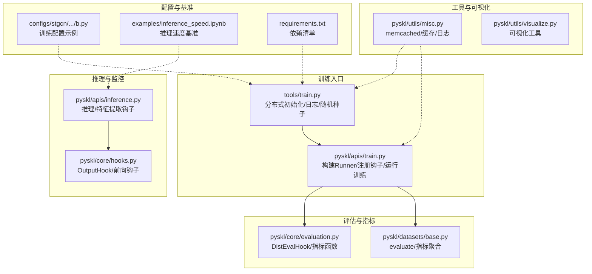
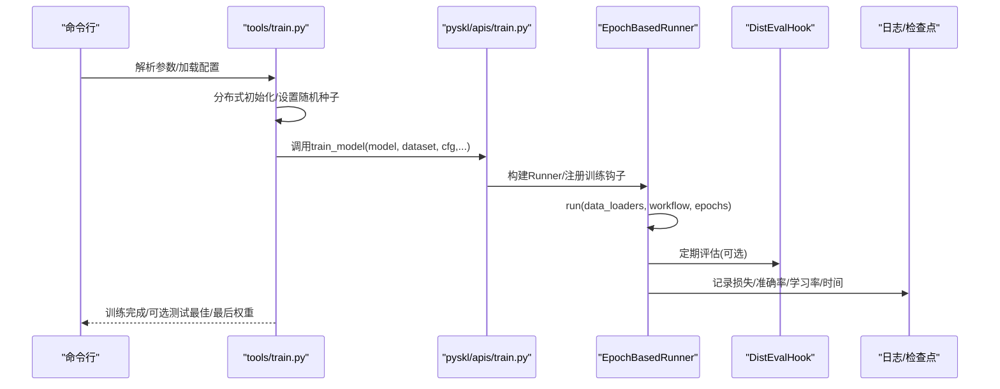
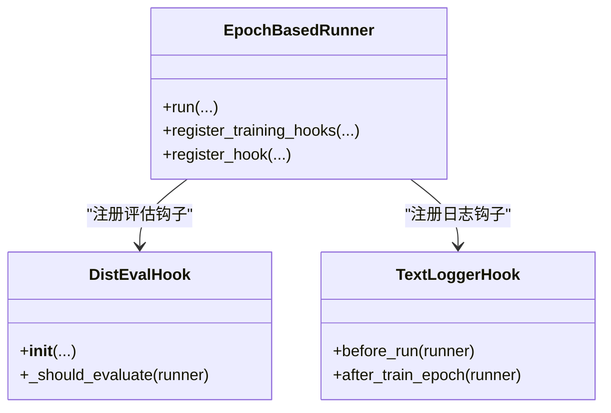
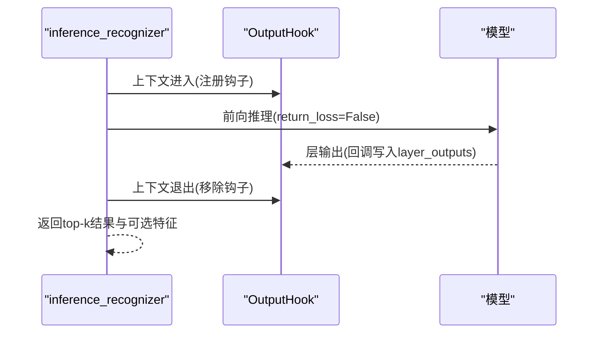
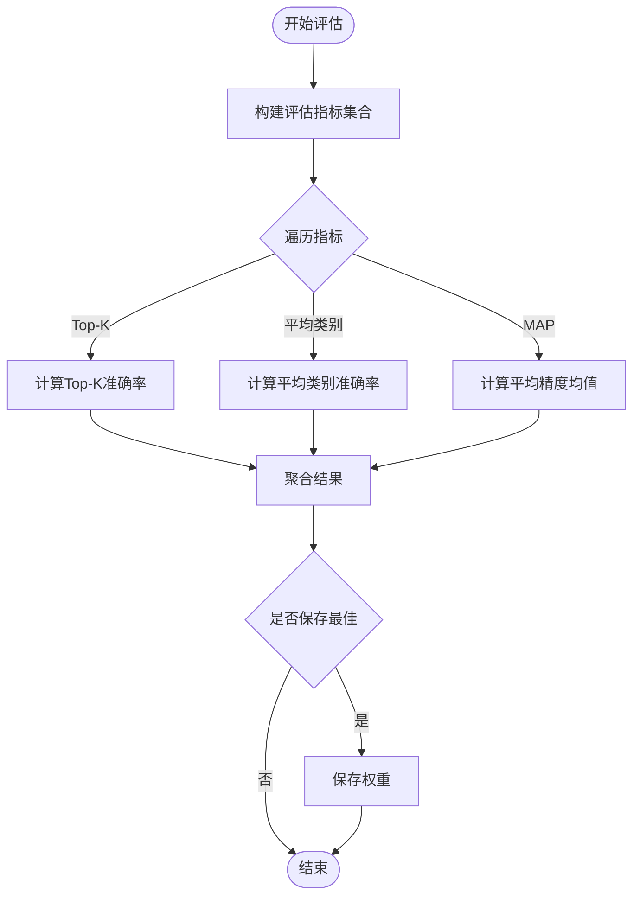
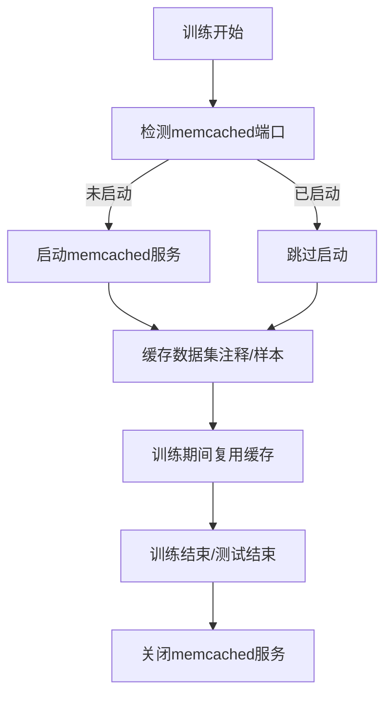
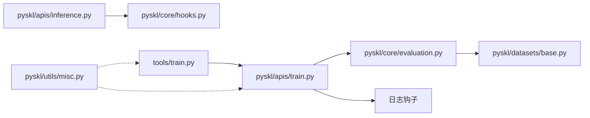

# 性能监控与优化

<cite>
**本文引用的文件**
- [pyskl/apis/train.py](file://pyskl/apis/train.py)
- [pyskl/apis/inference.py](file://pyskl/apis/inference.py)
- [tools/train.py](file://tools/train.py)
- [tools/test.py](file://tools/test.py)
- [pyskl/core/hooks.py](file://pyskl/core/hooks.py)
- [pyskl/core/evaluation.py](file://pyskl/core/evaluation.py)
- [pyskl/datasets/base.py](file://pyskl/datasets/base.py)
- [pyskl/utils/misc.py](file://pyskl/utils/misc.py)
- [pyskl/utils/visualize.py](file://pyskl/utils/visualize.py)
- [examples/inference_speed.ipynb](file://examples/inference_speed.ipynb)
- [configs/stgcn/stgcn_pyskl_ntu60_xsub_3dkp/b.py](file://configs/stgcn/stgcn_pyskl_ntu60_xsub_3dkp/b.py)
- [requirements.txt](file://requirements.txt)
</cite>

## 目录
1. [简介](#简介)
2. [项目结构](#项目结构)
3. [核心组件](#核心组件)
4. [架构总览](#架构总览)
5. [详细组件分析](#详细组件分析)
6. [依赖关系分析](#依赖关系分析)
7. [性能考量](#性能考量)
8. [故障排查指南](#故障排查指南)
9. [结论](#结论)
10. [附录](#附录)

## 简介
本文件面向PySKL的性能监控与优化，聚焦训练过程中的关键指标采集与可视化（损失、准确率、内存、GPU利用率等），训练钩子系统的应用（定期检查点、学习率调度、评估钩子等），以及优化策略（学习率调度、梯度裁剪、混合精度、梯度累积等）。同时提供瓶颈识别方法、调优技巧与基准测试实践，帮助用户在不同硬件与配置下获得稳定且高效的训练体验。

## 项目结构
- 训练入口与流程控制：tools/train.py、pyskl/apis/train.py
- 推理与特征提取：pyskl/apis/inference.py、pyskl/core/hooks.py
- 评估与指标：pyskl/core/evaluation.py、pyskl/datasets/base.py
- 工具与可视化：pyskl/utils/misc.py、pyskl/utils/visualize.py
- 配置示例：configs/stgcn/stgcn_pyskl_ntu60_xsub_3dkp/b.py
- 基准测试：examples/inference_speed.ipynb
- 依赖：requirements.txt

**图表来源**
- [tools/train.py](file://tools/train.py#L60-L165)
- [pyskl/apis/train.py](file://pyskl/apis/train.py#L50-L144)
- [pyskl/apis/inference.py](file://pyskl/apis/inference.py#L19-L184)
- [pyskl/core/hooks.py](file://pyskl/core/hooks.py#L7-L67)
- [pyskl/core/evaluation.py](file://pyskl/core/evaluation.py#L6-L37)
- [pyskl/datasets/base.py](file://pyskl/datasets/base.py#L112-L234)
- [pyskl/utils/misc.py](file://pyskl/utils/misc.py#L18-L131)
- [pyskl/utils/visualize.py](file://pyskl/utils/visualize.py#L1-L238)
- [configs/stgcn/stgcn_pyskl_ntu60_xsub_3dkp/b.py](file://configs/stgcn/stgcn_pyskl_ntu60_xsub_3dkp/b.py#L1-L61)
- [examples/inference_speed.ipynb](file://examples/inference_speed.ipynb#L1-L206)
- [requirements.txt](file://requirements.txt#L1-L14)

**章节来源**
- [tools/train.py](file://tools/train.py#L60-L165)
- [pyskl/apis/train.py](file://pyskl/apis/train.py#L50-L144)
- [configs/stgcn/stgcn_pyskl_ntu60_xsub_3dkp/b.py](file://configs/stgcn/stgcn_pyskl_ntu60_xsub_3dkp/b.py#L1-L61)

## 核心组件
- 训练入口与Runner：tools/train.py负责分布式初始化、工作目录与日志、随机种子设置；pyskl/apis/train.py构建分布式模型、Runner、注册训练钩子，并驱动训练循环。
- 推理与特征监控：pyskl/apis/inference.py通过OutputHook在推理阶段抽取指定层的特征图，便于中间层行为分析与可视化。
- 评估与指标：pyskl/core/evaluation.py提供DistEvalHook与多种指标函数；pyskl/datasets/base.py的evaluate方法统一聚合指标。
- 工具与缓存：pyskl/utils/misc.py提供memcached启动/关闭、缓存检查点、端口探测与根日志器；用于缓解数据加载延迟。
- 可视化：pyskl/utils/visualize.py提供骨架/布局/热力图等可视化能力，辅助调试与展示。
- 基准测试：examples/inference_speed.ipynb提供推理速度测试模板，便于对比不同模型与设备的吞吐。

**章节来源**
- [pyskl/apis/train.py](file://pyskl/apis/train.py#L50-L144)
- [pyskl/apis/inference.py](file://pyskl/apis/inference.py#L57-L184)
- [pyskl/core/evaluation.py](file://pyskl/core/evaluation.py#L6-L37)
- [pyskl/datasets/base.py](file://pyskl/datasets/base.py#L112-L234)
- [pyskl/utils/misc.py](file://pyskl/utils/misc.py#L18-L131)
- [pyskl/utils/visualize.py](file://pyskl/utils/visualize.py#L1-L238)
- [examples/inference_speed.ipynb](file://examples/inference_speed.ipynb#L1-L206)

## 架构总览
训练从tools/train.py开始，经由pyskl/apis/train.py构建分布式Runner并注册各类训练钩子（学习率、优化器、检查点、日志、动量等），在训练过程中通过日志与评估钩子记录损失与准确率等指标；推理阶段可通过OutputHook抽取中间特征进行分析与可视化。

**图表来源**
- [tools/train.py](file://tools/train.py#L60-L165)
- [pyskl/apis/train.py](file://pyskl/apis/train.py#L50-L144)
- [pyskl/core/evaluation.py](file://pyskl/core/evaluation.py#L6-L37)

## 详细组件分析

### 训练钩子系统与指标采集
- 注册钩子：pyskl/apis/train.py在构建Runner后，通过register_training_hooks注册学习率、优化器、检查点、日志与动量等钩子，确保训练过程的关键事件被记录。
- 评估钩子：当启用验证时，构建DistEvalHook并在runner中注册，周期性地对验证集进行评估，记录指标并根据规则保存最优权重。
- 日志与指标：配置文件中的log_config通常包含TextLoggerHook，结合训练循环输出损失、准确率、学习率、耗时等信息，便于可视化与分析。

**图表来源**
- [pyskl/apis/train.py](file://pyskl/apis/train.py#L117-L121)
- [pyskl/core/evaluation.py](file://pyskl/core/evaluation.py#L6-L37)

**章节来源**
- [pyskl/apis/train.py](file://pyskl/apis/train.py#L117-L121)
- [pyskl/core/evaluation.py](file://pyskl/core/evaluation.py#L6-L37)
- [configs/stgcn/stgcn_pyskl_ntu60_xsub_3dkp/b.py](file://configs/stgcn/stgcn_pyskl_ntu60_xsub_3dkp/b.py#L52-L56)

### 推理阶段的特征监控与可视化
- OutputHook：在推理时通过OutputHook注册前向钩子，捕获指定层的输出，支持tensor或numpy数组形式，便于后续分析与可视化。
- 推理流程：pyskl/apis/inference.py根据输入类型（视频/数组/字典）构建测试流水线，组织数据并通过模型前向得到分数与可选特征。

**图表来源**
- [pyskl/apis/inference.py](file://pyskl/apis/inference.py#L57-L184)
- [pyskl/core/hooks.py](file://pyskl/core/hooks.py#L7-L67)

**章节来源**
- [pyskl/apis/inference.py](file://pyskl/apis/inference.py#L57-L184)
- [pyskl/core/hooks.py](file://pyskl/core/hooks.py#L7-L67)

### 评估与指标聚合
- DistEvalHook：扩展基础DistEvalHook，支持按区间调整评估频率，并根据指标“越大越好”或“越小越好”选择最优权重。
- 指标函数：提供混淆矩阵、平均类别准确率、Top-K准确率、平均精度均值等，统一在数据集evaluate中调用。

**图表来源**
- [pyskl/core/evaluation.py](file://pyskl/core/evaluation.py#L125-L144)
- [pyskl/datasets/base.py](file://pyskl/datasets/base.py#L112-L234)

**章节来源**
- [pyskl/core/evaluation.py](file://pyskl/core/evaluation.py#L6-L37)
- [pyskl/datasets/base.py](file://pyskl/datasets/base.py#L112-L234)

### 数据加载与缓存优化
- memcached：pyskl/utils/misc.py提供mc_on/mc_off与端口探测，支持将数据集注释/样本缓存到本地memcached，降低I/O延迟。
- 启动流程：tools/train.py在主进程中检测并启动memcached（仅在rank==0时），训练结束后关闭，避免资源泄露。

**图表来源**
- [pyskl/utils/misc.py](file://pyskl/utils/misc.py#L18-L94)
- [tools/train.py](file://tools/train.py#L138-L161)

**章节来源**
- [pyskl/utils/misc.py](file://pyskl/utils/misc.py#L18-L94)
- [tools/train.py](file://tools/train.py#L138-L161)

### 推理速度基准测试
- 示例脚本：examples/inference_speed.ipynb提供统一的推理速度测试框架，包括预热、迭代次数、批次大小、序列长度等参数设置，便于跨模型与设备比较吞吐。

**章节来源**
- [examples/inference_speed.ipynb](file://examples/inference_speed.ipynb#L1-L206)

## 依赖关系分析
- 训练链路：tools/train.py -> pyskl/apis/train.py -> mmcv.Engine（Runner）-> DistEvalHook/日志钩子
- 推理链路：pyskl/apis/inference.py -> OutputHook -> 模型前向 -> 结果与特征
- 评估链路：DistEvalHook -> 指标函数（Top-K/平均类别/MAP）-> 数据集evaluate
- 工具链路：utils.misc（memcached/缓存/日志）贯穿训练与测试

**图表来源**
- [tools/train.py](file://tools/train.py#L60-L165)
- [pyskl/apis/train.py](file://pyskl/apis/train.py#L50-L144)
- [pyskl/core/evaluation.py](file://pyskl/core/evaluation.py#L6-L37)
- [pyskl/apis/inference.py](file://pyskl/apis/inference.py#L57-L184)
- [pyskl/core/hooks.py](file://pyskl/core/hooks.py#L7-L67)
- [pyskl/datasets/base.py](file://pyskl/datasets/base.py#L112-L234)
- [pyskl/utils/misc.py](file://pyskl/utils/misc.py#L18-L131)

**章节来源**
- [tools/train.py](file://tools/train.py#L60-L165)
- [pyskl/apis/train.py](file://pyskl/apis/train.py#L50-L144)
- [pyskl/core/evaluation.py](file://pyskl/core/evaluation.py#L6-L37)
- [pyskl/apis/inference.py](file://pyskl/apis/inference.py#L57-L184)
- [pyskl/core/hooks.py](file://pyskl/core/hooks.py#L7-L67)
- [pyskl/datasets/base.py](file://pyskl/datasets/base.py#L112-L234)
- [pyskl/utils/misc.py](file://pyskl/utils/misc.py#L18-L131)

## 性能考量
- 学习率调度与优化器配置
  - 在配置文件中设置学习率策略（如余弦退火）与优化器参数（含动量、权重衰减、Nesterov等），有助于稳定收敛与提升最终精度。
  - 参考：[configs/stgcn/stgcn_pyskl_ntu60_xsub_3dkp/b.py](file://configs/stgcn/stgcn_pyskl_ntu60_xsub_3dkp/b.py#L48-L56)

- 梯度裁剪与混合精度
  - 梯度裁剪：在优化器配置中设置grad_clip，防止梯度爆炸，提升稳定性。
  - 混合精度：可在满足精度前提下显著降低显存占用与提升吞吐，需配合合适的损失缩放与数值稳定性策略。
  - 参考：[pyskl/apis/train.py](file://pyskl/apis/train.py#L112-L116)

- 梯度累积
  - 通过增大总步数与批内累积次数，在不增加显存占用的前提下模拟更大批量，适合显存受限场景。
  - 参考：[configs/stgcn/stgcn_pyskl_ntu60_xsub_3dkp/b.py](file://configs/stgcn/stgcn_pyskl_ntu60_xsub_3dkp/b.py#L52-L56)

- 数据加载与I/O优化
  - 使用memcached缓存注释与样本，减少磁盘I/O与网络延迟；仅在主进程启动与关闭，避免重复。
  - 参考：[pyskl/utils/misc.py](file://pyskl/utils/misc.py#L18-L94)，[tools/train.py](file://tools/train.py#L138-L161)

- 批次大小与吞吐
  - 批次大小直接影响吞吐与显存占用；可通过推理速度基准脚本进行对比测试，逐步调整找到平衡点。
  - 参考：[examples/inference_speed.ipynb](file://examples/inference_speed.ipynb#L1-L206)

- 网络架构与数据预处理
  - 不同模型（如STGCN、AAGCN、CTRGCN、MSG3D等）在不同硬件上表现差异较大，建议先用基准脚本评估再做进一步优化。
  - 数据预处理流水线（解码、归一化、采样、格式化）应尽量与GPU计算重叠，减少CPU等待。
  - 参考：[configs/stgcn/stgcn_pyskl_ntu60_xsub_3dkp/b.py](file://configs/stgcn/stgcn_pyskl_ntu60_xsub_3dkp/b.py#L10-L36)

- 内存与GPU利用率
  - 利用日志中的内存与GPU利用率信息（若框架支持）进行监控；必要时开启cudnn.benchmark以提升卷积性能。
  - 参考：[tools/train.py](file://tools/train.py#L65-L67)

## 故障排查指南
- 训练中断/恢复
  - 若存在latest.pth，工具会自动尝试从最近检查点恢复；否则可手动指定resume_from/load_from。
  - 参考：[pyskl/apis/train.py](file://pyskl/apis/train.py#L138-L142)

- 评估指标异常
  - 确认评估指标名称与配置一致；检查DistEvalHook的间隔与规则，避免误判最优权重。
  - 参考：[pyskl/core/evaluation.py](file://pyskl/core/evaluation.py#L12-L22)

- memcached连接失败
  - 检查端口占用与权限；确保仅主进程启动与关闭；必要时增大缓存容量或降低并发。
  - 参考：[pyskl/utils/misc.py](file://pyskl/utils/misc.py#L86-L94)

- 推理特征为空或类型错误
  - 确认OutputHook的层名存在且输出为张量；必要时切换as_tensor模式。
  - 参考：[pyskl/core/hooks.py](file://pyskl/core/hooks.py#L24-L47)

**章节来源**
- [pyskl/apis/train.py](file://pyskl/apis/train.py#L138-L142)
- [pyskl/core/evaluation.py](file://pyskl/core/evaluation.py#L12-L22)
- [pyskl/utils/misc.py](file://pyskl/utils/misc.py#L86-L94)
- [pyskl/core/hooks.py](file://pyskl/core/hooks.py#L24-L47)

## 结论
通过训练钩子系统与日志/评估机制，PySKL能够有效采集训练过程中的关键指标；借助memcached与合理的批处理策略可显著降低I/O瓶颈；结合推理速度基准与可视化工具，可快速定位性能瓶颈并制定针对性优化方案。建议在实际部署中持续监控指标与资源使用情况，动态调整学习率、批大小与数据预处理策略，以获得最佳的训练与推理效率。

## 附录
- 关键配置项参考
  - 学习率策略与优化器：[configs/stgcn/stgcn_pyskl_ntu60_xsub_3dkp/b.py](file://configs/stgcn/stgcn_pyskl_ntu60_xsub_3dkp/b.py#L48-L56)
  - 数据加载与采样：[configs/stgcn/stgcn_pyskl_ntu60_xsub_3dkp/b.py](file://configs/stgcn/stgcn_pyskl_ntu60_xsub_3dkp/b.py#L10-L36)
- 依赖库版本
  - 参考：[requirements.txt](file://requirements.txt#L1-L14)