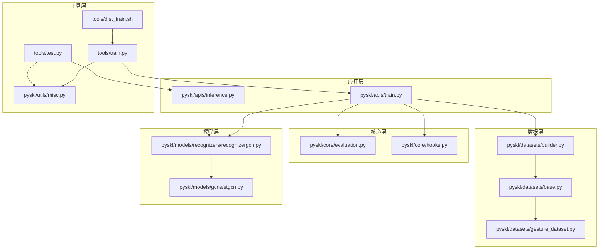
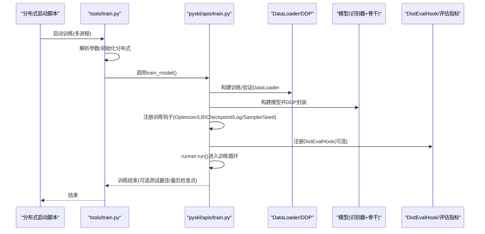
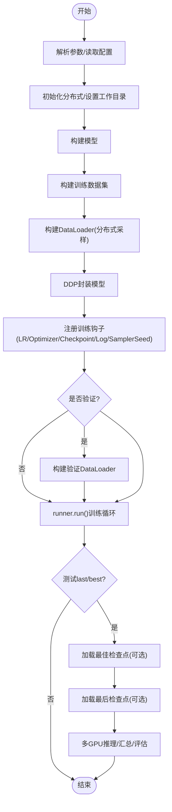
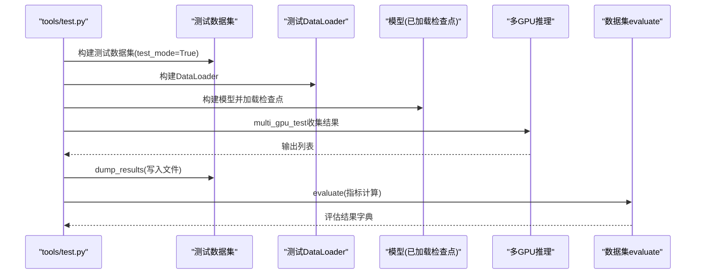
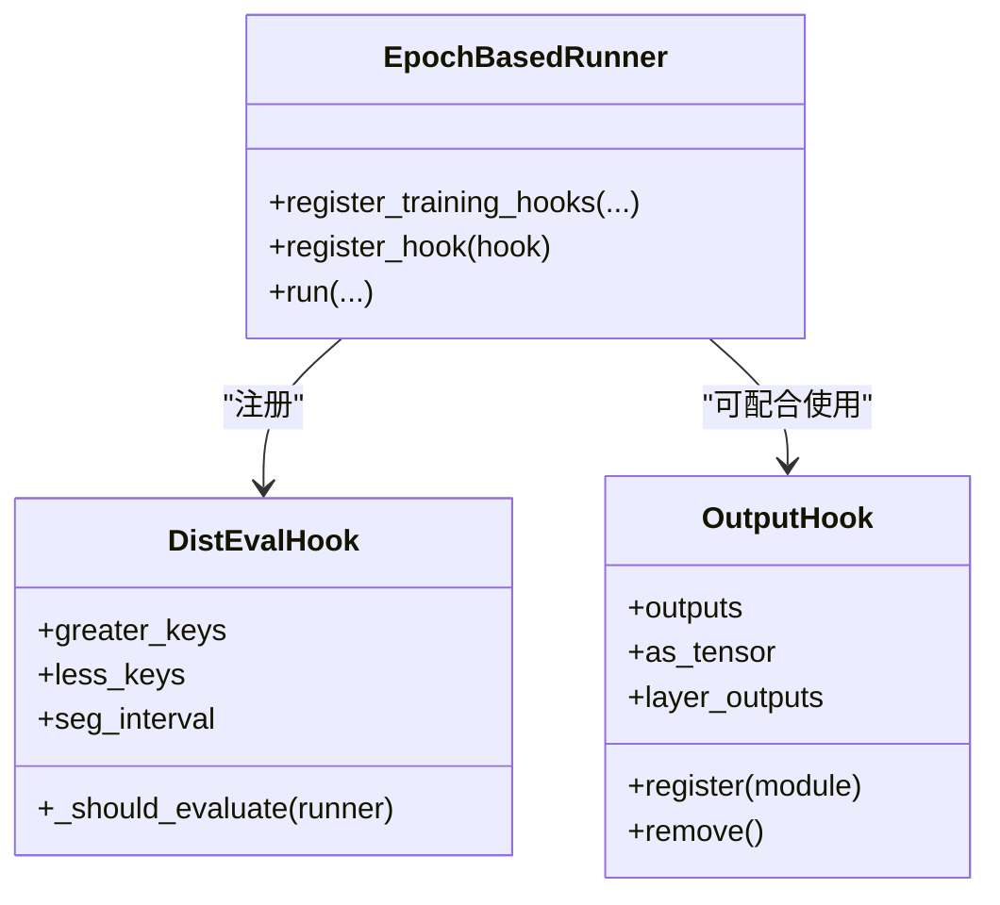
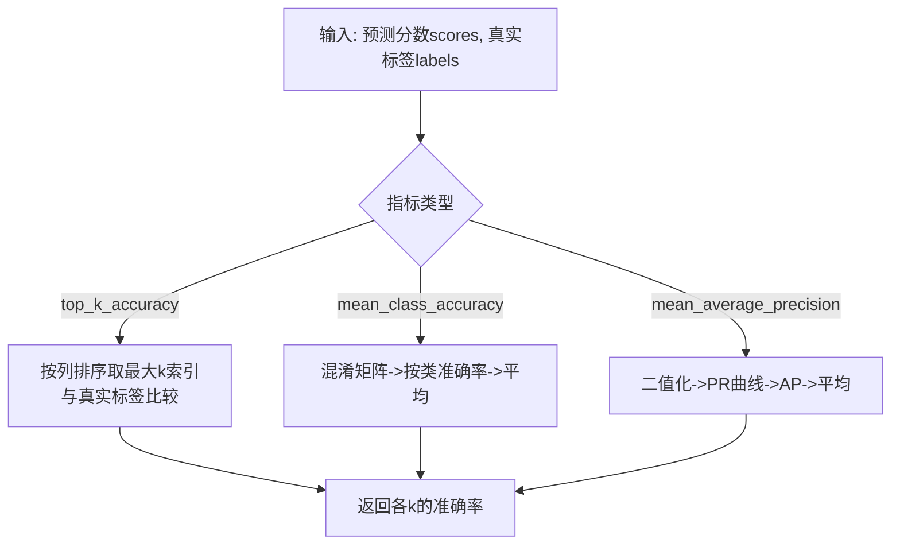
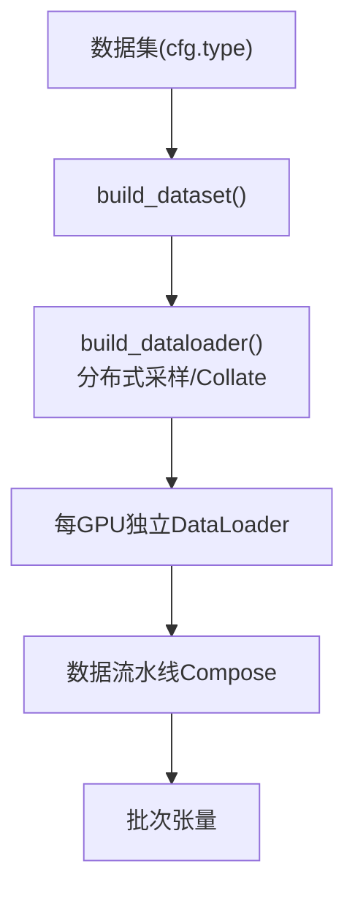
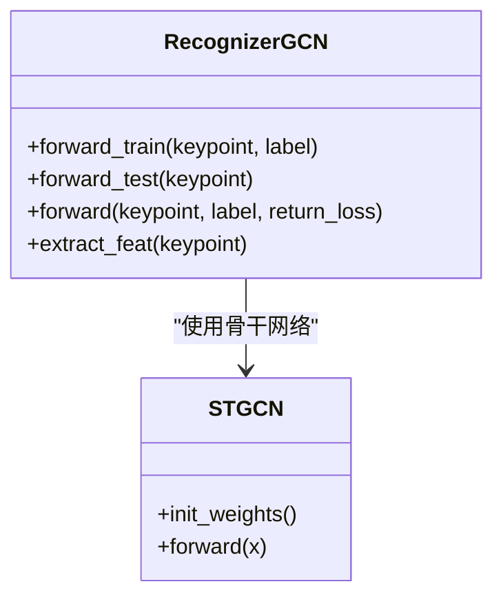
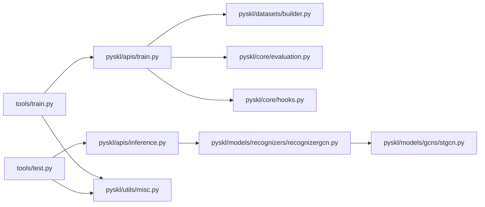

# 训练与测试系统

<cite>
**本文引用的文件**
- [README.md](file://README.md)
- [tools/train.py](file://tools/train.py)
- [tools/test.py](file://tools/test.py)
- [tools/dist_train.sh](file://tools/dist_train.sh)
- [pyskl/apis/train.py](file://pyskl/apis/train.py)
- [pyskl/apis/inference.py](file://pyskl/apis/inference.py)
- [pyskl/core/hooks.py](file://pyskl/core/hooks.py)
- [pyskl/core/evaluation.py](file://pyskl/core/evaluation.py)
- [pyskl/datasets/base.py](file://pyskl/datasets/base.py)
- [pyskl/datasets/gesture_dataset.py](file://pyskl/datasets/gesture_dataset.py)
- [pyskl/datasets/builder.py](file://pyskl/datasets/builder.py)
- [pyskl/models/recognizers/recognizergcn.py](file://pyskl/models/recognizers/recognizergcn.py)
- [pyskl/models/gcns/stgcn.py](file://pyskl/models/gcns/stgcn.py)
- [pyskl/utils/misc.py](file://pyskl/utils/misc.py)
</cite>

## 目录
1. [简介](#简介)
2. [项目结构](#项目结构)
3. [核心组件](#核心组件)
4. [架构总览](#架构总览)
5. [详细组件分析](#详细组件分析)
6. [依赖关系分析](#依赖关系分析)
7. [性能考量](#性能考量)
8. [故障排查指南](#故障排查指南)
9. [结论](#结论)
10. [附录](#附录)

## 简介
本技术文档面向PySKL训练与测试系统，围绕骨架动作识别任务，系统化阐述训练流程设计（数据加载、模型训练、梯度更新、模型保存）、分布式训练支持（多GPU并行、数据并行、可扩展的模型并行思路）、测试流程（模型评估、指标计算、结果输出与可视化）、训练钩子系统（回调、日志、检查点、学习率调度）、训练脚本使用指南（命令行参数、配置文件、输出解读）、评估指标（top-k准确率、平均类准确率等）及监控调试方法（损失曲线、梯度检查、过拟合检测），并提供性能优化建议与常见问题解决方案。

## 项目结构
- 工具层：tools目录提供训练与测试入口脚本，封装分布式启动、参数解析、日志与环境采集。
- 应用层：pyskl/apis定义训练入口与推理API，协调数据集、模型、优化器与Runner。
- 核心层：pyskl/core提供分布式评估钩子与评估指标工具。
- 数据层：pyskl/datasets提供数据集抽象、构建器与具体数据集实现（如手势数据集）。
- 模型层：pyskl/models提供识别器、GCN骨干网络等。
- 工具层：pyskl/utils提供日志、缓存、端口探测等辅助能力。

**图示来源**
- [tools/dist_train.sh](file://tools/dist_train.sh#L1-L13)
- [tools/train.py](file://tools/train.py#L60-L165)
- [tools/test.py](file://tools/test.py#L110-L185)
- [pyskl/apis/train.py](file://pyskl/apis/train.py#L50-L213)
- [pyskl/apis/inference.py](file://pyskl/apis/inference.py#L19-L184)
- [pyskl/core/evaluation.py](file://pyskl/core/evaluation.py#L6-L215)
- [pyskl/core/hooks.py](file://pyskl/core/hooks.py#L7-L68)
- [pyskl/datasets/builder.py](file://pyskl/datasets/builder.py#L31-L134)
- [pyskl/datasets/base.py](file://pyskl/datasets/base.py#L19-L354)
- [pyskl/datasets/gesture_dataset.py](file://pyskl/datasets/gesture_dataset.py#L13-L156)
- [pyskl/models/recognizers/recognizergcn.py](file://pyskl/models/recognizers/recognizergcn.py#L8-L97)
- [pyskl/models/gcns/stgcn.py](file://pyskl/models/gcns/stgcn.py#L56-L138)
- [pyskl/utils/misc.py](file://pyskl/utils/misc.py#L18-L131)

**章节来源**
- [README.md](file://README.md#L82-L91)
- [tools/train.py](file://tools/train.py#L60-L165)
- [tools/test.py](file://tools/test.py#L110-L185)
- [tools/dist_train.sh](file://tools/dist_train.sh#L1-L13)

## 核心组件
- 训练入口与Runner：tools/train.py解析参数、初始化分布式、构建模型与数据集，调用pyskl/apis/train.py进行训练；后者构建分布式DataParallel、注册训练钩子、运行EpochBasedRunner。
- 测试与评估：tools/test.py构建测试数据集与DataLoader，加载检查点，多GPU推理，收集结果并调用数据集evaluate进行指标计算。
- 数据加载：pyskl/datasets/builder.py基于分布式采样器与MMCV Collate构建DataLoader；BaseDataset提供统一的prepare_train_frames/prepare_test_frames与evaluate接口。
- 评估指标：pyskl/core/evaluation.py提供DistEvalHook、混淆矩阵、top-k准确率、平均类准确率、mAP等。
- 模型与识别器：pyskl/models/recognizers/recognizergcn.py定义GCN识别器的前向训练与测试逻辑；骨干网络STGCN实现时空图卷积堆叠。
- 工具与缓存：pyskl/utils/misc.py提供memcached启停、端口探测、根日志器、检查点缓存等。

**章节来源**
- [pyskl/apis/train.py](file://pyskl/apis/train.py#L50-L213)
- [pyskl/datasets/builder.py](file://pyskl/datasets/builder.py#L31-L134)
- [pyskl/core/evaluation.py](file://pyskl/core/evaluation.py#L6-L215)
- [pyskl/models/recognizers/recognizergcn.py](file://pyskl/models/recognizers/recognizergcn.py#L8-L97)
- [pyskl/models/gcns/stgcn.py](file://pyskl/models/gcns/stgcn.py#L56-L138)
- [pyskl/utils/misc.py](file://pyskl/utils/misc.py#L18-L131)

## 架构总览
训练与测试系统采用“脚本入口—应用API—核心模块—数据与模型—工具”的分层架构。训练通过分布式启动脚本启动多进程，每个进程构建本地DataLoader与DDP模型，Runner驱动训练循环并注册钩子；测试阶段构建测试DataLoader，多GPU推理后在主进程汇总并评估。

**图示来源**
- [tools/dist_train.sh](file://tools/dist_train.sh#L1-L13)
- [tools/train.py](file://tools/train.py#L60-L165)
- [pyskl/apis/train.py](file://pyskl/apis/train.py#L50-L213)
- [pyskl/core/evaluation.py](file://pyskl/core/evaluation.py#L6-L37)

## 详细组件分析

### 训练流程与分布式训练
- 参数解析与分布式初始化：tools/train.py解析命令行参数，读取配置，初始化分布式后设置工作目录、日志、随机种子，并根据配置决定自动恢复。
- 模型与数据集构建：构建模型与训练数据集，支持torch.compile在PyTorch 2.0+启用。
- Runner与钩子：pyskl/apis/train.py构建MMDistributedDataParallel，使用OptimizerHook与LR调度配置注册训练钩子，注册DistSamplerSeedHook；可选注册DistEvalHook进行周期性验证。
- 训练循环：runner.run(data_loaders, workflow, total_epochs)驱动训练；训练结束后可按需测试“last”或“best”检查点。
- 分布式细节：DDP封装、分布式采样器、持久化工作进程、广播缓冲区等配置由构建器与Runner统一管理。

**图示来源**
- [tools/train.py](file://tools/train.py#L60-L165)
- [pyskl/apis/train.py](file://pyskl/apis/train.py#L50-L213)
- [pyskl/datasets/builder.py](file://pyskl/datasets/builder.py#L48-L124)

**章节来源**
- [tools/train.py](file://tools/train.py#L60-L165)
- [pyskl/apis/train.py](file://pyskl/apis/train.py#L50-L213)
- [pyskl/datasets/builder.py](file://pyskl/datasets/builder.py#L48-L124)

### 测试流程与评估
- 测试入口：tools/test.py解析参数，构建测试数据集与DataLoader，加载检查点，可融合卷积BN提升推理速度。
- 推理与聚合：使用MMDistributedDataParallel在多GPU上推理，通过multi_gpu_test收集各进程结果。
- 结果输出与评估：在rank=0写入结果文件，调用数据集evaluate执行指标计算（top-k准确率、平均类准确率、mAP等），打印评估结果。

**图示来源**
- [tools/test.py](file://tools/test.py#L110-L185)
- [pyskl/datasets/base.py](file://pyskl/datasets/base.py#L112-L241)

**章节来源**
- [tools/test.py](file://tools/test.py#L110-L185)
- [pyskl/datasets/base.py](file://pyskl/datasets/base.py#L112-L241)

### 训练钩子系统与日志
- 钩子注册：OptimizerHook、学习率调度、检查点配置、日志配置、DistSamplerSeedHook均由Runner统一注册。
- 分布式评估钩子：DistEvalHook继承自基础DistEvalHook，支持“按区间评估”与“保存最佳”规则，自动判断greater/less指标方向。
- 输出钩子：OutputHook用于捕获中间层特征，支持tensor或numpy数组返回，便于可视化与分析。

**图示来源**
- [pyskl/core/evaluation.py](file://pyskl/core/evaluation.py#L6-L37)
- [pyskl/core/hooks.py](file://pyskl/core/hooks.py#L7-L68)
- [pyskl/apis/train.py](file://pyskl/apis/train.py#L117-L121)

**章节来源**
- [pyskl/core/evaluation.py](file://pyskl/core/evaluation.py#L6-L37)
- [pyskl/core/hooks.py](file://pyskl/core/hooks.py#L7-L68)
- [pyskl/apis/train.py](file://pyskl/apis/train.py#L117-L121)

### 评估指标与计算方法
- 指标支持：top_k_accuracy、mean_class_accuracy、mean_average_precision。
- top-k准确率：对每个样本取预测得分前k的类别，若与真实标签一致则计为正确，计算整体比例。
- 平均类准确率：先求混淆矩阵，再按类别计算准确率并取平均。
- mAP（多标签）：对每个类别计算二值化的精确率-召回率曲线，积分得到AP，再对所有类别取平均。
- DistEvalHook：自动识别“越大越好”与“越小越好”的指标，控制最佳模型保存策略。

**图示来源**
- [pyskl/core/evaluation.py](file://pyskl/core/evaluation.py#L103-L144)
- [pyskl/core/evaluation.py](file://pyskl/core/evaluation.py#L147-L214)
- [pyskl/core/evaluation.py](file://pyskl/core/evaluation.py#L39-L100)

**章节来源**
- [pyskl/core/evaluation.py](file://pyskl/core/evaluation.py#L103-L144)
- [pyskl/core/evaluation.py](file://pyskl/core/evaluation.py#L147-L214)
- [pyskl/core/evaluation.py](file://pyskl/core/evaluation.py#L39-L100)

### 数据加载与分布式采样
- 数据集构建：通过注册表构建具体数据集，支持JSON/PKL等多种注释格式。
- DataLoader构建：根据分布式信息选择DistributedSampler或ClassSpecificDistributedSampler，支持shuffle、seed、persistent_workers等。
- 采样策略：默认使用分布式采样保证每卡不重复；当数据集提供class_prob时使用类别特定采样器，提升类别均衡性。
- 缓存机制：BaseDataset支持memcached缓存关键点数据，减少IO瓶颈。

**图示来源**
- [pyskl/datasets/builder.py](file://pyskl/datasets/builder.py#L31-L134)
- [pyskl/datasets/base.py](file://pyskl/datasets/base.py#L262-L345)

**章节来源**
- [pyskl/datasets/builder.py](file://pyskl/datasets/builder.py#L31-L134)
- [pyskl/datasets/base.py](file://pyskl/datasets/base.py#L262-L345)

### 模型与识别器
- 识别器GCN：RecognizerGCN针对骨架数据，前向训练时提取特征并通过分类头计算损失；前向测试时支持特征抽取、池化选项与片段平均策略。
- 骨干网络ST-GCN：STGCNBlock组合GCN与TCN，支持残差连接、下采样与通道膨胀；STGCN堆叠多层形成深度网络，支持不同数据BN策略。

**图示来源**
- [pyskl/models/recognizers/recognizergcn.py](file://pyskl/models/recognizers/recognizergcn.py#L8-L97)
- [pyskl/models/gcns/stgcn.py](file://pyskl/models/gcns/stgcn.py#L56-L138)

**章节来源**
- [pyskl/models/recognizers/recognizergcn.py](file://pyskl/models/recognizers/recognizergcn.py#L8-L97)
- [pyskl/models/gcns/stgcn.py](file://pyskl/models/gcns/stgcn.py#L56-L138)

### 训练脚本使用指南
- 训练命令：通过tools/dist_train.sh启动分布式训练，传入配置名、GPU数量与附加参数（如--validate、--test-last、--test-best、--compile等）。
- 测试命令：tools/test.py支持指定检查点、输出格式、评估指标、片段平均方式等；默认输出到工作目录下的result.pkl。
- 关键参数：
  - --validate：训练期间周期性验证
  - --test-last/--test-best：训练完成后测试最后/最佳检查点
  - --compile：在PyTorch 2.0+启用torch.compile
  - --eval：评估指标列表（如top_k_accuracy、mean_class_accuracy）
  - --average-clips：测试时片段平均策略（score/prob/None）

**章节来源**
- [README.md](file://README.md#L82-L91)
- [tools/dist_train.sh](file://tools/dist_train.sh#L1-L13)
- [tools/train.py](file://tools/train.py#L22-L57)
- [tools/test.py](file://tools/test.py#L24-L68)

### 推理API与可视化
- 初始化识别器：init_recognizer支持从配置文件与检查点构建模型，设备选择与eval模式。
- 推理接口：inference_recognizer支持多种输入（视频文件/URL、原始帧目录、数组），自动适配流水线，支持输出中间层特征，Top-K结果返回。
- 可视化：结合OutputHook与工具层可视化模块，可输出热力图、特征图等。

**章节来源**
- [pyskl/apis/inference.py](file://pyskl/apis/inference.py#L19-L184)
- [pyskl/core/hooks.py](file://pyskl/core/hooks.py#L7-L68)
- [pyskl/utils/misc.py](file://pyskl/utils/misc.py#L97-L112)

## 依赖关系分析
- 组件耦合：训练入口依赖应用API与数据构建器；应用API依赖Runner与评估钩子；数据层依赖流水线与注册表；模型层依赖骨干网络与识别器。
- 外部依赖：MMCV（Runner、DistributedDataParallel、构建器）、PyTorch（DDP、编译）、pymemcache（可选缓存）。
- 循环依赖：未发现直接循环导入；分布式相关组件通过工具层与构建器解耦。

**图示来源**
- [tools/train.py](file://tools/train.py#L16-L19)
- [pyskl/apis/train.py](file://pyskl/apis/train.py#L12-L14)
- [pyskl/apis/inference.py](file://pyskl/apis/inference.py#L13-L16)
- [pyskl/datasets/builder.py](file://pyskl/datasets/builder.py#L12-L13)
- [pyskl/models/recognizers/recognizergcn.py](file://pyskl/models/recognizers/recognizergcn.py#L4-L5)
- [pyskl/models/gcns/stgcn.py](file://pyskl/models/gcns/stgcn.py#L6-L8)
- [pyskl/utils/misc.py](file://pyskl/utils/misc.py#L15-L16)

**章节来源**
- [tools/train.py](file://tools/train.py#L16-L19)
- [pyskl/apis/train.py](file://pyskl/apis/train.py#L12-L14)
- [pyskl/apis/inference.py](file://pyskl/apis/inference.py#L13-L16)
- [pyskl/datasets/builder.py](file://pyskl/datasets/builder.py#L12-L13)
- [pyskl/models/recognizers/recognizergcn.py](file://pyskl/models/recognizers/recognizergcn.py#L4-L5)
- [pyskl/models/gcns/stgcn.py](file://pyskl/models/gcns/stgcn.py#L6-L8)
- [pyskl/utils/misc.py](file://pyskl/utils/misc.py#L15-L16)

## 性能考量
- 分布式与数据加载
  - 使用DistributedSampler与ClassSpecificDistributedSampler提升数据分布均衡性。
  - 启用persistent_workers与合适的workers_per_gpu，减少每轮数据准备开销。
  - 合理设置pin_memory与collate函数，平衡内存与带宽。
- 模型与编译
  - 在PyTorch 2.0+开启--compile可利用torch.compile优化图执行（实验特性，谨慎使用）。
  - 对推理阶段可融合卷积BN提升速度（--fuse-conv-bn）。
- 缓存与IO
  - memcached缓存关键点数据可显著降低IO延迟（仅适用于特定数据集）。
  - 合理设置缓存大小与端口，确保服务稳定。
- 训练稳定性
  - 设置合理的cudnn_benchmark与确定性选项（--deterministic）。
  - 使用DistSamplerSeedHook与全局随机种子广播，保证多卡一致性。

[本节为通用指导，无需特定文件分析]

## 故障排查指南
- 分布式启动失败
  - 检查MASTER_PORT占用与网络连通性；确认tools/dist_train.sh中端口分配与--nproc_per_node匹配。
  - 查看日志文件定位rank=0以外进程异常。
- memcached相关问题
  - 若memcached未启动或端口不可达，工具层会持续重试；检查端口与权限，必要时手动启动或更换端口。
  - 使用test_port检测端口状态，确保mc_on成功。
- 检查点加载失败
  - 确认检查点路径存在且可用；远程URL将被缓存到本地缓存目录。
- 评估指标异常
  - 确保results长度与数据集长度一致；指标名称拼写正确；多模态/多模型输出格式符合预期。
- 推理结果为空或形状异常
  - 检查输入类型与流水线配置；确认模型test_cfg中的average_clips与池化选项设置合理。

**章节来源**
- [pyskl/utils/misc.py](file://pyskl/utils/misc.py#L18-L94)
- [tools/train.py](file://tools/train.py#L138-L160)
- [tools/test.py](file://tools/test.py#L150-L180)
- [pyskl/datasets/base.py](file://pyskl/datasets/base.py#L112-L241)

## 结论
PySKL训练与测试系统以清晰的分层架构与完善的分布式支持为基础，结合灵活的数据加载、丰富的评估指标与可扩展的模型结构，能够高效支撑骨架动作识别任务的训练与评测。通过合理配置分布式参数、数据采样策略与缓存机制，可在保证训练稳定性的同时获得良好的性能表现。建议在实际部署中结合硬件条件与数据规模，逐步调优以达到最优效果。

[本节为总结性内容，无需特定文件分析]

## 附录
- 常用命令参考
  - 训练：bash tools/dist_train.sh {config_name} {num_gpus} [--validate] [--test-last] [--test-best] [--compile]
  - 测试：bash tools/dist_test.sh {config_name} {checkpoint} {num_gpus} --out {output_file} --eval top_k_accuracy mean_class_accuracy
- 输出解读
  - 训练日志：包含配置摘要、环境信息、随机种子、每轮损失与指标。
  - 测试输出：result.pkl为预测结果，终端打印各指标数值；评估钩子可自动保存最佳检查点。

**章节来源**
- [README.md](file://README.md#L82-L91)
- [tools/dist_train.sh](file://tools/dist_train.sh#L1-L13)
- [tools/test.py](file://tools/test.py#L115-L177)