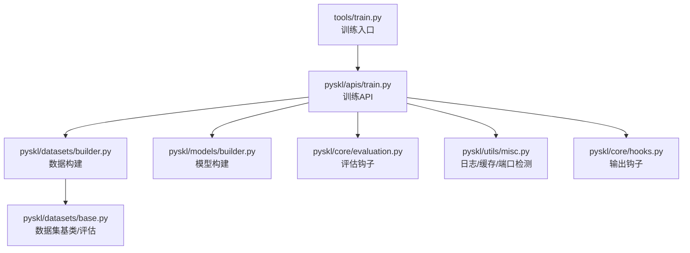
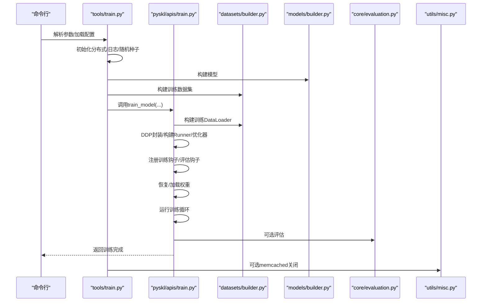
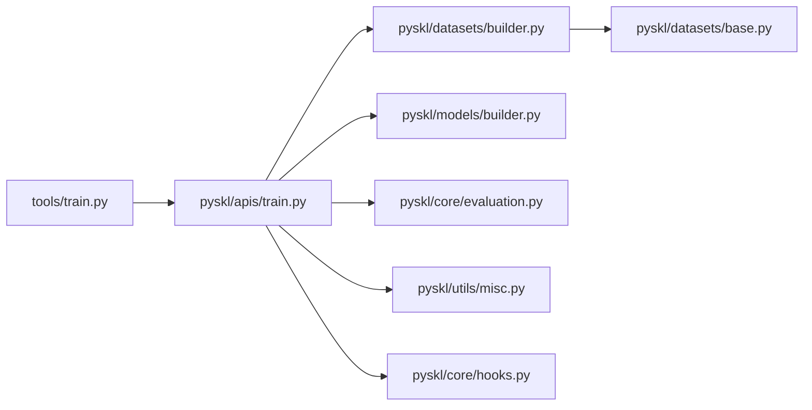
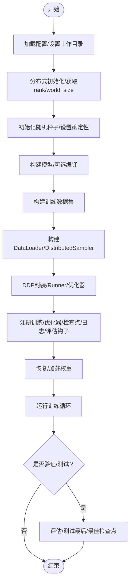
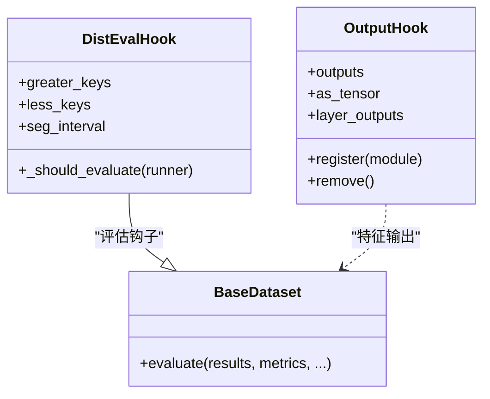

# 训练流程设计

<cite>
**本文引用的文件**
- [tools/train.py](file://tools/train.py)
- [pyskl/apis/train.py](file://pyskl/apis/train.py)
- [pyskl/core/hooks.py](file://pyskl/core/hooks.py)
- [pyskl/core/evaluation.py](file://pyskl/core/evaluation.py)
- [pyskl/datasets/builder.py](file://pyskl/datasets/builder.py)
- [pyskl/datasets/base.py](file://pyskl/datasets/base.py)
- [pyskl/models/builder.py](file://pyskl/models/builder.py)
- [pyskl/utils/misc.py](file://pyskl/utils/misc.py)
- [configs/stgcn/stgcn_pyskl_ntu60_xsub_3dkp/b.py](file://configs/stgcn/stgcn_pyskl_ntu60_xsub_3dkp/b.py)
- [tools/dist_train.sh](file://tools/dist_train.sh)
- [pyskl.yaml](file://pyskl.yaml)
</cite>

## 目录
1. [简介](#简介)
2. [项目结构](#项目结构)
3. [核心组件](#核心组件)
4. [架构总览](#架构总览)
5. [详细组件分析](#详细组件分析)
6. [依赖关系分析](#依赖关系分析)
7. [性能考量](#性能考量)
8. [故障排查指南](#故障排查指南)
9. [结论](#结论)
10. [附录](#附录)

## 简介
本文面向PySKL的训练流程设计，系统性阐述从命令行参数解析、配置加载、随机种子与分布式初始化，到训练主循环（数据加载、前向传播、损失计算、反向传播、参数更新）、训练钩子系统（回调、日志、检查点、学习率调度）、训练配置关键参数（工作目录、日志级别、自动恢复、验证间隔等），再到使用指南与错误处理策略。文档力求以循序渐进的方式帮助读者理解端到端训练流程，并提供可视化图示与定位到具体源码位置的“章节来源”。

## 项目结构
- 训练入口：tools/train.py
- 训练API：pyskl/apis/train.py
- 钩子与评估：pyskl/core/hooks.py、pyskl/core/evaluation.py
- 数据构建：pyskl/datasets/builder.py、pyskl/datasets/base.py
- 模型构建：pyskl/models/builder.py
- 工具与日志：pyskl/utils/misc.py
- 示例配置：configs/stgcn/stgcn_pyskl_ntu60_xsub_3dkp/b.py
- 分布式启动脚本：tools/dist_train.sh
- 环境配置：pyskl.yaml

图表来源
- [tools/train.py](file://tools/train.py#L60-L165)
- [pyskl/apis/train.py](file://pyskl/apis/train.py#L50-L213)
- [pyskl/datasets/builder.py](file://pyskl/datasets/builder.py#L31-L134)
- [pyskl/models/builder.py](file://pyskl/models/builder.py#L32-L39)
- [pyskl/core/evaluation.py](file://pyskl/core/evaluation.py#L6-L37)
- [pyskl/utils/misc.py](file://pyskl/utils/misc.py#L97-L131)
- [pyskl/datasets/base.py](file://pyskl/datasets/base.py#L19-L200)

章节来源
- [tools/train.py](file://tools/train.py#L1-L165)
- [pyskl/apis/train.py](file://pyskl/apis/train.py#L1-L213)

## 核心组件
- 训练入口与初始化：解析参数、加载配置、设置CUDNN、分布式初始化、工作目录与日志、随机种子、模型编译、数据集构建、检查点与memcached准备、调用训练API。
- 训练API：构建数据加载器、DDP封装、优化器与Runner、注册训练钩子、评估钩子、恢复或加载权重、运行训练循环、可选测试最后/最佳检查点。
- 数据构建：基于注册表构建数据集与DataLoader，分布式采样器与worker种子初始化。
- 模型构建：基于注册表构建识别器（recognizer）。
- 评估钩子：分布式评估钩子，支持按区间调整验证频率。
- 工具与日志：根日志器、memcached启动/关闭、端口检测、检查点缓存。

章节来源
- [tools/train.py](file://tools/train.py#L60-L165)
- [pyskl/apis/train.py](file://pyskl/apis/train.py#L50-L213)
- [pyskl/datasets/builder.py](file://pyskl/datasets/builder.py#L31-L134)
- [pyskl/models/builder.py](file://pyskl/models/builder.py#L32-L39)
- [pyskl/core/evaluation.py](file://pyskl/core/evaluation.py#L6-L37)
- [pyskl/utils/misc.py](file://pyskl/utils/misc.py#L97-L131)

## 架构总览
训练流程自上而下的控制流如下：
- 入口脚本解析参数与配置，初始化分布式环境与日志，设置随机种子，构建模型与数据集，注册训练钩子，调用训练API。
- 训练API构建DataLoader、封装DDP、构建Runner与优化器，注册学习率、优化器、检查点、日志钩子，注册分布式采样种子钩子与可选评估钩子，根据配置恢复或加载权重，进入训练循环。
- 训练循环由Runner驱动，按epoch推进，期间触发各类钩子（学习率、优化器、日志、评估等）。
- 训练结束后可选地进行测试（最后/最佳检查点），并输出评估结果。

图表来源
- [tools/train.py](file://tools/train.py#L60-L165)
- [pyskl/apis/train.py](file://pyskl/apis/train.py#L50-L213)
- [pyskl/datasets/builder.py](file://pyskl/datasets/builder.py#L31-L134)
- [pyskl/models/builder.py](file://pyskl/models/builder.py#L32-L39)
- [pyskl/core/evaluation.py](file://pyskl/core/evaluation.py#L6-L37)
- [pyskl/utils/misc.py](file://pyskl/utils/misc.py#L97-L131)

## 详细组件分析

### 训练入口与初始化（tools/train.py）
- 参数解析：支持配置文件路径、验证开关、测试最后/最佳检查点、随机种子、确定性选项、分布式启动器、模型编译开关、本地rank等。
- 配置加载与工作目录：从配置文件读取，若未指定work_dir则以配置文件名作为默认目录；设置cudnn_benchmark；确保dist_params存在且默认后端为nccl。
- 分布式初始化：根据launcher调用init_dist，获取rank/world_size，设置gpu_ids。
- 自动恢复：若开启auto_resume且未显式指定resume_from，则在work_dir下寻找latest.pth作为恢复目标。
- 日志与元信息：创建work_dir，dump配置，初始化根日志器，收集环境信息写入日志，记录seed、配置名、工作目录等元信息。
- 随机种子：调用init_random_seed与set_random_seed，保证各进程一致的随机种子。
- 模型编译：若PyTorch版本≥2.0且传入编译开关，则对模型进行编译。
- 数据集构建：构建训练数据集，设置workflow（默认仅train）。
- 检查点元数据：在checkpoint_config中注入pyskl版本与配置文本。
- 测试选项：根据命令行参数构造test选项字典。
- memcached：在rank==0时按需启动/检测端口，barrier同步，训练完成后关闭。
- 调用训练API：train_model(model, datasets, cfg, validate, test, timestamp, meta)。

章节来源
- [tools/train.py](file://tools/train.py#L22-L165)

### 训练API（pyskl/apis/train.py）
- 随机种子初始化：若未指定seed则随机生成，多进程广播保证一致性。
- 数据加载器：从配置读取videos_per_gpu、workers_per_gpu、persistent_workers、seed等，构建DataLoader列表。
- DDP封装：将模型封装为MMDistributedDataParallel，设置find_unused_parameters。
- 优化器与Runner：构建优化器，创建EpochBasedRunner，设置work_dir、logger、meta。
- 钩子注册：注册学习率、优化器、检查点、日志钩子；注册DistSamplerSeedHook以确保分布式采样一致性。
- 评估钩子：若validate为真，构建验证数据集与DataLoader，创建DistEvalHook并注册。
- 恢复/加载：优先resume_from，否则加载load_from（支持远程URL缓存）。
- 训练循环：runner.run(data_loaders, workflow, total_epochs)。
- 测试：若test_last/test_best为真，构建测试数据集与DataLoader，加载对应检查点，multi_gpu_test推理，保存预测结果并评估指标。

章节来源
- [pyskl/apis/train.py](file://pyskl/apis/train.py#L17-L213)

### 数据构建（pyskl/datasets/builder.py）
- 数据集构建：通过注册表构建数据集实例。
- DataLoader构建：根据分布式信息选择ClassSpecificDistributedSampler或DistributedSampler；支持shuffle、seed、drop_last、pin_memory、persistent_workers；使用MMCV collate与worker_init_fn设置worker随机种子。
- worker种子：worker_init_fn综合num_workers、rank与seed生成唯一随机种子，确保可复现性。

章节来源
- [pyskl/datasets/builder.py](file://pyskl/datasets/builder.py#L31-L134)

### 模型构建（pyskl/models/builder.py）
- 注册表：基于MMCV Registry，定义MODELS、BACKBONES、HEADS、RECOGNIZERS等。
- 模型构建：build_model根据type选择构建识别器（recognizer），不匹配时报错。

章节来源
- [pyskl/models/builder.py](file://pyskl/models/builder.py#L1-L39)

### 评估钩子（pyskl/core/evaluation.py）
- DistEvalHook：继承自mmcv的DistEvalHook，扩展greater_keys/less_keys，支持按区间调整验证频率（seg_interval），校验起止边界与连续性。
- 评估指标：提供混淆矩阵、平均类准确率、Top-k准确率、平均精度等常用指标函数。

章节来源
- [pyskl/core/evaluation.py](file://pyskl/core/evaluation.py#L6-L37)

### 输出钩子（pyskl/core/hooks.py）
- OutputHook：用于在前向过程中捕获指定层的特征图，支持tensor或numpy数组输出，支持上下文管理自动清理hook。

章节来源
- [pyskl/core/hooks.py](file://pyskl/core/hooks.py#L7-L68)

### 工具与日志（pyskl/utils/misc.py）
- 日志：get_root_logger封装mmcv日志器，支持文件与级别。
- memcached：mc_on启动、mc_off关闭、test_port检测端口；cache_checkpoint支持HTTP URL检查点缓存。
- 并发缓存：mp_cache/mp_cache_single支持多进程批量缓存数据到memcached。

章节来源
- [pyskl/utils/misc.py](file://pyskl/utils/misc.py#L18-L131)

### 数据集基类与评估（pyskl/datasets/base.py）
- BaseDataset：抽象基类，定义load_annotations、prepare_train_frames、prepare_test_frames等接口；提供evaluate方法，支持多种评估指标与多模态/多模型结果融合。
- 评估流程：检查结果类型与长度，按指标逐项计算，支持Top-k、平均类准确率、平均精度等。

章节来源
- [pyskl/datasets/base.py](file://pyskl/datasets/base.py#L19-L200)

### 示例配置（configs/stgcn/stgcn_pyskl_ntu60_xsub_3dkp/b.py）
- 模型：识别器类型、backbone（STGCN）、head（GCNHead）。
- 数据：train/val/test数据集类型、注释文件、训练流水线、验证/测试流水线、batch与worker设置。
- 优化与学习率：SGD优化器、CosineAnnealing学习率策略、总epoch、检查点间隔、评估指标、日志配置。
- 运行设置：日志级别、工作目录。

章节来源
- [configs/stgcn/stgcn_pyskl_ntu60_xsub_3dkp/b.py](file://configs/stgcn/stgcn_pyskl_ntu60_xsub_3dkp/b.py#L1-L61)

### 分布式启动脚本（tools/dist_train.sh）
- 设置MASTER_PORT，调用torch.distributed.launch以指定每节点GPU数量与端口，传递配置与额外参数给train.py。

章节来源
- [tools/dist_train.sh](file://tools/dist_train.sh#L1-L13)

## 依赖关系分析

图表来源
- [tools/train.py](file://tools/train.py#L16-L18)
- [pyskl/apis/train.py](file://pyskl/apis/train.py#L12-L14)
- [pyskl/datasets/builder.py](file://pyskl/datasets/builder.py#L12-L12)
- [pyskl/models/builder.py](file://pyskl/models/builder.py#L2-L9)
- [pyskl/core/evaluation.py](file://pyskl/core/evaluation.py#L3-L3)
- [pyskl/utils/misc.py](file://pyskl/utils/misc.py#L12-L13)
- [pyskl/datasets/base.py](file://pyskl/datasets/base.py#L14-L16)
- [pyskl/core/hooks.py](file://pyskl/core/hooks.py#L2-L4)

## 性能考量
- 分布式采样与worker种子：通过DistributedSampler与worker_init_fn确保可复现性与负载均衡。
- persistent_workers：在高版本PyTorch中启用可减少每轮epoch的进程重启开销。
- cudnn_benchmark：在配置中开启可提升卷积等算子性能。
- memcached：在大规模数据读取场景下可显著降低I/O延迟，但需注意端口占用与内存分配。
- 模型编译：PyTorch 2.0+的torch.compile可带来吞吐提升，但需关注兼容性与调试成本。

## 故障排查指南
- 分布式初始化失败
  - 检查launcher与dist_params配置，确认NCCL后端可用。
  - 确认MASTER_PORT未被占用，必要时更换端口。
- 检查点恢复问题
  - 若auto_resume启用但无latest.pth，需手动指定resume_from或确保训练产生latest.pth。
  - 若load_from为远程URL，确认cache_checkpoint已成功下载并缓存。
- memcached无法启动
  - 使用test_port检测端口，确保mc_on正确启动；必要时增大内存分配或调整端口。
- 验证频率异常
  - 若使用seg_interval，需确保区间连续且by_epoch为True，否则评估钩子会报错。
- 评估指标缺失
  - 确认evaluation.metrics包含受支持的指标名称，避免KeyError。
- 日志级别与输出
  - 通过log_level与log_config.hooks控制日志输出频率与格式，便于定位问题。

章节来源
- [tools/train.py](file://tools/train.py#L75-L87)
- [pyskl/apis/train.py](file://pyskl/apis/train.py#L138-L143)
- [pyskl/utils/misc.py](file://pyskl/utils/misc.py#L86-L94)
- [pyskl/core/evaluation.py](file://pyskl/core/evaluation.py#L12-L22)

## 结论
PySKL的训练流程以入口脚本为核心，串联配置加载、分布式初始化、随机种子设置、模型与数据构建、训练钩子注册与训练循环，最终支持可选的验证与测试。通过注册表机制与MMCV Runner，系统具备良好的扩展性与可维护性。建议在生产环境中结合持久化worker、cudnn_benchmark、memcached与模型编译等手段优化性能，并严格管理分布式端口、检查点与评估配置以确保稳定性。

## 附录

### 训练主循环执行流程（流程图）

图表来源
- [tools/train.py](file://tools/train.py#L60-L165)
- [pyskl/apis/train.py](file://pyskl/apis/train.py#L50-L213)

### 训练钩子系统（类图）

图表来源
- [pyskl/core/evaluation.py](file://pyskl/core/evaluation.py#L6-L37)
- [pyskl/core/hooks.py](file://pyskl/core/hooks.py#L7-L68)
- [pyskl/datasets/base.py](file://pyskl/datasets/base.py#L112-L200)

### 训练配置关键参数说明
- 工作目录（work_dir）：训练产物存放目录，默认基于配置文件名生成，可在配置中覆盖。
- 日志级别（log_level）：控制日志输出详细程度。
- 自动恢复（auto_resume）：默认开启，若未指定resume_from则自动寻找latest.pth。
- 验证间隔（evaluation.interval）：评估钩子触发频率；支持seg_interval按epoch区间差异化设置。
- 学习率策略（lr_config.policy）：如CosineAnnealing等。
- 检查点间隔（checkpoint_config.interval）：保存检查点的epoch间隔。
- 数据加载（data.train_dataloader/val_dataloader/test_dataloader）：videos_per_gpu、workers_per_gpu、persistent_workers、seed等。
- 分布式参数（dist_params.backend）：默认nccl，需与CUDA环境匹配。

章节来源
- [tools/train.py](file://tools/train.py#L69-L95)
- [configs/stgcn/stgcn_pyskl_ntu60_xsub_3dkp/b.py](file://configs/stgcn/stgcn_pyskl_ntu60_xsub_3dkp/b.py#L37-L61)

### 使用指南
- 命令行参数
  - 必填：配置文件路径
  - 可选：--validate、--test-last、--test-best、--seed、--deterministic、--launcher、--compile、--local_rank/--local-rank
- 配置文件格式
  - 模型、数据、优化器、学习率、总epoch、检查点、评估、日志、工作目录等字段按示例配置组织。
- 输出结果解读
  - 日志文件位于work_dir下，包含环境信息、配置内容、训练过程指标；评估阶段输出各指标数值；测试阶段输出预测文件与评估结果。

章节来源
- [tools/train.py](file://tools/train.py#L22-L57)
- [configs/stgcn/stgcn_pyskl_ntu60_xsub_3dkp/b.py](file://configs/stgcn/stgcn_pyskl_ntu60_xsub_3dkp/b.py#L1-L61)