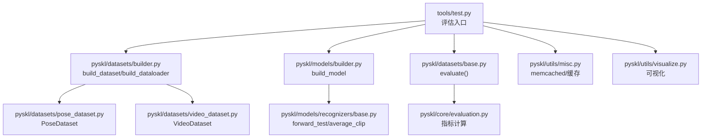
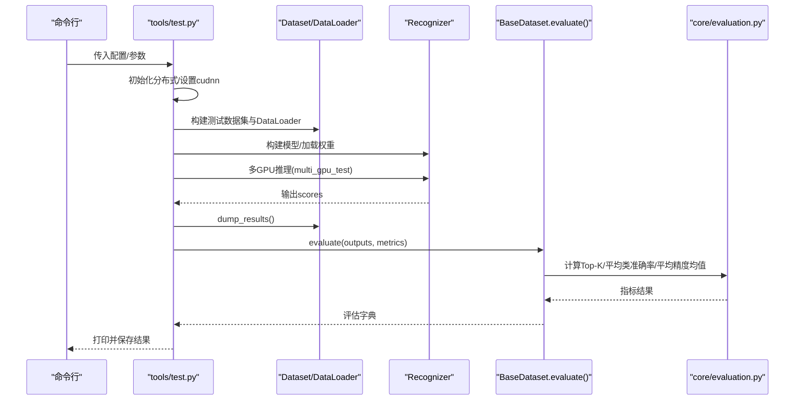
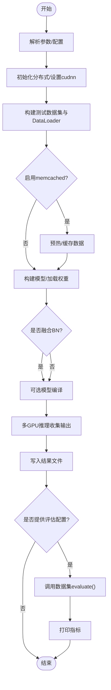
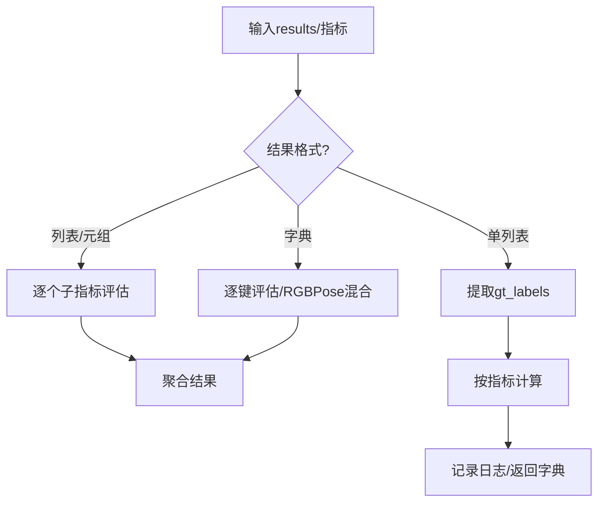
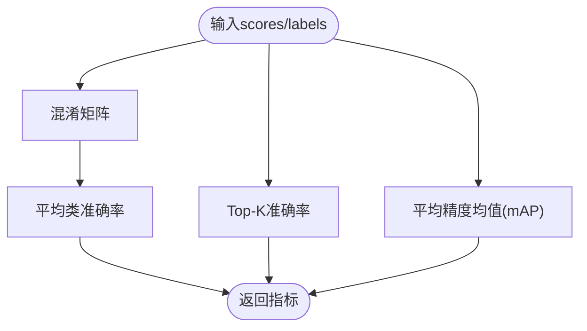
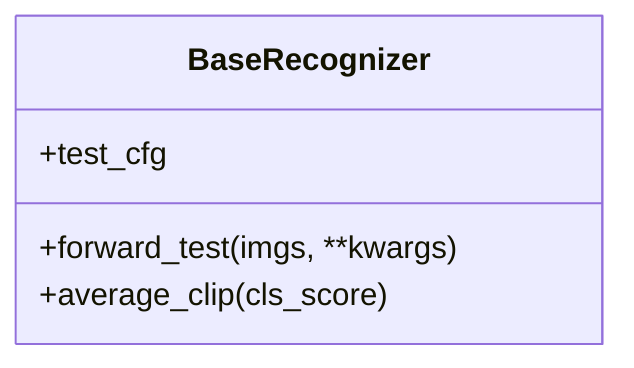
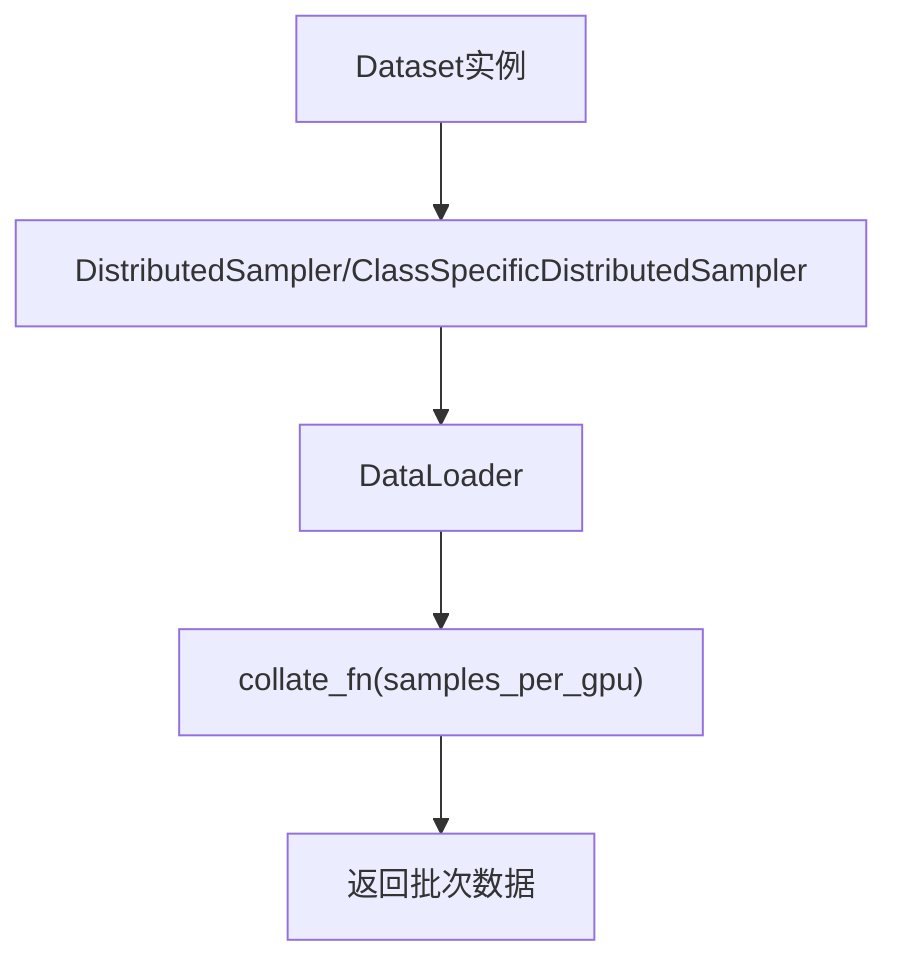
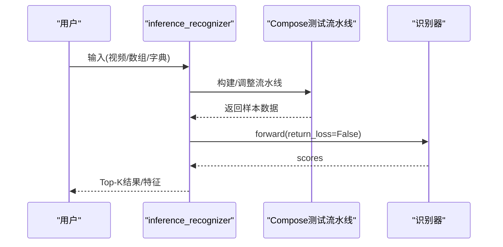
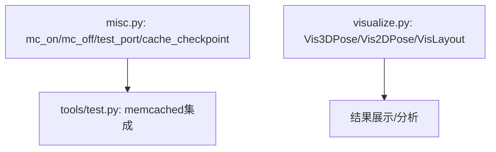
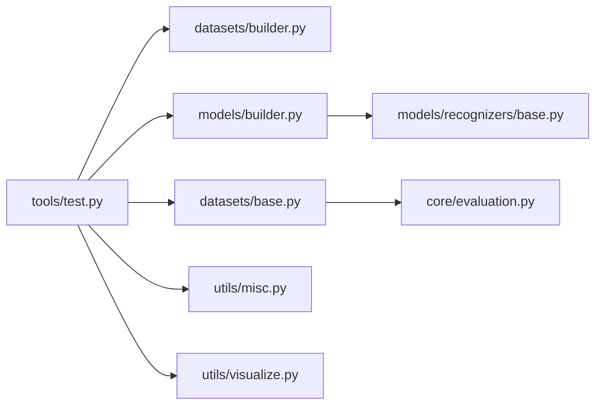

# 评估系统实现

<cite>
**本文引用的文件**
- [tools/test.py](file://tools/test.py)
- [pyskl/apis/inference.py](file://pyskl/apis/inference.py)
- [pyskl/core/evaluation.py](file://pyskl/core/evaluation.py)
- [pyskl/datasets/base.py](file://pyskl/datasets/base.py)
- [pyskl/datasets/pose_dataset.py](file://pyskl/datasets/pose_dataset.py)
- [pyskl/datasets/video_dataset.py](file://pyskl/datasets/video_dataset.py)
- [pyskl/datasets/builder.py](file://pyskl/datasets/builder.py)
- [pyskl/models/recognizers/base.py](file://pyskl/models/recognizers/base.py)
- [pyskl/models/builder.py](file://pyskl/models/builder.py)
- [pyskl/utils/misc.py](file://pyskl/utils/misc.py)
- [pyskl/utils/visualize.py](file://pyskl/utils/visualize.py)
- [configs/stgcn/stgcn_pyskl_ntu60_xsub_3dkp/b.py](file://configs/stgcn/stgcn_pyskl_ntu60_xsub_3dkp/b.py)
- [pyskl.yaml](file://pyskl.yaml)
- [demo/demo_skeleton.py](file://demo/demo_skeleton.py)
</cite>

## 目录
1. [简介](#简介)
2. [项目结构](#项目结构)
3. [核心组件](#核心组件)
4. [架构总览](#架构总览)
5. [详细组件分析](#详细组件分析)
6. [依赖关系分析](#依赖关系分析)
7. [性能考量](#性能考量)
8. [故障排查指南](#故障排查指南)
9. [结论](#结论)
10. [附录](#附录)

## 简介
本技术文档围绕PySKL评估系统实现，系统性阐述测试脚本的工作流程（模型加载、数据准备、推理执行、结果计算）、评估指标的数学定义与计算方法、不同评估阶段（最终测试、最佳模型测试、验证集评估）的实现差异、评估结果的输出格式（文本报告、可视化图表、统计分析），以及评估系统的配置选项与性能监控、调试方法。

## 项目结构
- 评估入口：tools/test.py 提供命令行入口，负责分布式初始化、数据加载、模型推理与评估。
- 推理API：pyskl/apis/inference.py 提供单视频/数组/字典输入的推理接口，支持特征抽取与Top-K结果返回。
- 评估指标：pyskl/core/evaluation.py 实现混淆矩阵、平均类准确率、Top-K准确率、平均精度均值等指标。
- 数据集基类与具体数据集：pyskl/datasets/base.py、pose_dataset.py、video_dataset.py 定义了统一的evaluate接口与数据准备流程。
- 构建器：pyskl/datasets/builder.py、pyskl/models/builder.py 提供数据加载器与模型构建的工厂方法。
- 模型识别器基类：pyskl/models/recognizers/base.py 定义测试时的平均裁剪策略与forward_test接口。
- 工具与可视化：pyskl/utils/misc.py 提供memcached启动/关闭、端口检测、检查点缓存；pyskl/utils/visualize.py 提供骨架可视化工具。
- 配置示例：configs/stgcn/stgcn_pyskl_ntu60_xsub_3dkp/b.py 展示典型配置项（模型、数据、优化器、评估间隔等）。
- 环境与依赖：pyskl.yaml 描述运行环境与依赖包版本。

**图示来源**
- [tools/test.py](file://tools/test.py#L110-L185)
- [pyskl/datasets/builder.py](file://pyskl/datasets/builder.py#L31-L124)
- [pyskl/models/builder.py](file://pyskl/models/builder.py#L12-L39)
- [pyskl/datasets/base.py](file://pyskl/datasets/base.py#L112-L241)
- [pyskl/core/evaluation.py](file://pyskl/core/evaluation.py#L39-L215)
- [pyskl/models/recognizers/base.py](file://pyskl/models/recognizers/base.py#L84-L108)
- [pyskl/datasets/pose_dataset.py](file://pyskl/datasets/pose_dataset.py#L10-L107)
- [pyskl/datasets/video_dataset.py](file://pyskl/datasets/video_dataset.py#L8-L61)
- [pyskl/utils/misc.py](file://pyskl/utils/misc.py#L18-L95)
- [pyskl/utils/visualize.py](file://pyskl/utils/visualize.py#L41-L238)

**章节来源**
- [tools/test.py](file://tools/test.py#L110-L185)
- [pyskl/datasets/builder.py](file://pyskl/datasets/builder.py#L31-L124)
- [pyskl/models/builder.py](file://pyskl/models/builder.py#L12-L39)
- [pyskl/datasets/base.py](file://pyskl/datasets/base.py#L112-L241)
- [pyskl/core/evaluation.py](file://pyskl/core/evaluation.py#L39-L215)
- [pyskl/models/recognizers/base.py](file://pyskl/models/recognizers/base.py#L84-L108)
- [pyskl/datasets/pose_dataset.py](file://pyskl/datasets/pose_dataset.py#L10-L107)
- [pyskl/datasets/video_dataset.py](file://pyskl/datasets/video_dataset.py#L8-L61)
- [pyskl/utils/misc.py](file://pyskl/utils/misc.py#L18-L95)
- [pyskl/utils/visualize.py](file://pyskl/utils/visualize.py#L41-L238)

## 核心组件
- 评估入口与控制流：tools/test.py 解析参数、构建分布式环境、构建数据加载器、调用模型推理、收集结果、写入输出并进行评估。
- 数据加载与管线：pyskl/datasets/builder.py 负责构建Dataset与DataLoader，支持分布式采样、批处理与内存锁页。
- 模型构建与推理：pyskl/models/builder.py 构建识别器；pyskl/models/recognizers/base.py 定义测试时的平均裁剪策略与forward_test。
- 评估指标：pyskl/core/evaluation.py 提供混淆矩阵、平均类准确率、Top-K准确率、平均精度均值等。
- 数据集评估接口：pyskl/datasets/base.py 的evaluate方法统一支持多模型/多模态/多任务输出，并对指标进行聚合。
- 推理API：pyskl/apis/inference.py 支持多种输入格式（视频/数组/字典），执行测试流水线并返回Top-K结果或特征。
- 工具与可视化：pyskl/utils/misc.py 提供memcached管理与检查点缓存；pyskl/utils/visualize.py 提供骨架与2D/3D可视化。

**章节来源**
- [tools/test.py](file://tools/test.py#L110-L185)
- [pyskl/datasets/builder.py](file://pyskl/datasets/builder.py#L31-L124)
- [pyskl/models/builder.py](file://pyskl/models/builder.py#L12-L39)
- [pyskl/models/recognizers/base.py](file://pyskl/models/recognizers/base.py#L84-L108)
- [pyskl/core/evaluation.py](file://pyskl/core/evaluation.py#L39-L215)
- [pyskl/datasets/base.py](file://pyskl/datasets/base.py#L112-L241)
- [pyskl/apis/inference.py](file://pyskl/apis/inference.py#L19-L184)
- [pyskl/utils/misc.py](file://pyskl/utils/misc.py#L18-L95)
- [pyskl/utils/visualize.py](file://pyskl/utils/visualize.py#L41-L238)

## 架构总览
评估系统采用“配置驱动 + 分布式推理 + 统一评估”的架构。入口脚本负责分布式初始化与数据加载，识别器在测试配置下执行平均裁剪策略，评估器对输出结果进行指标计算与汇总，最终输出文本报告与可选的可视化结果。

**图示来源**
- [tools/test.py](file://tools/test.py#L110-L185)
- [pyskl/datasets/builder.py](file://pyskl/datasets/builder.py#L31-L124)
- [pyskl/models/recognizers/base.py](file://pyskl/models/recognizers/base.py#L84-L108)
- [pyskl/datasets/base.py](file://pyskl/datasets/base.py#L112-L241)
- [pyskl/core/evaluation.py](file://pyskl/core/evaluation.py#L125-L144)

## 详细组件分析

### 评估入口与控制流（tools/test.py）
- 参数解析：支持配置文件、检查点、输出格式、融合卷积BN、评估指标、clip平均方式、分布式启动器、模型编译等。
- 分布式初始化：根据配置初始化分布式后端，设置GPU ID与cudnn基准。
- 数据加载：构建测试数据集与DataLoader，支持memcached预热与缓存。
- 模型推理：构建识别器、加载权重、可选融合BN与模型编译，使用多GPU推理收集输出。
- 结果处理：写入pickle/yaml/json；若提供评估配置，则调用数据集evaluate进行指标计算。

**图示来源**
- [tools/test.py](file://tools/test.py#L24-L185)

**章节来源**
- [tools/test.py](file://tools/test.py#L24-L185)

### 数据集与评估接口（pyskl/datasets/base.py）
- evaluate方法支持：
  - 单模型输出：[pred1, pred2, ...]
  - 多模型输出：[[pred1a, pred1b], [pred2a, pred2b], ...]
  - 多模态输出：[{'rgb': pred1, 'pose': pred1}, ...]，并支持RGBPose自动混合
- 支持指标：
  - top_k_accuracy：Top-1/Top-5等
  - mean_class_accuracy：平均类准确率
  - mean_average_precision：多标签平均精度均值
- 评估流程要点：校验结果格式与长度、提取真实标签、按指标计算并记录日志。

**图示来源**
- [pyskl/datasets/base.py](file://pyskl/datasets/base.py#L112-L241)

**章节来源**
- [pyskl/datasets/base.py](file://pyskl/datasets/base.py#L112-L241)

### 评估指标实现（pyskl/core/evaluation.py）
- 混淆矩阵：支持按行/列/整体归一化，返回混淆矩阵。
- 平均类准确率：基于混淆矩阵的每类命中与总数的平均。
- Top-K准确率：对每个样本取K个最高分，判断是否包含真实标签。
- 平均精度均值（mAP）：二分类PR曲线下的面积平均。

**图示来源**
- [pyskl/core/evaluation.py](file://pyskl/core/evaluation.py#L39-L215)

**章节来源**
- [pyskl/core/evaluation.py](file://pyskl/core/evaluation.py#L39-L215)

### 模型识别器与测试配置（pyskl/models/recognizers/base.py）
- average_clip：在测试配置下对多裁剪得分进行平均，支持按概率或分数平均，或不平均。
- forward_test：由具体识别器实现，测试时调用该接口。
- test_cfg：通过配置传递平均裁剪策略等测试相关参数。

**图示来源**
- [pyskl/models/recognizers/base.py](file://pyskl/models/recognizers/base.py#L84-L108)

**章节来源**
- [pyskl/models/recognizers/base.py](file://pyskl/models/recognizers/base.py#L84-L108)

### 数据加载与管线（pyskl/datasets/builder.py）
- build_dataset：基于注册表构建数据集实例。
- build_dataloader：支持分布式采样、类特定采样、批处理、内存锁页、持久化工作进程等。
- 采样器选择：若数据集提供class_prob则使用ClassSpecificDistributedSampler，否则使用DistributedSampler。

**图示来源**
- [pyskl/datasets/builder.py](file://pyskl/datasets/builder.py#L31-L124)

**章节来源**
- [pyskl/datasets/builder.py](file://pyskl/datasets/builder.py#L31-L124)

### 推理API（pyskl/apis/inference.py）
- init_recognizer：从配置构建识别器并加载权重，设置设备与eval模式。
- inference_recognizer：支持字典/数组/视频/原始帧目录输入，自动适配测试流水线，执行推理并返回Top-K结果或特征。

**图示来源**
- [pyskl/apis/inference.py](file://pyskl/apis/inference.py#L57-L184)

**章节来源**
- [pyskl/apis/inference.py](file://pyskl/apis/inference.py#L19-L184)

### 工具与可视化（pyskl/utils/misc.py, pyskl/utils/visualize.py）
- memcached：启动/关闭、端口检测、批量缓存、检查点缓存。
- 可视化：3D骨架动画、2D骨架绘制、布局框体可视化。

**图示来源**
- [pyskl/utils/misc.py](file://pyskl/utils/misc.py#L18-L125)
- [pyskl/utils/visualize.py](file://pyskl/utils/visualize.py#L41-L238)

**章节来源**
- [pyskl/utils/misc.py](file://pyskl/utils/misc.py#L18-L125)
- [pyskl/utils/visualize.py](file://pyskl/utils/visualize.py#L41-L238)

### 配置示例（configs/stgcn/stgcn_pyskl_ntu60_xsub_3dkp/b.py）
- 模型：GCN类识别器，backbone为STGCN，head为GCNHead。
- 数据：PoseDataset，训练/验证/测试流水线，测试时多裁剪采样。
- 优化器与学习率：SGD + CosineAnnealing。
- 评估：evaluation.interval与metrics（如top_k_accuracy）。

**章节来源**
- [configs/stgcn/stgcn_pyskl_ntu60_xsub_3dkp/b.py](file://configs/stgcn/stgcn_pyskl_ntu60_xsub_3dkp/b.py#L1-L61)

## 依赖关系分析
- 入口脚本依赖数据构建器、模型构建器、数据集基类与评估模块。
- 数据集基类依赖评估模块与流水线组件。
- 识别器基类提供测试时的平均裁剪策略。
- 工具模块为入口脚本提供分布式与缓存能力。

**图示来源**
- [tools/test.py](file://tools/test.py#L19-L21)
- [pyskl/datasets/builder.py](file://pyskl/datasets/builder.py#L31-L45)
- [pyskl/models/builder.py](file://pyskl/models/builder.py#L22-L39)
- [pyskl/datasets/base.py](file://pyskl/datasets/base.py#L15-L16)
- [pyskl/core/evaluation.py](file://pyskl/core/evaluation.py#L1-L10)
- [pyskl/models/recognizers/base.py](file://pyskl/models/recognizers/base.py#L10-L11)
- [pyskl/utils/misc.py](file://pyskl/utils/misc.py#L1-L16)
- [pyskl/utils/visualize.py](file://pyskl/utils/visualize.py#L1-L12)

**章节来源**
- [tools/test.py](file://tools/test.py#L19-L21)
- [pyskl/datasets/builder.py](file://pyskl/datasets/builder.py#L31-L45)
- [pyskl/models/builder.py](file://pyskl/models/builder.py#L22-L39)
- [pyskl/datasets/base.py](file://pyskl/datasets/base.py#L15-L16)
- [pyskl/core/evaluation.py](file://pyskl/core/evaluation.py#L1-L10)
- [pyskl/models/recognizers/base.py](file://pyskl/models/recognizers/base.py#L10-L11)
- [pyskl/utils/misc.py](file://pyskl/utils/misc.py#L1-L16)
- [pyskl/utils/visualize.py](file://pyskl/utils/visualize.py#L1-L12)

## 性能考量
- 推理加速
  - 融合BN：在tools/test.py中可通过参数启用，提升推理速度。
  - 模型编译：PyTorch 2.0及以上可使用torch.compile加速。
  - 多GPU推理：使用multi_gpu_test并行处理，提高吞吐。
- 内存与IO
  - memcached：通过utils/misc.py提供的工具启动/关闭，减少重复读取开销。
  - 批处理与锁页：DataLoader支持pin_memory与合适的workers_per_gpu。
- 评估效率
  - 评估指标计算在CPU上进行，注意避免过大的批规模导致内存峰值过高。
  - 对于多模态/多模型输出，建议在evaluate前进行必要的聚合与格式规整。

[本节为通用性能指导，无需特定文件引用]

## 故障排查指南
- 分布式初始化失败
  - 检查分布式后端配置与环境变量，确认world_size与rank正确。
- memcached无法启动
  - 使用test_port检测端口占用，必要时调用mc_on启动服务，或检查防火墙设置。
- 指标计算异常
  - 确认results与数据集长度一致；检查标签类型与维度；确保指标名称在允许列表内。
- 推理报错
  - 检查模型配置与测试流水线匹配；确认average_clips配置合法；核对输入数据格式。

**章节来源**
- [tools/test.py](file://tools/test.py#L134-L167)
- [pyskl/utils/misc.py](file://pyskl/utils/misc.py#L18-L95)
- [pyskl/datasets/base.py](file://pyskl/datasets/base.py#L136-L194)

## 结论
PySKL评估系统通过清晰的模块划分与配置驱动，实现了从数据准备到推理执行再到指标计算的完整闭环。其评估接口支持多样化的输出格式与多指标聚合，结合分布式推理与缓存机制，能够在保证准确性的同时提升评估效率。建议在实际部署中结合硬件条件合理设置批大小、平均裁剪策略与评估频率，并利用可视化工具辅助结果分析。

[本节为总结性内容，无需特定文件引用]

## 附录

### 评估指标的数学定义与计算公式
- 混淆矩阵
  - 定义：将预测与真实标签映射到统一标签空间，统计每对标签的计数。
  - 归一化：可按行/列/全量归一化。
- 平均类准确率
  - 定义：对每类的命中数除以该类样本总数，再对所有类取平均。
- Top-K准确率
  - 定义：对每个样本取K个最高分，若真实标签在其中则计为正确，最后对样本求平均。
- 平均精度均值（mAP）
  - 定义：对每个类别计算PR曲线下的面积，再对所有类别取平均。

**章节来源**
- [pyskl/core/evaluation.py](file://pyskl/core/evaluation.py#L39-L215)

### 不同评估阶段的实现差异
- 最终测试：通常在训练结束后使用最新权重进行评估，关注最终性能。
- 最佳模型测试：依据验证集上的最佳指标保存的模型进行评估，强调泛化能力。
- 验证集评估：在训练过程中定期评估，用于早停与学习率调度。

上述差异主要体现在权重选择与评估时机，入口脚本通过配置中的evaluation字段与工作目录下的latest.pth或best权重文件进行切换。

**章节来源**
- [tools/test.py](file://tools/test.py#L90-L96)
- [configs/stgcn/stgcn_pyskl_ntu60_xsub_3dkp/b.py](file://configs/stgcn/stgcn_pyskl_ntu60_xsub_3dkp/b.py#L55-L56)

### 评估结果输出格式
- 文本报告：控制台打印指标名称与数值。
- 结果文件：支持pickle/yaml/json格式，便于后续分析。
- 可视化图表：提供骨架3D/2D可视化与布局框体可视化，辅助理解模型行为。

**章节来源**
- [tools/test.py](file://tools/test.py#L115-L177)
- [pyskl/utils/visualize.py](file://pyskl/utils/visualize.py#L41-L238)

### 评估系统配置选项
- 设备与分布式：dist_params、launcher、gpu_ids。
- 批处理：videos_per_gpu、workers_per_gpu、test_dataloader覆盖。
- 评估：evaluation.metrics、evaluation.interval、save_best、rule等。
- 模型：model.test_cfg.average_clips、compile（PyTorch 2.0）。
- IO与缓存：memcached开关与mc_cfg、缓存检查点路径。

**章节来源**
- [tools/test.py](file://tools/test.py#L118-L148)
- [configs/stgcn/stgcn_pyskl_ntu60_xsub_3dkp/b.py](file://configs/stgcn/stgcn_pyskl_ntu60_xsub_3dkp/b.py#L37-L56)

### 性能监控与调试方法
- 内存使用分析：通过memcached与DataLoader的pin_memory/persistent_workers降低CPU-GPU传输延迟。
- 推理速度优化：融合BN、模型编译、多GPU推理、合理的批大小与工作进程数。
- 结果一致性检查：确保测试流水线与训练一致；对多裁剪平均策略进行对比实验。

**章节来源**
- [tools/test.py](file://tools/test.py#L87-L105)
- [pyskl/utils/misc.py](file://pyskl/utils/misc.py#L18-L95)
- [pyskl/datasets/builder.py](file://pyskl/datasets/builder.py#L56-L124)