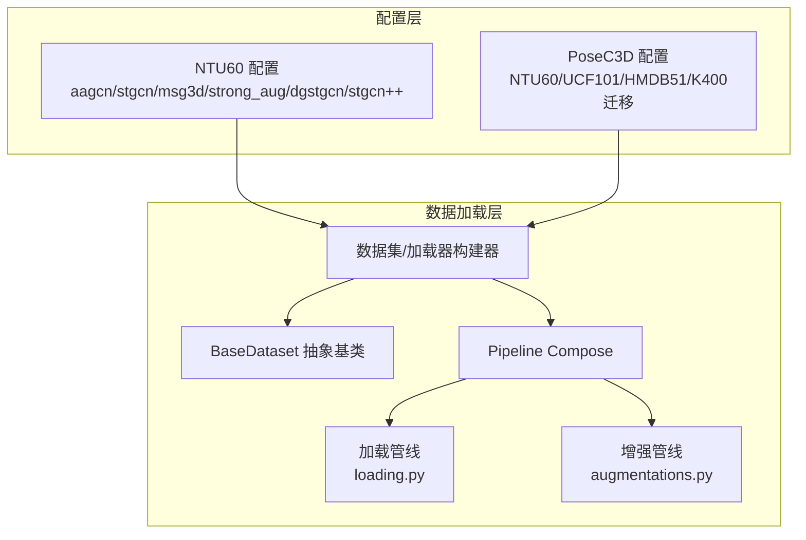
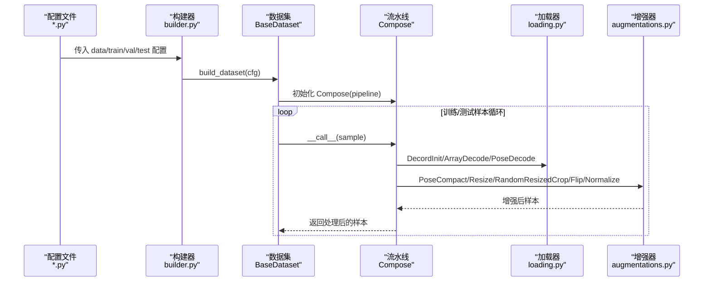
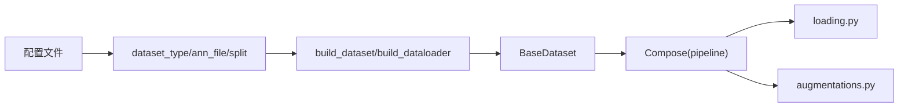

# 数据集配置

<cite>
**本文引用的文件**
- [configs/aagcn/aagcn_pyskl_ntu60_xsub_3dkp/b.py](file://configs/aagcn/aagcn_pyskl_ntu60_xsub_3dkp/b.py)
- [configs/stgcn/stgcn_pyskl_ntu60_xsub_3dkp/b.py](file://configs/stgcn/stgcn_pyskl_ntu60_xsub_3dkp/b.py)
- [configs/strong_aug/ntu60_xsub_3dkp/b.py](file://configs/strong_aug/ntu60_xsub_3dkp/b.py)
- [configs/msg3d/msg3d_pyskl_ntu60_xsub_3dkp/b.py](file://configs/msg3d/msg3d_pyskl_ntu60_xsub_3dkp/b.py)
- [configs/dgstgcn/ntu60_xsub_3dkp/b.py](file://configs/dgstgcn/ntu60_xsub_3dkp/b.py)
- [configs/stgcn++/stgcn++_ntu60_xsub_3dkp/b.py](file://configs/stgcn++/stgcn++_ntu60_xsub_3dkp/b.py)
- [configs/posec3d/slowonly_r50_ntu60_xsub/joint.py](file://configs/posec3d/slowonly_r50_ntu60_xsub/joint.py)
- [configs/posec3d/slowonly_r50_hmdb51_k400p/s1_joint.py](file://configs/posec3d/slowonly_r50_hmdb51_k400p/s1_joint.py)
- [configs/posec3d/slowonly_r50_ucf101_k400p/s1_joint.py](file://configs/posec3d/slowonly_r50_ucf101_k400p/s1_joint.py)
- [pyskl/datasets/base.py](file://pyskl/datasets/base.py)
- [pyskl/datasets/builder.py](file://pyskl/datasets/builder.py)
- [pyskl/datasets/pipelines/compose.py](file://pyskl/datasets/pipelines/compose.py)
- [pyskl/datasets/pipelines/loading.py](file://pyskl/datasets/pipelines/loading.py)
- [pyskl/datasets/pipelines/augmentations.py](file://pyskl/datasets/pipelines/augmentations.py)
- [tools/data/label_map/ucf101.txt](file://tools/data/label_map/ucf101.txt)
- [tools/data/label_map/hmdb51.txt](file://tools/data/label_map/hmdb51.txt)
- [tools/data/label_map/k400.txt](file://tools/data/label_map/k400.txt)
- [tools/data/label_map/gym.txt](file://tools/data/label_map/gym.txt)
- [tools/data/label_map/diving48.txt](file://tools/data/label_map/diving48.txt)
- [tools/data/label_map/nturgbd_120.txt](file://tools/data/label_map/nturgbd_120.txt)
- [tools/data/README.md](file://tools/data/README.md)
</cite>

## 目录
1. [简介](#简介)
2. [项目结构](#项目结构)
3. [核心组件](#核心组件)
4. [架构总览](#架构总览)
5. [详细组件分析](#详细组件分析)
6. [依赖关系分析](#依赖关系分析)
7. [性能考量](#性能考量)
8. [故障排查指南](#故障排查指南)
9. [结论](#结论)
10. [附录：配置模板与最佳实践](#附录配置模板与最佳实践)

## 简介
本文件系统性梳理 PySKL 的数据集配置体系，围绕以下目标展开：
- 解释数据集配置的关键参数：数据路径、标签映射、数据增强策略、采样与划分等
- 对比不同数据集（NTU RGB+D、Kinetics/Kinetics-400 预训练迁移、UCF101、HMDB51、Gym、Diving48、NTU120）的配置差异
- 说明训练/验证/测试划分比例与 RepeatDataset、RepeatTimes 的使用
- 总结数据预处理（归一化、裁剪、帧采样）的参数与流程
- 提供配置验证方法与常见问题解决方案
- 给出可复用的配置模板与最佳实践建议

## 项目结构
PySKL 将“模型配置”集中在 configs 下的子目录，按算法与数据集组合命名；“数据加载与管线”集中在 pyskl/datasets 下，通过 builder 注册与 Compose 组合，形成可插拔的数据预处理流水线。

图示来源
- [configs/aagcn/aagcn_pyskl_ntu60_xsub_3dkp/b.py](file://configs/aagcn/aagcn_pyskl_ntu60_xsub_3dkp/b.py#L1-L61)
- [configs/posec3d/slowonly_r50_ntu60_xsub/joint.py](file://configs/posec3d/slowonly_r50_ntu60_xsub/joint.py#L1-L80)
- [pyskl/datasets/base.py](file://pyskl/datasets/base.py#L19-L354)
- [pyskl/datasets/builder.py](file://pyskl/datasets/builder.py#L31-L134)
- [pyskl/datasets/pipelines/compose.py](file://pyskl/datasets/pipelines/compose.py#L8-L53)
- [pyskl/datasets/pipelines/loading.py](file://pyskl/datasets/pipelines/loading.py#L10-L185)
- [pyskl/datasets/pipelines/augmentations.py](file://pyskl/datasets/pipelines/augmentations.py#L16-L800)

章节来源
- [configs/aagcn/aagcn_pyskl_ntu60_xsub_3dkp/b.py](file://configs/aagcn/aagcn_pyskl_ntu60_xsub_3dkp/b.py#L1-L61)
- [configs/posec3d/slowonly_r50_ntu60_xsub/joint.py](file://configs/posec3d/slowonly_r50_ntu60_xsub/joint.py#L1-L80)
- [pyskl/datasets/base.py](file://pyskl/datasets/base.py#L19-L354)
- [pyskl/datasets/builder.py](file://pyskl/datasets/builder.py#L31-L134)
- [pyskl/datasets/pipelines/compose.py](file://pyskl/datasets/pipelines/compose.py#L8-L53)
- [pyskl/datasets/pipelines/loading.py](file://pyskl/datasets/pipelines/loading.py#L10-L185)
- [pyskl/datasets/pipelines/augmentations.py](file://pyskl/datasets/pipelines/augmentations.py#L16-L800)

## 核心组件
- 数据集配置（configs/*.py）
  - model/backbone/head 结构定义
  - dataset_type、ann_file、split 划分
  - train/val/test 的 pipeline 列表与 RepeatDataset/RepeatTimes
  - data.videos_per_gpu/workers_per_gpu、优化器/学习率/训练轮次/日志等
- 数据加载与管线（pyskl/datasets/*）
  - BaseDataset：统一的加载、评估、采样接口
  - builder：注册与构建数据集/加载器
  - pipelines/compose：流水线编排
  - pipelines/loading：视频/数组解码
  - pipelines/augmentations：姿态/图像增强（裁剪、缩放、翻转、归一化等）

章节来源
- [pyskl/datasets/base.py](file://pyskl/datasets/base.py#L19-L354)
- [pyskl/datasets/builder.py](file://pyskl/datasets/builder.py#L31-L134)
- [pyskl/datasets/pipelines/compose.py](file://pyskl/datasets/pipelines/compose.py#L8-L53)
- [pyskl/datasets/pipelines/loading.py](file://pyskl/datasets/pipelines/loading.py#L10-L185)
- [pyskl/datasets/pipelines/augmentations.py](file://pyskl/datasets/pipelines/augmentations.py#L16-L800)

## 架构总览
下面的序列图展示了从配置到数据加载与增强的整体流程：

图示来源
- [pyskl/datasets/builder.py](file://pyskl/datasets/builder.py#L31-L134)
- [pyskl/datasets/base.py](file://pyskl/datasets/base.py#L262-L354)
- [pyskl/datasets/pipelines/compose.py](file://pyskl/datasets/pipelines/compose.py#L8-L53)
- [pyskl/datasets/pipelines/loading.py](file://pyskl/datasets/pipelines/loading.py#L10-L185)
- [pyskl/datasets/pipelines/augmentations.py](file://pyskl/datasets/pipelines/augmentations.py#L16-L800)

## 详细组件分析

### NTU RGB+D（3D骨架）配置对比
- AAGCN/STGCN/MSG3D/DGSTCN/STGCN++ 在 NTU60 上的配置差异主要体现在：
  - 模型骨干（backbone）、图结构（graph_cfg）、输入格式（FormatGCNInput/num_person）
  - 训练采样策略（UniformSample/RepeatDataset/RepeatTimes）
  - 数据划分（xsub_train/xsub_val）与 RepeatTimes 的使用
- PoseC3D（HRNet 预处理）在 NTU60 上采用 Heatmap 输入格式与更丰富的图像增强

章节来源
- [configs/aagcn/aagcn_pyskl_ntu60_xsub_3dkp/b.py](file://configs/aagcn/aagcn_pyskl_ntu60_xsub_3dkp/b.py#L1-L61)
- [configs/stgcn/stgcn_pyskl_ntu60_xsub_3dkp/b.py](file://configs/stgcn/stgcn_pyskl_ntu60_xsub_3dkp/b.py#L1-L61)
- [configs/msg3d/msg3d_pyskl_ntu60_xsub_3dkp/b.py](file://configs/msg3d/msg3d_pyskl_ntu60_xsub_3dkp/b.py#L1-L61)
- [configs/dgstgcn/ntu60_xsub_3dkp/b.py](file://configs/dgstgcn/ntu60_xsub_3dkp/b.py#L1-L60)
- [configs/stgcn++/stgcn++_ntu60_xsub_3dkp/b.py](file://configs/stgcn++/stgcn++_ntu60_xsub_3dkp/b.py#L1-L64)
- [configs/posec3d/slowonly_r50_ntu60_xsub/joint.py](file://configs/posec3d/slowonly_r50_ntu60_xsub/joint.py#L1-L80)

### Kinetics/Kinetics-400 迁移（PoseC3D）
- 通过加载 K400 预训练权重（load_from），在 UCF101/HMDB51 上进行微调
- 采用 UniformSampleFrames + GeneratePoseTarget（with_kp/with_limb）生成 Heatmap
- 增强策略包含 PoseCompact、Resize、RandomResizedCrop、Flip（left_kp/right_kp）

章节来源
- [configs/posec3d/slowonly_r50_hmdb51_k400p/s1_joint.py](file://configs/posec3d/slowonly_r50_hmdb51_k400p/s1_joint.py#L1-L82)
- [configs/posec3d/slowonly_r50_ucf101_k400p/s1_joint.py](file://configs/posec3d/slowonly_r50_ucf101_k400p/s1_joint.py#L1-L82)
- [tools/data/label_map/k400.txt](file://tools/data/label_map/k400.txt)

### UCF101/HMDB51（动作分类）
- 与 Kinetics 类似，使用 HRNet 预处理与 Heatmap 目标生成
- 划分采用 train1/test1（s1_joint）
- 评估指标包含 top_k_accuracy 与 mean_class_accuracy

章节来源
- [configs/posec3d/slowonly_r50_ucf101_k400p/s1_joint.py](file://configs/posec3d/slowonly_r50_ucf101_k400p/s1_joint.py#L22-L68)
- [configs/posec3d/slowonly_r50_hmdb51_k400p/s1_joint.py](file://configs/posec3d/slowonly_r50_hmdb51_k400p/s1_joint.py#L22-L68)
- [tools/data/label_map/ucf101.txt](file://tools/data/label_map/ucf101.txt)
- [tools/data/label_map/hmdb51.txt](file://tools/data/label_map/hmdb51.txt)

### Gym/Diving48/NTU120（扩展数据集）
- Gym、Diving48、NTU120 的标签映射与数据准备见 tools/data/label_map 与工具说明
- NTU120 的标签映射文件用于区分 120 类任务

章节来源
- [tools/data/label_map/gym.txt](file://tools/data/label_map/gym.txt)
- [tools/data/label_map/diving48.txt](file://tools/data/label_map/diving48.txt)
- [tools/data/label_map/nturgbd_120.txt](file://tools/data/label_map/nturgbd_120.txt)
- [tools/data/README.md](file://tools/data/README.md)

### 数据划分与重复采样
- NTU60 的划分使用 xsub_train/xsub_val；部分配置使用 RepeatDataset 与 RepeatTimes 提升训练稳定性
- PoseC3D 的划分使用 train1/test1，并在训练中使用 RepeatDataset

章节来源
- [configs/aagcn/aagcn_pyskl_ntu60_xsub_3dkp/b.py](file://configs/aagcn/aagcn_pyskl_ntu60_xsub_3dkp/b.py#L41-L46)
- [configs/posec3d/slowonly_r50_ntu60_xsub/joint.py](file://configs/posec3d/slowonly_r50_ntu60_xsub/joint.py#L63-L68)
- [configs/posec3d/slowonly_r50_hmdb51_k400p/s1_joint.py](file://configs/posec3d/slowonly_r50_hmdb51_k400p/s1_joint.py#L63-L68)
- [configs/posec3d/slowonly_r50_ucf101_k400p/s1_joint.py](file://configs/posec3d/slowonly_r50_ucf101_k400p/s1_joint.py#L63-L68)

### 数据预处理与增强参数
- 归一化：Normalize（支持 RGB/Flow，可调整通道顺序与幅度）
- 裁剪与缩放：PoseCompact、Resize、RandomResizedCrop、CenterCrop、ThreeCrop
- 翻转：Flip（支持左右关键点交换）
- 姿态特征：GeneratePoseTarget（with_kp/with_limb/double）、FormatShape（NCTHW_Heatmap）
- 视频解码：DecordInit/DecordDecode、ArrayDecode

章节来源
- [pyskl/datasets/pipelines/augmentations.py](file://pyskl/datasets/pipelines/augmentations.py#L16-L800)
- [pyskl/datasets/pipelines/loading.py](file://pyskl/datasets/pipelines/loading.py#L10-L185)

### 数据加载器与分布式采样
- builder.build_dataloader 支持分布式采样器、打乱、持久化工作进程、批次合并等
- 若数据集具备 class_prob，则使用类别特定采样器

章节来源
- [pyskl/datasets/builder.py](file://pyskl/datasets/builder.py#L48-L134)

## 依赖关系分析
- 配置文件依赖于数据集类型（PoseDataset）与 ann_file（标注文件）
- BaseDataset 负责加载标注、评估指标、采样与流水线执行
- builder 负责注册与构建数据集/加载器
- pipelines/compose 将若干 transform 组合为流水线

图示来源
- [pyskl/datasets/builder.py](file://pyskl/datasets/builder.py#L31-L134)
- [pyskl/datasets/base.py](file://pyskl/datasets/base.py#L19-L354)
- [pyskl/datasets/pipelines/compose.py](file://pyskl/datasets/pipelines/compose.py#L8-L53)
- [pyskl/datasets/pipelines/loading.py](file://pyskl/datasets/pipelines/loading.py#L10-L185)
- [pyskl/datasets/pipelines/augmentations.py](file://pyskl/datasets/pipelines/augmentations.py#L16-L800)

章节来源
- [pyskl/datasets/builder.py](file://pyskl/datasets/builder.py#L31-L134)
- [pyskl/datasets/base.py](file://pyskl/datasets/base.py#L19-L354)
- [pyskl/datasets/pipelines/compose.py](file://pyskl/datasets/pipelines/compose.py#L8-L53)
- [pyskl/datasets/pipelines/loading.py](file://pyskl/datasets/pipelines/loading.py#L10-L185)
- [pyskl/datasets/pipelines/augmentations.py](file://pyskl/datasets/pipelines/augmentations.py#L16-L800)

## 性能考量
- 批大小与工作进程：videos_per_gpu、workers_per_gpu 需结合显存与 CPU 资源平衡
- 分布式训练：DistributedSampler 保证各进程均匀采样
- 持久化工作进程：persistent_workers 可减少每轮 epoch 的进程重启开销
- 增强顺序：先姿态压缩与裁剪，再图像增强，有助于保持关键点空间一致性
- 采样策略：UniformSample/UniformSampleFrames 与 RepeatDataset/RepeatTimes 可提升泛化能力

[本节为通用指导，无需列出具体文件来源]

## 故障排查指南
- 标注文件路径错误
  - 现象：无法加载标注或类别数不匹配
  - 排查：确认 ann_file 路径存在且与数据集划分一致
- 关键点维度不匹配
  - 现象：FormatGCNInput/GeneratePoseTarget 报错
  - 排查：核对 num_person、layout/mode 与数据预处理流程
- 分布式训练报错
  - 现象：采样或评估异常
  - 排查：确认 world_size/rank 与分布式采样器配置
- 增强参数越界
  - 现象：Resize/RandomResizedCrop 报错
  - 排查：确保 scale/area_range/aspect_ratio_range 合理
- 预训练权重加载失败
  - 现象：load_from 无法下载或形状不匹配
  - 排查：确认网络连通、权重 URL 正确、类别数一致

章节来源
- [pyskl/datasets/base.py](file://pyskl/datasets/base.py#L112-L241)
- [pyskl/datasets/builder.py](file://pyskl/datasets/builder.py#L85-L124)
- [pyskl/datasets/pipelines/augmentations.py](file://pyskl/datasets/pipelines/augmentations.py#L368-L474)

## 结论
- PySKL 的数据集配置以“配置文件 + 数据管线 + 抽象数据集”的方式实现高内聚低耦合
- 不同数据集（NTU、UCF101、HMDB51、K400 迁移）在标注格式、增强策略与划分方式上存在差异
- 通过 RepeatDataset/RepeatTimes、分布式采样与合理的批大小设置，可在不同规模数据集上取得稳定性能

[本节为总结，无需列出具体文件来源]

## 附录：配置模板与最佳实践

### NTU RGB+D（3D骨架）模板要点
- backbone/graph_cfg/layout/mode 与数据预处理（PreNormalize3D、GenSkeFeat、UniformSample、PoseDecode、FormatGCNInput）
- 划分：xsub_train/xsub_val
- 重复采样：RepeatDataset + RepeatTimes（如 5/10）
- 评估：top_k_accuracy

章节来源
- [configs/aagcn/aagcn_pyskl_ntu60_xsub_3dkp/b.py](file://configs/aagcn/aagcn_pyskl_ntu60_xsub_3dkp/b.py#L10-L46)
- [configs/stgcn/stgcn_pyskl_ntu60_xsub_3dkp/b.py](file://configs/stgcn/stgcn_pyskl_ntu60_xsub_3dkp/b.py#L10-L46)
- [configs/msg3d/msg3d_pyskl_ntu60_xsub_3dkp/b.py](file://configs/msg3d/msg3d_pyskl_ntu60_xsub_3dkp/b.py#L10-L46)
- [configs/dgstgcn/ntu60_xsub_3dkp/b.py](file://configs/dgstgcn/ntu60_xsub_3dkp/b.py#L18-L49)
- [configs/stgcn++/stgcn++_ntu60_xsub_3dkp/b.py](file://configs/stgcn++/stgcn++_ntu60_xsub_3dkp/b.py#L13-L49)

### PoseC3D（HRNet 预处理 + Heatmap）模板要点
- 采样：UniformSampleFrames（clip_len）
- 预处理：PoseDecode、PoseCompact、Resize、RandomResizedCrop、Flip
- 目标生成：GeneratePoseTarget（with_kp/with_limb/double）、FormatShape（NCTHW_Heatmap）
- 划分：train1/test1
- 迁移：load_from 指向 K400 权重

章节来源
- [configs/posec3d/slowonly_r50_ntu60_xsub/joint.py](file://configs/posec3d/slowonly_r50_ntu60_xsub/joint.py#L26-L68)
- [configs/posec3d/slowonly_r50_hmdb51_k400p/s1_joint.py](file://configs/posec3d/slowonly_r50_hmdb51_k400p/s1_joint.py#L26-L68)
- [configs/posec3d/slowonly_r50_ucf101_k400p/s1_joint.py](file://configs/posec3d/slowonly_r50_ucf101_k400p/s1_joint.py#L26-L68)

### 数据划分与重复采样最佳实践
- 小数据集（如 HMDB51/UCF101）：使用 RepeatDataset + RepeatTimes（如 10）提升样本多样性
- 大数据集（如 NTU60）：可适度降低 RepeatTimes（如 5），避免过拟合
- 划分：尽量使用官方划分（xsub_train/xsub_val 或 train1/test1）

章节来源
- [configs/posec3d/slowonly_r50_ntu60_xsub/joint.py](file://configs/posec3d/slowonly_r50_ntu60_xsub/joint.py#L63-L68)
- [configs/posec3d/slowonly_r50_hmdb51_k400p/s1_joint.py](file://configs/posec3d/slowonly_r50_hmdb51_k400p/s1_joint.py#L63-L68)
- [configs/posec3d/slowonly_r50_ucf101_k400p/s1_joint.py](file://configs/posec3d/slowonly_r50_ucf101_k400p/s1_joint.py#L63-L68)

### 增强策略与归一化最佳实践
- 姿态增强：先 PoseCompact/Resize，再 RandomResizedCrop/Flip，最后 Normalize
- 图像增强：注意 Flip 的方向与左右关键点映射（left_kp/right_kp）
- 归一化：RGB 使用 ImageNet 均值/方差；Flow 需考虑幅度调整（adjust_magnitude）

章节来源
- [pyskl/datasets/pipelines/augmentations.py](file://pyskl/datasets/pipelines/augmentations.py#L16-L800)

### 配置验证清单
- 确认 dataset_type 与 ann_file 存在且可读
- 确认 pipeline 中 transform 顺序合理
- 确认划分 split 与数据集一致（xsub_train/xsub_val 或 train1/test1）
- 确认 RepeatDataset/RepeatTimes 设置与数据规模匹配
- 确认分布式训练时的采样器与 world_size 配置

章节来源
- [pyskl/datasets/builder.py](file://pyskl/datasets/builder.py#L85-L124)
- [pyskl/datasets/base.py](file://pyskl/datasets/base.py#L112-L241)