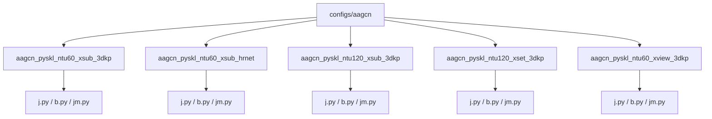
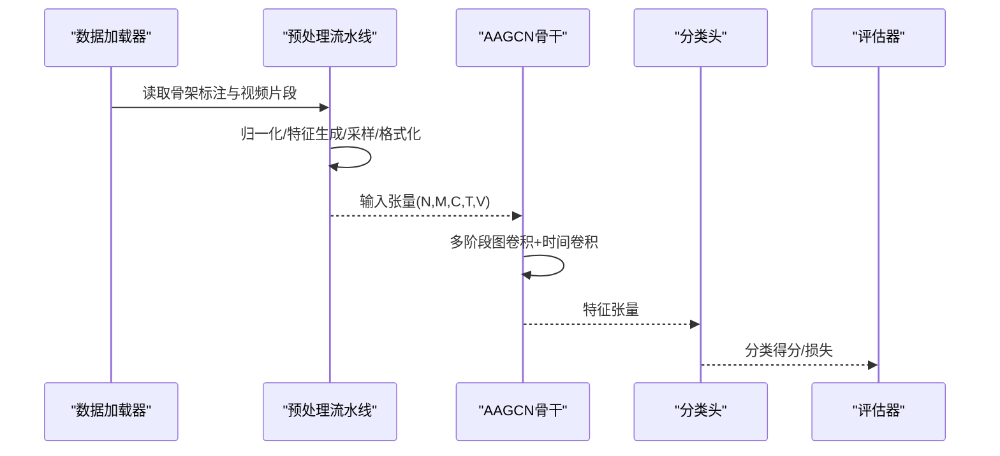
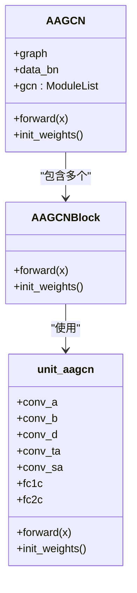
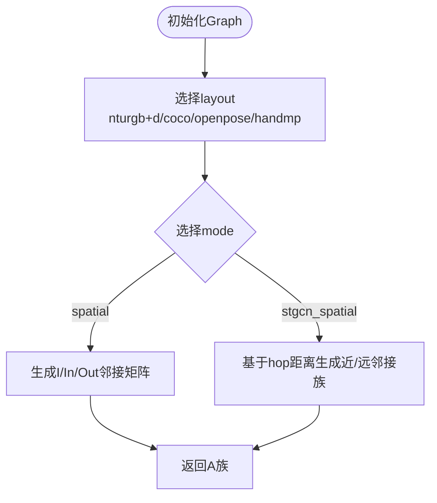
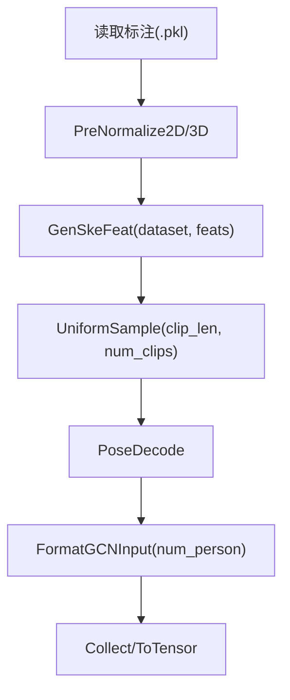
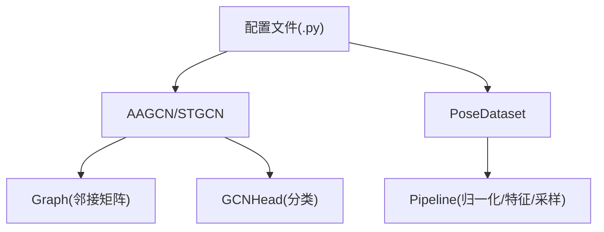

# AAGCN算法配置模板

<cite>
**本文引用的文件**
- [configs/aagcn/README.md](file://configs/aagcn/README.md)
- [configs/aagcn/aagcn_pyskl_ntu60_xsub_3dkp/j.py](file://configs/aagcn/aagcn_pyskl_ntu60_xsub_3dkp/j.py)
- [configs/aagcn/aagcn_pyskl_ntu60_xsub_3dkp/b.py](file://configs/aagcn/aagcn_pyskl_ntu60_xsub_3dkp/b.py)
- [configs/aagcn/aagcn_pyskl_ntu60_xsub_3dkp/jm.py](file://configs/aagcn/aagcn_pyskl_ntu60_xsub_3dkp/jm.py)
- [configs/aagcn/aagcn_pyskl_ntu60_xsub_hrnet/j.py](file://configs/aagcn/aagcn_pyskl_ntu60_xsub_hrnet/j.py)
- [configs/aagcn/aagcn_pyskl_ntu60_xsub_hrnet/b.py](file://configs/aagcn/aagcn_pyskl_ntu60_xsub_hrnet/b.py)
- [configs/aagcn/aagcn_pyskl_ntu60_xsub_hrnet/jm.py](file://configs/aagcn/aagcn_pyskl_ntu60_xsub_hrnet/jm.py)
- [pyskl/models/gcns/aagcn.py](file://pyskl/models/gcns/aagcn.py)
- [pyskl/models/gcns/utils/gcn.py](file://pyskl/models/gcns/utils/gcn.py)
- [pyskl/utils/graph.py](file://pyskl/utils/graph.py)
- [pyskl/datasets/pose_dataset.py](file://pyskl/datasets/pose_dataset.py)
- [pyskl/models/recognizers/recognizergcn.py](file://pyskl/models/recognizers/recognizergcn.py)
- [configs/stgcn/stgcn_pyskl_ntu60_xsub_3dkp/j.py](file://configs/stgcn/stgcn_pyskl_ntu60_xsub_3dkp/j.py)
- [configs/stgcn/stgcn_pyskl_ntu60_xsub_hrnet/j.py](file://configs/stgcn/stgcn_pyskl_ntu60_xsub_hrnet/j.py)
- [pyskl/models/gcns/stgcn.py](file://pyskl/models/gcns/stgcn.py)
</cite>

## 目录
1. [简介](#简介)
2. [项目结构](#项目结构)
3. [核心组件](#核心组件)
4. [架构总览](#架构总览)
5. [详细组件分析](#详细组件分析)
6. [依赖关系分析](#依赖关系分析)
7. [性能与训练配置要点](#性能与训练配置要点)
8. [故障排查指南](#故障排查指南)
9. [结论](#结论)
10. [附录：配置模板与参数对照表](#附录配置模板与参数对照表)

## 简介
本文件面向AAGCN（自适应图卷积网络）在骨架动作识别任务中的配置使用与优化，系统梳理了以下内容：
- 自适应图构建机制的配置选项与实现要点（图学习参数、邻接矩阵更新策略）
- 数据集划分（NTU RGB+D XSub/XView/XSet）与姿态估计来源（3DKP、HRNet）对配置的影响
- 注意力机制、图卷积层深度、通道数等关键超参数的设置建议
- AAGCN与ST-GCN等GCN算法的配置对比与性能基准参考
- 基于仓库现有配置的可复现实验流程与常见问题排查

## 项目结构
AAGCN配置位于configs/aagcn目录下，按数据集划分与姿态估计方式组织，典型结构如下：
- aagcn_pyskl_ntu60_xsub_3dkp：NTU RGB+D 60类XSub划分 + 官方3D骨架（3DKP）
- aagcn_pyskl_ntu60_xsub_hrnet：NTU RGB+D 60类XSub划分 + HRNet 2D骨架（COCO布局）
- 同理存在xview/xset与120类版本
- 每个子目录包含j.py（仅关节）、b.py（仅骨骼）、jm.py（关节运动）等配置变体

图表来源
- [configs/aagcn/README.md](file://configs/aagcn/README.md#L21-L35)

章节来源
- [configs/aagcn/README.md](file://configs/aagcn/README.md#L1-L59)

## 核心组件
- 模型主体：AAGCN骨干网络，支持多阶段图卷积与时间卷积堆叠，具备自适应图与注意力模块
- 图构建：Graph类根据layout与mode生成邻接矩阵族，支持spatial与stgcn_spatial两种模式
- 数据管线：PoseDataset加载骨架标注，配合Pipeline完成归一化、特征生成、采样与输入格式化
- 识别器：RecognizerGCN作为骨架识别统一入口，负责前向、损失与测试聚合

章节来源
- [pyskl/models/gcns/aagcn.py](file://pyskl/models/gcns/aagcn.py#L48-L131)
- [pyskl/utils/graph.py](file://pyskl/utils/graph.py#L58-L175)
- [pyskl/datasets/pose_dataset.py](file://pyskl/datasets/pose_dataset.py#L10-L107)
- [pyskl/models/recognizers/recognizergcn.py](file://pyskl/models/recognizers/recognizergcn.py#L8-L97)

## 架构总览
AAGCN整体数据流从骨架序列输入到特征提取再到分类头输出，关键路径如下：

图表来源
- [pyskl/models/recognizers/recognizergcn.py](file://pyskl/models/recognizers/recognizergcn.py#L12-L25)
- [pyskl/models/gcns/aagcn.py](file://pyskl/models/gcns/aagcn.py#L116-L130)

## 详细组件分析

### AAGCN骨干网络与图卷积单元
- AAGCNBlock：封装一个图卷积单元与时间卷积单元，支持残差连接与步幅控制
- AAGCN：构建多阶段骨干，支持MVC或VC数据批归一化，动态通道膨胀与下采样
- unit_aagcn：核心图卷积单元，支持自适应邻接矩阵A与空间-时间-通道注意力

图表来源
- [pyskl/models/gcns/aagcn.py](file://pyskl/models/gcns/aagcn.py#L11-L46)
- [pyskl/models/gcns/aagcn.py](file://pyskl/models/gcns/aagcn.py#L48-L131)
- [pyskl/models/gcns/utils/gcn.py](file://pyskl/models/gcns/utils/gcn.py#L87-L199)

章节来源
- [pyskl/models/gcns/aagcn.py](file://pyskl/models/gcns/aagcn.py#L48-L131)
- [pyskl/models/gcns/utils/gcn.py](file://pyskl/models/gcns/utils/gcn.py#L87-L199)

### 图构建与邻接矩阵族
- Graph类支持多种layout（nturgb+d、coco、openpose、handmp），并根据mode生成邻接矩阵族
- mode='spatial'：返回I、inward、outward三类邻接矩阵堆叠
- mode='stgcn_spatial'：基于hop距离构造近/远邻接矩阵族，用于ST-GCN风格的空间金字塔

图表来源
- [pyskl/utils/graph.py](file://pyskl/utils/graph.py#L58-L175)

章节来源
- [pyskl/utils/graph.py](file://pyskl/utils/graph.py#L58-L175)

### 数据管线与姿态估计来源
- 3DKP（官方3D骨架）：layout='nturgb+d'，feats=['j'|'b'|'jm']
- HRNet（COCO布局2D骨架）：layout='coco'，feats=['j'|'b'|'jm']
- Pipeline关键步骤：PreNormalize（2D/3D）、GenSkeFeat、UniformSample、PoseDecode、FormatGCNInput、ToTensor

图表来源
- [configs/aagcn/aagcn_pyskl_ntu60_xsub_3dkp/j.py](file://configs/aagcn/aagcn_pyskl_ntu60_xsub_3dkp/j.py#L10-L18)
- [configs/aagcn/aagcn_pyskl_ntu60_xsub_hrnet/j.py](file://configs/aagcn/aagcn_pyskl_ntu60_xsub_hrnet/j.py#L10-L18)

章节来源
- [configs/aagcn/aagcn_pyskl_ntu60_xsub_3dkp/j.py](file://configs/aagcn/aagcn_pyskl_ntu60_xsub_3dkp/j.py#L8-L36)
- [configs/aagcn/aagcn_pyskl_ntu60_xsub_hrnet/j.py](file://configs/aagcn/aagcn_pyskl_ntu60_xsub_hrnet/j.py#L8-L36)

### 训练与测试配置要点
- 优化器：SGD（momentum=0.9，weight_decay=0.0005，nesterov=True）
- 学习率：余弦退火（min_lr=0，by_epoch=False）
- 训练周期：16轮（total_epochs=16）
- 日志与验证：定期评估top_k_accuracy，记录日志

章节来源
- [configs/aagcn/aagcn_pyskl_ntu60_xsub_3dkp/j.py](file://configs/aagcn/aagcn_pyskl_ntu60_xsub_3dkp/j.py#L48-L56)
- [configs/aagcn/aagcn_pyskl_ntu60_xsub_3dkp/b.py](file://configs/aagcn/aagcn_pyskl_ntu60_xsub_3dkp/b.py#L48-L56)
- [configs/aagcn/aagcn_pyskl_ntu60_xsub_3dkp/jm.py](file://configs/aagcn/aagcn_pyskl_ntu60_xsub_3dkp/jm.py#L48-L56)

### AAGCN与ST-GCN配置对比
- AAGCN：backbone.type='AAGCN'，graph_cfg.mode='spatial'；带自适应图与注意力
- ST-GCN：backbone.type='STGCN'，graph_cfg.mode='stgcn_spatial'；标准GCN单元
- 两者均使用相同的Pipeline与训练策略，便于公平对比

章节来源
- [configs/stgcn/stgcn_pyskl_ntu60_xsub_3dkp/j.py](file://configs/stgcn/stgcn_pyskl_ntu60_xsub_3dkp/j.py#L1-L6)
- [configs/stgcn/stgcn_pyskl_ntu60_xsub_hrnet/j.py](file://configs/stgcn/stgcn_pyskl_ntu60_xsub_hrnet/j.py#L1-L6)
- [pyskl/models/gcns/stgcn.py](file://pyskl/models/gcns/stgcn.py#L56-L138)

## 依赖关系分析
- 配置文件依赖：模型定义（AAGCN/STGCN）、图构建（Graph）、数据集（PoseDataset）、识别器（RecognizerGCN）
- 关键耦合点：
  - graph_cfg.layout与mode决定邻接矩阵族
  - GenSkeFeat的dataset与feats决定输入模态（j/b/jm）
  - FormatGCNInput的num_person影响批归一化与输入形状

图表来源
- [pyskl/models/gcns/aagcn.py](file://pyskl/models/gcns/aagcn.py#L63-L65)
- [pyskl/datasets/pose_dataset.py](file://pyskl/datasets/pose_dataset.py#L10-L107)
- [pyskl/models/recognizers/recognizergcn.py](file://pyskl/models/recognizers/recognizergcn.py#L8-L97)

## 性能与训练配置要点
- 学习率缩放：初始学习率与batch size呈线性关系，调整batch size需同步调整LR
- 融合策略：Two-Stream采用1:1融合（关节:骨骼），Four-Stream采用2:2:1:1（关节:骨骼:关节运动:骨骼运动）
- 数据增强与重复采样：训练集可使用RepeatDataset进行数据放大
- 测试策略：支持多次采样（num_clips）与平均聚合（average_clips）

章节来源
- [configs/aagcn/README.md](file://configs/aagcn/README.md#L36-L40)
- [configs/aagcn/aagcn_pyskl_ntu60_xsub_3dkp/j.py](file://configs/aagcn/aagcn_pyskl_ntu60_xsub_3dkp/j.py#L41-L46)

## 故障排查指南
- 形状不匹配：确保FormatGCNInput的num_person与实际标注一致，避免MVC/VC批归一化维度错误
- 邻接矩阵异常：检查graph_cfg.layout与mode是否与数据骨架布局一致（nturgb+d vs coco）
- 特征生成错误：确认GenSkeFeat的dataset与feats与配置一致（3DKP或HRNet）
- 训练不稳定：适当降低学习率或增大batch size，检查余弦退火策略与warmup设置

章节来源
- [pyskl/models/gcns/aagcn.py](file://pyskl/models/gcns/aagcn.py#L77-L82)
- [configs/aagcn/aagcn_pyskl_ntu60_xsub_3dkp/j.py](file://configs/aagcn/aagcn_pyskl_ntu60_xsub_3dkp/j.py#L10-L18)

## 结论
AAGCN通过自适应图与多维注意力显著提升了骨架动作识别性能。配置层面的关键在于：
- 正确设置graph_cfg.layout/mode以匹配姿态估计来源
- 明确GenSkeFeat的feats以选择关节/骨骼/运动模态
- 合理设置num_person、batch size与学习率策略
- 对比ST-GCN等基线时保持Pipeline与训练策略一致，以便公平评估

## 附录：配置模板与参数对照表
- 模型与图配置
  - backbone.type：AAGCN
  - graph_cfg.layout：nturgb+d 或 coco
  - graph_cfg.mode：spatial
  - cls_head：GCNHead，num_classes依据数据集设定，in_channels通常为256
- 数据与管道
  - dataset_type：PoseDataset
  - ann_file：对应NTU标注文件
  - train/val/test pipeline：PreNormalize（2D/3D）、GenSkeFeat（dataset, feats）、UniformSample、PoseDecode、FormatGCNInput、Collect/ToTensor
  - data.videos_per_gpu、workers_per_gpu、test_dataloader.videos_per_gpu
- 训练与评估
  - optimizer：SGD（momentum=0.9，weight_decay=0.0005，nesterov=True）
  - lr_config：CosineAnnealing（min_lr=0，by_epoch=False）
  - total_epochs：16
  - evaluation：top_k_accuracy
  - log_config：TextLoggerHook

章节来源
- [configs/aagcn/aagcn_pyskl_ntu60_xsub_3dkp/j.py](file://configs/aagcn/aagcn_pyskl_ntu60_xsub_3dkp/j.py#L1-L61)
- [configs/aagcn/aagcn_pyskl_ntu60_xsub_3dkp/b.py](file://configs/aagcn/aagcn_pyskl_ntu60_xsub_3dkp/b.py#L1-L61)
- [configs/aagcn/aagcn_pyskl_ntu60_xsub_3dkp/jm.py](file://configs/aagcn/aagcn_pyskl_ntu60_xsub_3dkp/jm.py#L1-L61)
- [configs/aagcn/aagcn_pyskl_ntu60_xsub_hrnet/j.py](file://configs/aagcn/aagcn_pyskl_ntu60_xsub_hrnet/j.py#L1-L61)
- [configs/aagcn/aagcn_pyskl_ntu60_xsub_hrnet/b.py](file://configs/aagcn/aagcn_pyskl_ntu60_xsub_hrnet/b.py#L1-L61)
- [configs/aagcn/aagcn_pyskl_ntu60_xsub_hrnet/jm.py](file://configs/aagcn/aagcn_pyskl_ntu60_xsub_hrnet/jm.py#L1-L61)