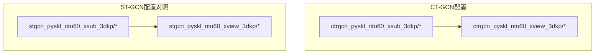
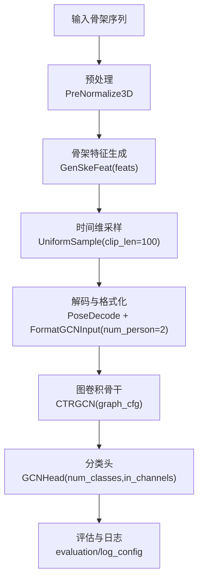
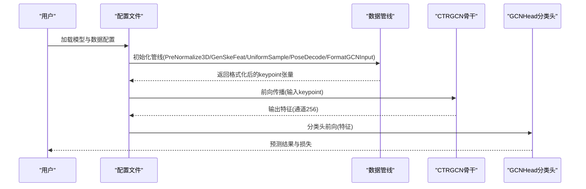
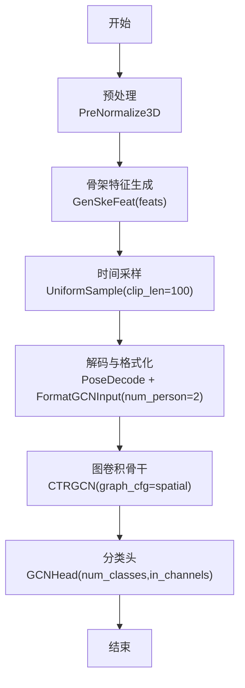
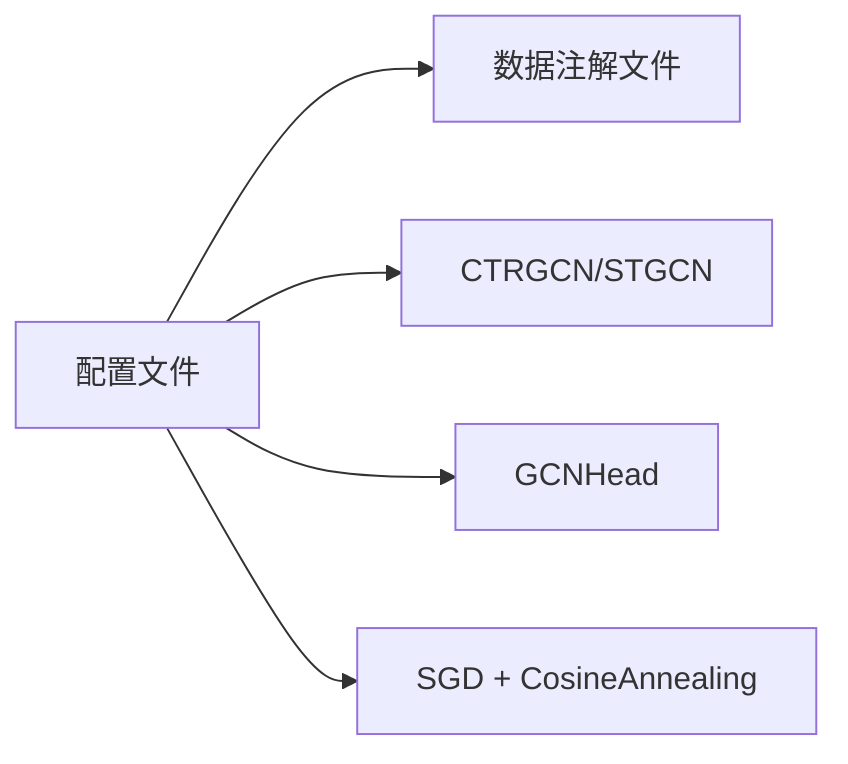

# CT-GCN算法配置模板

<cite>
**本文档引用的文件**
- [ctrgcn_pyskl_ntu60_xsub_3dkp/b.py](file://configs/ctrgcn/ctrgcn_pyskl_ntu60_xsub_3dkp/b.py)
- [ctrgcn_pyskl_ntu60_xsub_3dkp/j.py](file://configs/ctrgcn/ctrgcn_pyskl_ntu60_xsub_3dkp/j.py)
- [ctrgcn_pyskl_ntu60_xsub_3dkp/jm.py](file://configs/ctrgcn/ctrgcn_pyskl_ntu60_xsub_3dkp/jm.py)
- [ctrgcn_pyskl_ntu60_xsub_3dkp/bm.py](file://configs/ctrgcn/ctrgcn_pyskl_ntu60_xsub_3dkp/bm.py)
- [ctrgcn_pyskl_ntu60_xview_3dkp/b.py](file://configs/ctrgcn/ctrgcn_pyskl_ntu60_xview_3dkp/b.py)
- [ctrgcn_pyskl_ntu60_xview_3dkp/j.py](file://configs/ctrgcn/ctrgcn_pyskl_ntu60_xview_3dkp/j.py)
- [ctrgcn_pyskl_ntu60_xview_3dkp/jm.py](file://configs/ctrgcn/ctrgcn_pyskl_ntu60_xview_3dkp/jm.py)
- [ctrgcn_pyskl_ntu60_xview_3dkp/bm.py](file://configs/ctrgcn/ctrgcn_pyskl_ntu60_xview_3dkp/bm.py)
- [stgcn_pyskl_ntu60_xsub_3dkp/b.py](file://configs/stgcn/stgcn_pyskl_ntu60_xsub_3dkp/b.py)
- [stgcn_pyskl_ntu60_xsub_3dkp/j.py](file://configs/stgcn/stgcn_pyskl_ntu60_xsub_3dkp/j.py)
- [stgcn_pyskl_ntu60_xsub_3dkp/jm.py](file://configs/stgcn/stgcn_pyskl_ntu60_xsub_3dkp/jm.py)
- [stgcn_pyskl_ntu60_xsub_3dkp/bm.py](file://configs/stgcn/stgcn_pyskl_ntu60_xsub_3dkp/bm.py)
- [stgcn_pyskl_ntu60_xview_3dkp/b.py](file://configs/stgcn/stgcn_pyskl_ntu60_xview_3dkp/b.py)
- [stgcn_pyskl_ntu60_xview_3dkp/j.py](file://configs/stgcn/stgcn_pyskl_ntu60_xview_3dkp/j.py)
- [stgcn_pyskl_ntu60_xview_3dkp/jm.py](file://configs/stgcn/stgcn_pyskl_ntu60_xview_3dkp/jm.py)
- [stgcn_pyskl_ntu60_xview_3dkp/bm.py](file://configs/stgcn/stgcn_pyskl_ntu60_xview_3dkp/bm.py)
</cite>

## 目录
1. [简介](#简介)
2. [项目结构](#项目结构)
3. [核心组件](#核心组件)
4. [架构总览](#架构总览)
5. [详细组件分析](#详细组件分析)
6. [依赖关系分析](#依赖关系分析)
7. [性能考虑](#性能考虑)
8. [故障排查指南](#故障排查指南)
9. [结论](#结论)
10. [附录](#附录)

## 简介
本文件面向CT-GCN（跨时空图卷积网络）的配置模板与使用实践，系统梳理模型配置参数、时空建模机制、注意力配置选项、通道分离与混合操作的配置要点，并对NTU数据集在xsub、xview、xset划分下的配置差异进行对比分析。同时，结合仓库中提供的训练配置，给出在不同硬件平台上的性能与内存占用参考建议。

## 项目结构
本仓库采用“按算法+数据集+特征类型”的层次化配置组织方式，CT-GCN相关配置集中在ctrgcn目录下，ST-GCN作为对照组位于stgcn目录。每个子目录包含若干特征组合（如b、j、jm、bm）的配置文件，分别对应不同的骨架特征输入策略。

**图表来源**
- [ctrgcn_pyskl_ntu60_xsub_3dkp/b.py](file://configs/ctrgcn/ctrgcn_pyskl_ntu60_xsub_3dkp/b.py#L1-L61)
- [ctrgcn_pyskl_ntu60_xview_3dkp/b.py](file://configs/ctrgcn/ctrgcn_pyskl_ntu60_xview_3dkp/b.py#L1-L61)
- [stgcn_pyskl_ntu60_xsub_3dkp/b.py](file://configs/stgcn/stgcn_pyskl_ntu60_xsub_3dkp/b.py#L1-L61)
- [stgcn_pyskl_ntu60_xview_3dkp/b.py](file://configs/stgcn/stgcn_pyskl_ntu60_xview_3dkp/b.py#L1-L61)

**章节来源**
- [ctrgcn_pyskl_ntu60_xsub_3dkp/b.py](file://configs/ctrgcn/ctrgcn_pyskl_ntu60_xsub_3dkp/b.py#L1-L61)
- [ctrgcn_pyskl_ntu60_xview_3dkp/b.py](file://configs/ctrgcn/ctrgcn_pyskl_ntu60_xview_3dkp/b.py#L1-L61)
- [stgcn_pyskl_ntu60_xsub_3dkp/b.py](file://configs/stgcn/stgcn_pyskl_ntu60_xsub_3dkp/b.py#L1-L61)
- [stgcn_pyskl_ntu60_xview_3dkp/b.py](file://configs/stgcn/stgcn_pyskl_ntu60_xview_3dkp/b.py#L1-L61)

## 核心组件
- 模型主体：识别器（RecognizerGCN），后端为图卷积骨干网络（CTRGCN 或 STGCN），分类头（GCNHead）
- 数据管线：预处理（PreNormalize3D）、骨架特征生成（GenSkeFeat）、采样（UniformSample）、解码（PoseDecode）、输入格式化（FormatGCNInput）、收集与张量化（Collect/ToTensor）
- 数据划分：基于NTU的xsub/xview划分，训练使用RepeatDataset增强样本多样性
- 优化与学习率：SGD优化器、余弦退火调度策略、总训练轮次与日志钩子等

关键配置要点（以CT-GCN为例）：
- 骨干网络类型：CTRGCN
- 图结构配置：layout为nturgb+d，mode为spatial（强调空间图构建）
- 分类头：num_classes=60，in_channels=256
- 训练批大小与工作进程：videos_per_gpu=16，workers_per_gpu=2
- 采样长度：clip_len=100；测试时使用多片段采样（num_clips=10）

**章节来源**
- [ctrgcn_pyskl_ntu60_xsub_3dkp/b.py](file://configs/ctrgcn/ctrgcn_pyskl_ntu60_xsub_3dkp/b.py#L1-L61)
- [ctrgcn_pyskl_ntu60_xview_3dkp/b.py](file://configs/ctrgcn/ctrgcn_pyskl_ntu60_xview_3dkp/b.py#L1-L61)

## 架构总览
CT-GCN在本仓库中的配置体现为“识别器-骨干-头部”的标准分层结构，数据流从原始骨架序列经预处理与特征提取，统一格式化后进入图卷积骨干网络，最终由分类头输出类别得分。

**图表来源**
- [ctrgcn_pyskl_ntu60_xsub_3dkp/b.py](file://configs/ctrgcn/ctrgcn_pyskl_ntu60_xsub_3dkp/b.py#L10-L36)
- [ctrgcn_pyskl_ntu60_xview_3dkp/b.py](file://configs/ctrgcn/ctrgcn_pyskl_ntu60_xview_3dkp/b.py#L10-L36)

## 详细组件分析

### 配置模板与参数说明
- 模型定义
  - 类型：RecognizerGCN
  - 骨干：CTRGCN（CT-GCN）或STGCN（ST-GCN对照）
  - 图结构：graph_cfg.layout=nturgb+d，mode=spatial（CT-GCN）或stgcn_spatial（ST-GCN）
  - 分类头：GCNHead，num_classes=60，in_channels=256
- 数据集与划分
  - 数据类型：PoseDataset
  - 注解文件：data/nturgbd/ntu60_3danno.pkl
  - 划分：xsub或xview；训练使用RepeatDataset(times=5)增强
- 数据管线
  - PreNormalize3D：三维归一化
  - GenSkeFeat：选择骨架特征集合（b、j、jm、bm）
  - UniformSample：训练clip_len=100；验证/测试clip_len=100，验证num_clips=1，测试num_clips=10
  - PoseDecode：解码骨架序列
  - FormatGCNInput：格式化为GCN输入，num_person=2
  - Collect/ToTensor：收集键值并转张量
- 优化与调度
  - SGD优化器，momentum=0.9，weight_decay=0.0005，nesterov=True
  - CosineAnnealing学习率策略，min_lr=0，by_epoch=False
  - total_epochs=16，checkpoint_config=interval=1，evaluation=metrics=['top_k_accuracy']

**章节来源**
- [ctrgcn_pyskl_ntu60_xsub_3dkp/b.py](file://configs/ctrgcn/ctrgcn_pyskl_ntu60_xsub_3dkp/b.py#L1-L61)
- [ctrgcn_pyskl_ntu60_xview_3dkp/b.py](file://configs/ctrgcn/ctrgcn_pyskl_ntu60_xview_3dkp/b.py#L1-L61)
- [stgcn_pyskl_ntu60_xsub_3dkp/b.py](file://configs/stgcn/stgcn_pyskl_ntu60_xsub_3dkp/b.py#L1-L61)
- [stgcn_pyskl_ntu60_xview_3dkp/b.py](file://configs/stgcn/stgcn_pyskl_ntu60_xview_3dkp/b.py#L1-L61)

### 时空注意力机制配置
- 注意力维度
  - 时间维度注意力：通过时间轴上的卷积或门控机制实现，CT-GCN在骨干网络内部集成时间建模能力
  - 空间维度注意力：通过空间图结构与可学习邻接矩阵实现节点间关系建模
- 权重设置
  - 在graph_cfg中指定模式（spatial）以启用空间注意力；具体权重学习在骨干网络内部完成
  - 时间注意力权重随时间步长变化，UniformSample控制clip_len=100，影响时间窗口长度
- 配置路径
  - 骨干网络图结构：graph_cfg.mode=spatial（CT-GCN）
  - 数据管线：UniformSample控制时间采样长度

**章节来源**
- [ctrgcn_pyskl_ntu60_xsub_3dkp/b.py](file://configs/ctrgcn/ctrgcn_pyskl_ntu60_xsub_3dkp/b.py#L4-L6)
- [ctrgcn_pyskl_ntu60_xsub_3dkp/b.py](file://configs/ctrgcn/ctrgcn_pyskl_ntu60_xsub_3dkp/b.py#L12-L13)

### 通道分离与通道混合配置
- 通道分离
  - 通过骨架特征集合选择（feats=['b']、['j']、['jm']、['bm']）实现不同通道的独立建模
  - 不同特征组合对应不同的通道输入，从而实现通道级分离
- 通道混合
  - 在骨干网络内部，通过图卷积聚合不同通道信息，形成混合表示
  - 输出通道数（in_channels=256）由骨干网络决定，用于后续分类头
- 配置路径
  - 特征集合：GenSkeFeat(feats=...)
  - 骨干网络输出通道：GCNHead(in_channels=256)

**章节来源**
- [ctrgcn_pyskl_ntu60_xsub_3dkp/b.py](file://configs/ctrgcn/ctrgcn_pyskl_ntu60_xsub_3dkp/b.py#L12-L12)
- [ctrgcn_pyskl_ntu60_xsub_3dkp/b.py](file://configs/ctrgcn/ctrgcn_pyskl_ntu60_xsub_3dkp/b.py#L6-L6)

### NTU数据集划分对比（xsub vs xview）
- xsub划分
  - 训练集来自xsub_train，验证/测试来自xsub_val
  - RepeatDataset(times=5)增强训练样本多样性
- xview划分
  - 训练集来自xview_train，验证/测试来自xview_val
  - 其他配置与xsub一致
- 关键差异点
  - 划分字符串不同（xsub_train/xview_train）
  - 数据注释文件相同（ntu60_3danno.pkl）

**章节来源**
- [ctrgcn_pyskl_ntu60_xsub_3dkp/b.py](file://configs/ctrgcn/ctrgcn_pyskl_ntu60_xsub_3dkp/b.py#L44-L46)
- [ctrgcn_pyskl_ntu60_xview_3dkp/b.py](file://configs/ctrgcn/ctrgcn_pyskl_ntu60_xview_3dkp/b.py#L44-L46)

### 骨干网络与数据管线调用序列（CT-GCN）

**图表来源**
- [ctrgcn_pyskl_ntu60_xsub_3dkp/b.py](file://configs/ctrgcn/ctrgcn_pyskl_ntu60_xsub_3dkp/b.py#L10-L36)
- [ctrgcn_pyskl_ntu60_xsub_3dkp/b.py](file://configs/ctrgcn/ctrgcn_pyskl_ntu60_xsub_3dkp/b.py#L1-L6)

### 数据处理流程（算法流程图）

**图表来源**
- [ctrgcn_pyskl_ntu60_xsub_3dkp/b.py](file://configs/ctrgcn/ctrgcn_pyskl_ntu60_xsub_3dkp/b.py#L10-L36)

## 依赖关系分析
- 配置文件之间的耦合
  - 同一数据集（NTU60）下，xsub与xview仅在split字符串上存在差异，其余配置高度一致
  - 同一划分下，不同特征组合（b/j/jm/bm）共享相同的骨干与头部配置
- 外部依赖
  - 数据注解文件：data/nturgbd/ntu60_3danno.pkl
  - 骨干网络：CTRGCN/STGCN
  - 分类头：GCNHead
  - 优化器与调度：SGD + CosineAnnealing

**图表来源**
- [ctrgcn_pyskl_ntu60_xsub_3dkp/b.py](file://configs/ctrgcn/ctrgcn_pyskl_ntu60_xsub_3dkp/b.py#L8-L9)
- [ctrgcn_pyskl_ntu60_xsub_3dkp/b.py](file://configs/ctrgcn/ctrgcn_pyskl_ntu60_xsub_3dkp/b.py#L4-L6)
- [ctrgcn_pyskl_ntu60_xsub_3dkp/b.py](file://configs/ctrgcn/ctrgcn_pyskl_ntu60_xsub_3dkp/b.py#L49-L52)

**章节来源**
- [ctrgcn_pyskl_ntu60_xsub_3dkp/b.py](file://configs/ctrgcn/ctrgcn_pyskl_ntu60_xsub_3dkp/b.py#L8-L9)
- [ctrgcn_pyskl_ntu60_xsub_3dkp/b.py](file://configs/ctrgcn/ctrgcn_pyskl_ntu60_xsub_3dkp/b.py#L4-L6)
- [ctrgcn_pyskl_ntu60_xsub_3dkp/b.py](file://configs/ctrgcn/ctrgcn_pyskl_ntu60_xsub_3dkp/b.py#L49-L52)

## 性能考虑
- 计算复杂度
  - 时间复杂度：与序列长度（clip_len=100）和图节点数线性相关；空间复杂度与邻接矩阵稀疏性及通道数（in_channels=256）相关
- 内存占用
  - 主要消耗在GPU显存：batch_size=16、clip_len=100、num_person=2、in_channels=256的组合下，显存占用较高；可通过降低batch_size或clip_len缓解
- 训练稳定性
  - CosineAnnealing学习率有助于稳定收敛；SGD配合动量与Nesterov加速收敛
- 硬件适配建议
  - 单卡（如24GB显存）：建议videos_per_gpu=8~12，确保不溢出
  - 多卡（如8×24GB）：可提升batch规模至16或更高，缩短训练时间

[本节为通用性能指导，不直接分析具体文件]

## 故障排查指南
- 数据加载错误
  - 确认注解文件路径正确且存在
  - 检查split字符串与实际划分是否匹配（xsub/xview）
- 形状不匹配
  - 确保FormatGCNInput的num_person与数据一致（本配置为2）
  - 检查clip_len与UniformSample配置是否一致
- 显存不足
  - 降低videos_per_gpu或clip_len
  - 减少in_channels或简化骨干网络
- 训练不收敛
  - 调整学习率策略或初始学习率
  - 检查RepeatDataset次数与数据多样性

**章节来源**
- [ctrgcn_pyskl_ntu60_xsub_3dkp/b.py](file://configs/ctrgcn/ctrgcn_pyskl_ntu60_xsub_3dkp/b.py#L37-L46)
- [ctrgcn_pyskl_ntu60_xsub_3dkp/b.py](file://configs/ctrgcn/ctrgcn_pyskl_ntu60_xsub_3dkp/b.py#L15-L15)
- [ctrgcn_pyskl_ntu60_xsub_3dkp/b.py](file://configs/ctrgcn/ctrgcn_pyskl_ntu60_xsub_3dkp/b.py#L52-L52)

## 结论
本配置模板以CT-GCN为核心，围绕NTU RGB+D数据集在xsub与xview划分下提供了完整的训练配置示例。通过graph_cfg.mode=spatial启用空间注意力，UniformSample控制时间窗口长度，GenSkeFeat的feats参数实现通道级分离与混合。仓库中还提供了ST-GCN对照配置，便于对比分析。在实际部署中，应根据硬件资源调整batch大小与序列长度，以获得最佳性能与稳定性。

[本节为总结性内容，不直接分析具体文件]

## 附录
- 特征组合说明
  - b：基础骨架特征
  - j：关节位置特征
  - jm：关节与运动学特征混合
  - bm：基础与运动学特征混合
- 数据划分说明
  - xsub：跨subject划分
  - xview：跨camera视角划分

**章节来源**
- [ctrgcn_pyskl_ntu60_xsub_3dkp/b.py](file://configs/ctrgcn/ctrgcn_pyskl_ntu60_xsub_3dkp/b.py#L12-L12)
- [ctrgcn_pyskl_ntu60_xview_3dkp/b.py](file://configs/ctrgcn/ctrgcn_pyskl_ntu60_xview_3dkp/b.py#L12-L12)