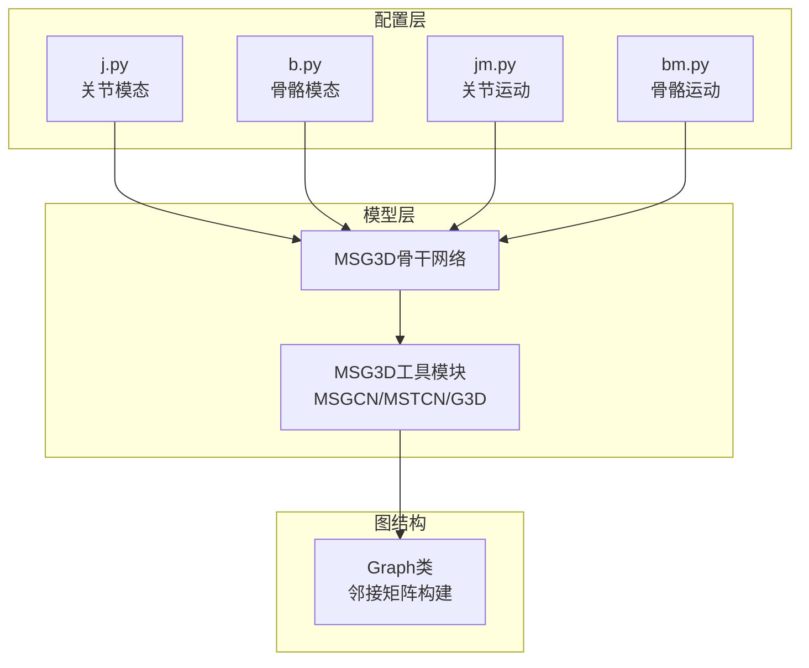
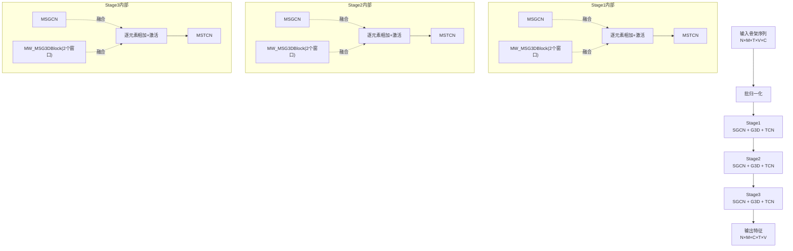
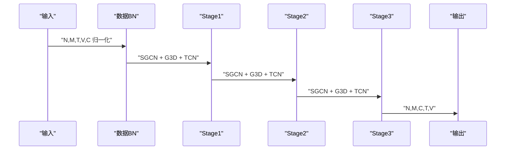
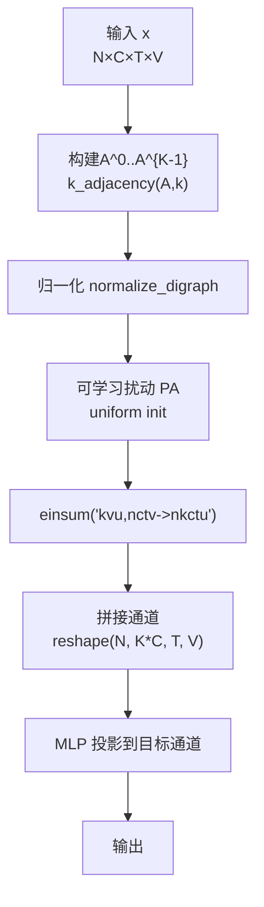
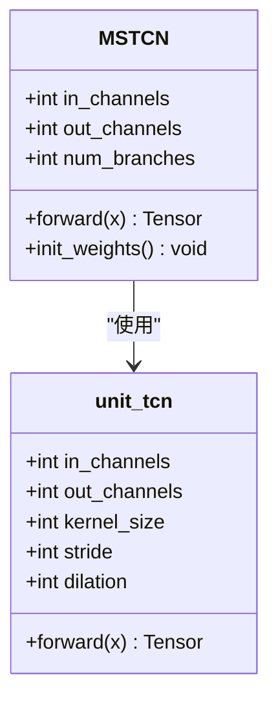
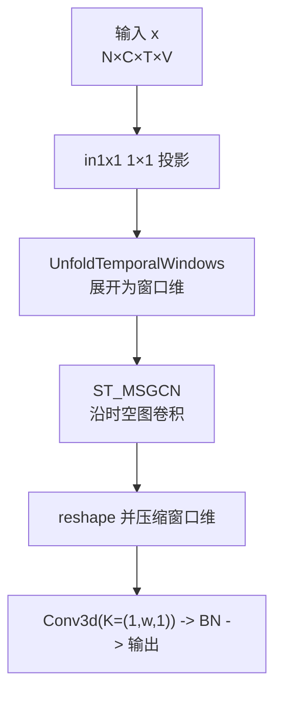
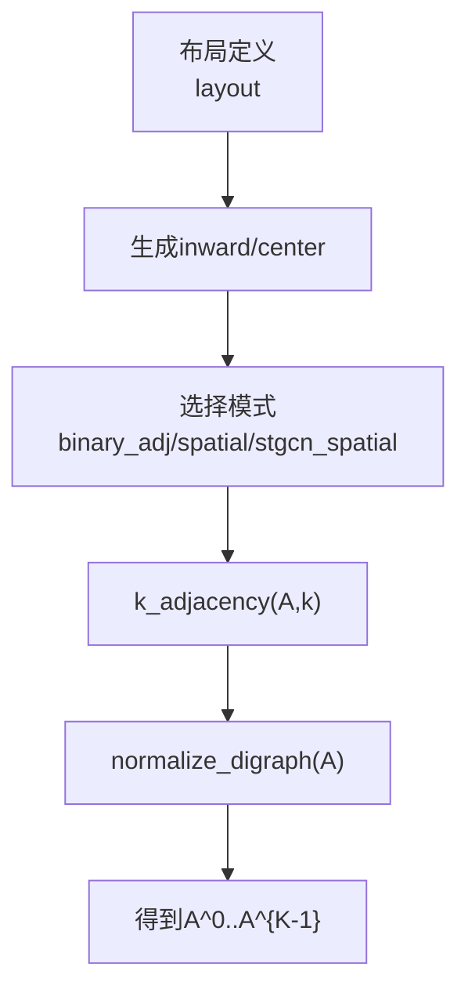
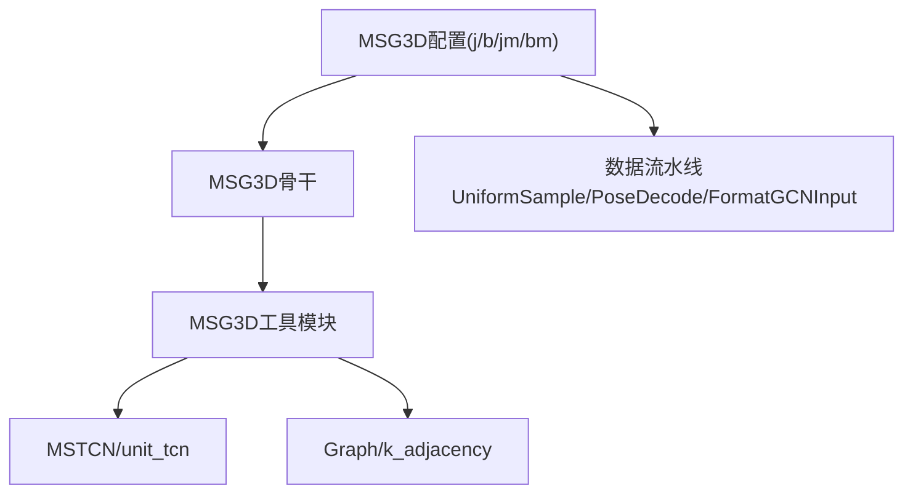

# MSG3D算法配置模板

<cite>
**本文档引用的文件**
- [configs/msg3d/README.md](file://configs/msg3d/README.md)
- [configs/msg3d/msg3d_pyskl_ntu60_xsub_3dkp/j.py](file://configs/msg3d/msg3d_pyskl_ntu60_xsub_3dkp/j.py)
- [configs/msg3d/msg3d_pyskl_ntu60_xsub_3dkp/b.py](file://configs/msg3d/msg3d_pyskl_ntu60_xsub_3dkp/b.py)
- [configs/msg3d/msg3d_pyskl_ntu60_xsub_3dkp/jm.py](file://configs/msg3d/msg3d_pyskl_ntu60_xsub_3dkp/jm.py)
- [configs/msg3d/msg3d_pyskl_ntu60_xsub_3dkp/bm.py](file://configs/msg3d/msg3d_pyskl_ntu60_xsub_3dkp/bm.py)
- [pyskl/models/gcns/msg3d.py](file://pyskl/models/gcns/msg3d.py)
- [pyskl/models/gcns/utils/msg3d_utils.py](file://pyskl/models/gcns/utils/msg3d_utils.py)
- [pyskl/models/gcns/utils/tcn.py](file://pyskl/models/gcns/utils/tcn.py)
- [pyskl/utils/graph.py](file://pyskl/utils/graph.py)
- [configs/stgcn/stgcn_pyskl_ntu60_xsub_3dkp/j.py](file://configs/stgcn/stgcn_pyskl_ntu60_xsub_3dkp/j.py)
- [configs/aagcn/aagcn_pyskl_ntu60_xsub_3dkp/j.py](file://configs/aagcn/aagcn_pyskl_ntu60_xsub_3dkp/j.py)
- [configs/ctrgcn/ctrgcn_pyskl_ntu60_xsub_3dkp/j.py](file://configs/ctrgcn/ctrgcn_pyskl_ntu60_xsub_3dkp/j.py)
</cite>

## 目录
1. [简介](#简介)
2. [项目结构](#项目结构)
3. [核心组件](#核心组件)
4. [架构总览](#架构总览)
5. [详细组件分析](#详细组件分析)
6. [依赖关系分析](#依赖关系分析)
7. [性能考虑](#性能考虑)
8. [故障排除指南](#故障排除指南)
9. [结论](#结论)
10. [附录](#附录)

## 简介
本文件系统性地梳理MSG3D（多分支时空图卷积）算法在仓库中的配置模板与实现要点，重点覆盖：
- 多分支结构的配置参数：不同尺度分支的通道分配、融合策略
- 3D图卷积的配置参数：卷积核大小、步长、膨胀等设置
- 多尺度建模机制：MS-GCN与G3D模块的组合方式
- 与其他3D GCN算法（ST-GCN、AAGCN、CTR-GCN）的配置对比与性能分析
- 不同数据集规模下的配置优化建议与计算效率分析

## 项目结构
MSG3D的配置模板位于configs/msg3d目录下，按数据集划分（如NTU60、NTU120）、标注方式（3D骨架或HRNet2D）与场景（XSub、XView）组织。每个子目录包含四种模态配置：关节（Joint）、骨骼（Bone）、关节运动（Joint Motion）、骨骼运动（Bone Motion）。核心模型实现位于pyskl/models/gcns/msg3d.py与工具模块pyskl/models/gcns/utils/msg3d_utils.py中。

图表来源
- [configs/msg3d/msg3d_pyskl_ntu60_xsub_3dkp/j.py](file://configs/msg3d/msg3d_pyskl_ntu60_xsub_3dkp/j.py#L1-L61)
- [pyskl/models/gcns/msg3d.py](file://pyskl/models/gcns/msg3d.py#L10-L79)
- [pyskl/models/gcns/utils/msg3d_utils.py](file://pyskl/models/gcns/utils/msg3d_utils.py#L31-L318)
- [pyskl/utils/graph.py](file://pyskl/utils/graph.py#L58-L175)

章节来源
- [configs/msg3d/README.md](file://configs/msg3d/README.md#L1-L57)
- [configs/msg3d/msg3d_pyskl_ntu60_xsub_3dkp/j.py](file://configs/msg3d/msg3d_pyskl_ntu60_xsub_3dkp/j.py#L1-L61)

## 核心组件
- MSG3D骨干网络：包含三段堆叠的时空路径（SGCN + G3D + TCN），通过残差与激活融合多分支输出。
- MSGCN：多尺度空间图卷积，聚合K阶邻接矩阵，支持可学习扰动参数。
- MSTCN：多分支时域卷积，包含多个膨胀率分支与最大池化、1×1分支，实现多尺度时间建模。
- G3D模块：基于滑动时间窗口的时空图卷积，使用展开操作将时间维展开并与图卷积结合。
- 图结构：Graph类根据布局（nturgb+d等）与模式（binary_adj等）生成邻接矩阵。

章节来源
- [pyskl/models/gcns/msg3d.py](file://pyskl/models/gcns/msg3d.py#L10-L79)
- [pyskl/models/gcns/utils/msg3d_utils.py](file://pyskl/models/gcns/utils/msg3d_utils.py#L31-L318)
- [pyskl/utils/graph.py](file://pyskl/utils/graph.py#L58-L175)

## 架构总览
MSG3D采用“空间多尺度 + 时间多分支”的双轴多尺度建模策略。每阶段由两条并行路径组成：MSGCN负责多尺度空间聚合；MW_MSG3DBlock（多窗口G3D）在时间维度上以不同窗口大小和膨胀率提取多尺度时空特征；最后通过MSTCN进一步整合时间维度的多分支特征，并在各阶段间加入残差连接与激活函数。

图表来源
- [pyskl/models/gcns/msg3d.py](file://pyskl/models/gcns/msg3d.py#L34-L56)
- [pyskl/models/gcns/utils/msg3d_utils.py](file://pyskl/models/gcns/utils/msg3d_utils.py#L289-L318)

## 详细组件分析

### MSG3D骨干网络（MSG3D）
- 关键参数
  - graph_cfg：图结构配置，如布局与模式
  - in_channels：输入通道数（默认3）
  - base_channels：基础通道数（用于各阶段通道递增）
  - num_gcn_scales：MSGCN使用的图尺度数量
  - num_g3d_scales：G3D模块使用的图尺度数量
  - num_person：最大人数（影响输入格式与批归一化）
  - tcn_dropout：MSTCN中的丢弃概率
- 前向流程
  - 输入形状：N×M×T×V×C
  - 数据归一化后按(M*V*C)展平，经TCN处理再还原
  - 每阶段先SGCN与G3D相加并激活，再经过TCN
  - 输出形状：N×M×C×T×V

图表来源
- [pyskl/models/gcns/msg3d.py](file://pyskl/models/gcns/msg3d.py#L58-L75)

章节来源
- [pyskl/models/gcns/msg3d.py](file://pyskl/models/gcns/msg3d.py#L10-L79)

### MSGCN（多尺度空间图卷积）
- 功能：对输入张量沿空间维聚合K阶邻接矩阵，K取0到num_scales-1，支持自连接与可学习扰动
- 通道映射：通过MLP将K倍通道拼接后的特征映射到目标通道
- 参数
  - num_scales：尺度数量
  - in/out_channels：输入输出通道
  - A：图邻接矩阵（注册为buffer）

图表来源
- [pyskl/models/gcns/utils/msg3d_utils.py](file://pyskl/models/gcns/utils/msg3d_utils.py#L31-L61)
- [pyskl/utils/graph.py](file://pyskl/utils/graph.py#L5-L16)

章节来源
- [pyskl/models/gcns/utils/msg3d_utils.py](file://pyskl/models/gcns/utils/msg3d_utils.py#L31-L61)
- [pyskl/utils/graph.py](file://pyskl/utils/graph.py#L5-L16)

### MSTCN（多分支时域卷积）
- 结构：包含多个膨胀卷积分支、最大池化分支与1×1分支，最终按通道拼接并通过1×1变换融合
- 分支通道分配：均分通道，首个分支保留更多通道以提升表达能力
- 参数
  - in/out_channels：输入输出通道
  - kernel_size：卷积核大小（可为列表对应不同膨胀分支）
  - stride：步长
  - dilations：膨胀率列表
  - residual：是否启用残差
  - tcn_dropout：丢弃率

图表来源
- [pyskl/models/gcns/utils/msg3d_utils.py](file://pyskl/models/gcns/utils/msg3d_utils.py#L64-L143)
- [pyskl/models/gcns/utils/tcn.py](file://pyskl/models/gcns/utils/tcn.py#L8-L36)

章节来源
- [pyskl/models/gcns/utils/msg3d_utils.py](file://pyskl/models/gcns/utils/msg3d_utils.py#L64-L143)
- [pyskl/models/gcns/utils/tcn.py](file://pyskl/models/gcns/utils/tcn.py#L8-L36)

### G3D模块（MSG3DBlock与MW_MSG3DBlock）
- MSG3DBlock：将输入按固定窗口大小展开为时间维，然后在时空联合图上执行MSGCN，最后用卷积压缩回原时间分辨率
- MW_MSG3DBlock：并行运行多个MSG3DBlock（不同窗口大小与膨胀率），并对输出求和融合
- 关键参数
  - window_size：时间窗口大小
  - window_stride：窗口步长
  - window_dilation：窗口膨胀率
  - num_scales：图尺度数量
  - embed_factor：嵌入通道因子（控制中间通道）

图表来源
- [pyskl/models/gcns/utils/msg3d_utils.py](file://pyskl/models/gcns/utils/msg3d_utils.py#L236-L287)
- [pyskl/models/gcns/utils/msg3d_utils.py](file://pyskl/models/gcns/utils/msg3d_utils.py#L289-L318)

章节来源
- [pyskl/models/gcns/utils/msg3d_utils.py](file://pyskl/models/gcns/utils/msg3d_utils.py#L236-L318)

### 图结构与邻接矩阵
- Graph类根据布局（如nturgb+d）与模式（如binary_adj）生成邻接矩阵
- k_adjacency：计算k阶邻接矩阵，支持自连接
- normalize_digraph：按行归一化邻接矩阵

图表来源
- [pyskl/utils/graph.py](file://pyskl/utils/graph.py#L58-L175)

章节来源
- [pyskl/utils/graph.py](file://pyskl/utils/graph.py#L5-L175)

## 依赖关系分析
MSG3D配置模板与实现之间的依赖关系如下：

图表来源
- [configs/msg3d/msg3d_pyskl_ntu60_xsub_3dkp/j.py](file://configs/msg3d/msg3d_pyskl_ntu60_xsub_3dkp/j.py#L1-L61)
- [pyskl/models/gcns/msg3d.py](file://pyskl/models/gcns/msg3d.py#L10-L79)
- [pyskl/models/gcns/utils/msg3d_utils.py](file://pyskl/models/gcns/utils/msg3d_utils.py#L31-L318)
- [pyskl/models/gcns/utils/tcn.py](file://pyskl/models/gcns/utils/tcn.py#L8-L36)
- [pyskl/utils/graph.py](file://pyskl/utils/graph.py#L58-L175)

章节来源
- [configs/msg3d/msg3d_pyskl_ntu60_xsub_3dkp/j.py](file://configs/msg3d/msg3d_pyskl_ntu60_xsub_3dkp/j.py#L1-L61)
- [pyskl/models/gcns/msg3d.py](file://pyskl/models/gcns/msg3d.py#L10-L79)
- [pyskl/models/gcns/utils/msg3d_utils.py](file://pyskl/models/gcns/utils/msg3d_utils.py#L31-L318)
- [pyskl/models/gcns/utils/tcn.py](file://pyskl/models/gcns/utils/tcn.py#L8-L36)
- [pyskl/utils/graph.py](file://pyskl/utils/graph.py#L58-L175)

## 性能考虑
- 计算复杂度
  - MSGCN：对每个尺度进行图卷积，整体复杂度与尺度数、节点数、通道数线性相关
  - MSTCN：多分支膨胀卷积，计算量随分支数与膨胀率增加而上升
  - G3D：时间窗口展开引入额外内存与计算开销，窗口越大、膨胀越高，计算越重
- 内存占用
  - UnfoldTemporalWindows会临时增加通道维度，需关注显存上限
  - 多窗口并行（MW_MSG3DBlock）会叠加内存与计算
- 优化建议
  - 合理设置num_gcn_scales与num_g3d_scales，避免过度冗余
  - 控制窗口大小与膨胀率，平衡精度与速度
  - 在高分辨率视频或大batch时适当降低window_size或增大stride
  - 使用合适的tcn_dropout与训练策略（如余弦退火）稳定收敛

## 故障排除指南
- 学习率缩放
  - 初始学习率与batch size呈线性关系，调整batch size时需同比例调整初始LR
- 两流与四流融合
  - 两流采用1:1融合（关节:骨骼）
  - 四流采用2:2:1:1（关节:骨骼:关节运动:骨骼运动）
- 数据加载与格式
  - 确保FormatGCNInput的num_person与实际数据一致
  - UniformSample的clip_len应与模型期望的时间长度匹配

章节来源
- [configs/msg3d/README.md](file://configs/msg3d/README.md#L34-L57)

## 结论
MSG3D通过多分支时空图卷积实现了强大的多尺度建模能力：空间维度利用MSGCN聚合多阶邻接关系，时间维度通过MSTCN与G3D模块提取多尺度时序特征。配置模板提供了标准化的数据流水线与训练策略，便于在不同数据集与标注方式下快速部署。结合合理的超参调优与融合策略，可在保持较高精度的同时兼顾效率。

## 附录

### 配置模板字段说明（以NTU60 XSub 3D骨架为例）
- 模型部分
  - type：识别器类型（RecognizerGCN）
  - backbone.type：MSG3D
  - backbone.graph_cfg：布局与图模式（如nturgb+d, binary_adj）
  - cls_head：分类头（GCNHead），num_classes与in_channels需与backbone输出匹配
- 数据流水线
  - PreNormalize3D：3D骨架归一化
  - GenSkeFeat：特征生成（j/b/jm/bm）
  - UniformSample：均匀采样（训练/验证/测试）
  - PoseDecode：解码关键点
  - FormatGCNInput：格式化为GCN输入（含num_person）
  - Collect/ToTensor：收集与转张量
- 数据加载
  - videos_per_gpu/worker_per_gpu：批量与工作进程
  - RepeatDataset：重复数据集以提升样本多样性
  - split：训练/验证/测试划分
- 优化与调度
  - SGD优化器、动量、权重衰减、Nesterov
  - CosineAnnealing学习率策略
  - total_epochs：总轮次
  - checkpoint_config/evaluation/log_config：检查点、评估与日志配置
- 运行设置
  - log_level/work_dir：日志级别与工作目录

章节来源
- [configs/msg3d/msg3d_pyskl_ntu60_xsub_3dkp/j.py](file://configs/msg3d/msg3d_pyskl_ntu60_xsub_3dkp/j.py#L1-L61)
- [configs/msg3d/msg3d_pyskl_ntu60_xsub_3dkp/b.py](file://configs/msg3d/msg3d_pyskl_ntu60_xsub_3dkp/b.py#L1-L61)
- [configs/msg3d/msg3d_pyskl_ntu60_xsub_3dkp/jm.py](file://configs/msg3d/msg3d_pyskl_ntu60_xsub_3dkp/jm.py#L1-L61)
- [configs/msg3d/msg3d_pyskl_ntu60_xsub_3dkp/bm.py](file://configs/msg3d/msg3d_pyskl_ntu60_xsub_3dkp/bm.py#L1-L61)

### 与其他3D GCN算法的配置对比
- ST-GCN（stgcn_spatial模式）
  - 图模式：stgcn_spatial（考虑近邻与远邻方向）
  - 典型in_channels：256（与MSG3D不同）
- AAGCN（spatial模式）
  - 图模式：spatial（自连接、内向、外向边）
  - 典型in_channels：256
- CTR-GCN（spatial模式）
  - 图模式：spatial
  - 典型in_channels：256
- MSG3D
  - 图模式：binary_adj（二元邻接）
  - 典型in_channels：384（分类头输入通道）

章节来源
- [configs/stgcn/stgcn_pyskl_ntu60_xsub_3dkp/j.py](file://configs/stgcn/stgcn_pyskl_ntu60_xsub_3dkp/j.py#L1-L61)
- [configs/aagcn/aagcn_pyskl_ntu60_xsub_3dkp/j.py](file://configs/aagcn/aagcn_pyskl_ntu60_xsub_3dkp/j.py#L1-L61)
- [configs/ctrgcn/ctrgcn_pyskl_ntu60_xsub_3dkp/j.py](file://configs/ctrgcn/ctrgcn_pyskl_ntu60_xsub_3dkp/j.py#L1-L61)