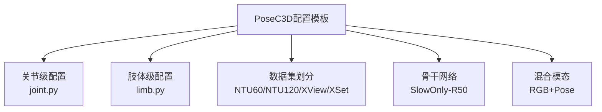
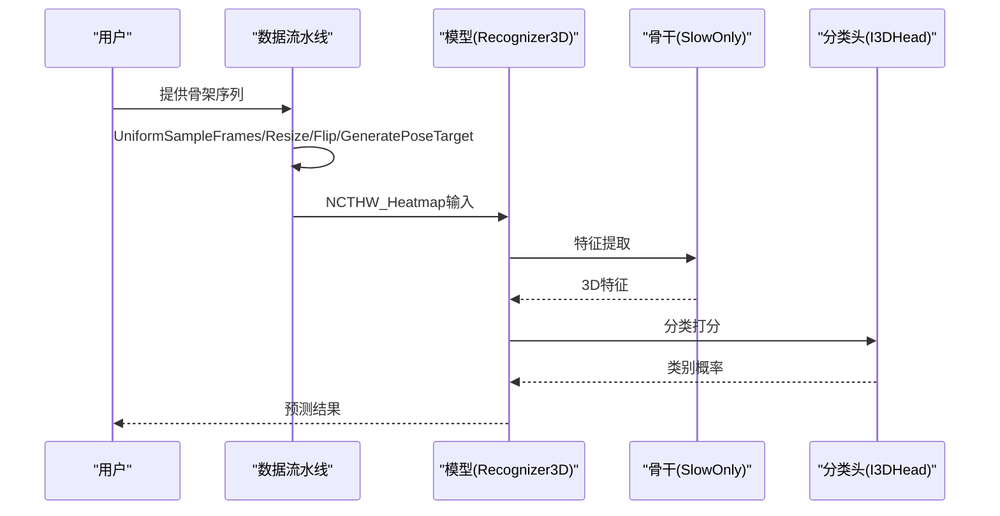
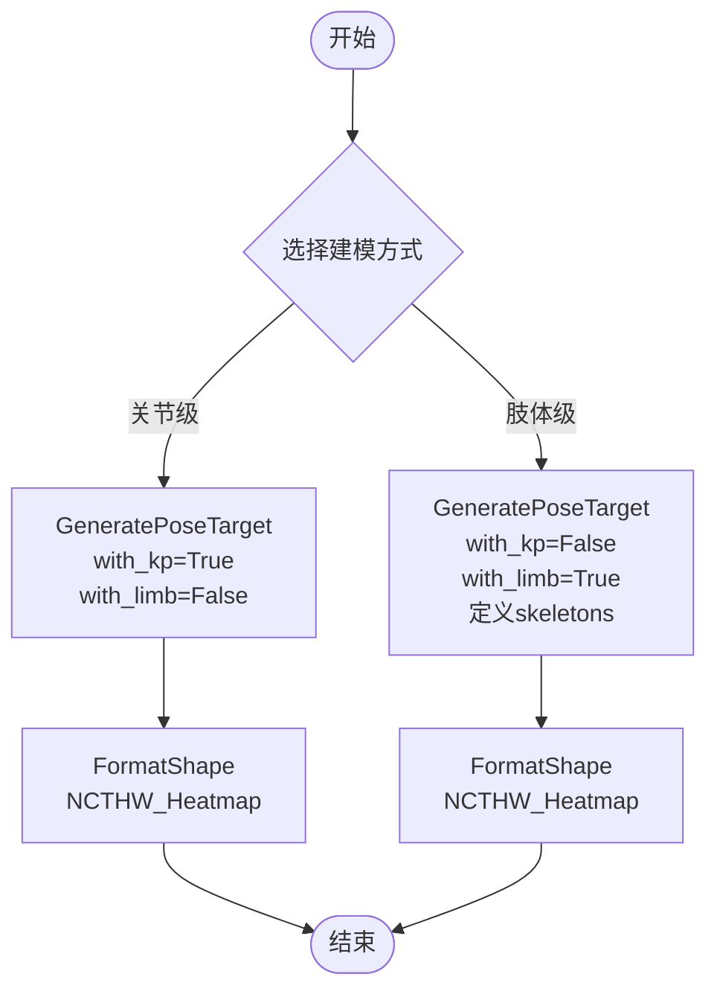
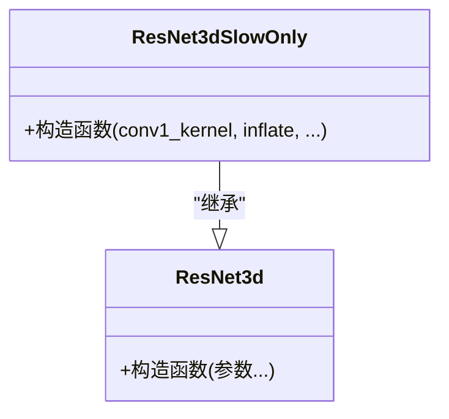
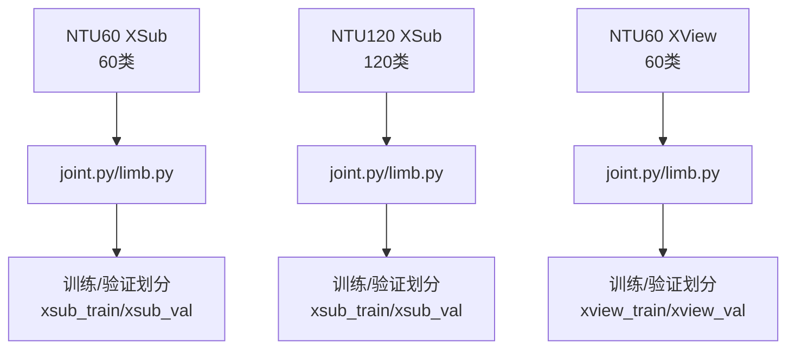
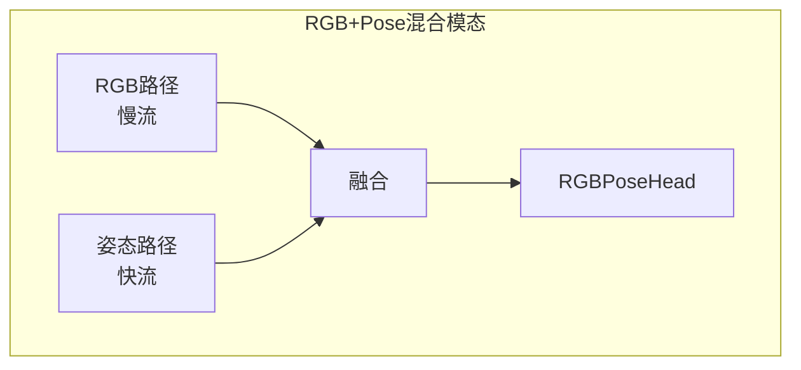
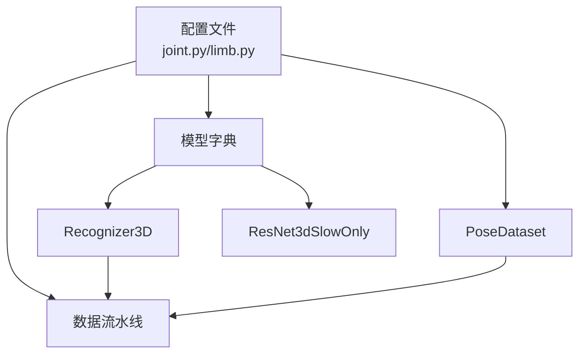

# PoseC3D算法配置模板

<cite>
**本文档引用的文件**
- [configs/posec3d/README.md](file://configs/posec3d/README.md)
- [configs/posec3d/slowonly_r50_ntu60_xsub/joint.py](file://configs/posec3d/slowonly_r50_ntu60_xsub/joint.py)
- [configs/posec3d/slowonly_r50_ntu60_xsub/limb.py](file://configs/posec3d/slowonly_r50_ntu60_xsub/limb.py)
- [configs/posec3d/slowonly_r50_ntu120_xsub/joint.py](file://configs/posec3d/slowonly_r50_ntu120_xsub/joint.py)
- [configs/posec3d/slowonly_r50_ntu120_xsub/limb.py](file://configs/posec3d/slowonly_r50_ntu120_xsub/limb.py)
- [configs/posec3d/slowonly_r50_346_k400/joint.py](file://configs/posec3d/slowonly_r50_346_k400/joint.py)
- [configs/posec3d/slowonly_r50_463_k400/joint.py](file://configs/posec3d/slowonly_r50_463_k400/joint.py)
- [configs/posec3d/slowonly_r50_ntu60_xview/joint.py](file://configs/posec3d/slowonly_r50_ntu60_xview/joint.py)
- [configs/posec3d/slowonly_r50_ntu60_xview/limb.py](file://configs/posec3d/slowonly_r50_ntu60_xview/limb.py)
- [configs/rgbpose_conv3d/rgbpose_conv3d.py](file://configs/rgbpose_conv3d/rgbpose_conv3d.py)
- [configs/rgbpose_conv3d/pose_only.py](file://configs/rgbpose_conv3d/pose_only.py)
- [configs/rgbpose_conv3d/rgb_only.py](file://configs/rgbpose_conv3d/rgb_only.py)
- [pyskl/models/cnns/resnet3d_slowonly.py](file://pyskl/models/cnns/resnet3d_slowonly.py)
- [pyskl/models/recognizers/recognizer3d.py](file://pyskl/models/recognizers/recognizer3d.py)
- [pyskl/datasets/pose_dataset.py](file://pyskl/datasets/pose_dataset.py)
</cite>

## 目录
1. [简介](#简介)
2. [项目结构](#项目结构)
3. [核心组件](#核心组件)
4. [架构总览](#架构总览)
5. [详细组件分析](#详细组件分析)
6. [依赖关系分析](#依赖关系分析)
7. [性能考量](#性能考量)
8. [故障排查指南](#故障排查指南)
9. [结论](#结论)
10. [附录](#附录)

## 简介
本文件为PoseC3D算法配置模板的权威参考，系统阐述基于3D卷积的姿态动作识别（PoseC3D）的配置参数与混合模态建模机制。重点对比关节级别（joint）与肢体级别（limb）两种建模方式的配置差异与适用场景；详解SlowOnly骨干网络的配置选项（如ResNet深度、时间采样策略等）；给出NTU60与NTU120数据集在不同划分（XSub/XView/XSet）下的配置优化建议；并提供RGB+Pose混合模态的配置参数设置与性能提升分析。

## 项目结构
本仓库中与PoseC3D直接相关的配置集中在configs/posec3d目录下，按数据集与建模方式组织，典型结构如下：
- slowonly_r50_ntu60_xsub/joint.py：NTU60 XSub划分的关节级配置
- slowonly_r50_ntu60_xsub/limb.py：NTU60 XSub划分的肢体级配置
- slowonly_r50_ntu120_xsub/joint.py：NTU120 XSub划分的关节级配置
- slowonly_r50_ntu120_xsub/limb.py：NTU120 XSub划分的肢体级配置
- slowonly_r50_346_k400/joint.py：Kinetics-400上SlowOnly-R50(stages:3,4,6)的关节级配置
- slowonly_r50_463_k400/joint.py：Kinetics-400上SlowOnly-R50(stages:4,6,3)的关节级配置
- slowonly_r50_ntu60_xview/joint.py与limb.py：NTU60 XView划分的关节/肢体配置
- rgbpose_conv3d/*.py：RGB+Pose混合模态配置（双流Conv3D）

**章节来源**
- [configs/posec3d/README.md](file://configs/posec3d/README.md#L1-L120)

## 核心组件
- 模型框架
  - 识别器：Recognizer3D，负责前向训练与测试流程，支持多视图聚合与平均裁剪
  - 骨干网络：ResNet3dSlowOnly，继承自ResNet3d，采用慢流（Slow）设计以捕捉时间维度变化
  - 分类头：I3DHead，对3D特征进行分类
- 数据集与管道
  - PoseDataset：加载骨架标注（pkl），支持多种数据集划分（XSub/XView/XSet）
  - 数据流水线：UniformSampleFrames、PoseDecode、PoseCompact、Resize、RandomResizedCrop、Flip、GeneratePoseTarget、FormatShape、Collect、ToTensor等
- 训练配置
  - 优化器：SGD（动量、权重衰减）
  - 学习率策略：余弦退火或阶梯下降
  - 训练轮次：通常24或更高（依据数据集与预训练情况）
  - 日志与评估：Top-k准确率、平均类准确率

**章节来源**
- [pyskl/models/recognizers/recognizer3d.py](file://pyskl/models/recognizers/recognizer3d.py#L9-L86)
- [pyskl/models/cnns/resnet3d_slowonly.py](file://pyskl/models/cnns/resnet3d_slowonly.py#L6-L18)
- [pyskl/datasets/pose_dataset.py](file://pyskl/datasets/pose_dataset.py#L10-L107)

## 架构总览
PoseC3D将2D关键点格式化为3D体素（热力图体积），通过3D卷积网络进行动作识别。整体流程包括：骨架读取与裁剪、时间采样、空间变换、目标生成（关键点或肢体）、形状格式化、特征提取与分类。

**图表来源**
- [configs/posec3d/slowonly_r50_ntu60_xsub/joint.py](file://configs/posec3d/slowonly_r50_ntu60_xsub/joint.py#L26-L58)
- [pyskl/models/recognizers/recognizer3d.py](file://pyskl/models/recognizers/recognizer3d.py#L13-L85)

**章节来源**
- [configs/posec3d/slowonly_r50_ntu60_xsub/joint.py](file://configs/posec3d/slowonly_r50_ntu60_xsub/joint.py#L1-L80)
- [pyskl/models/recognizers/recognizer3d.py](file://pyskl/models/recognizers/recognizer3d.py#L9-L86)

## 详细组件分析

### 关节级与肢体级建模方式对比
- 关节级（Joint）
  - 目标生成：GeneratePoseTarget(with_kp=True, with_limb=False)
  - 输入格式：NCTHW_Heatmap（关键点热力图）
  - 适用场景：强调个体关键点的空间分布与运动轨迹
- 肢体级（Limb）
  - 目标生成：GeneratePoseTarget(with_kp=False, with_limb=True)，并定义skeletons、left_limb/right_limb
  - 输入格式：NCTHW_Heatmap（肢体热力图）
  - 适用场景：强调肢体连接关系与整体运动模式

**图表来源**
- [configs/posec3d/slowonly_r50_ntu60_xsub/joint.py](file://configs/posec3d/slowonly_r50_ntu60_xsub/joint.py#L34-L38)
- [configs/posec3d/slowonly_r50_ntu60_xsub/limb.py](file://configs/posec3d/slowonly_r50_ntu60_xsub/limb.py#L39-L42)

**章节来源**
- [configs/posec3d/slowonly_r50_ntu60_xsub/joint.py](file://configs/posec3d/slowonly_r50_ntu60_xsub/joint.py#L26-L58)
- [configs/posec3d/slowonly_r50_ntu60_xsub/limb.py](file://configs/posec3d/slowonly_r50_ntu60_xsub/limb.py#L31-L64)

### SlowOnly骨干网络配置要点
- ResNet3dSlowOnly关键配置项
  - in_channels：17（对应17个关键点）
  - base_channels：32（基础通道数）
  - num_stages：3（阶段数）
  - stage_blocks：(4,6,3) 或 (3,4,6) 或 (4,6,3)（不同配置文件略有差异）
  - conv1_stride/pool1_stride：(1,1) 以保持时间分辨率
  - inflate：(0,1,1) 仅在深层进行空间膨胀
  - spatial_strides/temporal_strides：(2,2,2)/(1,1,2) 控制空间与时间步长
- 与ResNet3d的关系
  - SlowOnly是ResNet3d的慢流变体，通过特定膨胀与步长策略实现时间建模

**图表来源**
- [pyskl/models/cnns/resnet3d_slowonly.py](file://pyskl/models/cnns/resnet3d_slowonly.py#L6-L18)

**章节来源**
- [configs/posec3d/slowonly_r50_ntu60_xsub/joint.py](file://configs/posec3d/slowonly_r50_ntu60_xsub/joint.py#L3-L14)
- [configs/posec3d/slowonly_r50_ntu120_xsub/joint.py](file://configs/posec3d/slowonly_r50_ntu120_xsub/joint.py#L3-L20)
- [configs/posec3d/slowonly_r50_346_k400/joint.py](file://configs/posec3d/slowonly_r50_346_k400/joint.py#L3-L14)
- [configs/posec3d/slowonly_r50_463_k400/joint.py](file://configs/posec3d/slowonly_r50_463_k400/joint.py#L3-L14)
- [pyskl/models/cnns/resnet3d_slowonly.py](file://pyskl/models/cnns/resnet3d_slowonly.py#L6-L18)

### 数据集划分与配置差异（NTU60 vs NTU120）
- NTU60 XSub
  - 关键点标注：data/nturgbd/ntu60_hrnet.pkl
  - 训练/验证划分：xsub_train/xsub_val
  - 类别数：60
- NTU120 XSub
  - 关键点标注：data/nturgbd/ntu120_hrnet.pkl
  - 训练/验证划分：xsub_train/xsub_val
  - 类别数：120
  - class_prob：用于类别重采样以提升整体性能
- NTU60 XView
  - 划分：xview_train/xview_val
  - 其他配置与XSub类似

**图表来源**
- [configs/posec3d/slowonly_r50_ntu60_xsub/joint.py](file://configs/posec3d/slowonly_r50_ntu60_xsub/joint.py#L22-L26)
- [configs/posec3d/slowonly_r50_ntu120_xsub/joint.py](file://configs/posec3d/slowonly_r50_ntu120_xsub/joint.py#L22-L26)
- [configs/posec3d/slowonly_r50_ntu60_xview/joint.py](file://configs/posec3d/slowonly_r50_ntu60_xview/joint.py#L22-L26)

**章节来源**
- [configs/posec3d/slowonly_r50_ntu60_xsub/joint.py](file://configs/posec3d/slowonly_r50_ntu60_xsub/joint.py#L22-L80)
- [configs/posec3d/slowonly_r50_ntu120_xsub/joint.py](file://configs/posec3d/slowonly_r50_ntu120_xsub/joint.py#L22-L86)
- [configs/posec3d/slowonly_r50_ntu60_xview/joint.py](file://configs/posec3d/slowonly_r50_ntu60_xview/joint.py#L22-L80)

### 不同骨干网络配置（SlowOnly-R50不同stage_blocks）
- stages: 3-4-6（346配置）
  - stage_blocks：(3,4,6)
  - 适用于Kinetics-400等大规模数据集
- stages: 4-6-3（463配置）
  - stage_blocks：(4,6,3)
  - 更深的中间层，适合复杂动作
- 共同点
  - in_channels=17、base_channels=32、inflate=(0,1,1)等保持一致

**章节来源**
- [configs/posec3d/slowonly_r50_346_k400/joint.py](file://configs/posec3d/slowonly_r50_346_k400/joint.py#L1-L110)
- [configs/posec3d/slowonly_r50_463_k400/joint.py](file://configs/posec3d/slowonly_r50_463_k400/joint.py#L1-L110)

### RGB+Pose混合模态配置（RGBPoseConv3D）
- 双流主干网络
  - rgb_pathway：慢流（时间膨胀较少），通道数较大
  - pose_pathway：快流（时间膨胀较多），通道数较小，更轻量化
  - lateral连接与激活策略：在指定阶段启用横向连接以融合跨流特征
- 预测头
  - RGBPoseHead，支持分别或联合损失（loss_weights=[1.,1.]）
- 数据流水线
  - MMUniformSampleFrames：同时采样RGB帧（如8帧）与姿态热图（如32帧）
  - Normalize与FormatShape：统一到NCTHW格式
- 训练与评估
  - SGD优化器、阶梯学习率策略、20轮训练、Top-k与平均类准确率评估

**图表来源**
- [configs/rgbpose_conv3d/rgbpose_conv3d.py](file://configs/rgbpose_conv3d/rgbpose_conv3d.py#L2-L41)

**章节来源**
- [configs/rgbpose_conv3d/rgbpose_conv3d.py](file://configs/rgbpose_conv3d/rgbpose_conv3d.py#L1-L107)
- [configs/rgbpose_conv3d/pose_only.py](file://configs/rgbpose_conv3d/pose_only.py#L1-L80)
- [configs/rgbpose_conv3d/rgb_only.py](file://configs/rgbpose_conv3d/rgb_only.py#L1-L75)

## 依赖关系分析
- 配置文件依赖关系
  - joint.py/limb.py均依赖PoseDataset与一系列数据变换
  - 识别器与骨干网络通过模型字典装配
- 训练与测试流程
  - 训练：UniformSampleFrames → PoseDecode → PoseCompact → Resize → RandomResizedCrop → Flip → GeneratePoseTarget → FormatShape → Collect/ToTensor → SGD优化
  - 测试：可开启多裁剪（num_clips=10）以提升鲁棒性，但会增加耗时

**图表来源**
- [configs/posec3d/slowonly_r50_ntu60_xsub/joint.py](file://configs/posec3d/slowonly_r50_ntu60_xsub/joint.py#L22-L68)
- [pyskl/models/recognizers/recognizer3d.py](file://pyskl/models/recognizers/recognizer3d.py#L9-L86)
- [pyskl/datasets/pose_dataset.py](file://pyskl/datasets/pose_dataset.py#L10-L107)

**章节来源**
- [configs/posec3d/slowonly_r50_ntu60_xsub/joint.py](file://configs/posec3d/slowonly_r50_ntu60_xsub/joint.py#L1-L80)
- [pyskl/models/recognizers/recognizer3d.py](file://pyskl/models/recognizers/recognizer3d.py#L9-L86)
- [pyskl/datasets/pose_dataset.py](file://pyskl/datasets/pose_dataset.py#L10-L107)

## 性能考量
- 关节级vs肢体级
  - 关节级更关注关键点细节，肢体级更关注整体运动形态；在NTU60上肢体级常与关节级持平或略优
- 数据集规模与类别平衡
  - NTU120引入class_prob进行类别重采样，有助于提升整体性能
- 时间采样与多裁剪
  - 多裁剪（num_clips=10）可提升鲁棒性，但显著增加推理时间；可根据需求调整
- 骨干网络深度
  - stages:4-6-3在复杂动作上可能优于stages:3-4-6，但计算成本更高
- 学习率缩放
  - 采用线性缩放学习率（初始LR ∝ Batch Size），批量变化时需同比例调整

**章节来源**
- [configs/posec3d/README.md](file://configs/posec3d/README.md#L44-L66)
- [configs/posec3d/slowonly_r50_ntu120_xsub/joint.py](file://configs/posec3d/slowonly_r50_ntu120_xsub/joint.py#L26-L74)
- [configs/posec3d/slowonly_r50_ntu120_xsub/limb.py](file://configs/posec3d/slowonly_r50_ntu120_xsub/limb.py#L31-L78)

## 故障排查指南
- 训练不收敛或性能偏低
  - 检查学习率策略与批大小是否匹配（线性缩放）
  - 确认数据流水线中的Resize/RandomResizedCrop/Flip等增强是否合理
- 内存不足
  - 减少videos_per_gpu或workers_per_gpu
  - 关闭多裁剪测试（num_clips=1）
- 数据加载异常
  - 确认ann_file路径正确且为pkl格式
  - 检查split名称与数据集划分一致（如xsub_train/xview_val等）
- 推理速度慢
  - 关闭多裁剪测试或降低clip_len
  - 使用更轻量化的骨干网络（如C3D-light或X3D-shallow）

**章节来源**
- [configs/posec3d/README.md](file://configs/posec3d/README.md#L52-L66)
- [pyskl/datasets/pose_dataset.py](file://pyskl/datasets/pose_dataset.py#L86-L107)

## 结论
PoseC3D通过将2D关键点建模为3D热力图体积，结合3D卷积网络实现了高效的姿态动作识别。关节级与肢体级建模方式各有侧重，可依据任务特性选择；SlowOnly骨干网络在保持较低计算开销的同时具备良好的时间建模能力。针对NTU60与NTU120的不同划分与类别数量，应调整类别平衡策略与骨干深度。RGB+Pose混合模态进一步提升了识别性能，适合资源充足场景。

## 附录
- 常用命令
  - 训练：bash tools/dist_train.sh ${CONFIG_FILE} ${NUM_GPUS} --validate --test-last --test-best
  - 测试：bash tools/dist_test.sh ${CONFIG_FILE} ${CHECKPOINT_FILE} ${NUM_GPUS} --eval top_k_accuracy mean_class_accuracy --out result.pkl

**章节来源**
- [configs/posec3d/README.md](file://configs/posec3d/README.md#L103-L120)