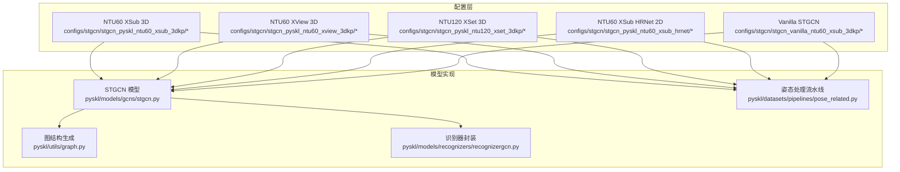
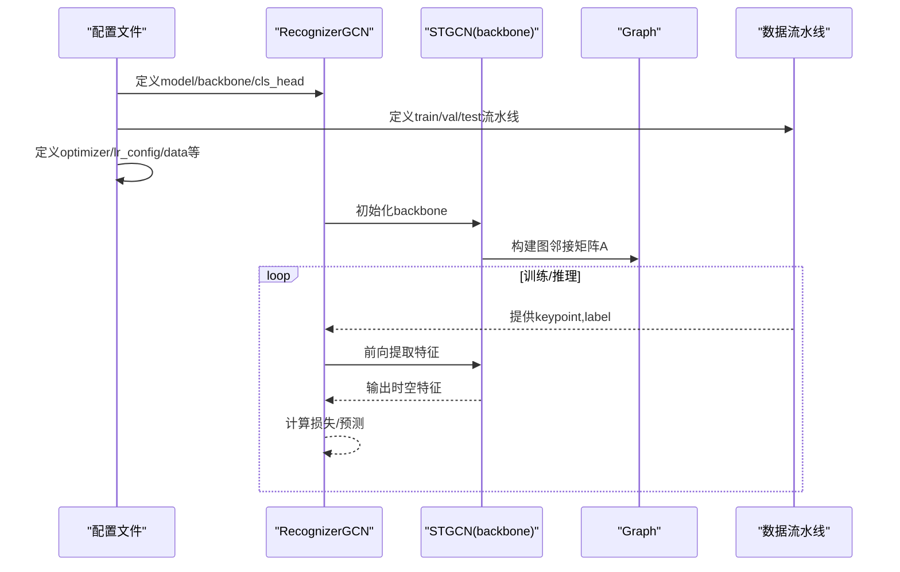
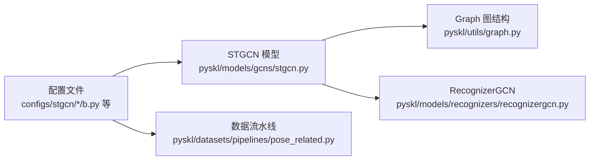

# ST-GCN算法配置模板

<cite>
**本文引用的文件**
- [stgcn_pyskl_ntu60_xsub_3dkp/b.py](file://configs/stgcn/stgcn_pyskl_ntu60_xsub_3dkp/b.py)
- [stgcn_pyskl_ntu60_xsub_3dkp/bm.py](file://configs/stgcn/stgcn_pyskl_ntu60_xsub_3dkp/bm.py)
- [stgcn_pyskl_ntu60_xsub_3dkp/j.py](file://configs/stgcn/stgcn_pyskl_ntu60_xsub_3dkp/j.py)
- [stggn_pyskl_ntu60_xsub_3dkp/jm.py](file://configs/stgcn/stgcn_pyskl_ntu60_xsub_3dkp/jm.py)
- [stgcn_pyskl_ntu60_xview_3dkp/b.py](file://configs/stgcn/stgcn_pyskl_ntu60_xview_3dkp/b.py)
- [stgcn_pyskl_ntu120_xset_3dkp/b.py](file://configs/stgcn/stgcn_pyskl_ntu120_xset_3dkp/b.py)
- [stgcn_pyskl_ntu60_xsub_hrnet/b.py](file://configs/stgcn/stgcn_pyskl_ntu60_xsub_hrnet/b.py)
- [stgcn_vanilla_ntu60_xsub_3dkp/b.py](file://configs/stgcn/stgcn_vanilla_ntu60_xsub_3dkp/b.py)
- [stgcn.py](file://pyskl/models/gcns/stgcn.py)
- [graph.py](file://pyskl/utils/graph.py)
- [pose_related.py](file://pyskl/datasets/pipelines/pose_related.py)
- [recognizergcn.py](file://pyskl/models/recognizers/recognizergcn.py)
- [README.md](file://configs/stgcn/README.md)
</cite>

## 目录
1. [简介](#简介)
2. [项目结构](#项目结构)
3. [核心组件](#核心组件)
4. [架构总览](#架构总览)
5. [详细组件分析](#详细组件分析)
6. [依赖关系分析](#依赖关系分析)
7. [性能考虑](#性能考虑)
8. [故障排查指南](#故障排查指南)
9. [结论](#结论)
10. [附录：配置参数对照表](#附录配置参数对照表)

## 简介
本文件为ST-GCN算法在PYSKL框架下的配置模板与使用指南，覆盖以下内容：
- ST-GCN系列配置（基础b、双向图bm、关节j、关节+双向图jm）的差异与适用场景
- 图结构构建参数、时空卷积核配置、注意力机制设置等关键配置项
- 不同NTU数据集划分（XSub、XView、XSet）对应的配置差异
- 学习率调度、批次大小、训练轮数等超参数设置与调优建议
- 配置参数对模型性能的影响分析与实践建议

## 项目结构
ST-GCN相关配置集中在configs/stgcn目录下，按“数据集+标注方式+骨架来源”进行分组，并在每组内提供四种模态（b、bm、j、jm）的配置文件。模型实现位于pyskl/models/gcns/stgcn.py，图结构生成位于pyskl/utils/graph.py，数据处理流水线位于pyskl/datasets/pipelines/pose_related.py。

图表来源
- [stgcn_pyskl_ntu60_xsub_3dkp/b.py](file://configs/stgcn/stgcn_pyskl_ntu60_xsub_3dkp/b.py#L1-L61)
- [stgcn_pyskl_ntu60_xview_3dkp/b.py](file://configs/stgcn/stgcn_pyskl_ntu60_xview_3dkp/b.py#L1-L61)
- [stgcn_pyskl_ntu120_xset_3dkp/b.py](file://configs/stgcn/stgcn_pyskl_ntu120_xset_3dkp/b.py#L1-L61)
- [stgcn_pyskl_ntu60_xsub_hrnet/b.py](file://configs/stgcn/stgcn_pyskl_ntu60_xsub_hrnet/b.py#L1-L61)
- [stgcn_vanilla_ntu60_xsub_3dkp/b.py](file://configs/stgcn/stgcn_vanilla_ntu60_xsub_3dkp/b.py#L1-L44)
- [stgcn.py](file://pyskl/models/gcns/stgcn.py#L56-L138)
- [graph.py](file://pyskl/utils/graph.py#L58-L175)
- [pose_related.py](file://pyskl/datasets/pipelines/pose_related.py#L377-L399)
- [recognizergcn.py](file://pyskl/models/recognizers/recognizergcn.py#L8-L97)

章节来源
- [stgcn_pyskl_ntu60_xsub_3dkp/b.py](file://configs/stgcn/stgcn_pyskl_ntu60_xsub_3dkp/b.py#L1-L61)
- [stgcn_pyskl_ntu60_xview_3dkp/b.py](file://configs/stgcn/stgcn_pyskl_ntu60_xview_3dkp/b.py#L1-L61)
- [stgcn_pyskl_ntu120_xset_3dkp/b.py](file://configs/stgcn/stgcn_pyskl_ntu120_xset_3dkp/b.py#L1-L61)
- [stgcn_pyskl_ntu60_xsub_hrnet/b.py](file://configs/stgcn/stgcn_pyskl_ntu60_xsub_hrnet/b.py#L1-L61)
- [stgcn_vanilla_ntu60_xsub_3dkp/b.py](file://configs/stgcn/stgcn_vanilla_ntu60_xsub_3dkp/b.py#L1-L44)

## 核心组件
- 模型主体：STGCN（时空图卷积网络），通过Graph类构建邻接矩阵，支持多阶段扩张与下采样。
- 数据处理：PreNormalize3D/PreNormalize2D、GenSkeFeat、UniformSample、PoseDecode、FormatGCNInput等流水线模块。
- 识别器：RecognizerGCN负责前向传播、损失计算与测试时的平均聚合。

章节来源
- [stgcn.py](file://pyskl/models/gcns/stgcn.py#L56-L138)
- [graph.py](file://pyskl/utils/graph.py#L58-L175)
- [pose_related.py](file://pyskl/datasets/pipelines/pose_related.py#L12-L49)
- [recognizergcn.py](file://pyskl/models/recognizers/recognizergcn.py#L8-L97)

## 架构总览
ST-GCN的配置由“模型定义 + 数据流水线 + 训练配置”三部分组成。模型定义中指定backbone为STGCN，并通过graph_cfg控制图结构；数据流水线通过GenSkeFeat选择特征模态（b、bm、j、jm），并通过UniformSample统一时间长度；训练配置定义优化器策略、学习率调度与训练轮数。

图表来源
- [stgcn_pyskl_ntu60_xsub_3dkp/b.py](file://configs/stgcn/stgcn_pyskl_ntu60_xsub_3dkp/b.py#L1-L61)
- [stgcn.py](file://pyskl/models/gcns/stgcn.py#L56-L138)
- [graph.py](file://pyskl/utils/graph.py#L58-L175)
- [recognizergcn.py](file://pyskl/models/recognizers/recognizergcn.py#L8-L97)
- [pose_related.py](file://pyskl/datasets/pipelines/pose_related.py#L377-L399)

## 详细组件分析

### ST-GCN系列配置对比（b、bm、j、jm）
- 基础版本（b）：仅使用关节点坐标作为输入特征，适合对空间结构敏感的任务。
- 双向图版本（bm）：在b基础上增加运动特征（骨向量的时序差分），增强对动作动态的建模。
- 关节版本（j）：直接使用关节点坐标，不构造骨向量，适合2D骨架或特定下游任务。
- 关节+双向图版本（jm）：同时包含关节点与运动特征，综合了静态空间与动态变化信息。

适用场景建议：
- b：追求轻量化与高精度平衡，或对时间分辨率要求不高。
- bm：强调动作时序变化，如连续性动作识别。
- j：2D骨架输入或关注关节点相对位置。
- jm：追求最高精度，资源充足时优先选择。

章节来源
- [stgcn_pyskl_ntu60_xsub_3dkp/b.py](file://configs/stgcn/stgcn_pyskl_ntu60_xsub_3dkp/b.py#L10-L18)
- [stgcn_pyskl_ntu60_xsub_3dkp/bm.py](file://configs/stgcn/stgcn_pyskl_ntu60_xsub_3dkp/bm.py#L10-L18)
- [stgcn_pyskl_ntu60_xsub_3dkp/j.py](file://configs/stgcn/stgcn_pyskl_ntu60_xsub_3dkp/j.py#L10-L18)
- [stgcn_pyskl_ntu60_xsub_3dkp/jm.py](file://configs/stgcn/stgcn_pyskl_ntu60_xsub_3dkp/jm.py#L10-L18)
- [pose_related.py](file://pyskl/datasets/pipelines/pose_related.py#L377-L399)

### 图结构构建参数
- graph_cfg.layout：可选'openpose'、'nturgb+d'、'coco'、'handmp'，决定关节点数量与连接关系。
- graph_cfg.mode：'stgcn_spatial'或'spatial'，前者基于hop距离构建多尺度邻接矩阵，后者使用自连、入边、出边三类矩阵。
- Graph类还支持max_hop、nx_node、num_filter、init_std、init_off等参数，用于控制图的拓扑复杂度与初始化方式。

章节来源
- [stgcn.py](file://pyskl/models/gcns/stgcn.py#L60-L70)
- [graph.py](file://pyskl/utils/graph.py#L68-L93)
- [graph.py](file://pyskl/utils/graph.py#L138-L166)

### 时空卷积核配置
- STGCNBlock内部组合unit_gcn与unit_tcn或mstcn，其中unit_tcn默认使用9×9卷积核，stride可随阶段调整。
- 支持inflate_stages/down_stages控制通道膨胀与下采样，以扩大感受野并降低时间分辨率。
- tcn_dropout可通过配置传入（如vanilla配置示例），用于正则化。

章节来源
- [stgcn.py](file://pyskl/models/gcns/stgcn.py#L13-L54)
- [stgcn.py](file://pyskl/models/gcns/stgcn.py#L56-L117)
- [stgcn_vanilla_ntu60_xsub_3dkp/b.py](file://configs/stgcn/stgcn_vanilla_ntu60_xsub_3dkp/b.py#L5-L7)

### 注意力机制设置
- 当前STGCN配置未显式启用注意力头（如在其他GCN变体中常见）。若需引入注意力，可在unit_gcn或额外模块中扩展相应参数（例如gcn_kwargs中的注意力相关键值）。

章节来源
- [stgcn.py](file://pyskl/models/gcns/stgcn.py#L24-L32)

### 数据集划分与配置差异（XSub、XView、XSet）
- XSub：跨人体划分，常用于严格的人间泛化评估。
- XView：跨视角划分，评估视角变化鲁棒性。
- XSet：跨集合划分，常用于大规模数据集（如NTU120）的跨场景泛化。
- 不同划分主要体现在split字段与类别数（NTU60 vs NTU120）及注释文件路径差异。

章节来源
- [stgcn_pyskl_ntu60_xsub_3dkp/b.py](file://configs/stgcn/stgcn_pyskl_ntu60_xsub_3dkp/b.py#L41-L46)
- [stgcn_pyskl_ntu60_xview_3dkp/b.py](file://configs/stgcn/stgcn_pyskl_ntu60_xview_3dkp/b.py#L41-L46)
- [stgcn_pyskl_ntu120_xset_3dkp/b.py](file://configs/stgcn/stgcn_pyskl_ntu120_xset_3dkp/b.py#L41-L46)

### 骨架来源差异（3D vs HRNet 2D）
- 3D骨架：使用PreNormalize3D进行归一化，支持align_center/align_spine等几何对齐。
- HRNet 2D骨架：使用PreNormalize2D，布局为'coco'，适用于2D关键点序列。

章节来源
- [stgcn_pyskl_ntu60_xsub_3dkp/b.py](file://configs/stgcn/stgcn_pyskl_ntu60_xsub_3dkp/b.py#L10-L18)
- [stgcn_pyskl_ntu60_xsub_hrnet/b.py](file://configs/stgcn/stgcn_pyskl_ntu60_xsub_hrnet/b.py#L10-L18)
- [pose_related.py](file://pyskl/datasets/pipelines/pose_related.py#L206-L292)
- [pose_related.py](file://pyskl/datasets/pipelines/pose_related.py#L52-L96)

### 超参数设置与调优建议
- 批次大小与学习率：仓库提供“线性缩放学习率”实践（初始LR与batch size成正比）。若更改videos_per_gpu，请同步调整初始学习率。
- 优化器：SGD（momentum、weight_decay、nesterov）是默认选择；AdamW在某些场景可尝试。
- 学习率策略：CosineAnnealing与step策略均可使用；对于长尾分布或需要更平滑收敛时推荐CosineAnnealing。
- 训练轮数：当前配置为16个epoch；可根据验证集指标早停或延长至收敛。

章节来源
- [stgcn_pyskl_ntu60_xsub_3dkp/b.py](file://configs/stgcn/stgcn_pyskl_ntu60_xsub_3dkp/b.py#L48-L56)
- [stgcn_pyskl_ntu60_xview_3dkp/b.py](file://configs/stgcn/stgcn_pyskl_ntu60_xview_3dkp/b.py#L48-L56)
- [stgcn_pyskl_ntu120_xset_3dkp/b.py](file://configs/stgcn/stgcn_pyskl_ntu120_xset_3dkp/b.py#L48-L56)
- [stgcn_pyskl_ntu60_xsub_hrnet/b.py](file://configs/stgcn/stgcn_pyskl_ntu60_xsub_hrnet/b.py#L48-L56)
- [stgcn_vanilla_ntu60_xsub_3dkp/b.py](file://configs/stgcn/stgcn_vanilla_ntu60_xsub_3dkp/b.py#L31-L36)
- [README.md](file://configs/stgcn/README.md#L46-L47)

### 数据流水线关键步骤
- PreNormalize：3D/2D骨架归一化，去除无效帧，对齐人体中心与脊柱方向。
- GenSkeFeat：根据feats列表生成特征（b、bm、j、jm），并合并到最后一维。
- UniformSample：统一时间长度（clip_len），训练/验证/测试的num_clips不同。
- PoseDecode：按frame_inds加载关键点序列。
- FormatGCNInput：格式化为GCN输入维度（N, M, C, T, V）。

章节来源
- [stgcn_pyskl_ntu60_xsub_3dkp/b.py](file://configs/stgcn/stgcn_pyskl_ntu60_xsub_3dkp/b.py#L10-L18)
- [pose_related.py](file://pyskl/datasets/pipelines/pose_related.py#L206-L292)
- [pose_related.py](file://pyskl/datasets/pipelines/pose_related.py#L377-L399)

## 依赖关系分析
ST-GCN配置与实现之间的依赖关系如下：

图表来源
- [stgcn_pyskl_ntu60_xsub_3dkp/b.py](file://configs/stgcn/stgcn_pyskl_ntu60_xsub_3dkp/b.py#L1-L6)
- [stgcn.py](file://pyskl/models/gcns/stgcn.py#L56-L138)
- [graph.py](file://pyskl/utils/graph.py#L58-L175)
- [pose_related.py](file://pyskl/datasets/pipelines/pose_related.py#L377-L399)
- [recognizergcn.py](file://pyskl/models/recognizers/recognizergcn.py#L8-L97)

章节来源
- [stgcn_pyskl_ntu60_xsub_3dkp/b.py](file://configs/stgcn/stgcn_pyskl_ntu60_xsub_3dkp/b.py#L1-L61)
- [stgcn.py](file://pyskl/models/gcns/stgcn.py#L56-L138)
- [graph.py](file://pyskl/utils/graph.py#L58-L175)
- [pose_related.py](file://pyskl/datasets/pipelines/pose_related.py#L377-L399)
- [recognizergcn.py](file://pyskl/models/recognizers/recognizergcn.py#L8-L97)

## 性能考虑
- 特征融合：jm通常优于j与bm，但计算开销更大；在资源受限时可先从j或b开始。
- 时间长度：UniformSample的clip_len影响内存与速度，建议结合视频平均长度与GPU显存进行权衡。
- 归一化策略：3D与2D预处理策略不同，确保输入尺度一致有助于提升稳定性。
- 学习率与批次：遵循线性缩放原则，避免因batch size变化导致性能退化。

## 故障排查指南
- 输入形状错误：确认FormatGCNInput后keypoint维度为(N, M, C, T, V)，且M（人数）与配置一致。
- 图结构异常：检查graph_cfg.layout与mode是否匹配数据集布局；若出现NaN，检查邻接矩阵归一化过程。
- 数据为空或全零：PreNormalize会过滤无效帧，若过滤后序列过短，可能导致报错；适当调整裁剪策略或数据质量。
- 训练不收敛：检查学习率是否过大（梯度爆炸）或过小（收敛慢）；必要时切换优化器或调整调度策略。

章节来源
- [recognizergcn.py](file://pyskl/models/recognizers/recognizergcn.py#L12-L25)
- [pose_related.py](file://pyskl/datasets/pipelines/pose_related.py#L206-L292)
- [graph.py](file://pyskl/utils/graph.py#L26-L37)

## 结论
ST-GCN配置模板提供了从图结构、时空卷积到数据流水线与训练策略的完整链路。通过合理选择特征模态（b、bm、j、jm）、数据集划分（XSub/XView/XSet）与骨架来源（3D/HRNet 2D），可在精度与效率之间取得良好平衡。建议以j或b为起点，逐步引入jm与更复杂的图模式，并结合线性缩放学习率与合适的调度策略获得稳定性能。

## 附录：配置参数对照表
- 模型定义
  - model.type：RecognizerGCN
  - backbone.type：STGCN
  - backbone.graph_cfg.layout：'nturgb+d' 或 'coco'
  - backbone.graph_cfg.mode：'stgcn_spatial' 或 'spatial'
  - cls_head.type：GCNHead
  - cls_head.num_classes：60 或 120
- 数据流水线
  - train/val/test_pipeline：PreNormalize + GenSkeFeat + UniformSample + PoseDecode + FormatGCNInput + Collect/ToTensor
  - UniformSample.clip_len：100
  - UniformSample.num_clips：训练为多次采样，验证/测试为单次或多次采样
- 数据集
  - dataset_type：PoseDataset
  - ann_file：对应NTU注释文件路径
  - data.train/val/test.split：XSub/XView/XSet训练/验证划分
- 训练配置
  - optimizer：SGD（momentum、weight_decay、nesterov）
  - lr_config：CosineAnnealing 或 step
  - total_epochs：16
  - data.videos_per_gpu：16（可按线性缩放调整学习率）
  - evaluation.metrics：top_k_accuracy

章节来源
- [stgcn_pyskl_ntu60_xsub_3dkp/b.py](file://configs/stgcn/stgcn_pyskl_ntu60_xsub_3dkp/b.py#L1-L61)
- [stgcn_pyskl_ntu60_xview_3dkp/b.py](file://configs/stgcn/stgcn_pyskl_ntu60_xview_3dkp/b.py#L1-L61)
- [stgcn_pyskl_ntu120_xset_3dkp/b.py](file://configs/stgcn/stgcn_pyskl_ntu120_xset_3dkp/b.py#L1-L61)
- [stgcn_pyskl_ntu60_xsub_hrnet/b.py](file://configs/stgcn/stgcn_pyskl_ntu60_xsub_hrnet/b.py#L1-L61)
- [stgcn_vanilla_ntu60_xsub_3dkp/b.py](file://configs/stgcn/stgcn_vanilla_ntu60_xsub_3dkp/b.py#L1-L44)
- [README.md](file://configs/stgcn/README.md#L46-L47)