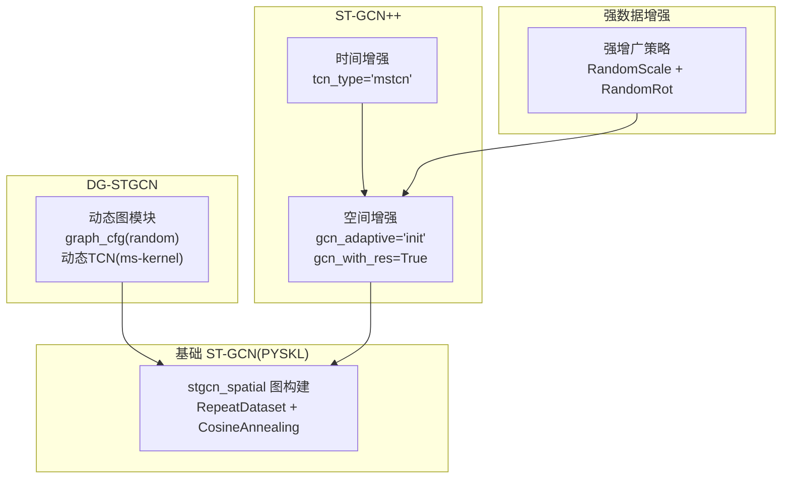
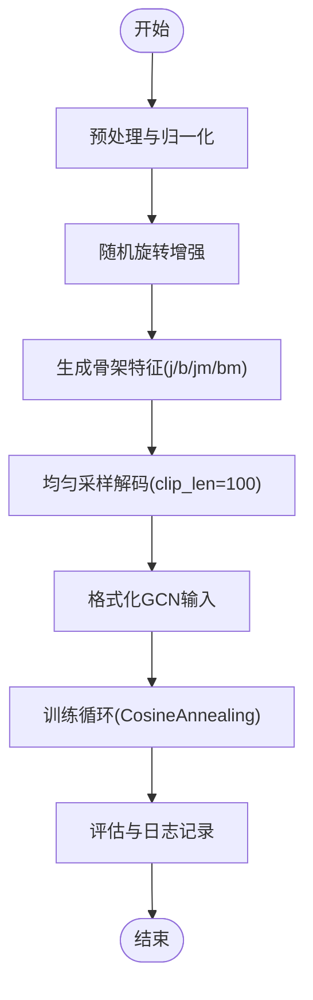
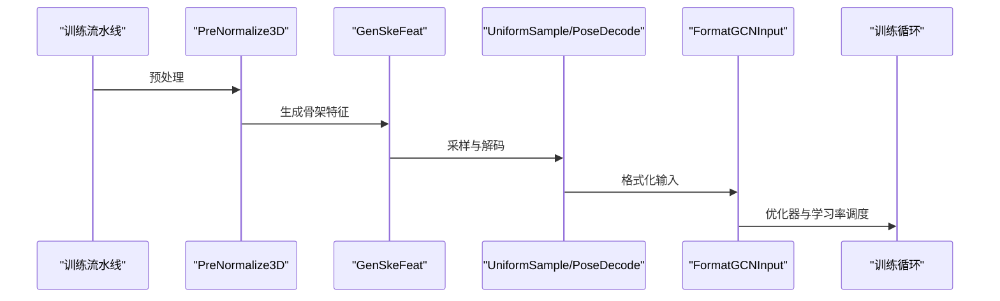
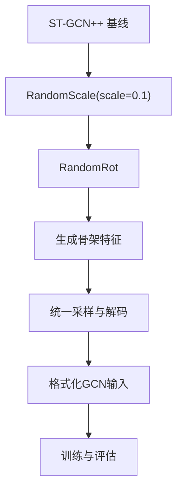
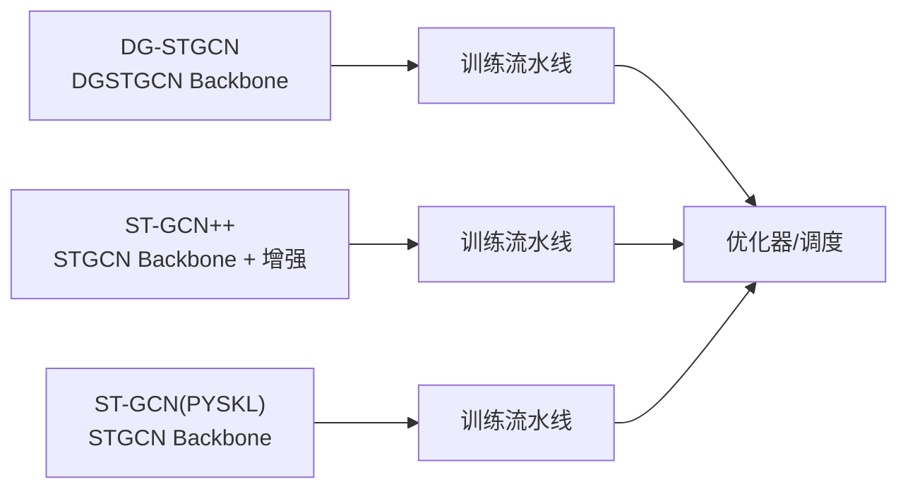

# 其他GCN算法配置模板

<cite>
**本文引用的文件**
- [configs/dgstgcn/README.md](file://configs/dgstgcn/README.md)
- [configs/stgcn++/README.md](file://configs/stgcn++/README.md)
- [configs/strong_aug/README.md](file://configs/strong_aug/README.md)
- [configs/stgcn/README.md](file://configs/stgcn/README.md)
- [configs/dgstgcn/ntu60_xsub_3dkp/j.py](file://configs/dgstgcn/ntu60_xsub_3dkp/j.py)
- [configs/dgstgcn/ntu60_xsub_3dkp/b.py](file://configs/dgstgcn/ntu60_xsub_3dkp/b.py)
- [configs/dgstgcn/ntu60_xsub_3dkp/jm.py](file://configs/dgstgcn/ntu60_xsub_3dkp/jm.py)
- [configs/dgstgcn/ntu60_xsub_3dkp/bm.py](file://configs/dgstgcn/ntu60_xsub_3dkp/bm.py)
- [configs/stgcn++/stgcn++_ntu60_xsub_3dkp/j.py](file://configs/stgcn++/stgcn++_ntu60_xsub_3dkp/j.py)
- [configs/stgcn++/stgcn++_ntu60_xsub_3dkp/b.py](file://configs/stgcn++/stgcn++_ntu60_xsub_3dkp/b.py)
- [configs/stgcn++/stgcn++_ntu60_xsub_3dkp/jm.py](file://configs/stgcn++/stgcn++_ntu60_xsub_3dkp/jm.py)
- [configs/stgcn++/stgcn++_ntu60_xsub_3dkp/bm.py](file://configs/stgcn++/stgcn++_ntu60_xsub_3dkp/bm.py)
- [configs/stgcn_pyskl_ntu60_xsub_3dkp/j.py](file://configs/stgcn/stgcn_pyskl_ntu60_xsub_3dkp/j.py)
- [configs/stgcn_pyskl_ntu60_xsub_3dkp/b.py](file://configs/stgcn/stgcn_pyskl_ntu60_xsub_3dkp/b.py)
- [configs/strong_aug/ntu60_xsub_3dkp/b.py](file://configs/strong_aug/ntu60_xsub_3dkp/b.py)
</cite>

## 目录
1. [引言](#引言)
2. [项目结构](#项目结构)
3. [核心组件](#核心组件)
4. [架构总览](#架构总览)
5. [详细组件分析](#详细组件分析)
6. [依赖关系分析](#依赖关系分析)
7. [性能考量](#性能考量)
8. [故障排查指南](#故障排查指南)
9. [结论](#结论)
10. [附录](#附录)

## 引言
本文件系统性梳理并对比“其他GCN算法配置模板”，重点覆盖以下内容：
- DG-STGCN 的动态图构建策略与配置要点
- ST-GCN++ 的增强训练技术与配置差异
- 强数据增强（Strong Aug）配置模板的设计理念与参数设置
- 与基础 ST-GCN 的配置对比与性能提升路径
- 算法选择指南与配置调优最佳实践

目标是帮助读者在不同数据集与模态下，快速定位合适的配置模板，并理解其背后的机制与权衡。

## 项目结构
本仓库为骨架动作识别提供多套 GCN 算法的配置模板，主要目录如下：
- configs/dgstgcn：DG-STGCN 配置模板，覆盖 NTU RGB+D 多个划分与模态
- configs/stgcn++：ST-GCN++ 配置模板，覆盖 NTU RGB+D 多个划分与模态
- configs/strong_aug：强数据增强配置模板，基于 ST-GCN++ 的增强策略
- configs/stgcn：基础 ST-GCN 配置模板，包含 PYSKL 实践版本与官方实践版本

```mermaid
graph TB
A["configs/dgstgcn"] --> A1["ntu60_xsub_3dkp/j.py"]
A --> A2["ntu60_xsub_3dkp/b.py"]
A --> A3["ntu60_xsub_3dkp/jm.py"]
A --> A4["ntu60_xsub_3dkp/bm.py"]
B["configs/stgcn++"] --> B1["stgcn++_ntu60_xsub_3dkp/j.py"]
B --> B2["stgcn++_ntu60_xsub_3dkp/b.py"]
B --> B3["stgcn++_ntu60_xsub_3dkp/jm.py"]
B --> B4["stgcn++_ntu60_xsub_3dkp/bm.py"]
C["configs/strong_aug"] --> C1["ntu60_xsub_3dkp/b.py"]
D["configs/stgcn"] --> D1["stgcn_pyskl_ntu60_xsub_3dkp/j.py"]
D --> D2["stgcn_pyskl_ntu60_xsub_3dkp/b.py"]
```

**图表来源**
- [configs/dgstgcn/ntu60_xsub_3dkp/j.py](file://configs/dgstgcn/ntu60_xsub_3dkp/j.py#L1-L60)
- [configs/stgcn++/stgcn++_ntu60_xsub_3dkp/j.py](file://configs/stgcn++/stgcn++_ntu60_xsub_3dkp/j.py#L1-L64)
- [configs/strong_aug/ntu60_xsub_3dkp/b.py](file://configs/strong_aug/ntu60_xsub_3dkp/b.py#L1-L66)
- [configs/stgcn/stgcn_pyskl_ntu60_xsub_3dkp/j.py](file://configs/stgcn/stgcn_pyskl_ntu60_xsub_3dkp/j.py#L1-L61)

**章节来源**
- [configs/dgstgcn/README.md](file://configs/dgstgcn/README.md#L1-L52)
- [configs/stgcn++/README.md](file://configs/stgcn++/README.md#L1-L57)
- [configs/strong_aug/README.md](file://configs/strong_aug/README.md#L1-L38)
- [configs/stgcn/README.md](file://configs/stgcn/README.md#L1-L67)

## 核心组件
本节聚焦三类配置模板的核心要素与差异点：

- DG-STGCN
  - 动态图模块：graph_cfg 使用随机模式与可学习滤波器，支持自适应图学习
  - 动态 TCN 模块：多尺度时间卷积核组合，融合动态关节-骨架融合模块
  - 训练策略：CosineAnnealing 学习率调度，较长训练轮次以稳定动态图学习

- ST-GCN++
  - 空间模块增强：gcn_adaptive='init'，gcn_with_res=True，引入残差连接
  - 时间模块增强：tcn_type='mstcn'（多分支 TCN），提升多尺度时间建模能力
  - 数据增强：RepeatDataset 增强样本多样性；强增广（Strong Aug）加入 RandomScale 与 RandomRot

- 强数据增强（Strong Aug）
  - 设计理念：通过更强的空间几何变换（RandomScale、RandomRot）提升模型对尺度与旋转变化的鲁棒性
  - 参数设置：与 ST-GCN++ 基线一致的骨干网络与输入格式，仅在训练流水线中增加强几何扰动

- 基础 ST-GCN（PYSKL 实践）
  - graph_cfg 使用 stgcn_spatial 模式，保持与论文一致的图构建方式
  - 采用 RepeatDataset 与 CosineAnnealing 调度，训练轮次较短但更高效

**章节来源**
- [configs/dgstgcn/ntu60_xsub_3dkp/j.py](file://configs/dgstgcn/ntu60_xsub_3dkp/j.py#L5-L14)
- [configs/stgcn++/stgcn++_ntu60_xsub_3dkp/b.py](file://configs/stgcn++/stgcn++_ntu60_xsub_3dkp/b.py#L1-L64)
- [configs/strong_aug/ntu60_xsub_3dkp/b.py](file://configs/strong_aug/ntu60_xsub_3dkp/b.py#L1-L66)
- [configs/stgcn/stgcn_pyskl_ntu60_xsub_3dkp/j.py](file://configs/stgcn/stgcn_pyskl_ntu60_xsub_3dkp/j.py#L1-L61)

## 架构总览
下图展示三类算法在配置层面的关键差异与共同点，便于快速定位适合的模板。

**图表来源**
- [configs/dgstgcn/ntu60_xsub_3dkp/j.py](file://configs/dgstgcn/ntu60_xsub_3dkp/j.py#L5-L14)
- [configs/stgcn++/stgcn++_ntu60_xsub_3dkp/b.py](file://configs/stgcn++/stgcn++_ntu60_xsub_3dkp/b.py#L1-L64)
- [configs/strong_aug/ntu60_xsub_3dkp/b.py](file://configs/strong_aug/ntu60_xsub_3dkp/b.py#L13-L22)
- [configs/stgcn/stgcn_pyskl_ntu60_xsub_3dkp/j.py](file://configs/stgcn/stgcn_pyskl_ntu60_xsub_3dkp/j.py#L1-L6)

## 详细组件分析

### DG-STGCN 组件分析
- 动态图构建策略
  - graph_cfg.mode='random'：不固定拓扑，允许图结构随数据与任务自适应学习
  - num_filter、init_off、init_std：控制动态图滤波器数量与初始化噪声，影响图学习稳定性与表达力
- 动态 TCN 模块
  - tcn_ms_cfg 多尺度卷积核组合，模拟可变感受野的时间建模
  - 结合动态关节-骨架融合模块，实现多层级时序特征融合
- 训练配置
  - CosineAnnealing 学习率调度，总训练轮次较长，有利于稳定动态图学习

**图表来源**
- [configs/dgstgcn/ntu60_xsub_3dkp/j.py](file://configs/dgstgcn/ntu60_xsub_3dkp/j.py#L18-L42)

**章节来源**
- [configs/dgstgcn/ntu60_xsub_3dkp/j.py](file://configs/dgstgcn/ntu60_xsub_3dkp/j.py#L1-L60)
- [configs/dgstgcn/README.md](file://configs/dgstgcn/README.md#L1-L52)

### ST-GCN++ 组件分析
- 空间模块增强
  - gcn_adaptive='init'：使用初始化自适应图，兼顾效率与表达力
  - gcn_with_res=True：引入残差连接，缓解梯度消失，提升深层网络训练稳定性
- 时间模块增强
  - tcn_type='mstcn'：多分支 TCN 提升多尺度时间特征提取能力
- 数据增强与重复采样
  - RepeatDataset(times=5)：扩大有效样本规模，缓解小数据集过拟合
  - 训练轮次较短但更高效，适合快速收敛

**图表来源**
- [configs/stgcn++/stgcn++_ntu60_xsub_3dkp/b.py](file://configs/stgcn++/stgcn++_ntu60_xsub_3dkp/b.py#L13-L39)

**章节来源**
- [configs/stgcn++/stgcn++_ntu60_xsub_3dkp/b.py](file://configs/stgcn++/stgcn++_ntu60_xsub_3dkp/b.py#L1-L64)
- [configs/stgcn++/README.md](file://configs/stgcn++/README.md#L1-L57)

### 强数据增强（Strong Aug）组件分析
- 设计理念
  - 在 ST-GCN++ 基线基础上引入更强的空间几何扰动，提升模型对尺度与旋转变化的鲁棒性
- 关键参数
  - RandomScale(scale=0.1)：对骨架坐标进行缩放扰动
  - RandomRot：对骨架进行旋转扰动
  - 保持 ST-GCN++ 的骨干网络与输入格式不变，仅在训练阶段增加几何扰动

**图表来源**
- [configs/strong_aug/ntu60_xsub_3dkp/b.py](file://configs/strong_aug/ntu60_xsub_3dkp/b.py#L13-L22)

**章节来源**
- [configs/strong_aug/ntu60_xsub_3dkp/b.py](file://configs/strong_aug/ntu60_xsub_3dkp/b.py#L1-L66)
- [configs/strong_aug/README.md](file://configs/strong_aug/README.md#L1-L38)

### 基础 ST-GCN（PYSKL 实践）组件分析
- 图构建方式
  - graph_cfg.mode='stgcn_spatial'：沿用 ST-GCN 论文中的空间图构建策略
- 数据与训练
  - RepeatDataset 与 CosineAnnealing 调度，训练轮次适中，适合快速验证与部署
- 与 ST-GCN++ 的差异
  - 缺少空间/时间模块的增强项（如残差、多分支 TCN），训练更轻量

**章节来源**
- [configs/stgcn/stgcn_pyskl_ntu60_xsub_3dkp/j.py](file://configs/stgcn/stgcn_pyskl_ntu60_xsub_3dkp/j.py#L1-L61)
- [configs/stgcn/README.md](file://configs/stgcn/README.md#L1-L67)

## 依赖关系分析
- 模型类型与骨干网络
  - DG-STGCN：backbone.type='DGSTGCN'
  - ST-GCN++：backbone.type='STGCN'，并引入空间/时间模块增强
  - 基础 ST-GCN：backbone.type='STGCN'，graph_cfg 使用 stgcn_spatial
- 数据流水线
  - 骨干网络差异导致 FormatGCNInput 的输入维度与格式要求略有不同
  - RepeatDataset 的引入影响训练样本规模与迭代节奏
- 训练策略
  - CosineAnnealing 作为统一的学习率调度策略
  - 不同算法的总训练轮次存在显著差异（DG-STGCN 更长，ST-GCN++ 更短）

**图表来源**
- [configs/dgstgcn/ntu60_xsub_3dkp/j.py](file://configs/dgstgcn/ntu60_xsub_3dkp/j.py#L5-L14)
- [configs/stgcn++/stgcn++_ntu60_xsub_3dkp/b.py](file://configs/stgcn++/stgcn++_ntu60_xsub_3dkp/b.py#L1-L9)
- [configs/stgcn/stgcn_pyskl_ntu60_xsub_3dkp/j.py](file://configs/stgcn/stgcn_pyskl_ntu60_xsub_3dkp/j.py#L1-L6)

**章节来源**
- [configs/dgstgcn/ntu60_xsub_3dkp/j.py](file://configs/dgstgcn/ntu60_xsub_3dkp/j.py#L1-L60)
- [configs/stgcn++/stgcn++_ntu60_xsub_3dkp/b.py](file://configs/stgcn++/stgcn++_ntu60_xsub_3dkp/b.py#L1-L64)
- [configs/stgcn/stgcn_pyskl_ntu60_xsub_3dkp/j.py](file://configs/stgcn/stgcn_pyskl_ntu60_xsub_3dkp/j.py#L1-L61)

## 性能考量
- 训练轮次与收敛速度
  - DG-STGCN：较长训练轮次，有利于稳定动态图学习，但计算成本更高
  - ST-GCN++：较短训练轮次，结合 RepeatDataset 与 CosineAnnealing，快速收敛
  - 基础 ST-GCN：最短训练轮次，适合快速部署与资源受限场景
- 数据增强对泛化的影响
  - 强增广（RandomScale + RandomRot）可显著提升模型对尺度与旋转变化的鲁棒性
  - 与 ST-GCN++ 的多分支 TCN 结合，进一步提升多尺度时间建模能力
- 模态与融合策略
  - Two-Stream 与 Four-Stream 融合策略在各算法 README 中均有说明，需根据下游任务与资源平衡选择

**章节来源**
- [configs/dgstgcn/README.md](file://configs/dgstgcn/README.md#L29-L33)
- [configs/stgcn++/README.md](file://configs/stgcn++/README.md#L34-L38)
- [configs/strong_aug/README.md](file://configs/strong_aug/README.md#L29-L33)
- [configs/stgcn/README.md](file://configs/stgcn/README.md#L44-L48)

## 故障排查指南
- 训练不稳定或收敛缓慢
  - DG-STGCN：检查 graph_cfg 初始化参数（num_filter、init_off、init_std）是否合理；适当降低初始学习率或延长 warmup
  - ST-GCN++：确认 RepeatDataset 是否导致内存压力；必要时减少 times 或增大 batch size
- 输入维度不匹配
  - 确认 FormatGCNInput 的 num_person 设置与实际数据一致；若多人场景建议使用 demo 中的跟踪逻辑
- 数据增强导致过拟合
  - 若强增广后验证集性能下降，尝试降低 RandomScale 或 RandomRot 的幅度，或减少 RepeatDataset 的 times

**章节来源**
- [configs/dgstgcn/ntu60_xsub_3dkp/j.py](file://configs/dgstgcn/ntu60_xsub_3dkp/j.py#L43-L49)
- [configs/stgcn++/stgcn++_ntu60_xsub_3dkp/b.py](file://configs/stgcn++/stgcn++_ntu60_xsub_3dkp/b.py#L44-L49)
- [configs/strong_aug/ntu60_xsub_3dkp/b.py](file://configs/strong_aug/ntu60_xsub_3dkp/b.py#L46-L51)
- [demo/demo_skeleton.py](file://demo/demo_skeleton.py#L238-L244)

## 结论
- 若追求更强的动态建模与鲁棒性，优先选择 DG-STGCN 或 ST-GCN++ + 强增广
- 若需要快速部署与较低资源消耗，基础 ST-GCN（PYSKL 实践）更合适
- 配置调优应围绕图构建策略、时间建模能力、数据增强强度与训练轮次展开

## 附录
- 算法选择指南
  - 高精度优先：DG-STGCN 或 ST-GCN++ + 强增广
  - 快速上线：基础 ST-GCN（PYSKL 实践）
  - 多人场景：结合 demo 的姿态跟踪逻辑，确保 FormatGCNInput 的 num_person 合理
- 配置调优最佳实践
  - 从 ST-GCN++ 基线出发，逐步引入强增广与多分支 TCN
  - 根据显存与时间预算调整 RepeatDataset 的 times 与总训练轮次
  - 使用 CosineAnnealing 并结合合理的 warmup 与权重衰减