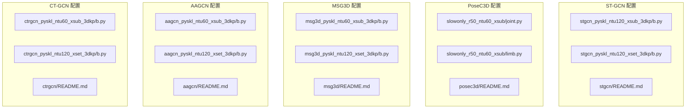
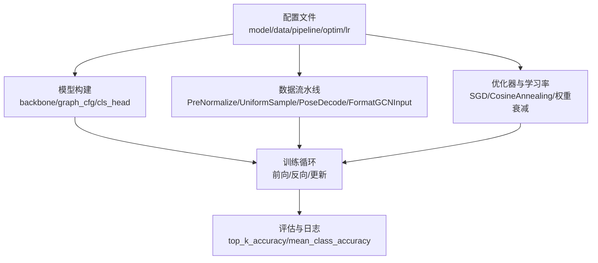
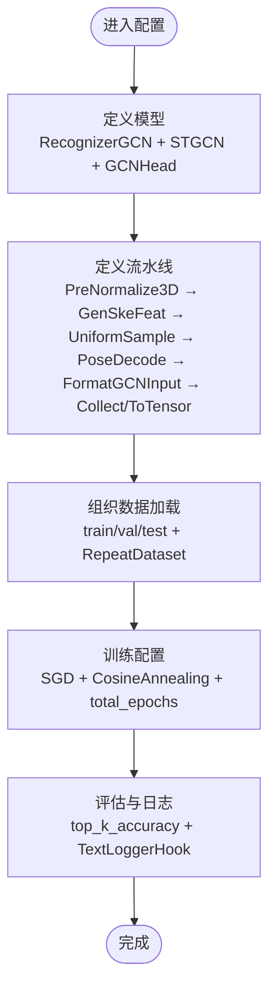
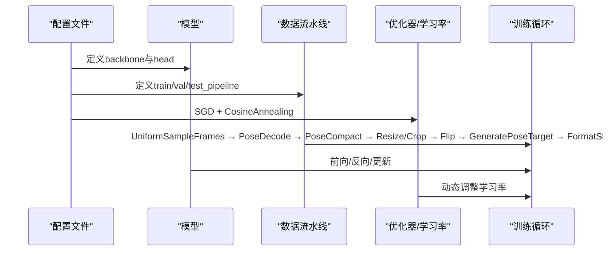
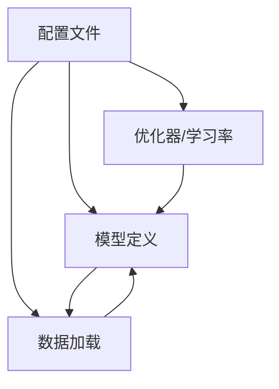

# 算法配置模板

<cite>
**本文引用的文件**
- [configs/stgcn/stgcn_pyskl_ntu120_xsub_3dkp/b.py](file://configs/stgcn/stgcn_pyskl_ntu120_xsub_3dkp/b.py)
- [configs/stgcn/stgcn_pyskl_ntu120_xset_3dkp/b.py](file://configs/stgcn/stgcn_pyskl_ntu120_xset_3dkp/b.py)
- [configs/posec3d/slowonly_r50_ntu60_xsub/joint.py](file://configs/posec3d/slowonly_r50_ntu60_xsub/joint.py)
- [configs/posec3d/slowonly_r50_ntu60_xsub/limb.py](file://configs/posec3d/slowonly_r50_ntu60_xsub/limb.py)
- [configs/msg3d/msg3d_pyskl_ntu60_xsub_3dkp/b.py](file://configs/msg3d/msg3d_pyskl_ntu60_xsub_3dkp/b.py)
- [configs/msg3d/msg3d_pyskl_ntu120_xset_3dkp/b.py](file://configs/msg3d/msg3d_pyskl_ntu120_xset_3dkp/b.py)
- [configs/aagcn/aagcn_pyskl_ntu60_xsub_3dkp/b.py](file://configs/aagcn/aagcn_pyskl_ntu60_xsub_3dkp/b.py)
- [configs/aagcn/aagcn_pyskl_ntu120_xset_3dkp/b.py](file://configs/aagcn/aagcn_pyskl_ntu120_xset_3dkp/b.py)
- [configs/ctrgcn/ctrgcn_pyskl_ntu60_xsub_3dkp/b.py](file://configs/ctrgcn/ctrgcn_pyskl_ntu60_xsub_3dkp/b.py)
- [configs/ctrgcn/ctrgcn_pyskl_ntu120_xset_3dkp/b.py](file://configs/ctrgcn/ctrgcn_pyskl_ntu120_xset_3dkp/b.py)
- [configs/stgcn/README.md](file://configs/stgcn/README.md)
- [configs/posec3d/README.md](file://configs/posec3d/README.md)
- [configs/msg3d/README.md](file://configs/msg3d/README.md)
- [configs/aagcn/README.md](file://configs/aagcn/README.md)
- [configs/ctrgcn/README.md](file://configs/ctrgcn/README.md)
</cite>

## 目录
1. [简介](#简介)
2. [项目结构](#项目结构)
3. [核心组件](#核心组件)
4. [架构总览](#架构总览)
5. [详细组件分析](#详细组件分析)
6. [依赖关系分析](#依赖关系分析)
7. [性能考量与调优建议](#性能考量与调优建议)
8. [故障排查指南](#故障排查指南)
9. [结论](#结论)
10. [附录：典型配置模板与使用场景](#附录典型配置模板与使用场景)

## 简介
本文件系统性梳理 PySKL 仓库中主流骨架动作识别算法的配置模板，覆盖 ST-GCN、PoseC3D、MSG3D、AAGCN、CT-GCN 等。内容包括：
- 各算法配置模板的结构与关键字段说明
- 图结构参数、时空卷积核大小、注意力机制等特有配置
- 超参数（学习率、批次大小、训练轮数、优化器策略）设置与调优建议
- 不同算法配置的对比分析与选择指南
- 性能影响分析与典型使用场景

## 项目结构
配置文件按算法与数据集划分，每个算法目录下包含若干子目录，分别对应不同标注方式（3D 官方标注或 HRNet 2D 骨架）、不同训练策略（XSub/XView/XSet）以及不同模态（Joint/Bone/JointMotion/BoneMotion）。以 ST-GCN 为例，常见路径如下：
- configs/stgcn/stgcn_pyskl_ntu120_xsub_3dkp/b.py
- configs/stgcn/stgcn_pyskl_ntu120_xset_3dkp/b.py
- configs/stgcn/README.md

**图表来源**
- [configs/stgcn/stgcn_pyskl_ntu120_xsub_3dkp/b.py](file://configs/stgcn/stgcn_pyskl_ntu120_xsub_3dkp/b.py#L1-L61)
- [configs/stgcn/stgcn_pyskl_ntu120_xset_3dkp/b.py](file://configs/stgcn/stgcn_pyskl_ntu120_xset_3dkp/b.py#L1-L61)
- [configs/posec3d/slowonly_r50_ntu60_xsub/joint.py](file://configs/posec3d/slowonly_r50_ntu60_xsub/joint.py#L1-L80)
- [configs/posec3d/slowonly_r50_ntu60_xsub/limb.py](file://configs/posec3d/slowonly_r50_ntu60_xsub/limb.py#L1-L86)
- [configs/msg3d/msg3d_pyskl_ntu60_xsub_3dkp/b.py](file://configs/msg3d/msg3d_pyskl_ntu60_xsub_3dkp/b.py#L1-L61)
- [configs/msg3d/msg3d_pyskl_ntu120_xset_3dkp/b.py](file://configs/msg3d/msg3d_pyskl_ntu120_xset_3dkp/b.py#L1-L61)
- [configs/aagcn/aagcn_pyskl_ntu60_xsub_3dkp/b.py](file://configs/aagcn/aagcn_pyskl_ntu60_xsub_3dkp/b.py#L1-L61)
- [configs/aagcn/aagcn_pyskl_ntu120_xset_3dkp/b.py](file://configs/aagcn/aagcn_pyskl_ntu120_xset_3dkp/b.py#L1-L61)
- [configs/ctrgcn/ctrgcn_pyskl_ntu60_xsub_3dkp/b.py](file://configs/ctrgcn/ctrgcn_pyskl_ntu60_xsub_3dkp/b.py#L1-L61)
- [configs/ctrgcn/ctrgcn_pyskl_ntu120_xset_3dkp/b.py](file://configs/ctrgcn/ctrgcn_pyskl_ntu120_xset_3dkp/b.py#L1-L61)

**章节来源**
- [configs/stgcn/README.md](file://configs/stgcn/README.md#L1-L67)
- [configs/posec3d/README.md](file://configs/posec3d/README.md#L1-L120)
- [configs/msg3d/README.md](file://configs/msg3d/README.md#L1-L57)
- [configs/aagcn/README.md](file://configs/aagcn/README.md#L1-L59)
- [configs/ctrgcn/README.md](file://configs/ctrgcn/README.md#L1-L57)

## 核心组件
- 模型定义（model）
  - 识别器类型（type），如 RecognizerGCN 或 Recognizer3D
  - 背景网络（backbone）：STGCN、MSG3D、AAGCN、CTRGCN、ResNet3dSlowOnly 等
  - 图结构配置（graph_cfg）：布局（layout）、模式（mode）
  - 分类头（cls_head）：GCNHead、I3DHead 等
- 数据集与流水线（data, train/val/test_pipeline）
  - 数据集类型（dataset_type）、标注文件（ann_file）
  - 流水线组件：预处理、采样、解码、格式化、收集与张量化
- 训练配置（optimizer, lr_config, total_epochs, evaluation, log_config 等）

**章节来源**
- [configs/stgcn/stgcn_pyskl_ntu120_xsub_3dkp/b.py](file://configs/stgcn/stgcn_pyskl_ntu120_xsub_3dkp/b.py#L1-L61)
- [configs/msg3d/msg3d_pyskl_ntu60_xsub_3dkp/b.py](file://configs/msg3d/msg3d_pyskl_ntu60_xsub_3dkp/b.py#L1-L61)
- [configs/aagcn/aagcn_pyskl_ntu60_xsub_3dkp/b.py](file://configs/aagcn/aagcn_pyskl_ntu60_xsub_3dkp/b.py#L1-L61)
- [configs/ctrgcn/ctrgcn_pyskl_ntu60_xsub_3dkp/b.py](file://configs/ctrgcn/ctrgcn_pyskl_ntu60_xsub_3dkp/b.py#L1-L61)
- [configs/posec3d/slowonly_r50_ntu60_xsub/joint.py](file://configs/posec3d/slowonly_r50_ntu60_xsub/joint.py#L1-L80)

## 架构总览
下图展示了配置文件在训练流程中的作用：模型定义决定网络结构与图结构；数据流水线负责骨架/热力图输入准备；优化器与学习率策略控制收敛行为；评估与日志配置贯穿训练过程。

**图表来源**
- [configs/stgcn/stgcn_pyskl_ntu120_xsub_3dkp/b.py](file://configs/stgcn/stgcn_pyskl_ntu120_xsub_3dkp/b.py#L1-L61)
- [configs/posec3d/slowonly_r50_ntu60_xsub/joint.py](file://configs/posec3d/slowonly_r50_ntu60_xsub/joint.py#L1-L80)
- [configs/msg3d/msg3d_pyskl_ntu60_xsub_3dkp/b.py](file://configs/msg3d/msg3d_pyskl_ntu60_xsub_3dkp/b.py#L1-L61)
- [configs/aagcn/aagcn_pyskl_ntu60_xsub_3dkp/b.py](file://configs/aagcn/aagcn_pyskl_ntu60_xsub_3dkp/b.py#L1-L61)
- [configs/ctrgcn/ctrgcn_pyskl_ntu60_xsub_3dkp/b.py](file://configs/ctrgcn/ctrgcn_pyskl_ntu60_xsub_3dkp/b.py#L1-L61)

## 详细组件分析

### ST-GCN 配置模板
- 模型与图结构
  - 识别器：RecognizerGCN
  - 背景网络：STGCN
  - 图结构：layout=nturgb+d，mode=stgcn_spatial
  - 分类头：GCNHead，num_classes=类别数，in_channels=特征通道
- 数据流水线
  - 预处理：PreNormalize3D
  - 特征生成：GenSkeFeat（dataset=nturgb+d，feats=['b']）
  - 采样：UniformSample（clip_len=时长，训练/验证/测试不同 num_clips）
  - 解码与格式化：PoseDecode → FormatGCNInput（num_person=2）
  - 收集与张量化：Collect → ToTensor
- 训练配置
  - 优化器：SGD（momentum、weight_decay、nesterov）
  - 学习率策略：CosineAnnealing（min_lr=0，by_epoch=False）
  - 训练轮数：total_epochs
  - 评估与日志：evaluation（metrics）、log_config（TextLoggerHook）

**图表来源**
- [configs/stgcn/stgcn_pyskl_ntu120_xsub_3dkp/b.py](file://configs/stgcn/stgcn_pyskl_ntu120_xsub_3dkp/b.py#L1-L61)

**章节来源**
- [configs/stgcn/stgcn_pyskl_ntu120_xsub_3dkp/b.py](file://configs/stgcn/stgcn_pyskl_ntu120_xsub_3dkp/b.py#L1-L61)
- [configs/stgcn/stgcn_pyskl_ntu120_xset_3dkp/b.py](file://configs/stgcn/stgcn_pyskl_ntu120_xset_3dkp/b.py#L1-L61)
- [configs/stgcn/README.md](file://configs/stgcn/README.md#L1-L67)

### PoseC3D 配置模板
- 模型与骨干
  - 识别器：Recognizer3D
  - 背景网络：ResNet3dSlowOnly（in_channels、stage_blocks、inflate、stride 等）
  - 分类头：I3DHead（dropout）
  - 测试配置：average_clips='prob'
- 数据流水线
  - 帧采样：UniformSampleFrames（clip_len、num_clips）
  - 骨架解码与压缩：PoseDecode → PoseCompact
  - 尺度变换与裁剪：Resize、RandomResizedCrop
  - 翻转增强：Flip（left_kp/right_kp）
  - 目标生成：GeneratePoseTarget（with_kp 与 with_limb 切换）
  - 形状格式化：FormatShape（NCTHW_Heatmap）
  - 收集与张量化：Collect → ToTensor
- 训练配置
  - 优化器：SGD（grad_clip 可选）
  - 学习率策略：CosineAnnealing（by_epoch=False）
  - 评估指标：top_k_accuracy、mean_class_accuracy（NTU60 的均类准确率）

**图表来源**
- [configs/posec3d/slowonly_r50_ntu60_xsub/joint.py](file://configs/posec3d/slowonly_r50_ntu60_xsub/joint.py#L1-L80)
- [configs/posec3d/slowonly_r50_ntu60_xsub/limb.py](file://configs/posec3d/slowonly_r50_ntu60_xsub/limb.py#L1-L86)

**章节来源**
- [configs/posec3d/slowonly_r50_ntu60_xsub/joint.py](file://configs/posec3d/slowonly_r50_ntu60_xsub/joint.py#L1-L80)
- [configs/posec3d/slowonly_r50_ntu60_xsub/limb.py](file://configs/posec3d/slowonly_r50_ntu60_xsub/limb.py#L1-L86)
- [configs/posec3d/README.md](file://configs/posec3d/README.md#L1-L120)

### MSG3D 配置模板
- 模型与图结构
  - 识别器：RecognizerGCN
  - 背景网络：MSG3D
  - 图结构：layout=nturgb+d，mode=binary_adj
  - 分类头：GCNHead（num_classes、in_channels）
- 数据流水线
  - 预处理与采样：PreNormalize3D → GenSkeFeat → UniformSample → PoseDecode → FormatGCNInput → Collect/ToTensor
- 训练配置
  - 优化器：SGD（momentum、weight_decay、nesterov）
  - 学习率策略：CosineAnnealing（min_lr=0，by_epoch=False）
  - 训练轮数与评估：total_epochs、evaluation、log_config

**章节来源**
- [configs/msg3d/msg3d_pyskl_ntu60_xsub_3dkp/b.py](file://configs/msg3d/msg3d_pyskl_ntu60_xsub_3dkp/b.py#L1-L61)
- [configs/msg3d/msg3d_pyskl_ntu120_xset_3dkp/b.py](file://configs/msg3d/msg3d_pyskl_ntu120_xset_3dkp/b.py#L1-L61)
- [configs/msg3d/README.md](file://configs/msg3d/README.md#L1-L57)

### AAGCN 配置模板
- 模型与图结构
  - 识别器：RecognizerGCN
  - 背景网络：AAGCN
  - 图结构：layout=nturgb+d，mode=spatial
  - 分类头：GCNHead（num_classes、in_channels）
- 数据流水线
  - 预处理与采样：PreNormalize3D → GenSkeFeat → UniformSample → PoseDecode → FormatGCNInput → Collect/ToTensor
- 训练配置
  - 优化器：SGD（momentum、weight_decay、nesterov）
  - 学习率策略：CosineAnnealing（min_lr=0，by_epoch=False）
  - 训练轮数与评估：total_epochs、evaluation、log_config

**章节来源**
- [configs/aagcn/aagcn_pyskl_ntu60_xsub_3dkp/b.py](file://configs/aagcn/aagcn_pyskl_ntu60_xsub_3dkp/b.py#L1-L61)
- [configs/aagcn/aagcn_pyskl_ntu120_xset_3dkp/b.py](file://configs/aagcn/aagcn_pyskl_ntu120_xset_3dkp/b.py#L1-L61)
- [configs/aagcn/README.md](file://configs/aagcn/README.md#L1-L59)

### CTR-GCN 配置模板
- 模型与图结构
  - 识别器：RecognizerGCN
  - 背景网络：CTRGCN
  - 图结构：layout=nturgb+d，mode=spatial
  - 分类头：GCNHead（num_classes、in_channels）
- 数据流水线
  - 预处理与采样：PreNormalize3D → GenSkeFeat → UniformSample → PoseDecode → FormatGCNInput → Collect/ToTensor
- 训练配置
  - 优化器：SGD（momentum、weight_decay、nesterov）
  - 学习率策略：CosineAnnealing（min_lr=0，by_epoch=False）
  - 训练轮数与评估：total_epochs、evaluation、log_config

**章节来源**
- [configs/ctrgcn/ctrgcn_pyskl_ntu60_xsub_3dkp/b.py](file://configs/ctrgcn/ctrgcn_pyskl_ntu60_xsub_3dkp/b.py#L1-L61)
- [configs/ctrgcn/ctrgcn_pyskl_ntu120_xset_3dkp/b.py](file://configs/ctrgcn/ctrgcn_pyskl_ntu120_xset_3dkp/b.py#L1-L61)
- [configs/ctrgcn/README.md](file://configs/ctrgcn/README.md#L1-L57)

## 依赖关系分析
- 配置文件内部依赖
  - model/backbone/graph_cfg/cls_head 之间存在强耦合，需保持一致的输入通道与类别数
  - data.train.pipeline 与 backbone 输入格式（如 GCN 的 keypoint 或 3D CNN 的 NCTHW_Heatmap）必须匹配
- 外部依赖
  - 数据集标注文件（ann_file）与 split（xsub/xview/xset）需与实际数据一致
  - 优化器与学习率策略需与总轮数、批次规模匹配（仓库 README 提供了线性缩放学习率的说明）

**图表来源**
- [configs/stgcn/stgcn_pyskl_ntu120_xsub_3dkp/b.py](file://configs/stgcn/stgcn_pyskl_ntu120_xsub_3dkp/b.py#L1-L61)
- [configs/posec3d/slowonly_r50_ntu60_xsub/joint.py](file://configs/posec3d/slowonly_r50_ntu60_xsub/joint.py#L1-L80)

**章节来源**
- [configs/stgcn/README.md](file://configs/stgcn/README.md#L44-L47)
- [configs/posec3d/README.md](file://configs/posec3d/README.md#L50-L51)
- [configs/msg3d/README.md](file://configs/msg3d/README.md#L34-L37)
- [configs/aagcn/README.md](file://configs/aagcn/README.md#L36-L39)
- [configs/ctrgcn/README.md](file://configs/ctrgcn/README.md#L34-L37)

## 性能考量与调优建议
- 学习率与批次大小
  - 仓库 README 明确采用线性缩放学习率（初始学习率与批次大小成正比）。若更改批次规模，请同步调整初始学习率。
- 采样长度与多片段测试
  - PoseC3D 的多片段测试（num_clips=10）可提升性能但耗时较长；若追求速度，可减少 num_clips 并关闭 double（见 README 中的提示）。
- 图结构与模式
  - ST-GCN 使用 stgcn_spatial，MSG3D 使用 binary_adj，AAGCN/CTR-GCN 使用 spatial。不同模式对图拓扑建模能力与计算复杂度有显著影响。
- 优化器与动量
  - SGD + Nesterov 在多数 GCN 配置中表现稳定；若出现震荡，可适当降低初始学习率或启用 grad_clip。
- 训练轮数与早停
  - CosineAnnealing 有助于稳定收敛；结合验证指标（top_k_accuracy）进行早停或检查点选择。

**章节来源**
- [configs/stgcn/README.md](file://configs/stgcn/README.md#L44-L47)
- [configs/posec3d/README.md](file://configs/posec3d/README.md#L50-L66)
- [configs/msg3d/README.md](file://configs/msg3d/README.md#L34-L37)
- [configs/aagcn/README.md](file://configs/aagcn/README.md#L36-L39)
- [configs/ctrgcn/README.md](file://configs/ctrgcn/README.md#L34-L37)

## 故障排查指南
- 训练不收敛或震荡
  - 检查学习率是否与批次大小匹配（线性缩放）
  - 尝试启用 grad_clip 或降低初始学习率
- 内存不足
  - 减小 videos_per_gpu 或 workers_per_gpu
  - 对 PoseC3D，考虑减少 num_clips 或禁用双样本（double）
- 数据维度不匹配
  - 确认 backbone 输入格式与 pipeline 输出一致（GCN 的 keypoint 或 3D CNN 的 NCTHW_Heatmap）
- 评估指标异常
  - 核对 evaluation.metrics 与数据集类别数，确保 num_classes 与 ann_file split 一致

**章节来源**
- [configs/posec3d/README.md](file://configs/posec3d/README.md#L50-L66)
- [configs/stgcn/stgcn_pyskl_ntu120_xsub_3dkp/b.py](file://configs/stgcn/stgcn_pyskl_ntu120_xsub_3dkp/b.py#L37-L46)
- [configs/posec3d/slowonly_r50_ntu60_xsub/joint.py](file://configs/posec3d/slowonly_r50_ntu60_xsub/joint.py#L59-L68)

## 结论
- ST-GCN、MSG3D、AAGCN、CT-GCN 均通过 GCN 架构实现骨架动作识别，差异主要体现在图结构建模与注意力机制设计
- PoseC3D 将 2D 骨架映射为 3D 热力图并通过 3D 卷积进行建模，适合大规模数据集与多模态融合
- 配置模板的关键在于：模型与图结构的一致性、数据流水线与骨干输入格式的匹配、优化器与学习率策略的稳定性
- 实践中应遵循仓库提供的线性缩放学习率原则，并根据任务需求在性能与速度间权衡

## 附录：典型配置模板与使用场景
- ST-GCN（NTURGB+D 120 XSub，3D 骨架，Joint 模态）
  - 路径参考：configs/stgcn/stgcn_pyskl_ntu120_xsub_3dkp/b.py
  - 典型特征：graph_cfg.mode=stgcn_spatial，num_classes=120，clip_len=100，CosineAnnealing
- PoseC3D（NTURGB+D 60 XSub，HRNet 2D 骨架，Joint 模态）
  - 路径参考：configs/posec3d/slowonly_r50_ntu60_xsub/joint.py
  - 典型特征：ResNet3dSlowOnly，GeneratePoseTarget(with_kp=True)，NCTHW_Heatmap
- MSG3D（NTURGB+D 120 XSet，3D 骨架，Bone 模态）
  - 路径参考：configs/msg3d/msg3d_pyskl_ntu120_xset_3dkp/b.py
  - 典型特征：graph_cfg.mode=binary_adj，num_classes=120，clip_len=100
- AAGCN（NTURGB+D 120 XSet，3D 骨架，Joint 模态）
  - 路径参考：configs/aagcn/aagcn_pyskl_ntu120_xset_3dkp/b.py
  - 典型特征：graph_cfg.mode=spatial，num_classes=120，clip_len=100
- CTR-GCN（NTURGB+D 120 XSet，3D 骨架，Bone 模态）
  - 路径参考：configs/ctrgcn/ctrgcn_pyskl_ntu120_xset_3dkp/b.py
  - 典型特征：graph_cfg.mode=spatial，num_classes=120，clip_len=100

**章节来源**
- [configs/stgcn/stgcn_pyskl_ntu120_xsub_3dkp/b.py](file://configs/stgcn/stgcn_pyskl_ntu120_xsub_3dkp/b.py#L1-L61)
- [configs/posec3d/slowonly_r50_ntu60_xsub/joint.py](file://configs/posec3d/slowonly_r50_ntu60_xsub/joint.py#L1-L80)
- [configs/msg3d/msg3d_pyskl_ntu120_xset_3dkp/b.py](file://configs/msg3d/msg3d_pyskl_ntu120_xset_3dkp/b.py#L1-L61)
- [configs/aagcn/aagcn_pyskl_ntu120_xset_3dkp/b.py](file://configs/aagcn/aagcn_pyskl_ntu120_xset_3dkp/b.py#L1-L61)
- [configs/ctrgcn/ctrgcn_pyskl_ntu120_xset_3dkp/b.py](file://configs/ctrgcn/ctrgcn_pyskl_ntu120_xset_3dkp/b.py#L1-L61)