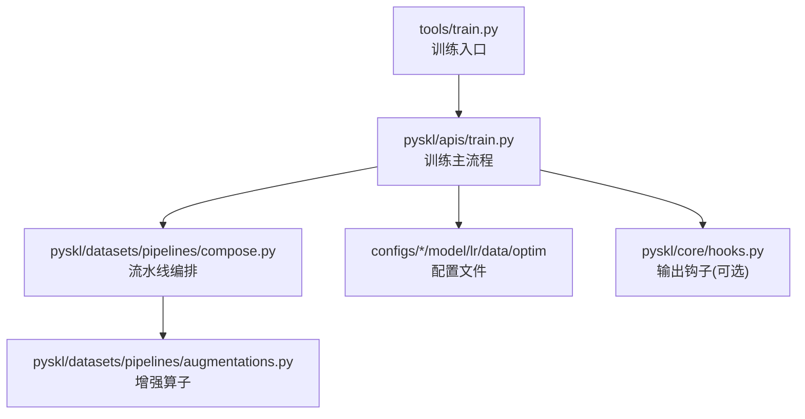
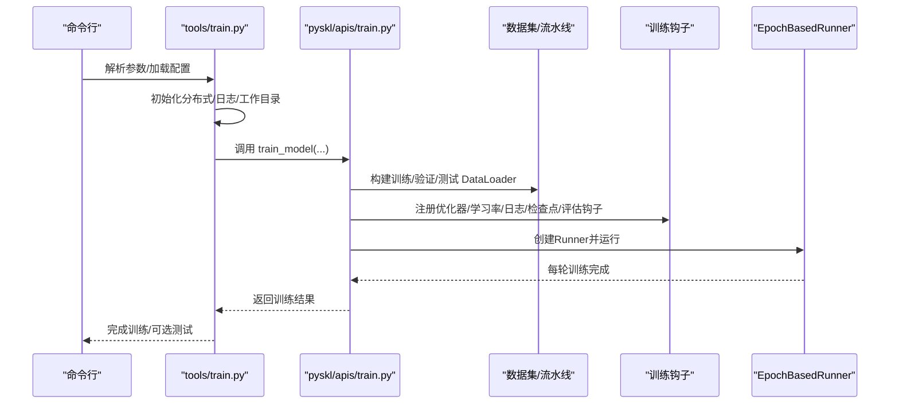
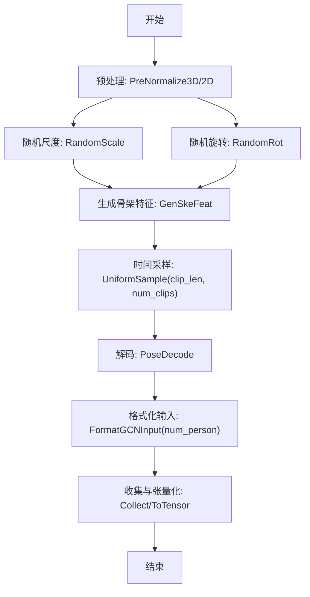
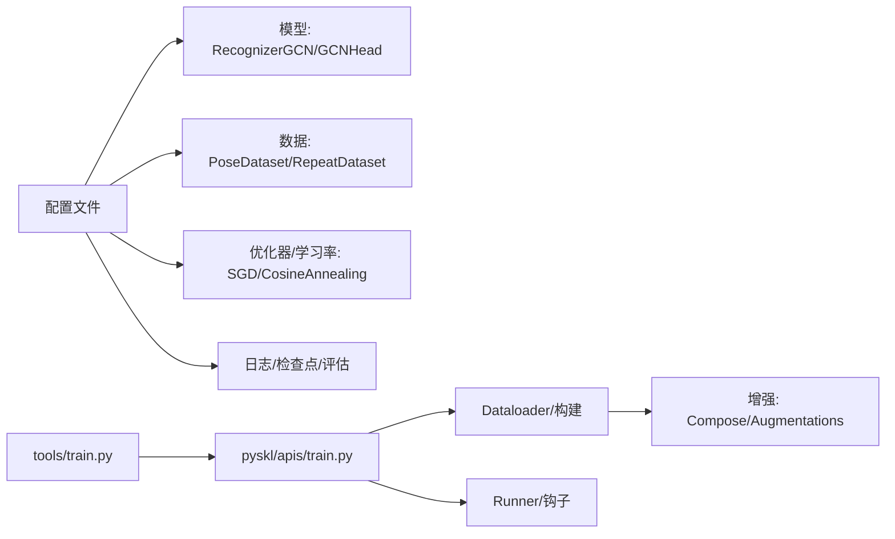

# 训练配置

<cite>
**本文引用的文件**
- [configs/aagcn/aagcn_pyskl_ntu120_xset_3dkp/b.py](file://configs/aagcn/aagcn_pyskl_ntu120_xset_3dkp/b.py)
- [configs/aagcn/aagcn_pyskl_ntu120_xset_3dkp/bm.py](file://configs/aagcn/aagcn_pyskl_ntu120_xset_3dkp/bm.py)
- [configs/aagcn/aagcn_pyskl_ntu120_xset_3dkp/j.py](file://configs/aagcn/aagcn_pyskl_ntu120_xset_3dkp/j.py)
- [configs/aagcn/aagcn_pyskl_ntu120_xset_3dkp/jm.py](file://configs/aagcn/aagcn_pyskl_ntu120_xset_3dkp/jm.py)
- [configs/aagcn/aagcn_pyskl_ntu120_xset_hrnet/b.py](file://configs/aagcn/aagcn_pyskl_ntu120_xset_hrnet/b.py)
- [configs/stgcn/stgcn_pyskl_ntu120_xset_3dkp/b.py](file://configs/stgcn/stgcn_pyskl_ntu120_xset_3dkp/b.py)
- [configs/msg3d/msg3d_pyskl_ntu120_xset_3dkp/b.py](file://configs/msg3d/msg3d_pyskl_ntu120_xset_3dkp/b.py)
- [configs/strong_aug/ntu120_xset_3dkp/b.py](file://configs/strong_aug/ntu120_xset_3dkp/b.py)
- [tools/train.py](file://tools/train.py)
- [pyskl/apis/train.py](file://pyskl/apis/train.py)
- [pyskl/datasets/pipelines/augmentations.py](file://pyskl/datasets/pipelines/augmentations.py)
- [pyskl/datasets/pipelines/compose.py](file://pyskl/datasets/pipelines/compose.py)
- [pyskl/core/hooks.py](file://pyskl/core/hooks.py)
</cite>

## 目录
1. [简介](#简介)
2. [项目结构](#项目结构)
3. [核心组件](#核心组件)
4. [架构总览](#架构总览)
5. [详细组件分析](#详细组件分析)
6. [依赖关系分析](#依赖关系分析)
7. [性能考量](#性能考量)
8. [故障排查指南](#故障排查指南)
9. [结论](#结论)
10. [附录：配置模板与调优建议](#附录配置模板与调优建议)

## 简介
本文件系统性梳理 PySKL 的训练配置与执行流程，围绕以下主题展开：
- 优化器与学习率调度、损失函数与训练超参数（批次大小、训练轮数、早停策略）
- 数据增强配置（空间与时间维度的增强策略）
- 分布式训练与 GPU 资源分配
- 训练监控（日志、模型保存、评估间隔）
- 不同场景下的配置模板与性能调优建议

目标是帮助使用者快速理解并高效定制训练配置，覆盖从入门到进阶的完整路径。

## 项目结构
训练配置主要位于 configs 目录下，按模型与数据集划分；训练入口脚本位于 tools/train.py，训练主流程由 pyskl/apis/train.py 实现；数据增强与流水线由 pyskl/datasets/pipelines 提供。

图表来源
- [tools/train.py](file://tools/train.py#L60-L165)
- [pyskl/apis/train.py](file://pyskl/apis/train.py#L50-L213)
- [pyskl/datasets/pipelines/compose.py](file://pyskl/datasets/pipelines/compose.py#L8-L53)
- [pyskl/datasets/pipelines/augmentations.py](file://pyskl/datasets/pipelines/augmentations.py#L1-L902)
- [pyskl/core/hooks.py](file://pyskl/core/hooks.py#L7-L68)

章节来源
- [tools/train.py](file://tools/train.py#L60-L165)
- [pyskl/apis/train.py](file://pyskl/apis/train.py#L50-L213)

## 核心组件
- 配置文件（configs）：定义模型结构、数据加载、优化器、学习率策略、训练轮次、日志与评估等。
- 训练入口（tools/train.py）：解析命令行参数、初始化分布式环境、构建日志与工作目录、调用训练主流程。
- 训练主流程（pyskl/apis/train.py）：构建 DataLoader、分布式封装模型、注册训练钩子、运行训练循环、可选评估与测试。
- 数据增强（pyskl/datasets/pipelines/augmentations.py）：提供空间与时间维度的增强算子，配合 Compose 组合使用。
- 流水线编排（pyskl/datasets/pipelines/compose.py）：顺序执行增强与格式化步骤。
- 输出钩子（pyskl/core/hooks.py）：可选地捕获中间层特征图，用于调试或可视化。

章节来源
- [configs/aagcn/aagcn_pyskl_ntu120_xset_3dkp/b.py](file://configs/aagcn/aagcn_pyskl_ntu120_xset_3dkp/b.py#L1-L61)
- [tools/train.py](file://tools/train.py#L60-L165)
- [pyskl/apis/train.py](file://pyskl/apis/train.py#L50-L213)
- [pyskl/datasets/pipelines/augmentations.py](file://pyskl/datasets/pipelines/augmentations.py#L1-L902)
- [pyskl/datasets/pipelines/compose.py](file://pyskl/datasets/pipelines/compose.py#L8-L53)
- [pyskl/core/hooks.py](file://pyskl/core/hooks.py#L7-L68)

## 架构总览
训练从配置文件读取模型、数据、优化器与学习率策略，通过入口脚本初始化分布式与日志，进入训练主流程后构建 DataLoader、注册训练钩子（优化器、学习率、日志、检查点、可选评估），随后在 Runner 中按轮次迭代训练。

图表来源
- [tools/train.py](file://tools/train.py#L60-L165)
- [pyskl/apis/train.py](file://pyskl/apis/train.py#L50-L213)

## 详细组件分析

### 1) 优化器与学习率调度
- 优化器：多数配置采用 SGD，包含学习率、动量、权重衰减与 Nesterov；部分配置示例见 aagcn/stgcn/msg3d/strong_aug 系列。
- 学习率策略：常见为余弦退火（CosineAnnealing），支持按迭代或按轮次；部分配置中 total_epochs 指定训练轮数。
- 梯度裁剪：optimizer_config 可配置 grad_clip；若未显式指定类型，则默认使用 OptimizerHook。

章节来源
- [configs/aagcn/aagcn_pyskl_ntu120_xset_3dkp/b.py](file://configs/aagcn/aagcn_pyskl_ntu120_xset_3dkp/b.py#L48-L53)
- [configs/stgcn/stgcn_pyskl_ntu120_xset_3dkp/b.py](file://configs/stgcn/stgcn_pyskl_ntu120_xset_3dkp/b.py#L48-L53)
- [configs/msg3d/msg3d_pyskl_ntu120_xset_3dkp/b.py](file://configs/msg3d/msg3d_pyskl_ntu120_xset_3dkp/b.py#L48-L53)
- [configs/strong_aug/ntu120_xset_3dkp/b.py](file://configs/strong_aug/ntu120_xset_3dkp/b.py#L53-L58)
- [pyskl/apis/train.py](file://pyskl/apis/train.py#L100-L121)

### 2) 损失函数配置
- 配置文件中未直接出现 loss 相关键；通常由模型头（如 GCNHead）内部实现交叉熵等损失。若需自定义损失，可在模型头或损失模块中扩展。

章节来源
- [configs/aagcn/aagcn_pyskl_ntu120_xset_3dkp/b.py](file://configs/aagcn/aagcn_pyskl_ntu120_xset_3dkp/b.py#L1-L6)
- [configs/stgcn/stgcn_pyskl_ntu120_xset_3dkp/b.py](file://configs/stgcn/stgcn_pyskl_ntu120_xset_3dkp/b.py#L1-L6)
- [configs/msg3d/msg3d_pyskl_ntu120_xset_3dkp/b.py](file://configs/msg3d/msg3d_pyskl_ntu120_xset_3dkp/b.py#L1-L6)

### 3) 训练超参数
- 批次大小与并行：videos_per_gpu、workers_per_gpu 控制每 GPU 视频数量与每个进程的 worker 数；可通过 data.train_dataloader 或 data.val_dataloader 追加覆盖。
- 训练轮数：total_epochs 指定总轮次；部分强增广配置（如 strong_aug）可能增加至 24。
- 重复采样：RepeatDataset.times 可放大训练集以提升稳定性。
- 早停策略：配置文件未内置早停；可通过在 evaluation 中设置 save_best 与 rule 并结合 DistEvalHook 达到类似效果。

章节来源
- [configs/aagcn/aagcn_pyskl_ntu120_xset_3dkp/b.py](file://configs/aagcn/aagcn_pyskl_ntu120_xset_3dkp/b.py#L37-L46)
- [configs/strong_aug/ntu120_xset_3dkp/b.py](file://configs/strong_aug/ntu120_xset_3dkp/b.py#L42-L51)
- [pyskl/apis/train.py](file://pyskl/apis/train.py#L123-L144)

### 4) 数据增强配置
- 空间增强（3D 关键点）：RandomScale、RandomRot 等随机缩放与旋转，常置于 PreNormalize 之后、生成骨架特征之前。
- 时间增强：UniformSample 控制采样长度与 clips 数，影响时间维度的采样策略。
- 其他常用增强：Resize、Flip、Normalize、CenterCrop、RandomCrop、RandomResizedCrop、PoseCompact 等。
- 增强组合：通过 Compose 按顺序串联多个增强步骤，形成完整的训练/验证/测试流水线。

图表来源
- [configs/strong_aug/ntu120_xset_3dkp/b.py](file://configs/strong_aug/ntu120_xset_3dkp/b.py#L13-L23)
- [pyskl/datasets/pipelines/augmentations.py](file://pyskl/datasets/pipelines/augmentations.py#L1-L902)
- [pyskl/datasets/pipelines/compose.py](file://pyskl/datasets/pipelines/compose.py#L8-L53)

章节来源
- [configs/strong_aug/ntu120_xset_3dkp/b.py](file://configs/strong_aug/ntu120_xset_3dkp/b.py#L13-L23)
- [pyskl/datasets/pipelines/augmentations.py](file://pyskl/datasets/pipelines/augmentations.py#L1-L902)
- [pyskl/datasets/pipelines/compose.py](file://pyskl/datasets/pipelines/compose.py#L8-L53)

### 5) 分布式训练与 GPU 资源分配
- 启动方式：支持 pytorch/Slurm 启动器；自动初始化分布式后端（默认 nccl）。
- GPU 列表：根据世界大小自动设置 cfg.gpu_ids。
- 自动断点续训：若未显式指定 resume_from，且工作目录存在 latest.pth，则自动恢复。
- 模型封装：使用 MMDistributedDataParallel 封装模型并设置 find_unused_parameters。
- 可选内存缓存：支持 memcached 缓存数据以加速训练（仅在 rank==0 时启动）。

章节来源
- [tools/train.py](file://tools/train.py#L75-L81)
- [tools/train.py](file://tools/train.py#L78-L80)
- [tools/train.py](file://tools/train.py#L82-L87)
- [tools/train.py](file://tools/train.py#L138-L160)
- [pyskl/apis/train.py](file://pyskl/apis/train.py#L93-L98)
- [pyskl/apis/train.py](file://pyskl/apis/train.py#L117-L121)

### 6) 训练监控与日志
- 日志：log_config.interval 控制日志打印间隔；默认使用 TextLoggerHook。
- 检查点：checkpoint_config.interval 控制保存检查点的轮次间隔；meta 记录版本与配置文本。
- 评估：evaluation.interval 控制评估间隔；metrics 指定评估指标（如 top_k_accuracy）。
- 可选测试：训练完成后可选择测试“最后”或“最佳”模型，最佳模型基于 DistEvalHook 的规则选择。

章节来源
- [configs/aagcn/aagcn_pyskl_ntu120_xset_3dkp/b.py](file://configs/aagcn/aagcn_pyskl_ntu120_xset_3dkp/b.py#L54-L56)
- [pyskl/apis/train.py](file://pyskl/apis/train.py#L118-L136)
- [pyskl/apis/train.py](file://pyskl/apis/train.py#L149-L156)
- [pyskl/apis/train.py](file://pyskl/apis/train.py#L192-L213)

### 7) 模型与数据配置要点
- 模型：统一使用 RecognizerGCN + backbone（如 AAGCN/STGCN/MSG3D）+ GCNHead；backbone 的 graph_cfg 决定图结构布局与模式。
- 数据：AnnFile 指向标注文件；Split 指定训练/验证划分；FormatGCNInput 的 num_person 控制多人场景。
- 多种特征组合：feats 支持 ['b']、['bm']、['j']、['jm'] 等，对应不同骨架特征组合。

章节来源
- [configs/aagcn/aagcn_pyskl_ntu120_xset_3dkp/b.py](file://configs/aagcn/aagcn_pyskl_ntu120_xset_3dkp/b.py#L1-L6)
- [configs/aagcn/aagcn_pyskl_ntu120_xset_3dkp/b.py](file://configs/aagcn/aagcn_pyskl_ntu120_xset_3dkp/b.py#L10-L18)
- [configs/aagcn/aagcn_pyskl_ntu120_xset_3dkp/b.py](file://configs/aagcn/aagcn_pyskl_ntu120_xset_3dkp/b.py#L37-L46)

## 依赖关系分析
- 配置文件依赖于模型、数据集、流水线与优化器等模块；训练入口依赖配置与训练 API；训练 API 依赖数据加载器、分布式封装与 Runner。
- 数据增强通过 Compose 顺序执行，增强算子均注册到 PIPELINES，便于统一管理与扩展。

图表来源
- [tools/train.py](file://tools/train.py#L60-L165)
- [pyskl/apis/train.py](file://pyskl/apis/train.py#L50-L213)
- [pyskl/datasets/pipelines/compose.py](file://pyskl/datasets/pipelines/compose.py#L8-L53)
- [pyskl/datasets/pipelines/augmentations.py](file://pyskl/datasets/pipelines/augmentations.py#L1-L902)

章节来源
- [tools/train.py](file://tools/train.py#L60-L165)
- [pyskl/apis/train.py](file://pyskl/apis/train.py#L50-L213)

## 性能考量
- 批大小与显存：videos_per_gpu 过大可能导致 OOM；可结合 workers_per_gpu 与 persistent_workers 调整吞吐。
- 采样策略：UniformSample 的 clip_len 与 num_clips 影响时间分辨率与数据多样性；长序列更易捕捉动作动态但计算开销更大。
- 增强强度：RandomScale/RandomRot 等会引入额外计算；在资源紧张时可适当降低或关闭。
- 分布式效率：确保 NCCL 后端与 GPU 设备正确配置；合理设置 world_size 与每卡 batch。
- 模型编译：在 PyTorch 2.0+ 可启用 torch.compile 加速推理/训练（受支持的模型）。

## 故障排查指南
- 分布式初始化失败：检查 dist_params.backend 与网络环境；确认多机多卡通信正常。
- 检查点恢复异常：确认 work_dir 下存在 latest.pth 或明确指定 resume_from；避免路径拼接错误。
- 评估指标缺失：确认 evaluation.metrics 正确；若使用 save_best，需确保 DistEvalHook 能找到最佳模型文件。
- 增强导致数据异常：检查 Compose 顺序与参数范围；必要时临时禁用某些增强定位问题。
- 日志与可视化：若日志不输出，检查 log_config.hooks 与 log_level；必要时开启更详细日志。

章节来源
- [tools/train.py](file://tools/train.py#L75-L81)
- [tools/train.py](file://tools/train.py#L82-L87)
- [pyskl/apis/train.py](file://pyskl/apis/train.py#L118-L136)
- [pyskl/apis/train.py](file://pyskl/apis/train.py#L149-L156)

## 结论
PySKL 的训练配置以配置文件为中心，结合工具链与数据增强流水线，提供了灵活而高效的训练框架。通过合理设置优化器、学习率、数据增强与分布式参数，可在不同硬件条件下获得稳定且高性能的训练效果。建议优先参考仓库内现有配置模板，再按任务需求进行微调。

## 附录：配置模板与调优建议

### A. 常用配置模板路径
- AAGCN（3D 关键点，xset）：b/bm/j/jm 四种特征组合
  - [configs/aagcn/aagcn_pyskl_ntu120_xset_3dkp/b.py](file://configs/aagcn/aagcn_pyskl_ntu120_xset_3dkp/b.py#L1-L61)
  - [configs/aagcn/aagcn_pyskl_ntu120_xset_3dkp/bm.py](file://configs/aagcn/aagcn_pyskl_ntu120_xset_3dkp/bm.py#L1-L61)
  - [configs/aagcn/aagcn_pyskl_ntu120_xset_3dkp/j.py](file://configs/aagcn/aagcn_pyskl_ntu120_xset_3dkp/j.py#L1-L61)
  - [configs/aagcn/aagcn_pyskl_ntu120_xset_3dkp/jm.py](file://configs/aagcn/aagcn_pyskl_ntu120_xset_3dkp/jm.py#L1-L61)
- AAGCN（HRNet 关键点，xset）：coco 布局
  - [configs/aagcn/aagcn_pyskl_ntu120_xset_hrnet/b.py](file://configs/aagcn/aagcn_pyskl_ntu120_xset_hrnet/b.py#L1-L61)
- STGCN（3D 关键点，xset）
  - [configs/stgcn/stgcn_pyskl_ntu120_xset_3dkp/b.py](file://configs/stgcn/stgcn_pyskl_ntu120_xset_3dkp/b.py#L1-L61)
- MSG3D（3D 关键点，xset）
  - [configs/msg3d/msg3d_pyskl_ntu120_xset_3dkp/b.py](file://configs/msg3d/msg3d_pyskl_ntu120_xset_3dkp/b.py#L1-L61)
- 强增广（3D 关键点，xset）
  - [configs/strong_aug/ntu120_xset_3dkp/b.py](file://configs/strong_aug/ntu120_xset_3dkp/b.py#L1-L66)

### B. 训练入口与主流程
- 训练入口脚本
  - [tools/train.py](file://tools/train.py#L60-L165)
- 训练主流程
  - [pyskl/apis/train.py](file://pyskl/apis/train.py#L50-L213)

### C. 数据增强与流水线
- 增强算子集合
  - [pyskl/datasets/pipelines/augmentations.py](file://pyskl/datasets/pipelines/augmentations.py#L1-L902)
- 流水线编排
  - [pyskl/datasets/pipelines/compose.py](file://pyskl/datasets/pipelines/compose.py#L8-L53)

### D. 调优建议
- 优化器与学习率
  - SGD + CosineAnnealing 适合大多数骨架动作识别任务；若收敛慢可尝试 AdamW（需在配置中替换）。
  - 若显存紧张，可降低 videos_per_gpu 并提高梯度累积步数（需在 Runner 层面扩展）。
- 数据增强
  - 在小样本或过拟合风险高时，适度增加 RandomScale/RandomRot；在长序列任务中谨慎使用强旋转。
  - UniformSample 的 clip_len 与 num_clips 应与动作时长分布匹配；长视频可使用多片段采样（num_clips>1）。
- 分布式与资源
  - 使用 PyTorch 启动器时，确保 CUDA_VISIBLE_DEVICES 与本地 GPU 数一致；NCCL 环境变量按集群要求配置。
  - 对于大模型或长序列，建议启用 cudnn_benchmark 以提升卷积性能（在配置中添加相应键）。
- 监控与评估
  - 评估间隔与日志间隔应平衡；频繁评估会增加通信开销；建议在验证集上使用 save_best 与 rule 控制最优模型保存。
  - 如需中间特征可视化，可使用 OutputHook（参见 [pyskl/core/hooks.py](file://pyskl/core/hooks.py#L7-L68)）。