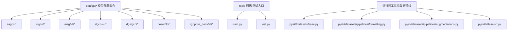
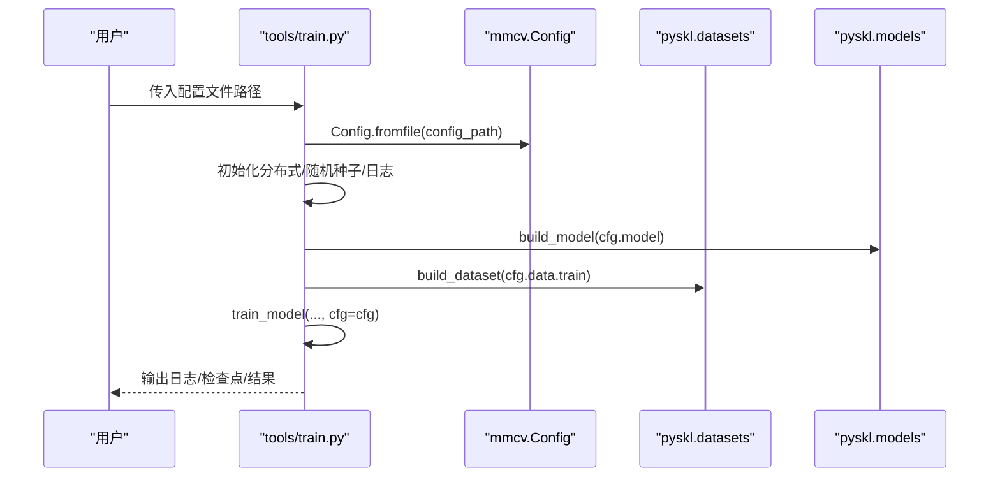
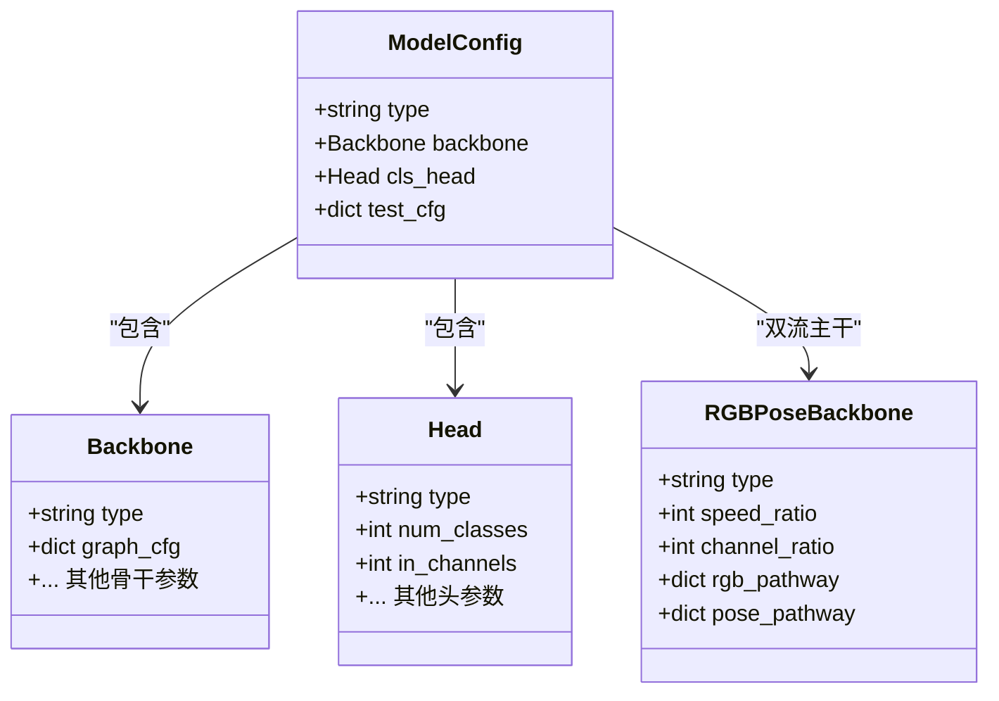
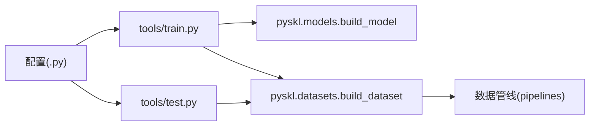

# 配置文件格式规范

<cite>
**本文引用的文件**
- [configs/aagcn/aagcn_pyskl_ntu120_xset_3dkp/b.py](file://configs/aagcn/aagcn_pyskl_ntu120_xset_3dkp/b.py)
- [configs/stgcn/stgcn_pyskl_ntu120_xset_3dkp/b.py](file://configs/stgcn/stgcn_pyskl_ntu120_xset_3dkp/b.py)
- [configs/msg3d/msg3d_pyskl_ntu120_xset_3dkp/b.py](file://configs/msg3d/msg3d_pyskl_ntu120_xset_3dkp/b.py)
- [configs/stgcn++/stgcn++_ntu120_xset_3dkp/b.py](file://configs/stgcn++/stgcn++_ntu120_xset_3dkp/b.py)
- [configs/dgstgcn/ntu120_xsub_3dkp/b.py](file://configs/dgstgcn/ntu120_xsub_3dkp/b.py)
- [configs/posec3d/slowonly_r50_ntu60_xsub/joint.py](file://configs/posec3d/slowonly_r50_ntu60_xsub/joint.py)
- [configs/posec3d/x3d_shallow_gym/joint.py](file://configs/posec3d/x3d_shallow_gym/joint.py)
- [configs/posec3d/x3d_shallow_gym/limb.py](file://configs/posec3d/x3d_shallow_gym/limb.py)
- [configs/rgbpose_conv3d/rgbpose_conv3d.py](file://configs/rgbpose_conv3d/rgbpose_conv3d.py)
- [configs/rgbpose_conv3d/pose_only.py](file://configs/rgbpose_conv3d/pose_only.py)
- [configs/rgbpose_conv3d/rgb_only.py](file://configs/rgbpose_conv3d/rgb_only.py)
- [configs/rgbpose_conv3d/README.md](file://configs/rgbpose_conv3d/README.md)
- [tools/train.py](file://tools/train.py)
- [tools/test.py](file://tools/test.py)
- [pyskl/datasets/base.py](file://pyskl/datasets/base.py)
- [pyskl/datasets/pipelines/formatting.py](file://pyskl/datasets/pipelines/formatting.py)
- [pyskl/datasets/pipelines/augmentations.py](file://pyskl/datasets/pipelines/augmentations.py)
- [pyskl/utils/misc.py](file://pyskl/utils/misc.py)
- [tools/data/README.md](file://tools/data/README.md)
- [pyskl.yaml](file://pyskl.yaml)
</cite>

## 更新摘要
**所做更改**
- 新增X3D配置文件的详细注释规范说明
- 扩展RGB-Pose Conv3D配置的注释规范和命名约定
- 增强配置文件注释改进的详细说明
- 补充双流主干网络的配置注释规范

## 目录
1. [简介](#简介)
2. [项目结构](#项目结构)
3. [核心组件](#核心组件)
4. [架构总览](#架构总览)
5. [详细组件分析](#详细组件分析)
6. [依赖关系分析](#依赖关系分析)
7. [性能考量](#性能考量)
8. [故障排查指南](#故障排查指南)
9. [结论](#结论)
10. [附录](#附录)

## 简介
本文件系统化阐述 PySKL 的配置文件格式规范，覆盖两类配置形式：
- Python 字典格式（.py）：以 Python 脚本形式定义配置变量，便于灵活编程与注释。
- YAML 格式（.yaml/.yml）：以 YAML 文件形式描述环境与依赖，用于 Conda 环境管理。

本文面向不同技术背景的读者，提供从基础结构到高级用法的分层说明，包括：
- 配置文件基本结构与字段含义
- 数据集、模型、训练、优化器等各部分参数定义、数据类型、默认值与取值范围
- 注释规范与命名约定（新增详细说明）
- 验证机制与错误检查方法
- 常见配置错误的诊断与修复建议
- 标准配置文件示例与最佳实践

## 项目结构
PySKL 的配置主要位于 configs 目录下，按算法与数据集划分子目录；训练与测试入口通过 tools 下的脚本加载配置并驱动执行。

**图表来源**
- [configs/aagcn/aagcn_pyskl_ntu120_xset_3dkp/b.py](file://configs/aagcn/aagcn_pyskl_ntu120_xset_3dkp/b.py#L1-L61)
- [configs/rgbpose_conv3d/rgbpose_conv3d.py](file://configs/rgbpose_conv3d/rgbpose_conv3d.py#L1-L107)
- [tools/train.py](file://tools/train.py#L60-L165)
- [tools/test.py](file://tools/test.py#L110-L185)

**章节来源**
- [tools/train.py](file://tools/train.py#L60-L165)
- [tools/test.py](file://tools/test.py#L110-L185)

## 核心组件
本节概述配置文件的核心组成与职责边界，所有配置最终由训练/测试脚本解析并驱动模型构建与数据加载。

- 模型配置（model/backbone/head）
  - 定义识别器类型、骨干网络、头模块等。
  - 示例字段：type、backbone、cls_head、test_cfg 等。
  - **新增**：双流主干网络（如RGBPoseConv3D）的详细注释规范
- 数据集配置（data）
  - 定义训练/验证/测试数据集、批大小、工作进程数、采样策略等。
  - 示例字段：videos_per_gpu、workers_per_gpu、train/val/test、test_dataloader 等。
- 训练配置（优化器、学习率、轮次、日志、评估等）
  - optimizer、optimizer_config、lr_config、total_epochs、checkpoint_config、evaluation、log_config、log_level、work_dir 等。
- 数据管线配置（train_pipeline/val_pipeline/test_pipeline）
  - 定义骨架/图像数据的预处理、增强、格式化流程。
- 其他运行时参数
  - cudnn_benchmark、dist_params、memcached、auto_resume、resume_from 等。

**章节来源**
- [configs/aagcn/aagcn_pyskl_ntu120_xset_3dkp/b.py](file://configs/aagcn/aagcn_pyskl_ntu120_xset_3dkp/b.py#L1-L61)
- [configs/rgbpose_conv3d/rgbpose_conv3d.py](file://configs/rgbpose_conv3d/rgbpose_conv3d.py#L1-L107)
- [configs/posec3d/x3d_shallow_gym/joint.py](file://configs/posec3d/x3d_shallow_gym/joint.py#L1-L78)

## 架构总览
训练/测试流程中，入口脚本读取配置文件，构建模型与数据集，随后进入训练或测试阶段。

**图表来源**
- [tools/train.py](file://tools/train.py#L60-L165)
- [tools/test.py](file://tools/test.py#L110-L185)

**章节来源**
- [tools/train.py](file://tools/train.py#L60-L165)
- [tools/test.py](file://tools/test.py#L110-L185)

## 详细组件分析

### Python 字典格式（.py）语法规则与参数定义
- 文件即模块：配置文件为 Python 模块，顶层直接声明变量（如 model、data、optimizer 等），无需额外包装。
- 字段组织：
  - model：字典，包含 type、backbone、cls_head、test_cfg 等键。
  - data：字典，包含 videos_per_gpu、workers_per_gpu、train/val/test 子字典、test_dataloader 等。
  - 优化器与学习率：optimizer、optimizer_config、lr_config、total_epochs。
  - 日志与评估：evaluation、log_config、log_level、work_dir。
  - 数据管线：train_pipeline/val_pipeline/test_pipeline（列表，元素为字典，含 type 与若干参数）。
- 参数类型与典型取值范围（基于示例与通用实践）：
  - model.type：字符串，如 'RecognizerGCN'、'Recognizer3D'、'MMRecognizer3D'。
  - backbone/cls_head：字典，包含 type 与具体实现所需的参数（如 graph_cfg、in_channels、num_classes 等）。
  - data.videos_per_gpu/workers_per_gpu：整数，通常与 GPU 数量匹配。
  - data.train/val/test：字典，type 指定数据集类型，ann_file 指向标注文件，pipeline 指向数据管线，split 指定划分。
  - optimizer：字典，type 为优化器名称（如 'SGD'），lr/momentum/weight_decay/nesterov 等为数值。
  - lr_config：字典，policy 为策略名（如 'CosineAnnealing'），min_lr/by_epoch 等为布尔或数值。
  - total_epochs：整数。
  - evaluation：字典，metrics 为指标列表，interval 等为整数。
  - log_config：字典，hooks 为列表，包含日志钩子类型。
  - log_level：字符串，如 'INFO'。
  - work_dir：字符串，工作目录路径。
  - pipeline 中的 transform：字典，type 为变换名，其余键为该变换所需参数（如 UniformSample 的 clip_len、num_clips 等）。
- 嵌套结构与层级关系：
  - model -> backbone -> graph_cfg 等
  - data -> train/val/test -> dataset（可嵌套 RepeatDataset）
  - optimizer_config -> grad_clip（可为字典或 None）
  - log_config -> hooks（列表）

**章节来源**
- [configs/aagcn/aagcn_pyskl_ntu120_xset_3dkp/b.py](file://configs/aagcn/aagcn_pyskl_ntu120_xset_3dkp/b.py#L1-L61)
- [configs/rgbpose_conv3d/rgbpose_conv3d.py](file://configs/rgbpose_conv3d/rgbpose_conv3d.py#L1-L107)
- [configs/posec3d/x3d_shallow_gym/joint.py](file://configs/posec3d/x3d_shallow_gym/joint.py#L1-L78)

### 数据集配置（data）
- 关键字段
  - videos_per_gpu：每卡批大小
  - workers_per_gpu：每卡数据加载进程数
  - test_dataloader：测试数据加载器的额外参数（如 videos_per_gpu）
  - train/val/test：字典，包含 type、ann_file、pipeline、split 或其他数据集特定参数
- 常见嵌套
  - train 支持 RepeatDataset 包裹，times 指定重复倍数
- 默认行为
  - 若未指定 work_dir，训练脚本会根据配置文件名生成默认工作目录
- 数据格式
  - 标注文件为 pickle，包含 split 与 annotations 两个字段
  - annotations 列表中的每个元素包含 frame_dir、total_frames、label、keypoint 等字段

**章节来源**
- [configs/aagcn/aagcn_pyskl_ntu120_xset_3dkp/b.py](file://configs/aagcn/aagcn_pyskl_ntu120_xset_3dkp/b.py#L37-L46)
- [configs/rgbpose_conv3d/rgbpose_conv3d.py](file://configs/rgbpose_conv3d/rgbpose_conv3d.py#L87-L94)
- [configs/posec3d/x3d_shallow_gym/joint.py](file://configs/posec3d/x3d_shallow_gym/joint.py#L57-L66)

### 模型配置（model）
- 通用结构
  - type：识别器类型（如 RecognizerGCN、Recognizer3D、MMRecognizer3D）
  - backbone：字典，包含 type 与骨干网络特定参数（如 graph_cfg、stage_blocks、inflate 等）
  - cls_head：字典，包含 type、num_classes、in_channels 等
  - test_cfg：字典，如 average_clips='prob'
- **新增**：双流主干网络配置规范
  - RGBPoseConv3D：包含 rgb_pathway 和 pose_pathway 两个子配置
  - X3D：包含 gamma_d、in_channels、base_channels、num_stages 等参数
- 图图示（类关系示意）

**图表来源**
- [configs/rgbpose_conv3d/rgbpose_conv3d.py](file://configs/rgbpose_conv3d/rgbpose_conv3d.py#L2-L35)
- [configs/posec3d/x3d_shallow_gym/joint.py](file://configs/posec3d/x3d_shallow_gym/joint.py#L3-L18)

**章节来源**
- [configs/aagcn/aagcn_pyskl_ntu120_xset_3dkp/b.py](file://configs/aagcn/aagcn_pyskl_ntu120_xset_3dkp/b.py#L1-L6)
- [configs/rgbpose_conv3d/rgbpose_conv3d.py](file://configs/rgbpose_conv3d/rgbpose_conv3d.py#L37-L41)
- [configs/posec3d/x3d_shallow_gym/joint.py](file://configs/posec3d/x3d_shallow_gym/joint.py#L1-L18)

### 训练配置（优化器、学习率、日志、评估）
- 优化器
  - optimizer：字典，type 为优化器类型，lr/momentum/weight_decay/nesterov 等为数值
  - optimizer_config：grad_clip 可为字典（如 max_norm、norm_type）或 None
- 学习率策略
  - lr_config：policy 为策略名（如 'CosineAnnealing'），min_lr/by_epoch 等为布尔或数值
- 训练周期与保存
  - total_epochs：整数
  - checkpoint_config：interval 为整数
- 评估
  - evaluation：metrics 为指标列表，interval 等为整数
- 日志
  - log_config：hooks 为列表，包含日志钩子类型
  - log_level：字符串
- 工作目录
  - work_dir：字符串

**章节来源**
- [configs/aagcn/aagcn_pyskl_ntu120_xset_3dkp/b.py](file://configs/aagcn/aagcn_pyskl_ntu120_xset_3dkp/b.py#L48-L60)
- [configs/rgbpose_conv3d/rgbpose_conv3d.py](file://configs/rgbpose_conv3d/rgbpose_conv3d.py#L95-L106)
- [configs/posec3d/x3d_shallow_gym/joint.py](file://configs/posec3d/x3d_shallow_gym/joint.py#L67-L77)

### 数据管线（train_pipeline/val_pipeline/test_pipeline）
- 流水线由一系列变换组成，每个变换为字典，包含 type 与若干参数
- 常见变换类型与用途
  - PreNormalize3D：3D 归一化
  - GenSkeFeat：生成骨架特征（支持 feats、dataset 等参数）
  - UniformSample/UniformSampleDecode：均匀采样片段长度
  - PoseDecode：解码骨架序列
  - FormatGCNInput/FormatShape：格式化输入形状
  - Collect/ToTensor：收集键与张量化
  - Resize/RandomResizedCrop/Flip/GeneratePoseTarget：图像/骨架增强与目标生成
- 输入格式
  - GCN 输入：FormatGCNInput
  - 3D 视频/热力图输入：FormatShape（如 NCTHW、NCTHW_Heatmap）
- **新增**：X3D配置的数据管线特殊处理
  - MMUniformSampleFrames：支持双流不同帧长配置
  - MMDecode：支持多模态解码
  - MMCompact/MMNormalize：多模态归一化处理

**章节来源**
- [configs/aagcn/aagcn_pyskl_ntu120_xset_3dkp/b.py](file://configs/aagcn/aagcn_pyskl_ntu120_xset_3dkp/b.py#L10-L18)
- [configs/rgbpose_conv3d/rgbpose_conv3d.py](file://configs/rgbpose_conv3d/rgbpose_conv3d.py#L50-L84)
- [configs/posec3d/x3d_shallow_gym/joint.py](file://configs/posec3d/x3d_shallow_gym/joint.py#L24-L55)

### YAML 格式（环境与依赖）
- 用途：描述 Conda 环境的 channels、dependencies 以及 pip 依赖版本
- 关键字段
  - name：环境名称
  - channels：频道列表
  - dependencies：依赖项列表（可包含 pip 子段）
- 注意事项
  - 使用 pip 时需确保版本兼容性
  - 与项目要求的 PyTorch/CUDA 版本匹配

**章节来源**
- [pyskl.yaml](file://pyskl.yaml#L1-L132)

## 依赖关系分析
- 训练入口依赖 mmcv.Config 解析配置，再调用 build_model/build_dataset 构建模型与数据集
- 数据集基类支持多模态、缓存、分布式等特性
- 数据管线模块提供丰富的骨架/图像变换能力

**图表来源**
- [tools/train.py](file://tools/train.py#L10-L20)
- [tools/test.py](file://tools/test.py#L19-L21)
- [pyskl/datasets/base.py](file://pyskl/datasets/base.py#L34-L54)

**章节来源**
- [tools/train.py](file://tools/train.py#L10-L20)
- [tools/test.py](file://tools/test.py#L19-L21)
- [pyskl/datasets/base.py](file://pyskl/datasets/base.py#L34-L54)

## 性能考量
- cudnn_benchmark：若启用，可提升卷积性能，但可能影响可复现性
- 分布式训练：默认后端为 nccl，可通过 dist_params 自定义
- 内存缓存：memcached 开关与端口校验，有助于加速数据加载
- 模型编译：在 PyTorch 2.0+ 可使用 torch.compile 提升推理速度（训练/测试均可）

**章节来源**
- [tools/train.py](file://tools/train.py#L65-L67)
- [tools/train.py](file://tools/train.py#L75-L76)
- [tools/train.py](file://tools/train.py#L139-L152)
- [tools/test.py](file://tools/test.py#L86-L88)
- [pyskl/utils/misc.py](file://pyskl/utils/misc.py#L86-L94)

## 故障排查指南
- 配置文件路径错误
  - 现象：无法加载配置
  - 排查：确认传入路径正确，文件存在且语法合法
- 数据集路径或标注文件缺失
  - 现象：数据加载失败或空标注
  - 排查：核对 ann_file 是否存在，split 名称与数据集划分一致
- 数据管线参数不匹配
  - 现象：输入形状不匹配或报错
  - 排查：核对 FormatGCNInput/FormatShape 的输入格式与 backbone/head 需求一致
- 优化器/学习率配置不当
  - 现象：收敛异常或梯度爆炸
  - 排查：核对 lr/momentum/weight_decay/grad_clip 等参数
- 分布式/端口问题
  - 现象：分布式初始化失败或 memcached 启动失败
  - 排查：检查 dist_params 与本地端口占用情况；确认 memcached 端口可用

**章节来源**
- [tools/train.py](file://tools/train.py#L63-L63)
- [tools/test.py](file://tools/test.py#L113-L113)
- [pyskl/utils/misc.py](file://pyskl/utils/misc.py#L141-L152)

## 结论
- PySKL 的配置采用 Python 字典格式（.py）与 YAML（.yaml/.yml）双轨制，前者用于模型与训练细节，后者用于环境与依赖管理
- 配置文件遵循清晰的层级结构，字段语义明确，便于扩展与维护
- 通过训练/测试入口脚本与数据管线模块的协同，配置可被高效解析并驱动训练/推理流程
- 建议在团队内统一注释规范与命名约定，结合自动化检查与示例配置，降低配置错误概率

## 附录

### 配置文件注释规范与命名约定
- 注释规范
  - 在配置文件顶部添加简要说明，解释模型、数据集与任务目标
  - 对关键参数添加行内注释，说明取值来源或经验建议
  - **新增**：双流主干网络参数注释规范
    - RGBPoseConv3D：详细说明 rgb_pathway 和 pose_pathway 的配置参数
    - X3D：说明 gamma_d、in_channels、base_channels 等参数的作用
- 命名约定
  - 变量名采用小写与下划线风格（如 model、data、train_pipeline）
  - 字段键名与示例保持一致（如 type、ann_file、pipeline、split 等）
  - 路径使用相对路径，避免硬编码绝对路径
  - **新增**：双流配置的命名规范
    - rgb_pathway/pose_pathway：区分两路配置
    - speed_ratio/channel_ratio：明确双流比例参数

**章节来源**
- [configs/aagcn/aagcn_pyskl_ntu120_xset_3dkp/b.py](file://configs/aagcn/aagcn_pyskl_ntu120_xset_3dkp/b.py#L1-L61)
- [configs/rgbpose_conv3d/rgbpose_conv3d.py](file://configs/rgbpose_conv3d/rgbpose_conv3d.py#L1-L35)
- [configs/posec3d/x3d_shallow_gym/joint.py](file://configs/posec3d/x3d_shallow_gym/joint.py#L1-L18)

### 配置验证与错误检查方法
- 语法检查
  - 使用 Python 解释器检查配置文件语法
- 运行时检查
  - 训练/测试入口会打印配置摘要与环境信息，便于核对
  - 日志文件记录关键参数与执行过程
- 数据一致性检查
  - 核对 ann_file 中的 split 与 pipeline 中的 feats/graph_cfg 是否匹配
  - 校验输入格式与 backbone/head 的输入维度一致

**章节来源**
- [tools/train.py](file://tools/train.py#L95-L109)
- [tools/test.py](file://tools/test.py#L115-L115)

### 标准配置文件示例与最佳实践
- 示例文件
  - GCN 类模型：aagcn/stgcn/msg3d/stgcn++/dgstgcn 的 b.py
  - 3D 视频/热力图模型：posec3d 的 joint.py/limb.py
  - **新增**：双流模型配置
    - RGBPoseConv3D：rgbpose_conv3d.py、pose_only.py、rgb_only.py
    - X3D浅层模型：x3d_shallow_gym/joint.py、x3d_shallow_gym/limb.py
- 最佳实践
  - 将与硬件相关的参数（如 videos_per_gpu、workers_per_gpu）与数据集规模匹配
  - 明确划分 train/val/test 的 split 名称，确保与标注文件一致
  - 在 pipeline 中按需组合变换，保证输入格式与模型 head 一致
  - 使用 evaluation 指定合适的指标与间隔，便于监控训练效果
  - **新增**：双流配置最佳实践
    - RGBPoseConv3D：合理设置双流的学习率缩放和权重平衡
    - X3D：根据数据模态选择合适的输入格式和增强策略

**章节来源**
- [configs/aagcn/aagcn_pyskl_ntu120_xset_3dkp/b.py](file://configs/aagcn/aagcn_pyskl_ntu120_xset_3dkp/b.py#L1-L61)
- [configs/rgbpose_conv3d/rgbpose_conv3d.py](file://configs/rgbpose_conv3d/rgbpose_conv3d.py#L1-L107)
- [configs/posec3d/x3d_shallow_gym/joint.py](file://configs/posec3d/x3d_shallow_gym/joint.py#L1-L78)
- [configs/posec3d/x3d_shallow_gym/limb.py](file://configs/posec3d/x3d_shallow_gym/limb.py#L1-L85)

### X3D配置详细说明
- X3D骨干网络参数详解
  - gamma_d：空间复杂度系数
  - in_channels：输入通道数（17表示人体关键点数量）
  - base_channels：基础通道数
  - num_stages：网络阶段数
  - se_ratio/use_swish：注意力机制和激活函数配置
  - stage_blocks/spatial_strides：各阶段的块数和空间步幅
- 数据管线特殊处理
  - MMUniformSampleFrames：支持双流不同帧长配置
  - MMDecode：多模态解码处理
  - MMCompact/MMNormalize：多模态数据标准化

**章节来源**
- [configs/posec3d/x3d_shallow_gym/joint.py](file://configs/posec3d/x3d_shallow_gym/joint.py#L3-L12)
- [configs/posec3d/x3d_shallow_gym/limb.py](file://configs/posec3d/x3d_shallow_gym/limb.py#L3-L12)

### RGB-Pose Conv3D配置详细说明
- 双流主干网络架构
  - speed_ratio：快慢路径时间维度比例（4:1）
  - channel_ratio：通道数缩减比例（4:1）
  - rgb_pathway：RGB路径（慢路径，4个阶段）
  - pose_pathway：姿态路径（快路径，3个阶段）
- 预训练和微调流程
  - 支持RGB-only和Pose-only预训练模型
  - 提供预训练权重合并工具
  - 微调阶段的配置和参数设置

**章节来源**
- [configs/rgbpose_conv3d/rgbpose_conv3d.py](file://configs/rgbpose_conv3d/rgbpose_conv3d.py#L2-L29)
- [configs/rgbpose_conv3d/README.md](file://configs/rgbpose_conv3d/README.md#L26-L75)