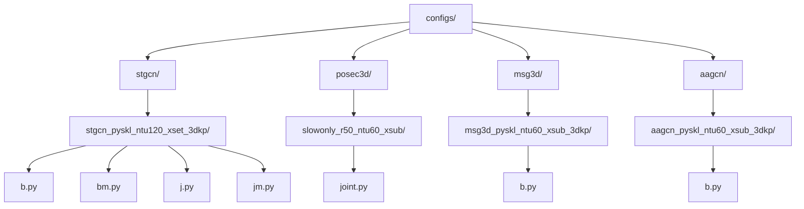
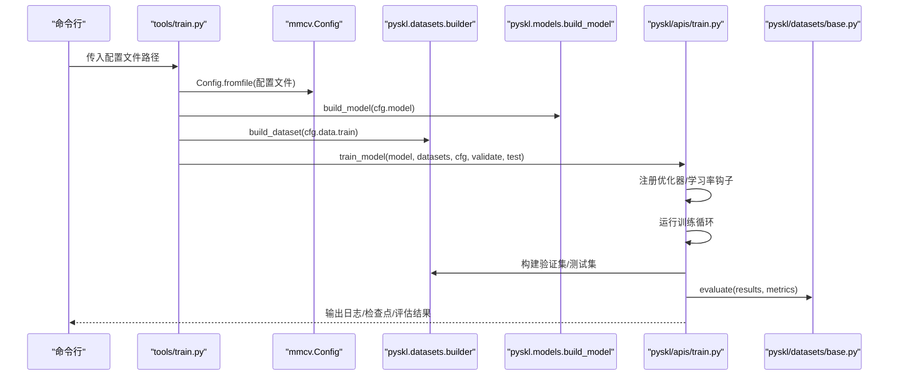
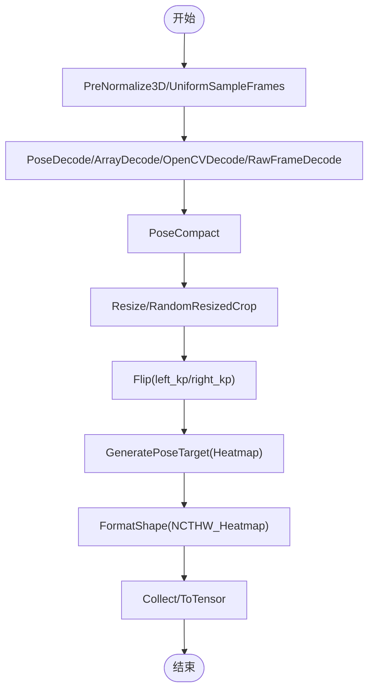
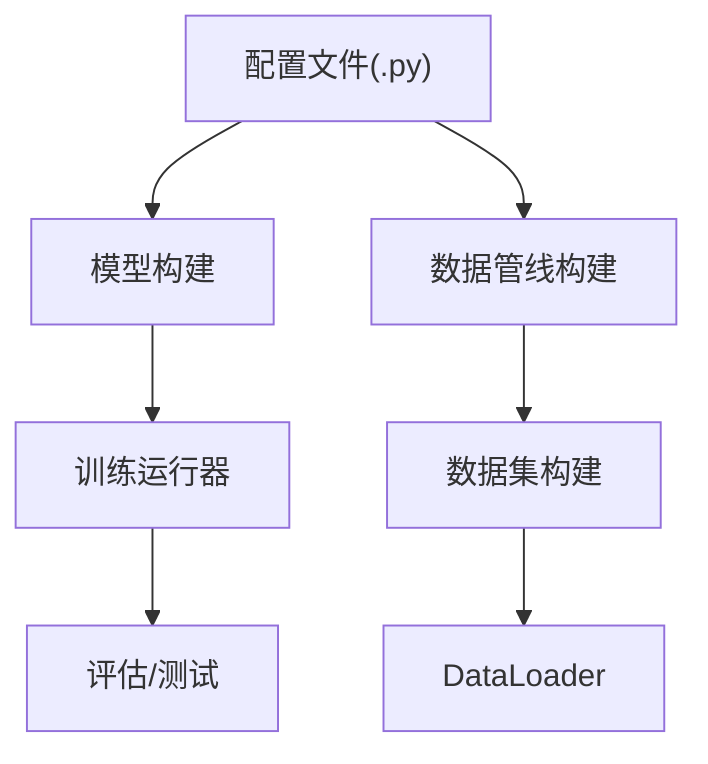

# 配置管理系统

<cite>
**本文引用的文件**
- [configs/stgcn/stgcn_pyskl_ntu120_xset_3dkp/b.py](file://configs/stgcn/stgcn_pyskl_ntu120_xset_3dkp/b.py)
- [configs/posec3d/slowonly_r50_ntu60_xsub/joint.py](file://configs/posec3d/slowonly_r50_ntu60_xsub/joint.py)
- [configs/msg3d/msg3d_pyskl_ntu60_xsub_3dkp/b.py](file://configs/msg3d/msg3d_pyskl_ntu60_xsub_3dkp/b.py)
- [configs/aagcn/aagcn_pyskl_ntu60_xsub_3dkp/b.py](file://configs/aagcn/aagcn_pyskl_ntu60_xsub_3dkp/b.py)
- [configs/stgcn/README.md](file://configs/stgcn/README.md)
- [configs/posec3d/README.md](file://configs/posec3d/README.md)
- [configs/msg3d/README.md](file://configs/msg3d/README.md)
- [configs/aagcn/README.md](file://configs/aagcn/README.md)
- [tools/train.py](file://tools/train.py)
- [tools/test.py](file://tools/test.py)
- [pyskl/apis/train.py](file://pyskl/apis/train.py)
- [pyskl/apis/inference.py](file://pyskl/apis/inference.py)
- [pyskl/datasets/builder.py](file://pyskl/datasets/builder.py)
- [pyskl/datasets/base.py](file://pyskl/datasets/base.py)
- [pyskl/datasets/pipelines/compose.py](file://pyskl/datasets/pipelines/compose.py)
- [pyskl/datasets/pipelines/augmentations.py](file://pyskl/datasets/pipelines/augmentations.py)
- [pyskl.yaml](file://pyskl.yaml)
</cite>

## 目录
1. [简介](#简介)
2. [项目结构](#项目结构)
3. [核心组件](#核心组件)
4. [架构总览](#架构总览)
5. [详细组件分析](#详细组件分析)
6. [依赖关系分析](#依赖关系分析)
7. [性能考量](#性能考量)
8. [故障排查指南](#故障排查指南)
9. [结论](#结论)
10. [附录](#附录)

## 简介
本文件系统性梳理 PySKL 的配置管理系统，围绕配置文件的组织结构、命名规范、格式规则、模板使用、数据集与训练配置、继承与覆盖机制、验证与错误诊断、最佳实践与性能调优进行深入说明。读者无需深入源码即可高效使用与扩展配置。

## 项目结构
PySKL 将配置集中于 configs 目录，按算法类型分层组织，典型布局如下：
- configs/<算法>/[子配置...]/<模态>.py
- 每个算法目录通常包含 README.md 提供模型清单、训练命令与注意事项
- 每个具体配置文件为 Python 字典形式的配置脚本，用于定义模型、数据、优化器、学习率、日志、工作目录等

图表来源
- [configs/stgcn/stgcn_pyskl_ntu120_xset_3dkp/b.py](file://configs/stgcn/stgcn_pyskl_ntu120_xset_3dkp/b.py#L1-L61)
- [configs/posec3d/slowonly_r50_ntu60_xsub/joint.py](file://configs/posec3d/slowonly_r50_ntu60_xsub/joint.py#L1-L80)
- [configs/msg3d/msg3d_pyskl_ntu60_xsub_3dkp/b.py](file://configs/msg3d/msg3d_pyskl_ntu60_xsub_3dkp/b.py#L1-L61)
- [configs/aagcn/aagcn_pyskl_ntu60_xsub_3dkp/b.py](file://configs/aagcn/aagcn_pyskl_ntu60_xsub_3dkp/b.py#L1-L61)

章节来源
- [configs/stgcn/README.md](file://configs/stgcn/README.md#L1-L67)
- [configs/posec3d/README.md](file://configs/posec3d/README.md#L1-L120)
- [configs/msg3d/README.md](file://configs/msg3d/README.md#L1-L57)
- [configs/aagcn/README.md](file://configs/aagcn/README.md#L1-L59)

## 核心组件
- 配置文件：以 Python 字典形式定义模型、数据、优化器、学习率、日志、工作目录等
- 训练入口：tools/train.py 通过 mmcv.Config 读取配置，构建模型与数据集，启动训练
- 推理入口：tools/test.py 与 pyskl/apis/inference.py 提供测试与推理能力
- 数据管线：pyskl/datasets/pipelines/* 提供数据增强与格式化组件，通过 Compose 组合
- 数据集构建：pyskl/datasets/builder.py 与 pyskl/datasets/base.py 实现数据集注册、构建与评估

章节来源
- [tools/train.py](file://tools/train.py#L60-L165)
- [tools/test.py](file://tools/test.py#L110-L185)
- [pyskl/apis/train.py](file://pyskl/apis/train.py#L50-L213)
- [pyskl/apis/inference.py](file://pyskl/apis/inference.py#L19-L184)
- [pyskl/datasets/builder.py](file://pyskl/datasets/builder.py#L31-L134)
- [pyskl/datasets/base.py](file://pyskl/datasets/base.py#L19-L354)
- [pyskl/datasets/pipelines/compose.py](file://pyskl/datasets/pipelines/compose.py#L8-L53)

## 架构总览
训练与测试流程的关键交互如下：

图表来源
- [tools/train.py](file://tools/train.py#L60-L165)
- [pyskl/apis/train.py](file://pyskl/apis/train.py#L50-L213)
- [pyskl/datasets/builder.py](file://pyskl/datasets/builder.py#L31-L134)
- [pyskl/datasets/base.py](file://pyskl/datasets/base.py#L112-L241)

## 详细组件分析

### 配置文件组织与命名规范
- 算法层级：configs/<算法>/<子配置>/<模态>.py
- 子配置命名：通常包含数据集、划分方式、骨架来源等，如 ntu120_xset_3dkp、ntu60_xsub_hrnet
- 模态后缀：j/jm/b/bm 分别代表 Joint/JointMotion/Bone/BoneMotion 四种模态
- 示例：
  - configs/stgcn/stgcn_pyskl_ntu120_xset_3dkp/b.py
  - configs/posec3d/slowonly_r50_ntu60_xsub/joint.py
  - configs/msg3d/msg3d_pyskl_ntu60_xsub_3dkp/b.py
  - configs/aagcn/aagcn_pyskl_ntu60_xsub_3dkp/b.py

章节来源
- [configs/stgcn/stgcn_pyskl_ntu120_xset_3dkp/b.py](file://configs/stgcn/stgcn_pyskl_ntu120_xset_3dkp/b.py#L1-L61)
- [configs/posec3d/slowonly_r50_ntu60_xsub/joint.py](file://configs/posec3d/slowonly_r50_ntu60_xsub/joint.py#L1-L80)
- [configs/msg3d/msg3d_pyskl_ntu60_xsub_3dkp/b.py](file://configs/msg3d/msg3d_pyskl_ntu60_xsub_3dkp/b.py#L1-L61)
- [configs/aagcn/aagcn_pyskl_ntu60_xsub_3dkp/b.py](file://configs/aagcn/aagcn_pyskl_ntu60_xsub_3dkp/b.py#L1-L61)

### 配置文件格式规范（Python 字典）
- 模型定义：model.type、backbone、cls_head 等
- 数据集：dataset_type、ann_file、train/val/test 的 pipeline 与 split
- 数据加载：videos_per_gpu、workers_per_gpu、test_dataloader
- 优化器：optimizer、optimizer_config（grad_clip 等）
- 学习率：lr_config（policy、min_lr、by_epoch 等）
- 训练控制：total_epochs、checkpoint_config、evaluation、log_config
- 运行时：log_level、work_dir

示例参考路径
- [ST-GCN 配置](file://configs/stgcn/stgcn_pyskl_ntu120_xset_3dkp/b.py#L1-L61)
- [PoseC3D 配置](file://configs/posec3d/slowonly_r50_ntu60_xsub/joint.py#L1-L80)
- [MSG3D 配置](file://configs/msg3d/msg3d_pyskl_ntu60_xsub_3dkp/b.py#L1-L61)
- [AAGCN 配置](file://configs/aagcn/aagcn_pyskl_ntu60_xsub_3dkp/b.py#L1-L61)

章节来源
- [configs/stgcn/stgcn_pyskl_ntu120_xset_3dkp/b.py](file://configs/stgcn/stgcn_pyskl_ntu120_xset_3dkp/b.py#L1-L61)
- [configs/posec3d/slowonly_r50_ntu60_xsub/joint.py](file://configs/posec3d/slowonly_r50_ntu60_xsub/joint.py#L1-L80)
- [configs/msg3d/msg3d_pyskl_ntu60_xsub_3dkp/b.py](file://configs/msg3d/msg3d_pyskl_ntu60_xsub_3dkp/b.py#L1-L61)
- [configs/aagcn/aagcn_pyskl_ntu60_xsub_3dkp/b.py](file://configs/aagcn/aagcn_pyskl_ntu60_xsub_3dkp/b.py#L1-L61)

### 算法配置模板与参数说明
- ST-GCN
  - 模型：RecognizerGCN + STGCN + GCNHead
  - 图结构：graph_cfg.layout=nturgb+d, mode=stgcn_spatial
  - 数据：PreNormalize3D → GenSkeFeat(b) → UniformSample → PoseDecode → FormatGCNInput → Collect/ToTensor
  - 训练：SGD + CosineAnnealing，总轮次、日志、工作目录
  - 参考：[ST-GCN 配置](file://configs/stgcn/stgcn_pyskl_ntu120_xset_3dkp/b.py#L1-L61)，[ST-GCN 说明](file://configs/stgcn/README.md#L1-L67)

- PoseC3D
  - 模型：Recognizer3D + ResNet3dSlowOnly + I3DHead
  - 数据：UniformSampleFrames → PoseDecode → PoseCompact → Resize/RandomResizedCrop → Flip → GeneratePoseTarget(Heatmap) → FormatShape(NCTHW_Heatmap)
  - 训练：SGD + GradClip + CosineAnnealing，多指标评估
  - 参考：[PoseC3D 配置](file://configs/posec3d/slowonly_r50_ntu60_xsub/joint.py#L1-L80)，[PoseC3D 说明](file://configs/posec3d/README.md#L1-L120)

- MSG3D
  - 模型：RecognizerGCN + MSG3D + GCNHead
  - 图结构：graph_cfg.mode=binary_adj
  - 数据：与 ST-GCN 类似，但网络结构不同
  - 参考：[MSG3D 配置](file://configs/msg3d/msg3d_pyskl_ntu60_xsub_3dkp/b.py#L1-L61)，[MSG3D 说明](file://configs/msg3d/README.md#L1-L57)

- AAGCN
  - 模型：RecognizerGCN + AAGCN + GCNHead
  - 图结构：mode=spatial
  - 数据：与 ST-GCN 类似
  - 参考：[AAGCN 配置](file://configs/aagcn/aagcn_pyskl_ntu60_xsub_3dkp/b.py#L1-L61)，[AAGCN 说明](file://configs/aagcn/README.md#L1-L59)

章节来源
- [configs/stgcn/stgcn_pyskl_ntu120_xset_3dkp/b.py](file://configs/stgcn/stgcn_pyskl_ntu120_xset_3dkp/b.py#L1-L61)
- [configs/posec3d/slowonly_r50_ntu60_xsub/joint.py](file://configs/posec3d/slowonly_r50_ntu60_xsub/joint.py#L1-L80)
- [configs/msg3d/msg3d_pyskl_ntu60_xsub_3dkp/b.py](file://configs/msg3d/msg3d_pyskl_ntu60_xsub_3dkp/b.py#L1-L61)
- [configs/aagcn/aagcn_pyskl_ntu60_xsub_3dkp/b.py](file://configs/aagcn/aagcn_pyskl_ntu60_xsub_3dkp/b.py#L1-L61)
- [configs/stgcn/README.md](file://configs/stgcn/README.md#L1-L67)
- [configs/posec3d/README.md](file://configs/posec3d/README.md#L1-L120)
- [configs/msg3d/README.md](file://configs/msg3d/README.md#L1-L57)
- [configs/aagcn/README.md](file://configs/aagcn/README.md#L1-L59)

### 数据集配置设置
- PoseDataset 与骨架数据
  - ann_file 指向骨架标注文件（如 HRNet 或 3D）
  - split 指定训练/验证/测试划分（如 xsub/xview/xset）
  - pipeline 定义数据增强与格式化步骤
- 数据加载器
  - videos_per_gpu、workers_per_gpu 控制批大小与并行度
  - RepeatDataset 可重复训练数据以提升稳定性
- 评估指标
  - top_k_accuracy、mean_class_accuracy、mean_average_precision
  - 可通过 evaluation.metrics 指定

示例参考路径
- [ST-GCN 数据配置](file://configs/stgcn/stgcn_pyskl_ntu120_xset_3dkp/b.py#L8-L46)
- [PoseC3D 数据配置](file://configs/posec3d/slowonly_r50_ntu60_xsub/joint.py#L22-L68)
- [MSG3D 数据配置](file://configs/msg3d/msg3d_pyskl_ntu60_xsub_3dkp/b.py#L8-L46)
- [AAGCN 数据配置](file://configs/aagcn/aagcn_pyskl_ntu60_xsub_3dkp/b.py#L8-L46)

章节来源
- [configs/stgcn/stgcn_pyskl_ntu120_xset_3dkp/b.py](file://configs/stgcn/stgcn_pyskl_ntu120_xset_3dkp/b.py#L8-L46)
- [configs/posec3d/slowonly_r50_ntu60_xsub/joint.py](file://configs/posec3d/slowonly_r50_ntu60_xsub/joint.py#L22-L68)
- [configs/msg3d/msg3d_pyskl_ntu60_xsub_3dkp/b.py](file://configs/msg3d/msg3d_pyskl_ntu60_xsub_3dkp/b.py#L8-L46)
- [configs/aagcn/aagcn_pyskl_ntu60_xsub_3dkp/b.py](file://configs/aagcn/aagcn_pyskl_ntu60_xsub_3dkp/b.py#L8-L46)
- [pyskl/datasets/base.py](file://pyskl/datasets/base.py#L112-L241)

### 训练配置参数详解
- 优化器
  - SGD/Adam 等，支持 momentum、weight_decay、nesterov 等
  - 可配置 grad_clip（如 max_norm、norm_type）
- 学习率调度
  - CosineAnnealing、Step、Linear 等策略
  - by_epoch 控制按轮或按步调度
- 日志与检查点
  - log_config.interval 控制日志频率
  - checkpoint_config.interval 控制保存间隔
- 训练轮次与工作目录
  - total_epochs、work_dir、log_level

示例参考路径
- [ST-GCN 训练配置](file://configs/stgcn/stgcn_pyskl_ntu120_xset_3dkp/b.py#L48-L61)
- [PoseC3D 训练配置](file://configs/posec3d/slowonly_r50_ntu60_xsub/joint.py#L69-L80)
- [MSG3D 训练配置](file://configs/msg3d/msg3d_pyskl_ntu60_xsub_3dkp/b.py#L48-L61)
- [AAGCN 训练配置](file://configs/aagcn/aagcn_pyskl_ntu60_xsub_3dkp/b.py#L48-L61)

章节来源
- [configs/stgcn/stgcn_pyskl_ntu120_xset_3dkp/b.py](file://configs/stgcn/stgcn_pyskl_ntu120_xset_3dkp/b.py#L48-L61)
- [configs/posec3d/slowonly_r50_ntu60_xsub/joint.py](file://configs/posec3d/slowonly_r50_ntu60_xsub/joint.py#L69-L80)
- [configs/msg3d/msg3d_pyskl_ntu60_xsub_3dkp/b.py](file://configs/msg3d/msg3d_pyskl_ntu60_xsub_3dkp/b.py#L48-L61)
- [configs/aagcn/aagcn_pyskl_ntu60_xsub_3dkp/b.py](file://configs/aagcn/aagcn_pyskl_ntu60_xsub_3dkp/b.py#L48-L61)

### 数据增强与格式化流程
- 数据管线注册与组合
  - PIPELINES 注册各类变换，Compose 顺序执行
- 常用增强
  - PoseCompact：紧凑化坐标，便于后续 Resize
  - RandomResizedCrop/Resize：裁剪与缩放
  - Flip：水平翻转（支持左右关键点映射）
  - Normalize：归一化
- 生成目标
  - GeneratePoseTarget：将关键点/肢体映射为 Heatmap
  - FormatShape：调整为 NCTHW 等张量格式

图表来源
- [pyskl/datasets/pipelines/compose.py](file://pyskl/datasets/pipelines/compose.py#L8-L53)
- [pyskl/datasets/pipelines/augmentations.py](file://pyskl/datasets/pipelines/augmentations.py#L17-L116)
- [pyskl/datasets/pipelines/augmentations.py](file://pyskl/datasets/pipelines/augmentations.py#L237-L364)
- [pyskl/datasets/pipelines/augmentations.py](file://pyskl/datasets/pipelines/augmentations.py#L368-L473)
- [pyskl/datasets/pipelines/augmentations.py](file://pyskl/datasets/pipelines/augmentations.py#L477-L598)
- [pyskl/datasets/pipelines/augmentations.py](file://pyskl/datasets/pipelines/augmentations.py#L608-L690)

章节来源
- [pyskl/datasets/pipelines/compose.py](file://pyskl/datasets/pipelines/compose.py#L8-L53)
- [pyskl/datasets/pipelines/augmentations.py](file://pyskl/datasets/pipelines/augmentations.py#L17-L116)
- [pyskl/datasets/pipelines/augmentations.py](file://pyskl/datasets/pipelines/augmentations.py#L237-L364)
- [pyskl/datasets/pipelines/augmentations.py](file://pyskl/datasets/pipelines/augmentations.py#L368-L473)
- [pyskl/datasets/pipelines/augmentations.py](file://pyskl/datasets/pipelines/augmentations.py#L477-L598)
- [pyskl/datasets/pipelines/augmentations.py](file://pyskl/datasets/pipelines/augmentations.py#L608-L690)

### 配置继承与覆盖机制
- 配置加载：tools/train.py 与 tools/test.py 通过 Config.fromfile 读取配置
- 默认行为：若未显式设置 dist_params、work_dir 等，系统会填充默认值
- 运行时覆盖：命令行参数可覆盖部分配置（如 --validate、--test-last、--test-best）

章节来源
- [tools/train.py](file://tools/train.py#L60-L95)
- [tools/test.py](file://tools/test.py#L110-L139)

### 配置验证、参数检查与错误诊断
- 训练入口参数校验
  - --validate、--test-last、--test-best 等开关
  - --seed、--deterministic 控制可复现性
- 测试入口参数校验
  - --eval 指定评估指标集合
  - --out 输出格式限制（json/pickle/yaml）
- 数据集评估指标
  - top_k_accuracy、mean_class_accuracy、mean_average_precision
  - 不支持的指标会抛出异常
- 推理入口
  - 支持多种输入（视频/数组/原始帧），自动适配 pipeline

章节来源
- [tools/train.py](file://tools/train.py#L22-L57)
- [tools/test.py](file://tools/test.py#L24-L68)
- [pyskl/datasets/base.py](file://pyskl/datasets/base.py#L112-L241)
- [pyskl/apis/inference.py](file://pyskl/apis/inference.py#L19-L184)

### 常用配置组合与最佳实践
- 线性缩放学习率
  - 初始学习率与批大小成正比，改变批大小需同步调整学习率
- 多模态融合
  - Two-Stream 采用 1:1 融合；Four-Stream 采用 2:2:1:1 融合
- 多剪裁测试权衡
  - PoseC3D README 提示多剪裁测试耗时较长，可按需关闭以提升速度
- 环境与依赖
  - 使用 pyskl.yaml 管理环境依赖（Python、PyTorch、MMCV、MMPose 等）

章节来源
- [configs/stgcn/README.md](file://configs/stgcn/README.md#L44-L48)
- [configs/posec3d/README.md](file://configs/posec3d/README.md#L52-L66)
- [configs/msg3d/README.md](file://configs/msg3d/README.md#L34-L38)
- [configs/aagcn/README.md](file://configs/aagcn/README.md#L36-L40)
- [pyskl.yaml](file://pyskl.yaml#L1-L132)

## 依赖关系分析
- 配置驱动的数据流
  - 配置文件决定模型结构、数据管线、优化策略
  - 数据管线通过 Compose 组合，最终由数据集构建器构建 DataLoader
- 训练与评估
  - 训练入口负责分布式初始化、日志记录、检查点管理
  - 评估入口负责指标计算与结果导出

图表来源
- [tools/train.py](file://tools/train.py#L111-L156)
- [pyskl/apis/train.py](file://pyskl/apis/train.py#L74-L144)
- [pyskl/datasets/builder.py](file://pyskl/datasets/builder.py#L31-L134)
- [pyskl/datasets/pipelines/compose.py](file://pyskl/datasets/pipelines/compose.py#L8-L53)

章节来源
- [tools/train.py](file://tools/train.py#L111-L156)
- [pyskl/apis/train.py](file://pyskl/apis/train.py#L74-L144)
- [pyskl/datasets/builder.py](file://pyskl/datasets/builder.py#L31-L134)
- [pyskl/datasets/pipelines/compose.py](file://pyskl/datasets/pipelines/compose.py#L8-L53)

## 性能考量
- 批大小与学习率线性缩放
- 多剪裁测试对速度的影响，必要时可禁用
- 分布式训练下的 DataLoader 参数（worker 数、持久化、pin_memory）
- 混合精度与编译（仅在 PyTorch 2.0+ 可用）

## 故障排查指南
- 训练阶段
  - 检查 work_dir 是否存在、权限是否足够
  - 确认 ann_file 路径正确、split 名称匹配
  - 若评估失败，确认 evaluation.metrics 与数据集一致
- 测试阶段
  - 确认 --eval 指标名称有效
  - 检查 --out 输出格式与后缀
- 推理阶段
  - 输入类型不支持会报错，确保使用受支持的输入格式
  - 检查 test_cfg 中 average_clips 设置

章节来源
- [tools/train.py](file://tools/train.py#L88-L95)
- [tools/test.py](file://tools/test.py#L115-L127)
- [pyskl/apis/inference.py](file://pyskl/apis/inference.py#L97-L98)

## 结论
PySKL 的配置管理系统以清晰的目录结构与规范化的配置文件为核心，结合强大的数据管线与评估体系，为骨架动作识别任务提供了高可扩展性与易用性的训练与推理框架。遵循本文的命名规范、参数说明与最佳实践，用户可快速搭建并优化自己的配置组合。

## 附录
- 环境与依赖
  - 使用 pyskl.yaml 管理 Python、PyTorch、MMCV、MMPose 等依赖
- 训练与测试命令
  - 参考各算法 README 的训练/测试命令示例

章节来源
- [pyskl.yaml](file://pyskl.yaml#L1-L132)
- [configs/stgcn/README.md](file://configs/stgcn/README.md#L50-L67)
- [configs/posec3d/README.md](file://configs/posec3d/README.md#L103-L120)
- [configs/msg3d/README.md](file://configs/msg3d/README.md#L40-L57)
- [configs/aagcn/README.md](file://configs/aagcn/README.md#L42-L59)