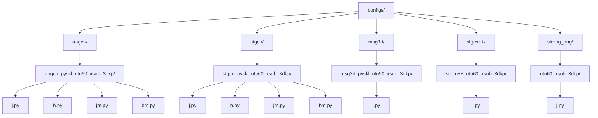
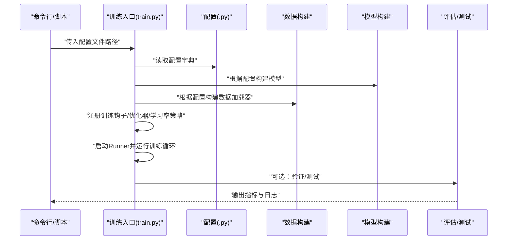
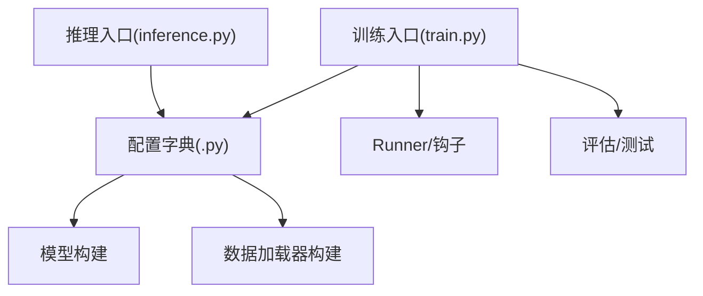

# 配置继承与覆盖机制

<cite>
**本文引用的文件**
- [configs/aagcn/aagcn_pyskl_ntu60_xsub_3dkp/j.py](file://configs/aagcn/aagcn_pyskl_ntu60_xsub_3dkp/j.py)
- [configs/aagcn/aagcn_pyskl_ntu60_xsub_3dkp/b.py](file://configs/aagcn/aagcn_pyskl_ntu60_xsub_3dkp/b.py)
- [configs/stgcn/stgcn_pyskl_ntu60_xsub_3dkp/j.py](file://configs/stgcn/stgcn_pyskl_ntu60_xsub_3dkp/j.py)
- [configs/msg3d/msg3d_pyskl_ntu60_xsub_3dkp/j.py](file://configs/msg3d/msg3d_pyskl_ntu60_xsub_3dkp/j.py)
- [configs/stgcn++/stgcn++_ntu60_xsub_3dkp/j.py](file://configs/stgcn++/stgcn++_ntu60_xsub_3dkp/j.py)
- [configs/strong_aug/ntu60_xsub_3dkp/j.py](file://configs/strong_aug/ntu60_xsub_3dkp/j.py)
- [pyskl/apis/train.py](file://pyskl/apis/train.py)
- [pyskl/apis/inference.py](file://pyskl/apis/inference.py)
</cite>

## 目录
1. [引言](#引言)
2. [项目结构](#项目结构)
3. [核心组件](#核心组件)
4. [架构总览](#架构总览)
5. [详细组件分析](#详细组件分析)
6. [依赖分析](#依赖分析)
7. [性能考虑](#性能考虑)
8. [故障排查指南](#故障排查指南)
9. [结论](#结论)
10. [附录](#附录)

## 引言
本文件系统性阐述 PySKL 的“配置继承与覆盖”机制，聚焦于如何通过基础配置文件派生出特定任务的配置，解释参数的继承、重写与合并策略，明确配置优先级与冲突解决方式，并总结最佳实践与调试技巧。读者可据此在不重复编写大量配置的前提下，快速扩展与定制训练/推理流程。

## 项目结构
PySKL 的配置采用“按模型与数据划分”的目录组织方式：每个算法（如 AAGCN、STGCN、MSG3D、STGCN++）在 configs 下有若干子目录，对应不同数据集划分与骨架来源（如 NTU60/120 的 XSub/XView/XSet，以及 3DKP 与 HRNet）。同一子任务下通常包含多个模态（关节 j、骨骼 b、关节运动 jm、骨骼运动 bm），分别以独立的 .py 文件表示完整配置。

图示来源
- [configs/aagcn/aagcn_pyskl_ntu60_xsub_3dkp/j.py](file://configs/aagcn/aagcn_pyskl_ntu60_xsub_3dkp/j.py#L1-L61)
- [configs/stgcn/stgcn_pyskl_ntu60_xsub_3dkp/j.py](file://configs/stgcn/stgcn_pyskl_ntu60_xsub_3dkp/j.py#L1-L61)
- [configs/msg3d/msg3d_pyskl_ntu60_xsub_3dkp/j.py](file://configs/msg3d/msg3d_pyskl_ntu60_xsub_3dkp/j.py#L1-L61)
- [configs/stgcn++/stgcn++_ntu60_xsub_3dkp/j.py](file://configs/stgcn++/stgcn++_ntu60_xsub_3dkp/j.py#L1-L64)
- [configs/strong_aug/ntu60_xsub_3dkp/j.py](file://configs/strong_aug/ntu60_xsub_3dkp/j.py#L1-L66)

章节来源
- [configs/aagcn/aagcn_pyskl_ntu60_xsub_3dkp/j.py](file://configs/aagcn/aagcn_pyskl_ntu60_xsub_3dkp/j.py#L1-L61)
- [configs/stgcn/stgcn_pyskl_ntu60_xsub_3dkp/j.py](file://configs/stgcn/stgcn_pyskl_ntu60_xsub_3dkp/j.py#L1-L61)
- [configs/msg3d/msg3d_pyskl_ntu60_xsub_3dkp/j.py](file://configs/msg3d/msg3d_pyskl_ntu60_xsub_3dkp/j.py#L1-L61)
- [configs/stgcn++/stgcn++_ntu60_xsub_3dkp/j.py](file://configs/stgcn++/stgcn++_ntu60_xsub_3dkp/j.py#L1-L64)
- [configs/strong_aug/ntu60_xsub_3dkp/j.py](file://configs/strong_aug/ntu60_xsub_3dkp/j.py#L1-L66)

## 核心组件
- 配置文件（.py）：以 Python 字典形式定义模型、数据、优化器、学习率策略、训练计划、日志与工作目录等键值对。例如模型结构、数据管道、批次大小、训练轮数、评估指标等。
- 训练入口（train.py）：负责构建 Runner、注册钩子、加载数据、执行训练与可选的验证/测试流程。
- 推理入口（inference.py）：负责从配置文件加载模型、构建测试流水线、执行前向推理并返回结果。

章节来源
- [pyskl/apis/train.py](file://pyskl/apis/train.py#L50-L213)
- [pyskl/apis/inference.py](file://pyskl/apis/inference.py#L19-L184)

## 架构总览
下面的序列图展示了“配置驱动的训练/推理”主流程：命令行或脚本指定某配置文件路径，训练/推理入口读取该配置，构建模型与数据流水线，随后进入训练或推理阶段。

图示来源
- [pyskl/apis/train.py](file://pyskl/apis/train.py#L50-L213)

## 详细组件分析

### 配置文件的继承与覆盖模式
- 模型层面的继承与覆盖
  - 同一任务（如 NTU-XSub 的 3DKP 关节模态）下，不同算法（AAGCN、STGCN、MSG3D、STGCN++）通过修改 model.backbone.type 与 graph_cfg 等键实现“覆盖式继承”。例如：
    - AAGCN 使用 AAGCN 骨干网络与特定图配置；
    - STGCN 使用 STGCN 骨干网络与空间图配置；
    - MSG3D 使用 MSG3D 骨干网络与二进制邻接图配置；
    - STGCN++ 在 STGCN 基础上增加 gcn_adaptive、gcn_with_res、tcn_type 等参数。
  - 这些差异体现在各自 j.py 中的 model 字段，形成“同任务、多算法”的差异化覆盖。

- 数据流水线的继承与覆盖
  - 训练/验证/测试流水线（train_pipeline/val_pipeline/test_pipeline）在多数配置中保持一致，仅在 feats 参数（如 ['j']、['b']、['jm']、['bm']）与 UniformSample 的 num_clips 上存在差异。这体现了“相同预处理步骤、不同输入模态”的继承模式。

- 优化与训练计划的继承与覆盖
  - 优化器（optimizer）、学习率策略（lr_config）、训练轮数（total_epochs）、日志与检查点（log_config/checkpoint_config）等在多数配置中一致，个别配置（如 strong_aug）会调整 total_epochs 或引入随机缩放/旋转增强，体现“默认配置 + 场景化覆盖”。

- 工作目录与日志级别
  - work_dir、log_level 等运行时设置在各配置中独立设定，确保不同实验的输出隔离。

章节来源
- [configs/aagcn/aagcn_pyskl_ntu60_xsub_3dkp/j.py](file://configs/aagcn/aagcn_pyskl_ntu60_xsub_3dkp/j.py#L1-L61)
- [configs/aagcn/aagcn_pyskl_ntu60_xsub_3dkp/b.py](file://configs/aagcn/aagcn_pyskl_ntu60_xsub_3dkp/b.py#L1-L61)
- [configs/stgcn/stgcn_pyskl_ntu60_xsub_3dkp/j.py](file://configs/stgcn/stgcn_pyskl_ntu60_xsub_3dkp/j.py#L1-L61)
- [configs/msg3d/msg3d_pyskl_ntu60_xsub_3dkp/j.py](file://configs/msg3d/msg3d_pyskl_ntu60_xsub_3dkp/j.py#L1-L61)
- [configs/stgcn++/stgcn++_ntu60_xsub_3dkp/j.py](file://configs/stgcn++/stgcn++_ntu60_xsub_3dkp/j.py#L1-L64)
- [configs/strong_aug/ntu60_xsub_3dkp/j.py](file://configs/strong_aug/ntu60_xsub_3dkp/j.py#L1-L66)

### 配置优先级与冲突解决
- 文件级优先级
  - 当前仓库未提供“基础配置 + 子配置继承”的显式语法（如 Python 继承或 YAML merge 键），因此不存在跨文件的自动“父配置”解析。各 .py 配置为独立的完整配置字典。
- 字典级优先级
  - 在单个 .py 文件内部，后出现的键会覆盖先前同名键（Python 字典行为）。例如：
    - 若同一文件内多次出现 data.videos_per_gpu，则后者生效；
    - 若同一文件内多次出现 model.backbone.graph_cfg，则后者覆盖前者。
- 流水线优先级
  - pipeline 列表中的元素按顺序执行；若同一类型变换（如 Decode）在列表中出现多次，最终行为由列表中靠后的条目决定。

章节来源
- [configs/aagcn/aagcn_pyskl_ntu60_xsub_3dkp/j.py](file://configs/aagcn/aagcn_pyskl_ntu60_xsub_3dkp/j.py#L1-L61)
- [configs/strong_aug/ntu60_xsub_3dkp/j.py](file://configs/strong_aug/ntu60_xsub_3dkp/j.py#L1-L66)

### 复杂场景与合并策略
- 多模态（j/b/jm/bm）的并行配置
  - 不同模态共享大部分配置，仅在 GenSkeFeat 的 feats 与 UniformSample 的 num_clips 上区分。这种“结构一致、参数微调”的做法属于“参数维度的覆盖”，而非文件级继承。
- 强增广场景（strong_aug）
  - 在训练流水线中插入 RandomScale 与 RandomRot 等增强步骤，并延长训练轮数。这是“在既有流水线上叠加新步骤”的典型覆盖方式。
- 不同骨干网络的参数差异（STGCN++）
  - 在 STGCN 基础上新增 gcn_adaptive、gcn_with_res、tcn_type 等键，属于“在既有模型配置上追加新参数”的覆盖。

章节来源
- [configs/strong_aug/ntu60_xsub_3dkp/j.py](file://configs/strong_aug/ntu60_xsub_3dkp/j.py#L13-L23)
- [configs/stgcn++/stgcn++_ntu60_xsub_3dkp/j.py](file://configs/stgcn++/stgcn++_ntu60_xsub_3dkp/j.py#L1-L9)

### 最佳实践与设计模式
- 将“稳定不变的配置”集中在一个模板文件中，再通过复制与局部覆盖的方式生成具体任务配置（当前仓库未提供模板文件，建议未来引入）。
- 对流水线进行模块化拆分，便于在不同配置中复用与替换（当前仓库已按 j/b/jm/bm 拆分，效果良好）。
- 使用统一的默认键（如 data、optimizer、lr_config、evaluation）作为“基线”，仅在需要时覆盖（当前仓库普遍遵循此原则）。
- 为不同数据集/划分/骨架来源建立清晰的命名约定，避免歧义（当前仓库命名规范清晰）。

### 实际应用场景与示例路径
- 训练 AAGCN 关节模态（NTU60 XSub 3DKP）
  - 参考路径：configs/aagcn/aagcn_pyskl_ntu60_xsub_3dkp/j.py
- 训练 STGCN 骨骼模态（NTU60 XSub 3DKP）
  - 参考路径：configs/stgcn/stgcn_pyskl_ntu60_xsub_3dkp/b.py
- 训练 MSG3D 关节模态（NTU60 XSub 3DKP）
  - 参考路径：configs/msg3d/msg3d_pyskl_ntu60_xsub_3dkp/j.py
- 训练 STGCN++ 关节模态（NTU60 XSub 3DKP）
  - 参考路径：configs/stgcn++/stgcn++_ntu60_xsub_3dkp/j.py
- 强增广下的 STGCN++ 关节模态（NTU60 XSub 3DKP）
  - 参考路径：configs/strong_aug/ntu60_xsub_3dkp/j.py

章节来源
- [configs/aagcn/aagcn_pyskl_ntu60_xsub_3dkp/j.py](file://configs/aagcn/aagcn_pyskl_ntu60_xsub_3dkp/j.py#L1-L61)
- [configs/stgcn/stgcn_pyskl_ntu60_xsub_3dkp/j.py](file://configs/stgcn/stgcn_pyskl_ntu60_xsub_3dkp/j.py#L1-L61)
- [configs/msg3d/msg3d_pyskl_ntu60_xsub_3dkp/j.py](file://configs/msg3d/msg3d_pyskl_ntu60_xsub_3dkp/j.py#L1-L61)
- [configs/stgcn++/stgcn++_ntu60_xsub_3dkp/j.py](file://configs/stgcn++/stgcn++_ntu60_xsub_3dkp/j.py#L1-L64)
- [configs/strong_aug/ntu60_xsub_3dkp/j.py](file://configs/strong_aug/ntu60_xsub_3dkp/j.py#L1-L66)

## 依赖分析
- 训练入口依赖配置字典中的键（model、data、optimizer、lr_config、evaluation 等）来构建 Runner、优化器与数据加载器。
- 推理入口依赖配置中的 data.test.pipeline 来构造测试流水线，并据此处理视频/帧/数组等输入。

图示来源
- [pyskl/apis/train.py](file://pyskl/apis/train.py#L50-L213)
- [pyskl/apis/inference.py](file://pyskl/apis/inference.py#L19-L184)

章节来源
- [pyskl/apis/train.py](file://pyskl/apis/train.py#L50-L213)
- [pyskl/apis/inference.py](file://pyskl/apis/inference.py#L19-L184)

## 性能考虑
- 数据加载器参数（videos_per_gpu、workers_per_gpu、persistent_workers）直接影响吞吐量与显存占用，应结合硬件能力与数据规模调优。
- 训练轮数与学习率策略影响收敛速度与最终精度，需与数据规模、模型复杂度匹配。
- 日志与检查点频率过高会增加磁盘 IO，建议在大规模训练中适当降低日志频率。

## 故障排查指南
- 配置键缺失
  - 现象：训练/推理时报错提示缺少必要键（如 data、optimizer、evaluation）。
  - 排查：确认配置文件是否包含 data、optimizer、lr_config、evaluation、work_dir 等关键键。
- 流水线顺序错误
  - 现象：数据解码失败或格式不符合预期。
  - 排查：核对 pipeline 中 PreNormalize3D、GenSkeFeat、UniformSample、PoseDecode、FormatGCNInput 等步骤的顺序与参数。
- 模型与图配置不匹配
  - 现象：报错提示 graph_cfg 与骨干网络不兼容。
  - 排查：确保 model.backbone.graph_cfg.mode 与所选骨干网络支持的模式一致。
- 增强步骤导致过拟合或不稳定
  - 现象：训练波动大或验证指标下降。
  - 排查：检查 strong_aug 中的 RandomScale、RandomRot 是否过于激进，适当降低幅度或减少训练轮数。

章节来源
- [pyskl/apis/train.py](file://pyskl/apis/train.py#L72-L144)
- [pyskl/apis/inference.py](file://pyskl/apis/inference.py#L104-L162)

## 结论
PySKL 的配置体系以“文件级独立配置 + 字典级覆盖”为核心：通过在同任务下按算法/模态拆分配置，实现“结构一致、参数差异”的高效管理；通过在 pipeline 与模型键上进行局部覆盖，满足多样化实验需求。建议在未来引入模板化配置与显式继承语法，进一步提升可维护性与一致性。

## 附录
- 配置键参考（来自训练入口对 cfg 的使用）
  - data、optimizer、lr_config、checkpoint_config、log_config、evaluation、work_dir、log_level、seed、resume_from、load_from、workflow、total_epochs、momentum_config、find_unused_parameters
- 推理相关键
  - data.test.pipeline、data.test.filename_tmpl、data.test.modality、data.test.start_index

章节来源
- [pyskl/apis/train.py](file://pyskl/apis/train.py#L72-L144)
- [pyskl/apis/inference.py](file://pyskl/apis/inference.py#L104-L162)