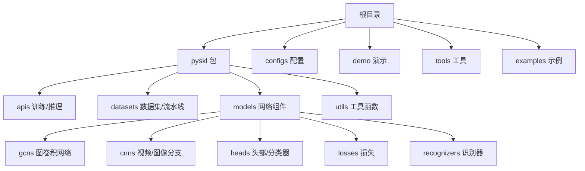
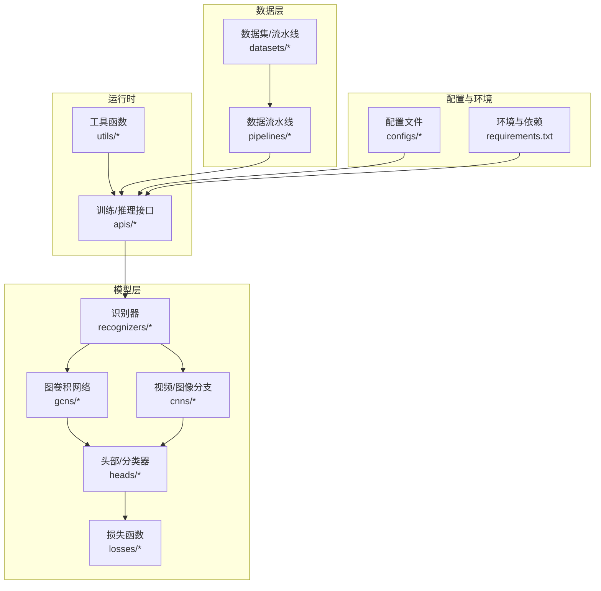
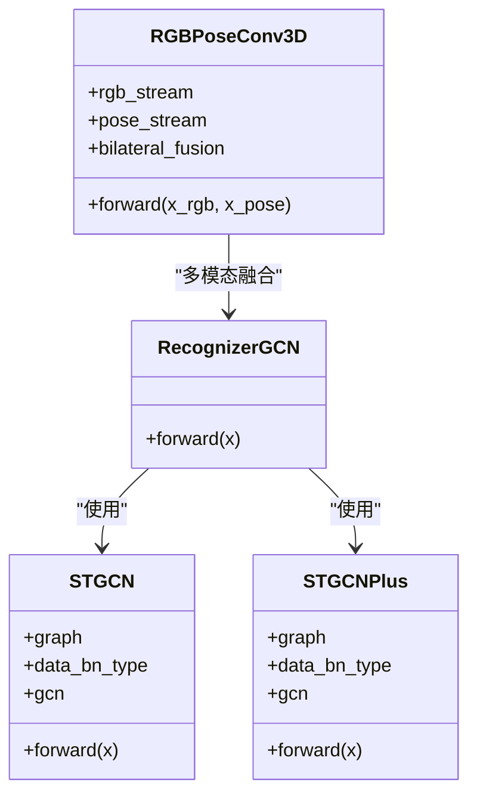
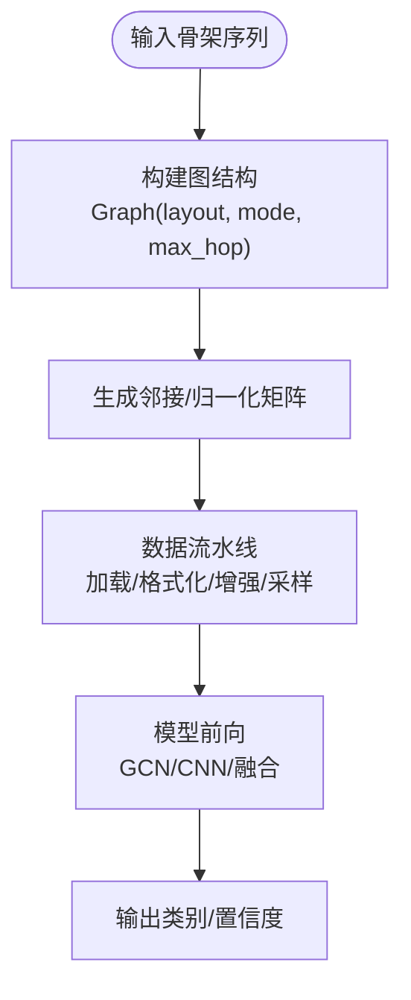
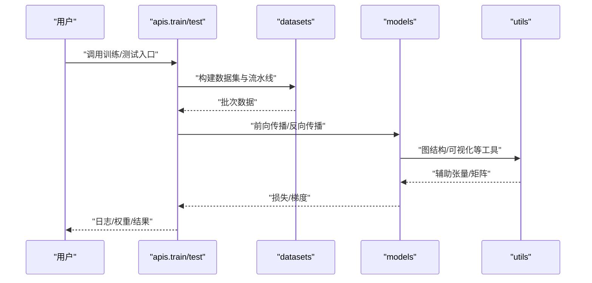
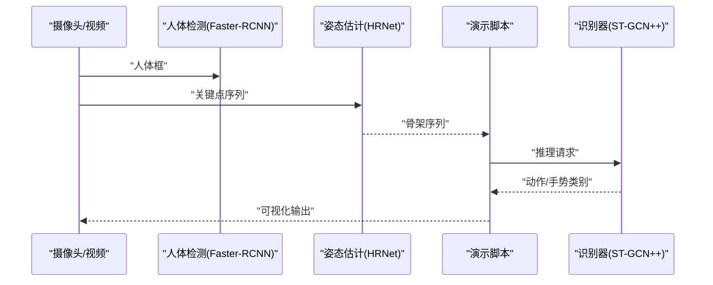
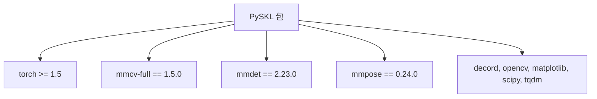

# 项目概述

<cite>
**本文引用的文件**
- [README.md](file://README.md)
- [requirements.txt](file://requirements.txt)
- [setup.py](file://setup.py)
- [pyskl/version.py](file://pyskl/version.py)
- [LICENSE](file://LICENSE)
- [pyskl/__init__.py](file://pyskl/__init__.py)
- [pyskl/models/__init__.py](file://pyskl/models/__init__.py)
- [pyskl/datasets/__init__.py](file://pyskl/datasets/__init__.py)
- [pyskl/apis/__init__.py](file://pyskl/apis/__init__.py)
- [demo/demo.md](file://demo/demo.md)
- [configs/stgcn/README.md](file://configs/stgcn/README.md)
- [configs/stgcn++/README.md](file://configs/stgcn++/README.md)
- [configs/rgbpose_conv3d/README.md](file://configs/rgbpose_conv3d/README.md)
- [pyskl/utils/graph.py](file://pyskl/utils/graph.py)
- [pyskl/models/gcns/stgcn.py](file://pyskl/models/gcns/stgcn.py)
</cite>

## 目录
1. [引言](#引言)
2. [项目结构](#项目结构)
3. [核心组件](#核心组件)
4. [架构总览](#架构总览)
5. [详细组件分析](#详细组件分析)
6. [依赖关系分析](#依赖关系分析)
7. [性能考量](#性能考量)
8. [故障排查指南](#故障排查指南)
9. [结论](#结论)
10. [附录](#附录)

## 引言
PySKL 是一个专注于基于骨架数据的动作识别工具箱，采用 PyTorch 深度学习框架实现，构建于开源项目 MMAction2 的基础之上。项目旨在提供从数据准备、训练、测试到推理的完整链路，并支持多种图卷积网络（GCN）类算法与多模态融合策略，覆盖骨架动作识别、手势识别、体育动作分析等典型场景。

- 基本概念：骨架动作识别以人体关节点序列（Joint、Bone、Motion 等模态）作为输入，通过图卷积神经网络建模空间拓扑关系与时间演化，实现对动作类别或手势的判别。
- 领域定位：在计算机视觉中，骨架方法以较低的冗余信息与强几何先验，成为视频理解的重要范式之一；PySKL 在该方向上提供系统化实践与基准。
- 与其他工具的区别：依托统一的数据管线、可复现的训练流程与丰富的模型配置（ST-GCN、AAGCN、CT-GCN、MS-G3D、DG-STGCN、STGCN++、PoseConv3D 等），并提供多模态融合（如 RGBPoseConv3D）与实时推理示例，形成“研究可复现、工程可落地”的特色。

**章节来源**
- file://README.md#L10-L12
- file://README.md#L30-L39

## 项目结构
仓库采用按功能域分层的组织方式：
- 根目录包含安装与环境配置、训练/测试脚本、演示与示例、数据预处理脚本与标签映射等。
- pyskl 包含核心模块：apis（训练/推理入口）、datasets（数据集与流水线）、models（网络构建与组件）、utils（图结构、可视化等工具）。
- configs 提供各算法的模型配置与权重链接，便于快速复现实验结果。
- demo 提供离线 GPU 与在线 CPU 的演示脚本，涵盖骨架动作识别与实时手势识别。

**图表来源**
- [pyskl/__init__.py](file://pyskl/__init__.py#L1-L17)
- [pyskl/models/__init__.py](file://pyskl/models/__init__.py#L1-L8)
- [pyskl/datasets/__init__.py](file://pyskl/datasets/__init__.py#L1-L13)
- [pyskl/apis/__init__.py](file://pyskl/apis/__init__.py#L1-L11)

**章节来源**
- file://README.md#L49-L91

## 核心组件
- 训练/推理接口：提供统一的训练与推理入口，支持单卡/多卡分布式执行。
- 数据集与流水线：封装骨架数据加载、格式化、增强、采样与多模态拼接，兼容 NTURGB+D、Kinetics、UCF101、HMDB51、FineGYM、Diving48 等数据集。
- 模型组件：包含 GCN 系列（ST-GCN、STGCN++、AAGCN、CT-GCN、MS-G3D、DG-STGCN）、CNN 分支（SlowOnly、X3D、ResNet3D 等）、头部与损失函数，以及多模态融合（如 RGBPoseConv3D）。
- 图结构工具：提供图邻接矩阵构造、归一化、跳跃距离计算与不同布局（OpenPose、NTU RGB+D、COCO、MediaPipe 手部）的支持。

**章节来源**
- file://pyskl/apis/__init__.py#L1-L11
- file://pyskl/datasets/__init__.py#L1-L13
- file://pyskl/models/__init__.py#L1-L8
- file://pyskl/utils/graph.py#L58-L175

## 架构总览
PySKL 的整体架构围绕“配置驱动 + 组件化模块 + 统一接口”展开。数据流自配置文件与数据集定义开始，经由流水线进行加载与增强，送入识别器（GCN/CNN 融合），最终输出动作/手势类别概率。

**图表来源**
- [requirements.txt](file://requirements.txt#L1-L14)
- [pyskl/apis/__init__.py](file://pyskl/apis/__init__.py#L1-L11)
- [pyskl/datasets/__init__.py](file://pyskl/datasets/__init__.py#L1-L13)
- [pyskl/models/__init__.py](file://pyskl/models/__init__.py#L1-L8)
- [pyskl/utils/graph.py](file://pyskl/utils/graph.py#L58-L175)

## 详细组件分析

### 支持的算法与多模态融合
- ST-GCN 与 ST-GCN++：提供基于图卷积的空间建模与改进的时间模块，支持关节、骨骼、运动等模态，覆盖 NTURGB+D 60/120 与 XSub/XView 场景。
- AAGCN、CT-GCN、MS-G3D、DG-STGCN：覆盖注意力、时空图卷积、多尺度与动态建模等方向。
- RGBPoseConv3D：双流 3D-CNN（类似 SlowFast），融合 RGB 与伪热图骨架，实现早期与晚期融合的多模态识别。

**图表来源**
- [pyskl/models/gcns/stgcn.py](file://pyskl/models/gcns/stgcn.py#L56-L138)
- [configs/stgcn/README.md](file://configs/stgcn/README.md#L1-L67)
- [configs/stgcn++/README.md](file://configs/stgcn++/README.md#L1-L57)
- [configs/rgbpose_conv3d/README.md](file://configs/rgbpose_conv3d/README.md#L1-L109)

**章节来源**
- file://README.md#L30-L39
- file://configs/stgcn/README.md#L1-L67
- file://configs/stgcn++/README.md#L1-L57
- file://configs/rgbpose_conv3d/README.md#L1-L109

### 数据与图结构
- 图结构工具：提供邻接矩阵、归一化、跳跃距离与不同布局（OpenPose、NTU RGB+D、COCO、MediaPipe 手部）的生成与模式（spatial、stgcn_spatial、binary、random）。
- 数据集与流水线：支持骨架数据加载、格式化、运动图生成、多模态拼接与采样，适配多数据集与多场景。

**图表来源**
- [pyskl/utils/graph.py](file://pyskl/utils/graph.py#L58-L175)
- [pyskl/datasets/__init__.py](file://pyskl/datasets/__init__.py#L1-L13)

**章节来源**
- file://pyskl/utils/graph.py#L58-L175
- file://pyskl/datasets/__init__.py#L1-L13

### 训练与推理流程
- 训练：通过分布式脚本启动，支持验证与多指标评估；配置文件决定模型、数据集与优化策略。
- 推理：提供初始化识别器与推理接口，支持单/多 GPU 测试。

**图表来源**
- [pyskl/apis/__init__.py](file://pyskl/apis/__init__.py#L1-L11)
- [pyskl/datasets/__init__.py](file://pyskl/datasets/__init__.py#L1-L13)
- [pyskl/models/__init__.py](file://pyskl/models/__init__.py#L1-L8)
- [pyskl/utils/graph.py](file://pyskl/utils/graph.py#L58-L175)

**章节来源**
- file://README.md#L82-L91
- file://pyskl/apis/__init__.py#L1-L11

### 演示与应用
- 骨架动作识别演示（GPU，离线）：基于 HRNet 关节与 Faster-RCNN 人体检测，支持 NTURGB+D 120 动作类别。
- 实时手势识别演示（CPU）：基于 MediaPipe 手部关键点与轻量化 ST-GCN++，支持 HaGRID 手势集合。

**图表来源**
- [demo/demo.md](file://demo/demo.md#L17-L41)

**章节来源**
- file://demo/demo.md#L1-L42

## 依赖关系分析
- 框架与库：PyTorch ≥ 1.5，mmcv-full 1.5.0，mmdet 2.23.0，mmpose 0.24.0，decord、opencv、matplotlib、scipy、tqdm 等。
- 版本约束：项目对 MMCV 版本范围有限制，确保与 MMAction2 生态兼容。
- 安装与发布：通过 setup.py 定义包元信息与安装依赖，支持开发式安装与打包。

**图表来源**
- [requirements.txt](file://requirements.txt#L1-L14)
- [setup.py](file://setup.py#L101-L129)
- [pyskl/__init__.py](file://pyskl/__init__.py#L1-L17)

**章节来源**
- file://requirements.txt#L1-L14
- file://setup.py#L101-L129
- file://pyskl/__init__.py#L1-L17

## 性能考量
- 模型编译：在满足 PyTorch ≥ 2.0 条件下，可通过训练/测试脚本启用 torch.compile 进行实验性加速（无性能保证）。
- 推理速度：提供推理速度估算示例，便于在不同硬件上评估吞吐与延迟。
- 多模态融合：RGBPoseConv3D 的早期/晚期融合策略在精度与效率间提供权衡，可根据需求调整测试策略（如减少多片段测试）。

**章节来源**
- file://README.md#L22-L29
- file://configs/rgbpose_conv3d/README.md#L77-L96

## 故障排查指南
- 环境不兼容：确认 MMCV 版本在要求范围内，避免与项目依赖冲突。
- 依赖缺失：确保安装 requirements.txt 中所有依赖，尤其是 mmdet、mmpose、mmcv-full。
- 训练/测试参数：检查配置文件中的数据集路径、注释格式、模态设置与 GPU 数量。
- 推理问题：确认输入视频分辨率与压缩脚本是否正确执行，骨架序列是否按要求格式化。

**章节来源**
- file://pyskl/__init__.py#L7-L14
- file://requirements.txt#L1-L14
- file://README.md#L49-L91

## 结论
PySKL 以“配置驱动 + 组件化模块 + 统一接口”为核心理念，提供从算法实现到工程落地的一体化方案。其在骨架动作识别领域具备良好的复现性与扩展性，支持多算法与多模态融合，并提供演示与性能评估工具，适合研究者与工程师快速开展相关工作。

## 附录

### 版本与许可证
- 版本：0.1.0
- 许可证：Apache License 2.0
- 贡献与联系：欢迎社区贡献，遵循 Apache 2.0 开源协议

**章节来源**
- file://pyskl/version.py#L1-L19
- file://LICENSE#L1-L204
- file://README.md#L107-L116