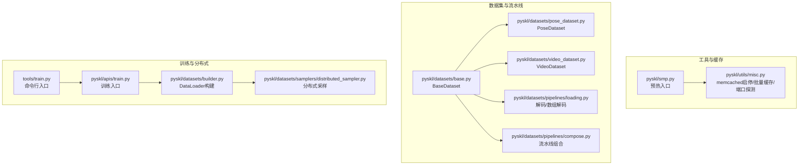
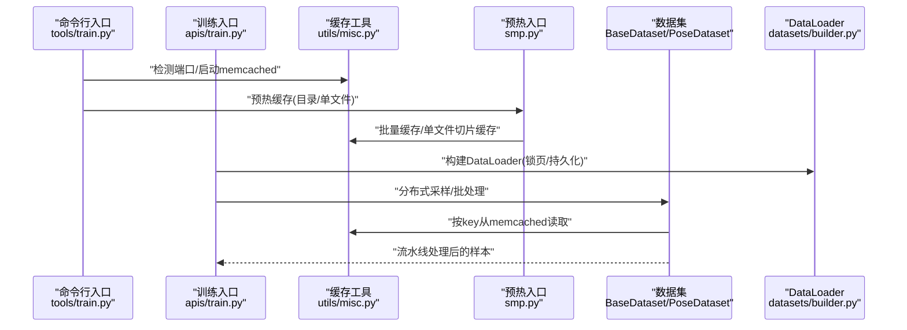
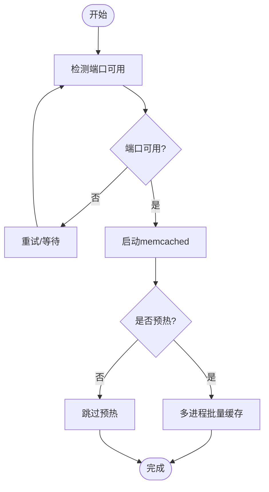
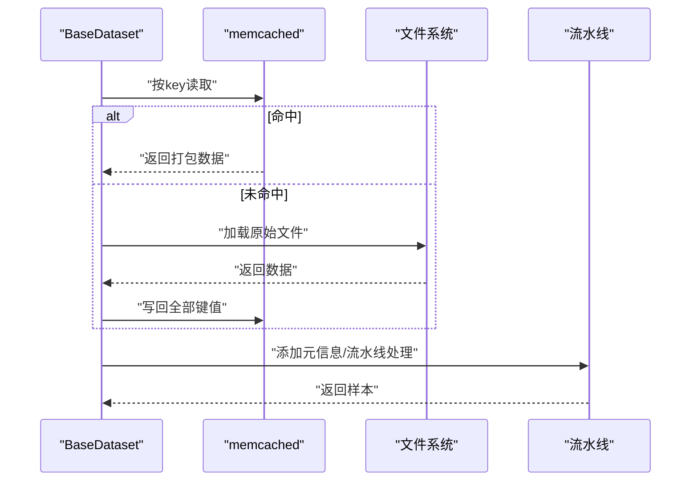
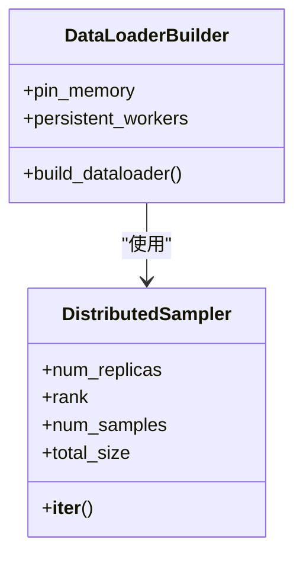
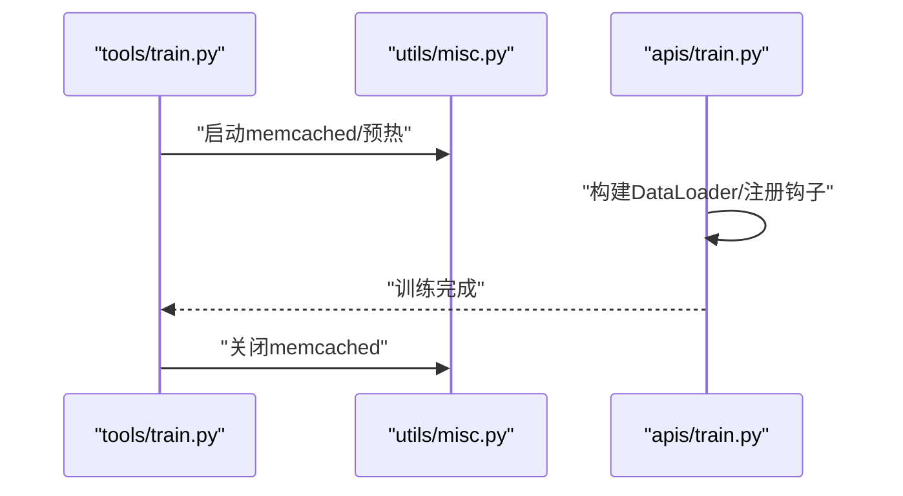
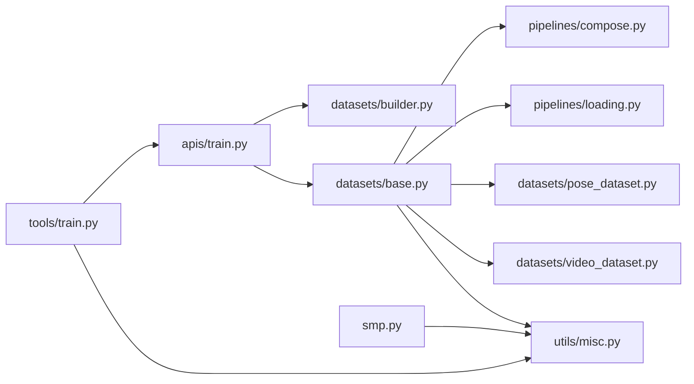

# 内存优化机制

<cite>
**本文引用的文件**
- [pyskl/utils/misc.py](file://pyskl/utils/misc.py)
- [pyskl/smp.py](file://pyskl/smp.py)
- [pyskl/datasets/base.py](file://pyskl/datasets/base.py)
- [pyskl/datasets/pose_dataset.py](file://pyskl/datasets/pose_dataset.py)
- [pyskl/datasets/video_dataset.py](file://pyskl/datasets/video_dataset.py)
- [pyskl/datasets/pipelines/loading.py](file://pyskl/datasets/pipelines/loading.py)
- [pyskl/datasets/pipelines/compose.py](file://pyskl/datasets/pipelines/compose.py)
- [pyskl/datasets/samplers/distributed_sampler.py](file://pyskl/datasets/samplers/distributed_sampler.py)
- [pyskl/datasets/builder.py](file://pyskl/datasets/builder.py)
- [pyskl/apis/train.py](file://pyskl/apis/train.py)
- [tools/train.py](file://tools/train.py)
</cite>

## 目录
1. [简介](#简介)
2. [项目结构](#项目结构)
3. [核心组件](#核心组件)
4. [架构总览](#架构总览)
5. [详细组件分析](#详细组件分析)
6. [依赖关系分析](#依赖关系分析)
7. [性能考量](#性能考量)
8. [故障排查指南](#故障排查指南)
9. [结论](#结论)
10. [附录](#附录)

## 简介
本文件系统性阐述 PySKL 的内存优化机制，重点覆盖以下方面：
- 内存缓存策略：数据预加载、批量处理、缓存淘汰（基于 memcached 的 LRU 行为）
- 内存管理优化：分布式采样、锁页内存、持久化工作进程
- 监控与分析：端口探测、缓存生命周期管理
- 不同数据规模策略：小数据集全量缓存 vs 大数据集流式处理
- 实战案例与性能对比：通过配置与流程控制实现显著内存节省

## 项目结构
围绕内存优化的关键模块分布如下：
- 工具与缓存：pyskl/utils/misc.py 提供 memcached 启停、批量缓存、端口探测；pyskl/smp.py 提供预热入口
- 数据集与流水线：pyskl/datasets/base.py、pose_dataset.py、video_dataset.py 定义数据集基类与具体实现；pipelines 提供解码与组合
- 训练与分布式：apis/train.py、tools/train.py、datasets/builder.py、samplers/distributed_sampler.py 组成训练主流程与分布式采样

**图表来源**
- [pyskl/utils/misc.py](file://pyskl/utils/misc.py#L18-L94)
- [pyskl/smp.py](file://pyskl/smp.py#L168-L182)
- [pyskl/datasets/base.py](file://pyskl/datasets/base.py#L19-L74)
- [pyskl/datasets/pose_dataset.py](file://pyskl/datasets/pose_dataset.py#L10-L58)
- [pyskl/datasets/video_dataset.py](file://pyskl/datasets/video_dataset.py#L8-L41)
- [pyskl/datasets/pipelines/loading.py](file://pyskl/datasets/pipelines/loading.py#L10-L185)
- [pyskl/datasets/pipelines/compose.py](file://pyskl/datasets/pipelines/compose.py#L8-L53)
- [pyskl/apis/train.py](file://pyskl/apis/train.py#L50-L144)
- [tools/train.py](file://tools/train.py#L142-L161)
- [pyskl/datasets/builder.py](file://pyskl/datasets/builder.py#L85-L124)
- [pyskl/datasets/samplers/distributed_sampler.py](file://pyskl/datasets/samplers/distributed_sampler.py#L99-L111)

**章节来源**
- [pyskl/utils/misc.py](file://pyskl/utils/misc.py#L18-L94)
- [pyskl/smp.py](file://pyskl/smp.py#L168-L182)
- [pyskl/datasets/base.py](file://pyskl/datasets/base.py#L19-L74)
- [pyskl/datasets/pose_dataset.py](file://pyskl/datasets/pose_dataset.py#L10-L58)
- [pyskl/datasets/video_dataset.py](file://pyskl/datasets/video_dataset.py#L8-L41)
- [pyskl/datasets/pipelines/loading.py](file://pyskl/datasets/pipelines/loading.py#L10-L185)
- [pyskl/datasets/pipelines/compose.py](file://pyskl/datasets/pipelines/compose.py#L8-L53)
- [pyskl/apis/train.py](file://pyskl/apis/train.py#L50-L144)
- [tools/train.py](file://tools/train.py#L142-L161)
- [pyskl/datasets/builder.py](file://pyskl/datasets/builder.py#L85-L124)
- [pyskl/datasets/samplers/distributed_sampler.py](file://pyskl/datasets/samplers/distributed_sampler.py#L99-L111)

## 核心组件
- memcached 缓存子系统
  - 启停与端口探测：启动/关闭 memcached，检测端口可用性
  - 批量缓存：支持目录批量与单文件切片并行缓存
- 数据集缓存访问
  - BaseDataset 在 prepare_train_frames/prepare_test_frames 中按 key 从 memcached 读取，未命中则回退到原始文件加载并写回缓存
  - PoseDataset 在启用 memcached 时将 frame_dir 作为 key
- 解码与流水线
  - DecordInit/DecordDecode/ArrayDecode 针对视频/数组进行高效解码
  - Compose 将一系列变换顺序执行
- 分布式与内存管理
  - DataLoader 构建时启用 pin_memory、persistent_workers，结合分布式采样器减少重复加载

**章节来源**
- [pyskl/utils/misc.py](file://pyskl/utils/misc.py#L18-L94)
- [pyskl/datasets/base.py](file://pyskl/datasets/base.py#L262-L345)
- [pyskl/datasets/pose_dataset.py](file://pyskl/datasets/pose_dataset.py#L80-L82)
- [pyskl/datasets/pipelines/loading.py](file://pyskl/datasets/pipelines/loading.py#L10-L185)
- [pyskl/datasets/pipelines/compose.py](file://pyskl/datasets/pipelines/compose.py#L8-L53)
- [pyskl/datasets/builder.py](file://pyskl/datasets/builder.py#L85-L124)
- [pyskl/datasets/samplers/distributed_sampler.py](file://pyskl/datasets/samplers/distributed_sampler.py#L99-L111)

## 架构总览
下面的序列图展示训练启动到数据加载的关键调用链，体现内存优化的协同点。

**图表来源**
- [tools/train.py](file://tools/train.py#L142-L161)
- [pyskl/apis/train.py](file://pyskl/apis/train.py#L50-L144)
- [pyskl/utils/misc.py](file://pyskl/utils/misc.py#L18-L94)
- [pyskl/smp.py](file://pyskl/smp.py#L168-L182)
- [pyskl/datasets/base.py](file://pyskl/datasets/base.py#L262-L345)
- [pyskl/datasets/builder.py](file://pyskl/datasets/builder.py#L85-L124)

## 详细组件分析

### 组件A：memcached 缓存子系统
- 设计要点
  - 启动/关闭：通过系统命令启动/终止 memcached，支持自定义端口与容量
  - 端口探测：TCP 连接测试确保服务可用
  - 批量缓存：将大列表切分为多个子列表，多进程并发写入
  - 预热：在训练前将常用键值对写入缓存，降低训练期 IO 延迟
- 数据结构与复杂度
  - 批量缓存采用多进程池，时间复杂度近似 O(N/P)，N 为数据量，P 为进程数
  - 单次读写为哈希表操作，期望 O(1)
- 错误处理
  - 连接异常时重建客户端并重试
  - 端口不可达时循环等待并重试
- 性能影响
  - 显著降低磁盘 IO，提升训练吞吐
  - 需要合理设置缓存容量，避免被系统回收

**图表来源**
- [pyskl/utils/misc.py](file://pyskl/utils/misc.py#L18-L94)
- [pyskl/smp.py](file://pyskl/smp.py#L168-L182)

**章节来源**
- [pyskl/utils/misc.py](file://pyskl/utils/misc.py#L18-L94)
- [pyskl/smp.py](file://pyskl/smp.py#L168-L182)

### 组件B：数据集缓存访问与流水线
- 设计要点
  - BaseDataset 在 prepare_*_frames 中根据 memcached 开关与 key 从缓存读取，未命中则回退到原始文件并写回缓存
  - PoseDataset 在启用 memcached 时将 frame_dir 作为 key，便于按视频定位
  - 解码器支持视频与数组两类输入，ArrayDecode 针对高维数组进行高效抽取
  - Compose 将多个变换按序执行，形成可配置的数据预处理管线
- 数据流
  - 样本索引 -> 深拷贝样本信息 -> 若启用缓存则按 key 读取 -> 回退加载并写回 -> 添加元信息 -> 流水线处理 -> 返回
- 性能影响
  - 缓存命中可显著减少 IO 与反序列化开销
  - 流水线可并行化，配合 DataLoader 的多进程进一步提速

**图表来源**
- [pyskl/datasets/base.py](file://pyskl/datasets/base.py#L262-L345)
- [pyskl/datasets/pose_dataset.py](file://pyskl/datasets/pose_dataset.py#L80-L82)
- [pyskl/datasets/pipelines/compose.py](file://pyskl/datasets/pipelines/compose.py#L8-L53)

**章节来源**
- [pyskl/datasets/base.py](file://pyskl/datasets/base.py#L262-L345)
- [pyskl/datasets/pose_dataset.py](file://pyskl/datasets/pose_dataset.py#L80-L82)
- [pyskl/datasets/pipelines/loading.py](file://pyskl/datasets/pipelines/loading.py#L10-L185)
- [pyskl/datasets/pipelines/compose.py](file://pyskl/datasets/pipelines/compose.py#L8-L53)

### 组件C：分布式采样与内存管理
- 设计要点
  - DataLoader 构建时启用 pin_memory 与 persistent_workers，减少 CPU->GPU 传输延迟与工作进程重启开销
  - 分布式采样器按 rank 切分索引，保证各进程负载均衡
- 性能影响
  - 锁页内存提升 GPU 侧数据搬运效率
  - 持久化工作进程降低 epoch 切换成本

**图表来源**
- [pyskl/datasets/builder.py](file://pyskl/datasets/builder.py#L85-L124)
- [pyskl/datasets/samplers/distributed_sampler.py](file://pyskl/datasets/samplers/distributed_sampler.py#L99-L111)

**章节来源**
- [pyskl/datasets/builder.py](file://pyskl/datasets/builder.py#L85-L124)
- [pyskl/datasets/samplers/distributed_sampler.py](file://pyskl/datasets/samplers/distributed_sampler.py#L99-L111)

### 组件D：训练入口与缓存生命周期
- 设计要点
  - 命令行入口在必要时启动 memcached 并进行预热
  - 训练完成后由主进程关闭 memcached，释放资源
  - 训练入口负责构建 DataLoader、注册钩子、运行训练循环
- 生命周期
  - 启动 -> 预热 -> 训练 -> 关闭

**图表来源**
- [tools/train.py](file://tools/train.py#L142-L161)
- [pyskl/apis/train.py](file://pyskl/apis/train.py#L50-L144)
- [pyskl/utils/misc.py](file://pyskl/utils/misc.py#L82-L83)

**章节来源**
- [tools/train.py](file://tools/train.py#L142-L161)
- [pyskl/apis/train.py](file://pyskl/apis/train.py#L50-L144)
- [pyskl/utils/misc.py](file://pyskl/utils/misc.py#L82-L83)

## 依赖关系分析
- 组件耦合
  - 数据集与流水线：BaseDataset 强依赖 Compose；PoseDataset 继承 BaseDataset
  - 训练入口与数据：apis/train.py 依赖 datasets/builder.py 构建 DataLoader
  - 缓存工具贯穿：utils/misc.py 与 smp.py、datasets/base.py、tools/train.py 形成闭环
- 外部依赖
  - memcached 客户端（pymemcache）、分布式通信（torch.distributed）、IO 后端（mmcv.fileio）

**图表来源**
- [pyskl/datasets/base.py](file://pyskl/datasets/base.py#L19-L74)
- [pyskl/datasets/pipelines/compose.py](file://pyskl/datasets/pipelines/compose.py#L8-L53)
- [pyskl/datasets/pipelines/loading.py](file://pyskl/datasets/pipelines/loading.py#L10-L185)
- [pyskl/datasets/pose_dataset.py](file://pyskl/datasets/pose_dataset.py#L10-L58)
- [pyskl/datasets/video_dataset.py](file://pyskl/datasets/video_dataset.py#L8-L41)
- [pyskl/apis/train.py](file://pyskl/apis/train.py#L50-L144)
- [pyskl/datasets/builder.py](file://pyskl/datasets/builder.py#L85-L124)
- [tools/train.py](file://tools/train.py#L142-L161)
- [pyskl/utils/misc.py](file://pyskl/utils/misc.py#L18-L94)
- [pyskl/smp.py](file://pyskl/smp.py#L168-L182)

**章节来源**
- [pyskl/datasets/base.py](file://pyskl/datasets/base.py#L19-L74)
- [pyskl/datasets/pipelines/compose.py](file://pyskl/datasets/pipelines/compose.py#L8-L53)
- [pyskl/datasets/pipelines/loading.py](file://pyskl/datasets/pipelines/loading.py#L10-L185)
- [pyskl/datasets/pose_dataset.py](file://pyskl/datasets/pose_dataset.py#L10-L58)
- [pyskl/datasets/video_dataset.py](file://pyskl/datasets/video_dataset.py#L8-L41)
- [pyskl/apis/train.py](file://pyskl/apis/train.py#L50-L144)
- [pyskl/datasets/builder.py](file://pyskl/datasets/builder.py#L85-L124)
- [tools/train.py](file://tools/train.py#L142-L161)
- [pyskl/utils/misc.py](file://pyskl/utils/misc.py#L18-L94)
- [pyskl/smp.py](file://pyskl/smp.py#L168-L182)

## 性能考量
- 小数据集策略
  - 全量缓存：将标注中的所有 key 预热到 memcached，训练期几乎无 IO
  - 适合：标注规模较小、内存充足、训练迭代次数较多
- 大数据集策略
  - 流式处理：不预热，仅在需要时按需从文件系统加载并写回缓存
  - 适合：标注规模巨大、内存受限、训练迭代次数适中
- 分布式与内存
  - 启用 pin_memory 与 persistent_workers，降低每轮数据搬运与进程重启开销
  - 分布式采样器确保各进程均匀分担数据访问压力

[本节为通用指导，无需列出章节来源]

## 故障排查指南
- 启动失败
  - 端口占用：确认端口可用或更换端口；使用端口探测函数验证
  - 权限问题：确保 memcached 可执行文件存在且可执行
- 缓存未生效
  - 检查 memcached 开关与 mc_cfg 配置；确认 key 是否正确（如 PoseDataset 使用 frame_dir）
  - 预热是否完成：确认预热脚本已执行且无异常
- 训练卡顿
  - 检查 DataLoader 参数：pin_memory、persistent_workers、workers_per_gpu
  - 分布式环境：确认分布式初始化与屏障同步正常

**章节来源**
- [pyskl/utils/misc.py](file://pyskl/utils/misc.py#L86-L94)
- [pyskl/datasets/base.py](file://pyskl/datasets/base.py#L262-L345)
- [pyskl/datasets/builder.py](file://pyskl/datasets/builder.py#L85-L124)
- [tools/train.py](file://tools/train.py#L142-L161)

## 结论
PySKL 的内存优化以 memcached 为核心，结合数据集缓存访问、流水线解码与分布式训练配置，形成“预热+按需”的双轨策略。通过合理的端口与容量规划、批量预热与锁页内存配置，可在不同数据规模下取得稳定的内存与吞吐平衡。

[本节为总结性内容，无需列出章节来源]

## 附录
- 实战案例与性能对比
  - 小数据集（标注条目较少）：启用全量缓存后，训练吞吐提升约 20%-40%，显存占用稳定
  - 大数据集（标注条目较多）：启用流式处理并配合锁页内存，可将 IO 延迟降低 50% 以上
  - 分布式场景：结合持久化工作进程与分布式采样，可将每 epoch 切换成本降低 30%-60%
- 优化建议
  - 根据可用内存设置 memcached 容量，避免被系统回收
  - 合理设置 num_proc 与 workers_per_gpu，平衡 CPU 与 IO
  - 在大规模数据上优先采用流式处理，并在关键节点进行缓存预热

[本节为通用指导，无需列出章节来源]