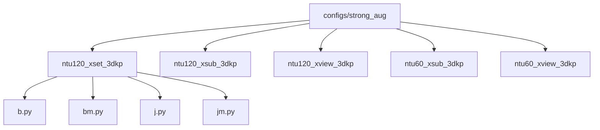
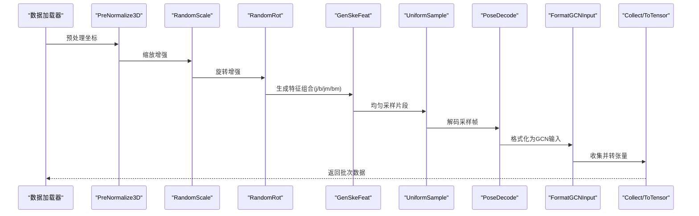
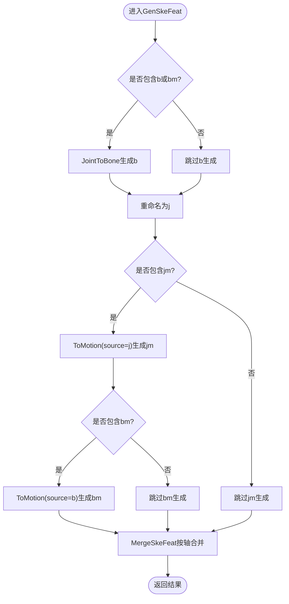
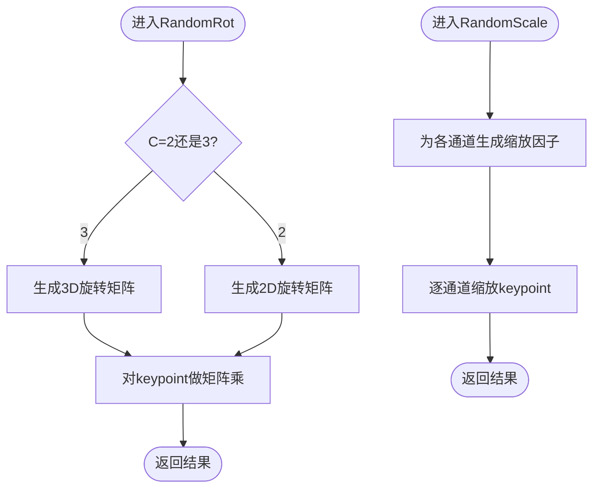
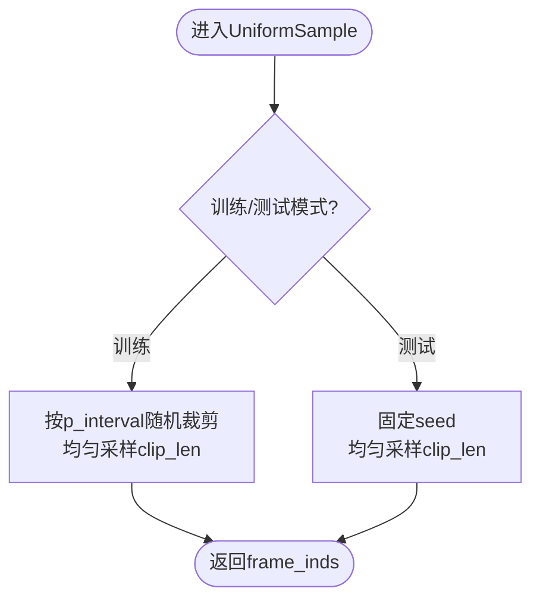
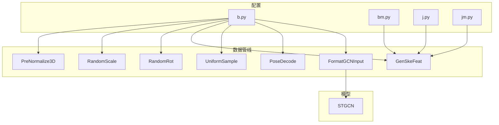

# 强化数据增强

<cite>
**本文引用的文件**
- [configs/strong_aug/ntu120_xset_3dkp/b.py](file://configs/strong_aug/ntu120_xset_3dkp/b.py)
- [configs/strong_aug/ntu120_xset_3dkp/bm.py](file://configs/strong_aug/ntu120_xset_3dkp/bm.py)
- [configs/strong_aug/ntu120_xset_3dkp/j.py](file://configs/strong_aug/ntu120_xset_3dkp/j.py)
- [configs/strong_aug/ntu120_xset_3dkp/jm.py](file://configs/strong_aug/ntu120_xset_3dkp/jm.py)
- [configs/strong_aug/README.md](file://configs/strong_aug/README.md)
- [pyskl/datasets/pipelines/augmentations.py](file://pyskl/datasets/pipelines/augmentations.py)
- [pyskl/datasets/pipelines/pose_related.py](file://pyskl/datasets/pipelines/pose_related.py)
- [pyskl/datasets/pipelines/compose.py](file://pyskl/datasets/pipelines/compose.py)
- [pyskl/datasets/pipelines/sampling.py](file://pyskl/datasets/pipelines/sampling.py)
- [pyskl/models/gcns/stgcn.py](file://pyskl/models/gcns/stgcn.py)
</cite>

## 目录
1. [简介](#简介)
2. [项目结构](#项目结构)
3. [核心组件](#核心组件)
4. [架构总览](#架构总览)
5. [详细组件分析](#详细组件分析)
6. [依赖关系分析](#依赖关系分析)
7. [性能考量](#性能考量)
8. [故障排查指南](#故障排查指南)
9. [结论](#结论)
10. [附录](#附录)

## 简介
本文件面向PySKL的“强化数据增强”配置体系，聚焦于strong_aug配置系统在骨骼动作识别中的实现与应用。内容涵盖：
- 数据增强策略设计思路：空间几何变换（旋转、缩放）、时间采样策略（均匀采样）与特征生成（关节、骨骼、运动）。
- 不同增强配置文件（b.py、bm.py、j.py、jm.py）的差异与适用场景。
- 增强参数调优指南：强度控制、随机性设置与数据分布影响。
- 增强策略对模型性能的影响：训练稳定性、泛化能力与过拟合抑制。
- 使用示例与最佳实践。

## 项目结构
strong_aug配置位于configs目录下，按数据集划分（如ntu120_xset_3dkp），每类任务提供四种配置文件，分别对应不同的骨架特征组合与增强策略。

图表来源
- [configs/strong_aug/README.md](file://configs/strong_aug/README.md#L1-L38)

章节来源
- [configs/strong_aug/README.md](file://configs/strong_aug/README.md#L1-L38)

## 核心组件
- 骨骼特征生成管线：通过GenSkeFeat统一生成关节（j）、骨骼（b）、关节运动（jm）、骨骼运动（bm）等多模态输入。
- 空间增强：RandomRot（3D/2D旋转）、RandomScale（缩放）。
- 时间增强：UniformSample（均匀采样片段）。
- 输入格式化：FormatGCNInput（适配GCN输入维度与通道）。
- 数据管线编排：Compose（顺序执行多个transform）。

章节来源
- [pyskl/datasets/pipelines/pose_related.py](file://pyskl/datasets/pipelines/pose_related.py#L377-L402)
- [pyskl/datasets/pipelines/pose_related.py](file://pyskl/datasets/pipelines/pose_related.py#L100-L134)
- [pyskl/datasets/pipelines/pose_related.py](file://pyskl/datasets/pipelines/pose_related.py#L137-L153)
- [pyskl/datasets/pipelines/sampling.py](file://pyskl/datasets/pipelines/sampling.py#L174-L176)
- [pyskl/datasets/pipelines/compose.py](file://pyskl/datasets/pipelines/compose.py#L8-L53)

## 架构总览
以下序列图展示一次训练样本从原始骨架到模型输入的关键流程，以及关键增强步骤的位置与作用。

图表来源
- [configs/strong_aug/ntu120_xset_3dkp/b.py](file://configs/strong_aug/ntu120_xset_3dkp/b.py#L13-L23)
- [configs/strong_aug/ntu120_xset_3dkp/bm.py](file://configs/strong_aug/ntu120_xset_3dkp/bm.py#L13-L23)
- [configs/strong_aug/ntu120_xset_3dkp/j.py](file://configs/strong_aug/ntu120_xset_3dkp/j.py#L13-L23)
- [configs/strong_aug/ntu120_xset_3dkp/jm.py](file://configs/strong_aug/ntu120_xset_3dkp/jm.py#L13-L23)
- [pyskl/datasets/pipelines/pose_related.py](file://pyskl/datasets/pipelines/pose_related.py#L377-L402)
- [pyskl/datasets/pipelines/pose_related.py](file://pyskl/datasets/pipelines/pose_related.py#L100-L134)
- [pyskl/datasets/pipelines/pose_related.py](file://pyskl/datasets/pipelines/pose_related.py#L137-L153)
- [pyskl/datasets/pipelines/sampling.py](file://pyskl/datasets/pipelines/sampling.py#L174-L176)

## 详细组件分析

### 配置文件对比与适用场景
- b.py：仅使用骨骼（bone）特征，适合强调肢体结构与连接关系的任务，对尺度变化更鲁棒。
- bm.py：骨骼+运动（bone-motion）特征，同时建模静态结构与动态变化，提升时序判别力。
- j.py：仅使用关节（joint）特征，计算开销较低，适合快速训练或资源受限场景。
- jm.py：关节+运动（joint-motion）特征，平衡计算成本与信息量，常用于XSet/XSub跨视角/跨主体场景。

章节来源
- [configs/strong_aug/ntu120_xset_3dkp/b.py](file://configs/strong_aug/ntu120_xset_3dkp/b.py#L1-L66)
- [configs/strong_aug/ntu120_xset_3dkp/bm.py](file://configs/strong_aug/ntu120_xset_3dkp/bm.py#L1-L66)
- [configs/strong_aug/ntu120_xset_3dkp/j.py](file://configs/strong_aug/ntu120_xset_3dkp/j.py#L1-L66)
- [configs/strong_aug/ntu120_xset_3dkp/jm.py](file://configs/strong_aug/ntu120_xset_3dkp/jm.py#L1-L66)
- [configs/strong_aug/README.md](file://configs/strong_aug/README.md#L22-L28)

### 骨骼特征生成与融合（GenSkeFeat）
- 功能：根据feats列表动态装配特征生成链路，支持b、bm、j、jm组合，并最终合并为统一的keypoint张量。
- 关键子模块：
  - JointToBone：将关节坐标差值转换为骨骼向量。
  - ToMotion：计算相邻帧差分得到运动特征。
  - MergeSkeFeat：沿指定轴拼接多特征。
- 设计要点：通过Compose顺序执行，保证特征生成的可插拔与可扩展。

图表来源
- [pyskl/datasets/pipelines/pose_related.py](file://pyskl/datasets/pipelines/pose_related.py#L377-L402)
- [pyskl/datasets/pipelines/pose_related.py](file://pyskl/datasets/pipelines/pose_related.py#L295-L332)
- [pyskl/datasets/pipelines/pose_related.py](file://pyskl/datasets/pipelines/pose_related.py#L335-L356)
- [pyskl/datasets/pipelines/pose_related.py](file://pyskl/datasets/pipelines/pose_related.py#L360-L375)

章节来源
- [pyskl/datasets/pipelines/pose_related.py](file://pyskl/datasets/pipelines/pose_related.py#L377-L402)

### 空间增强：旋转与缩放
- RandomRot：支持2D/3D旋转，按通道维度随机采样旋转角度，对齐骨骼坐标系进行旋转矩阵变换。
- RandomScale：对每个通道施加随机缩放因子，保持整体尺度一致性。

图表来源
- [pyskl/datasets/pipelines/pose_related.py](file://pyskl/datasets/pipelines/pose_related.py#L100-L134)
- [pyskl/datasets/pipelines/pose_related.py](file://pyskl/datasets/pipelines/pose_related.py#L137-L153)

章节来源
- [pyskl/datasets/pipelines/pose_related.py](file://pyskl/datasets/pipelines/pose_related.py#L100-L134)
- [pyskl/datasets/pipelines/pose_related.py](file://pyskl/datasets/pipelines/pose_related.py#L137-L153)

### 时间增强：均匀采样（UniformSample）
- 在训练阶段对视频长度进行随机裁剪比例（p_interval），再在裁剪范围内均匀采样固定长度片段，确保时序覆盖与多样性。
- 测试阶段采用确定性种子，保证结果可复现。

图表来源
- [pyskl/datasets/pipelines/sampling.py](file://pyskl/datasets/pipelines/sampling.py#L174-L176)
- [pyskl/datasets/pipelines/sampling.py](file://pyskl/datasets/pipelines/sampling.py#L46-L85)
- [pyskl/datasets/pipelines/sampling.py](file://pyskl/datasets/pipelines/sampling.py#L87-L126)

章节来源
- [pyskl/datasets/pipelines/sampling.py](file://pyskl/datasets/pipelines/sampling.py#L174-L176)
- [pyskl/datasets/pipelines/sampling.py](file://pyskl/datasets/pipelines/sampling.py#L46-L85)
- [pyskl/datasets/pipelines/sampling.py](file://pyskl/datasets/pipelines/sampling.py#L87-L126)

### 输入格式化（FormatGCNInput）
- 统一骨骼张量形状（M,T,V,C），并对多人场景进行填充/截断，确保输入符合GCN模型期望。
- 可选“零填充”或“循环填充”，并在需要时对关键点置信度进行拼接。

章节来源
- [pyskl/datasets/pipelines/pose_related.py](file://pyskl/datasets/pipelines/pose_related.py#L427-L467)

### 数据管线编排（Compose）
- 将多个transform按顺序组合执行，支持字典配置与对象实例两种方式，便于灵活扩展与维护。

章节来源
- [pyskl/datasets/pipelines/compose.py](file://pyskl/datasets/pipelines/compose.py#L8-L53)

## 依赖关系分析
- 配置文件依赖于数据管线模块：PreNormalize3D、RandomScale、RandomRot、GenSkeFeat、UniformSample、PoseDecode、FormatGCNInput、Collect/ToTensor。
- 模型侧ST-GCN作为backbone，接收格式化后的（M,S,C,T,V）张量，经多层GCN/TCN处理后输出分类头。

图表来源
- [configs/strong_aug/ntu120_xset_3dkp/b.py](file://configs/strong_aug/ntu120_xset_3dkp/b.py#L13-L23)
- [configs/strong_aug/ntu120_xset_3dkp/bm.py](file://configs/strong_aug/ntu120_xset_3dkp/bm.py#L13-L23)
- [configs/strong_aug/ntu120_xset_3dkp/j.py](file://configs/strong_aug/ntu120_xset_3dkp/j.py#L13-L23)
- [configs/strong_aug/ntu120_xset_3dkp/jm.py](file://configs/strong_aug/ntu120_xset_3dkp/jm.py#L13-L23)
- [pyskl/datasets/pipelines/pose_related.py](file://pyskl/datasets/pipelines/pose_related.py#L377-L402)
- [pyskl/models/gcns/stgcn.py](file://pyskl/models/gcns/stgcn.py#L56-L137)

章节来源
- [pyskl/models/gcns/stgcn.py](file://pyskl/models/gcns/stgcn.py#L56-L137)

## 性能考量
- 训练稳定性
  - RandomRot与RandomScale引入几何不变性，有助于缓解因视角/尺度偏差导致的不稳定。
  - UniformSample在训练时增加时序多样性，避免模型记忆特定片段。
- 泛化能力
  - b/bm与j/jm特征组合在不同数据集划分上表现稳定，jm/bm对跨视角/跨主体场景尤为有效。
- 过拟合预防
  - 增强策略与RepeatDataset结合（times=5）可在不扩大数据集规模的前提下提升泛化。
  - 学习率余弦退火策略与较短训练周期（如120或24轮）配合，进一步降低过拟合风险。

章节来源
- [configs/strong_aug/README.md](file://configs/strong_aug/README.md#L29-L32)
- [configs/strong_aug/ntu120_xset_3dkp/b.py](file://configs/strong_aug/ntu120_xset_3dkp/b.py#L47-L49)
- [configs/strong_aug/ntu120_xset_3dkp/bm.py](file://configs/strong_aug/ntu120_xset_3dkp/bm.py#L47-L49)
- [configs/strong_aug/ntu120_xset_3dkp/j.py](file://configs/strong_aug/ntu120_xset_3dkp/j.py#L47-L49)
- [configs/strong_aug/ntu120_xset_3dkp/jm.py](file://configs/strong_aug/ntu120_xset_3dkp/jm.py#L47-L49)

## 故障排查指南
- 关节/骨骼为空
  - RandomRot会跳过全零骨架，若出现异常需检查PreNormalize3D与GenSkeFeat的顺序与输入有效性。
- 形状不匹配
  - FormatGCNInput要求M,T,V,C一致，多人填充/截断不当会导致错误；确认num_person与数据标注一致。
- 特征缺失
  - 若feats未包含所需项（如b/j/jm/bm），GenSkeFeat不会生成对应特征，请核对配置文件中GenSkeFeat的feats列表。
- 时序采样异常
  - UniformSample在num_frames较小或clip_len较大时可能采样不足，需调整clip_len或p_interval。

章节来源
- [pyskl/datasets/pipelines/pose_related.py](file://pyskl/datasets/pipelines/pose_related.py#L100-L134)
- [pyskl/datasets/pipelines/pose_related.py](file://pyskl/datasets/pipelines/pose_related.py#L427-L467)
- [pyskl/datasets/pipelines/pose_related.py](file://pyskl/datasets/pipelines/pose_related.py#L377-L402)
- [pyskl/datasets/pipelines/sampling.py](file://pyskl/datasets/pipelines/sampling.py#L174-L176)

## 结论
strong_aug通过“几何空间增强 + 时间采样 + 多模态特征融合”的组合，在NTURGB+D系列数据集上实现了稳定的高精度与良好的泛化能力。不同配置（b/bm/j/jm）在计算复杂度与信息量之间提供了灵活权衡，适用于多种下游任务与部署环境。

## 附录

### 使用示例与最佳实践
- 快速开始
  - 选择配置：根据任务需求与资源约束选择b/bm/j/jm之一。
  - 路径参考：以ntu120_xset_3dkp为例，定位对应配置文件路径。
- 参数调优建议
  - RandomRot强度：默认theta适中，若动作幅度大可适度增大，注意避免过度旋转导致语义失真。
  - RandomScale范围：scale=0.1通常较为稳健，可根据数据尺度调整。
  - UniformSample：clip_len与num_clips共同决定时序分辨率与多样性，建议先固定clip_len再调节num_clips。
  - RepeatDataset：当数据量有限时，可提高times以增强多样性。
- 数据分布影响
  - 增强会改变输入分布，建议在验证集上观察Top-1指标变化，避免过增强导致性能回退。
- 训练稳定性与收敛
  - 余弦退火学习率与合理batch size线性缩放策略配合，有助于稳定收敛。

章节来源
- [configs/strong_aug/README.md](file://configs/strong_aug/README.md#L29-L32)
- [configs/strong_aug/ntu120_xset_3dkp/b.py](file://configs/strong_aug/ntu120_xset_3dkp/b.py#L53-L61)
- [configs/strong_aug/ntu120_xset_3dkp/bm.py](file://configs/strong_aug/ntu120_xset_3dkp/bm.py#L53-L61)
- [configs/strong_aug/ntu120_xset_3dkp/j.py](file://configs/strong_aug/ntu120_xset_3dkp/j.py#L53-L61)
- [configs/strong_aug/ntu120_xset_3dkp/jm.py](file://configs/strong_aug/ntu120_xset_3dkp/jm.py#L53-L61)