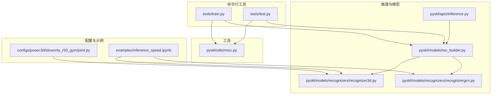
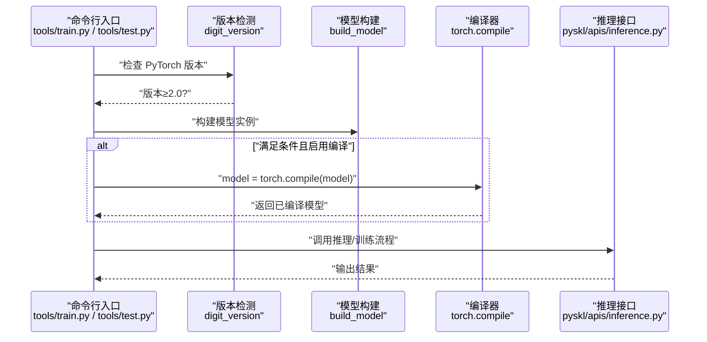
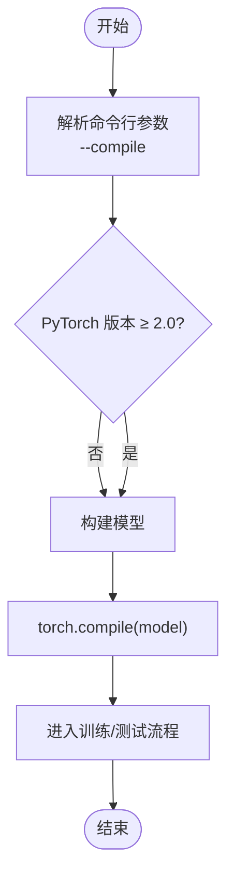
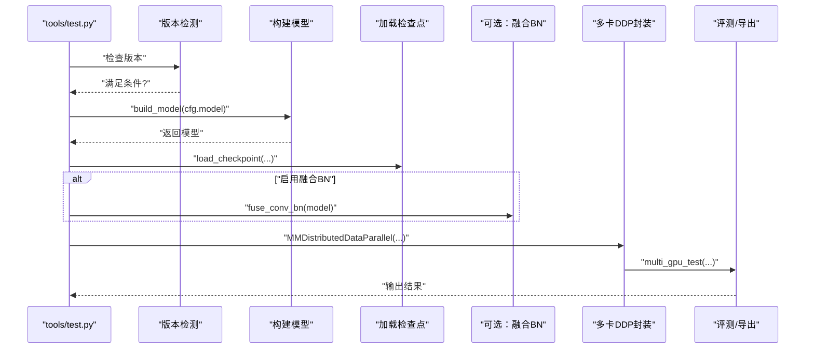
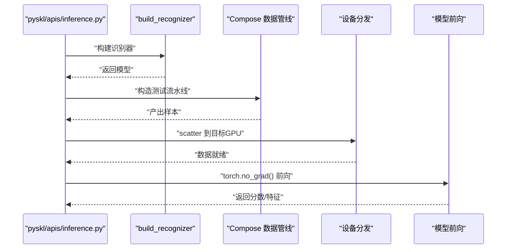
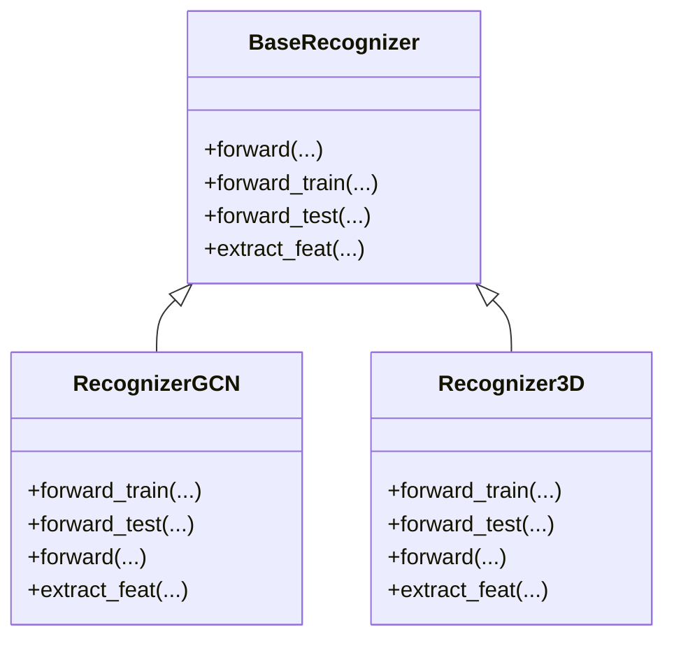
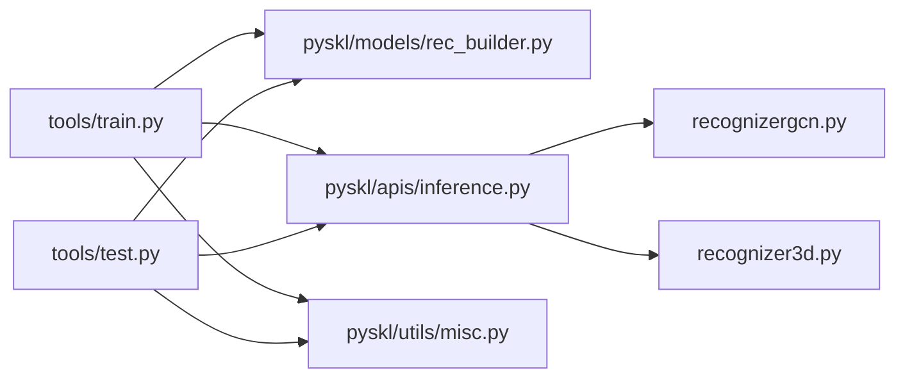

# 模型编译优化

<cite>
**本文引用的文件**
- [tools/train.py](file://tools/train.py)
- [tools/test.py](file://tools/test.py)
- [pyskl/apis/inference.py](file://pyskl/apis/inference.py)
- [pyskl/models/rec_builder.py](file://pyskl/models/rec_builder.py)
- [pyskl/utils/misc.py](file://pyskl/utils/misc.py)
- [pyskl/models/recognizers/recognizergcn.py](file://pyskl/models/recognizers/recognizergcn.py)
- [pyskl/models/recognizers/recognizer3d.py](file://pyskl/models/recognizers/recognizer3d.py)
- [configs/posec3d/slowonly_r50_gym/joint.py](file://configs/posec3d/slowonly_r50_gym/joint.py)
- [examples/inference_speed.ipynb](file://examples/inference_speed.ipynb)
</cite>

## 目录
1. [简介](#简介)
2. [项目结构](#项目结构)
3. [核心组件](#核心组件)
4. [架构总览](#架构总览)
5. [组件详解](#组件详解)
6. [依赖关系分析](#依赖关系分析)
7. [性能考量](#性能考量)
8. [故障排查指南](#故障排查指南)
9. [结论](#结论)
10. [附录](#附录)

## 简介
本文件面向PySKL的模型编译优化能力，系统阐述在PyTorch 2.0下通过torch.compile进行推理与训练加速的实现方式、配置策略、兼容性注意事项以及实测性能表现。重点覆盖以下方面：
- 编译器开关与启用条件（仅在PyTorch 2.0及以上）
- 训练与测试阶段的编译集成点
- 静态图与动态图的适配策略
- 兼容性问题与规避方案（形状变化、动态控制流、梯度计算）
- 性能基准与部署建议

## 项目结构
围绕“编译优化”的关键代码分布在如下模块：
- 命令行入口：tools/train.py、tools/test.py
- 推理接口：pyskl/apis/inference.py
- 模型构建：pyskl/models/rec_builder.py
- 工具与缓存：pyskl/utils/misc.py
- 典型识别器实现：pyskl/models/recognizers/recognizergcn.py、pyskl/models/recognizers/recognizer3d.py
- 配置样例：configs/posec3d/slowonly_r50_gym/joint.py
- 性能基准：examples/inference_speed.ipynb

图表来源
- [tools/train.py](file://tools/train.py#L121-L124)
- [tools/test.py](file://tools/test.py#L86-L89)
- [pyskl/apis/inference.py](file://pyskl/apis/inference.py#L46-L54)
- [pyskl/models/rec_builder.py](file://pyskl/models/rec_builder.py#L22-L24)
- [pyskl/models/recognizers/recognizergcn.py](file://pyskl/models/recognizers/recognizergcn.py#L8-L10)
- [pyskl/models/recognizers/recognizer3d.py](file://pyskl/models/recognizers/recognizer3d.py#L9-L11)
- [pyskl/utils/misc.py](file://pyskl/utils/misc.py#L115-L125)
- [configs/posec3d/slowonly_r50_gym/joint.py](file://configs/posec3d/slowonly_r50_gym/joint.py#L1-L20)
- [examples/inference_speed.ipynb](file://examples/inference_speed.ipynb#L10-L16)

章节来源
- [tools/train.py](file://tools/train.py#L1-L165)
- [tools/test.py](file://tools/test.py#L1-L185)
- [pyskl/apis/inference.py](file://pyskl/apis/inference.py#L1-L184)
- [pyskl/models/rec_builder.py](file://pyskl/models/rec_builder.py#L1-L39)
- [pyskl/utils/misc.py](file://pyskl/utils/misc.py#L1-L131)

## 核心组件
- 训练脚本中的编译开关与版本检测：在满足PyTorch版本条件时，对模型调用torch.compile进行编译。
- 测试脚本中的编译开关与版本检测：同样在满足条件时对模型进行编译。
- 推理接口：负责数据预处理、设备分发与前向推理，编译后的模型在此路径上直接生效。
- 模型构建器：统一注册与构建各类识别器（GCN/3D CNN等），编译后可提升静态图推理性能。
- 工具函数：提供检查点缓存、日志与分布式环境初始化等支撑。

章节来源
- [tools/train.py](file://tools/train.py#L121-L124)
- [tools/test.py](file://tools/test.py#L86-L89)
- [pyskl/apis/inference.py](file://pyskl/apis/inference.py#L19-L54)
- [pyskl/models/rec_builder.py](file://pyskl/models/rec_builder.py#L22-L24)

## 架构总览
下图展示从命令行到模型编译与推理的关键流程，突出编译开关、版本检测与推理路径的关系。

图表来源
- [tools/train.py](file://tools/train.py#L121-L124)
- [tools/test.py](file://tools/test.py#L86-L89)
- [pyskl/apis/inference.py](file://pyskl/apis/inference.py#L19-L54)

## 组件详解

### 训练阶段的编译集成
- 命令行参数：新增--compile开关，仅在PyTorch 2.0及以上可用。
- 版本检测：使用digit_version比较当前torch版本是否满足≥2.0.0。
- 编译时机：在模型构建完成后立即调用torch.compile包裹模型。
- 影响范围：训练与测试均可受益于静态图优化带来的执行加速。

图表来源
- [tools/train.py](file://tools/train.py#L22-L57)
- [tools/train.py](file://tools/train.py#L121-L124)

章节来源
- [tools/train.py](file://tools/train.py#L22-L57)
- [tools/train.py](file://tools/train.py#L121-L124)

### 测试阶段的编译集成
- 参数与版本检测逻辑同训练脚本。
- 在加载检查点后，若启用编译则对模型再次编译，随后进入多卡推理流程。
- 支持融合卷积与批归一化以进一步提升推理速度（可选）。

图表来源
- [tools/test.py](file://tools/test.py#L86-L107)
- [tools/test.py](file://tools/test.py#L141-L148)

章节来源
- [tools/test.py](file://tools/test.py#L86-L107)
- [tools/test.py](file://tools/test.py#L141-L148)

### 推理接口与编译后的执行
- 初始化识别器：构建模型、加载权重、迁移至目标设备，并设置为eval模式。
- 数据管线：根据输入类型（视频/数组/原始帧）选择对应的解码器与Compose流水线。
- 设备分发：若模型参数位于CUDA，则将数据散播到对应GPU。
- 前向推理：在无梯度上下文中调用模型前向，返回Top-K结果或指定层特征。

图表来源
- [pyskl/apis/inference.py](file://pyskl/apis/inference.py#L104-L174)

章节来源
- [pyskl/apis/inference.py](file://pyskl/apis/inference.py#L19-L54)
- [pyskl/apis/inference.py](file://pyskl/apis/inference.py#L104-L174)

### 典型识别器与编译适配
- GCN识别器：骨架动作识别，前向路径相对稳定，适合静态图编译；注意测试配置中的池化与平均片段策略。
- 3D识别器：视频3D CNN框架，包含多视图聚合与平均片段逻辑，编译时需确保形状与控制流稳定。

图表来源
- [pyskl/models/recognizers/recognizergcn.py](file://pyskl/models/recognizers/recognizergcn.py#L8-L10)
- [pyskl/models/recognizers/recognizer3d.py](file://pyskl/models/recognizers/recognizer3d.py#L9-L11)

章节来源
- [pyskl/models/recognizers/recognizergcn.py](file://pyskl/models/recognizers/recognizergcn.py#L27-L76)
- [pyskl/models/recognizers/recognizer3d.py](file://pyskl/models/recognizers/recognizer3d.py#L29-L85)

### 配置与示例
- PoseC3D配置示例展示了backbone类型、输入格式与数据加载设置，便于在编译前后对比性能。
- 基准示例Notebook提供了不同模型在CPU/GPU上的FPS对比，可用于评估编译优化收益。

章节来源
- [configs/posec3d/slowonly_r50_gym/joint.py](file://configs/posec3d/slowonly_r50_gym/joint.py#L1-L80)
- [examples/inference_speed.ipynb](file://examples/inference_speed.ipynb#L68-L75)

## 依赖关系分析
- 训练与测试脚本均依赖模型构建器与版本检测，编译开关贯穿两者。
- 推理接口依赖数据管线与设备分发，编译后的模型在该路径上直接生效。
- 工具模块提供检查点缓存与分布式环境准备，间接影响编译后的稳定性与性能。

图表来源
- [tools/train.py](file://tools/train.py#L16-L18)
- [tools/test.py](file://tools/test.py#L19-L21)
- [pyskl/apis/inference.py](file://pyskl/apis/inference.py#L13-L16)
- [pyskl/utils/misc.py](file://pyskl/utils/misc.py#L115-L125)

章节来源
- [tools/train.py](file://tools/train.py#L16-L18)
- [tools/test.py](file://tools/test.py#L19-L21)
- [pyskl/apis/inference.py](file://pyskl/apis/inference.py#L13-L16)
- [pyskl/utils/misc.py](file://pyskl/utils/misc.py#L115-L125)

## 性能考量
- 执行速度加速：静态图优化可减少Python解释开销、合并算子、内联常量，显著提升推理吞吐。
- 内存使用优化：编译器可进行内存重用与分配优化，降低峰值显存占用。
- GPU利用率提升：静态图有助于CUDA内核调度与流水线并行，提高SM利用率。
- 基准参考：示例Notebook中不同模型在CPU/GPU上的FPS对比，可作为编译前后性能评估的参照。

章节来源
- [examples/inference_speed.ipynb](file://examples/inference_speed.ipynb#L68-L75)

## 故障排查指南
- 形状变化问题
  - 症状：编译后因输入序列长度/关节数变化导致图不稳定。
  - 处理：固定输入维度或在配置中限制最大序列长度；必要时关闭编译或采用动态图策略。
- 动态控制流
  - 症状：分支逻辑依赖运行时变量导致图回退。
  - 处理：将条件逻辑外置或在数据预处理阶段确定化；避免在前向中使用频繁变化的布尔标志。
- 梯度计算兼容性
  - 症状：编译模型用于训练时出现autograd异常。
  - 处理：确认编译仅用于推理路径（如inference_recognizer）；训练阶段谨慎使用，优先在纯推理场景验证。
- 版本不匹配
  - 症状：未达到PyTorch 2.0导致--compile无效。
  - 处理：升级至PyTorch 2.0及以上版本后再启用编译。
- 分布式与编译
  - 症状：多卡环境下编译后行为异常。
  - 处理：确保在DDP封装之前完成编译；检查各进程设备一致性与数据分发逻辑。

章节来源
- [tools/train.py](file://tools/train.py#L121-L124)
- [tools/test.py](file://tools/test.py#L86-L89)
- [pyskl/apis/inference.py](file://pyskl/apis/inference.py#L171-L174)

## 结论
PySKL在PyTorch 2.0+环境下通过--compile参数实现了对模型的自动编译，覆盖训练与测试两条主线。结合固定的输入维度、稳定的控制流与合理的数据管线，编译优化可在不改变业务逻辑的前提下带来明显的执行速度与资源利用提升。建议在推理路径优先启用编译，并在训练路径谨慎评估兼容性与收益。

## 附录
- 最佳实践清单
  - 推理优先：优先在推理接口与测试脚本中启用编译。
  - 固定输入：尽量在配置中固定序列长度、关节数与分辨率。
  - 控制流稳定：避免在前向中引入频繁变化的条件分支。
  - 版本要求：确保PyTorch版本≥2.0.0。
  - 分布式注意：先编译再DDP封装，保证设备与数据一致性。
- 参考配置
  - PoseC3D配置示例展示了backbone与数据加载设置，便于在编译前后对比性能。

章节来源
- [configs/posec3d/slowonly_r50_gym/joint.py](file://configs/posec3d/slowonly_r50_gym/joint.py#L1-L80)
- [examples/inference_speed.ipynb](file://examples/inference_speed.ipynb#L68-L75)