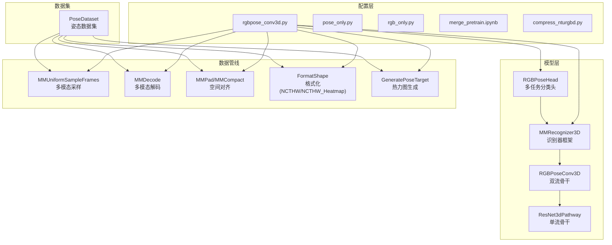
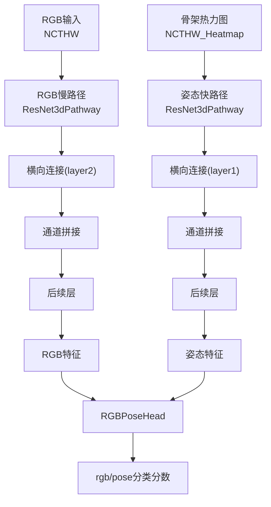
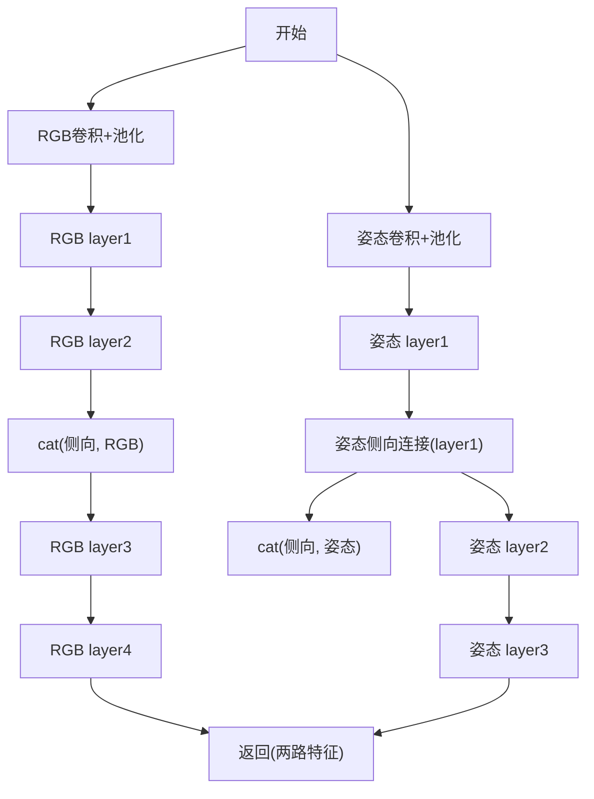
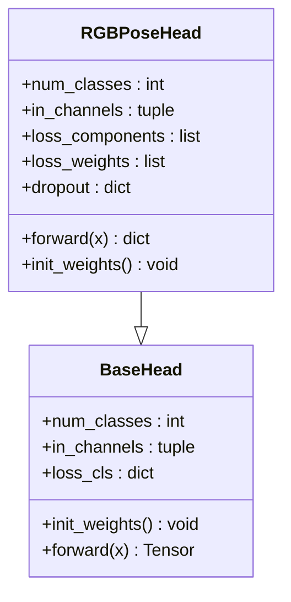
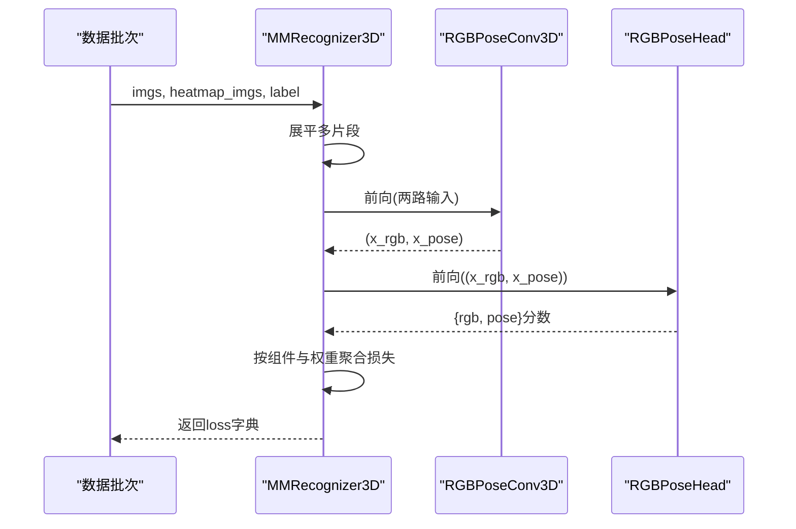
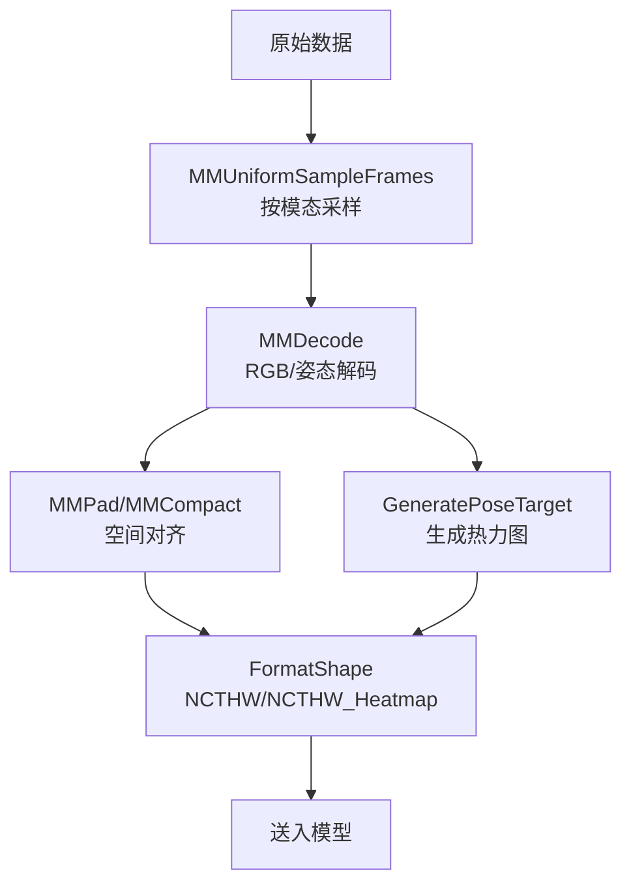
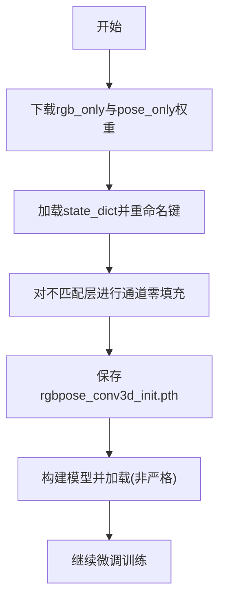
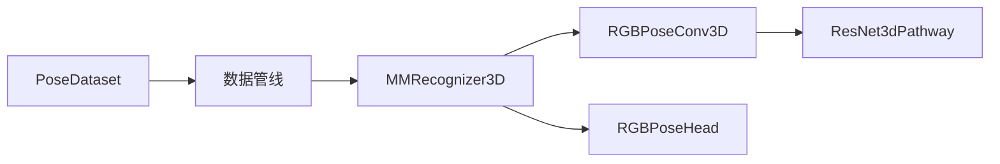

# 混合模态融合

<cite>
**本文引用的文件**
- [configs/rgbpose_conv3d/rgbpose_conv3d.py](file://configs/rgbpose_conv3d/rgbpose_conv3d.py)
- [configs/rgbpose_conv3d/merge_pretrain.ipynb](file://configs/rgbpose_conv3d/merge_pretrain.ipynb)
- [configs/rgbpose_conv3d/pose_only.py](file://configs/rgbpose_conv3d/pose_only.py)
- [configs/rgbpose_conv3d/rgb_only.py](file://configs/rgbpose_conv3d/rgb_only.py)
- [configs/rgbpose_conv3d/compress_nturgbd.py](file://configs/rgbpose_conv3d/compress_nturgbd.py)
- [pyskl/models/cnns/rgbposeconv3d.py](file://pyskl/models/cnns/rgbposeconv3d.py)
- [pyskl/models/cnns/resnet3d_slowfast.py](file://pyskl/models/cnns/resnet3d_slowfast.py)
- [pyskl/models/heads/rgbpose_head.py](file://pyskl/models/heads/rgbpose_head.py)
- [pyskl/models/recognizers/mm_recognizer3d.py](file://pyskl/models/recognizers/mm_recognizer3d.py)
- [pyskl/datasets/pipelines/multi_modality.py](file://pyskl/datasets/pipelines/multi_modality.py)
- [pyskl/datasets/pipelines/formatting.py](file://pyskl/datasets/pipelines/formatting.py)
- [pyskl/datasets/pipelines/heatmap_related.py](file://pyskl/datasets/pipelines/heatmap_related.py)
- [pyskl/datasets/pose_dataset.py](file://pyskl/datasets/pose_dataset.py)
</cite>

## 目录
1. [引言](#引言)
2. [项目结构](#项目结构)
3. [核心组件](#核心组件)
4. [架构总览](#架构总览)
5. [详细组件分析](#详细组件分析)
6. [依赖关系分析](#依赖关系分析)
7. [性能与优化](#性能与优化)
8. [故障排查指南](#故障排查指南)
9. [结论](#结论)
10. [附录](#附录)

## 引言
本文件面向PySKL中的RGBPoseConv3D混合模态融合系统，围绕以下目标展开：系统化阐述RGB图像与骨架数据的特征提取、双流主干网络的横向连接与特征融合机制、多模态注意力与时空一致性保障、预训练权重合并与微调流程、模态贡献度与权重平衡策略，以及在NTU RGB+D等数据集上的实验与对比分析方法。文档力求在不直接粘贴代码的前提下，通过路径引用与可视化图示帮助读者快速理解并高效复用该模块。

## 项目结构
与RGBPoseConv3D相关的核心目录与文件如下：
- 配置层：提供训练/测试配置、预训练权重合并脚本与数据压缩工具
- 模型层：双流骨干网络、分类头、识别器框架
- 数据管线：多模态采样、解码、热力图生成与格式化
- 数据集封装：姿态数据集加载与切分

**图表来源**
- [configs/rgbpose_conv3d/rgbpose_conv3d.py](file://configs/rgbpose_conv3d/rgbpose_conv3d.py#L1-L107)
- [pyskl/models/cnns/rgbposeconv3d.py](file://pyskl/models/cnns/rgbposeconv3d.py#L12-L181)
- [pyskl/models/cnns/resnet3d_slowfast.py](file://pyskl/models/cnns/resnet3d_slowfast.py#L59-L258)
- [pyskl/models/heads/rgbpose_head.py](file://pyskl/models/heads/rgbpose_head.py#L1-L80)
- [pyskl/models/recognizers/mm_recognizer3d.py](file://pyskl/models/recognizers/mm_recognizer3d.py#L1-L62)
- [pyskl/datasets/pipelines/multi_modality.py](file://pyskl/datasets/pipelines/multi_modality.py#L58-L130)
- [pyskl/datasets/pipelines/formatting.py](file://pyskl/datasets/pipelines/formatting.py#L207-L237)
- [pyskl/datasets/pipelines/heatmap_related.py](file://pyskl/datasets/pipelines/heatmap_related.py#L87-L178)
- [pyskl/datasets/pose_dataset.py](file://pyskl/datasets/pose_dataset.py#L10-L107)

**章节来源**
- [configs/rgbpose_conv3d/rgbpose_conv3d.py](file://configs/rgbpose_conv3d/rgbpose_conv3d.py#L1-L107)
- [pyskl/models/cnns/rgbposeconv3d.py](file://pyskl/models/cnns/rgbposeconv3d.py#L12-L181)
- [pyskl/models/recognizers/mm_recognizer3d.py](file://pyskl/models/recognizers/mm_recognizer3d.py#L1-L62)

## 核心组件
- 双流骨干网络RGBPoseConv3D：采用ResNet3dPathway构建RGB慢路径与姿态快路径，通过横向连接实现跨模态特征交互与融合。
- 多任务分类头RGBPoseHead：分别输出RGB与姿态分支的分类分数，并支持按组件加权。
- 识别器框架MMRecognizer3D：统一训练/推理入口，负责前向传播、损失聚合与测试平均。
- 多模态数据管线：MMUniformSampleFrames、MMDecode、MMPad/MMCompact、FormatShape、GeneratePoseTarget等，确保时间同步、空间对齐与热力图生成。
- 数据集PoseDataset：加载标注、划分数据集切分并提供基础元信息。

**章节来源**
- [pyskl/models/cnns/rgbposeconv3d.py](file://pyskl/models/cnns/rgbposeconv3d.py#L12-L181)
- [pyskl/models/heads/rgbpose_head.py](file://pyskl/models/heads/rgbpose_head.py#L1-L80)
- [pyskl/models/recognizers/mm_recognizer3d.py](file://pyskl/models/recognizers/mm_recognizer3d.py#L1-L62)
- [pyskl/datasets/pipelines/multi_modality.py](file://pyskl/datasets/pipelines/multi_modality.py#L58-L130)
- [pyskl/datasets/pose_dataset.py](file://pyskl/datasets/pose_dataset.py#L10-L107)

## 架构总览
RGBPoseConv3D以“慢-快”双流为主干，RGB路径关注空间纹理与深层语义，姿态路径聚焦时间变化与人体结构。骨干输出经由横向连接在关键层进行跨模态融合，随后送入RGBPoseHead进行多任务分类。

**图表来源**
- [pyskl/models/cnns/rgbposeconv3d.py](file://pyskl/models/cnns/rgbposeconv3d.py#L102-L171)
- [pyskl/models/cnns/resnet3d_slowfast.py](file://pyskl/models/cnns/resnet3d_slowfast.py#L59-L166)
- [pyskl/models/heads/rgbpose_head.py](file://pyskl/models/heads/rgbpose_head.py#L59-L79)

## 详细组件分析

### RGBPoseConv3D：双流骨干与横向连接
- 结构要点
  - RGB慢路径：标准ResNet阶段，配合横向连接，强调空间与语义层次。
  - 姿态快路径：轻量化设计，突出时间维度变化。
  - 横向连接：在layer2/layer3（RGB）与layer1/layer2（姿态）之间建立跨模态特征交互，融合后沿通道维拼接。
  - 训练时可启用随机深度丢弃，提升泛化。
- 关键参数
  - speed_ratio、channel_ratio控制时间与通道缩放。
  - lateral/lateral_infl/lateral_activate决定横向连接的启用与强度。
- 前向流程
  - 分别对RGB图像与骨架热力图进行卷积与池化。
  - 逐层执行各路径主干，按需注入来自另一路径的横向特征。
  - 返回两路特征以供头部使用。

**图表来源**
- [pyskl/models/cnns/rgbposeconv3d.py](file://pyskl/models/cnns/rgbposeconv3d.py#L102-L171)

**章节来源**
- [pyskl/models/cnns/rgbposeconv3d.py](file://pyskl/models/cnns/rgbposeconv3d.py#L25-L79)
- [pyskl/models/cnns/rgbposeconv3d.py](file://pyskl/models/cnns/rgbposeconv3d.py#L102-L171)
- [pyskl/models/cnns/resnet3d_slowfast.py](file://pyskl/models/cnns/resnet3d_slowfast.py#L59-L166)

### RGBPoseHead：多任务分类与损失加权
- 功能概述
  - 对两路特征分别进行全局平均池化与线性分类。
  - 支持按组件设置独立dropout与损失权重。
  - 输出字典形式的分类分数，便于多任务损失聚合。
- 训练集成
  - 识别器在forward_train中按loss_components与loss_weights对各子任务损失加权求和。

**图表来源**
- [pyskl/models/heads/rgbpose_head.py](file://pyskl/models/heads/rgbpose_head.py#L21-L79)
- [pyskl/models/heads/base.py](file://pyskl/models/heads/base.py)

**章节来源**
- [pyskl/models/heads/rgbpose_head.py](file://pyskl/models/heads/rgbpose_head.py#L21-L79)
- [pyskl/models/recognizers/mm_recognizer3d.py](file://pyskl/models/recognizers/mm_recognizer3d.py#L26-L34)

### MMRecognizer3D：训练/推理与损失聚合
- 训练流程
  - 将batch内多片段展平，调用backbone获取两路特征。
  - 交由head得到多任务分数，按组件与权重聚合损失。
- 测试流程
  - 按测试配置对各组件分数做片段平均，输出预测。

**图表来源**
- [pyskl/models/recognizers/mm_recognizer3d.py](file://pyskl/models/recognizers/mm_recognizer3d.py#L9-L34)

**章节来源**
- [pyskl/models/recognizers/mm_recognizer3d.py](file://pyskl/models/recognizers/mm_recognizer3d.py#L9-L61)

### 多模态数据管线：时间同步、空间对齐与热力图生成
- 时间同步
  - MMUniformSampleFrames支持按模态指定clip_len，确保RGB与姿态采样长度一致。
- 空间对齐
  - MMPad/MMCompact对关键点与图像进行填充与裁剪，保证尺度与中心一致。
- 解码与热力图
  - MMDecode根据模态读取RGB视频或骨架序列；GeneratePoseTarget将关键点转为伪热力图；FormatShape将输出格式化为NCTHW或NCTHW_Heatmap。

**图表来源**
- [pyskl/datasets/pipelines/multi_modality.py](file://pyskl/datasets/pipelines/multi_modality.py#L58-L129)
- [pyskl/datasets/pipelines/formatting.py](file://pyskl/datasets/pipelines/formatting.py#L207-L237)
- [pyskl/datasets/pipelines/heatmap_related.py](file://pyskl/datasets/pipelines/heatmap_related.py#L87-L178)

**章节来源**
- [pyskl/datasets/pipelines/multi_modality.py](file://pyskl/datasets/pipelines/multi_modality.py#L58-L130)
- [pyskl/datasets/pipelines/formatting.py](file://pyskl/datasets/pipelines/formatting.py#L207-L237)
- [pyskl/datasets/pipelines/heatmap_related.py](file://pyskl/datasets/pipelines/heatmap_related.py#L87-L178)

### 预训练权重合并与微调
- 目标
  - 将仅RGB或仅姿态的预训练权重迁移到RGBPoseConv3D双流结构，实现初始化与快速收敛。
- 步骤
  - 加载rgb_only.pth与pose_only.pth，重命名键名以匹配双流模块前缀。
  - 对因横向连接导致的通道不匹配处进行零填充扩展。
  - 保存合并后的state_dict并加载到模型，strict=False以忽略缺失的侧向连接参数。
- 微调建议
  - 初始学习率略低于单模态，结合梯度裁剪与余弦退火策略。
  - 可先冻结部分浅层以稳定迁移，再逐步解冻。

**图表来源**
- [configs/rgbpose_conv3d/merge_pretrain.ipynb](file://configs/rgbpose_conv3d/merge_pretrain.ipynb#L55-L154)

**章节来源**
- [configs/rgbpose_conv3d/merge_pretrain.ipynb](file://configs/rgbpose_conv3d/merge_pretrain.ipynb#L55-L154)

### 模态贡献度分析与权重平衡
- 贡献度评估
  - 通过分别训练rgb_only与pose_only模型，记录其在验证集上的Top-1/Top-5指标，作为基线。
  - 在RGBPoseConv3D中调整loss_weights与dropout，观察对整体性能的影响。
- 权重平衡策略
  - 若姿态数据相对稀疏，可提高pose分支损失权重；若RGB分辨率较低，可适度降低rgb权重。
  - 可引入动态权重：基于样本级KL散度或特征分布差异自适应调整。

**章节来源**
- [configs/rgbpose_conv3d/rgbpose_conv3d.py](file://configs/rgbpose_conv3d/rgbpose_conv3d.py#L30-L35)
- [pyskl/models/heads/rgbpose_head.py](file://pyskl/models/heads/rgbpose_head.py#L40-L45)

### 实验与对比分析方法
- 数据集与划分
  - 使用NTU RGB+D等数据集，按xsub/xview/xset划分进行训练/验证/测试。
- 指标体系
  - Top-1 Accuracy、Mean Class Accuracy，以及关键指标的Top-k统计。
- 对比组
  - 单模态：仅RGB或仅姿态。
  - 双流：RGBPoseConv3D（含/不含横向连接）。
  - 其他融合方法：如早期拼接、注意力门控等（可扩展）。
- 可视化与分析
  - 训练曲线、混淆矩阵、类别表现直方图。
  - 可选：注意力热力图（若引入注意力模块）。

**章节来源**
- [configs/rgbpose_conv3d/rgbpose_conv3d.py](file://configs/rgbpose_conv3d/rgbpose_conv3d.py#L43-L104)
- [configs/rgbpose_conv3d/pose_only.py](file://configs/rgbpose_conv3d/pose_only.py#L22-L79)
- [configs/rgbpose_conv3d/rgb_only.py](file://configs/rgbpose_conv3d/rgb_only.py#L15-L74)

## 依赖关系分析
- 组件耦合
  - MMRecognizer3D依赖RGBPoseConv3D与RGBPoseHead；RGBPoseConv3D依赖ResNet3dPathway。
  - 数据管线贯穿于训练/验证/测试全流程，与模型输入格式强耦合。
- 外部依赖
  - mmcv/torch等基础库；FFmpeg用于视频压缩；OpenMMLab生态组件。

**图表来源**
- [pyskl/models/recognizers/mm_recognizer3d.py](file://pyskl/models/recognizers/mm_recognizer3d.py#L1-L62)
- [pyskl/models/cnns/rgbposeconv3d.py](file://pyskl/models/cnns/rgbposeconv3d.py#L12-L181)
- [pyskl/models/cnns/resnet3d_slowfast.py](file://pyskl/models/cnns/resnet3d_slowfast.py#L59-L258)
- [pyskl/models/heads/rgbpose_head.py](file://pyskl/models/heads/rgbpose_head.py#L1-L80)
- [pyskl/datasets/pipelines/multi_modality.py](file://pyskl/datasets/pipelines/multi_modality.py#L1-L230)
- [pyskl/datasets/pose_dataset.py](file://pyskl/datasets/pose_dataset.py#L10-L107)

**章节来源**
- [pyskl/models/recognizers/mm_recognizer3d.py](file://pyskl/models/recognizers/mm_recognizer3d.py#L1-L62)
- [pyskl/models/cnns/rgbposeconv3d.py](file://pyskl/models/cnns/rgbposeconv3d.py#L12-L181)
- [pyskl/datasets/pipelines/multi_modality.py](file://pyskl/datasets/pipelines/multi_modality.py#L1-L230)

## 性能与优化
- 计算效率
  - 姿态快路径通道数较小，显著降低计算开销；横向连接在关键层进行，避免全链路冗余。
- 训练稳定性
  - 预训练权重初始化与零填充策略有助于收敛；随机深度丢弃与Dropout提升鲁棒性。
- 推理加速
  - 可考虑对姿态热力图降采样或减少通道数；在部署阶段可融合分支特征以减少后处理成本。

[本节为通用指导，无需特定文件引用]

## 故障排查指南
- 形状不匹配
  - 症状：加载权重时报错或初始化失败。
  - 排查：确认横向连接导致的通道扩展是否正确完成；检查通道缩放与融合顺序。
- 缺失键警告
  - 症状：加载合并权重时出现missing_keys。
  - 排查：侧向连接模块在双流结构中可能不存在，属预期；若为关键层缺失需检查键名映射。
- 视频解码问题
  - 症状：RGB视频读取失败或尺寸异常。
  - 排查：确认FFmpeg可用与路径正确；使用compress_nturgbd.py批量压缩视频以统一格式。
- 热力图质量差
  - 症状：GeneratePoseTarget生成热力图模糊或缺失。
  - 排查：检查关键点归一化与尺度缩放；确认sigma与scaling参数合理。

**章节来源**
- [configs/rgbpose_conv3d/merge_pretrain.ipynb](file://configs/rgbpose_conv3d/merge_pretrain.ipynb#L137-L154)
- [configs/rgbpose_conv3d/compress_nturgbd.py](file://configs/rgbpose_conv3d/compress_nturgbd.py#L1-L36)
- [pyskl/datasets/pipelines/heatmap_related.py](file://pyskl/datasets/pipelines/heatmap_related.py#L87-L178)

## 结论
RGBPoseConv3D通过双流骨干与横向连接实现了RGB与姿态的深度融合，在保持姿态分支轻量化的同时保留了RGB的丰富纹理信息。借助规范化的数据管线与预训练权重合并策略，系统可在多种数据集上取得稳健的性能。未来可探索动态权重分配、注意力增强与更精细的时空对齐策略以进一步提升表现。

[本节为总结性内容，无需特定文件引用]

## 附录
- 数据压缩工具：compress_nturgbd.py用于批量压缩NTU RGB+D视频，提升IO效率。
- 单模态配置参考：pose_only.py与rgb_only.py提供独立训练的完整配置模板。

**章节来源**
- [configs/rgbpose_conv3d/compress_nturgbd.py](file://configs/rgbpose_conv3d/compress_nturgbd.py#L1-L36)
- [configs/rgbpose_conv3d/pose_only.py](file://configs/rgbpose_conv3d/pose_only.py#L1-L80)
- [configs/rgbpose_conv3d/rgb_only.py](file://configs/rgbpose_conv3d/rgb_only.py#L1-L75)