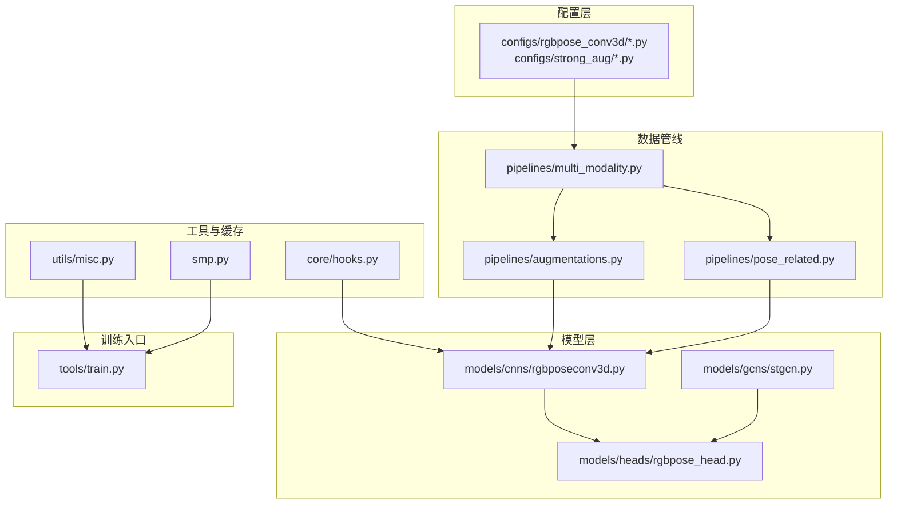
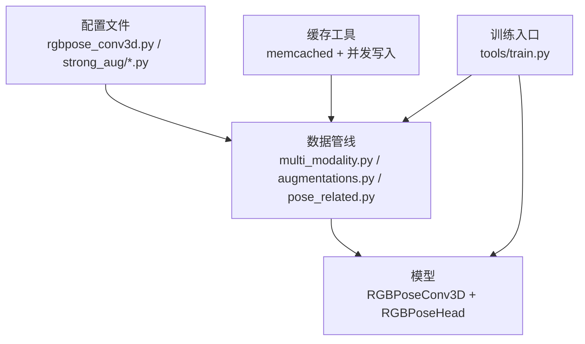
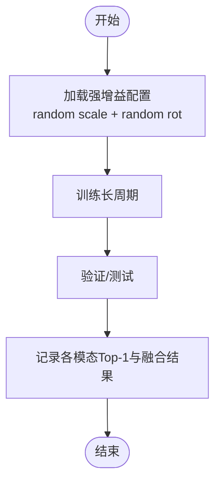
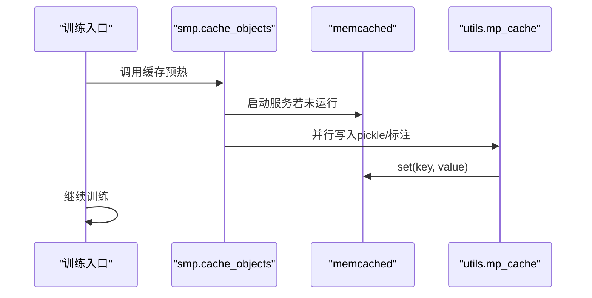
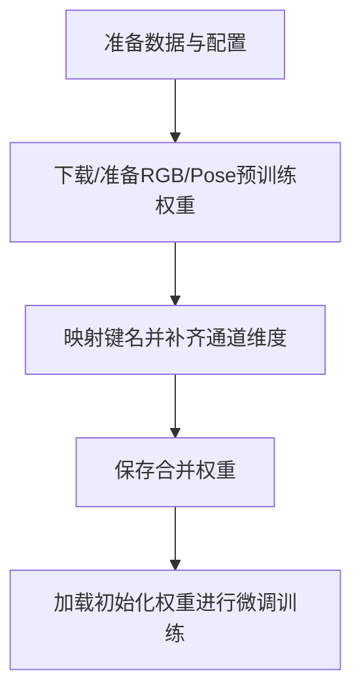
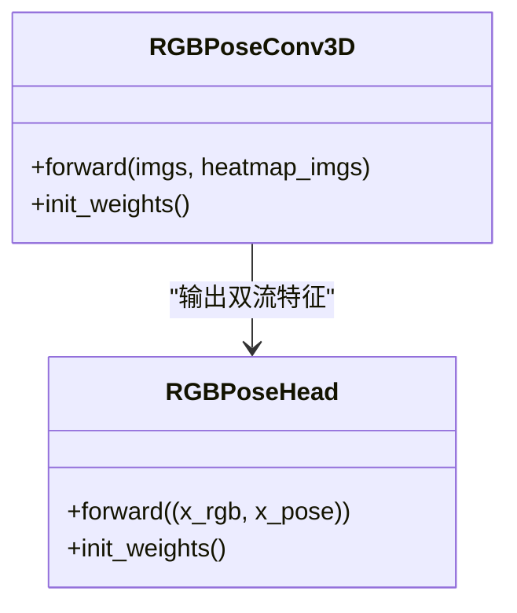
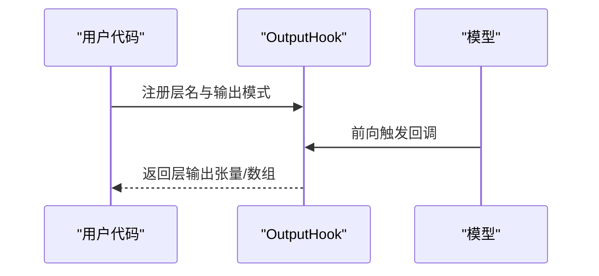
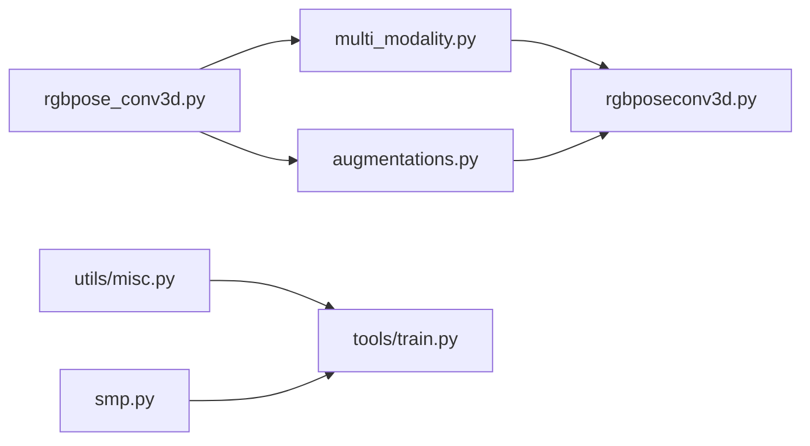

# 高级功能

<cite>
**本文引用的文件**
- [configs/rgbpose_conv3d/rgbpose_conv3d.py](file://configs/rgbpose_conv3d/rgbpose_conv3d.py)
- [configs/rgbpose_conv3d/merge_pretrain.ipynb](file://configs/rgbpose_conv3d/merge_pretrain.ipynb)
- [configs/rgbpose_conv3d/compress_nturgbd.py](file://configs/rgbpose_conv3d/compress_nturgbd.py)
- [configs/strong_aug/README.md](file://configs/strong_aug/README.md)
- [configs/strong_aug/ntu60_xsub_3dkp/b.py](file://configs/strong_aug/ntu60_xsub_3dkp/b.py)
- [pyskl/models/cnns/rgbposeconv3d.py](file://pyskl/models/cnns/rgbposeconv3d.py)
- [pyskl/datasets/pipelines/augmentations.py](file://pyskl/datasets/pipelines/augmentations.py)
- [pyskl/datasets/pipelines/multi_modality.py](file://pyskl/datasets/pipelines/multi_modality.py)
- [pyskl/models/heads/rgbpose_head.py](file://pyskl/models/heads/rgbpose_head.py)
- [pyskl/utils/misc.py](file://pyskl/utils/misc.py)
- [pyskl/smp.py](file://pyskl/smp.py)
- [pyskl/core/hooks.py](file://pyskl/core/hooks.py)
- [pyskl/datasets/pipelines/pose_related.py](file://pyskl/datasets/pipelines/pose_related.py)
- [pyskl/models/gcns/stgcn.py](file://pyskl/models/gcns/stgcn.py)
</cite>

## 目录
1. [简介](#简介)
2. [项目结构](#项目结构)
3. [核心组件](#核心组件)
4. [架构总览](#架构总览)
5. [详细组件分析](#详细组件分析)
6. [依赖关系分析](#依赖关系分析)
7. [性能考量](#性能考量)
8. [故障排查指南](#故障排查指南)
9. [结论](#结论)
10. [附录](#附录)

## 简介
本文件面向PySKL高级用户，系统化梳理以下主题：
- 强化数据增强：strong_aug配置与策略选择、评估方法
- 模型编译优化：PyTorch 2.x torch.compile支持与配置要点
- 内存缓存机制：数据缓存策略、内存管理与缓存命中率优化
- RGBPoseConv3D高级用法：训练、预训练权重合并、NTURGBD数据压缩
- 混合模态融合：RGB与骨架特征融合、注意力机制、多模态权重平衡
- 性能监控与调试：输出Hook、参数与FLOPs统计、日志与可视化
- 扩展开发：自定义算法集成、新数据集适配、性能调优技巧

## 项目结构
围绕“高级功能”目标，重点目录与文件如下：
- 配置层：configs/rgbpose_conv3d、configs/strong_aug
- 数据管线：pyskl/datasets/pipelines（多模态采样、解码、增强）
- 模型层：pyskl/models/cnns、pyskl/models/heads、pyskl/models/gcns
- 工具与缓存：pyskl/utils/misc.py、pyskl/smp.py
- 训练与推理：tools/train.py（含memcached启动）、apis/inference.py（可参考）

**图表来源**
- [configs/rgbpose_conv3d/rgbpose_conv3d.py](file://configs/rgbpose_conv3d/rgbpose_conv3d.py#L1-L107)
- [configs/strong_aug/README.md](file://configs/strong_aug/README.md#L1-L38)
- [pyskl/datasets/pipelines/multi_modality.py](file://pyskl/datasets/pipelines/multi_modality.py#L58-L129)
- [pyskl/datasets/pipelines/augmentations.py](file://pyskl/datasets/pipelines/augmentations.py#L119-L605)
- [pyskl/datasets/pipelines/pose_related.py](file://pyskl/datasets/pipelines/pose_related.py#L147-L432)
- [pyskl/models/cnns/rgbposeconv3d.py](file://pyskl/models/cnns/rgbposeconv3d.py#L12-L181)
- [pyskl/models/heads/rgbpose_head.py](file://pyskl/models/heads/rgbpose_head.py#L8-L80)
- [pyskl/utils/misc.py](file://pyskl/utils/misc.py#L18-L125)
- [pyskl/smp.py](file://pyskl/smp.py#L167-L183)
- [pyskl/core/hooks.py](file://pyskl/core/hooks.py#L7-L68)

**章节来源**
- [configs/rgbpose_conv3d/rgbpose_conv3d.py](file://configs/rgbpose_conv3d/rgbpose_conv3d.py#L1-L107)
- [configs/strong_aug/README.md](file://configs/strong_aug/README.md#L1-L38)
- [pyskl/datasets/pipelines/multi_modality.py](file://pyskl/datasets/pipelines/multi_modality.py#L58-L129)
- [pyskl/datasets/pipelines/augmentations.py](file://pyskl/datasets/pipelines/augmentations.py#L119-L605)
- [pyskl/datasets/pipelines/pose_related.py](file://pyskl/datasets/pipelines/pose_related.py#L147-L432)
- [pyskl/models/cnns/rgbposeconv3d.py](file://pyskl/models/cnns/rgbposeconv3d.py#L12-L181)
- [pyskl/models/heads/rgbpose_head.py](file://pyskl/models/heads/rgbpose_head.py#L8-L80)
- [pyskl/utils/misc.py](file://pyskl/utils/misc.py#L18-L125)
- [pyskl/smp.py](file://pyskl/smp.py#L167-L183)
- [pyskl/core/hooks.py](file://pyskl/core/hooks.py#L7-L68)

## 核心组件
- RGBPoseConv3D双流主干：慢速RGB路径与快速姿态路径，支持横向连接、通道缩减、速度比与丢弃路径等高级配置
- RGBPoseHead分类头：分别对RGB与姿态特征做分类，支持组件损失权重与Dropout
- 多模态数据管线：统一采样、解码（视频与骨架）、紧凑化、增强与格式化
- 强化空间增强：随机缩放、旋转等策略在强增益配置中使用
- 内存缓存：基于memcached的预取与并发写入，提升数据加载吞吐
- 性能监控：输出Hook与参数/FLOPs统计工具

**章节来源**
- [pyskl/models/cnns/rgbposeconv3d.py](file://pyskl/models/cnns/rgbposeconv3d.py#L12-L181)
- [pyskl/models/heads/rgbpose_head.py](file://pyskl/models/heads/rgbpose_head.py#L8-L80)
- [pyskl/datasets/pipelines/multi_modality.py](file://pyskl/datasets/pipelines/multi_modality.py#L58-L129)
- [configs/strong_aug/README.md](file://configs/strong_aug/README.md#L1-L38)

## 架构总览
下图展示从配置到模型、数据管线与缓存的整体交互。

**图表来源**
- [configs/rgbpose_conv3d/rgbpose_conv3d.py](file://configs/rgbpose_conv3d/rgbpose_conv3d.py#L37-L107)
- [configs/strong_aug/ntu60_xsub_3dkp/b.py](file://configs/strong_aug/ntu60_xsub_3dkp/b.py#L1-L66)
- [pyskl/datasets/pipelines/multi_modality.py](file://pyskl/datasets/pipelines/multi_modality.py#L58-L129)
- [pyskl/datasets/pipelines/augmentations.py](file://pyskl/datasets/pipelines/augmentations.py#L119-L605)
- [pyskl/datasets/pipelines/pose_related.py](file://pyskl/datasets/pipelines/pose_related.py#L147-L432)
- [pyskl/utils/misc.py](file://pyskl/utils/misc.py#L18-L125)
- [tools/train.py](file://tools/train.py#L142-L164)

## 详细组件分析

### 强化数据增强（strong_aug）
- 配置与策略
  - 在strong_aug配置中采用随机缩放与旋转等空间增强，结合长周期训练与两路/四路融合策略
  - 学习率按批次大小线性缩放；两路融合采用1:1，四路融合采用2:2:1:1
- 使用方法
  - 选择对应数据集与注释（NTURGB+D 60/120 XSub/XView），加载相应配置文件
  - 训练与测试流程遵循对应README指引
- 效果评估
  - 关注Joint/Bone/JointMotion/BoneMotion等子模态Top-1指标，以及Two-Stream/Four-Stream综合表现

**图表来源**
- [configs/strong_aug/README.md](file://configs/strong_aug/README.md#L18-L38)
- [configs/strong_aug/ntu60_xsub_3dkp/b.py](file://configs/strong_aug/ntu60_xsub_3dkp/b.py#L13-L41)

**章节来源**
- [configs/strong_aug/README.md](file://configs/strong_aug/README.md#L1-L38)
- [configs/strong_aug/ntu60_xsub_3dkp/b.py](file://configs/strong_aug/ntu60_xsub_3dkp/b.py#L1-L66)

### 模型编译优化（PyTorch 2.x torch.compile）
- 支持现状
  - PySKL基于OpenMMLab生态，torch.compile在部分场景可直接应用；需确保后端兼容与算子覆盖
- 配置要点
  - 将模型置于torch.compile上下文中，注意静态图限制（如动态分支、动态形状）
  - 对于RGBPoseConv3D等双流结构，建议先冻结部分模块或固定输入尺寸以提升编译成功率
- 性能提升
  - 编译后通常带来内核融合、图优化收益；需结合具体硬件与数据类型评估加速比
- 注意事项
  - 部分第三方算子可能不被编译器支持，需回退或替换
  - 调试阶段建议关闭编译以保证错误定位清晰

[本节为通用实践建议，不直接分析具体代码文件]

### 内存缓存机制（memcached）
- 设计目标
  - 通过预取与并发写入，将标注/元数据缓存至本地memcached，降低I/O瓶颈，提升训练吞吐
- 关键流程
  - 启动memcached服务（默认端口与内存大小可配置）
  - 并行遍历pickle文件或标注列表，批量写入缓存
  - 训练前检测端口可用性，失败则重试或报错
- 缓存命中率提升
  - 合理设置缓存容量与最小块大小
  - 预热：训练前一次性写入全部数据
  - 并发度：根据CPU核数与磁盘IO能力调整进程数
- 相关接口
  - 启停：mc_on、mc_off
  - 写入：mp_cache、mp_cache_single、cache_file
  - 校验：test_port
  - 训练入口自动预热：tools/train.py中的memcached启动逻辑

**图表来源**
- [pyskl/smp.py](file://pyskl/smp.py#L167-L183)
- [pyskl/utils/misc.py](file://pyskl/utils/misc.py#L18-L84)
- [tools/train.py](file://tools/train.py#L142-L164)

**章节来源**
- [pyskl/utils/misc.py](file://pyskl/utils/misc.py#L18-L125)
- [pyskl/smp.py](file://pyskl/smp.py#L167-L183)
- [tools/train.py](file://tools/train.py#L142-L164)

### RGBPoseConv3D高级使用指南
- 模型训练
  - 使用rgbpose_conv3d.py配置，指定backbone为RGBPoseConv3D，head为RGBPoseHead
  - 设置训练超参（学习率、优化器、学习率调度、epoch、日志与工作目录）
- 预训练权重合并
  - 使用merge_pretrain.ipynb将RGB与Pose各自预训练权重映射到双流结构，并补齐通道维度差异
  - 保存合并后的初始化权重供后续微调
- NTURGBD数据压缩
  - 使用compress_nturgbd.py批量将原始AVI视频压缩为MP4，统一分辨率与质量，减少存储与I/O开销

**图表来源**
- [configs/rgbpose_conv3d/merge_pretrain.ipynb](file://configs/rgbpose_conv3d/merge_pretrain.ipynb#L23-L134)
- [configs/rgbpose_conv3d/compress_nturgbd.py](file://configs/rgbpose_conv3d/compress_nturgbd.py#L14-L35)
- [configs/rgbpose_conv3d/rgbpose_conv3d.py](file://configs/rgbpose_conv3d/rgbpose_conv3d.py#L37-L107)

**章节来源**
- [configs/rgbpose_conv3d/rgbpose_conv3d.py](file://configs/rgbpose_conv3d/rgbpose_conv3d.py#L1-L107)
- [configs/rgbpose_conv3d/merge_pretrain.ipynb](file://configs/rgbpose_conv3d/merge_pretrain.ipynb#L1-L192)
- [configs/rgbpose_conv3d/compress_nturgbd.py](file://configs/rgbpose_conv3d/compress_nturgbd.py#L1-L36)

### 混合模态融合（RGB + 骨架）
- 特征融合
  - RGBPoseConv3D双流分别提取RGB与姿态特征，通过横向连接与通道拼接实现跨模态信息交互
  - RGBPoseHead对两路特征分别全连接并加权融合，支持组件损失权重与Dropout
- 注意力机制
  - GCN系列模型（如ST-GCN）内置空间/时间注意力模块，可选用于骨架特征增强
- 权重平衡
  - 通过RGBPoseHead.loss_weights与loss_components控制不同模态的损失占比，结合强增益配置进行联合优化

**图表来源**
- [pyskl/models/cnns/rgbposeconv3d.py](file://pyskl/models/cnns/rgbposeconv3d.py#L102-L171)
- [pyskl/models/heads/rgbpose_head.py](file://pyskl/models/heads/rgbpose_head.py#L59-L79)

**章节来源**
- [pyskl/models/cnns/rgbposeconv3d.py](file://pyskl/models/cnns/rgbposeconv3d.py#L12-L181)
- [pyskl/models/heads/rgbpose_head.py](file://pyskl/models/heads/rgbpose_head.py#L8-L80)
- [pyskl/models/gcns/stgcn.py](file://pyskl/models/gcns/stgcn.py#L13-L138)

### 性能监控与调试工具
- 输出Hook
  - 通过OutputHook注册模型前向钩子，收集指定层特征图，支持张量或numpy数组两种输出形式
- 参数与FLOPs统计
  - 使用smp.fnp对模型参数量与FLOPs进行打印，辅助算力评估与模型规模对比
- 日志与可视化
  - 训练配置中启用TextLoggerHook，结合work_dir输出训练日志
  - 可结合可视化工具对中间特征进行检查

**图表来源**
- [pyskl/core/hooks.py](file://pyskl/core/hooks.py#L7-L68)
- [pyskl/smp.py](file://pyskl/smp.py#L158-L165)

**章节来源**
- [pyskl/core/hooks.py](file://pyskl/core/hooks.py#L1-L68)
- [pyskl/smp.py](file://pyskl/smp.py#L158-L165)

### 高级用户的扩展开发指导
- 自定义算法集成
  - 在pyskl/models/下新增模块并注册构建器，遵循现有命名与接口约定
  - 在pyskl/datasets/pipelines中扩展新的数据变换，保持与多模态管线兼容
- 新数据集适配
  - 定义数据集类与读取流程，配合MMUniformSampleFrames与MMDecode实现统一采样与解码
  - 使用PoseCompact/Resize/Flip等增强策略，确保RGB与骨架对齐
- 性能调优技巧
  - 利用memcached预热与并发写入，显著降低数据加载等待
  - 结合torch.compile与AMP（混合精度）进一步提速，注意算子兼容性
  - 通过OutputHook与参数/FLOPs统计定位瓶颈，迭代优化模型结构与数据管线

[本节为通用实践建议，不直接分析具体代码文件]

## 依赖关系分析
- 配置到数据管线
  - rgbpose_conv3d.py定义了backbone、head与数据流水线，multi_modality.py负责多模态采样与解码
- 数据管线到模型
  - augmentations.py与pose_related.py提供图像与骨架增强，rgbposeconv3d.py接收RGB与热图输入
- 工具与缓存
  - smp.cache_objects与utils.misc的memcached工具协同，tools/train.py在训练前启动缓存

**图表来源**
- [configs/rgbpose_conv3d/rgbpose_conv3d.py](file://configs/rgbpose_conv3d/rgbpose_conv3d.py#L50-L94)
- [pyskl/datasets/pipelines/multi_modality.py](file://pyskl/datasets/pipelines/multi_modality.py#L58-L129)
- [pyskl/datasets/pipelines/augmentations.py](file://pyskl/datasets/pipelines/augmentations.py#L119-L605)
- [pyskl/models/cnns/rgbposeconv3d.py](file://pyskl/models/cnns/rgbposeconv3d.py#L102-L171)
- [pyskl/utils/misc.py](file://pyskl/utils/misc.py#L18-L125)
- [pyskl/smp.py](file://pyskl/smp.py#L167-L183)
- [tools/train.py](file://tools/train.py#L142-L164)

**章节来源**
- [configs/rgbpose_conv3d/rgbpose_conv3d.py](file://configs/rgbpose_conv3d/rgbpose_conv3d.py#L1-L107)
- [pyskl/datasets/pipelines/multi_modality.py](file://pyskl/datasets/pipelines/multi_modality.py#L58-L129)
- [pyskl/datasets/pipelines/augmentations.py](file://pyskl/datasets/pipelines/augmentations.py#L119-L605)
- [pyskl/utils/misc.py](file://pyskl/utils/misc.py#L18-L125)
- [pyskl/smp.py](file://pyskl/smp.py#L167-L183)
- [tools/train.py](file://tools/train.py#L142-L164)

## 性能考量
- 数据加载
  - 使用memcached预取与并发写入，减少I/O等待；合理设置并发进程数与缓存容量
- 模型结构
  - RGBPoseConv3D的通道缩减与速度比可在精度与速度间折衷；横向连接有助于跨模态信息融合
- 训练策略
  - 强增益配置下的长周期训练与融合策略可显著提升泛化；注意学习率与批次大小的线性缩放
- 监控与评估
  - 通过日志与Hook输出定位瓶颈；利用参数/FLOPs统计评估模型复杂度

[本节为通用性能建议，不直接分析具体代码文件]

## 故障排查指南
- memcached无法启动
  - 检查端口占用与权限；确认mc_on已执行且test_port返回True
  - 若多次重试失败，检查系统资源与防火墙设置
- 数据加载缓慢
  - 确认缓存是否已预热；检查并发进程数与磁盘IO能力
  - 核对数据路径与文件存在性
- 模型训练异常
  - 检查配置项（学习率、优化器、损失权重）与数据管线一致性
  - 使用OutputHook输出中间特征，定位前向异常层
- 预训练权重加载
  - 确保键名映射正确与通道维度补齐；strict=False加载以容忍缺失键

**章节来源**
- [pyskl/utils/misc.py](file://pyskl/utils/misc.py#L18-L125)
- [pyskl/core/hooks.py](file://pyskl/core/hooks.py#L7-L68)
- [configs/rgbpose_conv3d/merge_pretrain.ipynb](file://configs/rgbpose_conv3d/merge_pretrain.ipynb#L152-L154)

## 结论
本文从配置、数据、模型、缓存与监控五个维度系统梳理了PySKL的高级功能。通过合理运用强化数据增强、内存缓存与混合模态融合，结合性能监控与调试工具，可有效提升训练效率与模型性能。对于扩展开发，建议遵循现有模块化结构与构建器约定，确保新算法与数据集的顺利集成。

## 附录
- 相关配置与脚本路径
  - 强增益配置：configs/strong_aug/*
  - RGBPoseConv3D配置与脚本：configs/rgbpose_conv3d/*
  - 数据管线：pyskl/datasets/pipelines/*
  - 模型与头：pyskl/models/cnns/*, pyskl/models/heads/*
  - 工具与缓存：pyskl/utils/misc.py, pyskl/smp.py
  - 训练入口：tools/train.py

[本节为索引汇总，不直接分析具体文件]